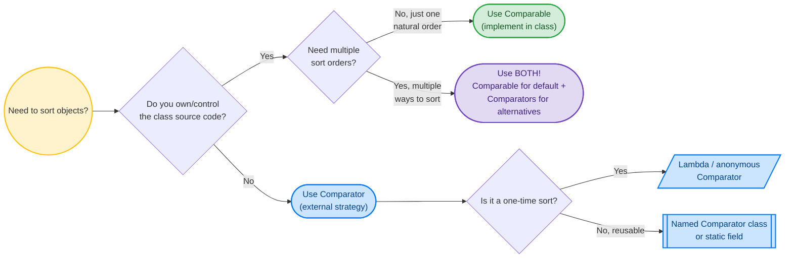
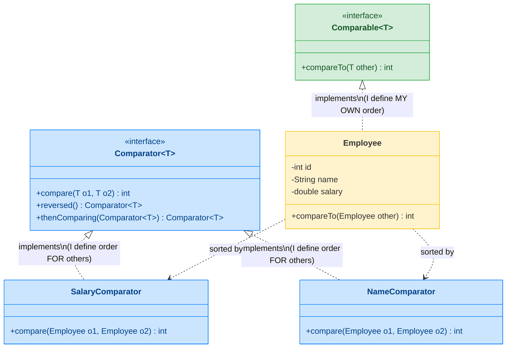
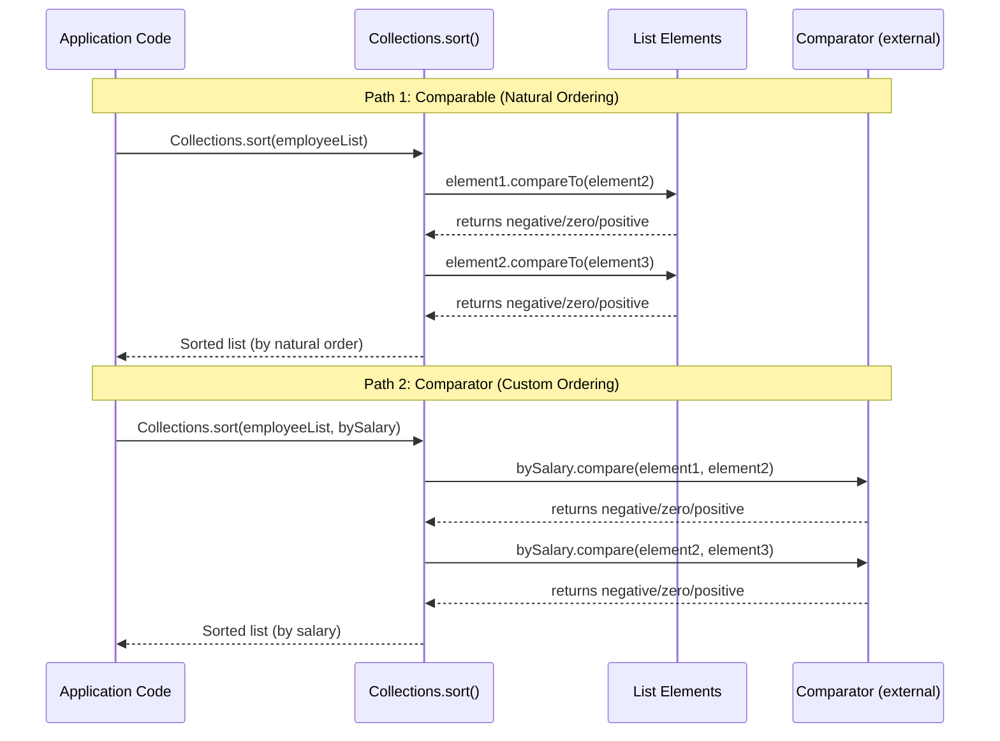
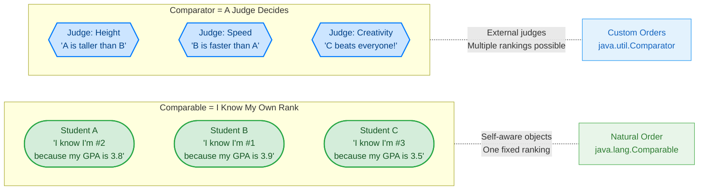

# Comparable vs Comparator in Java

Both are used for **sorting objects**, but they serve different purposes. This is one of the most frequently asked Collections interview questions.

---

## Visual Decision Tree: Which One Should I Use?

Use this flowchart to decide between Comparable and Comparator in any situation:



---

## Interface Relationship Diagram

See how these two interfaces relate to classes differently:



---

## Sorting Flow: How Collections.sort() Works



---

## Real-World Analogy

A fun way to remember the difference forever:



> **Memory trick for interviews:**
>
> - **Comparable** = "Compar-ABLE" = I am ABLE to compare MYSELF (self-contained)
> - **Comparator** = "Compar-ATOR" = an external operATOR that compares others (third party)

---

## Quick Comparison

| Feature | `Comparable` | `Comparator` |
|---|---|---|
| Package | `java.lang` | `java.util` |
| Method | `compareTo(T o)` | `compare(T o1, T o2)` |
| Where defined | Inside the class itself | External / separate class |
| Sorting logic | One natural ordering per class | Multiple custom orderings |
| Modifies class | Yes (implements interface) | No (external strategy) |
| Use with | `Collections.sort(list)` | `Collections.sort(list, comparator)` |

---

## Comparable — Natural Ordering

The class **itself** defines how its objects should be sorted. One sorting logic per class.

```java
public class Employee implements Comparable<Employee> {
    private int id;
    private String name;
    private double salary;

    @Override
    public int compareTo(Employee other) {
        return Integer.compare(this.id, other.id);  // sort by id (natural order)
    }
}

List<Employee> employees = getEmployees();
Collections.sort(employees);  // uses compareTo() — sorts by id
```

### Return value rules

| Return | Meaning |
|---|---|
| Negative (`< 0`) | `this` comes **before** `other` |
| Zero (`0`) | `this` and `other` are **equal** |
| Positive (`> 0`) | `this` comes **after** `other` |

### Classes that implement Comparable

`String`, `Integer`, `Double`, `LocalDate`, `BigDecimal` — all have natural ordering built in.

```java
List<String> names = List.of("Charlie", "Alice", "Bob");
Collections.sort(names);  // [Alice, Bob, Charlie] — String's natural order
```

---

## Comparator — Custom / Multiple Orderings

Defined **outside** the class. You can create many different sorting strategies.

```java
// Sort by name
Comparator<Employee> byName = (e1, e2) -> e1.getName().compareTo(e2.getName());

// Sort by salary (descending)
Comparator<Employee> bySalaryDesc = (e1, e2) -> Double.compare(e2.getSalary(), e1.getSalary());

// Sort by department, then by name within department
Comparator<Employee> byDeptThenName = Comparator
    .comparing(Employee::getDepartment)
    .thenComparing(Employee::getName);

Collections.sort(employees, byName);
Collections.sort(employees, bySalaryDesc);
Collections.sort(employees, byDeptThenName);
```

---

## Modern Comparator API (Java 8+)

Java 8 added powerful factory methods to `Comparator`:

```java
// Simple field comparison
Comparator.comparing(Employee::getSalary)

// Reverse order
Comparator.comparing(Employee::getSalary).reversed()

// Chain comparisons (sort by dept, then salary desc, then name)
Comparator.comparing(Employee::getDepartment)
    .thenComparing(Employee::getSalary, Comparator.reverseOrder())
    .thenComparing(Employee::getName)

// Null-safe comparison
Comparator.comparing(Employee::getDepartment,
    Comparator.nullsLast(Comparator.naturalOrder()))

// With Streams
employees.stream()
    .sorted(Comparator.comparing(Employee::getSalary).reversed())
    .limit(5)
    .collect(Collectors.toList());  // top 5 earners
```

---

## Common Sorting Patterns

### Sort a list of strings by length

```java
List<String> words = List.of("Java", "Go", "Python", "C");
words.stream()
    .sorted(Comparator.comparingInt(String::length))
    .toList();  // [C, Go, Java, Python]
```

### Sort a map by values

```java
Map<String, Integer> scores = Map.of("Alice", 90, "Bob", 85, "Charlie", 95);

scores.entrySet().stream()
    .sorted(Map.Entry.comparingByValue(Comparator.reverseOrder()))
    .forEach(e -> System.out.println(e.getKey() + ": " + e.getValue()));
// Charlie: 95, Alice: 90, Bob: 85
```

### Sort with nulls

```java
List<Employee> employees = getEmployees();  // some may have null department

employees.sort(Comparator.comparing(
    Employee::getDepartment,
    Comparator.nullsLast(Comparator.naturalOrder())
));
```

### TreeSet / TreeMap with custom order

```java
// Sorted set by salary (descending)
TreeSet<Employee> topEarners = new TreeSet<>(
    Comparator.comparing(Employee::getSalary).reversed()
);
topEarners.addAll(employees);
```

---

## Consistency with equals

If `compareTo()` returns 0 for two objects, `equals()` should also return `true` — and vice versa. If they're inconsistent:

- **TreeSet** / **TreeMap** use `compareTo()` — may treat unequal objects as duplicates
- **HashSet** / **HashMap** use `equals()` + `hashCode()` — may treat "same" objects as different

```java
// INCONSISTENT — BigDecimal
BigDecimal a = new BigDecimal("1.0");
BigDecimal b = new BigDecimal("1.00");

a.equals(b);      // false (different scale)
a.compareTo(b);   // 0 (numerically equal)

new HashSet<>(List.of(a, b)).size();  // 2 (uses equals)
new TreeSet<>(List.of(a, b)).size();  // 1 (uses compareTo)
```

---

## Interview Questions

??? question "1. When should you use Comparable vs Comparator?"
    Use **Comparable** when there's one obvious natural ordering for the class (e.g., Employee by ID, Date by chronological order). Use **Comparator** when you need multiple sort options (by name, by salary, by hire date) or when you don't control the class source code. In practice, implement Comparable for the default sort and use Comparators for alternatives.

??? question "2. Why should you use `Integer.compare(x, y)` instead of `x - y` in compareTo?"
    Subtraction can **overflow**. If `x = Integer.MAX_VALUE` and `y = -1`, then `x - y` overflows to a negative number, giving the wrong result. `Integer.compare()` handles all cases correctly. Same applies to `Long.compare()` and `Double.compare()`.

??? question "3. How does `TreeMap` use Comparable/Comparator internally?"
    TreeMap is a **Red-Black Tree**. It uses `compareTo()` (Comparable) or the provided `Comparator` to determine the position of each key in the tree. Keys are sorted as they're inserted. If neither Comparable nor Comparator is available, `put()` throws `ClassCastException` at runtime.

??? question "4. How would you sort a list of employees by department (ascending), then by salary (descending) within each department?"
    ```java
    employees.sort(
        Comparator.comparing(Employee::getDepartment)
            .thenComparing(Employee::getSalary, Comparator.reverseOrder())
    );
    ```
    This creates a chained comparator: first compares by department naturally, then for ties, compares by salary in reverse order.
