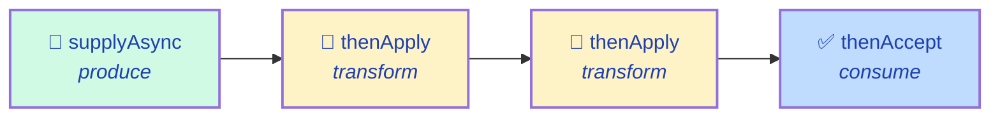
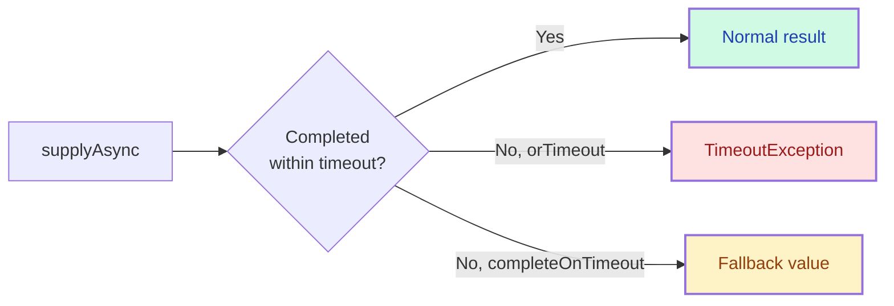
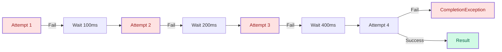

# CompletableFuture — Async Programming in Java

`CompletableFuture` is Java's way of writing **non-blocking, asynchronous code** without callback hell. It's used heavily in microservices for parallel API calls, async event processing, and non-blocking I/O.

---

## Why Not Just Use `Future`?

| Feature | `Future` | `CompletableFuture` |
|---|---|---|
| Get result | `get()` — **blocks** the thread | `thenApply()` — non-blocking |
| Chain operations | Not possible | Full chaining (map, flatMap style) |
| Combine results | Not possible | `thenCombine()`, `allOf()` |
| Handle errors | Only via `try-catch` on `get()` | `exceptionally()`, `handle()` |
| Manual completion | Not possible | `complete()`, `completeExceptionally()` |

```java
// Old way — blocks the thread
Future<String> future = executor.submit(() -> fetchFromApi());
String result = future.get();  // BLOCKED until done

// New way — non-blocking
CompletableFuture.supplyAsync(() -> fetchFromApi())
    .thenApply(result -> process(result))
    .thenAccept(processed -> save(processed));
// thread is free immediately
```

---

## When to Use CompletableFuture vs Alternatives

| Approach | Best for | Avoid when |
|---|---|---|
| **CompletableFuture** | Request-scoped parallelism (fan-out/fan-in), composing async steps | Simple sequential I/O on Java 21+ |
| **Virtual Threads (Java 21+)** | I/O-bound blocking code — just write synchronous style | CPU-bound computation, backpressure scenarios |
| **Reactive Streams (Mono/Flux)** | Streaming data, backpressure, event-driven pipelines | One-shot request/response parallelism |
| **ExecutorService.submit()** | Fire-and-forget tasks, simple parallelism | Complex chaining or combining of results |

!!! tip "Decision heuristic"
    - **Java 21+**: Prefer virtual threads for straightforward I/O concurrency. Use `CompletableFuture` only when you need explicit composition (combine/race/timeout semantics).
    - **Java 8–17**: `CompletableFuture` is your go-to for async composition.
    - **Streaming/event-driven**: Reach for Project Reactor or RxJava when you need backpressure or infinite streams.

```java
// Virtual Threads (Java 21+) — simpler for I/O-bound work
try (var executor = Executors.newVirtualThreadPerTaskExecutor()) {
    Future<String> user = executor.submit(() -> fetchUser(id));
    Future<String> order = executor.submit(() -> fetchOrder(id));
    return new Summary(user.get(), order.get()); // blocking is cheap with VTs
}

// CompletableFuture — when you need composition/timeout/fallback
CompletableFuture.supplyAsync(() -> fetchUser(id), pool)
    .thenCombine(
        CompletableFuture.supplyAsync(() -> fetchOrder(id), pool),
        Summary::new
    )
    .orTimeout(2, TimeUnit.SECONDS)
    .exceptionally(ex -> Summary.fallback());
```

---

## Creating CompletableFutures

```java
// Run async task that returns a value
CompletableFuture<String> cf = CompletableFuture.supplyAsync(() -> {
    return fetchUserName(userId);
});

// Run async task with no return value
CompletableFuture<Void> cf = CompletableFuture.runAsync(() -> {
    sendNotification(userId);
});

// Already completed (for testing or default values)
CompletableFuture<String> cf = CompletableFuture.completedFuture("default");

// With custom thread pool (recommended for production)
ExecutorService pool = Executors.newFixedThreadPool(10);
CompletableFuture.supplyAsync(() -> fetchData(), pool);
```

---

## Chaining Operations



### Transform result — `thenApply` (like `map`)

```java
CompletableFuture<Integer> future = CompletableFuture
    .supplyAsync(() -> "Hello, World")
    .thenApply(s -> s.length());  // 12
```

### Consume result — `thenAccept` (no return)

```java
CompletableFuture.supplyAsync(() -> fetchUser(id))
    .thenAccept(user -> log.info("Fetched: {}", user.getName()));
```

### Run after completion — `thenRun` (no access to result)

```java
CompletableFuture.supplyAsync(() -> saveOrder(order))
    .thenRun(() -> log.info("Order saved successfully"));
```

### Chain async operations — `thenCompose` (like `flatMap`)

Use when each step returns a `CompletableFuture`.

```java
CompletableFuture<Order> future = CompletableFuture
    .supplyAsync(() -> fetchUser(userId))           // returns User
    .thenCompose(user -> fetchOrders(user.getId()))  // returns CompletableFuture<Order>
    .thenCompose(order -> enrichOrder(order));        // returns CompletableFuture<Order>
```

**`thenApply` vs `thenCompose`**: Same as `map` vs `flatMap` in Streams. Use `thenCompose` when the function itself returns a `CompletableFuture` to avoid `CompletableFuture<CompletableFuture<T>>`.

---

## Combining Multiple Futures

### Combine two — `thenCombine`

```java
CompletableFuture<String> userFuture = CompletableFuture
    .supplyAsync(() -> fetchUserName(userId));

CompletableFuture<String> orderFuture = CompletableFuture
    .supplyAsync(() -> fetchLatestOrder(userId));

CompletableFuture<String> combined = userFuture
    .thenCombine(orderFuture, (user, order) ->
        user + " ordered " + order);
```

Both calls run **in parallel**, and the result combines when both are done.

### Wait for all — `allOf`

```java
CompletableFuture<String> api1 = CompletableFuture.supplyAsync(() -> callService1());
CompletableFuture<String> api2 = CompletableFuture.supplyAsync(() -> callService2());
CompletableFuture<String> api3 = CompletableFuture.supplyAsync(() -> callService3());

CompletableFuture.allOf(api1, api2, api3)
    .thenRun(() -> {
        String r1 = api1.join();
        String r2 = api2.join();
        String r3 = api3.join();
        // all three results available
    });
```

### First to complete — `anyOf`

```java
CompletableFuture<Object> fastest = CompletableFuture
    .anyOf(api1, api2, api3);  // returns as soon as ANY one completes
```

---

## Error Handling Patterns

### `exceptionally` vs `handle` vs `whenComplete`

| Method | Access to result? | Access to exception? | Can transform result? | Use case |
|---|---|---|---|---|
| `exceptionally(fn)` | No | Yes | Returns fallback value | Simple recovery/fallback |
| `handle(fn)` | Yes | Yes | Returns new value | Transform on success OR failure |
| `whenComplete(fn)` | Yes | Yes | No — passes original through | Side effects (logging, metrics) |

### `exceptionally` — recover from errors

```java
CompletableFuture<String> future = CompletableFuture
    .supplyAsync(() -> {
        if (serviceDown) throw new RuntimeException("Service unavailable");
        return fetchData();
    })
    .exceptionally(ex -> {
        log.error("Failed: {}", ex.getMessage());
        return "default-value";  // fallback
    });
```

### `handle` — access both result and exception

```java
CompletableFuture<String> future = CompletableFuture
    .supplyAsync(() -> fetchData())
    .handle((result, ex) -> {
        if (ex != null) {
            log.error("Error", ex);
            return "fallback";
        }
        return result.toUpperCase();
    });
```

### `whenComplete` — side effect without changing the result

```java
CompletableFuture<String> future = CompletableFuture
    .supplyAsync(() -> fetchData())
    .whenComplete((result, ex) -> {
        if (ex != null) log.error("Failed", ex);
        else log.info("Success: {}", result);
    });
// downstream sees the ORIGINAL result or exception — not modified
```

### Fail-Fast: Cancel Remaining Futures on First Failure

!!! warning "`allOf` does NOT cancel on first failure"
    `CompletableFuture.allOf()` waits for **all** futures to complete, even if one fails early. You must implement cancellation yourself.

```java
public static <T> CompletableFuture<T> failFast(List<CompletableFuture<T>> futures) {
    CompletableFuture<T> result = new CompletableFuture<>();

    for (CompletableFuture<T> f : futures) {
        f.whenComplete((value, ex) -> {
            if (ex != null) {
                // First failure completes the result exceptionally
                if (result.completeExceptionally(ex)) {
                    // Cancel all other futures
                    futures.forEach(other -> other.cancel(true));
                }
            }
        });
    }

    // Complete normally when ALL succeed
    CompletableFuture.allOf(futures.toArray(new CompletableFuture[0]))
        .thenRun(() -> result.complete(futures.get(0).join()));

    return result;
}
```

### Timeout Patterns (Java 9+)

```java
// Throws TimeoutException if not complete in 3 seconds
CompletableFuture<String> strict = fetchAsync()
    .orTimeout(3, TimeUnit.SECONDS);

// Returns a fallback value instead of throwing
CompletableFuture<String> lenient = fetchAsync()
    .completeOnTimeout("cached-value", 3, TimeUnit.SECONDS);
```



---

## Real-World Pattern: Parallel API Calls in Microservices

```java
public OrderSummary getOrderSummary(String userId) {
    CompletableFuture<User> userFuture = CompletableFuture
        .supplyAsync(() -> userService.getUser(userId), pool);

    CompletableFuture<List<Order>> ordersFuture = CompletableFuture
        .supplyAsync(() -> orderService.getOrders(userId), pool);

    CompletableFuture<PaymentInfo> paymentFuture = CompletableFuture
        .supplyAsync(() -> paymentService.getPaymentInfo(userId), pool);

    return CompletableFuture.allOf(userFuture, ordersFuture, paymentFuture)
        .thenApply(v -> new OrderSummary(
            userFuture.join(),
            ordersFuture.join(),
            paymentFuture.join()
        ))
        .orTimeout(3, TimeUnit.SECONDS)  // Java 9+
        .exceptionally(ex -> OrderSummary.fallback())
        .join();
}
```

Instead of 3 sequential calls (3s total), all 3 run in parallel (~1s total).

---

## Async vs Sync Variants

Every method has 3 variants:

| Variant | Thread used | Example |
|---|---|---|
| `thenApply()` | Same thread or caller | Fast transformations |
| `thenApplyAsync()` | ForkJoinPool.commonPool() | CPU-bound work |
| `thenApplyAsync(fn, executor)` | Custom thread pool | Production code |

**Rule**: Always use the version with a **custom executor** in production to control thread pool sizing and avoid starving the common pool.

---

## Production Pitfalls

### 1. `.join()` in Servlet Threads Gains Nothing

```java
// BAD — blocks the servlet thread, defeating the purpose of async
@GetMapping("/user")
public User getUser(@RequestParam String id) {
    return CompletableFuture.supplyAsync(() -> userService.fetch(id), pool)
        .join();  // servlet thread sits here blocked anyway!
}
```

!!! tip "When `.join()` is justified"
    Use `.join()` only when you're running **multiple** futures in parallel and joining them all together — the parallelism is the win. If you have a single async call with `.join()` at the end, you've just added overhead for no benefit.

### 2. Default `ForkJoinPool.commonPool()` is Shared Across the JVM

All `parallelStream()`, all `CompletableFuture` calls without a custom executor, and the JVM's internal tasks share the same pool. If one component performs blocking I/O (HTTP calls, DB queries), it starves every other component.

```java
// BAD — uses commonPool, may starve other work
CompletableFuture.supplyAsync(() -> httpClient.get(url));

// GOOD — dedicated pool for I/O work
private static final ExecutorService IO_POOL =
    Executors.newFixedThreadPool(20, new ThreadFactoryBuilder()
        .setNameFormat("io-pool-%d")
        .setDaemon(true)
        .build());

CompletableFuture.supplyAsync(() -> httpClient.get(url), IO_POOL);
```

### 3. Trace Context Propagation Across Async Boundaries

When you switch threads, MDC (Mapped Diagnostic Context) and trace IDs are lost because they are stored in `ThreadLocal`. You need a context-propagating executor.

```java
/**
 * Wraps an executor to propagate MDC context to async tasks.
 */
public class MdcPropagatingExecutor implements Executor {
    private final Executor delegate;

    public MdcPropagatingExecutor(Executor delegate) {
        this.delegate = delegate;
    }

    @Override
    public void execute(Runnable command) {
        // Capture context from the calling thread
        Map<String, String> callerMdc = MDC.getCopyOfContextMap();

        delegate.execute(() -> {
            // Restore context in the worker thread
            if (callerMdc != null) {
                MDC.setContextMap(callerMdc);
            }
            try {
                command.run();
            } finally {
                MDC.clear();
            }
        });
    }
}
```

```java
// Usage — wrap your pool once, use it everywhere
Executor tracedPool = new MdcPropagatingExecutor(IO_POOL);

CompletableFuture.supplyAsync(() -> orderService.fetch(orderId), tracedPool)
    .thenApplyAsync(order -> enrich(order), tracedPool);
// trace ID and MDC fields are now visible in log statements on worker threads
```

!!! note "Spring Sleuth / Micrometer Tracing"
    If you use Spring Boot with Micrometer Tracing (formerly Sleuth), use `ContextExecutorService` or `ContextTaskDecorator` instead of rolling your own wrapper — they propagate trace context automatically.

---

## Retry with Exponential Backoff

A production-ready retry utility using `CompletableFuture` and `ScheduledExecutorService`:

```java
public class AsyncRetry {

    private static final ScheduledExecutorService SCHEDULER =
        Executors.newScheduledThreadPool(2, r -> {
            Thread t = new Thread(r, "retry-scheduler");
            t.setDaemon(true);
            return t;
        });

    /**
     * Retries a supplier up to maxRetries times with exponential backoff.
     *
     * @param supplier    async operation to retry
     * @param maxRetries  number of retry attempts (0 = no retry)
     * @param baseDelay   initial delay before first retry
     * @param unit        time unit for baseDelay
     */
    public static <T> CompletableFuture<T> withRetry(
            Supplier<CompletableFuture<T>> supplier,
            int maxRetries,
            long baseDelay,
            TimeUnit unit) {

        return supplier.get().exceptionallyCompose(ex ->
            retry(supplier, maxRetries, baseDelay, unit, 1, ex)
        );
    }

    private static <T> CompletableFuture<T> retry(
            Supplier<CompletableFuture<T>> supplier,
            int maxRetries,
            long baseDelay,
            TimeUnit unit,
            int attempt,
            Throwable lastError) {

        if (attempt > maxRetries) {
            return CompletableFuture.failedFuture(lastError);
        }

        long delay = baseDelay * (1L << (attempt - 1)); // exponential: 1x, 2x, 4x, 8x...
        CompletableFuture<T> future = new CompletableFuture<>();

        SCHEDULER.schedule(() -> {
            supplier.get().whenComplete((result, ex) -> {
                if (ex == null) {
                    future.complete(result);
                } else {
                    retry(supplier, maxRetries, baseDelay, unit, attempt + 1, ex)
                        .whenComplete((r, e) -> {
                            if (e != null) future.completeExceptionally(e);
                            else future.complete(r);
                        });
                }
            });
        }, delay, unit);

        return future;
    }
}
```

```java
// Usage — retry HTTP call up to 3 times with 100ms, 200ms, 400ms delays
CompletableFuture<Response> response = AsyncRetry.withRetry(
    () -> CompletableFuture.supplyAsync(() -> httpClient.get(url), ioPool),
    3,          // max retries
    100,        // base delay
    TimeUnit.MILLISECONDS
);
```



---

## Interview Questions

??? question "1. What is the difference between `thenApply` and `thenCompose`?"
    `thenApply` transforms the result synchronously: `CompletableFuture<T>` → `CompletableFuture<R>`. `thenCompose` is for functions that return a `CompletableFuture` themselves — it flattens the result (like `flatMap`). Without `thenCompose`, you'd get `CompletableFuture<CompletableFuture<R>>`.

??? question "2. Your service calls 5 downstream APIs sequentially, taking 5 seconds total. How do you optimize?"
    Use `CompletableFuture.supplyAsync()` for each call with a custom thread pool, then `CompletableFuture.allOf()` to wait for all. Total time becomes the **slowest single call** instead of the sum. Add `.orTimeout()` for resilience and `.exceptionally()` for fallbacks.

??? question "3. Why should you avoid using the default ForkJoinPool in production?"
    The `ForkJoinPool.commonPool()` is shared across the entire JVM — all `parallelStream()` and `CompletableFuture` async calls without a custom executor use it. If one component blocks threads (e.g., HTTP calls), it starves all other components. Always pass a dedicated `ExecutorService`.

??? question "4. How do you handle timeouts with CompletableFuture?"
    Java 9+: `.orTimeout(3, TimeUnit.SECONDS)` throws `TimeoutException` if not complete. `.completeOnTimeout(fallback, 3, TimeUnit.SECONDS)` returns a fallback value instead. Pre-Java 9: use a `ScheduledExecutorService` to complete exceptionally after a delay.

??? question "5. When would you choose CompletableFuture over Virtual Threads (Java 21+)?"
    Virtual Threads (Project Loom) simplify I/O-bound concurrency — you write blocking code in a virtual thread and the runtime handles the rest. Choose CompletableFuture when you need **explicit composition**: combining results from multiple futures, racing (anyOf), timeouts with fallbacks, or retry logic. On Java 21+, a hybrid approach works well: use virtual threads as the executor backing your CompletableFutures.

??? question "6. How do you propagate trace context (MDC, Sleuth) across async boundaries?"
    `ThreadLocal`-based context (MDC, trace IDs) is lost when switching threads. Wrap your executor with a decorator that captures the MDC map before dispatch and restores it in the worker thread. In Spring, use `ContextTaskDecorator` or Micrometer's `ContextExecutorService`. Alternatively, on Java 21+ with Structured Concurrency, `ScopedValue` is designed for this.

??? question "7. `allOf` with 10 futures — one fails after 100ms, the rest take 5s. What happens?"
    `allOf` waits for ALL futures to complete, including the 9 slow ones. It does NOT short-circuit on failure. If you want fail-fast behavior, implement it manually: attach a `whenComplete` handler to each future that completes a shared result on first failure and cancels the rest.

??? question "8. Implement retry with exponential backoff using CompletableFuture."
    Use a `ScheduledExecutorService` to schedule delayed retries. The key insight: `exceptionallyCompose` (Java 12+) lets you replace a failed future with a new one. Chain retries recursively, doubling the delay each attempt (`baseDelay * 2^attempt`). Always cap retries and include jitter in production to avoid thundering herds.
