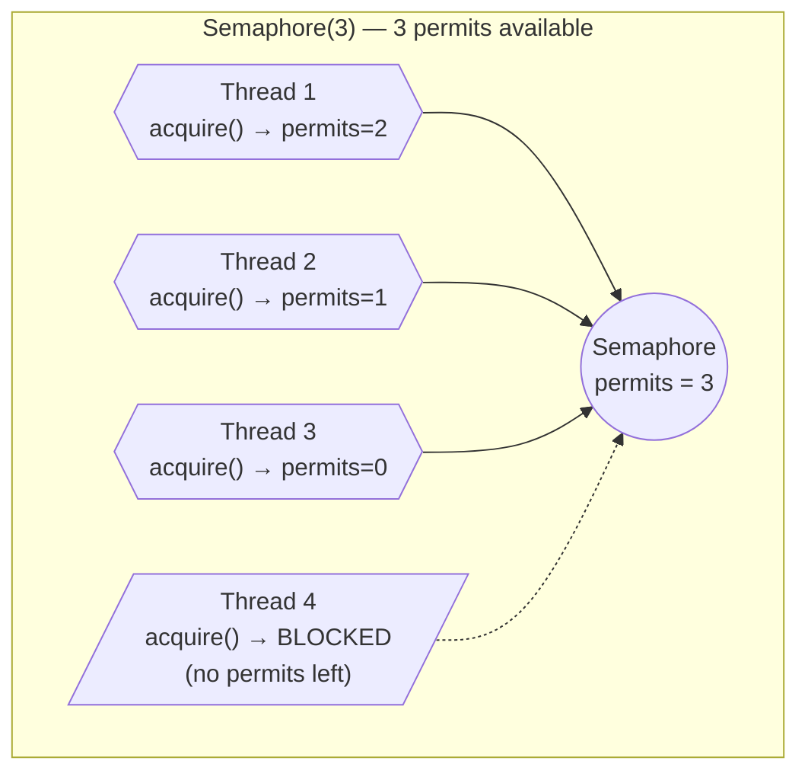
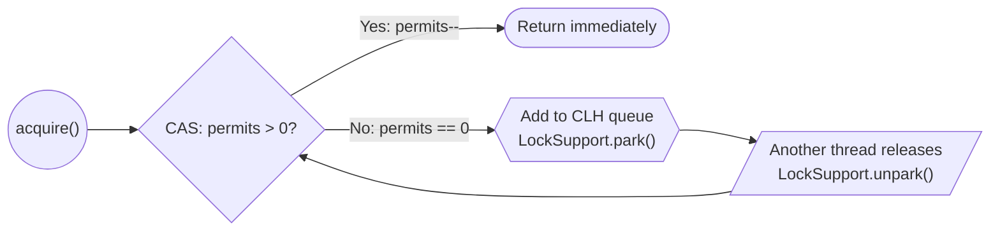
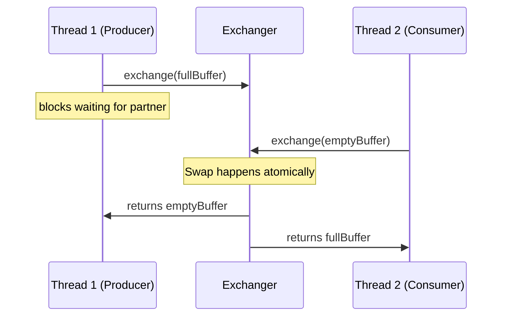
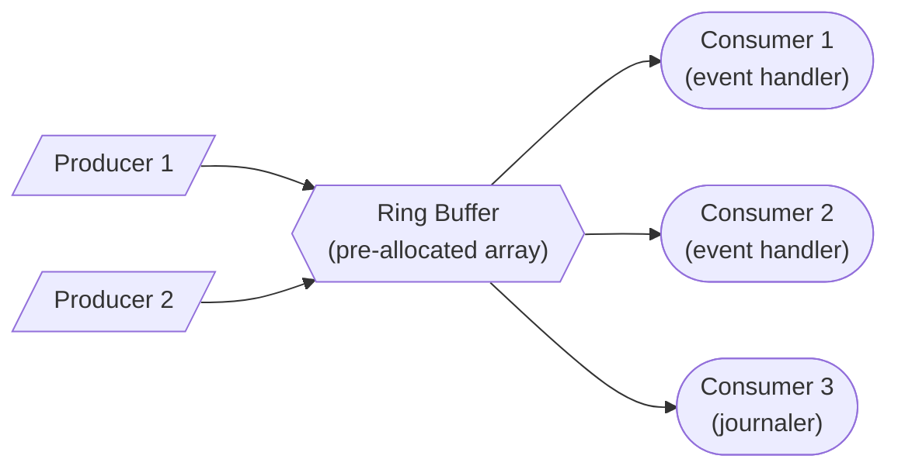

# Concurrency Patterns & Advanced Threading

Java concurrency goes far beyond `synchronized` and `Thread.start()`. Production systems at scale rely on **battle-tested concurrency patterns** to coordinate threads safely, maximize throughput, and avoid subtle bugs. This page covers every major concurrency pattern you will encounter in senior-level interviews and real-world distributed systems.

---

## Producer-Consumer Pattern

The most fundamental concurrency pattern. One or more threads produce work items, others consume them. A **bounded buffer** decouples producers from consumers.

### Why BlockingQueue?

Without a blocking queue, you need manual `wait()`/`notify()` -- error-prone and hard to get right. `BlockingQueue` handles all synchronization internally.

```java
import java.util.concurrent.*;

public class ProducerConsumerDemo {

    public static void main(String[] args) {
        BlockingQueue<String> queue = new ArrayBlockingQueue<>(10);

        // Producer
        Thread producer = new Thread(() -> {
            try {
                for (int i = 0; i < 20; i++) {
                    String item = "Order-" + i;
                    queue.put(item); // blocks if queue is full
                    System.out.println("Produced: " + item);
                }
                queue.put("POISON_PILL"); // signal to stop
            } catch (InterruptedException e) {
                Thread.currentThread().interrupt();
            }
        });

        // Consumer
        Thread consumer = new Thread(() -> {
            try {
                while (true) {
                    String item = queue.take(); // blocks if queue is empty
                    if ("POISON_PILL".equals(item)) break;
                    System.out.println("Consumed: " + item);
                    Thread.sleep(100); // simulate processing
                }
            } catch (InterruptedException e) {
                Thread.currentThread().interrupt();
            }
        });

        producer.start();
        consumer.start();
    }
}
```

### BlockingQueue Implementations

| Implementation | Backing | Bounded? | Best For |
|---|---|---|---|
| `ArrayBlockingQueue` | Fixed array | Yes | Known capacity, fairness option |
| `LinkedBlockingQueue` | Linked nodes | Optional | High throughput, unbounded default |
| `PriorityBlockingQueue` | Heap | No | Priority-ordered processing |
| `SynchronousQueue` | None (handoff) | Zero capacity | Direct handoff (Executors.newCachedThreadPool) |
| `DelayQueue` | Heap | No | Scheduled/delayed tasks |
| `LinkedTransferQueue` | Linked nodes | No | Transfer semantics, best concurrent perf |

!!! tip "Interview Insight"
    `SynchronousQueue` has **zero capacity** -- every `put()` blocks until another thread calls `take()`. This is how `Executors.newCachedThreadPool()` works internally: tasks are handed off directly to threads.

---

## Reader-Writer Lock Pattern

When reads vastly outnumber writes (e.g., a config cache), allowing **concurrent reads** while blocking only on writes massively improves throughput.

```java
import java.util.concurrent.locks.*;
import java.util.*;

public class ThreadSafeCache<K, V> {

    private final Map<K, V> cache = new HashMap<>();
    private final ReadWriteLock lock = new ReentrantReadWriteLock();
    private final Lock readLock = lock.readLock();
    private final Lock writeLock = lock.writeLock();

    public V get(K key) {
        readLock.lock(); // multiple threads can hold this simultaneously
        try {
            return cache.get(key);
        } finally {
            readLock.unlock();
        }
    }

    public void put(K key, V value) {
        writeLock.lock(); // exclusive -- no readers or writers allowed
        try {
            cache.put(key, value);
        } finally {
            writeLock.unlock();
        }
    }

    public List<K> allKeys() {
        readLock.lock();
        try {
            return new ArrayList<>(cache.keySet());
        } finally {
            readLock.unlock();
        }
    }
}
```

!!! warning "Write Starvation"
    With `ReentrantReadWriteLock`, if readers continuously hold the lock, writers can starve. Use the **fair** constructor: `new ReentrantReadWriteLock(true)` to guarantee FIFO ordering, at the cost of throughput.

---

## StampedLock -- Optimistic Reading

Java 8 introduced `StampedLock` as a faster alternative to `ReentrantReadWriteLock`. Its killer feature is **optimistic reads** that do not acquire any lock at all.

```java
import java.util.concurrent.locks.StampedLock;

public class Point {
    private double x, y;
    private final StampedLock lock = new StampedLock();

    public void move(double deltaX, double deltaY) {
        long stamp = lock.writeLock();
        try {
            x += deltaX;
            y += deltaY;
        } finally {
            lock.unlockWrite(stamp);
        }
    }

    public double distanceFromOrigin() {
        // Optimistic read -- no locking overhead
        long stamp = lock.tryOptimisticRead();
        double currentX = x, currentY = y;

        // Validate that no write occurred during our read
        if (!lock.validate(stamp)) {
            // Fallback to full read lock
            stamp = lock.readLock();
            try {
                currentX = x;
                currentY = y;
            } finally {
                lock.unlockRead(stamp);
            }
        }
        return Math.sqrt(currentX * currentX + currentY * currentY);
    }
}
```

!!! info "When to Use StampedLock"
    Use `StampedLock` when reads are **extremely frequent** and writes are rare. Unlike `ReentrantReadWriteLock`, it is **not reentrant** and does **not support Conditions**. Never use it in code that might recursively acquire the lock.

---

## Barrier Pattern

Barriers coordinate a group of threads to wait for each other at a common point before proceeding.

### CountDownLatch -- One-Time Gate

A latch counts down from N to 0. Once it hits zero, all waiting threads are released. **Cannot be reset.**

```java
import java.util.concurrent.CountDownLatch;

public class ServiceStartup {

    public static void main(String[] args) throws InterruptedException {
        int serviceCount = 3;
        CountDownLatch latch = new CountDownLatch(serviceCount);

        for (String service : new String[]{"Database", "Cache", "MessageQueue"}) {
            new Thread(() -> {
                try {
                    System.out.println(service + " starting...");
                    Thread.sleep((long) (Math.random() * 2000));
                    System.out.println(service + " ready!");
                    latch.countDown();
                } catch (InterruptedException e) {
                    Thread.currentThread().interrupt();
                }
            }).start();
        }

        latch.await(); // blocks until count reaches 0
        System.out.println("All services ready -- starting application!");
    }
}
```

### CyclicBarrier -- Reusable Sync Point

Unlike a latch, a `CyclicBarrier` can be **reused** across multiple rounds. Threads wait at the barrier until all N parties arrive, then all proceed together.

```java
import java.util.concurrent.CyclicBarrier;

public class ParallelMatrixComputation {

    public static void main(String[] args) {
        int workers = 4;
        CyclicBarrier barrier = new CyclicBarrier(workers, () -> {
            // Runs after all threads arrive at the barrier
            System.out.println("--- Phase complete, merging results ---");
        });

        for (int i = 0; i < workers; i++) {
            final int workerId = i;
            new Thread(() -> {
                try {
                    for (int phase = 1; phase <= 3; phase++) {
                        System.out.println("Worker " + workerId + " computing phase " + phase);
                        Thread.sleep((long) (Math.random() * 1000));
                        barrier.await(); // wait for all workers
                    }
                } catch (Exception e) {
                    Thread.currentThread().interrupt();
                }
            }).start();
        }
    }
}
```

### Phaser -- Flexible Multi-Phase

`Phaser` is the most flexible barrier. Threads can dynamically **register** and **deregister** between phases.

```java
import java.util.concurrent.Phaser;

public class DynamicPhaserDemo {

    public static void main(String[] args) {
        Phaser phaser = new Phaser(1); // register self (main thread)

        for (int i = 0; i < 3; i++) {
            phaser.register(); // dynamically add participant
            final int id = i;
            new Thread(() -> {
                System.out.println("Worker " + id + " phase 0");
                phaser.arriveAndAwaitAdvance();

                System.out.println("Worker " + id + " phase 1");
                phaser.arriveAndDeregister(); // leave after phase 1
            }).start();
        }

        phaser.arriveAndAwaitAdvance(); // main waits for phase 0
        phaser.arriveAndDeregister();   // main deregisters
    }
}
```

| Feature | CountDownLatch | CyclicBarrier | Phaser |
|---|---|---|---|
| Reusable | No | Yes | Yes |
| Dynamic parties | No | No | Yes |
| Barrier action | No | Yes | Yes (via `onAdvance`) |
| Best for | One-time wait | Fixed-team phases | Dynamic registration |

---

## Semaphore — Controlling Concurrent Access

A Semaphore maintains a set of **permits**. Threads acquire permits before accessing a resource and release them when done. Unlike locks (which are binary — held or not), semaphores allow **N threads** to access a resource simultaneously.

### How Semaphore Works



### Basic Usage — Connection Pool Limiter

```java
public class DatabaseConnectionPool {
    private final Semaphore semaphore;
    private final BlockingQueue<Connection> pool;

    public DatabaseConnectionPool(int maxConnections) {
        this.semaphore = new Semaphore(maxConnections, true); // fair
        this.pool = new ArrayBlockingQueue<>(maxConnections);
        for (int i = 0; i < maxConnections; i++) {
            pool.offer(createConnection());
        }
    }

    public Connection acquire() throws InterruptedException {
        semaphore.acquire();  // blocks if all connections in use
        return pool.poll();
    }

    public Connection acquire(long timeout, TimeUnit unit) throws InterruptedException {
        if (semaphore.tryAcquire(timeout, unit)) {
            return pool.poll();
        }
        throw new TimeoutException("No connection available within " + timeout + " " + unit);
    }

    public void release(Connection conn) {
        pool.offer(conn);
        semaphore.release();  // return permit — unblocks waiting thread
    }

    public int availableConnections() {
        return semaphore.availablePermits();
    }
}
```

### Semaphore as Mutex (Binary Semaphore)

A semaphore with 1 permit behaves like a lock — but with important differences:

```java
Semaphore mutex = new Semaphore(1);

mutex.acquire();
try {
    // critical section — only one thread at a time
} finally {
    mutex.release();
}
```

| Feature | Semaphore(1) | ReentrantLock |
|---|---|---|
| Reentrant | No — same thread acquiring twice deadlocks! | Yes |
| Owner tracking | No — any thread can release | Yes — only owner can unlock |
| Condition support | No | Yes |
| Use case | Cross-thread signaling | Mutual exclusion |

!!! danger "Critical Difference"
    With a Semaphore, **any thread can release** — not just the one that acquired. This makes it useful for signaling between threads but dangerous as a mutex (another thread could accidentally release your permit).

### Rate Limiting with Semaphore

```java
public class ApiRateLimiter {
    private final Semaphore semaphore;
    private final ScheduledExecutorService scheduler;

    public ApiRateLimiter(int requestsPerSecond) {
        this.semaphore = new Semaphore(requestsPerSecond);
        this.scheduler = Executors.newSingleThreadScheduledExecutor(r -> {
            Thread t = new Thread(r, "rate-limiter-refiller");
            t.setDaemon(true);
            return t;
        });

        // Refill permits every second
        scheduler.scheduleAtFixedRate(() -> {
            int deficit = requestsPerSecond - semaphore.availablePermits();
            if (deficit > 0) semaphore.release(deficit);
        }, 1, 1, TimeUnit.SECONDS);
    }

    public boolean tryRequest() {
        return semaphore.tryAcquire();
    }

    public void request() throws InterruptedException {
        semaphore.acquire();
    }

    public boolean request(long timeout, TimeUnit unit) throws InterruptedException {
        return semaphore.tryAcquire(timeout, unit);
    }
}
```

### Bounded Resource Access (Throttling)

```java
// Only allow 5 concurrent file uploads
Semaphore uploadThrottle = new Semaphore(5);

public CompletableFuture<Void> uploadFile(Path file) {
    return CompletableFuture.runAsync(() -> {
        try {
            uploadThrottle.acquire();
            try {
                performUpload(file);  // only 5 at a time
            } finally {
                uploadThrottle.release();
            }
        } catch (InterruptedException e) {
            Thread.currentThread().interrupt();
        }
    }, uploadExecutor);
}
```

### Multiple Permits — Weighted Access

```java
// Large queries consume 3 permits, small queries consume 1
Semaphore resourceSemaphore = new Semaphore(10);

public ResultSet executeLargeQuery(String sql) throws InterruptedException {
    resourceSemaphore.acquire(3);  // acquire 3 permits
    try {
        return database.execute(sql);
    } finally {
        resourceSemaphore.release(3);
    }
}

public ResultSet executeSmallQuery(String sql) throws InterruptedException {
    resourceSemaphore.acquire(1);
    try {
        return database.execute(sql);
    } finally {
        resourceSemaphore.release(1);
    }
}
```

### Semaphore vs Other Synchronizers

| Synchronizer | Purpose | Reusable | Direction |
|---|---|---|---|
| **Semaphore** | Limit concurrent access to N | Yes | Any thread can acquire/release |
| **ReentrantLock** | Mutual exclusion (1 thread) | Yes | Same thread locks/unlocks |
| **CountDownLatch** | Wait for N events | No (one-shot) | countDown decoupled from await |
| **CyclicBarrier** | N threads rendezvous | Yes (auto-reset) | All threads must arrive |

### Fair vs Unfair Semaphore

```java
// UNFAIR (default) — higher throughput, possible starvation
Semaphore unfair = new Semaphore(5);

// FAIR — guarantees FIFO ordering, lower throughput
Semaphore fair = new Semaphore(5, true);
```

Under high contention, unfair semaphores are ~2x faster but may starve threads. Use fair when you need guaranteed bounded waiting time (SLA-critical paths).

### Semaphore Internals (AbstractQueuedSynchronizer)

Under the hood, `Semaphore` is built on `AbstractQueuedSynchronizer` (AQS):



- AQS maintains a **CLH queue** (FIFO linked list of waiting threads)
- `acquire()` tries a CAS on the state (permit count). If it fails, thread parks.
- `release()` increments state and unparks the head of the queue.
- Fair mode: always enqueues if others are waiting. Unfair mode: tries CAS first (can jump queue).

---

## Exchanger — Two-Thread Rendezvous

`Exchanger` is a synchronization point where exactly **two threads** meet and swap objects. Each thread presents an object and receives the other thread's object.

### How Exchanger Works



### Double Buffering Pattern

The classic use case: producer fills a buffer while consumer processes the previous one, then they swap.

```java
public class DoubleBufferPipeline {
    private final Exchanger<List<LogEvent>> exchanger = new Exchanger<>();
    private final int batchSize;

    public DoubleBufferPipeline(int batchSize) {
        this.batchSize = batchSize;
    }

    // Producer: collects events, swaps when batch is full
    public void startProducer() {
        new Thread(() -> {
            List<LogEvent> buffer = new ArrayList<>(batchSize);
            try {
                while (!Thread.currentThread().isInterrupted()) {
                    LogEvent event = pollNextEvent();
                    buffer.add(event);
                    if (buffer.size() >= batchSize) {
                        // Swap full buffer for an empty one
                        buffer = exchanger.exchange(buffer);
                        buffer.clear();
                    }
                }
            } catch (InterruptedException e) {
                Thread.currentThread().interrupt();
            }
        }, "log-producer").start();
    }

    // Consumer: processes the full buffer, swaps back the empty one
    public void startConsumer() {
        new Thread(() -> {
            List<LogEvent> buffer = new ArrayList<>(batchSize);
            try {
                while (!Thread.currentThread().isInterrupted()) {
                    buffer = exchanger.exchange(buffer);  // get full buffer
                    writeBatch(buffer);  // process
                    buffer.clear();      // prepare for next swap
                }
            } catch (InterruptedException e) {
                Thread.currentThread().interrupt();
            }
        }, "log-consumer").start();
    }
}
```

### Exchanger with Timeout

```java
try {
    List<Order> received = exchanger.exchange(myBuffer, 5, TimeUnit.SECONDS);
} catch (TimeoutException e) {
    // Partner didn't show up within 5 seconds — handle gracefully
    processPartialBatch(myBuffer);
}
```

### When to Use Exchanger

| Use Case | Why Exchanger? |
|---|---|
| Double buffering (producer/consumer) | Zero allocation: swap buffers instead of creating new ones |
| Genetic algorithms | Two threads exchange chromosomes for crossover |
| Pipeline stages | Adjacent stages swap work items directly |
| Symmetric rendezvous | Both threads have something to give and receive |

!!! warning "Limitations"
    Exchanger only works for **exactly 2 threads**. For more than 2, use `Phaser`, `CyclicBarrier`, or a shared `BlockingQueue`.

---

## CompletionService — Process Results As They Arrive

When you submit multiple tasks and want to process results in **completion order** (not submission order), use `CompletionService`.

```java
ExecutorService executor = Executors.newFixedThreadPool(10);
CompletionService<PriceQuote> completionService = 
    new ExecutorCompletionService<>(executor);

// Submit requests to multiple pricing services
for (String vendor : vendors) {
    completionService.submit(() -> fetchPrice(vendor, item));
}

// Process results as they arrive (fastest first)
for (int i = 0; i < vendors.size(); i++) {
    Future<PriceQuote> future = completionService.take();  // blocks for next result
    try {
        PriceQuote quote = future.get();
        if (quote.getPrice() < bestPrice) {
            bestPrice = quote.getPrice();
        }
    } catch (ExecutionException e) {
        log.warn("Vendor failed: {}", e.getCause().getMessage());
    }
}
```

### Why Not Just Use List<Future>?

```java
// BAD: processes in submission order — blocks on slow tasks
List<Future<String>> futures = executor.invokeAll(tasks);
for (Future<String> f : futures) {
    f.get();  // if task 0 is slow, we wait even though task 3 finished first
}

// GOOD: processes in completion order — fastest results first
for (int i = 0; i < tasks.size(); i++) {
    Future<String> f = completionService.take();  // next completed result
    process(f.get());  // always processes the fastest available
}
```

### First-N-of-M Pattern (e.g., Quorum Reads)

```java
// Send request to 5 replicas, return as soon as 3 respond (quorum)
public List<Response> quorumRead(Request req, List<Replica> replicas, int quorum) 
        throws InterruptedException {
    CompletionService<Response> cs = new ExecutorCompletionService<>(executor);
    
    for (Replica r : replicas) {
        cs.submit(() -> r.read(req));
    }

    List<Response> responses = new ArrayList<>();
    for (int i = 0; i < quorum; i++) {
        responses.add(cs.take().get());
    }
    return responses;  // return after quorum reached — don't wait for stragglers
}
```

---

## Lock-Free Patterns

### Treiber Stack (Lock-Free Stack)

A stack where `push` and `pop` use CAS instead of locks:

```java
public class LockFreeStack<T> {
    private final AtomicReference<Node<T>> top = new AtomicReference<>(null);

    private static class Node<T> {
        final T value;
        final Node<T> next;
        Node(T value, Node<T> next) {
            this.value = value;
            this.next = next;
        }
    }

    public void push(T value) {
        Node<T> newNode = new Node<>(value, null);
        Node<T> current;
        do {
            current = top.get();
            newNode = new Node<>(value, current);
        } while (!top.compareAndSet(current, newNode));
    }

    public T pop() {
        Node<T> current;
        Node<T> next;
        do {
            current = top.get();
            if (current == null) return null;
            next = current.next;
        } while (!top.compareAndSet(current, next));
        return current.value;
    }
}
```

### Michael-Scott Queue (Lock-Free FIFO)

This is what `ConcurrentLinkedQueue` implements internally. Two atomic pointers (`head` and `tail`) with CAS operations for enqueue/dequeue.

### When to Use Lock-Free vs Lock-Based

| Scenario | Lock-Free | Lock-Based |
|---|---|---|
| Very short critical section | Preferred (CAS is cheaper than park/unpark) | Overkill |
| Long critical section | Bad (spinning wastes CPU) | Preferred (thread parks) |
| High contention | Degrades (many CAS retries) | Better (queue and park) |
| Real-time requirements | Preferred (bounded latency) | Risky (priority inversion) |
| Correctness complexity | Very hard to get right | Easier to reason about |

!!! tip "Production Advice"
    Unless you're building a framework or have measured a bottleneck, prefer `java.util.concurrent` classes (which use optimal lock-free algorithms internally) over rolling your own. `ConcurrentLinkedQueue`, `ConcurrentHashMap`, and `LongAdder` are all lock-free where it matters.

---

## Disruptor Pattern (High-Performance Ring Buffer)

The LMAX Disruptor achieves millions of events/sec by eliminating locks, false sharing, and garbage:



**Key principles**:

| Principle | How | Benefit |
|---|---|---|
| Ring buffer (fixed array) | Pre-allocate entries, reuse slots | Zero GC pressure |
| Sequence barriers | Consumers track producer's sequence via volatile read | No locks |
| Cache-line padding | Sequences padded to 64 bytes | No false sharing |
| Batching | Consumers process multiple entries per wake-up | Amortized overhead |
| Single-writer per slot | Only one producer writes to a given slot | No CAS needed on data |

```java
// Conceptual Disruptor usage (using LMAX library)
Disruptor<OrderEvent> disruptor = new Disruptor<>(
    OrderEvent::new,          // event factory
    1024,                     // ring buffer size (power of 2)
    DaemonThreadFactory.INSTANCE,
    ProducerType.MULTI,
    new BusySpinWaitStrategy() // lowest latency, highest CPU
);

disruptor.handleEventsWith(journaler, replicator)
    .then(businessLogic);     // pipeline: journal+replicate first, then process

disruptor.start();

// Publish event
RingBuffer<OrderEvent> rb = disruptor.getRingBuffer();
long sequence = rb.next();
try {
    OrderEvent event = rb.get(sequence);
    event.setOrderId(orderId);
    event.setPrice(price);
} finally {
    rb.publish(sequence);
}
```

### Wait Strategies

| Strategy | Latency | CPU Usage | Use Case |
|---|---|---|---|
| `BusySpinWaitStrategy` | Lowest (~ns) | 100% (burns CPU core) | Ultra-low latency (trading) |
| `YieldingWaitStrategy` | Low (~μs) | High (yields between spins) | Low latency with some CPU sharing |
| `SleepingWaitStrategy` | Medium (~ms) | Low | Throughput over latency |
| `BlockingWaitStrategy` | Higher | Lowest | General purpose |

---

## Fork/Join Framework

The Fork/Join framework uses **divide-and-conquer** with a **work-stealing** algorithm. Idle threads steal tasks from busy threads' deques, maximizing CPU utilization.

### RecursiveTask (returns a value)

```java
import java.util.concurrent.*;

public class ParallelSum extends RecursiveTask<Long> {

    private static final int THRESHOLD = 10_000;
    private final long[] array;
    private final int start, end;

    public ParallelSum(long[] array, int start, int end) {
        this.array = array;
        this.start = start;
        this.end = end;
    }

    @Override
    protected Long compute() {
        if (end - start <= THRESHOLD) {
            // Base case: compute directly
            long sum = 0;
            for (int i = start; i < end; i++) sum += array[i];
            return sum;
        }

        int mid = (start + end) / 2;
        ParallelSum left = new ParallelSum(array, start, mid);
        ParallelSum right = new ParallelSum(array, mid, end);

        left.fork();         // submit left to the pool
        long rightResult = right.compute(); // compute right in current thread
        long leftResult = left.join();      // wait for left

        return leftResult + rightResult;
    }

    public static void main(String[] args) {
        long[] data = new long[1_000_000];
        for (int i = 0; i < data.length; i++) data[i] = i + 1;

        ForkJoinPool pool = ForkJoinPool.commonPool();
        long result = pool.invoke(new ParallelSum(data, 0, data.length));
        System.out.println("Sum: " + result);
    }
}
```

### RecursiveAction (no return value)

```java
import java.util.concurrent.RecursiveAction;
import java.util.Arrays;

public class ParallelMergeSort extends RecursiveAction {

    private static final int THRESHOLD = 4096;
    private final int[] array;
    private final int start, end;

    public ParallelMergeSort(int[] array, int start, int end) {
        this.array = array;
        this.start = start;
        this.end = end;
    }

    @Override
    protected void compute() {
        if (end - start <= THRESHOLD) {
            Arrays.sort(array, start, end); // small enough, sort sequentially
            return;
        }
        int mid = (start + end) / 2;
        ParallelMergeSort left = new ParallelMergeSort(array, start, mid);
        ParallelMergeSort right = new ParallelMergeSort(array, mid, end);

        invokeAll(left, right); // fork both, wait for both
        merge(array, start, mid, end);
    }

    private void merge(int[] arr, int lo, int mid, int hi) {
        int[] temp = Arrays.copyOfRange(arr, lo, mid);
        int i = 0, j = mid, k = lo;
        while (i < temp.length && j < hi) {
            arr[k++] = (temp[i] <= arr[j]) ? temp[i++] : arr[j++];
        }
        while (i < temp.length) arr[k++] = temp[i++];
    }
}
```

!!! tip "Work-Stealing Algorithm"
    Each worker thread has a **double-ended queue (deque)**. A thread pushes/pops its own tasks from the **head**. Idle threads steal from the **tail** of other threads' deques. This minimizes contention because the owner and the thief operate on opposite ends.

---

## Thread-Safe Singleton Patterns

### 1. Double-Checked Locking

```java
public class Singleton {
    // volatile prevents instruction reordering
    private static volatile Singleton INSTANCE;

    private Singleton() {}

    public static Singleton getInstance() {
        if (INSTANCE == null) {               // 1st check (no lock)
            synchronized (Singleton.class) {
                if (INSTANCE == null) {       // 2nd check (with lock)
                    INSTANCE = new Singleton();
                }
            }
        }
        return INSTANCE;
    }
}
```

!!! warning "Why volatile is Critical"
    Without `volatile`, the JVM may reorder the `INSTANCE = new Singleton()` operation. Thread A could publish a **partially constructed** object. Thread B sees a non-null `INSTANCE`, skips synchronization, and uses a broken object. The `volatile` keyword establishes a happens-before relationship that prevents this.

### 2. Enum Singleton (Recommended)

```java
public enum DatabaseConnection {
    INSTANCE;

    private final Connection conn;

    DatabaseConnection() {
        conn = createConnection();
    }

    public Connection getConnection() {
        return conn;
    }

    private Connection createConnection() {
        // ... initialize real connection
        return null;
    }
}

// Usage
DatabaseConnection.INSTANCE.getConnection();
```

!!! success "Why Enum is Best"
    Enum singletons are **inherently thread-safe** (guaranteed by the JVM), immune to reflection attacks, and handle serialization automatically. Joshua Bloch (Effective Java) calls this the best approach.

### 3. Initialization-on-Demand Holder

```java
public class Singleton {
    private Singleton() {}

    private static class Holder {
        // Inner class is not loaded until getInstance() is called
        static final Singleton INSTANCE = new Singleton();
    }

    public static Singleton getInstance() {
        return Holder.INSTANCE;
    }
}
```

The JVM guarantees that the `Holder` class is loaded and initialized only when `getInstance()` is first called, making this both lazy and thread-safe without any synchronization overhead.

---

## Object Pool Pattern

Reuse expensive objects (database connections, SSL contexts, gRPC channels) instead of creating and destroying them repeatedly.

```java
import java.util.concurrent.*;

public class ObjectPool<T> {

    private final BlockingQueue<T> pool;
    private final java.util.function.Supplier<T> factory;

    public ObjectPool(int size, java.util.function.Supplier<T> factory) {
        this.pool = new ArrayBlockingQueue<>(size);
        this.factory = factory;
        for (int i = 0; i < size; i++) {
            pool.offer(factory.get());
        }
    }

    public T borrow() throws InterruptedException {
        return pool.take(); // blocks if pool is empty
    }

    public T borrowWithTimeout(long ms) throws InterruptedException {
        T obj = pool.poll(ms, TimeUnit.MILLISECONDS);
        if (obj == null) throw new RuntimeException("Pool exhausted, timeout after " + ms + "ms");
        return obj;
    }

    public void release(T obj) {
        pool.offer(obj); // return to pool
    }

    // Usage
    public static void main(String[] args) throws Exception {
        ObjectPool<StringBuilder> pool = new ObjectPool<>(5, StringBuilder::new);

        StringBuilder sb = pool.borrow();
        try {
            sb.setLength(0); // reset before use
            sb.append("Hello from pooled object");
            System.out.println(sb);
        } finally {
            pool.release(sb); // always return to pool
        }
    }
}
```

---

## Active Object Pattern

Decouple method execution from method invocation. Each method call is turned into a **message** enqueued to a single-threaded executor, serializing all access without explicit locks.

```java
import java.util.concurrent.*;

public class ActiveObject {

    private final ExecutorService executor = Executors.newSingleThreadExecutor();
    private double balance = 0.0;

    public Future<Double> deposit(double amount) {
        return executor.submit(() -> {
            balance += amount;
            System.out.println("Deposited " + amount + ", balance = " + balance);
            return balance;
        });
    }

    public Future<Double> withdraw(double amount) {
        return executor.submit(() -> {
            if (balance >= amount) {
                balance -= amount;
                System.out.println("Withdrew " + amount + ", balance = " + balance);
            } else {
                System.out.println("Insufficient funds for " + amount);
            }
            return balance;
        });
    }

    public Future<Double> getBalance() {
        return executor.submit(() -> balance);
    }

    public void shutdown() {
        executor.shutdown();
    }

    public static void main(String[] args) throws Exception {
        ActiveObject account = new ActiveObject();

        // Multiple threads can call these safely -- all serialized internally
        account.deposit(1000);
        account.withdraw(200);
        Future<Double> balance = account.getBalance();
        System.out.println("Final balance: " + balance.get());

        account.shutdown();
    }
}
```

!!! info "When to Use Active Object"
    Use when you want **thread safety without locks**. Each "active object" has its own thread, and all operations are serialized via a queue. This is the pattern behind Akka actors and `Executors.newSingleThreadExecutor()`.

---

## Half-Sync/Half-Async Pattern

Separates synchronous processing from asynchronous I/O using a **queue** as the bridge. The async layer handles I/O events; the sync layer processes them with blocking logic.

```java
import java.util.concurrent.*;

public class HalfSyncHalfAsync {

    private final BlockingQueue<String> requestQueue = new LinkedBlockingQueue<>();
    private final ExecutorService syncWorkers = Executors.newFixedThreadPool(4);

    // ASYNC layer: non-blocking event loop receives requests
    public void onRequestReceived(String request) {
        requestQueue.offer(request); // non-blocking enqueue
    }

    // SYNC layer: blocking workers process from the queue
    public void startSyncLayer() {
        for (int i = 0; i < 4; i++) {
            syncWorkers.submit(() -> {
                while (!Thread.currentThread().isInterrupted()) {
                    try {
                        String request = requestQueue.take(); // blocking
                        processRequest(request);              // synchronous business logic
                    } catch (InterruptedException e) {
                        Thread.currentThread().interrupt();
                        break;
                    }
                }
            });
        }
    }

    private void processRequest(String request) {
        System.out.println(Thread.currentThread().getName() + " processing: " + request);
    }
}
```

This is the pattern behind **Netty** (async I/O layer + worker thread pool) and most web servers like Tomcat.

---

## Thread-Per-Message vs Event-Driven

### Thread-Per-Message

Simple model: spawn a new thread (or use a pool) for every incoming request.

```java
// Thread-per-message with virtual threads (Java 21+)
try (var executor = Executors.newVirtualThreadPerTaskExecutor()) {
    serverSocket.accept(); // for each connection:
    executor.submit(() -> handleClient(clientSocket));
}
```

### Event-Driven (Reactor Pattern)

A single thread (or small pool) multiplexes I/O events using `Selector`. No thread-per-connection overhead.

```java
import java.nio.channels.*;
import java.nio.*;
import java.net.*;

public class ReactorDemo {

    public void start() throws Exception {
        Selector selector = Selector.open();
        ServerSocketChannel server = ServerSocketChannel.open();
        server.bind(new InetSocketAddress(8080));
        server.configureBlocking(false);
        server.register(selector, SelectionKey.OP_ACCEPT);

        while (true) {
            selector.select(); // blocks until events arrive
            var keys = selector.selectedKeys().iterator();
            while (keys.hasNext()) {
                SelectionKey key = keys.next();
                keys.remove();

                if (key.isAcceptable()) {
                    SocketChannel client = server.accept();
                    client.configureBlocking(false);
                    client.register(selector, SelectionKey.OP_READ);
                } else if (key.isReadable()) {
                    SocketChannel client = (SocketChannel) key.channel();
                    ByteBuffer buf = ByteBuffer.allocate(1024);
                    client.read(buf);
                    // process data...
                }
            }
        }
    }
}
```

| Aspect | Thread-Per-Message | Event-Driven |
|---|---|---|
| Threads | One per request | Small fixed pool |
| Scalability | Limited by thread count | Handles 100K+ connections |
| Complexity | Simple, straightforward | Complex (callbacks, state machines) |
| Use case | Low-moderate concurrency | C10K problem, real-time systems |
| Java impl | Virtual threads, thread pools | NIO Selector, Netty, WebFlux |

---

## Balking Pattern

A thread **refuses** to execute an action if the object is not in the right state. Instead of blocking or retrying, it simply returns immediately.

```java
public class LazyInitResource {

    private volatile boolean initialized = false;
    private Resource resource;

    public synchronized void initialize() {
        if (initialized) return; // BALK -- already initialized

        resource = new Resource();
        resource.connect();
        initialized = true;
    }

    public void useResource() {
        if (!initialized) {
            throw new IllegalStateException("Resource not initialized -- call initialize() first");
        }
        resource.execute();
    }
}
```

Real-world example: `Thread.start()` balks if the thread is already started (`IllegalThreadStateException`).

---

## Guarded Suspension

A thread **waits** until a precondition is satisfied. Unlike balking (which gives up), guarded suspension blocks until the guard condition becomes true.

```java
import java.util.LinkedList;
import java.util.Queue;

public class GuardedQueue<T> {

    private final Queue<T> queue = new LinkedList<>();
    private final int capacity;

    public GuardedQueue(int capacity) {
        this.capacity = capacity;
    }

    public synchronized void put(T item) throws InterruptedException {
        while (queue.size() >= capacity) {
            wait(); // guard: wait until space is available
        }
        queue.add(item);
        notifyAll(); // wake up consumers
    }

    public synchronized T take() throws InterruptedException {
        while (queue.isEmpty()) {
            wait(); // guard: wait until item is available
        }
        T item = queue.poll();
        notifyAll(); // wake up producers
        return item;
    }
}
```

!!! warning "Always Use `while`, Never `if`"
    The `while` loop protects against **spurious wakeups** -- the JVM spec allows `wait()` to return even without a `notify()`. Using `if` instead of `while` is a classic interview trap and production bug.

---

## Scheduler Pattern

Decouple task scheduling from task execution. Java provides `ScheduledExecutorService` for this.

```java
import java.util.concurrent.*;

public class TaskScheduler {

    private final ScheduledExecutorService scheduler = Executors.newScheduledThreadPool(2);

    public void start() {
        // Run once after 5 seconds
        scheduler.schedule(() -> {
            System.out.println("One-time cleanup executed");
        }, 5, TimeUnit.SECONDS);

        // Run every 10 seconds (fixed rate -- includes execution time)
        scheduler.scheduleAtFixedRate(() -> {
            System.out.println("Health check at " + System.currentTimeMillis());
        }, 0, 10, TimeUnit.SECONDS);

        // Run with 10-second gap between end of last execution and start of next
        scheduler.scheduleWithFixedDelay(() -> {
            System.out.println("Metrics collection");
            // even if this takes 3 seconds, next run starts 10s AFTER it finishes
        }, 0, 10, TimeUnit.SECONDS);
    }

    public void shutdown() {
        scheduler.shutdown();
    }
}
```

| Method | Timing | If Task Takes Longer Than Period |
|---|---|---|
| `scheduleAtFixedRate` | Start-to-start | Next run starts immediately after previous ends |
| `scheduleWithFixedDelay` | End-to-start | Always waits the full delay after completion |

---

## Structured Concurrency (Java 21+)

Structured concurrency treats a group of concurrent tasks as a **single unit of work**. If one subtask fails, siblings are automatically cancelled. No more leaked threads.

```java
import java.util.concurrent.*;

// Requires: --enable-preview (Java 21+)
public class StructuredConcurrencyDemo {

    record User(String name) {}
    record Order(String id) {}
    record UserDashboard(User user, Order latestOrder) {}

    static UserDashboard fetchDashboard(String userId) throws Exception {
        // All subtasks are scoped to this block
        try (var scope = new StructuredTaskScope.ShutdownOnFailure()) {

            // Fork concurrent subtasks
            Subtask<User> userTask = scope.fork(() -> fetchUser(userId));
            Subtask<Order> orderTask = scope.fork(() -> fetchLatestOrder(userId));

            scope.join();           // wait for ALL subtasks
            scope.throwIfFailed();  // propagate any exception

            // Both succeeded -- combine results
            return new UserDashboard(userTask.get(), orderTask.get());
        }
        // If fetchUser() fails, fetchLatestOrder() is automatically cancelled
    }

    static User fetchUser(String id) throws InterruptedException {
        Thread.sleep(500);
        return new User("Alice");
    }

    static Order fetchLatestOrder(String userId) throws InterruptedException {
        Thread.sleep(300);
        return new Order("ORD-42");
    }
}
```

### ShutdownOnSuccess -- First Result Wins

```java
static String fetchFromFastestMirror(String fileId) throws Exception {
    try (var scope = new StructuredTaskScope.ShutdownOnSuccess<String>()) {
        scope.fork(() -> downloadFrom("mirror-us", fileId));
        scope.fork(() -> downloadFrom("mirror-eu", fileId));
        scope.fork(() -> downloadFrom("mirror-asia", fileId));

        scope.join(); // returns as soon as ONE succeeds
        return scope.result(); // result from the fastest mirror
    }
    // other two are automatically cancelled
}
```

!!! info "Why Structured Concurrency Matters"
    Traditional `ExecutorService` tasks can outlive their calling method, leaking threads and making debugging a nightmare. Structured concurrency guarantees that when a method returns, **all its spawned threads have completed**. This is analogous to structured programming replacing `goto` with blocks.

---

## Interview Questions

??? question "Q1: Implement a bounded blocking queue from scratch without using java.util.concurrent."

    This tests your understanding of `wait()`/`notify()` and guarded suspension.

    ```java
    public class BoundedBlockingQueue<T> {
        private final Object[] items;
        private int head, tail, count;

        public BoundedBlockingQueue(int capacity) {
            items = new Object[capacity];
        }

        public synchronized void put(T item) throws InterruptedException {
            while (count == items.length) {
                wait(); // full -- wait for consumer
            }
            items[tail] = item;
            tail = (tail + 1) % items.length;
            count++;
            notifyAll(); // wake consumers
        }

        @SuppressWarnings("unchecked")
        public synchronized T take() throws InterruptedException {
            while (count == 0) {
                wait(); // empty -- wait for producer
            }
            T item = (T) items[head];
            items[head] = null; // help GC
            head = (head + 1) % items.length;
            count--;
            notifyAll(); // wake producers
            return item;
        }

        public synchronized int size() {
            return count;
        }
    }
    ```

    **Key points**: Circular buffer, `while` (not `if`) for spurious wakeups, `notifyAll()` (not `notify()`) to wake the right thread type.

??? question "Q2: Why should you call fork() on one subtask and compute() on the other in Fork/Join? What happens if you fork() both?"

    ```java
    // CORRECT
    left.fork();                   // submit to pool
    long rightResult = right.compute(); // compute in THIS thread
    long leftResult = left.join();      // wait for forked task

    // WRONG (but works)
    left.fork();
    right.fork();
    long leftResult = left.join();
    long rightResult = right.join();
    ```

    Forking both tasks means the **current thread sits idle** waiting for `join()` while both subtasks are in the pool's queue. By calling `compute()` on one, the current thread does useful work instead of blocking. This is a **50% efficiency improvement** at every recursion level.

??? question "Q3: What is the difference between a CyclicBarrier and a CountDownLatch? When would you use each?"

    | | CountDownLatch | CyclicBarrier |
    |---|---|---|
    | Reset | One-shot, cannot be reused | Resets automatically after all parties arrive |
    | Who counts down | Any thread calls `countDown()` | Participating threads call `await()` |
    | Barrier action | None | Optional `Runnable` runs when barrier trips |
    | Use case | Main thread waits for N workers to finish | N workers synchronize at each phase |

    **Use CountDownLatch** when a coordinator waits for others (service startup, test setup).
    **Use CyclicBarrier** when peers synchronize with each other in rounds (parallel simulation, multi-phase computation).

??? question "Q4: Explain double-checked locking. Why does it need volatile? What breaks without it?"

    Without `volatile`, the JVM may reorder the object construction:

    1. Allocate memory for `Singleton`
    2. Assign reference to `INSTANCE` (non-null now!)
    3. Call constructor (initialize fields)

    If steps 2 and 3 are reordered (allowed by the Java Memory Model), Thread B sees a non-null `INSTANCE` at the first check, returns it, and accesses **uninitialized fields**. `volatile` prevents this reordering by establishing a happens-before edge on every write/read of the field.

??? question "Q5: Design a rate limiter using concurrency primitives."

    Token bucket implementation using `Semaphore`:

    ```java
    import java.util.concurrent.*;

    public class RateLimiter {
        private final Semaphore semaphore;
        private final ScheduledExecutorService refiller;

        public RateLimiter(int permitsPerSecond) {
            this.semaphore = new Semaphore(permitsPerSecond);
            this.refiller = Executors.newSingleThreadScheduledExecutor();

            // Refill permits every second
            refiller.scheduleAtFixedRate(() -> {
                int permitsToAdd = permitsPerSecond - semaphore.availablePermits();
                if (permitsToAdd > 0) {
                    semaphore.release(permitsToAdd);
                }
            }, 1, 1, TimeUnit.SECONDS);
        }

        public boolean tryAcquire() {
            return semaphore.tryAcquire();
        }

        public void acquire() throws InterruptedException {
            semaphore.acquire();
        }

        public void shutdown() {
            refiller.shutdown();
        }
    }
    ```

??? question "Q6: What is the difference between scheduleAtFixedRate and scheduleWithFixedDelay? When does it matter?"

    - **`scheduleAtFixedRate(task, 0, 10, SECONDS)`**: Tries to start every 10 seconds. If execution takes 3s, next starts at t=10s. If execution takes 12s, next starts **immediately** at t=12s (no overlap -- it does not create parallel runs, it just skips the missed window).
    - **`scheduleWithFixedDelay(task, 0, 10, SECONDS)`**: Waits 10 seconds **after the previous execution finishes**. If execution takes 3s, next starts at t=13s.

    **It matters when tasks have variable execution time.** Use `fixedRate` for wall-clock precision (e.g., heartbeats). Use `fixedDelay` to prevent overload when task duration is unpredictable.

??? question "Q7: How would you implement a thread-safe object pool that times out if no object is available?"

    Use `BlockingQueue.poll(timeout, unit)` as shown in the Object Pool pattern above. The key design decisions:

    - **Bounded pool**: `ArrayBlockingQueue` naturally limits the pool size
    - **Timeout**: `poll()` with timeout prevents indefinite blocking
    - **Resource cleanup**: Implement `close()` that drains the queue and destroys all objects
    - **Validation**: Before returning a borrowed object, validate it is still usable (e.g., connection alive)
    - **Try-finally**: Always return objects in a `finally` block to prevent pool exhaustion

    **Follow-up**: In production, use Apache Commons Pool2 or HikariCP, which handle eviction, validation, and metrics.

??? question "Q8: Explain how StampedLock's optimistic read works. What happens if validation fails?"

    1. Call `tryOptimisticRead()` -- returns a **stamp** (version number), acquires NO lock
    2. Read the shared state into local variables
    3. Call `validate(stamp)` -- returns `true` if no write occurred since the stamp was issued
    4. If validation fails, fall back to a full `readLock()`

    **Why is this faster?** Optimistic reads have zero contention overhead. For read-heavy workloads (99% reads), most validations succeed, and you avoid all locking costs. The tradeoff: you must structure code carefully to read into locals before validating.

??? question "Q9: A thread calls wait() inside an if-statement instead of a while-loop. What can go wrong?"

    Three things can go wrong:

    1. **Spurious wakeups**: The JVM spec allows `wait()` to return without `notify()` being called. With `if`, the thread proceeds even though the condition is not actually satisfied.
    2. **Multiple waiters**: If `notifyAll()` wakes multiple waiting threads, they all rush past the `if`. Only one should proceed; the rest should re-check the condition.
    3. **Condition changed between notify and re-acquire**: After `notify()`, the waiting thread must re-acquire the monitor. Another thread may have changed the state in between.

    **Always use `while`**:
    ```java
    synchronized (lock) {
        while (!condition) { // NOT if (!condition)
            lock.wait();
        }
    }
    ```

??? question "Q10: Explain Semaphore vs Mutex. Can a Semaphore cause a deadlock? Can a single thread deadlock with a Semaphore?"

    **Semaphore vs Mutex**: A mutex (ReentrantLock/synchronized) has an **owner** — only the thread that acquired it can release it, and it's reentrant (same thread can re-acquire). A Semaphore has **no owner** — any thread can release permits, and it is NOT reentrant. **Single-thread deadlock**: Yes! If a thread calls `acquire()` on a `Semaphore(1)` that it already holds, it deadlocks with itself because semaphores are not reentrant. **Multi-thread deadlock**: Yes, if two threads each hold a permit from different semaphores and wait for the other's. Prevention: acquire semaphores in consistent global order (same principle as lock ordering).

??? question "Q11: Design a connection pool using Semaphore. Why is Semaphore a better fit than ReentrantLock here?"

    ```java
    Semaphore semaphore = new Semaphore(maxConnections, true);
    BlockingQueue<Connection> pool = new ArrayBlockingQueue<>(maxConnections);

    Connection borrow() throws InterruptedException {
        semaphore.acquire();  // blocks if all connections in use
        return pool.poll();
    }
    void release(Connection c) { pool.offer(c); semaphore.release(); }
    ```
    Why Semaphore over Lock: (1) We need to allow **N concurrent users**, not just 1. A lock only allows 1 thread in the critical section. (2) `tryAcquire(timeout)` gives clean timeout semantics for "pool exhausted" scenarios. (3) Fair mode prevents starvation of long-waiting requests. (4) The "acquire in one thread, release in another" behavior works naturally for connection pools where a request thread borrows and a cleanup thread might release.

??? question "Q12: What is a CompletionService and when would you use it over invokeAll?"

    `CompletionService` wraps an `ExecutorService` and delivers results in **completion order**, not submission order. Use it when: (1) Processing results as they arrive matters (e.g., display fastest search results first). (2) You want to short-circuit after the first N successes (quorum pattern). (3) Tasks have highly variable execution times and you don't want fast tasks blocked behind slow ones. `invokeAll()` returns results in submission order — you block on slow tasks even if faster tasks completed. Trade-off: CompletionService requires manual iteration and error handling per-future.

??? question "Q13: Structured Concurrency in Java 21 -- how does it prevent thread leaks compared to ExecutorService?"

    With traditional `ExecutorService`:
    ```java
    Future<User> user = executor.submit(() -> fetchUser(id));
    Future<Order> order = executor.submit(() -> fetchOrder(id));
    // If fetchUser() throws, fetchOrder() keeps running -- thread leak!
    // If this method returns early, both tasks might still be running
    ```

    With Structured Concurrency:
    ```java
    try (var scope = new StructuredTaskScope.ShutdownOnFailure()) {
        var user = scope.fork(() -> fetchUser(id));
        var order = scope.fork(() -> fetchOrder(id));
        scope.join();
        scope.throwIfFailed();
        // ALL tasks guaranteed complete or cancelled when scope closes
    }
    ```

    The `try-with-resources` block guarantees that when the scope closes, every forked task has either completed, failed, or been cancelled. Thread lifetime is bounded by lexical scope -- just like structured programming bounds control flow. This also makes thread dumps readable: you can see the parent-child relationship.

---

## Quick Reference -- Choosing the Right Pattern

| Problem | Pattern | Key Class |
|---|---|---|
| Decouple producer from consumer | Producer-Consumer | `BlockingQueue` |
| Many readers, few writers | Reader-Writer Lock | `ReentrantReadWriteLock` |
| Ultra-fast reads, rare writes | Optimistic Reading | `StampedLock` |
| Wait for N tasks to finish | Barrier (one-shot) | `CountDownLatch` |
| Synchronize N threads per phase | Barrier (reusable) | `CyclicBarrier` / `Phaser` |
| Divide-and-conquer parallelism | Fork/Join | `ForkJoinPool` |
| Thread safety without locks | Active Object | `SingleThreadExecutor` |
| Async I/O + sync processing | Half-Sync/Half-Async | Queue + Thread Pool |
| Refuse action if state wrong | Balking | `return` if not ready |
| Wait until state is right | Guarded Suspension | `wait()`/`notifyAll()` |
| Periodic task execution | Scheduler | `ScheduledExecutorService` |
| Reuse expensive objects | Object Pool | `BlockingQueue` + factory |
| Scoped concurrent subtasks | Structured Concurrency | `StructuredTaskScope` |
