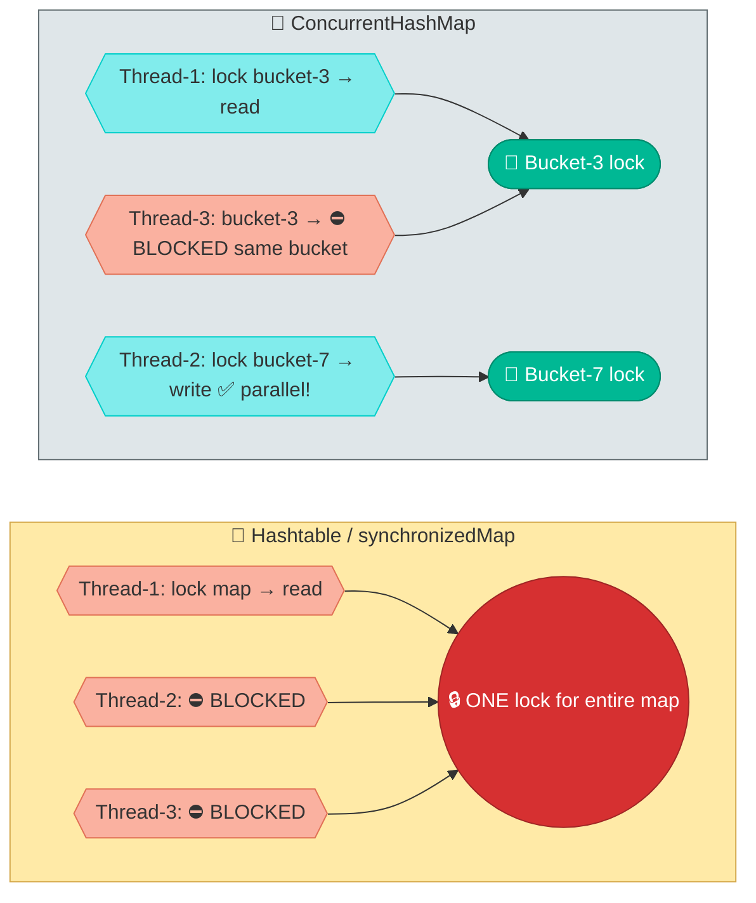

# Concurrent Collections in Java

Regular collections (`ArrayList`, `HashMap`, `HashSet`) are **not thread-safe**. When multiple threads read and write to them simultaneously, you get corrupted data or `ConcurrentModificationException`. Concurrent collections solve this problem.

---

## The Problem

```java
// This WILL throw ConcurrentModificationException
List<String> list = new ArrayList<>(List.of("A", "B", "C"));

// Thread 1: iterating
for (String s : list) {
    System.out.println(s);
}

// Thread 2: modifying (simultaneously)
list.add("D");  // ConcurrentModificationException!
```

---

## Solutions at a Glance

| Problem | Bad solution | Good solution |
|---|---|---|
| Thread-safe list | `Collections.synchronizedList()` | `CopyOnWriteArrayList` |
| Thread-safe set | `Collections.synchronizedSet()` | `CopyOnWriteArraySet`, `ConcurrentSkipListSet` |
| Thread-safe map | `Collections.synchronizedMap()` / `Hashtable` | `ConcurrentHashMap` |
| Thread-safe queue | — | `ConcurrentLinkedQueue`, `BlockingQueue` |

**Why are `synchronized` wrappers bad?** They lock the **entire collection** on every operation. One thread reading blocks all other threads from reading or writing. Very slow under contention.

---

## ConcurrentHashMap

The most important concurrent collection. Used heavily in production systems.

### How It Works


```mermaid
flowchart LR
    subgraph OLD["🐌 Hashtable / synchronizedMap"]
        direction LR
        O1{{"Thread-1: lock map → read"}} --> OL(("🔒 ONE lock for entire map"))
        O2{{"Thread-2: ⛔ BLOCKED"}} --> OL
        O3{{"Thread-3: ⛔ BLOCKED"}} --> OL
    end

    subgraph NEW["🚀 ConcurrentHashMap"]
        direction LR
        N1{{"Thread-1: lock bucket-3 → read"}} --> NL1(["🔑 Bucket-3 lock"])
        N2{{"Thread-2: lock bucket-7 → write ✅ parallel!"}} --> NL2(["🔑 Bucket-7 lock"])
        N3{{"Thread-3: bucket-3 → ⛔ BLOCKED same bucket"}} --> NL1
    end

    style OLD fill:#ffeaa7,stroke:#d4a84b,color:#333
    style NEW fill:#dfe6e9,stroke:#636e72,color:#333
    style OL fill:#d63031,stroke:#a02525,color:#fff
    style NL1 fill:#00b894,stroke:#008c6e,color:#fff
    style NL2 fill:#00b894,stroke:#008c6e,color:#fff
    style O1 fill:#fab1a0,stroke:#e17055,color:#333
    style O2 fill:#fab1a0,stroke:#e17055,color:#333
    style O3 fill:#fab1a0,stroke:#e17055,color:#333
    style N1 fill:#81ecec,stroke:#00cec9,color:#333
    style N2 fill:#81ecec,stroke:#00cec9,color:#333
    style N3 fill:#fab1a0,stroke:#e17055,color:#333
```

- **Java 7**: Segment-based locking (16 segments by default)
- **Java 8+**: Per-bucket locking using CAS (Compare-And-Swap) operations + `synchronized` blocks. Even more fine-grained.

### Key Operations

```java
ConcurrentHashMap<String, Integer> map = new ConcurrentHashMap<>();

// Basic operations (thread-safe)
map.put("Java", 1);
map.get("Java");
map.remove("Java");

// Atomic compound operations (key differentiator)
map.putIfAbsent("Java", 1);       // only puts if key doesn't exist
map.computeIfAbsent("Java", k -> expensiveCompute(k));  // lazy computation
map.computeIfPresent("Java", (k, v) -> v + 1);          // atomic update
map.merge("Java", 1, Integer::sum);                       // atomic merge

// Atomic counter pattern
map.compute("pageViews", (key, val) -> val == null ? 1 : val + 1);
```

### ConcurrentHashMap vs Hashtable vs synchronizedMap

| Feature | `Hashtable` | `synchronizedMap` | `ConcurrentHashMap` |
|---|---|---|---|
| Lock granularity | Entire table | Entire map | Per-bucket (fine-grained) |
| Null keys/values | No | Depends on backing map | No |
| Iteration | Fail-fast | Fail-fast | **Weakly consistent** (no exception) |
| Performance | Slow | Slow | Fast under contention |
| Read locking | Yes | Yes | **No** (reads are lock-free) |

---

## CopyOnWriteArrayList

Creates a **new copy of the internal array** on every write operation. Reads are always lock-free.

```java
CopyOnWriteArrayList<String> list = new CopyOnWriteArrayList<>();
list.add("A");
list.add("B");

// Safe to iterate while another thread modifies
for (String s : list) {
    System.out.println(s);  // reads the snapshot — never throws CME
}
```

### When to Use

| Use when | Don't use when |
|---|---|
| Reads >>> Writes (e.g., listener lists, config) | Frequent writes (copying the array on every write is expensive) |
| Small lists (< 100 elements) | Large lists (copying 10,000 elements per write is slow) |
| Need safe iteration without locking | Need fast concurrent writes |

**Real-world example**: Spring's event listener registry uses `CopyOnWriteArrayList` because listeners are registered once but invoked on every event.

---

## BlockingQueue — Producer-Consumer Pattern

`BlockingQueue` blocks the calling thread when the queue is full (for `put`) or empty (for `take`).


```mermaid
flowchart LR
    P[/"🏭 Producer"/] -->|"put()"| Q{{"📦 BlockingQueue<br/>⏸️ blocks if full"}}
    Q -->|"take()"| C(["🛒 Consumer<br/>⏸️ blocks if empty"])

    style P fill:#6c5ce7,stroke:#4a3db8,color:#fff
    style Q fill:#fdcb6e,stroke:#d4a84b,color:#333
    style C fill:#00b894,stroke:#008c6e,color:#fff
```

### Implementations

| Type | Bounded? | Ordering | Best for |
|---|---|---|---|
| `ArrayBlockingQueue` | Yes (fixed size) | FIFO | Bounded producer-consumer |
| `LinkedBlockingQueue` | Optional | FIFO | High-throughput queues |
| `PriorityBlockingQueue` | No | Priority | Task scheduling |
| `SynchronousQueue` | No (size 0) | Direct handoff | Thread pools (Executors) |
| `DelayQueue` | No | Delayed | Scheduled tasks |

### Producer-Consumer Example

```java
BlockingQueue<String> queue = new ArrayBlockingQueue<>(10);

// Producer thread
new Thread(() -> {
    try {
        queue.put("Task-1");  // blocks if queue is full
        queue.put("Task-2");
    } catch (InterruptedException e) {
        Thread.currentThread().interrupt();
    }
}).start();

// Consumer thread
new Thread(() -> {
    try {
        String task = queue.take();  // blocks if queue is empty
        process(task);
    } catch (InterruptedException e) {
        Thread.currentThread().interrupt();
    }
}).start();
```

---

## ConcurrentLinkedQueue

Non-blocking, lock-free queue using CAS operations. Best for high-throughput scenarios where you don't need blocking behavior.

```java
ConcurrentLinkedQueue<String> queue = new ConcurrentLinkedQueue<>();
queue.offer("A");
queue.offer("B");
String head = queue.poll();  // "A" (returns null if empty, never blocks)
```

---

## ConcurrentSkipListMap / ConcurrentSkipListSet

Thread-safe **sorted** collections (like `TreeMap`/`TreeSet` but concurrent).

```java
ConcurrentSkipListMap<String, Integer> map = new ConcurrentSkipListMap<>();
map.put("Banana", 2);
map.put("Apple", 5);
map.put("Cherry", 1);
// Iterates in sorted order: Apple, Banana, Cherry
```

---

## Choosing the Right Concurrent Collection

| Need | Use |
|---|---|
| Thread-safe map, high concurrency | `ConcurrentHashMap` |
| Thread-safe sorted map | `ConcurrentSkipListMap` |
| Thread-safe list, mostly reads | `CopyOnWriteArrayList` |
| Producer-consumer pattern | `ArrayBlockingQueue` / `LinkedBlockingQueue` |
| Non-blocking queue | `ConcurrentLinkedQueue` |
| Thread-safe sorted set | `ConcurrentSkipListSet` |

---

## Interview Questions

??? question "1. Why does ConcurrentHashMap not allow null keys or values?"
    Because `null` is ambiguous in concurrent contexts. If `map.get(key)` returns `null`, you can't tell if the key doesn't exist or if the value is `null` — and in a concurrent map, you can't use `containsKey()` + `get()` atomically (another thread might modify between the two calls). HashMap doesn't have this problem because it's single-threaded.

??? question "2. Can you iterate over a ConcurrentHashMap while another thread modifies it?"
    **Yes.** ConcurrentHashMap iterators are **weakly consistent** — they reflect the state at (or after) the time the iterator was created. They never throw `ConcurrentModificationException`. They might or might not reflect concurrent modifications made after the iterator was created.

??? question "3. How would you implement a thread-safe counter using ConcurrentHashMap?"
    Use `compute()` or `merge()`:
    ```java
    ConcurrentHashMap<String, Long> counters = new ConcurrentHashMap<>();
    counters.merge("pageViews", 1L, Long::sum);  // atomic increment
    ```
    Or for simple counters, use `AtomicLong` or `LongAdder` (faster under high contention).

??? question "4. What is the difference between `ArrayBlockingQueue` and `LinkedBlockingQueue`?"
    `ArrayBlockingQueue` has a **fixed capacity** (must specify at creation), uses a single lock for put and take. `LinkedBlockingQueue` has **optional capacity** (defaults to `Integer.MAX_VALUE`), uses **two separate locks** (one for put, one for take) so producers and consumers can work in parallel. LinkedBlockingQueue generally has higher throughput.
