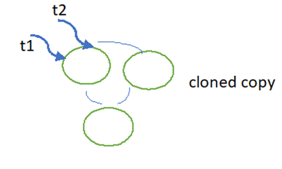

## Concurrent Collections

## Need of Concurrent Collections:

1. Multiple threads can operate simultaneously , there may be data inconsistency
2. Performance is not up to the mark.
3. While one thread is iterating a collection object , by mistake if other thread trying to modify the collection immediately iterator fails by raising Concurrent Modification Exception.

        
         ArrayList<String> al = new ArrayList< ();

        al.add("CTS");

        al.add("TCS");

        al.add("CAPGEMINI");

        al.add("Infosys");

        for(String hs:al){

        if(hs.equals ("Infosys")){
 
        al.remove (hs);

        }
        }

Exception in thread "main" java.util.ConcurrentModificationException

      Map<String, Long phoneBook = new HashMap<String, Long();
      phoneBook.put("Vikram",8149101254L);
      phoneBook.put("Mike",9020341211L);
      phoneBook.put("Jim",7788111284L);
      Iterator<String keyIterator1 = phoneBook.keySet().iterator();
      while (keyIterator1.hasNext()){
      String key = keyIterator1.next();
      if("Vikram".equals(key)){
      phoneBook.put("John",9220341211L);
      }
      }

1. Concurrent Hash Map
2. CopyOnWriteArrayList
3. CopyOnWrite HashSet

## Concurrent HashMap

- Underlying Data Structure is Hash table
- Concurrent HashMap allows concurrent Read and Thread Safe Update Operation
- To Perform Read Operation Thread won’t require any Lock. But to Perform Update Operation Thread requires Lock .But it is the lock of only a particular part of Map (Bucket Level Lock).
- Instead of Whole Map Concurrent Update achieved by Internally dividing Map into Similar Portion which is defined by Concurrency Level.
- The Default Concurrency Level is 16.
- So Concurrent Hash Map allows Simultaneous Read operations and 16 write/update operations.
- It never throws Concurrent Modified Exception.

  
  16-- concurrency level.

## Difference Between Concurrent Hash Map and Concurrent HashMap

| HashMap | Concurrent Hash Map |
| --- | --- |
| It is not Thread Safe | It is Thread Safe |
| Relatively Performance is High because Threads are not required to wait to Operate on Hash Map. | Relatively Performance is Low because Some Times Threads are required to wait to Operate on Concurrent Hash Map |
| While One Thread iterating Hash Map the other threads are not allowed to modify map objects otherwise we will get CME. | While One Thread iterating Hash Map the other threads are not allowed to modify map objects otherwise we won’t get CME. |
| Iterator of Hash map is fail fast | Iterator of `Concurrent Hash map is fail safe. |
| Null values are allowed | Null values |

## CopyOnWriteArrayList

Collection(I)

List(I)

CopyOnWriteArrayList (C)

It is a thread safe version of ArrayList , As the name indicates CopyOnWriteArrayList creates a cloned copy of underlying ArrayList for Every Update Operation. At Certain Point Both will Synchronized Automatically Which is taken care by JVM internally.

- As Update operation will be performed on cloned copy there is no effect for the threads which performs Read Operation
- It is costly to use because for every update Operation a cloned copy will be created. Hence it is the best option if several Read operations and less Write operations. Because if more Write operations are there then more cloned copies are created. Then performance will be degraded.
- Insertion Order is Preserved
- Duplicates are Allowed.
-

        CopyOnWriteArrayList<String al = new CopyOnWriteArrayList< ();
        al.add("CTS");
        al.add("TCS");
        al.add("CAPGEMINI");
        al.add("Infosys");
        for(String hs:al){
        if(hs.equals ("Infosys")){
        al.remove (hs);
        }
        }
        System.out.println (al);   
        }

## CopyOnWriteArraySet

Collection(I)

Set(I)

CopyOnWriteArraySet (C)

It is a thread safe version of Set , As the name indicates CopyOnWriteArrayList creates a cloned copy of underlying ArrayList for Every Update Operation. At Certain Point Both will Synchronized Automatically Which is taken care by JVM internally.

- As Update operation will be performed on cloned copy there is no effect for the threads which performs Read Operation
- It is costly to use because for every update Operation a cloned copy will be created. Hence it is the best option if several Read operations and less Write operations. Because if more Write operations are there then more cloned copies are created. Then performance will be degraded.
- Insertion Order is Preserved
- Duplicates are Not Allowed.
