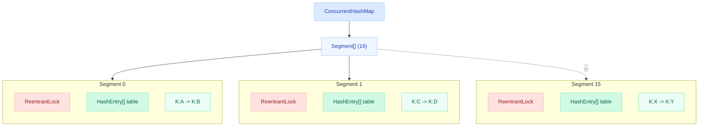
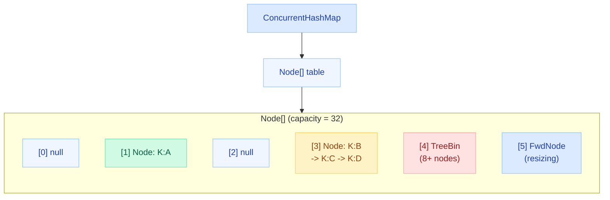
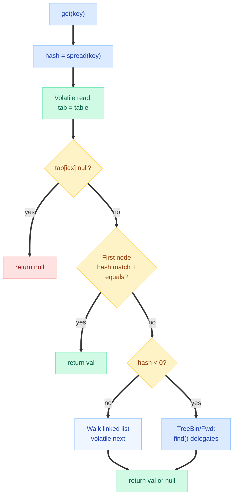
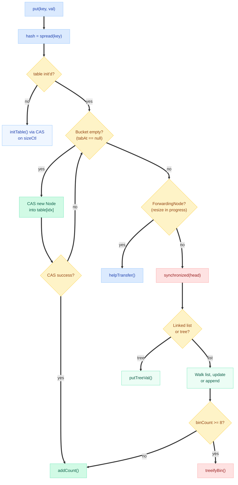
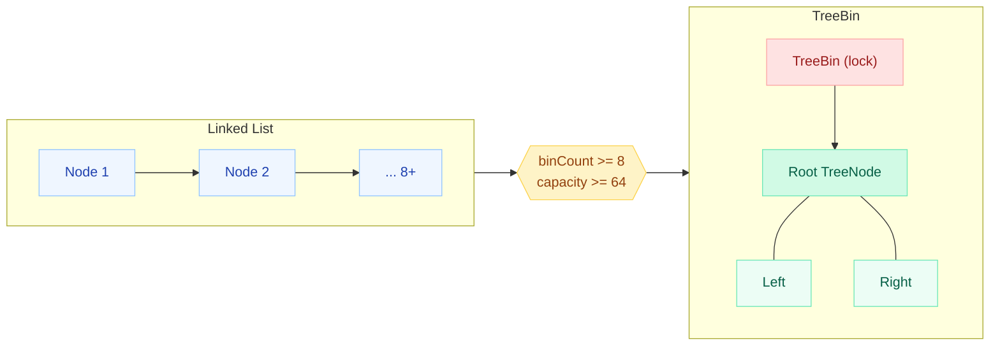
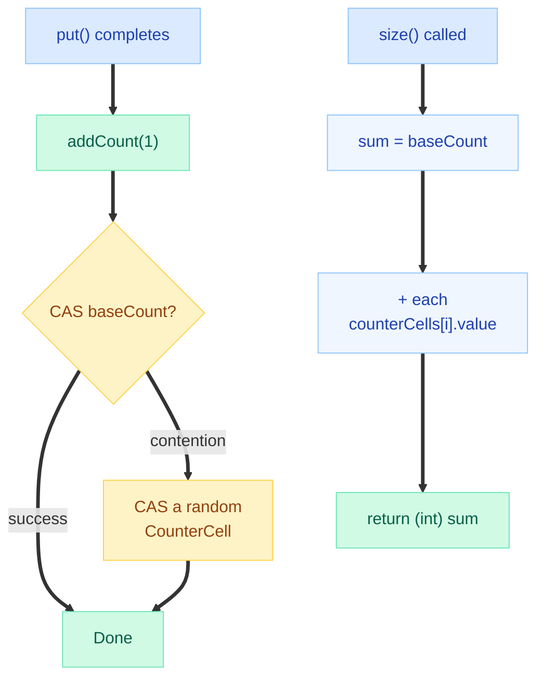
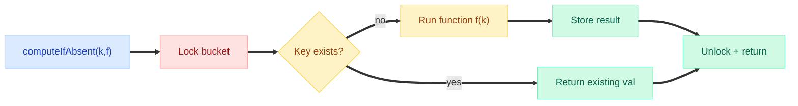
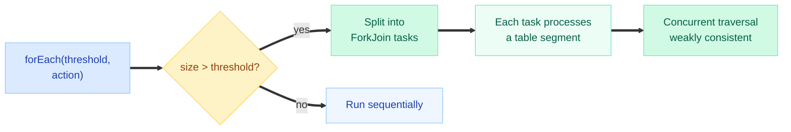
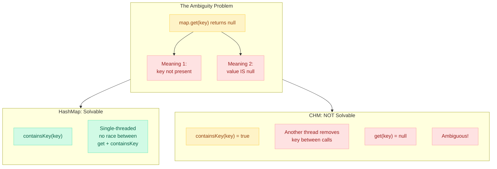
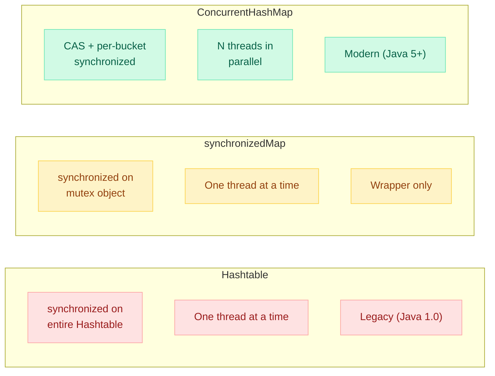

# ConcurrentHashMap Internals

> **"ConcurrentHashMap is the most important class in java.util.concurrent — if you understand it, you understand modern lock-free design." — Doug Lea**

---

!!! danger "Real Incident: Data Corruption from HashMap in Multi-Threaded Service"
    A payments service used a plain `HashMap` as an in-memory cache shared across 32 request-handling threads. Under load, threads performing concurrent `put()` calls caused **silent data corruption** — entries disappeared, `get()` returned wrong values, and the `size()` field drifted from reality. The team only noticed when reconciliation jobs flagged $47K in missing transactions. Root cause: two threads resizing the internal array simultaneously caused **lost writes and phantom entries**. Switching to `ConcurrentHashMap` fixed it with zero code changes beyond the declaration.

---

## Java 7 Architecture — Segment-Based Locking

In Java 7, `ConcurrentHashMap` used a **Segment** array. Each Segment is essentially a mini-HashMap with its own `ReentrantLock`. The default was 16 segments, meaning up to 16 threads could write concurrently without contention.



**How routing worked:**

1. Compute `hash(key)`
2. Use **upper bits** to select a Segment: `segments[(hash >>> segmentShift) & segmentMask]`
3. Use **lower bits** for the bucket index within that Segment's internal table

**Limitations of Java 7 design:**

- Fixed concurrency level at construction (default 16) — cannot grow
- Memory overhead: 16 Segment objects + 16 separate arrays even for small maps
- `size()` required locking ALL segments (expensive)
- Lock granularity limited to segment level — two keys in same segment still contend

---

## Java 8+ Architecture — Node Array + CAS + synchronized

Java 8 completely redesigned `ConcurrentHashMap`. Gone are the Segments. Now it uses a single `Node[]` array with **per-bucket** locking via CAS and `synchronized` on the head node.



**Key internal node types:**

| Node Type | Purpose |
|---|---|
| `Node<K,V>` | Regular linked-list node (hash, key, val, next) |
| `TreeBin` | Wrapper holding root of red-black tree for high-collision buckets |
| `TreeNode` | Node within the red-black tree |
| `ForwardingNode` | Placeholder during resize — redirects reads to new table |
| `ReservationNode` | Placeholder during `computeIfAbsent` |

**Key fields in the class:**

```java
transient volatile Node<K,V>[] table;      // the bucket array
private transient volatile Node<K,V>[] nextTable; // used during resize
private transient volatile long baseCount;  // base counter for size
private transient volatile int sizeCtl;     // controls init/resize
private transient volatile CounterCell[] counterCells; // striped counters
```

---

## get() Operation — No Locking

The `get()` method NEVER acquires any lock. It relies entirely on `volatile` reads to see the latest state.



**Why does this work without locks?**

- `table` is declared `volatile` — thread always reads the latest reference
- `Node.val` and `Node.next` are declared `volatile` — writes by put() are visible to get()
- Nodes are never mutated in place for key/value — new nodes replace old ones
- During resize, `ForwardingNode` in old table redirects to new table

```java
// Simplified get() — no locks anywhere
public V get(Object key) {
    Node<K,V>[] tab; Node<K,V> e; int n, eh; K ek;
    int h = spread(key.hashCode());
    if ((tab = table) != null && (n = tab.length) > 0 &&
        (e = tabAt(tab, (n - 1) & h)) != null) {       // volatile read
        if ((eh = e.hash) == h) {
            if ((ek = e.key) == key || (ek != null && key.equals(ek)))
                return e.val;
        } else if (eh < 0)  // TreeBin or ForwardingNode
            return (e = e.find(h, key)) != null ? e.val : null;
        while ((e = e.next) != null) {  // walk list via volatile next
            if (e.hash == h &&
                ((ek = e.key) == key || (ek != null && key.equals(ek))))
                return e.val;
        }
    }
    return null;
}
```

!!! tip "Interview Gold"
    `get()` in ConcurrentHashMap is **completely lock-free**. It never blocks, never retries, and never spins. This is why read-heavy workloads scale linearly with threads.

---

## put() Operation — CAS + synchronized

The `put()` method uses a two-level strategy:

1. **Empty bucket** — use CAS (Compare-And-Swap) to install the first node (lock-free)
2. **Non-empty bucket** — `synchronized` on the head node of that bucket only



**Why CAS for empty buckets?** Most puts hit empty buckets (load factor 0.75 means ~25% of buckets are occupied). CAS is orders of magnitude faster than acquiring a monitor lock — no context switch, no memory barrier beyond the CAS itself.

**Why synchronized (not ReentrantLock) for non-empty buckets?** Since Java 6, HotSpot's built-in `synchronized` has been heavily optimized with biased locking, thin locks, and adaptive spinning. For the short critical sections in CHM, it's faster than `ReentrantLock` and uses less memory (no separate Lock object per bucket).

```java
// Simplified put logic for non-empty bucket
synchronized (firstNodeInBucket) {
    if (tabAt(tab, i) == f) {  // double-check head hasn't changed
        // traverse list/tree, insert or update
    }
}
```

!!! warning "Critical Detail"
    The lock is on the **head node object itself**, not on the bucket index. This means if another thread replaces the head (e.g., during resize), the old lock is no longer relevant — the double-check inside synchronized handles this.

---

## Treeification — Same Threshold as HashMap

ConcurrentHashMap uses the same treeification rules as HashMap:

| Condition | Action |
|---|---|
| Chain length >= 8 AND capacity >= 64 | Convert linked list to red-black tree (`TreeBin`) |
| Chain length >= 8 AND capacity < 64 | **Resize** instead of treeify |
| Tree shrinks to <= 6 nodes | Convert back to linked list (untreeify) |



**TreeBin vs TreeNode:** Unlike HashMap where the tree root is stored directly in the table, CHM wraps the tree in a `TreeBin` object. TreeBin has its own read-write lock state to allow concurrent reads of the tree while writes (rebalancing) occur.

---

## size() and mappingCount() — LongAdder-Style Counting

Maintaining an accurate count in a concurrent map is expensive. A single `AtomicLong` would become a contention hotspot. ConcurrentHashMap uses the same approach as `LongAdder`:



**How it works:**

1. **`baseCount`** — a volatile long, updated via CAS for the uncontended fast path
2. **`CounterCell[]`** — array of cells, each on its own cache line (`@Contended`). Under contention, threads hash to a random cell and CAS that instead
3. **`size()`** sums `baseCount + all counterCells[i].value` — result is a **best-effort snapshot** (concurrent puts may be in-flight)

```java
// size() returns int (capped at Integer.MAX_VALUE)
public int size() {
    long n = sumCount();
    return ((n < 0L) ? 0 : (n > Integer.MAX_VALUE) ? Integer.MAX_VALUE : (int)n);
}

// mappingCount() returns long — prefer this for large maps
public long mappingCount() {
    long n = sumCount();
    return (n < 0L) ? 0L : n;
}
```

!!! tip "Use `mappingCount()` for maps > 2 billion entries"
    `size()` is capped at `Integer.MAX_VALUE`. `mappingCount()` returns the full `long` count.

---

## Atomic Compound Operations

These methods execute atomically — no external synchronization needed:

### compute(), computeIfAbsent(), computeIfPresent(), merge()

```java
// Thread-safe cache population — NO double computation
ConcurrentHashMap<String, ExpensiveObject> cache = new ConcurrentHashMap<>();

// Only ONE thread computes if key is absent
ExpensiveObject obj = cache.computeIfAbsent("key", k -> {
    return loadFromDatabase(k);  // called at most ONCE per key
});

// Atomic read-modify-write
cache.compute("counter", (k, v) -> v == null ? 1 : v + 1);

// Atomic merge
cache.merge("key", newValue, (oldVal, newVal) -> oldVal + newVal);
```

**Under the hood:** These methods acquire the `synchronized` lock on the bucket head (or use CAS for empty buckets), then execute the lambda while holding the lock. This guarantees:

- The mapping function runs **exactly once** per successful call
- No other thread can modify the same key concurrently
- The function sees a consistent view of the current value



!!! danger "Do NOT call computeIfAbsent recursively on the same map"
    If the mapping function tries to modify the **same ConcurrentHashMap** it's computing for (especially the same bucket), you get a **deadlock**. The thread already holds the bucket lock and tries to re-acquire it.

    ```java
    // DEADLOCK! Function modifies the same map/bucket
    map.computeIfAbsent("A", k -> {
        map.computeIfAbsent("B", k2 -> "val");  // may deadlock if same bucket
        return "val";
    });
    ```

---

## Bulk Parallel Operations

Java 8 added bulk operations that leverage the ForkJoinPool for parallel execution:

### forEach(), reduce(), search()

```java
ConcurrentHashMap<String, Long> metrics = new ConcurrentHashMap<>();

// Parallel forEach — threshold = 10000
// If map has more than 10000 entries, operations run in parallel
metrics.forEach(10000, (key, value) -> {
    System.out.println(key + " = " + value);
});

// Parallel reduce — sum all values
long total = metrics.reduceValuesToLong(10000, Long::longValue, 0L, Long::sum);

// Parallel search — find first match, short-circuits
String found = metrics.search(10000, (key, value) -> {
    return value > 1000 ? key : null;  // null means "keep searching"
});
```

**Parallelism threshold parameter:**

| Threshold | Behavior |
|---|---|
| `Long.MAX_VALUE` | Sequential (single thread) |
| `1` | Maximum parallelism (uses common ForkJoinPool) |
| `n` | Parallelize if estimated map size > n |



**Variants available:**

- `forEach(threshold, action)` — apply to each entry
- `forEachKey`, `forEachValue` — operate on keys/values only
- `reduce(threshold, transformer, reducer)` — map-reduce style
- `reduceKeys`, `reduceValues`, `reduceEntries`
- `reduceToLong`, `reduceToDouble`, `reduceToInt` — primitive specializations
- `search(threshold, function)` — find first non-null result, then stop

!!! info "Weakly Consistent"
    Bulk operations reflect the state of the map at some point during traversal. They may or may not see concurrent modifications. They never throw `ConcurrentModificationException`.

---

## Why Null Keys and Values Are Banned

HashMap allows one null key and any number of null values. ConcurrentHashMap **bans both**. Here's why:



**In HashMap** you can do:
```java
if (map.containsKey(key)) {
    V val = map.get(key);  // safe — single thread
}
```

**In ConcurrentHashMap** this is a TOCTOU race:
```java
if (map.containsKey(key)) {   // true
    // another thread removes key HERE
    V val = map.get(key);     // null — but was it null value or removed?
}
```

By banning null, `get(key) == null` **always** means "key not present." Simple, unambiguous, race-free.

---

## ConcurrentHashMap vs synchronizedMap vs Hashtable



| Feature | Hashtable | synchronizedMap | ConcurrentHashMap |
|---|---|---|---|
| **Lock scope** | Entire table | Entire map | Per-bucket |
| **Read locking** | Yes (synchronized) | Yes (synchronized) | **None** (volatile) |
| **Write concurrency** | 1 thread | 1 thread | **N threads** (one per bucket) |
| **Null key/value** | No / No | Depends on wrapped map | No / No |
| **Iterator** | Fail-fast | Fail-fast | **Weakly consistent** |
| **Atomic ops** | None built-in | None built-in | compute, merge, putIfAbsent |
| **Bulk parallel ops** | No | No | **Yes** (forEach, reduce, search) |
| **size() accuracy** | Exact (locked) | Exact (locked) | Best-effort estimate |
| **Performance @ 32 threads** | Terrible | Terrible | **Excellent** |

!!! warning "Never Use Hashtable or synchronizedMap in New Code"
    Both use a global lock — one writer blocks ALL readers and writers. Under even moderate concurrency (4+ threads), they become a serial bottleneck. `ConcurrentHashMap` is strictly superior.

---

## Common Patterns

### Pattern 1: Thread-Safe Cache with computeIfAbsent

```java
private final ConcurrentHashMap<String, Connection> connectionPool = new ConcurrentHashMap<>();

public Connection getConnection(String host) {
    return connectionPool.computeIfAbsent(host, h -> {
        return createNewConnection(h);  // expensive, runs only once per key
    });
}
```

**Why not `putIfAbsent`?** Because `putIfAbsent` requires you to create the value BEFORE checking — wasteful if the key already exists:

```java
// BAD: creates connection even if key exists
connectionPool.putIfAbsent(host, createNewConnection(host));

// GOOD: only creates if absent
connectionPool.computeIfAbsent(host, h -> createNewConnection(h));
```

### Pattern 2: Concurrent Set via newKeySet()

```java
// Thread-safe Set backed by ConcurrentHashMap
Set<String> concurrentSet = ConcurrentHashMap.newKeySet();
concurrentSet.add("item1");
concurrentSet.remove("item1");
concurrentSet.contains("item1"); // lock-free

// Or from existing map — view of its keys
Set<String> keyView = existingMap.keySet(defaultValue);
keyView.add("newKey"); // adds "newKey" -> defaultValue to the map
```

### Pattern 3: Atomic Counter Map

```java
ConcurrentHashMap<String, LongAdder> counters = new ConcurrentHashMap<>();

// Thread-safe increment — no race conditions
public void increment(String key) {
    counters.computeIfAbsent(key, k -> new LongAdder()).increment();
}

public long getCount(String key) {
    LongAdder adder = counters.get(key);
    return adder == null ? 0 : adder.sum();
}
```

### Pattern 4: Conditional Remove and Replace

```java
// Remove only if value matches (atomic check-and-remove)
map.remove("key", expectedValue);

// Replace only if current value matches (atomic check-and-swap)
map.replace("key", oldValue, newValue);
```

---

## Quick Recall

| Question | Answer |
|---|---|
| Java 7 design? | **16 Segments**, each a mini-HashMap with ReentrantLock |
| Java 8+ design? | **Single Node[] array**, CAS + synchronized per-bucket |
| get() locking? | **None** — volatile reads only |
| put() empty bucket? | **CAS** (lock-free) |
| put() non-empty bucket? | **synchronized** on head node |
| Why not ReentrantLock? | synchronized is faster (JVM-optimized) + less memory |
| Treeify threshold? | **8** nodes (same as HashMap), capacity >= 64 |
| size() mechanism? | baseCount + CounterCell[] (LongAdder-style striping) |
| size() vs mappingCount()? | size() capped at Integer.MAX_VALUE; mappingCount() returns long |
| Why no null key/value? | Ambiguity: get()=null could mean absent OR value-is-null |
| ForwardingNode? | Placeholder during resize; redirects reads to new table |
| Iterators? | **Weakly consistent** — no ConcurrentModificationException |
| computeIfAbsent atomicity? | Function runs under bucket lock — exactly once |
| Bulk ops parallelism? | Threshold-based; uses ForkJoinPool |
| Default concurrency (Java 7)? | 16 segments |
| Default concurrency (Java 8+)? | Unbounded — one lock per occupied bucket |

---

## Interview Answer Template

!!! abstract "How to answer 'Explain ConcurrentHashMap internals'"

    **Step 1 — Evolution:** "Java 7 used 16 Segments, each a mini-HashMap with its own ReentrantLock. Java 8 eliminated Segments entirely — now it's a single Node array with CAS and per-bucket synchronized blocks."

    **Step 2 — get() is lock-free:** "get() never acquires any lock. The table, node values, and next pointers are all volatile. Reads always see the latest write without blocking."

    **Step 3 — put() strategy:** "For empty buckets, CAS installs the first node lock-free. For non-empty buckets, synchronized is acquired on the head node only — other buckets remain uncontended."

    **Step 4 — Size tracking:** "size() uses a LongAdder-style approach: a baseCount for the uncontended path, plus a CounterCell array where threads hash to random cells under contention. This avoids a single AtomicLong bottleneck."

    **Step 5 — Null prohibition:** "Null keys and values are banned because get() returning null would be ambiguous in a concurrent context — you can't distinguish 'key absent' from 'value is null' without a TOCTOU race."

    **Step 6 — Compound operations:** "computeIfAbsent, compute, and merge are atomic — the mapping function runs under the bucket lock, guaranteeing exactly-once execution and consistent reads."

    **Step 7 — Resize:** "During resize, ForwardingNodes redirect reads to the new table. Multiple threads can help transfer buckets in parallel via helpTransfer()."
