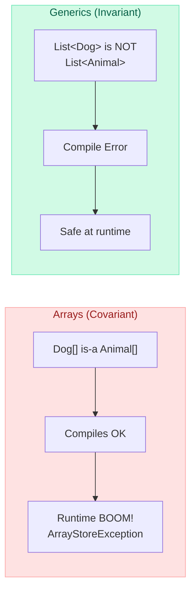
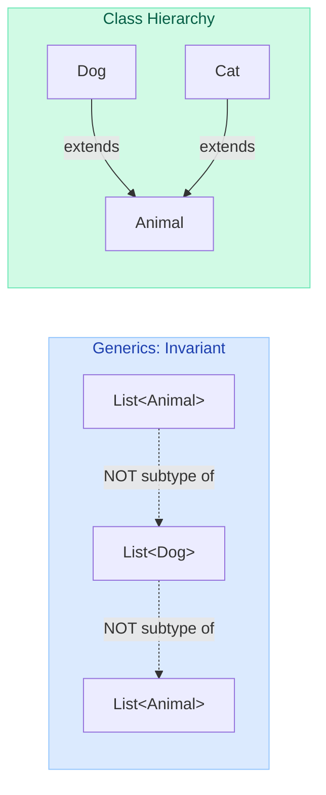
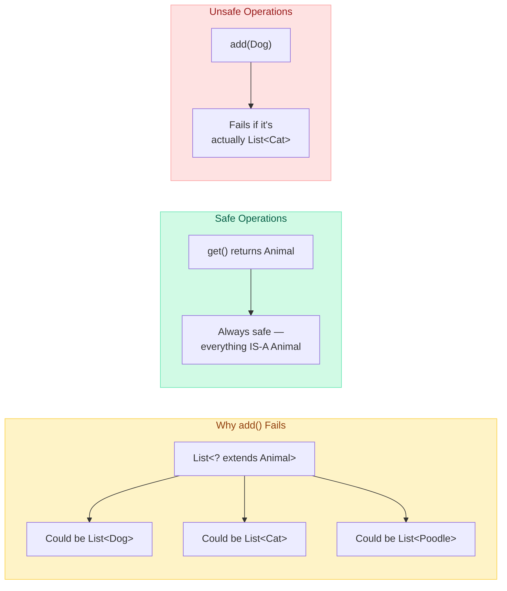
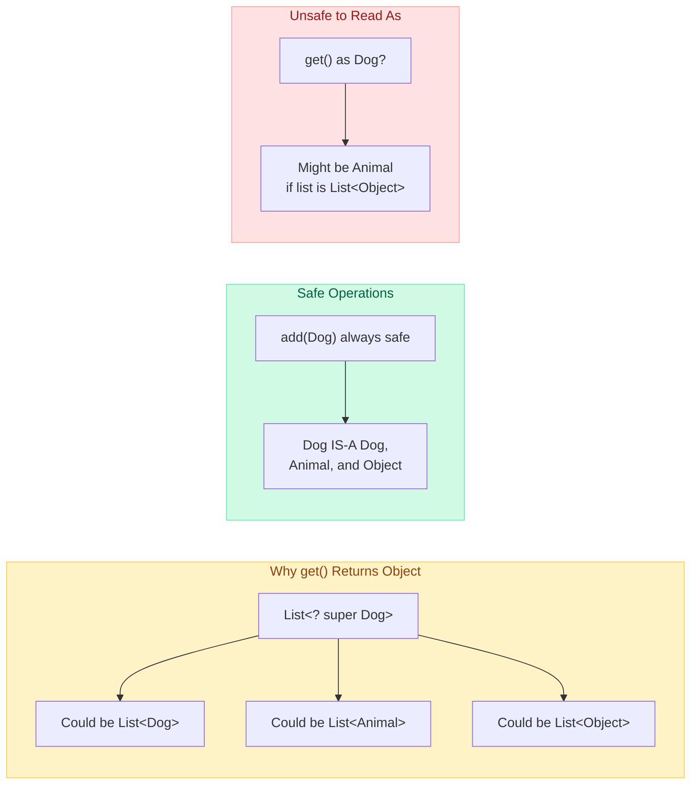
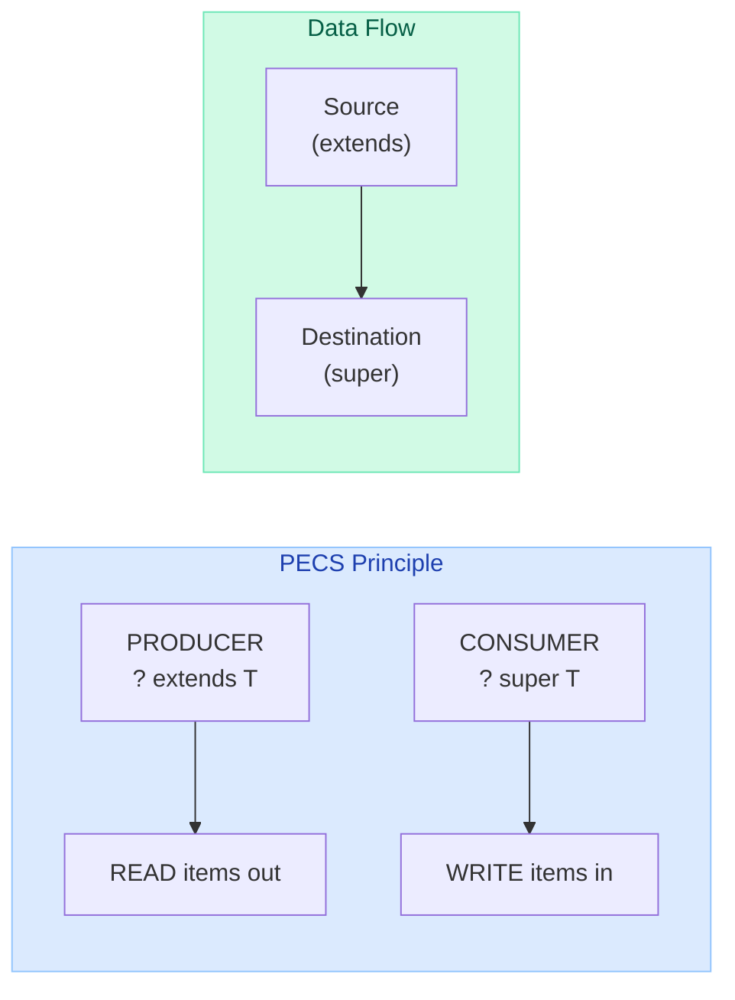
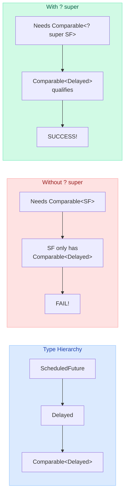
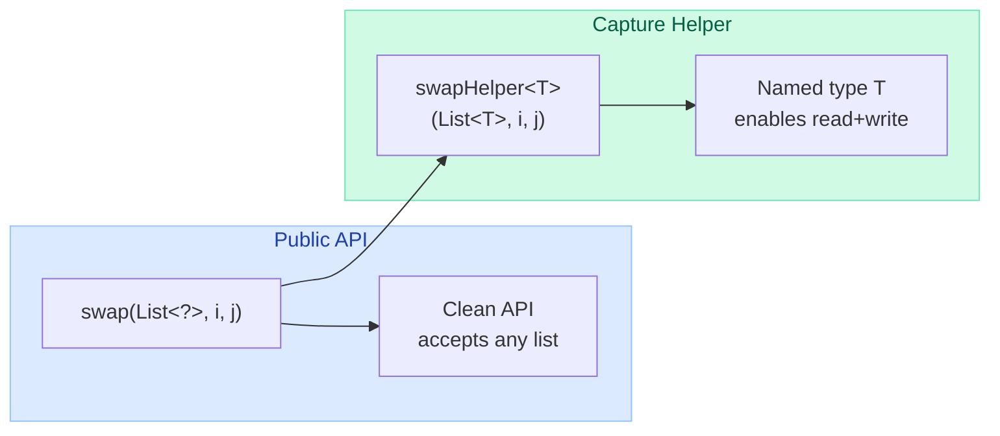
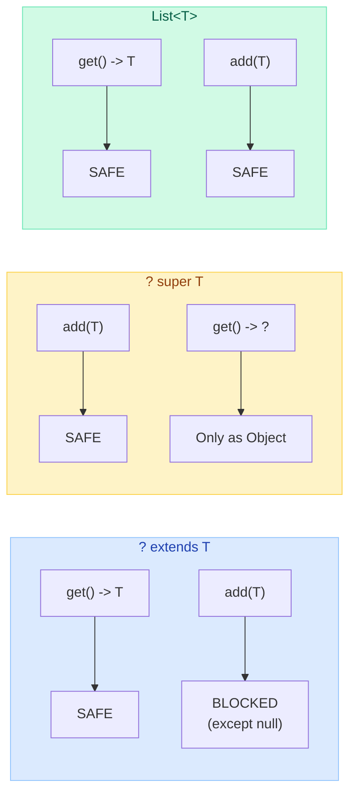

# Covariance, Contravariance & PECS

> "If you remember only one rule about Java generics, let it be PECS: **Producer Extends, Consumer Super**."
> -- Joshua Bloch, Effective Java

!!! danger "Real Production Incident"
    A senior engineer used `List<Animal>` as the parameter type for a utility method. Every call site that had `List<Dog>` or `List<Cat>` failed to compile — even though Dog IS-A Animal. The team wasted two days refactoring 47 call sites before someone suggested `List<? extends Animal>`. Understanding variance would have prevented this entirely.

---

## The Core Problem: Why Do We Need Variance?

In OOP, `Dog extends Animal`. You'd expect `List<Dog>` to be substitutable for `List<Animal>`. But Java generics say **no** — and for good reason.



---

## Array Covariance: Java's Historic Mistake

Java arrays are **covariant**: `Dog[]` IS-A `Animal[]`. This was a design decision from Java 1.0 (before generics existed) to allow writing methods like `Arrays.sort(Object[])`.

```java
// Arrays are covariant — compiles fine!
Animal[] animals = new Dog[3];   // Dog[] assigned to Animal[]
animals[0] = new Dog("Rex");     // OK — Dog is an Animal
animals[1] = new Cat("Whiskers"); // COMPILES! But throws ArrayStoreException at RUNTIME

// The JVM checks element types at every array write — O(1) cost per store
```

!!! warning "Why This Is Broken"
    The compiler says "sure, a Cat is an Animal, go ahead." But the underlying array is `Dog[]`, so the JVM throws `ArrayStoreException`. You've traded **compile-time safety** for a runtime bomb.

| Aspect | Arrays | Generics |
|--------|--------|----------|
| Variance | Covariant (broken) | Invariant (safe) |
| Type check | Runtime (`ArrayStoreException`) | Compile time (won't compile) |
| Reified? | Yes (type info at runtime) | No (erased at runtime) |
| Performance | Slight overhead per store | No runtime overhead |

---

## Why Generics Are Invariant

`List<Dog>` is **NOT** a subtype of `List<Animal>`. Here's why invariance is necessary:

```java
// IF this were allowed (it's NOT):
List<Dog> dogs = new ArrayList<>();
List<Animal> animals = dogs;       // COMPILE ERROR — invariant!

// If it compiled, you could do this:
animals.add(new Cat("Evil Cat"));  // Adding a Cat to a Dog list!
Dog d = dogs.get(0);              // ClassCastException — it's a Cat!
```



**The rule**: For generics, `G<A>` is a subtype of `G<B>` **only if** `A` is exactly `B`. No inheritance applies.

---

## Upper-Bounded Wildcards: `? extends T` (Covariance)

The `? extends T` wildcard makes a generic type **covariant** — it says "I accept T or any subtype of T."

```java
// Now this works!
List<Dog> dogs = List.of(new Dog("Rex"), new Dog("Buddy"));
List<? extends Animal> animals = dogs;  // OK! Dog extends Animal

// You can READ from it safely:
Animal a = animals.get(0);  // Fine — whatever is in there IS-A Animal

// But you CANNOT WRITE to it (except null):
animals.add(new Dog("Max"));  // COMPILE ERROR!
animals.add(new Cat("Tom"));  // COMPILE ERROR!
animals.add(null);            // Only null is allowed
```

### Why You Can't Add to `? extends`

The compiler doesn't know the **exact** type. It could be `List<Dog>`, `List<Cat>`, or `List<Poodle>`. Adding anything would be unsafe:



**Mnemonic**: `? extends T` = **read-only** (producer). You can **get** items out (as T), but you can't **put** items in.

---

## Lower-Bounded Wildcards: `? super T` (Contravariance)

The `? super T` wildcard makes a generic type **contravariant** — it says "I accept T or any supertype of T."

```java
// ? super Dog means: List<Dog>, List<Animal>, or List<Object>
List<Animal> animals = new ArrayList<>();
List<? super Dog> target = animals;  // OK! Animal is a supertype of Dog

// You can WRITE Dogs into it:
target.add(new Dog("Rex"));    // Safe — Dog fits in any of: Dog, Animal, Object
target.add(new Poodle("Fifi")); // Safe — Poodle IS-A Dog

// But you CANNOT READ typed values:
Dog d = target.get(0);     // COMPILE ERROR!
Animal a = target.get(0);  // COMPILE ERROR!
Object o = target.get(0);  // Only Object works — the universal supertype
```

### Why You Can't Read Typed from `? super`

The compiler doesn't know the **exact** supertype. It could be `List<Dog>`, `List<Animal>`, or `List<Object>`. Reading anything more specific than `Object` would be unsafe:



**Mnemonic**: `? super T` = **write-only** (consumer). You can **put** T items in, but you can only **get** items out as `Object`.

---

## PECS: Producer Extends, Consumer Super

The golden rule coined by Joshua Bloch:

| Role | Wildcard | You can... | Example |
|------|----------|------------|---------|
| **P**roducer | `? extends T` | **Read** (get) from it | Source of data |
| **C**onsumer | `? super T` | **Write** (add) to it | Destination for data |
| Both | Exact `T` | Read and write | When you need both |



### The Classic Example: `Collections.copy()`

```java
// JDK source — perfect PECS usage:
public static <T> void copy(List<? super T> dest,    // CONSUMER — writes to it
                            List<? extends T> src) {  // PRODUCER — reads from it
    for (int i = 0; i < src.size(); i++) {
        dest.set(i, src.get(i));
    }
}

// Usage:
List<Dog> dogs = List.of(new Dog("Rex"), new Dog("Max"));
List<Animal> animals = new ArrayList<>(Arrays.asList(new Animal[2]));

Collections.copy(animals, dogs);  // Dog extends Animal — works perfectly!
```

### Another Example: Custom merge method

```java
// Without PECS — too restrictive
public static <T> void merge(List<T> dest, List<T> src) { ... }
// merge(animalList, dogList) — FAILS! List<Dog> is not List<Animal>

// With PECS — flexible and correct
public static <T> void merge(List<? super T> dest, List<? extends T> src) {
    for (T item : src) {    // Reading from producer (extends)
        dest.add(item);     // Writing to consumer (super)
    }
}
// merge(animalList, dogList) — works! Animal super Dog, Dog extends Animal
```

---

## Unbounded Wildcard: `?`

Use `?` when you **genuinely don't care** about the type — you only use methods from `Object`.

```java
// Good use of unbounded wildcard
public static void printSize(List<?> list) {
    System.out.println("Size: " + list.size());  // size() doesn't depend on element type
}

// Also good — using Object methods only
public static boolean containsNull(List<?> list) {
    for (Object item : list) {
        if (item == null) return true;
    }
    return false;
}
```

| Wildcard | Meaning | Read as | Write | Read |
|----------|---------|---------|-------|------|
| `List<?>` | "list of something" | `Object` | Only `null` | As `Object` |
| `List<? extends T>` | "list of T or subtype" | `T` | Only `null` | As `T` |
| `List<? super T>` | "list of T or supertype" | `Object` | `T` and subtypes | As `Object` |

---

## Real-World JDK Examples

### 1. `Comparable<? super T>` — Why Not `Comparable<T>`?

```java
// Overly restrictive:
public static <T extends Comparable<T>> T max(Collection<T> coll) { ... }

// Better — works with inherited comparisons:
public static <T extends Comparable<? super T>> T max(Collection<? extends T> coll) { ... }
```

**Why?** Consider `ScheduledFuture<V>`:
- `ScheduledFuture` extends `Delayed`
- `Delayed` extends `Comparable<Delayed>` (not `Comparable<ScheduledFuture>`)
- With `Comparable<T>`, you can't call `max()` on a `List<ScheduledFuture>`
- With `Comparable<? super T>`, it works because `Comparable<Delayed>` is `Comparable<? super ScheduledFuture>`



### 2. `Stream.map()` Signature

```java
<R> Stream<R> map(Function<? super T, ? extends R> mapper);
//                         ^^^^^^^^    ^^^^^^^^^^
//                         CONSUMER    PRODUCER
// The function CONSUMES T (takes it as input) → ? super T
// The function PRODUCES R (returns it as output) → ? extends R
```

### 3. `Collections.sort()` with Comparator

```java
public static <T> void sort(List<T> list, Comparator<? super T> c) { ... }
//                                                   ^^^^^^^^
// Comparator CONSUMES T values (takes them as input to compare)
// So a Comparator<Animal> can sort a List<Dog> — Animal is a supertype of Dog
```

### 4. `Optional.flatMap()`

```java
public <U> Optional<U> flatMap(Function<? super T, ? extends Optional<? extends U>> mapper);
// The function consumes T (super) and produces Optional<U> (extends)
```

---

## Multiple Bounds with Variance

You can combine bounds with variance for maximum flexibility:

```java
// "T must be Comparable with itself or its supertypes AND Serializable"
public static <T extends Comparable<? super T> & Serializable> T max(List<? extends T> list) {
    return list.stream().max(Comparator.naturalOrder()).orElseThrow();
}
```

**Reading the declaration**:

| Part | Meaning |
|------|---------|
| `<T extends Comparable<? super T>` | T can compare against itself or supertypes |
| `& Serializable>` | T must also be Serializable |
| `List<? extends T>` | Method accepts lists of T or any subtype |

---

## The Capture Helper Pattern

Sometimes the compiler sees `?` but needs a concrete type name to work with. The "capture helper" introduces a named type:

```java
// This WON'T compile:
public static void swap(List<?> list, int i, int j) {
    list.set(i, list.get(j));  // ERROR: can't put 'capture of ?' into List<?>
}

// Fix with a capture helper:
public static void swap(List<?> list, int i, int j) {
    swapHelper(list, i, j);  // Delegate to helper that "captures" the ?
}

// The helper assigns a name (T) to the wildcard
private static <T> void swapHelper(List<T> list, int i, int j) {
    T temp = list.get(i);
    list.set(i, list.get(j));
    list.set(j, temp);
}
```

**Why this works**: The compiler can infer that `T` = the actual element type of the list. Once named, you can read and write freely.



---

## Variance in Return Types and Method Parameters

### Covariant Return Types (since Java 5)

Java allows overriding methods to return a **more specific** type:

```java
class Animal {
    Animal create() { return new Animal(); }
}

class Dog extends Animal {
    @Override
    Dog create() { return new Dog(); }  // More specific return — covariant!
}
```

### Method Parameters Are Invariant

Method parameters must match **exactly** when overriding:

```java
class Processor {
    void process(List<Animal> animals) { ... }
}

class DogProcessor extends Processor {
    // This is NOT an override — it's an OVERLOAD!
    void process(List<Dog> dogs) { ... }
}
```

| Position | Variance | Reason |
|----------|----------|--------|
| Return type | Covariant | Callers expect base type, more specific is fine |
| Method params | Invariant | Compiler needs exact match for overriding |
| Generic types | Invariant by default | Use wildcards for variance |

---

## Comparison with Other Languages

Java uses **use-site variance** (wildcards at each usage). Other languages use **declaration-site variance** (variance declared once on the class).

### Kotlin: `out` and `in`

```kotlin
// Declaration-site variance in Kotlin
interface Producer<out T> {   // Covariant — like ? extends T
    fun produce(): T          // T only in OUT position (return types)
}

interface Consumer<in T> {    // Contravariant — like ? super T
    fun consume(item: T)      // T only in IN position (parameters)
}

// Usage — no wildcards needed!
val dogs: Producer<Dog> = ...
val animals: Producer<Animal> = dogs  // Works! out = covariant
```

### C#: `out` and `in`

```csharp
// Declaration-site variance in C#
interface IEnumerable<out T> { ... }    // Covariant
interface IComparer<in T> { ... }       // Contravariant

IEnumerable<Dog> dogs = ...;
IEnumerable<Animal> animals = dogs;     // Works! out = covariant
```

| Feature | Java | Kotlin | C# |
|---------|------|--------|-----|
| Variance style | Use-site (wildcards) | Declaration-site (`out`/`in`) | Declaration-site (`out`/`in`) |
| Covariance | `? extends T` | `out T` | `out T` |
| Contravariance | `? super T` | `in T` | `in T` |
| Invariance | No wildcard | No modifier | No modifier |
| Array covariance | Yes (broken) | No (safe) | Yes (broken, like Java) |
| Verbosity | High (wildcards everywhere) | Low (declared once) | Low (declared once) |

---

## Common Patterns and Anti-Patterns

### Pattern: API Design with PECS

```java
// BAD — too restrictive
public void addAll(Collection<E> c) { ... }

// GOOD — PECS applied (c is a PRODUCER of E values)
public void addAll(Collection<? extends E> c) { ... }

// BAD — too restrictive
public void drainTo(Collection<E> c) { ... }

// GOOD — PECS applied (c is a CONSUMER of E values)
public void drainTo(Collection<? super E> c) { ... }
```

### Anti-Pattern: Wildcard in Return Types

```java
// BAD — forces callers to deal with wildcards
public List<? extends Animal> getAnimals() { ... }

// GOOD — concrete return type, callers have full type info
public List<Animal> getAnimals() { ... }
```

!!! tip "Bloch's Rule"
    **Do not use wildcard types as return types.** If the user of a class has to think about wildcard types, there is probably something wrong with the class's API.

---

## Summary: What You Can and Cannot Do



| Operation | `List<? extends T>` | `List<? super T>` | `List<T>` |
|-----------|--------------------|--------------------|-----------|
| `get()` returns | `T` | `Object` | `T` |
| `add(T)` | **NO** (except null) | **YES** | **YES** |
| `add(subtype of T)` | **NO** | **YES** | **YES** |
| `size()`, `isEmpty()` | YES | YES | YES |
| Use case | Reading / producing | Writing / consuming | Both |

---

## Interview Questions

!!! abstract "Top Interview Questions (Ranked by Difficulty)"

### Q1: Why is `List<Dog>` not a subtype of `List<Animal>`?

**Answer**: Because generics are invariant to ensure type safety. If `List<Dog>` were assignable to `List<Animal>`, you could add a `Cat` through the `List<Animal>` reference, corrupting the `List<Dog>`. Unlike arrays (which check at runtime via `ArrayStoreException`), generics enforce safety at compile time via invariance.

### Q2: Explain PECS with a real example.

**Answer**: **P**roducer **E**xtends, **C**onsumer **S**uper. In `Collections.copy(List<? super T> dest, List<? extends T> src)`:
- `src` is a **producer** (we read from it) -> `? extends T`
- `dest` is a **consumer** (we write to it) -> `? super T`

This lets you copy `List<Dog>` into `List<Animal>` because Dog extends Animal.

### Q3: Why can't you add to `List<? extends Animal>`?

**Answer**: The compiler doesn't know the exact type. It might be `List<Dog>`, `List<Cat>`, or `List<Poodle>`. If it's actually `List<Dog>`, adding a `Cat` would be unsafe. Since the compiler can't guarantee safety, it blocks all additions (except `null`, which is compatible with every reference type).

### Q4: What's the difference between `<T extends Comparable<T>>` and `<T extends Comparable<? super T>>`?

**Answer**: `Comparable<? super T>` is more flexible. It works for classes that inherit their `compareTo()` from a superclass. Example: `ScheduledFuture` implements `Delayed`, and `Delayed` implements `Comparable<Delayed>`. With `Comparable<T>`, you can't use `ScheduledFuture`. With `Comparable<? super T>`, it works because `Comparable<Delayed>` satisfies `Comparable<? super ScheduledFuture>`.

### Q5: When should you use `?` vs `T`?

**Answer**:
- Use `?` when the type parameter appears **only once** in the method signature and you don't need to refer to it elsewhere.
- Use `T` when you need to **relate** types (e.g., return the same type as input, or use the type in multiple places).

```java
// Use ? — type appears once, not referenced elsewhere
void printAll(List<?> list) { ... }

// Use T — need to relate input and output types
<T> T firstOf(List<T> list) { return list.get(0); }
```

### Q6: What is the capture helper pattern?

**Answer**: When you have `List<?>` and need to both read and write, the compiler can't track the unknown type. You delegate to a private generic helper that "captures" the wildcard as a named type `T`, allowing full read/write access. The public API stays clean with `?`, while the helper does the actual work.

### Q7: Why are arrays covariant but generics invariant?

**Answer**: Arrays were designed before generics (Java 1.0) and needed covariance for utility methods like `Arrays.sort(Object[])`. They enforce type safety at runtime (`ArrayStoreException`). Generics (Java 5) learned from this mistake and use compile-time invariance — no runtime checks needed, no runtime exceptions.

### Q8: Given `Function<? super T, ? extends R>`, explain both wildcards.

**Answer**: `Function` takes input of type T and produces output of type R.
- `? super T`: The function **consumes** T (PECS Consumer -> Super). A `Function<Animal, String>` can accept Dogs as input since Animal is a supertype of Dog.
- `? extends R`: The function **produces** R (PECS Producer -> Extends). If you need `Function<Dog, Animal>`, a function returning `Dog` works since Dog extends Animal.

### Q9: Can you create a `List<? extends T>` and add elements to it?

**Answer**: You can create any list and then assign it, but once the reference type is `List<? extends T>`, you cannot add through that reference. The only value you can add is `null`. This is a restriction on the **reference type**, not the underlying object.

### Q10: How would you design a method that copies elements from one collection to another with maximum flexibility?

**Answer**:
```java
public static <T> void copy(Collection<? super T> dest, Collection<? extends T> src) {
    for (T item : src) {  // Reading from producer (extends)
        dest.add(item);   // Writing to consumer (super)
    }
}
```
This allows copying `List<Integer>` to `List<Number>` or `Set<Dog>` to `List<Animal>`.

---

## Quick Recall

| Concept | Key Insight |
|---------|-------------|
| Array covariance | `Dog[]` IS-A `Animal[]` — unsafe, runtime `ArrayStoreException` |
| Generic invariance | `List<Dog>` is NOT `List<Animal>` — safe, compile-time error |
| `? extends T` | Covariant, read-only, PRODUCER. Can get as T, cannot add. |
| `? super T` | Contravariant, write-only, CONSUMER. Can add T, get only as Object. |
| PECS | **P**roducer **E**xtends, **C**onsumer **S**uper |
| `?` (unbounded) | Use when you only need Object methods or don't care about type |
| Capture helper | Private `<T>` method captures `?` so you can read + write |
| `Comparable<? super T>` | Allows inherited comparisons (ScheduledFuture pattern) |
| Wildcard in return | Avoid — forces callers to deal with wildcards |
| Java vs Kotlin/C# | Java = use-site (verbose), Kotlin/C# = declaration-site (concise) |
| Multiple bounds | `<T extends A & B>` — first bound is class, rest are interfaces |
| `Stream.map()` | `Function<? super T, ? extends R>` — consumes T, produces R |
