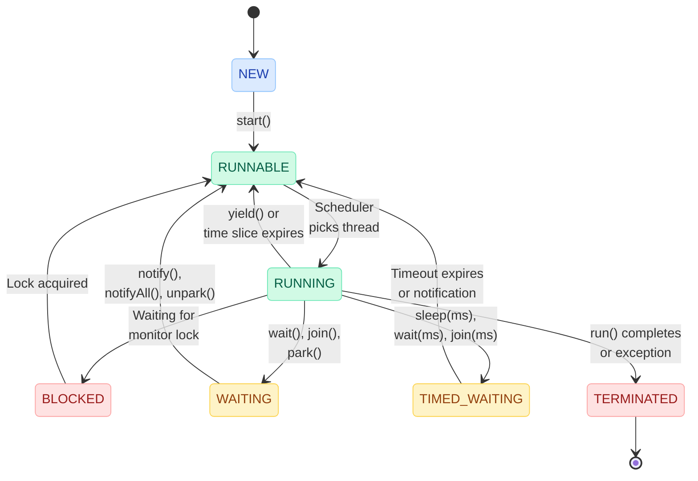
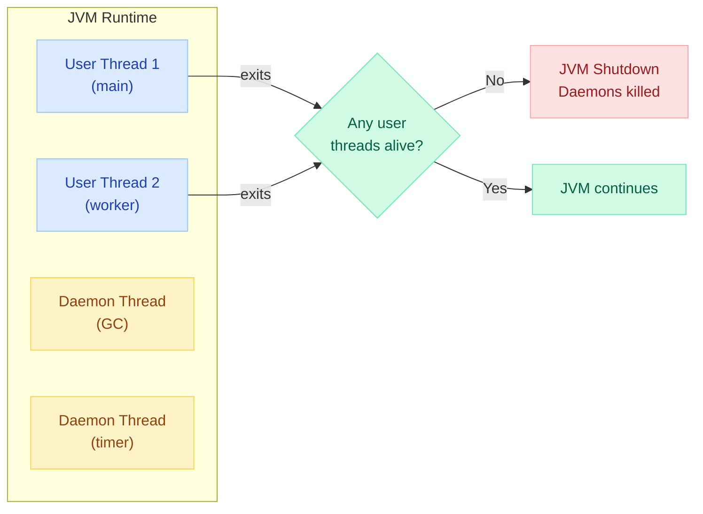
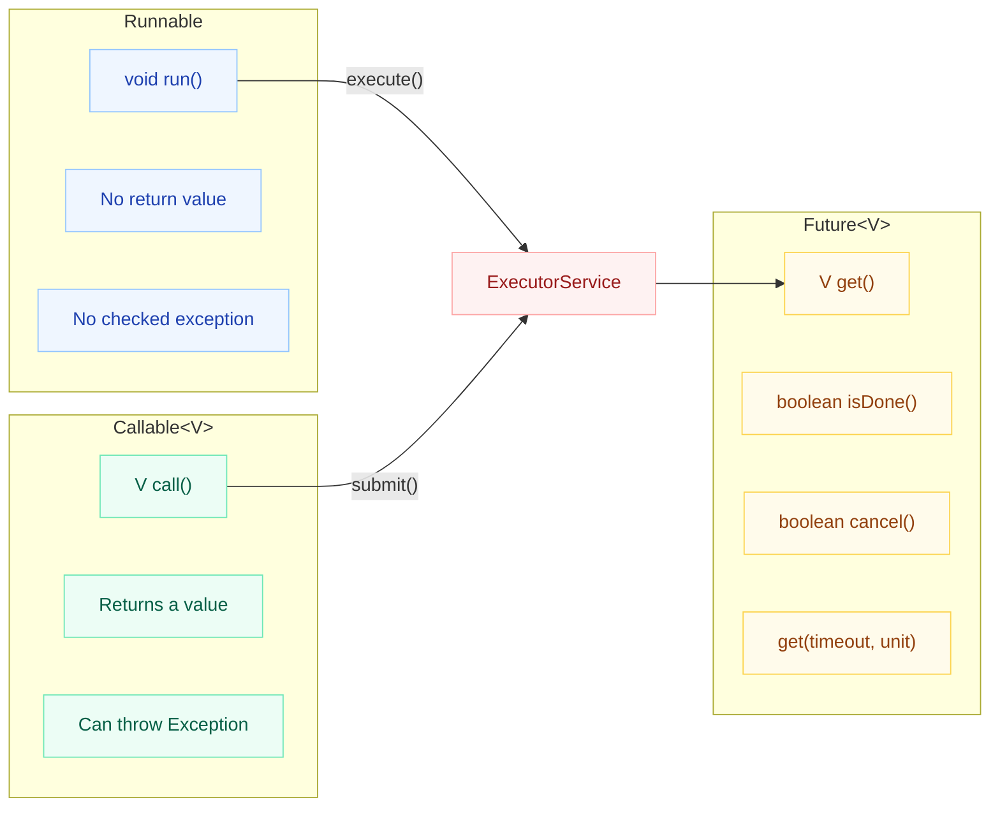

# Daemon Threads & Thread Lifecycle

!!! danger "The Silent Data Corruptor"
    A daemon thread writing to a file gets **killed mid-write** when the last user thread exits — the JVM does not wait for daemon threads to finish. This can leave files half-written, databases in inconsistent states, or network connections ungracefully closed. **Never use daemon threads for I/O that must complete.**

    ```java
    Thread writer = new Thread(() -> {
        try (var out = new FileOutputStream("data.bin")) {
            for (int i = 0; i < 1_000_000; i++) {
                out.write(serialize(records.get(i))); // killed mid-write!
            }
        }
    });
    writer.setDaemon(true); // BAD — file will be corrupted
    writer.start();
    // main() exits → JVM kills writer immediately
    ```

---

## Thread Lifecycle (State Diagram)

Every Java thread passes through a well-defined set of states managed by the JVM and OS scheduler.



---

## Thread.State Enum Values

Java defines thread states in `java.lang.Thread.State`:

| State | Description | How to Enter | How to Exit |
|---|---|---|---|
| `NEW` | Thread created, not yet started | `new Thread(runnable)` | `thread.start()` |
| `RUNNABLE` | Ready to run or actively running | `start()`, lock acquired, notify | Scheduler dispatches or blocks |
| `BLOCKED` | Waiting to acquire a monitor lock | Enter `synchronized` block held by another | Lock becomes available |
| `WAITING` | Indefinite wait for another thread | `Object.wait()`, `Thread.join()`, `LockSupport.park()` | `notify()`, `notifyAll()`, `unpark()` |
| `TIMED_WAITING` | Wait with a timeout | `Thread.sleep(ms)`, `wait(ms)`, `join(ms)` | Timeout expires or notification |
| `TERMINATED` | Thread has finished execution | `run()` returns or throws uncaught exception | Cannot transition out |

---

## What Triggers Each Transition

```java
Thread t = new Thread(() -> { /* task */ });
// State: NEW

t.start();
// State: RUNNABLE (eligible for scheduling)

// Inside run():
synchronized (lock) {       // If lock unavailable → BLOCKED
    lock.wait();            // → WAITING
    lock.wait(1000);        // → TIMED_WAITING
}

Thread.sleep(500);          // → TIMED_WAITING
anotherThread.join();       // → WAITING
anotherThread.join(2000);   // → TIMED_WAITING

Thread.yield();             // Hint to scheduler, stays RUNNABLE
// run() completes → TERMINATED
```

| Method | Transition | Releases Lock? |
|---|---|---|
| `start()` | NEW -> RUNNABLE | N/A |
| `sleep(ms)` | RUNNING -> TIMED_WAITING | **No** |
| `wait()` | RUNNING -> WAITING | **Yes** (must hold monitor) |
| `wait(ms)` | RUNNING -> TIMED_WAITING | **Yes** |
| `join()` | RUNNING -> WAITING | No |
| `join(ms)` | RUNNING -> TIMED_WAITING | No |
| `synchronized` | RUNNING -> BLOCKED (if lock held) | N/A |
| `notify()`/`notifyAll()` | Target: WAITING -> RUNNABLE | No (notifier keeps lock) |
| `yield()` | Stays RUNNABLE (hint only) | No |

---

## Daemon Threads

A **daemon thread** is a background service thread that the JVM does not wait for during shutdown. When all user (non-daemon) threads terminate, the JVM exits immediately — killing any remaining daemon threads without running `finally` blocks.



---

## setDaemon() and isDaemon()

```java
Thread bgThread = new Thread(() -> {
    while (true) {
        cleanupExpiredSessions();
        Thread.sleep(30_000);
    }
});

// MUST be called BEFORE start()
bgThread.setDaemon(true);
bgThread.start();

System.out.println(bgThread.isDaemon()); // true
```

!!! warning "Rules"
    - `setDaemon(true)` **must** be called before `start()` — calling it after throws `IllegalThreadStateException`
    - A thread inherits the daemon status of the thread that created it
    - The main thread is always a user thread (non-daemon)

---

## Daemon Thread Use Cases

| Use Case | Example | Why Daemon? |
|---|---|---|
| Garbage Collection | JVM GC threads | Must not prevent JVM exit |
| Timer/Scheduler | Periodic cache cleanup | Background housekeeping |
| Signal Handlers | Shutdown hook watchers | Monitoring only |
| Heartbeat Senders | Service-registry pings | Auxiliary to main work |
| Log Flushing | Async log appenders | Best-effort, not critical path |

---

## Daemon vs User Threads

| Aspect | User Thread | Daemon Thread |
|---|---|---|
| JVM shutdown | JVM waits for all user threads | JVM does **not** wait |
| Default | All threads are user threads | Must explicitly set `setDaemon(true)` |
| `finally` blocks | Always executed on normal exit | **May not execute** on JVM exit |
| Use case | Business logic, I/O, transactions | Background services, monitoring |
| Creation | `new Thread(task)` | `thread.setDaemon(true)` before `start()` |
| Child inheritance | Children are user threads | Children inherit daemon status |
| Example | Request handler, batch processor | GC, timer, heartbeat |
| Risk if daemon | None (safe) | Data corruption on abrupt kill |

---

## Runnable vs Callable vs Future



### Runnable — Fire and Forget

```java
@FunctionalInterface
public interface Runnable {
    void run(); // No return, no checked exceptions
}

// Usage
Runnable task = () -> System.out.println("Processing...");
new Thread(task).start();
```

### Callable — Compute and Return

```java
@FunctionalInterface
public interface Callable<V> {
    V call() throws Exception; // Returns value, can throw
}

// Usage
Callable<Integer> computation = () -> {
    TimeUnit.SECONDS.sleep(2);
    return 42;
};
```

### Future — Handle Async Results

```java
ExecutorService executor = Executors.newFixedThreadPool(4);
Future<Integer> future = executor.submit(computation);

// Non-blocking check
if (future.isDone()) {
    Integer result = future.get(); // returns immediately
}

// Blocking with timeout
try {
    Integer result = future.get(5, TimeUnit.SECONDS);
} catch (TimeoutException e) {
    future.cancel(true); // interrupt if running
}
```

| Method | Behavior |
|---|---|
| `get()` | Blocks until result is available |
| `get(timeout, unit)` | Blocks up to timeout, then throws `TimeoutException` |
| `isDone()` | Returns `true` if completed (normally, exception, or cancelled) |
| `isCancelled()` | Returns `true` if cancelled before completion |
| `cancel(mayInterrupt)` | Attempts to cancel; if `true`, interrupts running thread |

### CompletableFuture (Brief Pointer)

`CompletableFuture` extends `Future` with non-blocking composition, callbacks, and pipeline-style async programming. See the dedicated [CompletableFuture](CompletableFuture.md) page for chaining (`thenApply`, `thenCompose`), error handling (`exceptionally`, `handle`), and combining multiple futures.

---

## ExecutorService: submit() vs execute()

| Aspect | `execute(Runnable)` | `submit(Callable/Runnable)` |
|---|---|---|
| Return type | `void` | `Future<V>` |
| Exception handling | Uncaught exceptions kill the thread | Exceptions captured in Future |
| Interface | `Executor` | `ExecutorService` |
| Use when | Fire-and-forget | Need result or exception access |

```java
ExecutorService pool = Executors.newFixedThreadPool(4);

// execute() — fire and forget
pool.execute(() -> processOrder(order));

// submit(Callable) — get result
Future<Report> report = pool.submit(() -> generateReport(params));

// submit(Runnable) — track completion without result
Future<?> done = pool.submit(() -> sendNotification(user));
done.get(); // blocks until complete, returns null

pool.shutdown();
```

!!! tip "Best Practice"
    Prefer `submit()` over `execute()` because uncaught exceptions in `execute()` silently kill the pool thread — the exception goes to `UncaughtExceptionHandler` but you lose visibility. With `submit()`, exceptions are captured in the `Future` and rethrown when you call `get()`.

---

## Quick Recall

| Topic | Key Point |
|---|---|
| Thread states | NEW -> RUNNABLE -> RUNNING -> BLOCKED/WAITING/TIMED_WAITING -> TERMINATED |
| `sleep()` vs `wait()` | `sleep` holds the lock; `wait` releases it |
| Daemon threads | JVM exits when only daemons remain; `finally` may not run |
| `setDaemon()` | Must call **before** `start()` |
| Runnable | `void run()`, no return, no checked exception |
| Callable | `V call()`, returns value, can throw checked exception |
| Future.get() | Blocks until result; use timeout overload to avoid hanging |
| execute() vs submit() | `execute` = void, `submit` = Future (captures exceptions) |

---

## Interview Template

???+ example "Tell me about thread lifecycle states"
    "A Java thread has 6 states defined in `Thread.State`: NEW (created, not started), RUNNABLE (eligible for CPU time), BLOCKED (waiting for a monitor lock), WAITING (indefinite wait via `wait()`/`join()`), TIMED_WAITING (bounded wait via `sleep(ms)`/`wait(ms)`), and TERMINATED (finished). Key insight: `sleep()` does NOT release the lock, while `wait()` does — this is a frequent interview trick question."

???+ example "What are daemon threads and when would you use them?"
    "Daemon threads are background service threads — the JVM exits without waiting for them. I set `setDaemon(true)` before `start()`. Use cases: GC, heartbeat senders, cache cleanup timers. Critical rule: never use daemons for I/O that must complete, because the JVM kills them mid-operation without running `finally` blocks, which can corrupt files or leave transactions uncommitted."

???+ example "Runnable vs Callable — when do you use each?"
    "Runnable has `void run()` — no return, no checked exception. Callable has `V call() throws Exception` — returns a value and can throw. I use Callable with `ExecutorService.submit()` which returns a `Future<V>` to retrieve the result. For fire-and-forget tasks I use Runnable with `execute()`. In modern Java, I prefer `CompletableFuture` for composable async pipelines, but Callable+Future is still the foundation of the executor framework."
