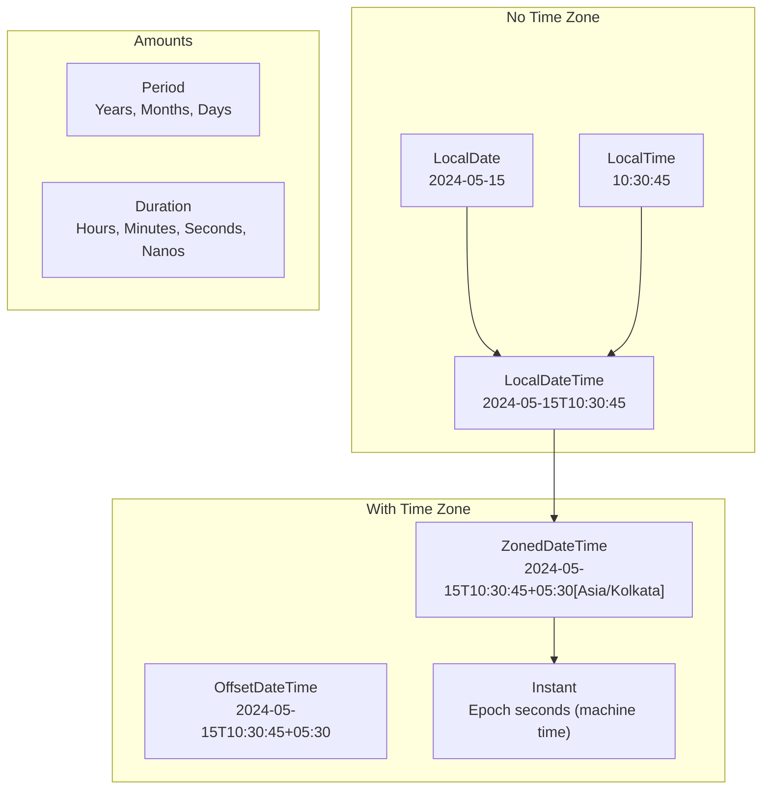

# Java Date & Time API (java.time)

Java 8 introduced the `java.time` package (JSR-310) as a complete replacement for the broken `java.util.Date` and `java.util.Calendar`. Designed by the creator of Joda-Time, this API is **immutable, thread-safe, and fluent**. Date/Time questions appear regularly in interviews -- understanding this API signals real-world Java maturity.

---

## Why the Old API Was Broken

| Problem | `java.util.Date` / `Calendar` | `java.time` |
|---|---|---|
| **Mutability** | Mutable -- thread-unsafe | Immutable -- thread-safe |
| **Month indexing** | 0-based (January = 0) | 1-based (January = 1) |
| **Design** | `Date` stores time too, `Calendar` is bloated | Separate classes for date, time, datetime |
| **Time zones** | `TimeZone` + `Date` is error-prone | `ZonedDateTime`, `ZoneId` are clean |
| **Formatting** | `SimpleDateFormat` is not thread-safe | `DateTimeFormatter` is thread-safe |
| **API clarity** | `date.getYear()` returns year - 1900 | `localDate.getYear()` returns actual year |

```java
// Old API horrors
Date date = new Date(2024, 5, 15);     // Actually: year 3924, June 15
Calendar cal = Calendar.getInstance();
cal.set(Calendar.MONTH, 5);             // June, not May!
SimpleDateFormat sdf = new SimpleDateFormat("yyyy-MM-dd");
// sdf is NOT thread-safe -- shared across threads = silent data corruption
```

!!! danger "Interview Red Flag"
    If you use `SimpleDateFormat` in a multi-threaded application without synchronization, you will get **unpredictable parsing errors** or **silently wrong dates**. This is a classic production bug.

---

## The java.time Class Hierarchy



---

## LocalDate, LocalTime, LocalDateTime

These represent date/time **without** a time zone. Use them when the zone is irrelevant (birthdays, business hours, deadlines).

### LocalDate

```java
// Creation
LocalDate today = LocalDate.now();                      // 2024-05-15
LocalDate specific = LocalDate.of(2024, Month.MAY, 15); // 2024-05-15
LocalDate parsed = LocalDate.parse("2024-05-15");       // ISO format

// Querying
int year = today.getYear();              // 2024
Month month = today.getMonth();          // MAY
int day = today.getDayOfMonth();         // 15
DayOfWeek dow = today.getDayOfWeek();    // WEDNESDAY
boolean isLeap = today.isLeapYear();     // true

// Manipulation (returns NEW instance -- immutable!)
LocalDate tomorrow = today.plusDays(1);
LocalDate lastMonth = today.minusMonths(1);
LocalDate endOfMonth = today.withDayOfMonth(today.lengthOfMonth());

// Comparison
today.isBefore(tomorrow);   // true
today.isAfter(lastMonth);   // true
today.isEqual(today);       // true
```

### LocalTime

```java
LocalTime now = LocalTime.now();                    // 14:30:45.123456789
LocalTime specific = LocalTime.of(14, 30, 45);     // 14:30:45
LocalTime parsed = LocalTime.parse("14:30:45");     // ISO format

LocalTime noon = LocalTime.NOON;                    // 12:00
LocalTime midnight = LocalTime.MIDNIGHT;            // 00:00
LocalTime max = LocalTime.MAX;                      // 23:59:59.999999999

// Manipulation
LocalTime later = now.plusHours(2).plusMinutes(30);
int hour = now.getHour();         // 14
int minute = now.getMinute();     // 30
```

### LocalDateTime

```java
LocalDateTime now = LocalDateTime.now();
LocalDateTime specific = LocalDateTime.of(2024, Month.MAY, 15, 14, 30);
LocalDateTime combined = LocalDateTime.of(
    LocalDate.of(2024, 5, 15),
    LocalTime.of(14, 30)
);

// Extract parts
LocalDate datePart = now.toLocalDate();
LocalTime timePart = now.toLocalTime();

// Convert to zoned
ZonedDateTime zoned = now.atZone(ZoneId.of("America/New_York"));
OffsetDateTime offset = now.atOffset(ZoneOffset.ofHours(-5));
```

!!! warning "LocalDateTime is NOT an Instant"
    `LocalDateTime` does not represent a specific moment on the timeline. "May 15, 2024 at 2:30 PM" is a different instant in New York vs Tokyo. Never store `LocalDateTime` for timestamps -- use `Instant` or `ZonedDateTime`.

---

## ZonedDateTime, OffsetDateTime, Instant

### Instant -- Machine Timestamp

An `Instant` is a point on the UTC timeline, stored as seconds + nanoseconds from the epoch (1970-01-01T00:00:00Z).

```java
Instant now = Instant.now();                          // 2024-05-15T09:00:00Z
Instant epoch = Instant.EPOCH;                         // 1970-01-01T00:00:00Z
Instant fromEpoch = Instant.ofEpochSecond(1715763600); // specific moment

// Arithmetic
Instant later = now.plusSeconds(3600);    // 1 hour later
Duration between = Duration.between(epoch, now);
long days = between.toDays();            // ~19858

// Convert to zoned
ZonedDateTime inKolkata = now.atZone(ZoneId.of("Asia/Kolkata"));
```

!!! tip "When to Use Instant"
    Use `Instant` for **event timestamps** (created_at, updated_at), **logging**, and **measuring elapsed time**. It is timezone-agnostic and maps directly to a database `TIMESTAMP WITH TIME ZONE`.

### ZonedDateTime -- Full Zone Awareness

```java
ZonedDateTime nowInNY = ZonedDateTime.now(ZoneId.of("America/New_York"));
ZonedDateTime nowInTokyo = ZonedDateTime.now(ZoneId.of("Asia/Tokyo"));

// Zone conversion
ZonedDateTime converted = nowInNY.withZoneSameInstant(ZoneId.of("Asia/Kolkata"));
// Same moment, different wall clock time

// DST-safe! Handles spring-forward / fall-back automatically
ZonedDateTime beforeDST = ZonedDateTime.of(
    2024, 3, 10, 1, 30, 0, 0, ZoneId.of("America/New_York")
);
ZonedDateTime afterDST = beforeDST.plusHours(1);
// Correctly jumps from 1:30 AM to 3:30 AM (2 AM doesn't exist)
```

### OffsetDateTime -- Fixed UTC Offset

```java
OffsetDateTime odt = OffsetDateTime.now(ZoneOffset.ofHours(5));
OffsetDateTime utc = OffsetDateTime.now(ZoneOffset.UTC);

// OffsetDateTime vs ZonedDateTime:
// OffsetDateTime: fixed offset (+05:30), no DST rules
// ZonedDateTime:  named zone (Asia/Kolkata), DST-aware
```

!!! info "Database Best Practice"
    Store timestamps as `Instant` or `OffsetDateTime` (maps to SQL `TIMESTAMP WITH TIME ZONE`). Use `ZonedDateTime` only for display logic. Never store `LocalDateTime` for absolute timestamps.

---

## Period vs Duration

| Aspect | `Period` | `Duration` |
|---|---|---|
| **Measures** | Years, months, days | Seconds, nanoseconds |
| **Used with** | `LocalDate`, `LocalDateTime` | `Instant`, `LocalTime`, `LocalDateTime` |
| **DST-aware** | Yes (calendar-based) | No (exact elapsed time) |
| **Example** | "1 year 2 months 3 days" | "3600 seconds" |

```java
// Period -- human calendar amounts
Period period = Period.between(
    LocalDate.of(2020, 1, 1),
    LocalDate.of(2024, 5, 15)
);
System.out.println(period);  // P4Y4M14D (4 years, 4 months, 14 days)

Period twoYears = Period.ofYears(2);
Period custom = Period.of(1, 6, 15);  // 1 year, 6 months, 15 days
LocalDate future = LocalDate.now().plus(twoYears);

// Duration -- machine-precise time
Duration duration = Duration.between(
    LocalTime.of(9, 0),
    LocalTime.of(17, 30)
);
System.out.println(duration);          // PT8H30M (8 hours 30 minutes)

Duration fiveMinutes = Duration.ofMinutes(5);
Duration halfDay = Duration.ofHours(12);
long totalSeconds = duration.getSeconds();  // 30600

// ChronoUnit for quick calculations
long daysBetween = ChronoUnit.DAYS.between(
    LocalDate.of(2020, 1, 1),
    LocalDate.of(2024, 5, 15)
);  // 1596
```

??? question "What is the difference between Period and Duration?"
    **Period** is date-based (years, months, days) and respects calendar rules. Adding `Period.ofMonths(1)` to January 31 gives February 28/29. **Duration** is time-based (seconds, nanos) and represents an exact amount of elapsed time. Use `Period` for business date calculations, `Duration` for measuring elapsed time or timeouts.

---

## DateTimeFormatter -- Parsing and Formatting

`DateTimeFormatter` is **immutable and thread-safe** -- the opposite of `SimpleDateFormat`.

```java
// Built-in formatters
LocalDate date = LocalDate.now();
String iso = date.format(DateTimeFormatter.ISO_LOCAL_DATE);  // 2024-05-15

// Custom patterns
DateTimeFormatter formatter = DateTimeFormatter.ofPattern("dd-MMM-yyyy HH:mm:ss");
LocalDateTime now = LocalDateTime.now();
String formatted = now.format(formatter);  // 15-May-2024 14:30:45

// Parsing
LocalDate parsed = LocalDate.parse("15-May-2024",
    DateTimeFormatter.ofPattern("dd-MMM-yyyy"));

// With locale
DateTimeFormatter german = DateTimeFormatter
    .ofPattern("dd. MMMM yyyy")
    .withLocale(Locale.GERMAN);
String germanDate = date.format(german);  // 15. Mai 2024

// DateTimeFormatter is thread-safe -- define once, reuse everywhere
public static final DateTimeFormatter API_FORMAT =
    DateTimeFormatter.ofPattern("yyyy-MM-dd'T'HH:mm:ss.SSSXXX");
```

### Common Format Patterns

| Pattern | Example | Description |
|---|---|---|
| `yyyy-MM-dd` | 2024-05-15 | ISO date |
| `dd/MM/yyyy` | 15/05/2024 | European date |
| `MM/dd/yyyy` | 05/15/2024 | US date |
| `HH:mm:ss` | 14:30:45 | 24-hour time |
| `hh:mm a` | 02:30 PM | 12-hour time |
| `yyyy-MM-dd'T'HH:mm:ssXXX` | 2024-05-15T14:30:45+05:30 | ISO 8601 with offset |
| `EEEE, dd MMMM yyyy` | Wednesday, 15 May 2024 | Full day and month name |

---

## Temporal Adjusters

`TemporalAdjuster` lets you perform complex date manipulations in a readable, reusable way.

```java
import java.time.temporal.TemporalAdjusters;

LocalDate date = LocalDate.of(2024, 5, 15);

// Built-in adjusters
LocalDate firstDay = date.with(TemporalAdjusters.firstDayOfMonth());      // 2024-05-01
LocalDate lastDay = date.with(TemporalAdjusters.lastDayOfMonth());        // 2024-05-31
LocalDate firstMonday = date.with(TemporalAdjusters.firstInMonth(DayOfWeek.MONDAY));  // 2024-05-06
LocalDate nextFriday = date.with(TemporalAdjusters.next(DayOfWeek.FRIDAY));           // 2024-05-17
LocalDate lastDayOfYear = date.with(TemporalAdjusters.lastDayOfYear());               // 2024-12-31

// Custom adjuster -- next working day
TemporalAdjuster nextWorkingDay = temporal -> {
    LocalDate d = LocalDate.from(temporal);
    do {
        d = d.plusDays(1);
    } while (d.getDayOfWeek() == DayOfWeek.SATURDAY
          || d.getDayOfWeek() == DayOfWeek.SUNDAY);
    return d;
};

LocalDate nextWork = date.with(nextWorkingDay);  // 2024-05-16 (Thursday)
```

!!! tip "Use Adjusters for Business Logic"
    Temporal adjusters are perfect for business rules like "last business day of the month" or "next settlement date." They are reusable and testable -- much better than manual arithmetic.

---

## Clock and Testing with Fixed Clocks

The `Clock` class lets you **inject time as a dependency**, making code testable without mocking static methods.

```java
// Production code -- inject Clock
public class OrderService {
    private final Clock clock;

    public OrderService(Clock clock) {
        this.clock = clock;
    }

    public Order createOrder(String item) {
        Order order = new Order();
        order.setCreatedAt(Instant.now(clock));  // uses injected clock
        order.setItem(item);
        return order;
    }

    public boolean isExpired(Order order, Duration ttl) {
        Instant now = Instant.now(clock);
        return order.getCreatedAt().plus(ttl).isBefore(now);
    }
}

// Production usage
OrderService service = new OrderService(Clock.systemUTC());

// Test usage -- time is fixed, deterministic
Clock fixedClock = Clock.fixed(
    Instant.parse("2024-05-15T10:00:00Z"),
    ZoneId.of("UTC")
);
OrderService testService = new OrderService(fixedClock);
Order order = testService.createOrder("Widget");
// order.getCreatedAt() is always 2024-05-15T10:00:00Z

// Offset clock -- simulate "2 hours from now"
Clock offsetClock = Clock.offset(Clock.systemUTC(), Duration.ofHours(2));
```

!!! success "Testing Best Practice"
    Never call `Instant.now()` or `LocalDate.now()` directly in business logic. Inject a `Clock` so tests are deterministic. This avoids brittle tests that depend on the current wall-clock time.

---

## Time Zones -- ZoneId and ZoneOffset

```java
// ZoneId -- named zone with DST rules
ZoneId kolkata = ZoneId.of("Asia/Kolkata");      // UTC+05:30
ZoneId newYork = ZoneId.of("America/New_York");  // UTC-05:00 / UTC-04:00 (DST)
ZoneId utc = ZoneId.of("UTC");

// ZoneOffset -- fixed offset, no DST
ZoneOffset plus530 = ZoneOffset.of("+05:30");
ZoneOffset minusFive = ZoneOffset.ofHours(-5);

// List all available zone IDs
Set<String> allZones = ZoneId.getAvailableZoneIds();  // ~600 zones

// Get current rules
ZoneRules rules = newYork.getRules();
boolean isDST = rules.isDaylightSavings(Instant.now());

// Convert between zones
ZonedDateTime meeting = ZonedDateTime.of(
    2024, 5, 15, 9, 0, 0, 0, ZoneId.of("America/New_York")
);
ZonedDateTime inKolkata = meeting.withZoneSameInstant(kolkata);
System.out.println(inKolkata);  // 2024-05-15T18:30+05:30[Asia/Kolkata]
```

??? question "What is the difference between ZoneId and ZoneOffset?"
    `ZoneId` is a **named region** ("America/New_York") that has DST transition rules. The actual offset changes seasonally. `ZoneOffset` is a **fixed** numerical offset from UTC ("+05:30") with no DST awareness. Always prefer `ZoneId` over `ZoneOffset` unless you explicitly need a fixed offset (like for database storage).

---

## Converting Between Old and New API

```java
// Date <-> Instant
Date oldDate = new Date();
Instant instant = oldDate.toInstant();                // Date -> Instant
Date backToDate = Date.from(instant);                  // Instant -> Date

// Date <-> LocalDate
LocalDate localDate = oldDate.toInstant()
    .atZone(ZoneId.systemDefault())
    .toLocalDate();

// Calendar <-> ZonedDateTime
Calendar calendar = Calendar.getInstance();
ZonedDateTime zdt = calendar.toInstant()
    .atZone(calendar.getTimeZone().toZoneId());

// Instant -> Calendar
Calendar fromInstant = GregorianCalendar.from(
    instant.atZone(ZoneId.systemDefault())
);

// java.sql.Date <-> LocalDate (direct support)
java.sql.Date sqlDate = java.sql.Date.valueOf(localDate);   // LocalDate -> sql.Date
LocalDate fromSql = sqlDate.toLocalDate();                    // sql.Date -> LocalDate

// java.sql.Timestamp <-> LocalDateTime
java.sql.Timestamp ts = java.sql.Timestamp.valueOf(LocalDateTime.now());
LocalDateTime ldt = ts.toLocalDateTime();

// TimeZone <-> ZoneId
TimeZone oldTz = TimeZone.getTimeZone("America/New_York");
ZoneId newZone = oldTz.toZoneId();
TimeZone backToOld = TimeZone.getTimeZone(newZone);
```

!!! info "Migration Strategy"
    When migrating a codebase, convert at the **boundaries** (API layer, database layer) and use `java.time` internally. Most frameworks (Jackson, Spring, Hibernate) have native `java.time` support.

---

## Common Interview Questions

??? question "Why was java.time introduced when Date and Calendar already existed?"
    The old API had fundamental design flaws: `Date` is mutable and thread-unsafe, months are 0-indexed, `SimpleDateFormat` is not thread-safe, `Date` confusingly contains time information, and `getYear()` returns year minus 1900. The `java.time` API fixes all of these by being immutable, having a clear class hierarchy, and using 1-based months.

??? question "Is LocalDateTime suitable for storing event timestamps in a database?"
    **No.** `LocalDateTime` has no time zone information, so "2024-05-15T14:00" is ambiguous -- it could mean 2 PM in any zone. For event timestamps, use `Instant` (absolute point in time) or `OffsetDateTime` (maps to SQL `TIMESTAMP WITH TIME ZONE`). Use `LocalDateTime` only for concepts like "store closes at 9 PM" where the zone is implicit.

??? question "How does ZonedDateTime handle Daylight Saving Time transitions?"
    `ZonedDateTime` uses the `ZoneRules` of the `ZoneId` to automatically handle DST. During spring-forward, if you create a time in the gap (e.g., 2:30 AM when clocks jump from 2:00 to 3:00), it adjusts forward. During fall-back, when an hour repeats, it uses the earlier offset by default. You can use `withEarlierOffsetAtOverlap()` or `withLaterOffsetAtOverlap()` to control this explicitly.

??? question "What happens if you parse a date string with an incorrect format?"
    A `DateTimeParseException` (unchecked) is thrown. Always wrap parsing in a try-catch when handling user input.
    ```java
    try {
        LocalDate date = LocalDate.parse("15/05/2024",
            DateTimeFormatter.ofPattern("dd/MM/yyyy"));
    } catch (DateTimeParseException e) {
        System.out.println("Invalid date: " + e.getParsedString());
    }
    ```

??? question "How do you calculate the number of days between two dates?"
    Use `ChronoUnit.DAYS.between()` or `Period.between()`:
    ```java
    LocalDate start = LocalDate.of(2024, 1, 1);
    LocalDate end = LocalDate.of(2024, 5, 15);

    long days = ChronoUnit.DAYS.between(start, end);  // 135
    Period period = Period.between(start, end);         // P4M14D
    // Note: Period gives 4 months 14 days, not total days
    ```
    Use `ChronoUnit` when you need a single flat number. Use `Period` when you need a human-readable breakdown.

??? question "How do you make date/time code testable?"
    Inject `java.time.Clock` as a dependency instead of calling `Instant.now()` directly. In production, pass `Clock.systemUTC()`. In tests, use `Clock.fixed()` to pin the time to a known instant. This avoids mocking static methods and makes tests fully deterministic.

??? question "What is the difference between withZoneSameInstant and withZoneSameLocal?"
    `withZoneSameInstant()` keeps the same point in time but changes the displayed wall-clock time for the new zone. `withZoneSameLocal()` keeps the same wall-clock reading but represents a different point in time.
    ```java
    ZonedDateTime ny = ZonedDateTime.of(2024, 5, 15, 9, 0, 0, 0,
        ZoneId.of("America/New_York"));

    // Same instant, different wall clock
    ZonedDateTime kolkata1 = ny.withZoneSameInstant(ZoneId.of("Asia/Kolkata"));
    // 2024-05-15T18:30+05:30 -- same moment, shows 6:30 PM in Kolkata

    // Same wall clock, different instant
    ZonedDateTime kolkata2 = ny.withZoneSameLocal(ZoneId.of("Asia/Kolkata"));
    // 2024-05-15T09:00+05:30 -- 9 AM in Kolkata (different moment!)
    ```

??? question "How do you handle date/time in REST APIs?"
    Always use **ISO 8601** format (`2024-05-15T14:30:00Z` or `2024-05-15T14:30:00+05:30`). Store as `Instant` or `OffsetDateTime` on the server. Let the client convert to the user's local time zone. Configure Jackson:
    ```java
    @Configuration
    public class JacksonConfig {
        @Bean
        public ObjectMapper objectMapper() {
            return new ObjectMapper()
                .registerModule(new JavaTimeModule())
                .disable(SerializationFeature.WRITE_DATES_AS_TIMESTAMPS);
        }
    }
    ```

??? question "What is a TemporalAdjuster and when would you write a custom one?"
    A `TemporalAdjuster` is a strategy for modifying a temporal object. The JDK provides built-in ones via `TemporalAdjusters` (e.g., `firstDayOfMonth`, `next(DayOfWeek.FRIDAY)`). Write a custom one for domain-specific logic like "next business day excluding holidays" or "third Friday of the month" (options expiration). Implement it as a lambda or a class implementing the `TemporalAdjuster` interface.

??? question "Why is Instant preferred over System.currentTimeMillis()?"
    `Instant` provides nanosecond precision (vs millisecond), is an object with a rich API for arithmetic and comparison, works with `Duration` and `Clock` for testing, and integrates with the rest of `java.time`. `System.currentTimeMillis()` returns a raw `long` that is easy to misuse, hard to test, and lacks semantic meaning.

---

## Best Practices

!!! success "Do"
    - Use `Instant` for timestamps (created_at, modified_at, event_time)
    - Use `LocalDate` for dates without time (birthdays, holidays)
    - Use `ZonedDateTime` for display in a user's time zone
    - Inject `Clock` for testability
    - Use `DateTimeFormatter` constants (define once, reuse)
    - Store times in UTC in your database; convert to local on display
    - Use ISO 8601 for API serialization

!!! failure "Don't"
    - Don't use `java.util.Date` or `Calendar` in new code
    - Don't use `SimpleDateFormat` -- it is not thread-safe
    - Don't store `LocalDateTime` as a timestamp -- it has no zone
    - Don't hardcode zone offsets ("+05:30") -- use `ZoneId` ("Asia/Kolkata")
    - Don't call `LocalDate.now()` directly in business logic -- inject `Clock`
    - Don't assume all days have 24 hours (DST transitions change this)
    - Don't use `Date.getYear()` -- it returns year minus 1900

---

## Quick Reference Cheat Sheet

| I need... | Use this |
|---|---|
| Current UTC timestamp | `Instant.now()` |
| Date without time | `LocalDate.now()` |
| Time without date | `LocalTime.now()` |
| Date + time, no zone | `LocalDateTime.now()` |
| Date + time + zone | `ZonedDateTime.now(zoneId)` |
| Date + time + fixed offset | `OffsetDateTime.now(offset)` |
| Difference in days/months/years | `Period.between(d1, d2)` |
| Difference in hours/minutes/seconds | `Duration.between(t1, t2)` |
| Flat count of days between dates | `ChronoUnit.DAYS.between(d1, d2)` |
| Parse a date string | `LocalDate.parse(str, formatter)` |
| Format a date to string | `date.format(formatter)` |
| Thread-safe formatter | `DateTimeFormatter.ofPattern(...)` |
| Testable time source | `Clock.fixed(instant, zone)` |
| Convert old Date to new API | `oldDate.toInstant()` |
| Convert new API to old Date | `Date.from(instant)` |
