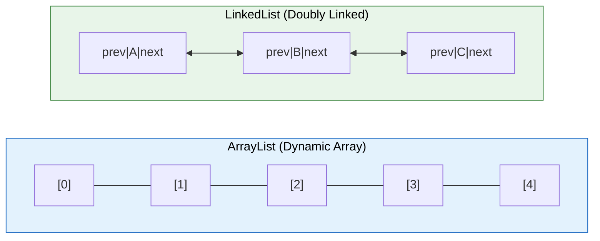
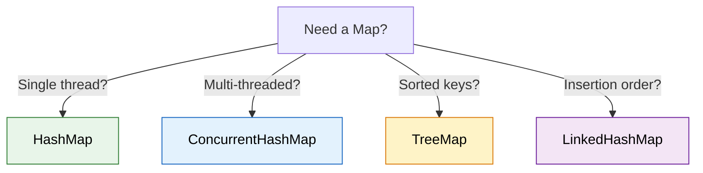

# Collections Compared — Key Differences

Interviewers love asking "what's the difference between X and Y?" for Java collections. This page covers every important comparison you need to know.

---

## ArrayList vs LinkedList



| Operation | ArrayList | LinkedList |
|---|---|---|
| `get(index)` | **O(1)** — direct index access | O(n) — must traverse |
| `add(end)` | **O(1)** amortized | **O(1)** |
| `add(index)` | O(n) — shifts elements | O(n) to find + O(1) to insert |
| `remove(index)` | O(n) — shifts elements | O(n) to find + O(1) to remove |
| Memory per element | Low (just the element) | High (element + 2 pointers) |
| Cache friendliness | Excellent (contiguous memory) | Poor (scattered in heap) |
| Implements | `List` | `List`, `Deque`, `Queue` |

**Verdict**: Use `ArrayList` 99% of the time. LinkedList's theoretical O(1) insert advantage rarely matters because finding the insert position is still O(n), and ArrayList benefits from CPU cache locality.

---

## HashMap vs Hashtable vs ConcurrentHashMap

| Feature | HashMap | Hashtable | ConcurrentHashMap |
|---|---|---|---|
| **Thread-safe** | No | Yes (full lock) | Yes (segment/node lock) |
| **Locking** | None | Entire table | Per-bucket (Java 8+) |
| **Null keys** | 1 allowed | Not allowed | Not allowed |
| **Null values** | Multiple allowed | Not allowed | Not allowed |
| **Performance** | Fastest (single-threaded) | Slowest (global lock) | Fast (concurrent reads) |
| **Iterator** | Fail-fast | Fail-safe (Enumerator) | Weakly consistent |
| **Since** | Java 1.2 | Java 1.0 (legacy) | Java 1.5 |
| **Use when** | Single-threaded | Never (use ConcurrentHashMap) | Multi-threaded |



### How ConcurrentHashMap Achieves Concurrency (Java 8+)

```
    HashMap (single-threaded):
    ┌───┬───┬───┬───┬───┬───┬───┬───┐
    │ 0 │ 1 │ 2 │ 3 │ 4 │ 5 │ 6 │ 7 │  ← one big array, no protection
    └───┴───┴───┴───┴───┴───┴───┴───┘

    ConcurrentHashMap (Java 8+):
    ┌───┬───┬───┬───┬───┬───┬───┬───┐
    │ 0 │ 1 │ 2 │ 3 │ 4 │ 5 │ 6 │ 7 │  ← CAS for insert, synchronized per bucket
    └─┬─┴───┴─┬─┴───┴───┴─┬─┴───┴───┘
      │       │           │
      ▼       ▼           ▼
    [node]  [node]      [node→node]   ← only lock the specific bucket being written
```

- **Reads**: No locking — uses `volatile` reads
- **Writes**: CAS (Compare-And-Swap) for insert, `synchronized` on the node/bin for collisions
- **Size calculation**: Distributed counters (not a single counter)

---

## HashMap vs TreeMap vs LinkedHashMap

| Feature | HashMap | TreeMap | LinkedHashMap |
|---|---|---|---|
| **Order** | None | Sorted (by key) | Insertion order |
| **Data structure** | Hash table | Red-Black Tree | Hash table + linked list |
| **get/put** | O(1) average | O(log n) | O(1) average |
| **Null key** | 1 allowed | Not allowed | 1 allowed |
| **Use case** | General purpose | Sorted navigation, range queries | LRU cache, predictable iteration |

```java
// TreeMap — sorted by key
TreeMap<String, Integer> tree = new TreeMap<>();
tree.put("banana", 2);
tree.put("apple", 1);
tree.put("cherry", 3);
tree.firstKey();                        // "apple"
tree.subMap("apple", "cherry");         // {apple=1, banana=2}

// LinkedHashMap — insertion order (or access order for LRU)
LinkedHashMap<String, Integer> lru = new LinkedHashMap<>(16, 0.75f, true) {
    protected boolean removeEldestEntry(Map.Entry eldest) {
        return size() > 100;  // evict when over 100 entries
    }
};
```

---

## HashSet vs TreeSet vs LinkedHashSet

| Feature | HashSet | TreeSet | LinkedHashSet |
|---|---|---|---|
| **Order** | None | Sorted (natural/comparator) | Insertion order |
| **Backed by** | HashMap | TreeMap (Red-Black Tree) | LinkedHashMap |
| **add/remove/contains** | O(1) | O(log n) | O(1) |
| **Null** | 1 allowed | Not allowed | 1 allowed |
| **Use case** | Fast uniqueness check | Sorted unique elements | Unique + predictable order |

---

## Comparable vs Comparator

| Feature | Comparable | Comparator |
|---|---|---|
| **Package** | `java.lang` | `java.util` |
| **Method** | `compareTo(T o)` | `compare(T o1, T o2)` |
| **Modifies class?** | Yes — class implements it | No — external strategy |
| **Sorting logic** | Single (natural order) | Multiple (any custom order) |
| **Usage** | `Collections.sort(list)` | `Collections.sort(list, comparator)` |

```java
// Comparable — built into the class (ONE sort order)
public class Employee implements Comparable<Employee> {
    private String name;
    private int salary;

    @Override
    public int compareTo(Employee other) {
        return Integer.compare(this.salary, other.salary);  // natural order: by salary
    }
}

// Comparator — external (MULTIPLE sort orders)
Comparator<Employee> byName = Comparator.comparing(Employee::getName);
Comparator<Employee> bySalaryDesc = Comparator.comparingInt(Employee::getSalary).reversed();
Comparator<Employee> byNameThenSalary = byName.thenComparingInt(Employee::getSalary);

employees.sort(byName);             // sort by name
employees.sort(bySalaryDesc);       // sort by salary descending
employees.sort(byNameThenSalary);   // sort by name, then salary
```

---

## Iterator vs ListIterator vs Enumeration

| Feature | Iterator | ListIterator | Enumeration |
|---|---|---|---|
| **Direction** | Forward only | Both (forward + backward) | Forward only |
| **Applies to** | All Collections | Only List | Legacy (Vector, Hashtable) |
| **Remove** | Yes (`remove()`) | Yes | No |
| **Add/Set** | No | Yes (`add()`, `set()`) | No |
| **Fail-fast** | Yes | Yes | No (fail-safe) |

---

## fail-fast vs fail-safe (Weakly Consistent)

| Feature | Fail-Fast | Fail-Safe |
|---|---|---|
| **Behavior** | Throws `ConcurrentModificationException` | No exception |
| **Works on** | Original collection | Copy or weakly consistent view |
| **Examples** | ArrayList, HashMap, HashSet | CopyOnWriteArrayList, ConcurrentHashMap |
| **Performance** | Faster (no copy overhead) | May miss recent updates |
| **Use when** | Single-threaded | Multi-threaded |

```java
// Fail-fast — throws ConcurrentModificationException
List<String> list = new ArrayList<>(List.of("A", "B", "C"));
for (String s : list) {
    if (s.equals("B")) list.remove(s);  // EXCEPTION!
}

// Safe alternatives:
// 1. Use Iterator.remove()
Iterator<String> it = list.iterator();
while (it.hasNext()) {
    if (it.next().equals("B")) it.remove();
}

// 2. Use removeIf (Java 8+)
list.removeIf(s -> s.equals("B"));

// 3. Use CopyOnWriteArrayList (multi-threaded)
List<String> safe = new CopyOnWriteArrayList<>(List.of("A", "B", "C"));
for (String s : safe) {
    if (s.equals("B")) safe.remove(s);  // NO exception — iterates over snapshot
}
```

---

## Array vs ArrayList

| Feature | Array | ArrayList |
|---|---|---|
| **Size** | Fixed at creation | Dynamic (grows automatically) |
| **Type** | Primitives + Objects | Objects only (autoboxing for primitives) |
| **Performance** | Faster (no wrapper overhead) | Slight overhead (generics, autoboxing) |
| **Type safety** | Covariant (can cause `ArrayStoreException`) | Invariant (compile-time safe with generics) |
| **Utility methods** | None (use `Arrays` class) | Rich API (add, remove, contains, stream) |
| **Memory** | Less (contiguous, no object wrapper) | More (each element is an Object reference) |

```java
// Array — use for fixed-size, primitive-heavy workloads
int[] scores = new int[1000];  // primitive array, no boxing

// ArrayList — use for dynamic collections
List<Integer> scores = new ArrayList<>();  // autoboxes int → Integer
scores.add(95);
scores.remove(Integer.valueOf(95));
```

---

## Interview Questions

??? question "1. When would you use LinkedList over ArrayList?"
    Almost never in practice. The only valid case: a **queue** (add to tail, remove from head) where you use it as a `Deque`. For random access, iteration, or even mid-list insertion (because you still need O(n) to find the position), ArrayList wins due to CPU cache locality.

??? question "2. Why does ConcurrentHashMap not allow null keys/values?"
    Because `null` is ambiguous in a concurrent context. If `map.get(key)` returns `null`, you can't tell if the key is absent or the value is null — and checking `containsKey()` followed by `get()` is not atomic. HashMap doesn't have this problem because it's single-threaded.

??? question "3. How does ConcurrentHashMap achieve thread safety without locking the entire map?"
    Java 8+: Uses **CAS (Compare-And-Swap)** for inserts into empty buckets and **synchronized per-node** for collision handling. Reads use `volatile` and require no locking. The result: multiple threads can read/write different buckets simultaneously.

??? question "4. How would you implement an LRU Cache?"
    Use `LinkedHashMap` with `accessOrder=true` and override `removeEldestEntry()`. For thread-safe LRU: use `ConcurrentHashMap` + a concurrent doubly-linked list, or use `Caffeine` library. The key insight: you need O(1) for both get and put, which requires hash map + linked list combination.

??? question "5. What's the difference between fail-fast and weakly consistent iterators?"
    **Fail-fast** (ArrayList, HashMap): detect structural modification during iteration → throw `ConcurrentModificationException`. Uses a `modCount` field. **Weakly consistent** (ConcurrentHashMap): iterate over a snapshot or current state without throwing, but may not reflect concurrent modifications. Neither guarantees seeing all changes.

??? question "6. Why can't TreeMap have null keys?"
    TreeMap uses `compareTo()` or a `Comparator` to order keys. Calling `null.compareTo(something)` throws `NullPointerException`. HashMap doesn't have this problem because it handles null as a special case (always goes to bucket 0).
