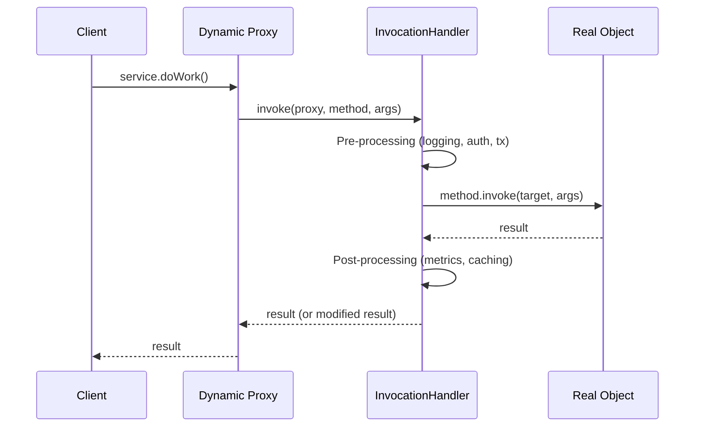
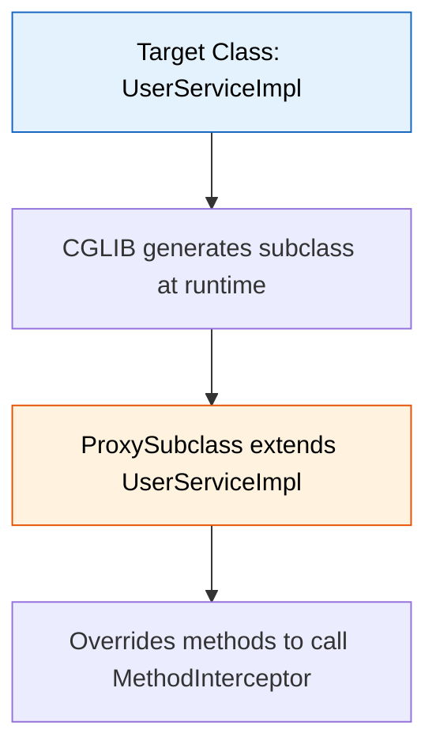
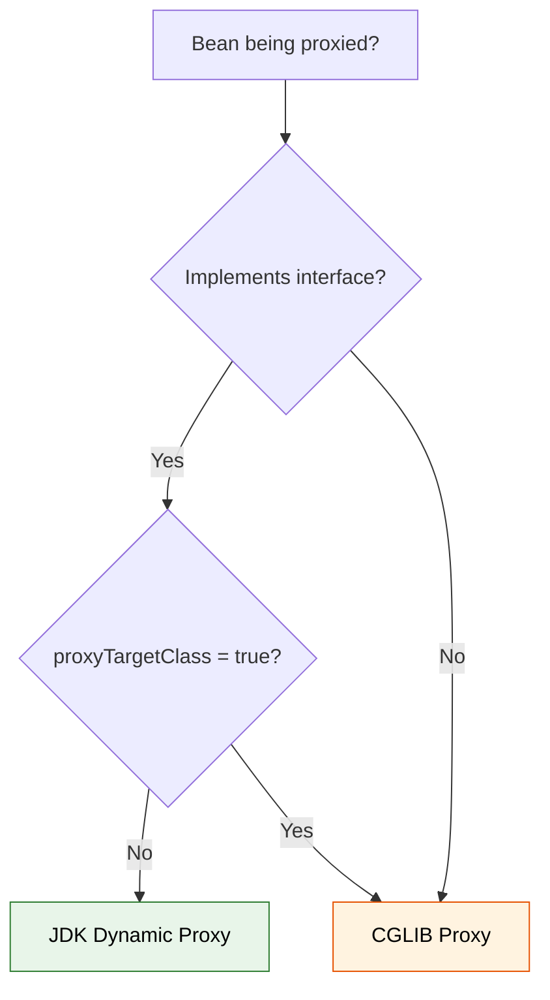

# Dynamic Proxy & Reflection-Based Patterns

Dynamic proxies let you **intercept method calls at runtime without modifying source code**. They are the backbone of Spring AOP, MyBatis mappers, Retrofit HTTP clients, and virtually every framework that "magically" adds cross-cutting behavior. This is a favorite topic in senior-level interviews because it tests deep understanding of the JVM, reflection, and framework internals.

---

## How Dynamic Proxy Works

A dynamic proxy is a class generated **at runtime** by the JVM that implements one or more interfaces and delegates every method call to an `InvocationHandler`.



---

## The InvocationHandler Interface

Every dynamic proxy requires an `InvocationHandler`. It has a single method:

```java
public interface InvocationHandler {
    Object invoke(Object proxy, Method method, Object[] args) throws Throwable;
}
```

| Parameter | Description |
|---|---|
| `proxy` | The proxy instance itself (rarely used directly — careful with `toString()` loops) |
| `method` | The `java.lang.reflect.Method` being invoked |
| `args` | The arguments passed to the method (`null` if no args) |

---

## Creating a JDK Dynamic Proxy

### Step 1 — Define an Interface

```java
public interface UserService {
    User findById(long id);
    List<User> findAll();
    void delete(long id);
}
```

### Step 2 — Implement the Real Service

```java
public class UserServiceImpl implements UserService {
    @Override
    public User findById(long id) {
        return userRepository.findById(id);
    }

    @Override
    public List<User> findAll() {
        return userRepository.findAll();
    }

    @Override
    public void delete(long id) {
        userRepository.deleteById(id);
    }
}
```

### Step 3 — Write the InvocationHandler

```java
public class LoggingHandler implements InvocationHandler {
    private final Object target;

    public LoggingHandler(Object target) {
        this.target = target;
    }

    @Override
    public Object invoke(Object proxy, Method method, Object[] args) throws Throwable {
        long start = System.nanoTime();
        System.out.printf("[LOG] Calling %s with args %s%n",
                method.getName(), Arrays.toString(args));

        try {
            Object result = method.invoke(target, args);
            return result;
        } catch (InvocationTargetException e) {
            throw e.getCause(); // unwrap the real exception
        } finally {
            long elapsed = (System.nanoTime() - start) / 1_000_000;
            System.out.printf("[LOG] %s completed in %d ms%n", method.getName(), elapsed);
        }
    }
}
```

### Step 4 — Create the Proxy Instance

```java
UserService realService = new UserServiceImpl();

UserService proxy = (UserService) Proxy.newProxyInstance(
    UserService.class.getClassLoader(),  // classloader
    new Class<?>[]{ UserService.class }, // interfaces to implement
    new LoggingHandler(realService)       // handler
);

proxy.findById(42); // goes through LoggingHandler.invoke()
```

!!! info "Key Point"
    `Proxy.newProxyInstance()` returns an object that implements all specified interfaces. The generated proxy class exists only in memory — there is no `.class` file on disk.

---

## Static Proxy vs Dynamic Proxy

| Aspect | Static Proxy | Dynamic Proxy |
|---|---|---|
| **Created** | Compile time (you write the class) | Runtime (JVM generates it) |
| **Boilerplate** | One proxy class per interface | One handler for any interface |
| **Flexibility** | Fixed behavior, hard to extend | Composable, reusable handlers |
| **Interface changes** | Must update proxy manually | Automatically picks up new methods |
| **Performance** | Slightly faster (no reflection) | Small overhead from `Method.invoke()` |
| **Use case** | Simple delegation, few methods | AOP, frameworks, cross-cutting concerns |

```java
// Static proxy — you manually delegate every method
public class UserServiceStaticProxy implements UserService {
    private final UserService delegate;
    
    public UserServiceStaticProxy(UserService delegate) {
        this.delegate = delegate;
    }

    @Override
    public User findById(long id) {
        log.info("findById called");    // duplicated in every method
        return delegate.findById(id);
    }

    @Override
    public List<User> findAll() {
        log.info("findAll called");     // duplicated again
        return delegate.findAll();
    }
    
    // ... must override every method
}
```

With a dynamic proxy, you write the cross-cutting logic **once** in the `InvocationHandler`.

---

## Use Cases and Patterns

### Caching Proxy

```java
public class CachingHandler implements InvocationHandler {
    private final Object target;
    private final Map<String, Object> cache = new ConcurrentHashMap<>();

    public CachingHandler(Object target) {
        this.target = target;
    }

    @Override
    public Object invoke(Object proxy, Method method, Object[] args) throws Throwable {
        if (method.isAnnotationPresent(Cacheable.class)) {
            String key = method.getName() + ":" + Arrays.toString(args);
            return cache.computeIfAbsent(key, k -> {
                try {
                    return method.invoke(target, args);
                } catch (Exception e) {
                    throw new RuntimeException(e);
                }
            });
        }
        return method.invoke(target, args);
    }
}
```

### Security / Authorization Proxy

```java
public class SecurityHandler implements InvocationHandler {
    private final Object target;

    public SecurityHandler(Object target) {
        this.target = target;
    }

    @Override
    public Object invoke(Object proxy, Method method, Object[] args) throws Throwable {
        if (method.isAnnotationPresent(RequiresRole.class)) {
            String required = method.getAnnotation(RequiresRole.class).value();
            if (!SecurityContext.currentUser().hasRole(required)) {
                throw new AccessDeniedException(
                    "Role '" + required + "' required for " + method.getName());
            }
        }
        return method.invoke(target, args);
    }
}
```

### Lazy Loading Proxy

```java
public class LazyLoadingHandler<T> implements InvocationHandler {
    private final Supplier<T> initializer;
    private volatile T instance;

    public LazyLoadingHandler(Supplier<T> initializer) {
        this.initializer = initializer;
    }

    @Override
    public Object invoke(Object proxy, Method method, Object[] args) throws Throwable {
        if (instance == null) {
            synchronized (this) {
                if (instance == null) {
                    instance = initializer.get();
                }
            }
        }
        return method.invoke(instance, args);
    }
}
```

### Composing Multiple Handlers (Decorator Chain)

```java
@SuppressWarnings("unchecked")
public static <T> T createProxy(T target, Class<T> iface,
                                 InvocationHandler... handlers) {
    Object current = target;
    for (InvocationHandler handler : handlers) {
        Object finalCurrent = current;
        current = Proxy.newProxyInstance(
            iface.getClassLoader(),
            new Class<?>[]{ iface },
            (proxy, method, args) -> {
                // Wrap each handler around the previous proxy
                return handler.invoke(proxy, method, args);
            }
        );
    }
    return (T) current;
}
```

---

## CGLIB Proxies (Subclass-Based)

JDK dynamic proxies require interfaces. **CGLIB** (Code Generation Library) creates proxies by **generating a subclass** of the target class at runtime using bytecode manipulation.



### CGLIB Example

```java
public class LoggingInterceptor implements MethodInterceptor {
    @Override
    public Object intercept(Object obj, Method method,
                            Object[] args, MethodProxy proxy) throws Throwable {
        System.out.println("[LOG] Before: " + method.getName());

        // IMPORTANT: use proxy.invokeSuper(), not method.invoke()
        Object result = proxy.invokeSuper(obj, args);

        System.out.println("[LOG] After: " + method.getName());
        return result;
    }
}

// Create CGLIB proxy — no interface needed
Enhancer enhancer = new Enhancer();
enhancer.setSuperclass(UserServiceImpl.class);
enhancer.setCallback(new LoggingInterceptor());

UserServiceImpl proxy = (UserServiceImpl) enhancer.create();
proxy.findById(42); // intercepted
```

!!! warning "CGLIB Limitations"
    - Cannot proxy `final` classes (cannot subclass them)
    - Cannot intercept `final` methods (cannot override them)
    - Cannot intercept `private` methods
    - Requires the class to have a **no-arg constructor** (or you must supply constructor arguments)
    - Generates additional classes in memory

---

## ByteBuddy (Modern Alternative)

ByteBuddy is the modern replacement for CGLIB, offering a fluent API, better performance, and active maintenance. Mockito switched from CGLIB to ByteBuddy in version 2.x.

```java
Class<?> dynamicType = new ByteBuddy()
    .subclass(UserServiceImpl.class)
    .method(ElementMatchers.named("findById"))
    .intercept(MethodDelegation.to(new LoggingInterceptor()))
    .make()
    .load(getClass().getClassLoader())
    .getLoaded();

UserServiceImpl proxy = (UserServiceImpl) dynamicType.getDeclaredConstructor().newInstance();
proxy.findById(42);
```

| Feature | CGLIB | ByteBuddy |
|---|---|---|
| **Maintenance** | Legacy, rarely updated | Actively maintained |
| **API** | Low-level, callback-based | Fluent, type-safe DSL |
| **Performance** | Good | Better (optimized bytecode) |
| **Java module support** | Limited | Full support for Java 9+ modules |
| **Used by** | Spring (historically), Hibernate | Mockito 2+, Hibernate 5.3+, Spring Boot 3 |

---

## Spring AOP and Proxy Mechanism

Spring uses proxies to implement AOP (Aspect-Oriented Programming). Understanding which proxy type Spring chooses is a common interview question.

### Decision Logic



| Scenario | Proxy Type | Reason |
|---|---|---|
| Bean implements interface | JDK Dynamic Proxy | Default behavior — proxies the interface |
| Bean has no interface | CGLIB Proxy | Only option — must subclass |
| `@EnableAspectJAutoProxy(proxyTargetClass = true)` | CGLIB Proxy | Force subclass proxying |
| **Spring Boot 2.x+ default** | **CGLIB Proxy** | Spring Boot defaults to `proxyTargetClass=true` |

!!! tip "Spring Boot Default"
    Starting with Spring Boot 2.0, CGLIB proxying is the **default** — even for beans that implement interfaces. This avoids subtle bugs where injecting a concrete class instead of the interface would fail with JDK proxies.

### Spring @Transactional Under the Hood

```java
// What you write:
@Service
public class OrderService {
    @Transactional
    public void placeOrder(Order order) {
        orderRepo.save(order);
        inventoryService.reserve(order.getItems());
        paymentService.charge(order.getTotal());
    }
}

// What Spring creates (conceptual CGLIB proxy):
public class OrderService$$EnhancerBySpringCGLIB extends OrderService {
    private TransactionInterceptor txInterceptor;

    @Override
    public void placeOrder(Order order) {
        TransactionStatus status = txManager.getTransaction(txDef);
        try {
            super.placeOrder(order);  // call real method
            txManager.commit(status);
        } catch (RuntimeException e) {
            txManager.rollback(status);
            throw e;
        }
    }
}
```

---

## Proxy Limitations

### 1. Self-Invocation Problem

The most common proxy pitfall. When a method within the same class calls another method, **it bypasses the proxy**.

```java
@Service
public class OrderService {
    @Transactional
    public void placeOrder(Order order) {
        // ... place the order
    }

    public void bulkPlace(List<Order> orders) {
        for (Order o : orders) {
            this.placeOrder(o);  // BYPASSES proxy — no transaction!
        }
    }
}
```

!!! danger "Why Self-Invocation Breaks"
    `this.placeOrder()` calls the method on the **actual object**, not the proxy wrapper. The proxy only intercepts calls that come from **outside** the object.

**Solutions:**

```java
// Solution 1: Inject self (Spring will inject the proxy)
@Service
public class OrderService {
    @Lazy @Autowired private OrderService self;

    public void bulkPlace(List<Order> orders) {
        for (Order o : orders) {
            self.placeOrder(o); // goes through proxy
        }
    }
}

// Solution 2: Use AopContext (requires exposeProxy=true)
OrderService proxy = (OrderService) AopContext.currentProxy();
proxy.placeOrder(order);

// Solution 3: Extract to separate bean
@Service
public class BulkOrderService {
    @Autowired private OrderService orderService;

    public void bulkPlace(List<Order> orders) {
        orders.forEach(orderService::placeOrder); // goes through proxy
    }
}
```

### 2. Final Classes and Methods

```java
// CGLIB cannot proxy this
public final class PaymentGateway { ... }    // Cannot subclass

public class OrderService {
    public final void process() { ... }       // Cannot override — not intercepted
}
```

### 3. Constructor Side Effects

CGLIB creates a subclass, which means the parent constructor runs during proxy creation. If the constructor has side effects (DB calls, network connections), they execute unexpectedly.

### 4. Visibility Constraints

| Method Visibility | JDK Proxy | CGLIB Proxy |
|---|---|---|
| `public` | Intercepted (if in interface) | Intercepted |
| `protected` | Not applicable | Intercepted |
| `package-private` | Not applicable | Intercepted (same package) |
| `private` | Not applicable | **Not intercepted** |

---

## Method Interception Patterns

### Annotation-Driven Interception

```java
@Retention(RetentionPolicy.RUNTIME)
@Target(ElementType.METHOD)
public @interface Timed {}

public class TimingHandler implements InvocationHandler {
    private final Object target;

    public TimingHandler(Object target) {
        this.target = target;
    }

    @Override
    public Object invoke(Object proxy, Method method, Object[] args) throws Throwable {
        // Resolve the annotation from the target class, not the proxy
        Method targetMethod = target.getClass().getMethod(
            method.getName(), method.getParameterTypes());

        if (targetMethod.isAnnotationPresent(Timed.class)) {
            long start = System.nanoTime();
            try {
                return method.invoke(target, args);
            } finally {
                long ms = (System.nanoTime() - start) / 1_000_000;
                Metrics.record(method.getName(), ms);
            }
        }
        return method.invoke(target, args);
    }
}
```

### Retry Pattern

```java
public class RetryHandler implements InvocationHandler {
    private final Object target;
    private final int maxRetries;

    public RetryHandler(Object target, int maxRetries) {
        this.target = target;
        this.maxRetries = maxRetries;
    }

    @Override
    public Object invoke(Object proxy, Method method, Object[] args) throws Throwable {
        int attempts = 0;
        while (true) {
            try {
                return method.invoke(target, args);
            } catch (InvocationTargetException e) {
                attempts++;
                if (attempts >= maxRetries) {
                    throw e.getCause();
                }
                Thread.sleep((long) Math.pow(2, attempts) * 100); // exponential backoff
            }
        }
    }
}
```

---

## Performance Considerations

| Approach | Relative Speed | Notes |
|---|---|---|
| Direct call | **1x** (baseline) | No overhead |
| Static proxy | ~1x | Compiler-optimized delegation |
| JDK Dynamic Proxy | ~2-5x slower | `Method.invoke()` reflection overhead |
| CGLIB Proxy | ~1.5-3x slower | `invokeSuper()` avoids full reflection |
| ByteBuddy | ~1.2-2x slower | Most optimized bytecode generation |

!!! note "In Practice"
    The proxy overhead is typically **nanoseconds per call**. For almost all applications, this is negligible compared to I/O (database queries, HTTP calls). Optimize proxy usage only if profiling reveals it as a bottleneck in tight loops.

**JVM optimizations that help:**

- **Method handle caching** — `Method` objects are cached internally after first resolution
- **JIT inlining** — the JVM can inline small proxy delegation chains
- **Reflection inflation** — After ~15 invocations, the JVM replaces reflective calls with generated bytecode accessors

---

## Real-World Framework Examples

### MyBatis Mapper Proxies

MyBatis creates dynamic proxies for mapper interfaces — there is **no implementation class**.

```java
// You define only the interface
public interface UserMapper {
    @Select("SELECT * FROM users WHERE id = #{id}")
    User findById(long id);
}

// MyBatis creates a proxy at runtime
SqlSession session = sqlSessionFactory.openSession();
UserMapper mapper = session.getMapper(UserMapper.class);
// mapper is a JDK dynamic proxy that translates method calls to SQL
User user = mapper.findById(42);
```

### Retrofit HTTP Client

Retrofit follows the same pattern — interfaces become HTTP clients.

```java
public interface GitHubApi {
    @GET("users/{user}/repos")
    Call<List<Repo>> listRepos(@Path("user") String user);
}

Retrofit retrofit = new Retrofit.Builder()
    .baseUrl("https://api.github.com/")
    .build();

GitHubApi api = retrofit.create(GitHubApi.class); // JDK dynamic proxy
api.listRepos("vamsi1998123"); // translates to HTTP GET
```

### Hibernate Lazy Loading

Hibernate uses proxies to implement lazy loading for entity associations.

```java
@Entity
public class Order {
    @ManyToOne(fetch = FetchType.LAZY)
    private Customer customer; // Hibernate injects a proxy, not the real Customer
}

Order order = entityManager.find(Order.class, 1L);
// order.customer is a Hibernate proxy (CGLIB/ByteBuddy subclass)
order.getCustomer().getName(); // triggers SELECT query on first access
```

---

## Proxy Factory Utility

A reusable utility to create proxied instances with chained concerns:

```java
public class ProxyFactory {

    @SafeVarargs
    public static <T> T create(T target, Class<T> iface,
                                Function<InvocationHandler, InvocationHandler>... wrappers) {
        InvocationHandler base = (proxy, method, args) -> method.invoke(target, args);

        InvocationHandler chain = base;
        for (var wrapper : wrappers) {
            chain = wrapper.apply(chain);
        }

        return iface.cast(Proxy.newProxyInstance(
            iface.getClassLoader(),
            new Class<?>[]{ iface },
            chain
        ));
    }
}

// Usage — compose logging + caching + timing
UserService proxied = ProxyFactory.create(
    new UserServiceImpl(),
    UserService.class,
    next -> (proxy, method, args) -> {
        System.out.println("Before: " + method.getName());
        Object result = next.invoke(proxy, method, args);
        System.out.println("After: " + method.getName());
        return result;
    },
    next -> (proxy, method, args) -> {
        long start = System.nanoTime();
        Object result = next.invoke(proxy, method, args);
        System.out.printf("%s took %d ms%n", method.getName(),
            (System.nanoTime() - start) / 1_000_000);
        return result;
    }
);
```

---

## Interview Questions

??? question "What is the difference between JDK Dynamic Proxy and CGLIB proxy?"
    **JDK Dynamic Proxy** uses `java.lang.reflect.Proxy` and requires the target to implement at least one interface. It creates a proxy that implements those interfaces and delegates calls to an `InvocationHandler`. **CGLIB** generates a subclass of the target class using bytecode manipulation, so it does not require interfaces. However, CGLIB cannot proxy `final` classes or intercept `final`/`private` methods. Spring Boot 2.x+ defaults to CGLIB even when interfaces are present.

??? question "Explain the self-invocation problem in Spring proxies. How do you solve it?"
    When a bean method calls another method on `this`, the call goes directly to the target object, bypassing the proxy. This means annotations like `@Transactional` or `@Cacheable` on the called method have no effect. Solutions: (1) inject the bean into itself using `@Lazy @Autowired` so calls go through the proxy, (2) use `AopContext.currentProxy()` with `exposeProxy=true`, or (3) extract the method into a separate bean so the call crosses the proxy boundary.

??? question "How does Spring decide which proxy type to use?"
    Spring checks: (1) If the bean implements an interface and `proxyTargetClass` is `false`, it uses a JDK dynamic proxy. (2) If the bean has no interface, it uses CGLIB. (3) If `proxyTargetClass=true` (Spring Boot default since 2.0), it always uses CGLIB. This can be configured via `@EnableAspectJAutoProxy(proxyTargetClass = true)` or `spring.aop.proxy-target-class=true`.

??? question "Why can't JDK dynamic proxies work without interfaces?"
    `java.lang.reflect.Proxy` works by generating a class that **implements** the specified interfaces. Since Java does not support multiple inheritance of classes, the generated proxy already extends `java.lang.reflect.Proxy` — it cannot also extend your concrete class. This is a fundamental design constraint of the JDK proxy mechanism.

??? question "How does MyBatis create mapper implementations without any concrete class?"
    MyBatis uses `Proxy.newProxyInstance()` to create a JDK dynamic proxy for each mapper interface. The `InvocationHandler` (called `MapperProxy`) inspects the method name, its annotations (`@Select`, `@Insert`, etc.), and the XML mapping files to build and execute the appropriate SQL query. The proxy translates method parameters to query parameters and maps `ResultSet` rows back to Java objects.

??? question "What happens if you call toString(), equals(), or hashCode() on a dynamic proxy?"
    These calls also go through the `InvocationHandler.invoke()` method. If your handler delegates everything to the target via `method.invoke(target, args)`, they will call the target's implementations. If you do not handle them specially and accidentally use the `proxy` parameter (e.g., `proxy.toString()` inside `invoke()`), you will cause infinite recursion and a `StackOverflowError`.

??? question "What is the performance overhead of dynamic proxies? When should you avoid them?"
    JDK dynamic proxies add roughly 2-5x overhead per call due to reflection, while CGLIB adds 1.5-3x. However, this is nanoseconds per invocation — negligible for any code that involves I/O. You should avoid proxies only in extremely hot paths (millions of calls per second in tight loops with no I/O). The JVM mitigates the cost through JIT compilation, method handle caching, and reflection inflation (switching to bytecode-generated accessors after ~15 calls).

??? question "How does Hibernate use proxies for lazy loading? What pitfalls exist?"
    Hibernate creates a CGLIB/ByteBuddy subclass proxy for lazily loaded entities. The proxy holds only the entity ID. When any getter (except `getId()`) is called, it triggers a database query to load the full entity. Pitfalls: (1) `LazyInitializationException` if the entity is accessed outside a Hibernate session. (2) `instanceof` checks may fail because the proxy is a subclass, not the exact entity class. (3) `equals()`/`hashCode()` may not work correctly if they access fields directly instead of through getters.

??? question "Can you create a dynamic proxy for a class without any interface in pure JDK?"
    No. The JDK `Proxy` class requires at least one interface. To proxy a concrete class, you must use a bytecode manipulation library such as CGLIB or ByteBuddy. These libraries generate a subclass at runtime, overriding methods to add interception logic. This is why Spring uses CGLIB when a bean does not implement any interface.

??? question "Describe how you would implement a generic retry mechanism using dynamic proxies."
    Create an `InvocationHandler` that wraps the target object. In the `invoke()` method, call `method.invoke(target, args)` inside a loop. Catch `InvocationTargetException`, unwrap the cause, and check if it is a retryable exception. Track the attempt count and apply exponential backoff between retries. After exceeding the max attempts, rethrow the exception. This can be made annotation-driven by reading a `@Retryable` annotation from the method to configure max attempts and retryable exception types.
