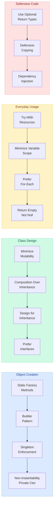
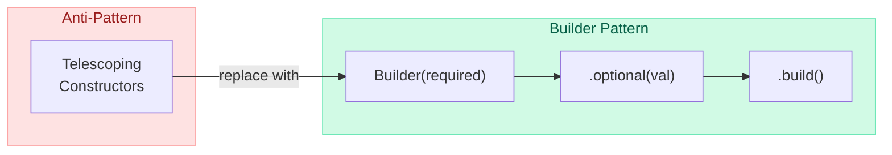
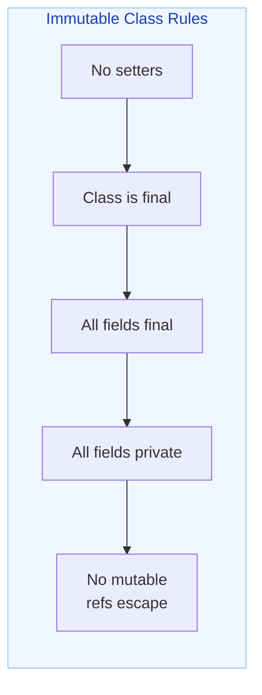
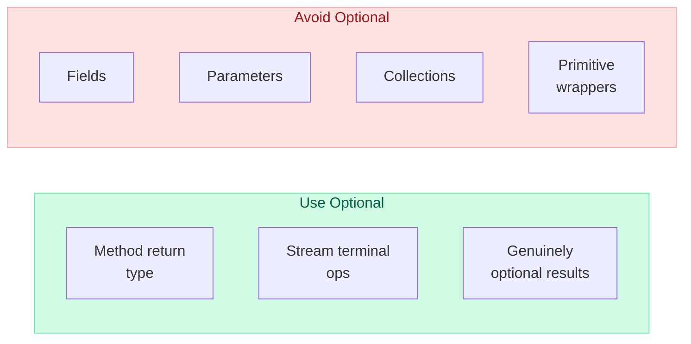
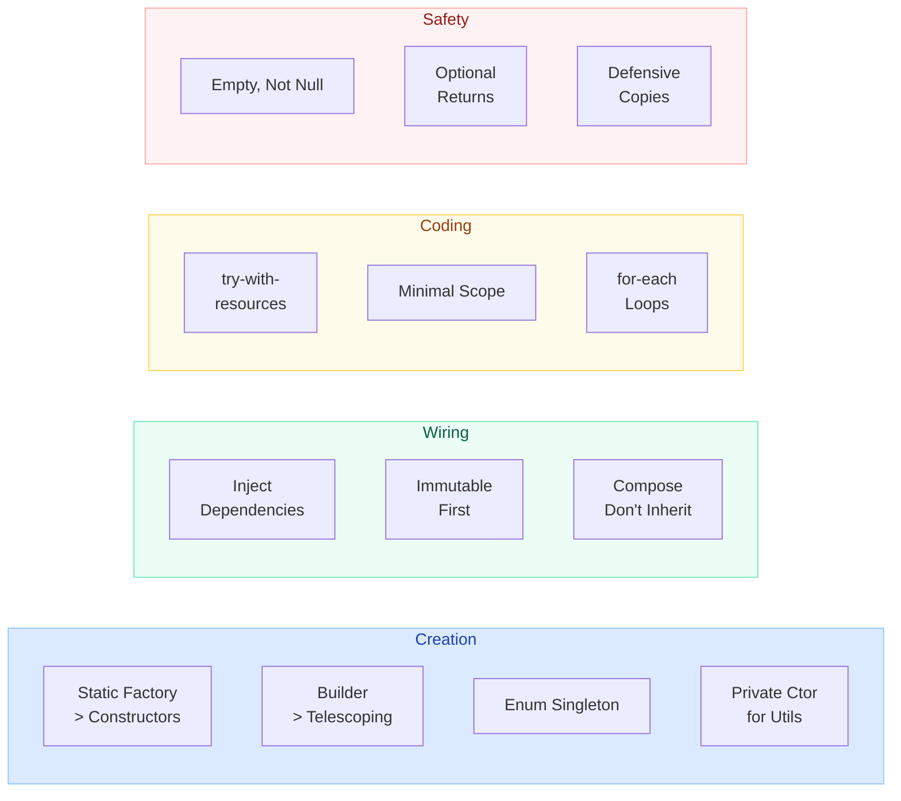

# Effective Java Patterns

!!! danger "Production Bugs Prevented"
    Following these patterns from Joshua Bloch's *Effective Java* prevents entire categories of production bugs: null pointer exceptions, resource leaks, thread-safety violations, broken equals contracts, and API misuse. Teams that adopt these as coding standards report **40-60% fewer defects** in code review.

---

## Overview



---

## 1. Static Factory Methods vs Constructors

!!! tip "Item 1: Consider static factory methods instead of constructors"
    Static factories provide named, flexible object creation without the constraints of constructors.

### Advantages

| Advantage | Explanation |
|-----------|------------|
| **Named** | `BigInteger.probablePrime()` is clearer than `new BigInteger(...)` |
| **Instance control** | Can return cached instances (flyweight) |
| **Return subtypes** | Can return interface implementations |
| **Vary by params** | `EnumSet.of()` returns different impl based on size |
| **Class need not exist** | Service provider framework pattern |

### Common Naming Conventions

```java
// from — type-conversion factory
Date d = Date.from(instant);

// of — aggregation factory
Set<Rank> faceCards = EnumSet.of(JACK, QUEEN, KING);

// valueOf — verbose alternative to from/of
BigInteger prime = BigInteger.valueOf(Integer.MAX_VALUE);

// instance / getInstance — returns described instance
StackWalker luke = StackWalker.getInstance(options);

// create / newInstance — guarantees new instance each call
Object newArray = Array.newInstance(classObject, arrayLen);

// getType — factory in a different class
FileStore fs = Files.getFileStore(path);

// type — concise alternative to getType
List<Complaint> litany = Collections.list(legacyLitany);
```

### Real-World Example

```java
public class Connection {
    private final String host;
    private final int port;
    private final boolean ssl;

    // Private constructor — forces use of factories
    private Connection(String host, int port, boolean ssl) {
        this.host = host;
        this.port = port;
        this.ssl = ssl;
    }

    // Named factories — self-documenting
    public static Connection insecure(String host, int port) {
        return new Connection(host, port, false);
    }

    public static Connection secure(String host, int port) {
        return new Connection(host, port, true);
    }

    public static Connection localhost(int port) {
        return new Connection("localhost", port, false);
    }
}
```

---

## 2. Builder Pattern for Complex Constructors

!!! warning "The Telescoping Constructor Anti-Pattern"
    When a class has many optional parameters, constructors become unreadable and error-prone. The Builder pattern provides a readable, type-safe alternative.

### The Problem

```java
// Telescoping — which parameter is which?
NutritionFacts cocaCola = new NutritionFacts(240, 8, 100, 0, 35, 27);
// Is 0 the fat? The sodium? Impossible to tell.
```

### The Solution

```java
public class NutritionFacts {
    private final int servingSize;   // required
    private final int servings;      // required
    private final int calories;      // optional
    private final int fat;           // optional
    private final int sodium;        // optional
    private final int carbohydrate;  // optional

    public static class Builder {
        // Required parameters
        private final int servingSize;
        private final int servings;

        // Optional parameters — initialized to defaults
        private int calories = 0;
        private int fat = 0;
        private int sodium = 0;
        private int carbohydrate = 0;

        public Builder(int servingSize, int servings) {
            this.servingSize = servingSize;
            this.servings = servings;
        }

        public Builder calories(int val) { calories = val; return this; }
        public Builder fat(int val) { fat = val; return this; }
        public Builder sodium(int val) { sodium = val; return this; }
        public Builder carbohydrate(int val) { carbohydrate = val; return this; }

        public NutritionFacts build() {
            return new NutritionFacts(this);
        }
    }

    private NutritionFacts(Builder builder) {
        servingSize  = builder.servingSize;
        servings     = builder.servings;
        calories     = builder.calories;
        fat          = builder.fat;
        sodium       = builder.sodium;
        carbohydrate = builder.carbohydrate;
    }
}

// Usage — readable and safe
NutritionFacts cocaCola = new NutritionFacts.Builder(240, 8)
    .calories(100)
    .sodium(35)
    .carbohydrate(27)
    .build();
```



---

## 3. Enforce Singleton with Enum or Private Constructor

!!! info "Item 3: Enforce the singleton property"
    A singleton is a class instantiated exactly once. Enum-based singletons are the most robust approach.

### Approaches Compared

=== "Enum Singleton (Preferred)"

    ```java
    public enum Elvis {
        INSTANCE;

        private final List<String> songs = new ArrayList<>();

        public void addSong(String song) { songs.add(song); }
        public List<String> getSongs() { return Collections.unmodifiableList(songs); }
    }

    // Usage
    Elvis.INSTANCE.addSong("Hound Dog");
    ```

    Advantages: serialization-safe, reflection-proof, thread-safe by JVM guarantee.

=== "Private Constructor + Static Field"

    ```java
    public class Elvis {
        private static final Elvis INSTANCE = new Elvis();
        private Elvis() {}
        public static Elvis getInstance() { return INSTANCE; }
    }
    ```

    Vulnerable to reflection and serialization attacks unless you add `readResolve()`.

=== "Private Constructor + Lazy Init"

    ```java
    public class Elvis {
        private static volatile Elvis instance;
        private Elvis() {}

        public static Elvis getInstance() {
            if (instance == null) {
                synchronized (Elvis.class) {
                    if (instance == null) {
                        instance = new Elvis();
                    }
                }
            }
            return instance;
        }
    }
    ```

---

## 4. Non-Instantiability with Private Constructor

!!! tip "Item 4: Enforce non-instantiability with a private constructor"
    Utility classes (collections of static methods) should never be instantiated.

```java
public class MathUtils {
    // Suppress default constructor for non-instantiability
    private MathUtils() {
        throw new AssertionError("No instances!");
    }

    public static int gcd(int a, int b) {
        return b == 0 ? a : gcd(b, a % b);
    }

    public static boolean isPrime(int n) {
        if (n < 2) return false;
        for (int i = 2; i * i <= n; i++) {
            if (n % i == 0) return false;
        }
        return true;
    }
}
```

The `AssertionError` prevents accidental instantiation from within the class itself.

---

## 5. Prefer Dependency Injection

!!! tip "Item 5: Prefer dependency injection to hardwiring resources"
    Classes that depend on underlying resources should receive them via constructor injection rather than creating them internally.

### Bad: Hardwired Dependency

```java
public class SpellChecker {
    private final Lexicon dictionary = new EnglishLexicon(); // Untestable!

    public boolean isValid(String word) {
        return dictionary.contains(word);
    }
}
```

### Good: Constructor Injection

```java
public class SpellChecker {
    private final Lexicon dictionary;

    // Inject the dependency
    public SpellChecker(Lexicon dictionary) {
        this.dictionary = Objects.requireNonNull(dictionary);
    }

    public boolean isValid(String word) {
        return dictionary.contains(word);
    }
}

// Testable with any Lexicon implementation
SpellChecker checker = new SpellChecker(new MockLexicon());
```

### Factory Variant (Supplier)

```java
public class SpellChecker {
    private final Lexicon dictionary;

    // Supplier<? extends Lexicon> — bounded wildcard factory
    public SpellChecker(Supplier<? extends Lexicon> dictionaryFactory) {
        this.dictionary = dictionaryFactory.get();
    }
}
```

---

## 6. Minimize Mutability

!!! info "Item 17: Minimize mutability"
    Immutable objects are simple, thread-safe, and can be shared freely. Make every class immutable unless there is a compelling reason not to.

### Five Rules for Immutable Classes

1. **No mutators** — no `set` methods
2. **Class is `final`** — cannot be extended
3. **All fields `final`** — enforced by compiler
4. **All fields `private`** — no direct access
5. **No references to mutable objects escape** — defensive copies on the way in and out

```java
public final class Money {
    private final BigDecimal amount;
    private final Currency currency;

    public Money(BigDecimal amount, Currency currency) {
        this.amount = Objects.requireNonNull(amount);
        this.currency = Objects.requireNonNull(currency);
    }

    public Money add(Money other) {
        if (!this.currency.equals(other.currency)) {
            throw new IllegalArgumentException("Currency mismatch");
        }
        return new Money(this.amount.add(other.amount), this.currency);
    }

    public BigDecimal getAmount() { return amount; } // BigDecimal is immutable
    public Currency getCurrency() { return currency; }
}
```



---

## 7. Favor Composition Over Inheritance

!!! warning "Item 18: Favor composition over inheritance"
    Implementation inheritance breaks encapsulation. If a superclass changes its implementation, subclasses can break even if their code hasn't changed (fragile base class problem).

### The Problem: Fragile Base Class

```java
// BROKEN — InstrumentedHashSet over-counts!
public class InstrumentedHashSet<E> extends HashSet<E> {
    private int addCount = 0;

    @Override
    public boolean add(E e) {
        addCount++;
        return super.add(e);
    }

    @Override
    public boolean addAll(Collection<? extends E> c) {
        addCount += c.size();
        return super.addAll(c); // HashSet.addAll calls add() internally!
    }

    public int getAddCount() { return addCount; }
}

// addAll(Arrays.asList("a","b","c")) — addCount is 6, not 3!
```

### The Solution: Composition + Forwarding

```java
// Reusable forwarding class
public class ForwardingSet<E> implements Set<E> {
    private final Set<E> s;
    public ForwardingSet(Set<E> s) { this.s = s; }

    public boolean add(E e) { return s.add(e); }
    public boolean addAll(Collection<? extends E> c) { return s.addAll(c); }
    // ... forward all Set methods to s
}

// Decorator — counts correctly regardless of Set implementation
public class InstrumentedSet<E> extends ForwardingSet<E> {
    private int addCount = 0;

    public InstrumentedSet(Set<E> s) { super(s); }

    @Override
    public boolean add(E e) {
        addCount++;
        return super.add(e);
    }

    @Override
    public boolean addAll(Collection<? extends E> c) {
        addCount += c.size();
        return super.addAll(c);
    }

    public int getAddCount() { return addCount; }
}
```

---

## 8. Design for Inheritance or Prohibit It

!!! danger "Item 19: Design and document for inheritance, or else prohibit it"
    If you don't explicitly design a class for extension, make it `final`.

### Rules for Inheritable Classes

- Document the **self-use patterns** of overridable methods
- Provide protected hooks for subclass customization
- Test by writing at least three subclasses
- Constructors must **never** call overridable methods

```java
// BAD: constructor calls overridable method
public class Super {
    public Super() {
        overrideMe(); // Subclass fields not yet initialized!
    }
    public void overrideMe() {}
}

public class Sub extends Super {
    private final Instant instant;

    Sub() {
        instant = Instant.now();
    }

    @Override
    public void overrideMe() {
        System.out.println(instant); // Prints null! Called from Super()
    }
}
```

```java
// SAFE: mark non-extensible classes final
public final class SecurityUtils {
    // Cannot be subclassed — no fragile base class risk
}
```

---

## 9. Prefer Interfaces to Abstract Classes

!!! tip "Item 20: Prefer interfaces to abstract classes"
    Interfaces allow multiple inheritance of type, enable mixins, and support the skeletal implementation pattern.

### Why Interfaces Win

| Feature | Interface | Abstract Class |
|---------|-----------|---------------|
| Multiple inheritance | Yes | No |
| Mixin support | Yes | No |
| Non-hierarchical types | Yes | No |
| Default methods (Java 8+) | Yes | Yes |
| State (fields) | Constants only | Yes |

### Skeletal Implementation Pattern

```java
// Interface defines the contract
public interface Vending {
    void start();
    void insertCoin(int amount);
    Item dispense(String code);
    int refund();
}

// Abstract skeletal implementation (named AbstractXxx by convention)
public abstract class AbstractVending implements Vending {
    private int balance = 0;

    @Override
    public void insertCoin(int amount) {
        if (amount <= 0) throw new IllegalArgumentException();
        balance += amount;
    }

    @Override
    public int refund() {
        int refund = balance;
        balance = 0;
        return refund;
    }

    // Leave start() and dispense() for subclass to implement
}
```

---

## 10. Try-With-Resources Over Try-Finally

!!! tip "Item 9: Prefer try-with-resources to try-finally"
    `try-finally` is ugly with multiple resources and can suppress meaningful exceptions. `try-with-resources` is cleaner and safer.

### Bad: Try-Finally

```java
// Ugly with multiple resources and suppresses first exception
static void copy(String src, String dst) throws IOException {
    InputStream in = new FileInputStream(src);
    try {
        OutputStream out = new FileOutputStream(dst);
        try {
            byte[] buf = new byte[1024];
            int n;
            while ((n = in.read(buf)) >= 0)
                out.write(buf, 0, n);
        } finally {
            out.close(); // If this throws, in.close() exception lost
        }
    } finally {
        in.close();
    }
}
```

### Good: Try-With-Resources

```java
static void copy(String src, String dst) throws IOException {
    try (InputStream in = new FileInputStream(src);
         OutputStream out = new FileOutputStream(dst)) {
        byte[] buf = new byte[1024];
        int n;
        while ((n = in.read(buf)) >= 0)
            out.write(buf, 0, n);
    }
    // Both streams closed automatically, suppressed exceptions preserved
}
```

---

## 11. Minimize Scope of Local Variables

!!! info "Item 57: Minimize the scope of local variables"
    Declare variables at the point they are first used, not at the top of the method.

```java
// BAD: variable declared far from use
public void processOrders(List<Order> orders) {
    Iterator<Order> it;  // declared too early
    Order current;       // declared too early
    // ... 50 lines of other code ...
    it = orders.iterator();
    while (it.hasNext()) {
        current = it.next();
        // process
    }
}

// GOOD: minimal scope
public void processOrders(List<Order> orders) {
    for (Order order : orders) {
        process(order);
    }
}
```

### Prefer `for` Over `while` (Limits Scope)

```java
// for-loop limits iterator scope — compile-time error if reused
for (Iterator<Element> i = c.iterator(); i.hasNext(); ) {
    Element e = i.next();
}

// while-loop leaks iterator — subtle copy-paste bug possible
Iterator<Element> i = c.iterator();
while (i.hasNext()) { doSomething(i.next()); }

Iterator<Element> i2 = c2.iterator();
while (i.hasNext()) { /* BUG: uses i instead of i2, compiles fine */ }
```

---

## 12. Prefer For-Each to Traditional For

!!! tip "Item 58: Prefer for-each loops to traditional for loops"
    Enhanced for loops eliminate off-by-one errors and are cleaner. Use traditional for only when you need the index, need to remove elements, or iterate multiple collections in parallel.

```java
// Traditional for — error-prone
for (int i = 0; i < list.size(); i++) {
    process(list.get(i));
}

// For-each — cleaner, no index bugs
for (Element e : list) {
    process(e);
}

// Works with any Iterable, including custom types
public class Deck implements Iterable<Card> {
    @Override
    public Iterator<Card> iterator() {
        return cards.iterator();
    }
}
```

### Nested Iteration Bug

```java
// BUG with traditional for
for (Iterator<Suit> i = suits.iterator(); i.hasNext(); )
    for (Iterator<Rank> j = ranks.iterator(); j.hasNext(); )
        deck.add(new Card(i.next(), j.next())); // i.next() called too many times!

// FIXED with for-each
for (Suit suit : suits)
    for (Rank rank : ranks)
        deck.add(new Card(suit, rank));
```

---

## 13. Return Empty Collections, Never Null

!!! danger "Item 54: Return empty collections or arrays, not nulls"
    Returning null forces every caller to add null checks. Forgetting one causes `NullPointerException` in production.

```java
// BAD: returns null — every caller must null-check
public List<Cheese> getCheeses() {
    if (cheesesInStock.isEmpty())
        return null; // Invites NPE at call site
    return new ArrayList<>(cheesesInStock);
}

// Caller must remember this:
List<Cheese> cheeses = shop.getCheeses();
if (cheeses != null && cheeses.contains(Cheese.STILTON)) { ... }
```

```java
// GOOD: return empty collection
public List<Cheese> getCheeses() {
    if (cheesesInStock.isEmpty())
        return Collections.emptyList(); // Shared, immutable empty list
    return new ArrayList<>(cheesesInStock);
}

// Caller code is clean:
if (shop.getCheeses().contains(Cheese.STILTON)) { ... }
```

```java
// For arrays:
private static final Cheese[] EMPTY_CHEESE_ARRAY = new Cheese[0];

public Cheese[] getCheeses() {
    return cheesesInStock.toArray(EMPTY_CHEESE_ARRAY);
}
```

---

## 14. Use Optional for Absent Return Values

!!! info "Item 55: Return Optional for values that might be absent"
    `Optional<T>` signals to callers that the value might not exist, eliminating null-related bugs at the API boundary.

```java
// Return Optional instead of null
public Optional<ProcessHandle> parentProcess() {
    return Optional.ofNullable(parent);
}

// Caller handles absence explicitly
String parentName = ph.parentProcess()
    .map(ProcessHandle::info)
    .flatMap(ProcessHandle.Info::command)
    .orElse("Unknown");
```

### Optional Anti-Patterns

```java
// NEVER use Optional for:
// 1. Fields — adds memory overhead and complexity
private Optional<String> name; // BAD

// 2. Method parameters — confusing API
public void setName(Optional<String> name); // BAD

// 3. Collections — return empty collection instead
public Optional<List<Item>> getItems(); // BAD — return empty list

// 4. Wrapping primitive types (use OptionalInt, OptionalLong)
Optional<Integer> count; // BAD — use OptionalInt
```

### When to Use Optional



---

## 15. Defensive Copying

!!! warning "Item 50: Make defensive copies when needed"
    If a class has mutable components received from or returned to clients, the class must defensively copy them. Otherwise, clients can mutate your object's internal state.

### The Vulnerability

```java
public final class Period {
    private final Date start;
    private final Date end;

    public Period(Date start, Date end) {
        if (start.compareTo(end) > 0) throw new IllegalArgumentException();
        this.start = start; // BUG: stores reference to mutable Date!
        this.end = end;
    }

    public Date getStart() { return start; } // BUG: exposes internal state!
    public Date getEnd() { return end; }
}

// Attack:
Date start = new Date();
Date end = new Date();
Period p = new Period(start, end);
end.setYear(78); // Mutates p's internal state!
```

### The Fix

```java
public final class Period {
    private final Date start;
    private final Date end;

    public Period(Date start, Date end) {
        // Defensive copy BEFORE validation (TOCTOU attack prevention)
        this.start = new Date(start.getTime());
        this.end = new Date(end.getTime());

        if (this.start.compareTo(this.end) > 0)
            throw new IllegalArgumentException();
    }

    // Return defensive copies from accessors
    public Date getStart() { return new Date(start.getTime()); }
    public Date getEnd() { return new Date(end.getTime()); }
}
```

!!! note "Modern Alternative"
    Use `java.time.Instant` or `LocalDate` instead of `Date` — they are immutable by design, eliminating the need for defensive copies entirely.

---

## Summary Table

| # | Item | Rule | Why It Matters |
|---|------|------|----------------|
| 1 | Static factories | Use `of()`, `valueOf()`, `getInstance()` | Named, cacheable, can return subtypes |
| 2 | Builder | Replace telescoping constructors | Readable, validates at build time |
| 3 | Singleton | Use enum or private ctor | Thread-safe, serialization-proof |
| 4 | Non-instantiability | Private ctor + AssertionError | Prevents misuse of utility classes |
| 5 | DI | Inject resources via constructor | Testable, flexible, decoupled |
| 6 | Immutability | Final class, final fields, no setters | Thread-safe, simple, shareable |
| 7 | Composition | Wrap instead of extend | Avoids fragile base class |
| 8 | Inheritance design | `final` unless designed for extension | Prevents accidental breakage |
| 9 | Interfaces | Prefer over abstract classes | Multiple inheritance, mixins |
| 10 | Try-with-resources | Always for AutoCloseable | No resource leaks, clean code |
| 11 | Variable scope | Declare at first use | Reduces bugs, improves readability |
| 12 | For-each | Use unless index needed | No off-by-one, cleaner |
| 13 | Empty returns | Never return null collections | Eliminates NPE class of bugs |
| 14 | Optional | Return type for absent values | Explicit absence handling |
| 15 | Defensive copies | Copy mutable inputs/outputs | Prevents external state mutation |

---

## Quick Recall



---

## Interview Template

???+ example "Effective Java — Interview Quick Reference"

    **Q: Why prefer static factory methods over constructors?**

    A: Four advantages: (1) they have names (`probablePrime` vs constructor), (2) they can cache and reuse instances, (3) they can return subtypes for flexibility, (4) the returned class can vary by input parameters.

    ---

    **Q: How do you make a class immutable?**

    A: Five rules: make it `final`, all fields `private final`, no setters, ensure exclusive access to mutable components (defensive copies), and compute new objects for any mutation (functional approach).

    ---

    **Q: When would you use composition over inheritance?**

    A: Always prefer composition unless the relationship is genuinely "is-a" AND the superclass is designed for inheritance. Inheritance breaks encapsulation — `InstrumentedHashSet` counting bug is the classic example where `addAll` internally calls `add`, causing double-counting.

    ---

    **Q: Why never return null from a collection-returning method?**

    A: Null forces defensive checks at every call site. Missing even one check causes production NPE. Return `Collections.emptyList()` (zero allocation — shared singleton) instead.

    ---

    **Q: When should you use Optional?**

    A: Only for return types where absence is a valid outcome. Never for fields, parameters, or collection returns. Use `OptionalInt`/`OptionalLong` for primitives to avoid boxing.

    ---

    **Q: Explain defensive copying and when it's needed.**

    A: When a class stores mutable objects received from clients (like `Date`), copy them in the constructor BEFORE validation (prevents TOCTOU attacks) and return copies from getters. Modern alternative: use immutable types (`Instant`, `LocalDate`).
