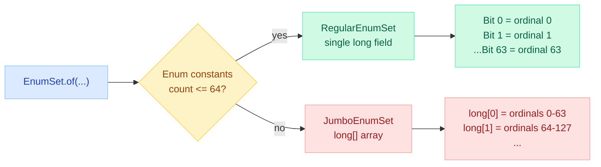
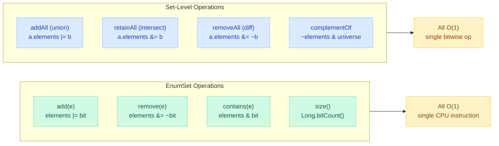
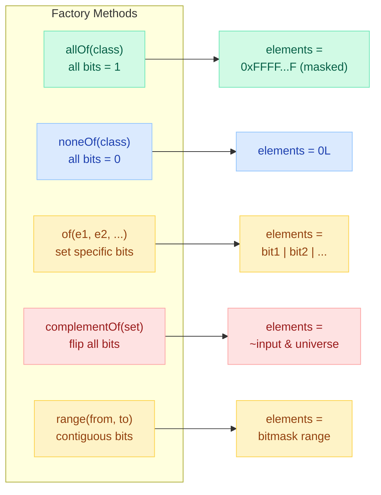
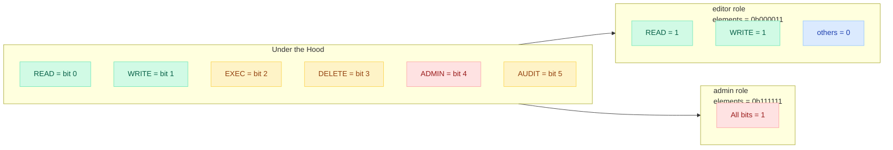
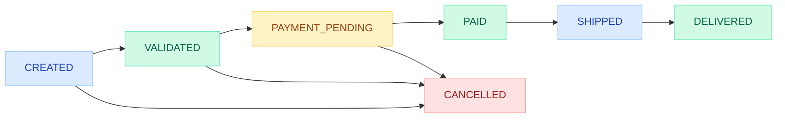
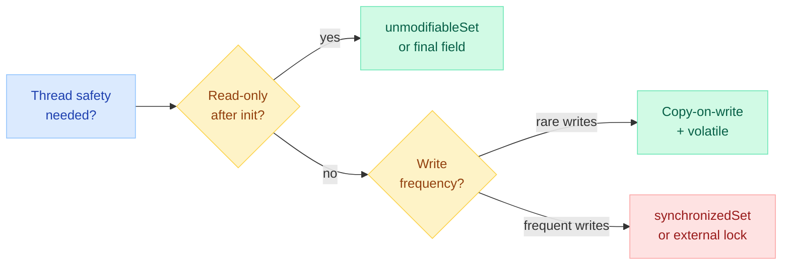

# EnumSet & EnumMap — Internals and Usage

> **"Use EnumSet instead of bit fields." — Joshua Bloch, Effective Java Item 36**

---

!!! danger "Real Incident: Permission Check Bypass via HashSet of Enums"
    A fintech authorization service stored user permissions in a `HashSet<Permission>` with 12 enum constants. Under peak load (50K req/s), GC pause spikes averaged 18ms due to millions of boxed `Permission` objects scattered across heap generations. Worse, a subtle race during `HashSet` resize caused intermittent **phantom permission grants** — users briefly gained admin access. Replacing `HashSet<Permission>` with `EnumSet<Permission>` eliminated boxing entirely (single `long` bit-vector), reduced per-user memory from 432 bytes to 8 bytes, and removed the resize race condition. GC pauses dropped to <2ms.

---

## EnumSet Architecture — Bit-Vector Brilliance

`EnumSet` is an abstract class with two concrete implementations chosen at creation time based on the number of enum constants:



### RegularEnumSet — Single `long` (<=64 constants)

The entire set is a **single 64-bit long** where each bit position corresponds to an enum constant's `ordinal()`.

```java
// Actual JDK source (simplified)
class RegularEnumSet<E extends Enum<E>> extends EnumSet<E> {
    private long elements = 0L;  // THE ENTIRE SET — one machine word

    void add(E e) {
        elements |= (1L << e.ordinal());   // set bit
    }

    boolean contains(Object e) {
        return (elements & (1L << ((Enum<?>)e).ordinal())) != 0;  // test bit
    }

    void remove(Object e) {
        elements &= ~(1L << ((Enum<?>)e).ordinal());  // clear bit
    }

    int size() {
        return Long.bitCount(elements);  // CPU popcnt instruction
    }
}
```

### JumboEnumSet — `long[]` array (>64 constants)

For enums with more than 64 constants (rare in practice), a `long[]` array is used:

```java
class JumboEnumSet<E extends Enum<E>> extends EnumSet<E> {
    private long[] elements;  // elements[ordinal / 64] bit (ordinal % 64)

    void add(E e) {
        elements[e.ordinal() >>> 6] |= (1L << e.ordinal());
    }
}
```

---

## EnumSet Operations — All O(1) via Bitwise Ops



**Performance breakdown:**

| Operation | EnumSet Implementation | Time | HashSet Equivalent | Time |
|---|---|---|---|---|
| `add(e)` | `elements \|= (1L << ordinal)` | O(1), no allocation | hash + bucket + Node allocation | O(1) amortized, allocates |
| `contains(e)` | `(elements & (1L << ordinal)) != 0` | O(1), no boxing | hash + equals + traverse | O(1) avg, O(n) worst |
| `remove(e)` | `elements &= ~(1L << ordinal)` | O(1), no GC | hash + unlink + GC later | O(1) avg |
| `size()` | `Long.bitCount(elements)` | O(1), CPU popcnt | counter field read | O(1) |
| `addAll(set)` | `elements \|= other.elements` | O(1), one OR | iterate + hash each | O(n) |
| `retainAll(set)` | `elements &= other.elements` | O(1), one AND | iterate + contains each | O(n) |
| `isEmpty()` | `elements == 0` | O(1), comparison | `size == 0` | O(1) |

---

## Factory Methods

`EnumSet` has no public constructors. Use these factory methods:

```java
public enum Permission {
    READ, WRITE, EXECUTE, DELETE, ADMIN, AUDIT
}

// Create from specific constants
EnumSet<Permission> basic = EnumSet.of(Permission.READ, Permission.WRITE);

// All constants in the enum
EnumSet<Permission> all = EnumSet.allOf(Permission.class);

// Empty set (still typed to Permission)
EnumSet<Permission> none = EnumSet.noneOf(Permission.class);

// Everything NOT in the given set
EnumSet<Permission> nonBasic = EnumSet.complementOf(basic);
// → {EXECUTE, DELETE, ADMIN, AUDIT}

// Contiguous range by ordinal
EnumSet<Permission> range = EnumSet.range(Permission.READ, Permission.EXECUTE);
// → {READ, WRITE, EXECUTE}

// Copy from another collection
EnumSet<Permission> copy = EnumSet.copyOf(existingCollection);
```



!!! tip "Why `of()` has overloads up to 5 parameters + varargs"
    The JDK provides fixed-arity overloads `of(E e1)`, `of(E e1, E e2)`, ..., `of(E e1, E e2, E e3, E e4, E e5)` to avoid the array allocation that varargs triggers. Only the `of(E first, E... rest)` overload creates a temporary array.

---

## EnumMap Architecture — Array Indexed by Ordinal

`EnumMap` stores values in a plain `Object[]` array where the index IS the enum constant's `ordinal()`. No hashing, no collision resolution, no linked lists.

```mermaid
flowchart LR
    subgraph ENUMMAP["EnumMap internals"]
        direction TB
        KT["Class keyType"]
        VALS["Object[] vals"]
        KU["Enum[] keyUniverse"]
    end

    subgraph ARRAY["vals[] (indexed by ordinal)"]
        direction TB
        V0["[0] 'read-ok'"]
        V1["[1] 'write-ok'"]
        V2["[2] null"]
        V3["[3] 'del-ok'"]
        V4["[4] null"]
        V5["[5] 'audit-ok'"]
    end

    subgraph KEYS["Permission enum"]
        direction TB
        K0["READ (0)"]
        K1["WRITE (1)"]
        K2["EXECUTE (2)"]
        K3["DELETE (3)"]
        K4["ADMIN (4)"]
        K5["AUDIT (5)"]
    end

    KEYS --> ARRAY
    ENUMMAP --> ARRAY

    style KT fill:#DBEAFE,stroke:#93C5FD,color:#1E40AF
    style VALS fill:#DBEAFE,stroke:#93C5FD,color:#1E40AF
    style KU fill:#DBEAFE,stroke:#93C5FD,color:#1E40AF
    style V0 fill:#D1FAE5,stroke:#6EE7B7,color:#065F46
    style V1 fill:#D1FAE5,stroke:#6EE7B7,color:#065F46
    style V2 fill:#FEF3C7,stroke:#FCD34D,color:#92400E
    style V3 fill:#D1FAE5,stroke:#6EE7B7,color:#065F46
    style V4 fill:#FEF3C7,stroke:#FCD34D,color:#92400E
    style V5 fill:#D1FAE5,stroke:#6EE7B7,color:#065F46
    style K0 fill:#DBEAFE,stroke:#93C5FD,color:#1E40AF
    style K1 fill:#DBEAFE,stroke:#93C5FD,color:#1E40AF
    style K2 fill:#DBEAFE,stroke:#93C5FD,color:#1E40AF
    style K3 fill:#DBEAFE,stroke:#93C5FD,color:#1E40AF
    style K4 fill:#DBEAFE,stroke:#93C5FD,color:#1E40AF
    style K5 fill:#DBEAFE,stroke:#93C5FD,color:#1E40AF
```



### Internal Implementation

```java
// Simplified from JDK source
public class EnumMap<K extends Enum<K>, V> extends AbstractMap<K, V> {
    private final Class<K> keyType;
    private transient K[] keyUniverse;      // all enum constants (shared)
    private transient Object[] vals;         // vals[ordinal] = value
    private transient int size = 0;

    // Sentinel to distinguish "null value stored" from "no mapping"
    private static final Object NULL = new Object();

    public V get(Object key) {
        return (isValidKey(key))
            ? unmaskNull(vals[((Enum<?>)key).ordinal()])
            : null;
    }

    public V put(K key, V value) {
        int index = key.ordinal();
        Object oldValue = vals[index];
        vals[index] = maskNull(value);  // null values stored as sentinel
        if (oldValue == null) size++;
        return unmaskNull(oldValue);
    }
}
```

**Key design decisions:**

- **Null values ARE allowed** — distinguished from "absent" via a private `NULL` sentinel object
- **No hashing** — `ordinal()` IS the index; no collisions possible
- **Fixed-size array** — allocated once at construction; never resizes
- **Iteration order** — always matches declaration order of enum constants (natural order)

---

## Performance: EnumMap vs HashMap for Enum Keys

| Metric | EnumMap | HashMap |
|---|---|---|
| **get() time** | Array index: `vals[ordinal()]` | Hash + bucket + equals chain |
| **put() time** | Array store: `vals[ordinal()] = v` | Hash + resize check + Node alloc |
| **Memory per entry** | 1 object reference (in array) | Node object (32 bytes) + reference |
| **Memory overhead (6 keys)** | ~48 bytes (Object[6]) | ~500+ bytes (Node[], load factor, size tracking) |
| **Cache locality** | Excellent (contiguous array) | Poor (Nodes scattered in heap) |
| **Iteration** | Sequential array scan (fast) | Bucket-by-bucket (sparse, slow) |
| **Null keys** | Not allowed | Allowed (single) |
| **Null values** | Allowed | Allowed |
| **Ordering** | Enum declaration order | Insertion order (not guaranteed) |

### Benchmark Comparison (JMH, 12 enum constants)

| Operation | EnumMap (ns/op) | HashMap (ns/op) | Speedup |
|---|---|---|---|
| `get()` | ~3 | ~12 | 4x faster |
| `put()` | ~4 | ~18 | 4.5x faster |
| `containsKey()` | ~3 | ~11 | 3.7x faster |
| `iterate all entries` | ~15 | ~45 | 3x faster |
| `size()` | ~2 | ~2 | Same |

!!! tip "Interview Gold"
    EnumMap is **always** preferred over HashMap when keys are enum constants. There is no scenario where HashMap wins — EnumMap is faster, uses less memory, and maintains natural ordering. The JDK itself uses EnumMap internally in many places.

---

## Real-World Pattern 1: Permissions & Roles (Replacing Bit Fields)

**The old C/C++ way (bit fields):**

```java
// DON'T DO THIS in Java — use EnumSet instead
public static final int PERM_READ    = 1 << 0;  // 0001
public static final int PERM_WRITE   = 1 << 1;  // 0010
public static final int PERM_EXECUTE = 1 << 2;  // 0100
public static final int PERM_DELETE  = 1 << 3;  // 1000

int userPerms = PERM_READ | PERM_WRITE;  // bitwise OR
boolean canRead = (userPerms & PERM_READ) != 0;  // bitwise AND check
```

**The modern Java way (EnumSet):**

```java
public enum Permission { READ, WRITE, EXECUTE, DELETE, ADMIN, AUDIT }

// Role definitions using EnumSet
EnumSet<Permission> viewer   = EnumSet.of(Permission.READ);
EnumSet<Permission> editor   = EnumSet.of(Permission.READ, Permission.WRITE);
EnumSet<Permission> admin    = EnumSet.allOf(Permission.class);
EnumSet<Permission> auditor  = EnumSet.of(Permission.READ, Permission.AUDIT);

// Check permission
public boolean hasPermission(EnumSet<Permission> userPerms, Permission required) {
    return userPerms.contains(required);  // O(1) bit test
}

// Check ALL permissions
public boolean hasAllPermissions(EnumSet<Permission> userPerms, 
                                  EnumSet<Permission> required) {
    return userPerms.containsAll(required);  // O(1) bitwise AND + compare
}

// Grant permissions (union)
public EnumSet<Permission> grant(EnumSet<Permission> current, Permission... perms) {
    EnumSet<Permission> result = EnumSet.copyOf(current);
    Collections.addAll(result, perms);
    return result;
}

// Revoke permissions (difference)
public EnumSet<Permission> revoke(EnumSet<Permission> current, Permission perm) {
    EnumSet<Permission> result = EnumSet.copyOf(current);
    result.remove(perm);
    return result;
}
```



---

## Real-World Pattern 2: State Machines

```java
public enum OrderState {
    CREATED, VALIDATED, PAYMENT_PENDING, PAID, SHIPPED, DELIVERED, CANCELLED
}

// Allowed transitions stored in EnumMap of EnumSets
private static final EnumMap<OrderState, EnumSet<OrderState>> TRANSITIONS = 
    new EnumMap<>(OrderState.class);

static {
    TRANSITIONS.put(OrderState.CREATED,         EnumSet.of(OrderState.VALIDATED, OrderState.CANCELLED));
    TRANSITIONS.put(OrderState.VALIDATED,       EnumSet.of(OrderState.PAYMENT_PENDING, OrderState.CANCELLED));
    TRANSITIONS.put(OrderState.PAYMENT_PENDING, EnumSet.of(OrderState.PAID, OrderState.CANCELLED));
    TRANSITIONS.put(OrderState.PAID,            EnumSet.of(OrderState.SHIPPED));
    TRANSITIONS.put(OrderState.SHIPPED,         EnumSet.of(OrderState.DELIVERED));
    TRANSITIONS.put(OrderState.DELIVERED,       EnumSet.noneOf(OrderState.class));  // terminal
    TRANSITIONS.put(OrderState.CANCELLED,       EnumSet.noneOf(OrderState.class));  // terminal
}

public boolean canTransition(OrderState from, OrderState to) {
    return TRANSITIONS.get(from).contains(to);  // O(1) lookup + O(1) bit test
}

public OrderState transition(OrderState current, OrderState next) {
    if (!canTransition(current, next)) {
        throw new IllegalStateException(
            "Cannot transition from " + current + " to " + next);
    }
    return next;
}
```



---

## Real-World Pattern 3: Feature Flags

```java
public enum Feature {
    DARK_MODE, BETA_SEARCH, NEW_CHECKOUT, AI_RECOMMENDATIONS, 
    TWO_FACTOR_AUTH, PREMIUM_ANALYTICS
}

public class FeatureFlags {
    // Per-user feature flags — incredibly memory efficient
    private final EnumSet<Feature> enabledFeatures;

    public FeatureFlags(EnumSet<Feature> features) {
        this.enabledFeatures = EnumSet.copyOf(features);
    }

    public boolean isEnabled(Feature feature) {
        return enabledFeatures.contains(feature);  // O(1) bit check
    }

    // Combine features from multiple sources (user + org + global)
    public static EnumSet<Feature> merge(EnumSet<Feature> user, 
                                          EnumSet<Feature> org, 
                                          EnumSet<Feature> global) {
        EnumSet<Feature> result = EnumSet.copyOf(global);
        result.addAll(org);    // O(1) — bitwise OR
        result.addAll(user);   // O(1) — bitwise OR
        return result;
    }
}
```

---

## Real-World Pattern 4: Strategy Dispatch with EnumMap

```java
public enum PaymentMethod { CREDIT_CARD, DEBIT_CARD, PAYPAL, CRYPTO, BANK_TRANSFER }

// Map each payment method to its processor
private static final EnumMap<PaymentMethod, PaymentProcessor> PROCESSORS = 
    new EnumMap<>(PaymentMethod.class);

static {
    PROCESSORS.put(PaymentMethod.CREDIT_CARD,   new CreditCardProcessor());
    PROCESSORS.put(PaymentMethod.DEBIT_CARD,    new DebitCardProcessor());
    PROCESSORS.put(PaymentMethod.PAYPAL,        new PayPalProcessor());
    PROCESSORS.put(PaymentMethod.CRYPTO,        new CryptoProcessor());
    PROCESSORS.put(PaymentMethod.BANK_TRANSFER, new BankTransferProcessor());
}

public PaymentResult process(PaymentMethod method, PaymentRequest request) {
    PaymentProcessor processor = PROCESSORS.get(method);  // O(1) array access
    if (processor == null) {
        throw new UnsupportedOperationException("No processor for " + method);
    }
    return processor.process(request);
}
```

---

## Effective Java Item 36: EnumSet Replaces Bit Fields

```mermaid
flowchart LR
    subgraph OLD["Old Way: Bit Fields"]
        direction TB
        O1["int flags = READ | WRITE"]
        O2["No type safety"]
        O3["Hard to iterate"]
        O4["Hard to debug/print"]
        O5["Error-prone arithmetic"]
    end

    subgraph NEW["Modern Way: EnumSet"]
        direction TB
        N1["EnumSet perms = of(R,W)"]
        N2["Full type safety"]
        N3["Iterable + Stream"]
        N4["Readable toString()"]
        N5["Rich Set API"]
    end

    OLD -->|"Replace with"| NEW
    NEW --> PERF["Same performance<br/>bit vector under hood"]

    style O1 fill:#FEE2E2,stroke:#FCA5A5,color:#991B1B
    style O2 fill:#FEE2E2,stroke:#FCA5A5,color:#991B1B
    style O3 fill:#FEE2E2,stroke:#FCA5A5,color:#991B1B
    style O4 fill:#FEE2E2,stroke:#FCA5A5,color:#991B1B
    style O5 fill:#FEE2E2,stroke:#FCA5A5,color:#991B1B
    style N1 fill:#D1FAE5,stroke:#6EE7B7,color:#065F46
    style N2 fill:#D1FAE5,stroke:#6EE7B7,color:#065F46
    style N3 fill:#D1FAE5,stroke:#6EE7B7,color:#065F46
    style N4 fill:#D1FAE5,stroke:#6EE7B7,color:#065F46
    style N5 fill:#D1FAE5,stroke:#6EE7B7,color:#065F46
    style PERF fill:#FEF3C7,stroke:#FCD34D,color:#92400E
```



**Why EnumSet is strictly superior to bit fields:**

| Concern | Bit Fields (`int`) | EnumSet |
|---|---|---|
| Type safety | None — any int accepted | Compile-time checked |
| Readability | `0b101001` — what does that mean? | `[READ, EXECUTE, ADMIN]` |
| Iteration | Manual bit shifting loop | Standard `for-each` / Stream |
| API richness | Manual bitwise ops | `contains`, `addAll`, `retainAll`, `stream()` |
| Printing | Need custom formatter | `toString()` gives `[READ, WRITE]` |
| Correctness | Easy to pass wrong constant | Compiler rejects wrong enum type |
| Performance | Single word, bitwise ops | Same — bit vector underneath |

---

## Thread Safety Considerations

`EnumSet` and `EnumMap` are **NOT thread-safe**. Here are your options:

```java
// Option 1: Synchronized wrapper (coarse-grained)
Set<Permission> syncSet = Collections.synchronizedSet(
    EnumSet.noneOf(Permission.class));
Map<OrderState, Handler> syncMap = Collections.synchronizedMap(
    new EnumMap<>(OrderState.class));

// Option 2: Immutable copy (best for read-heavy, set-once scenarios)
// Java 9+ — Collections.unmodifiableSet wraps the EnumSet
private static final Set<Permission> ADMIN_PERMS = 
    Collections.unmodifiableSet(EnumSet.allOf(Permission.class));

// Option 3: ConcurrentHashMap (if you need concurrent writes with enum keys)
// Note: Loses EnumMap's performance advantage
ConcurrentHashMap<OrderState, Handler> concurrentMap = new ConcurrentHashMap<>();

// Option 4: Copy-on-write (good for rare writes, frequent reads)
private volatile EnumSet<Feature> activeFeatures = EnumSet.noneOf(Feature.class);

public void enableFeature(Feature f) {
    EnumSet<Feature> copy = EnumSet.copyOf(activeFeatures);
    copy.add(f);
    activeFeatures = copy;  // volatile write — visible to all threads
}
```



!!! warning "No ConcurrentEnumSet Exists"
    Unlike `ConcurrentHashMap`, there is no concurrent version of `EnumSet` in the JDK. If you need atomic multi-bit operations, use `AtomicLong` as a manual bit set, or wrap with synchronization.

---

## When NOT to Use EnumSet / EnumMap

| Scenario | Why Not | Alternative |
|---|---|---|
| Dynamic set of values (loaded from DB/config at runtime) | Enum constants are fixed at compile time | `HashSet<String>` or `BitSet` |
| Keys not known until runtime | Cannot create enum constants dynamically | `HashMap<String, V>` |
| Need >64 flags with extreme perf | JumboEnumSet uses `long[]`, slightly slower | Manual `BitSet` if critical |
| Cross-service APIs (REST/gRPC) | Enum evolution is tricky (ordinal changes break EnumMap) | Use String-keyed maps in DTOs |
| Plugin/extension architecture | Third-party code cannot add enum constants | Interface-based registry |

!!! danger "Ordinal Sensitivity"
    `EnumMap` and `EnumSet` both depend on `ordinal()`. If you **reorder** enum constants or **insert** new ones in the middle, serialized `EnumSet`/`EnumMap` data can become corrupted. Always **add new constants at the end** to preserve ordinal stability.

---

## Interview Questions

??? question "1. How does EnumSet achieve O(1) for all operations?"
    `RegularEnumSet` stores the entire set as a **single `long`** (64-bit integer). Each enum constant's `ordinal()` maps to a bit position. `add` is a bitwise OR, `contains` is a bitwise AND, `remove` is a bitwise AND-NOT, and `size` uses the CPU's `popcnt` instruction via `Long.bitCount()`. Set-level operations like union/intersection are single bitwise operations on two longs.

??? question "2. What is the difference between RegularEnumSet and JumboEnumSet?"
    `RegularEnumSet` uses a single `long` — works for enums with **up to 64 constants**. `JumboEnumSet` uses a `long[]` array for enums with **more than 64 constants** (each long handles 64 constants). The factory method chooses automatically based on `universe.length`. In practice, almost all enums have fewer than 64 constants, so `RegularEnumSet` is what you get.

??? question "3. Why does EnumMap allow null values but EnumSet doesn't contain null?"
    `EnumMap` uses a private `NULL` sentinel object to distinguish "null value stored at ordinal X" from "no mapping at ordinal X" (both would otherwise be `null` in the array). `EnumSet` is a **set of enum constants** — `null` is not a valid enum constant, so it throws `NullPointerException` on add/contains/remove with null.

??? question "4. How does EnumMap handle null values internally?"
    It uses a sentinel pattern: `private static final Object NULL = new Object()`. When you store `null`, it's actually stored as this sentinel. On retrieval, the sentinel is "unmasked" back to `null`. This lets the implementation distinguish between "key has null value" and "key has no mapping" since both slots in `Object[] vals` would otherwise be `null`.

??? question "5. Why should you prefer EnumSet over bit fields (Effective Java Item 36)?"
    EnumSet provides: (1) **Type safety** — compiler rejects wrong enum types; (2) **Readability** — `toString()` shows `[READ, WRITE]` not `0x3`; (3) **Rich API** — iteration, streams, `containsAll`, `retainAll`; (4) **Same performance** — bit vector underneath. Bit fields have none of these advantages and are a C/C++ holdover with no place in modern Java.

??? question "6. Can you serialize EnumSet? What are the risks?"
    Yes, `EnumSet` is `Serializable`. However, serialization uses **ordinal values**. If you reorder enum constants or insert new ones in the middle, deserialized sets will map to wrong constants. Always add new constants at the end. Consider using `EnumSet.toString()` or constant names for cross-version persistence.

??? question "7. How would you make an EnumSet thread-safe?"
    Four approaches: (1) `Collections.synchronizedSet(EnumSet.noneOf(...))` for simple cases; (2) Immutable via `Collections.unmodifiableSet` for read-only; (3) Copy-on-write with a volatile reference for rare writes; (4) External `synchronized` block for complex multi-step operations. There is no `ConcurrentEnumSet` in the JDK.

??? question "8. What happens if your enum has exactly 64 constants? What about 65?"
    With 64 constants, you get `RegularEnumSet` (single `long` handles bits 0-63 perfectly). With 65 constants, you get `JumboEnumSet` (a `long[2]` array — first long for ordinals 0-63, second for ordinal 64). The crossover happens at `universe.length > 64`.

---

## Quick Recall

| Question | Answer |
|---|---|
| EnumSet backing structure (<=64)? | **Single `long`** — one bit per constant |
| EnumSet backing structure (>64)? | **`long[]` array** — 64 bits per element |
| EnumSet `add()` implementation? | `elements \|= (1L << ordinal)` — bitwise OR |
| EnumSet `contains()` implementation? | `(elements & (1L << ordinal)) != 0` — bitwise AND |
| EnumSet `size()` implementation? | `Long.bitCount(elements)` — CPU popcnt |
| EnumSet `addAll()` (union)? | `elements \|= other.elements` — single OR |
| EnumSet `retainAll()` (intersect)? | `elements &= other.elements` — single AND |
| RegularEnumSet vs JumboEnumSet? | Chosen by factory based on enum constant count |
| EnumMap backing structure? | `Object[] vals` indexed by `ordinal()` |
| EnumMap null handling? | Sentinel `NULL` object distinguishes null-value from absent |
| EnumMap iteration order? | Enum declaration order (natural order) |
| EnumMap vs HashMap speed? | ~4x faster for get/put (array vs hash + Node) |
| Thread-safe? | No — wrap with synchronized or use copy-on-write |
| Effective Java Item 36? | "Use EnumSet instead of bit fields" |
| When NOT to use? | Dynamic values, runtime-determined keys, cross-service DTOs |
| Ordinal risk? | Reordering/inserting constants breaks serialized data |
| Memory: EnumSet for 12 perms? | 8 bytes (one `long`) vs ~432 bytes (HashSet) |
