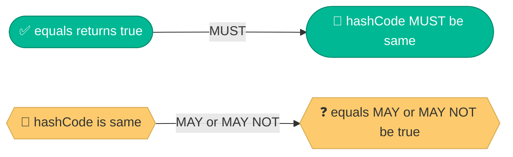
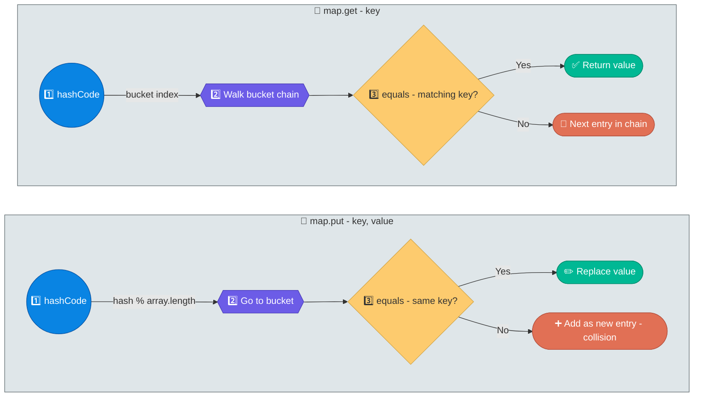

# equals() and hashCode() in Java

Getting `equals()` and `hashCode()` right is critical for **HashMap, HashSet, and any hash-based collection**. Getting them wrong causes silent bugs that are extremely hard to debug.

---

## The Contract

| Rule | Meaning |
|---|---|
| If `a.equals(b)` is `true` | `a.hashCode() == b.hashCode()` MUST be true |
| If `a.hashCode() == b.hashCode()` | `a.equals(b)` may or may not be true (hash collisions exist) |
| Override both or neither | Breaking this contract breaks HashMap/HashSet |



---

## Why Both Must Be Overridden Together

### What happens if you override only `equals()`

```java
public class Employee {
    private int id;
    private String name;

    @Override
    public boolean equals(Object o) {
        if (this == o) return true;
        if (!(o instanceof Employee e)) return false;
        return id == e.id && Objects.equals(name, e.name);
    }
    // hashCode() NOT overridden — uses default (memory address)
}

Employee e1 = new Employee(1, "Vamsi");
Employee e2 = new Employee(1, "Vamsi");

e1.equals(e2);  // true — same id and name

Set<Employee> set = new HashSet<>();
set.add(e1);
set.contains(e2);  // FALSE! — different hashCode (different objects in memory)
set.size();         // 1, but adding e2 would make it 2 (duplicate!)
```

**The bug**: `e1` and `e2` are "equal" but go into **different buckets** because their hashCodes differ. HashSet thinks they're different objects.

---

## Correct Implementation

```java
public class Employee {
    private int id;
    private String name;
    private String department;

    @Override
    public boolean equals(Object o) {
        if (this == o) return true;                          // same reference
        if (o == null || getClass() != o.getClass()) return false; // null/type check
        Employee e = (Employee) o;
        return id == e.id
            && Objects.equals(name, e.name)
            && Objects.equals(department, e.department);
    }

    @Override
    public int hashCode() {
        return Objects.hash(id, name, department);  // uses same fields as equals
    }
}
```

### Rules for a correct `equals()`

| Property | Meaning |
|---|---|
| **Reflexive** | `x.equals(x)` is always `true` |
| **Symmetric** | If `x.equals(y)` then `y.equals(x)` |
| **Transitive** | If `x.equals(y)` and `y.equals(z)` then `x.equals(z)` |
| **Consistent** | Repeated calls return the same result (if objects don't change) |
| **Null** | `x.equals(null)` is always `false` |

---

## How HashMap Uses Both



If `hashCode()` is wrong, the key lands in the **wrong bucket** and `get()` will never find it — even though `equals()` would return true.

---

## `instanceof` vs `getClass()` in equals

```java
// Using instanceof — allows subclass equality
@Override
public boolean equals(Object o) {
    if (!(o instanceof Employee e)) return false;
    return id == e.id;
}
// new Manager(1) equals new Employee(1) → true

// Using getClass() — strict type equality
@Override
public boolean equals(Object o) {
    if (o == null || getClass() != o.getClass()) return false;
    Employee e = (Employee) o;
    return id == e.id;
}
// new Manager(1) equals new Employee(1) → false
```

**Recommendation**: Use `getClass()` for most cases. Use `instanceof` only if you explicitly want subclass equality (and understand the symmetry implications).

---

## With Java Records (Java 17+)

Records auto-generate `equals()` and `hashCode()` using ALL fields.

```java
public record Employee(int id, String name, String department) {}

Employee e1 = new Employee(1, "Vamsi", "Eng");
Employee e2 = new Employee(1, "Vamsi", "Eng");

e1.equals(e2);    // true
e1.hashCode() == e2.hashCode();  // true
```

No manual implementation needed.

---

## Using with Lombok

```java
@EqualsAndHashCode
public class Employee {
    private int id;
    private String name;
    private String department;
}

// Or exclude specific fields
@EqualsAndHashCode(exclude = {"department"})
public class Employee {
    private int id;
    private String name;
    private String department;
}
```

---

## Common Pitfalls

| Pitfall | Problem |
|---|---|
| Override `equals()` but not `hashCode()` | HashMap/HashSet broken |
| Use mutable fields in `hashCode()` | Object moves to wrong bucket if fields change after insertion |
| `equals()` with wrong parameter type | `equals(Employee e)` instead of `equals(Object o)` — overloads, doesn't override |
| Include irrelevant fields | `equals()` uses `id` but `hashCode()` doesn't — contract broken |

---

## Interview Questions

??? question "1. What happens if two unequal objects have the same hashCode?"
    This is called a **hash collision**. They end up in the same bucket. HashMap handles this by chaining (linked list, or red-black tree for 8+ entries). The `equals()` method distinguishes them within the bucket. Collisions reduce performance (O(1) → O(n) or O(log n)) but don't break correctness.

??? question "2. Can you use a mutable object as a HashMap key?"
    You **can**, but you **shouldn't**. If the object's fields change after insertion, its `hashCode()` changes, and it ends up in the wrong bucket. `get()` will never find it — it's a silent memory leak. Always use immutable objects (String, Integer, records) as HashMap keys.

??? question "3. What is the best hashCode implementation for performance?"
    Use `Objects.hash(field1, field2, ...)` for simplicity. For performance-critical code, manually compute: `31 * hash + field.hashCode()` (31 is prime, and `31 * i` can be optimized to `(i << 5) - i` by the JVM). For a single int field, just return the field itself.

??? question "4. Why does String make a good HashMap key?"
    String is **immutable** (hashCode never changes), caches its `hashCode()` (computed once), and has a well-distributed hash function. These properties make it the ideal HashMap key. That's also why Java's `String.hashCode()` is the most called method in the JVM.
