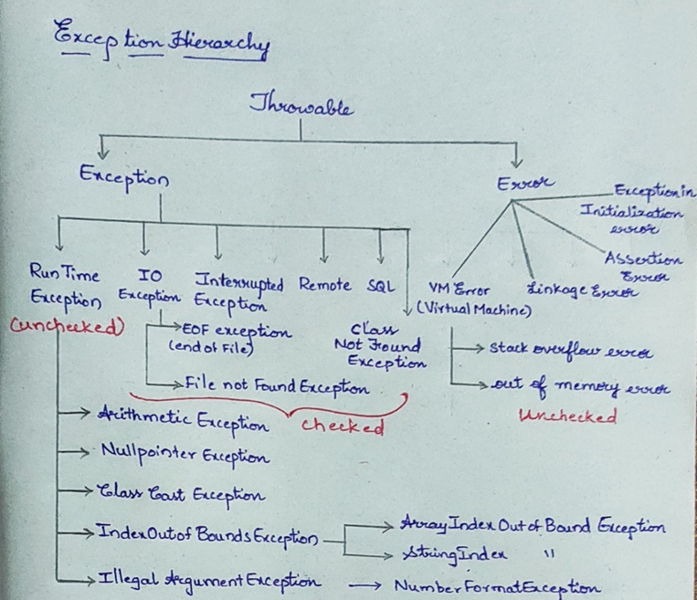

## Exception

- An Unwanted , unexpected event that disturbs the normal flow of the program is called Exception.
- The main purpose of Exception Handling is graceful termination of the program.

## Difference Between Error and Exception

- In most of the cases exceptions are caused by our program and these are recoverable

Example FileNotFoundException

- Most of the time errors are not caused by a program these are due to lack of system resources. Errors are not recoverable

Example: Out of memory error

## Difference Between Checked and Unchecked Exceptions

Checked Exceptions: Except for RuntimeException, Error, and their subclasses, all other exceptions are called checked exceptions. It means that it is compulsary for the user to check i.e, to handle an exception. If a method throws a checked exception then the method must take the responsibilty to deal with it. The method must either catch the exception and take appropriate action, or pass the execution on to its caller.
Examples : IOException, ClassNotFoundException, InterruptedException, CloneNotSupportException

Unchecked Exception: Exception defined by Error and RuntimeException classes and their subclasses are known as unchecked exceptions. It means that it is not mandatory for a method to deal with such kinds of exceptions, The compiler doesn’t check if a method handles or throws this exception. Such exceptions are either irrecoverable and the program should not attempt to deal with them or they cannot be treatedas exceptions.
Examples- NullPointerException, ArrayIndexOutofBoundsException,
ArithematicException, NumberFormatException etc

- Every Exception occurs at Run Time only.
- The Exceptions which are checked by compiler for smooth execution of program at Runtime are known as Checked Exceptions. These exceptions must be caught.
- We will get compile time error if we don’t handle these exceptions.
- Ex: FileNotFoundException, Interrupted Exception, SQL Exception
- The exceptions which are not checked by compiler are known as unchecked exceptions.
- Compiler does not produce any error whether you handle or not during compile time.
- Ex: Null Pointer Exception, Index Out of Bound Exception , Arithmetic Exception

| Checked Exceptions                                                                                          | Unchecked Exceptions                                                                                                                          |
|-------------------------------------------------------------------------------------------------------------|-----------------------------------------------------------------------------------------------------------------------------------------------|
| They are known at compile time.                                                                             | They are known at run time.                                                                                                                   |
| They are checked at compile time.                                                                           | They are not checked at compile time. Because they occur only at run time.                                                                    |
| These are compile time exceptions.                                                                          | These are run time exceptions.                                                                                                                |
| If these exceptions are not handled properly in the application, they give compile time error.              | If these exceptions are not handled properly, they don’t give compile time error. But application will be terminated prematurely at run time. |
| All sub classes of java.lang.Exception Class except sub classes of RunTimeException are checked exceptions. | All sub classes of RunTimeException and sub classes of java.lang.Error are unchecked exceptions.                                              |

## Difference Between ClassNotFoundException and NoClassDefFoundError

| Class Not Found Exception | NoClassDefFound Error |
| --- | --- |
| It occurs when JVM tries to load a class which is not available in the class path | It occurs when class was present during the compile time and not present during run time. |
| Checked Exception | Linkage Error. |

## Exception Hierarchy

Purpose and Speciality of Finally Block in Exception:

     try {

     open db connection

     Read Data

     }

     catch (Exception e){

     handling code

     }

    finally {

    close db connection ( i.e clean up code)

    }

-- The main objective of finally block is to maintain clean up code.

-- This block is executed always irrespective of whether exception is raised or not.

 
      try{

      int a=10/00;

      System.out.println (a);

      }

      catch (Exception e){

      System.out.println (e);

      }

      catch (ArithmeticException e1){

      System.out.println (e1);

      }

ans: Compilation Fails because Arithmetic Exception has already been caught by Exception. So ,First Child Exception should be declared.

## Try with Resources

Database connections or file resources or network related resources are actually closed in finally block .So when we open any resources that must be closed in finally block.

    try(BufferedReader br1 = new BufferedReader (new FileReader ("C:\\Users\\karukris\\Documents\\file.txt"**)))
    {
    
     System.***out***.println ("Try with resources");
    
     }

## Throw vs Throws

| throw                                                   | throws                                          |
|---------------------------------------------------------|-------------------------------------------------|
| throw keyword is used to explicitly throw an exception. | throws keyword is used to declare an exception. |
| throw is used with in method.                           | Throws is used with the method signature.       |
| throw is followed by instance.                          | Throws is followed by a class.                  |
| We can’t declare multiple exceptions.                   | We can declare multiple exceptions.             |
| Checked exceptions can’t be propagated using throw.     | Both checked and unchecked exceptions.          |
| Void m(){                                               |                                                 |

throw new ArithmeticException(“arithmetic exception”);
} | void m() throws ArithmeticException{
} |

## Final, Finally and Finalize

final**:**

- classes --- when a class a declared with final , the class cannot be extended.
- methods --- method cannot be overridden when it is declared as final.
- variables --- cannot be reassigned.

finally:

- It is a block always associated with try and catch
- finally block is mainly for cleanup code . i.e to close file and db connections
- finally block is always executed .

finalize()

In order to destroy the objects in the code , Garbage Collector will call the finalize() method.

Protected void finalize() throws Throwable

## Exceptions Methods

Following is the list of important methods available in the Throwable class.

| sr.no | Method                                     | Description                                                                                                                                                                                                        |
|-------|--------------------------------------------|--------------------------------------------------------------------------------------------------------------------------------------------------------------------------------------------------------------------|
| 1     | public String getMessage()                 | Returns a detailed message about the exception that has occurred. This message is initialized in the Throwable constructor.                                                                                        |
| 2     | public Throwable getCause()                | Returns the cause of the exception as represented by a Throwable object.                                                                                                                                           |
| 3     | public String toString()                   | Returns the name of the class concatenated with the result of getMessage().                                                                                                                                        |
| 4     | public void printStackTrace()              | Prints the result of toString() along with the stack trace to System.err, the error output stream.                                                                                                                 |
| 5     | public StackTraceElement[] getStackTrace() | Returns an array containing each element on the stack trace. The element at index 0 represents the top of the call stack, and the last element in the array represents the method at the bottom of the call stack. |
| 6     | public Throwable fillInStackTrace()        | Fills the stack trace of this Throwable object with the current stack trace, adding to any previous information in the stack trace.                                                                                |