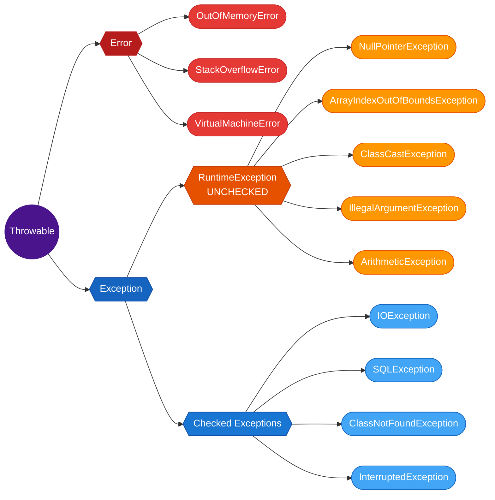
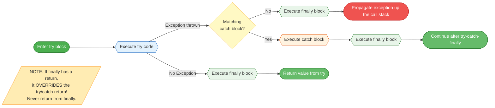

# Exception Handling in Java

Exceptions are events that **disrupt the normal flow** of a program. Proper exception handling is the difference between a service that crashes at 3 AM and one that degrades gracefully.

---

## Exception Hierarchy Diagram


```mermaid
flowchart LR
    T(("Throwable"))
    T --> E{{"Error"}}
    T --> EX{{"Exception"}}

    E --> OOM(["OutOfMemoryError"])
    E --> SOE(["StackOverflowError"])
    E --> VE(["VirtualMachineError"])

    EX --> RE{{"RuntimeException<br/>UNCHECKED"}}
    EX --> CE{{"Checked Exceptions"}}

    RE --> NPE(["NullPointerException"])
    RE --> AIOB(["ArrayIndexOutOfBoundsException"])
    RE --> CCE(["ClassCastException"])
    RE --> IAE(["IllegalArgumentException"])
    RE --> AE(["ArithmeticException"])

    CE --> IOE(["IOException"])
    CE --> SQLE(["SQLException"])
    CE --> CNFE(["ClassNotFoundException"])
    CE --> IE(["InterruptedException"])

    style T fill:#4a148c,stroke:#4a148c,color:#ffffff
    style E fill:#b71c1c,stroke:#b71c1c,color:#ffffff
    style OOM fill:#e53935,stroke:#c62828,color:#ffffff
    style SOE fill:#e53935,stroke:#c62828,color:#ffffff
    style VE fill:#e53935,stroke:#c62828,color:#ffffff
    style EX fill:#1565c0,stroke:#0d47a1,color:#ffffff
    style RE fill:#e65100,stroke:#bf360c,color:#ffffff
    style NPE fill:#ff9800,stroke:#e65100,color:#ffffff
    style AIOB fill:#ff9800,stroke:#e65100,color:#ffffff
    style CCE fill:#ff9800,stroke:#e65100,color:#ffffff
    style IAE fill:#ff9800,stroke:#e65100,color:#ffffff
    style AE fill:#ff9800,stroke:#e65100,color:#ffffff
    style CE fill:#1976d2,stroke:#0d47a1,color:#ffffff
    style IOE fill:#42a5f5,stroke:#1565c0,color:#ffffff
    style SQLE fill:#42a5f5,stroke:#1565c0,color:#ffffff
    style CNFE fill:#42a5f5,stroke:#1565c0,color:#ffffff
    style IE fill:#42a5f5,stroke:#1565c0,color:#ffffff
```

## Exception Flow — try/catch/finally Execution


```mermaid
flowchart LR
    START(["Enter try block"]) --> CODE{{"Execute try code"}}
    CODE -->|No Exception| FINALLY1{{"Execute finally block"}}
    CODE -->|Exception thrown| MATCH{"Matching<br/>catch block?"}

    MATCH -->|Yes| CATCH{{"Execute catch block"}}
    MATCH -->|No| FINALLY2{{"Execute finally block"}}
    FINALLY2 --> PROPAGATE(["Propagate exception up the call stack"])

    CATCH --> FINALLY3{{"Execute finally block"}}
    FINALLY1 --> RETURN1(["Return value from try"])
    FINALLY3 --> RETURN2(["Continue after try-catch-finally"])

    NOTE1[/"NOTE: If finally has a return,<br/>it OVERRIDES the try/catch return!<br/>Never return from finally."/]

    style START fill:#4caf50,stroke:#2e7d32,color:#ffffff
    style CODE fill:#e3f2fd,stroke:#1565c0
    style MATCH fill:#fff9c4,stroke:#f9a825
    style CATCH fill:#fff3e0,stroke:#e65100
    style FINALLY1 fill:#e8f5e9,stroke:#2e7d32
    style FINALLY2 fill:#e8f5e9,stroke:#2e7d32
    style FINALLY3 fill:#e8f5e9,stroke:#2e7d32
    style PROPAGATE fill:#ef5350,stroke:#c62828,color:#ffffff
    style RETURN1 fill:#66bb6a,stroke:#2e7d32,color:#ffffff
    style RETURN2 fill:#66bb6a,stroke:#2e7d32,color:#ffffff
    style NOTE1 fill:#ffecb3,stroke:#ff8f00
```

---

## Exception Hierarchy

```
                        Throwable
                            │
               ┌────────────┼────────────┐
               │                         │
            Error                    Exception
         (unrecoverable)                 │
               │                ┌────────┼────────┐
        StackOverflowError      │                 │
        OutOfMemoryError   RuntimeException   Checked Exceptions
                                │                 │
                         NullPointerException  IOException
                         ArrayIndexOutOfBounds ClassNotFoundException
                         ClassCastException    SQLException
                         ArithmeticException   InterruptedException
                         IllegalArgumentException
```

---

## Checked vs Unchecked Exceptions

| Feature | Checked | Unchecked (Runtime) |
|---|---|---|
| Checked at | **Compile time** | **Runtime** |
| Must handle? | Yes (`try-catch` or `throws`) | No (optional) |
| Extends | `Exception` (not RuntimeException) | `RuntimeException` |
| Examples | `IOException`, `SQLException`, `ClassNotFoundException` | `NullPointerException`, `ArrayIndexOutOfBoundsException` |
| Caused by | External factors (file not found, network down) | Programming bugs (null access, bad index) |
| Best practice | Handle or propagate meaningfully | Fix the code, don't just catch |

---

## try-catch-finally

```java
try {
    FileReader reader = new FileReader("data.txt");
    int data = reader.read();
} catch (FileNotFoundException e) {
    System.out.println("File not found: " + e.getMessage());
} catch (IOException e) {
    System.out.println("IO error: " + e.getMessage());
} finally {
    // ALWAYS executes (even if exception is thrown or return is called)
    System.out.println("Cleanup done");
}
```

### Multi-catch (Java 7+)

```java
try {
    // risky code
} catch (IOException | SQLException e) {
    log.error("Data access error", e);
}
```

### finally Execution Rules

| Scenario | Does `finally` run? |
|---|---|
| No exception | Yes |
| Exception caught | Yes |
| Exception not caught | Yes |
| `return` in try/catch | Yes (before the return completes) |
| `System.exit()` called | **No** |
| JVM crashes | **No** |

---

## try-with-resources (Java 7+)

Automatically closes resources that implement `AutoCloseable`. No need for `finally`.

```java
// BEFORE — verbose, error-prone
BufferedReader reader = null;
try {
    reader = new BufferedReader(new FileReader("data.txt"));
    String line = reader.readLine();
} catch (IOException e) {
    log.error("Read failed", e);
} finally {
    if (reader != null) {
        try { reader.close(); } catch (IOException e) { /* swallowed */ }
    }
}

// AFTER — clean, safe
try (BufferedReader reader = new BufferedReader(new FileReader("data.txt"))) {
    String line = reader.readLine();
} catch (IOException e) {
    log.error("Read failed", e);
}
// reader is automatically closed here
```

### Multiple resources

```java
try (Connection conn = dataSource.getConnection();
     PreparedStatement ps = conn.prepareStatement(sql);
     ResultSet rs = ps.executeQuery()) {
    while (rs.next()) {
        // process results
    }
}
// all three are closed in reverse order: rs → ps → conn
```

---

## throw vs throws

| Keyword | Purpose | Where used |
|---|---|---|
| `throw` | Actually throws an exception object | Inside method body |
| `throws` | Declares that a method might throw exceptions | Method signature |

```java
// throws — declaration
public void readFile(String path) throws IOException {
    // throw — action
    if (path == null) {
        throw new IllegalArgumentException("Path cannot be null");
    }
    Files.readString(Path.of(path));
}
```

---

## Custom Exceptions

Create custom exceptions for domain-specific error handling.

```java
// Checked exception
public class OrderNotFoundException extends Exception {
    private final String orderId;

    public OrderNotFoundException(String orderId) {
        super("Order not found: " + orderId);
        this.orderId = orderId;
    }

    public String getOrderId() { return orderId; }
}

// Unchecked exception
public class InsufficientBalanceException extends RuntimeException {
    private final double balance;
    private final double required;

    public InsufficientBalanceException(double balance, double required) {
        super(String.format("Insufficient balance: %.2f, required: %.2f", balance, required));
        this.balance = balance;
        this.required = required;
    }
}
```

### When to use checked vs unchecked for custom exceptions

| Use checked when | Use unchecked when |
|---|---|
| Caller **can** and **should** recover | Error is a **programming bug** |
| External system failure (DB down, API timeout) | Invalid argument, null pointer, bad state |
| You want the compiler to force handling | Recovery is not realistic |

---

## Exception Handling Best Practices

### 1. Never catch `Exception` or `Throwable` (too broad)

```java
// BAD — catches everything including NullPointerException
try {
    processOrder(order);
} catch (Exception e) {
    log.error("Something went wrong", e);
}

// GOOD — catch specific exceptions
try {
    processOrder(order);
} catch (OrderNotFoundException e) {
    return ResponseEntity.notFound().build();
} catch (PaymentException e) {
    return ResponseEntity.status(502).body("Payment failed");
}
```

### 2. Never swallow exceptions

```java
// BAD — exception is silently ignored
try {
    connection.close();
} catch (SQLException e) {
    // empty catch block — you'll never know this failed
}

// GOOD — at minimum, log it
try {
    connection.close();
} catch (SQLException e) {
    log.warn("Failed to close connection", e);
}
```

### 3. Throw early, catch late

```java
// THROW EARLY — validate at the entry point
public void transfer(Account from, Account to, double amount) {
    if (from == null || to == null) throw new IllegalArgumentException("Accounts required");
    if (amount <= 0) throw new IllegalArgumentException("Amount must be positive");
    // ... proceed with valid inputs
}

// CATCH LATE — handle at the right abstraction level (e.g., controller)
@PostMapping("/transfer")
public ResponseEntity<?> transfer(@RequestBody TransferRequest req) {
    try {
        accountService.transfer(req.getFrom(), req.getTo(), req.getAmount());
        return ResponseEntity.ok().build();
    } catch (InsufficientBalanceException e) {
        return ResponseEntity.badRequest().body(e.getMessage());
    }
}
```

### 4. Use exceptions for exceptional conditions, not control flow

```java
// BAD — using exceptions as control flow
try {
    int value = Integer.parseInt(input);
} catch (NumberFormatException e) {
    value = 0;  // using exception to handle "not a number"
}

// GOOD — check first
if (input.matches("-?\\d+")) {
    int value = Integer.parseInt(input);
} else {
    value = 0;
}
```

---

## Exception Handling in Spring Boot

```java
// Global exception handler
@RestControllerAdvice
public class GlobalExceptionHandler {

    @ExceptionHandler(OrderNotFoundException.class)
    public ResponseEntity<ErrorResponse> handleNotFound(OrderNotFoundException e) {
        return ResponseEntity
            .status(HttpStatus.NOT_FOUND)
            .body(new ErrorResponse("NOT_FOUND", e.getMessage()));
    }

    @ExceptionHandler(IllegalArgumentException.class)
    public ResponseEntity<ErrorResponse> handleBadRequest(IllegalArgumentException e) {
        return ResponseEntity
            .status(HttpStatus.BAD_REQUEST)
            .body(new ErrorResponse("BAD_REQUEST", e.getMessage()));
    }

    @ExceptionHandler(Exception.class)
    public ResponseEntity<ErrorResponse> handleGeneric(Exception e) {
        log.error("Unexpected error", e);
        return ResponseEntity
            .status(HttpStatus.INTERNAL_SERVER_ERROR)
            .body(new ErrorResponse("INTERNAL_ERROR", "Something went wrong"));
    }
}

record ErrorResponse(String code, String message) {}
```

---

## Interview Questions

??? question "1. What is the difference between `final`, `finally`, and `finalize()`?"
    `final` — keyword: variables can't be reassigned, methods can't be overridden, classes can't be extended. `finally` — block: always executes after try/catch for cleanup. `finalize()` — method called by GC before collecting an object (deprecated in Java 9, removed in Java 18 — use `try-with-resources` or `Cleaner` instead).

??? question "2. Can a finally block override a return value?"
    **Yes.** If both `try` and `finally` have `return` statements, the `finally` return wins. But this is terrible practice — never return from `finally`.
    ```java
    int test() {
        try { return 1; }
        finally { return 2; }  // returns 2 — never do this
    }
    ```

??? question "3. What happens if an exception is thrown in a catch block?"
    The original exception is lost unless you chain it. Use `throw new CustomException("msg", originalException)` to preserve the cause chain. If a `finally` block also throws, the catch exception is suppressed (available via `getSuppressed()` in Java 7+).

??? question "4. Why should you prefer unchecked exceptions for programming errors?"
    Checked exceptions force every caller up the stack to either handle or declare them, cluttering code with `try-catch` or `throws` for errors that can't be meaningfully recovered from (like `NullPointerException`). Unchecked exceptions propagate naturally and should be fixed by fixing the code, not by catching them.

??? question "5. How do you handle exceptions in a microservices architecture?"
    Use `@RestControllerAdvice` for centralized exception handling. Map domain exceptions to HTTP status codes (404 for not found, 400 for validation errors, 502 for downstream failures). Log with correlation IDs for distributed tracing. For async communication (Kafka), use dead-letter queues for unprocessable messages. Never expose internal stack traces to clients.
