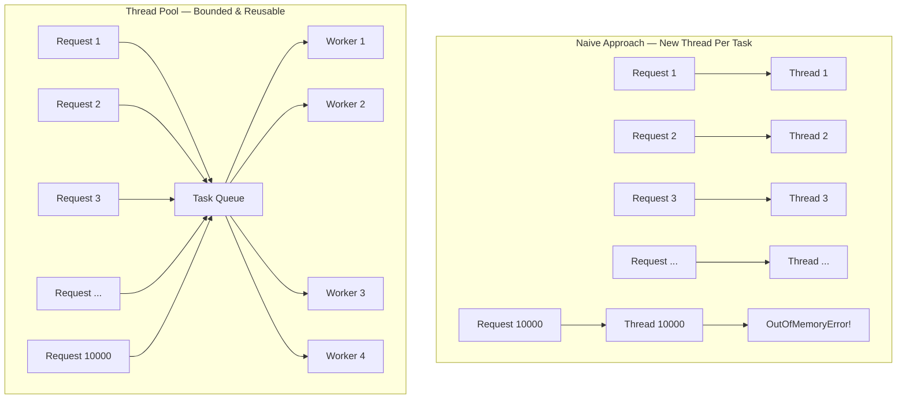
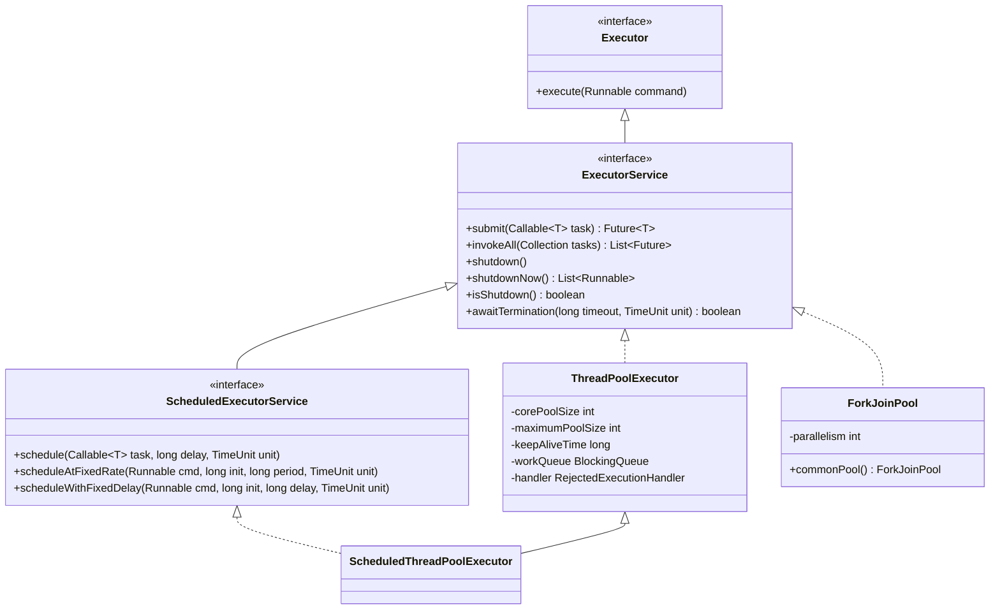
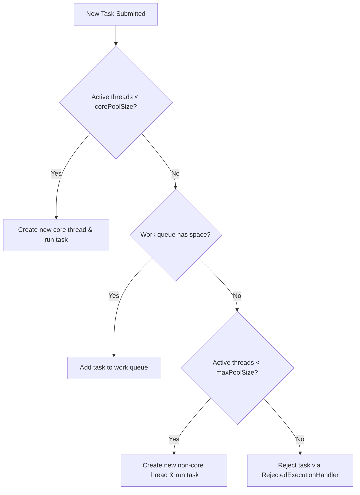
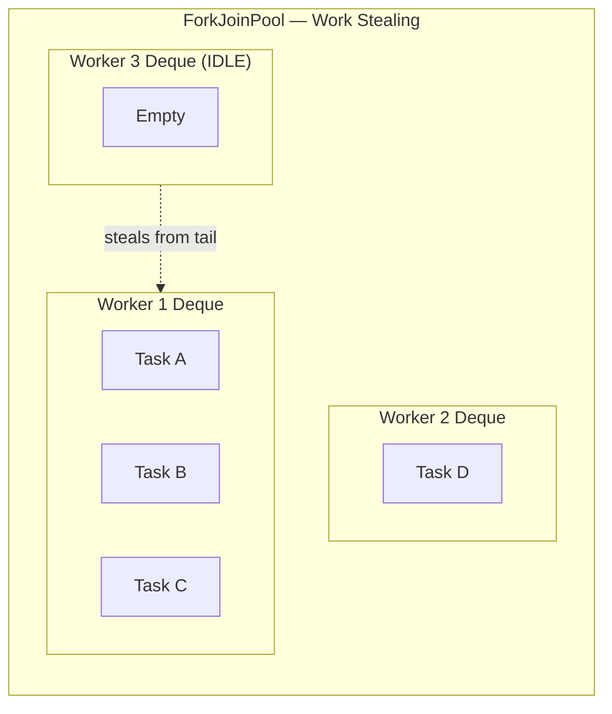
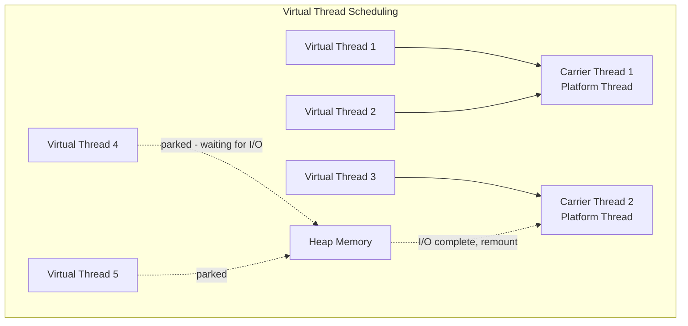

# Thread Pools & Executors

!!! tip "Why This Matters in Interviews"
    The Executor framework is a **top-3 Java concurrency topic** in FAANG interviews. Interviewers expect you to explain thread pool internals, choose the right pool type for a given scenario, reason about rejection policies under load, and discuss how virtual threads (Java 21) change the concurrency model. Mastering this separates mid-level from senior engineers.

---

## Why Thread Pools?

Creating threads manually for every task is the naive approach — and it breaks down at scale.

**Problems with raw thread creation:**

- Each thread consumes ~1MB of stack memory
- OS thread creation is expensive (kernel call, scheduling overhead)
- No upper bound — can lead to `OutOfMemoryError`
- No task queuing, rejection handling, or lifecycle management
- Context switching overhead grows linearly with thread count



**Thread pools solve this by:**

- Reusing a fixed set of threads across many tasks
- Queuing excess tasks instead of spawning new threads
- Providing lifecycle management (graceful shutdown)
- Enforcing rejection policies when the system is overwhelmed

---

## Executor Framework Hierarchy



| Interface | Key Responsibility |
|---|---|
| `Executor` | Decouples task submission from execution mechanics |
| `ExecutorService` | Adds lifecycle management + `Future`-based submission |
| `ScheduledExecutorService` | Adds delayed and periodic task scheduling |

---

## ThreadPoolExecutor Internals

The `ThreadPoolExecutor` is the workhorse of the framework. Understanding its parameters is essential.

```java
public ThreadPoolExecutor(
    int corePoolSize,        // Threads kept alive even when idle
    int maximumPoolSize,     // Upper limit on thread count
    long keepAliveTime,      // Idle time before non-core threads die
    TimeUnit unit,           // Unit for keepAliveTime
    BlockingQueue<Runnable> workQueue,  // Queue for pending tasks
    ThreadFactory threadFactory,        // Custom thread creation
    RejectedExecutionHandler handler    // What to do when full
)
```

### Parameter Deep Dive

| Parameter | Description | Default Behavior |
|---|---|---|
| `corePoolSize` | Min threads always alive in the pool | Threads are created on demand up to this size |
| `maximumPoolSize` | Max threads that can exist | Only matters when queue is full |
| `keepAliveTime` | How long idle non-core threads wait before termination | 60 seconds is common |
| `workQueue` | Holds tasks before a thread picks them up | Unbounded = max pool size is irrelevant |
| `handler` | Rejection policy when queue + max threads are full | `AbortPolicy` (throws exception) |

### Task Flow Through the Pool



!!! warning "Critical Insight"
    The pool does NOT create threads up to `maxPoolSize` first and then queue. It fills the **queue first**, and only creates non-core threads when the **queue is full**. This surprises many candidates in interviews.

---

## Types of Thread Pools

### 1. FixedThreadPool

```java
ExecutorService pool = Executors.newFixedThreadPool(10);
```

**Internals:** `corePoolSize = maxPoolSize = n`, unbounded `LinkedBlockingQueue`

```java
// Equivalent to:
new ThreadPoolExecutor(n, n, 0L, TimeUnit.MILLISECONDS,
    new LinkedBlockingQueue<Runnable>());
```

**When to use:** CPU-bound tasks where you know the optimal thread count (e.g., number of cores).

**Pitfall:** Unbounded queue means tasks pile up in memory during load spikes — can cause OOM without any rejection happening.

---

### 2. CachedThreadPool

```java
ExecutorService pool = Executors.newCachedThreadPool();
```

**Internals:** `corePoolSize = 0`, `maxPoolSize = Integer.MAX_VALUE`, `SynchronousQueue`

```java
// Equivalent to:
new ThreadPoolExecutor(0, Integer.MAX_VALUE, 60L, TimeUnit.SECONDS,
    new SynchronousQueue<Runnable>());
```

**When to use:** Many short-lived tasks (e.g., handling quick I/O operations). Threads are recycled after 60s idle.

**Pitfall:** No upper bound on threads — under sustained load, can create thousands of threads and crash the JVM.

---

### 3. SingleThreadExecutor

```java
ExecutorService pool = Executors.newSingleThreadExecutor();
```

**Internals:** `corePoolSize = maxPoolSize = 1`, unbounded `LinkedBlockingQueue`

**When to use:** Guaranteeing sequential execution — log writing, event ordering, single-writer pattern.

**Pitfall:** Single point of failure — if the thread dies due to an uncaught exception, a new one is created but task context is lost.

---

### 4. ScheduledThreadPool

```java
ScheduledExecutorService pool = Executors.newScheduledThreadPool(4);

// Run after 5 second delay
pool.schedule(() -> cleanupExpiredSessions(), 5, TimeUnit.SECONDS);

// Run every 10 seconds (fixed rate — counts from start of each run)
pool.scheduleAtFixedRate(() -> emitMetrics(), 0, 10, TimeUnit.SECONDS);

// Run 10 seconds after previous run completes (fixed delay)
pool.scheduleWithFixedDelay(() -> pollQueue(), 0, 10, TimeUnit.SECONDS);
```

**When to use:** Periodic tasks — heartbeats, cache refresh, metrics emission, retry scheduling.

**Pitfall:** If a scheduled task throws an exception, subsequent executions are **silently cancelled**. Always wrap in try-catch.

```java
pool.scheduleAtFixedRate(() -> {
    try {
        emitMetrics();
    } catch (Exception e) {
        logger.error("Metrics emission failed", e);
        // task continues to be scheduled
    }
}, 0, 10, TimeUnit.SECONDS);
```

---

### 5. WorkStealingPool (ForkJoinPool)

```java
ExecutorService pool = Executors.newWorkStealingPool(); // default: availableProcessors()
ExecutorService pool = Executors.newWorkStealingPool(8);
```

**Internals:** Creates a `ForkJoinPool` with the given parallelism level. Each thread has its own deque — idle threads steal tasks from busy threads' deques.

**When to use:** Divide-and-conquer algorithms, parallel computation, tasks that spawn subtasks.

**Pitfall:** Not suitable for blocking I/O — threads that block reduce effective parallelism for the entire pool.

---

## ForkJoinPool — Work Stealing in Depth

The `ForkJoinPool` is fundamentally different from `ThreadPoolExecutor`. It uses **work-stealing** where each worker thread has a local double-ended queue (deque).



### RecursiveTask vs RecursiveAction

| Type | Returns Value? | Use Case |
|---|---|---|
| `RecursiveTask<V>` | Yes | Sum of array, merge sort result |
| `RecursiveAction` | No | In-place sort, parallel file processing |

```java
public class ParallelSum extends RecursiveTask<Long> {
    private final long[] array;
    private final int start, end;
    private static final int THRESHOLD = 10_000;

    public ParallelSum(long[] array, int start, int end) {
        this.array = array;
        this.start = start;
        this.end = end;
    }

    @Override
    protected Long compute() {
        if (end - start <= THRESHOLD) {
            // Base case — compute directly
            long sum = 0;
            for (int i = start; i < end; i++) sum += array[i];
            return sum;
        }
        // Fork: split into two subtasks
        int mid = (start + end) / 2;
        ParallelSum left = new ParallelSum(array, start, mid);
        ParallelSum right = new ParallelSum(array, mid, end);
        left.fork();  // Submit left to the pool
        long rightResult = right.compute();  // Compute right in current thread
        long leftResult = left.join();  // Wait for left's result
        return leftResult + rightResult;
    }
}

// Usage
ForkJoinPool pool = new ForkJoinPool();
long result = pool.invoke(new ParallelSum(data, 0, data.length));
```

### Parallel Streams Connection

Java's parallel streams use the **common ForkJoinPool** (`ForkJoinPool.commonPool()`):

```java
// This runs on ForkJoinPool.commonPool()
long sum = numbers.parallelStream()
    .filter(n -> n > 0)
    .mapToLong(Long::valueOf)
    .sum();
```

!!! danger "Shared Pool Problem"
    The common pool is shared across the entire JVM. A slow or blocking operation in one parallel stream starves ALL other parallel streams. Use a custom ForkJoinPool to isolate:

    ```java
    ForkJoinPool customPool = new ForkJoinPool(4);
    long sum = customPool.submit(() ->
        numbers.parallelStream().mapToLong(Long::valueOf).sum()
    ).get();
    ```

---

## Rejection Policies

When both the queue is full AND max threads are exhausted, the `RejectedExecutionHandler` kicks in.

| Policy | Behavior | Use Case |
|---|---|---|
| `AbortPolicy` | Throws `RejectedExecutionException` | Default — fail fast, caller handles it |
| `CallerRunsPolicy` | Runs the task in the **submitting thread** | Back-pressure — slows down the producer |
| `DiscardPolicy` | Silently drops the task | Fire-and-forget metrics (acceptable loss) |
| `DiscardOldestPolicy` | Drops the oldest queued task, retries new one | Latest data matters more than old (cache refresh) |

```java
ThreadPoolExecutor executor = new ThreadPoolExecutor(
    4, 8, 60, TimeUnit.SECONDS,
    new ArrayBlockingQueue<>(100),
    new ThreadPoolExecutor.CallerRunsPolicy()  // Back-pressure
);
```

!!! tip "Interview Favorite"
    `CallerRunsPolicy` is the go-to for back-pressure. When the pool is overwhelmed, the submitting thread (e.g., the HTTP request handler thread) runs the task itself — this naturally slows down intake without losing tasks.

---

## Virtual Threads (Java 21)

Virtual threads are **lightweight threads managed by the JVM** rather than the OS. They fundamentally change how we think about thread pools.

### Platform Threads vs Virtual Threads

| Aspect | Platform Thread | Virtual Thread |
|---|---|---|
| Managed by | OS kernel | JVM scheduler |
| Memory per thread | ~1MB stack | ~few KB (grows as needed) |
| Max count | Thousands (OS limit) | Millions |
| Blocking cost | Expensive (wastes OS thread) | Cheap (JVM unmounts from carrier) |
| Use case | CPU-bound work | I/O-bound work |

### Creating Virtual Threads

```java
// One-off virtual thread
Thread.startVirtualThread(() -> handleRequest(request));

// Virtual thread executor — one thread per task, no pooling needed
try (var executor = Executors.newVirtualThreadPerTaskExecutor()) {
    for (Request req : requests) {
        executor.submit(() -> handleRequest(req));
    }
}  // auto-shutdown via AutoCloseable
```

### How They Work



### What Changes with Virtual Threads

- **No need for thread pools for I/O-bound work** — just create a virtual thread per task
- **Thread-per-request model is viable again** — no memory penalty
- **`synchronized` blocks pin the carrier** — prefer `ReentrantLock` with virtual threads
- **Still need platform thread pools for CPU-bound work** — virtual threads don't help with CPU saturation

```java
// Old way: shared thread pool for I/O tasks
ExecutorService pool = Executors.newFixedThreadPool(100);
List<Future<String>> futures = urls.stream()
    .map(url -> pool.submit(() -> httpGet(url)))
    .toList();

// New way: virtual thread per task — simpler, scales better
try (var executor = Executors.newVirtualThreadPerTaskExecutor()) {
    List<Future<String>> futures = urls.stream()
        .map(url -> executor.submit(() -> httpGet(url)))
        .toList();
}
```

---

## Best Practices

### Thread Pool Sizing Formula

**CPU-bound tasks:**
```
optimalThreads = numberOfCores + 1
```

**I/O-bound tasks:**
```
optimalThreads = numberOfCores * (1 + waitTime / computeTime)
```

Example: 8 cores, tasks spend 80% waiting on I/O:
```
optimalThreads = 8 * (1 + 80/20) = 8 * 5 = 40 threads
```

### Graceful Shutdown Pattern

```java
public void shutdownPool(ExecutorService pool) {
    pool.shutdown();  // Stop accepting new tasks
    try {
        // Wait for existing tasks to finish
        if (!pool.awaitTermination(30, TimeUnit.SECONDS)) {
            pool.shutdownNow();  // Force interrupt running tasks
            if (!pool.awaitTermination(10, TimeUnit.SECONDS)) {
                logger.error("Pool did not terminate");
            }
        }
    } catch (InterruptedException e) {
        pool.shutdownNow();
        Thread.currentThread().interrupt();  // Preserve interrupt status
    }
}
```

### Naming Threads (for Debugging)

```java
ThreadFactory namedFactory = new ThreadFactory() {
    private final AtomicInteger count = new AtomicInteger(1);
    @Override
    public Thread newThread(Runnable r) {
        Thread t = new Thread(r, "order-processor-" + count.getAndIncrement());
        t.setDaemon(false);
        return t;
    }
};
ExecutorService pool = new ThreadPoolExecutor(4, 8, 60, TimeUnit.SECONDS,
    new ArrayBlockingQueue<>(100), namedFactory);
```

---

## Common Pitfalls

### 1. Unbounded Queues = Silent OOM

```java
// DANGEROUS — LinkedBlockingQueue is unbounded by default
ExecutorService pool = Executors.newFixedThreadPool(10);
// Under load, millions of tasks queue up → OOM

// SAFE — bounded queue with rejection policy
ThreadPoolExecutor pool = new ThreadPoolExecutor(10, 10, 0, TimeUnit.SECONDS,
    new ArrayBlockingQueue<>(1000),
    new ThreadPoolExecutor.CallerRunsPolicy());
```

### 2. Thread Leaks — Forgetting to Shutdown

```java
// BAD — pool lives forever, JVM never exits
ExecutorService pool = Executors.newFixedThreadPool(4);
pool.submit(task);
// forgot pool.shutdown() — non-daemon threads keep JVM alive

// GOOD — use try-with-resources (Java 19+)
try (ExecutorService pool = Executors.newFixedThreadPool(4)) {
    pool.submit(task);
}
```

### 3. Blocking I/O in ForkJoinPool

```java
// TERRIBLE — blocks a common pool thread, starves parallel streams
list.parallelStream().map(id -> {
    return httpClient.get("/api/users/" + id);  // BLOCKS carrier thread
}).toList();

// BETTER — use a dedicated I/O pool
ExecutorService ioPool = Executors.newFixedThreadPool(20);
List<Future<User>> futures = ids.stream()
    .map(id -> ioPool.submit(() -> httpClient.get("/api/users/" + id)))
    .toList();
```

### 4. Swallowed Exceptions in submit()

```java
// Exception is silently swallowed — never logged
pool.submit(() -> {
    throw new RuntimeException("oops");  // lost forever
});

// Fix: use Future.get() or execute() instead of submit()
Future<?> f = pool.submit(() -> riskyTask());
try {
    f.get();  // Exception surfaces here
} catch (ExecutionException e) {
    logger.error("Task failed", e.getCause());
}
```

### 5. Using synchronized with Virtual Threads

```java
// BAD — pins the carrier thread (defeats virtual thread purpose)
synchronized (lock) {
    connection.query(sql);  // blocks while pinned
}

// GOOD — ReentrantLock allows unmounting
private final ReentrantLock lock = new ReentrantLock();
lock.lock();
try {
    connection.query(sql);  // virtual thread can unmount
} finally {
    lock.unlock();
}
```

---

## Interview Questions

??? question "What happens when you submit a task to a ThreadPoolExecutor with corePoolSize=5, maxPoolSize=10, and a bounded queue of size 100?"
    1. If fewer than 5 threads are running, a **new core thread** is created to run the task.
    2. If 5 threads are running, the task goes to the **queue** (up to 100 tasks).
    3. If the queue is full (100 tasks pending), a **new non-core thread** is created (up to 10 total).
    4. If 10 threads are running AND the queue is full, the **rejection policy** is triggered.

    Key insight: The pool fills the queue BEFORE creating non-core threads. This is counterintuitive — many candidates assume threads scale up first.

??? question "Why should you avoid Executors.newFixedThreadPool() in production?"
    `Executors.newFixedThreadPool()` uses an **unbounded `LinkedBlockingQueue`**. Under sustained load, if tasks arrive faster than they complete, the queue grows indefinitely — consuming heap memory until `OutOfMemoryError`. In production, always use `ThreadPoolExecutor` directly with a **bounded `ArrayBlockingQueue`** and an appropriate rejection policy.

??? question "Explain CallerRunsPolicy and when you would use it."
    When the pool and queue are full, `CallerRunsPolicy` executes the rejected task in the **thread that called `submit()`** (e.g., the HTTP listener thread). This creates natural **back-pressure**: the submitting thread is busy running a task so it can't submit more, which slows intake and gives the pool time to drain. Use it when you cannot afford to lose tasks and want graceful degradation under load.

??? question "How do virtual threads differ from platform threads, and do they eliminate the need for thread pools?"
    Virtual threads are JVM-managed, use minimal memory (~KB vs ~MB), and can scale to millions. When a virtual thread blocks on I/O, the JVM **unmounts** it from the carrier (platform) thread, freeing the carrier for other work. They eliminate the need for pooling **I/O-bound tasks** — just create one virtual thread per task. However, for **CPU-bound work**, platform thread pools are still necessary because virtual threads don't increase CPU parallelism.

??? question "What is work-stealing in ForkJoinPool and why is it efficient?"
    Each worker thread maintains its own **deque** (double-ended queue). When a thread finishes its tasks, it **steals** tasks from the tail of another thread's deque. This minimizes contention (owner pops from head, stealers take from tail) and keeps all cores busy without centralized task distribution. It's ideal for recursive divide-and-conquer where tasks spawn subtasks unevenly.

??? question "Why shouldn't you do blocking I/O inside a parallel stream?"
    Parallel streams use the **common ForkJoinPool** (shared JVM-wide, default parallelism = number of cores). Blocking I/O in a parallel stream task **pins** a pool thread, reducing available parallelism for ALL parallel stream operations across the application. Use a dedicated I/O thread pool or virtual threads for blocking operations instead.

??? question "How would you size a thread pool for a service that makes database calls averaging 50ms with 2ms of CPU processing?"
    Using the formula: `threads = cores * (1 + waitTime / computeTime)`

    With 8 cores: `8 * (1 + 50/2) = 8 * 26 = 208 threads`

    This is I/O-heavy work, so the pool needs many threads since most are blocked waiting for DB responses. In practice, you'd validate this with load testing and adjust. With Java 21+, you'd simply use virtual threads instead and skip the math entirely.

??? question "What is the difference between shutdown() and shutdownNow()?"
    - `shutdown()`: Stops accepting new tasks but lets queued and running tasks **complete gracefully**. Returns immediately — use `awaitTermination()` to block until done.
    - `shutdownNow()`: Attempts to **interrupt** running tasks and returns the list of tasks that were waiting in the queue (never executed). There's no guarantee running tasks will stop — they must check `Thread.interrupted()`.

    Best practice: Call `shutdown()` first, wait with a timeout, then escalate to `shutdownNow()` if tasks don't finish.
