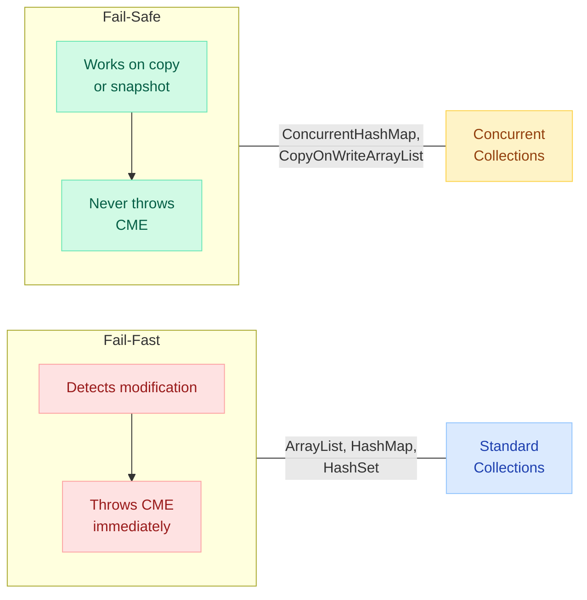
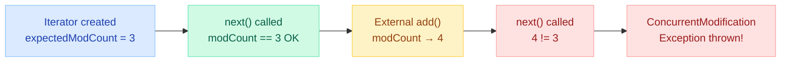
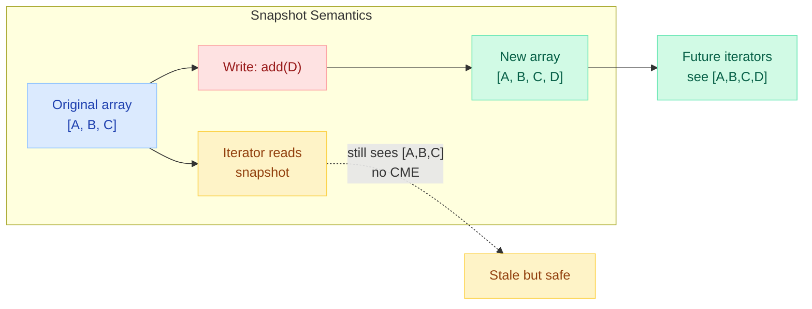
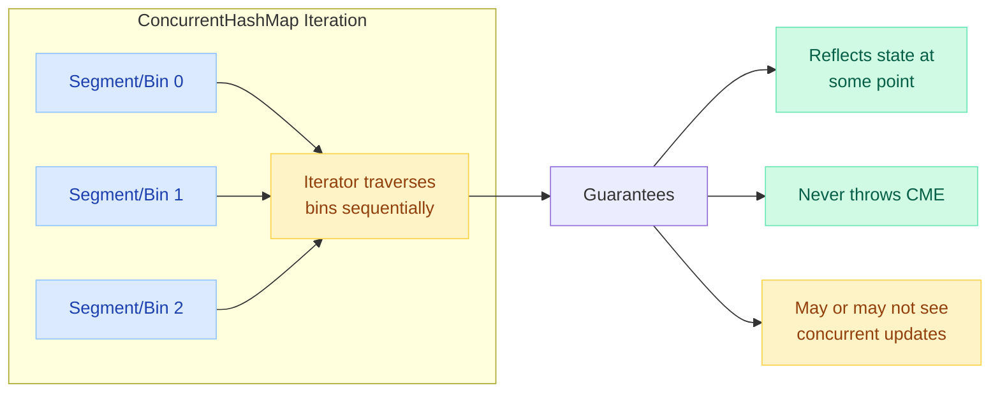
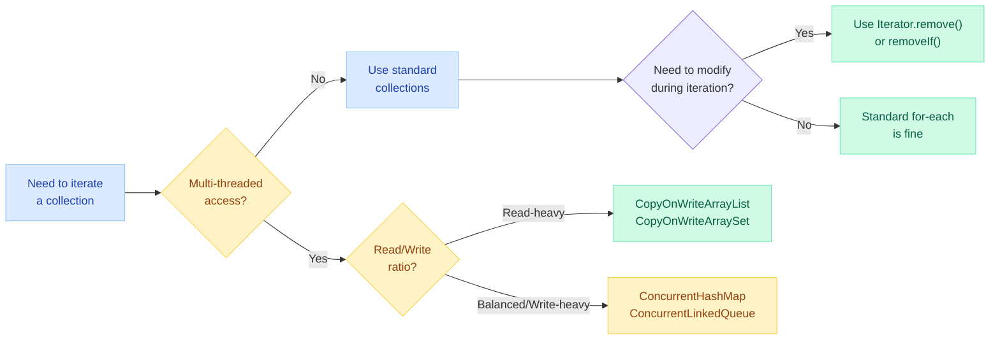

# Fail-Fast vs Fail-Safe Iterators

> **"The best time to catch a concurrent modification bug is at compile time. The second best time is immediately at runtime via ConcurrentModificationException — not silently corrupting your data."**

!!! danger "Real Incident: E-Commerce Order Service, 2021"
    A production Spring Boot service processing 50K orders/hour began throwing `ConcurrentModificationException` sporadically under load. Root cause: a shared `ArrayList<Order>` was iterated by the reporting thread while the ingestion thread called `.add()`. The fix took 5 minutes — switching to `CopyOnWriteArrayList` — but the outage lasted 3 hours because the exception was swallowed by a catch-all handler and orders were silently dropped.

---

## The 30-Second Explanation



---

## ConcurrentModificationException — Why It Happens

### The modCount Mechanism

Every non-concurrent collection in `java.util` maintains an internal counter called `modCount`. This counter increments on every **structural modification** (add, remove, clear — NOT `set()` on an existing index).

```java
// Inside ArrayList (simplified from OpenJDK source)
public class ArrayList<E> {
    transient int modCount = 0;  // tracks structural modifications

    public boolean add(E e) {
        modCount++;              // incremented on add
        // ... add element
        return true;
    }

    public E remove(int index) {
        modCount++;              // incremented on remove
        // ... remove and return element
    }

    public E set(int index, E element) {
        // modCount NOT incremented — not a structural modification
        E oldValue = elementData[index];
        elementData[index] = element;
        return oldValue;
    }
}
```

### How the Iterator Checks modCount

```java
// Inside ArrayList.Itr (the iterator)
private class Itr implements Iterator<E> {
    int expectedModCount = modCount;  // snapshot at creation time

    public E next() {
        checkForComodification();     // check BEFORE returning element
        // ... return next element
    }

    public void remove() {
        // ... remove element
        expectedModCount = modCount;  // re-sync after legal removal
    }

    final void checkForComodification() {
        if (modCount != expectedModCount)
            throw new ConcurrentModificationException();
    }
}
```



---

## Structural vs Element Modification

| Operation | Structural? | Triggers CME? |
|---|:---:|:---:|
| `list.add(element)` | Yes | Yes |
| `list.remove(index)` | Yes | Yes |
| `list.clear()` | Yes | Yes |
| `list.set(index, element)` | **No** | **No** |
| `map.put(newKey, value)` | Yes | Yes |
| `map.put(existingKey, newValue)` | **No** (replaces) | **No** |
| `map.remove(key)` | Yes | Yes |

!!! warning "Key Insight"
    `ArrayList.set()` and `HashMap.put()` on an existing key do NOT increment `modCount`. They are element replacements, not structural changes. This catches many interviewers off guard.

---

## Fail-Fast Iterators

### Which Collections?

All standard `java.util` collections: `ArrayList`, `LinkedList`, `HashMap`, `HashSet`, `LinkedHashMap`, `TreeMap`, `TreeSet`, `ArrayDeque`.

### Classic Bug: Modifying During Enhanced For-Loop

```java
// WRONG — throws ConcurrentModificationException
List<String> names = new ArrayList<>(List.of("Alice", "Bob", "Charlie"));
for (String name : names) {
    if (name.startsWith("B")) {
        names.remove(name);  // structural modification during iteration!
    }
}
```

### Why Even Single-Threaded Code Triggers CME

The enhanced for-loop compiles to an Iterator. Calling `names.remove()` modifies `modCount` but the iterator's `expectedModCount` is stale:

```java
// What the compiler actually generates:
Iterator<String> it = names.iterator();  // expectedModCount = modCount
while (it.hasNext()) {
    String name = it.next();             // checks modCount == expectedModCount
    if (name.startsWith("B")) {
        names.remove(name);              // modCount++ but expectedModCount unchanged
        // next call to it.next() → BOOM
    }
}
```

---

## Safe Ways to Remove During Iteration

### Method 1: Iterator.remove()

```java
// CORRECT — uses the iterator's own remove method
Iterator<String> it = names.iterator();
while (it.hasNext()) {
    String name = it.next();
    if (name.startsWith("B")) {
        it.remove();  // safe — updates expectedModCount internally
    }
}
```

### Method 2: Collection.removeIf() (Java 8+)

```java
// CORRECT — internally uses iterator with proper modCount handling
names.removeIf(name -> name.startsWith("B"));
```

### Method 3: Copy and Remove

```java
// CORRECT — iterate a copy, modify the original
List<String> toRemove = new ArrayList<>();
for (String name : names) {
    if (name.startsWith("B")) {
        toRemove.add(name);
    }
}
names.removeAll(toRemove);
```

### Method 4: ListIterator for Add/Set During Iteration

```java
// CORRECT — ListIterator supports add() and set() safely
ListIterator<String> lit = names.listIterator();
while (lit.hasNext()) {
    String name = lit.next();
    if (name.startsWith("B")) {
        lit.set("Brian");   // replace current element — safe
        lit.add("Bonus");   // insert after current — safe
    }
}
```

---

## Fail-Safe (Weakly Consistent) Iterators

### Strategy 1: Copy-on-Write (CopyOnWriteArrayList)



**How it works:**

- Every write (add, set, remove) creates a **new copy** of the underlying array
- Existing iterators continue reading the **old snapshot**
- No locking needed for reads — they always see a consistent (possibly stale) view

```java
CopyOnWriteArrayList<String> list = new CopyOnWriteArrayList<>();
list.add("A");
list.add("B");
list.add("C");

// Iterator takes a snapshot of the array at creation
Iterator<String> it = list.iterator();

list.add("D");  // creates a new internal array — iterator unaffected

while (it.hasNext()) {
    System.out.print(it.next() + " ");  // prints: A B C (NOT D)
}
// No ConcurrentModificationException!
```

**When to use:**

| Use Case | Why |
|---|---|
| Event listener lists | Reads vastly outnumber writes |
| Configuration lists | Read thousands of times, updated once in a while |
| Observer pattern | Iteration is frequent, subscribe/unsubscribe is rare |

**When NOT to use:**

| Anti-Pattern | Why |
|---|---|
| Frequently updated lists | Every write copies the entire array — O(n) per write |
| Large collections with many writes | Memory pressure from repeated full copies |
| Write-heavy workloads | Use `ConcurrentLinkedDeque` or synchronized blocks instead |

---

### Strategy 2: Weakly Consistent (ConcurrentHashMap)



**How it works:**

- Does **NOT** copy the data structure
- Iterator traverses the live data structure without locking
- Uses `volatile` reads and careful node linking to ensure visibility
- May see updates that happen after iterator creation (no guarantee either way)

```java
ConcurrentHashMap<String, Integer> map = new ConcurrentHashMap<>();
map.put("A", 1);
map.put("B", 2);
map.put("C", 3);

// Iterator traverses live structure
Iterator<Map.Entry<String, Integer>> it = map.entrySet().iterator();

map.put("D", 4);       // might be visible to iterator
map.remove("A");       // might be visible to iterator

while (it.hasNext()) {
    System.out.println(it.next());  // no CME, but results are non-deterministic
}
```

**Weakly consistent guarantees:**

1. Every element that existed at iterator creation and was NOT removed will be returned **at least once**
2. No element is returned more than once
3. The iterator may or may not reflect concurrent modifications
4. `size()` and `isEmpty()` are estimates, not exact counts

---

## CopyOnWriteArraySet

Same semantics as `CopyOnWriteArrayList` but backed by a `CopyOnWriteArrayList` with uniqueness enforcement:

```java
CopyOnWriteArraySet<String> set = new CopyOnWriteArraySet<>();
set.add("A");
set.add("B");
set.add("A");  // ignored — already exists

// Iteration is safe, snapshot-based, same as CopyOnWriteArrayList
for (String s : set) {
    set.add("C");  // no CME — writes go to a new copy
}
```

!!! warning "Performance"
    `CopyOnWriteArraySet.contains()` is O(n) because it's backed by an array, not a hash table. Use it only for small sets with rare writes.

---

## forEach and Concurrent Modification

### forEach on Standard Collections (Fail-Fast)

```java
List<String> list = new ArrayList<>(List.of("A", "B", "C"));

// WRONG — throws ConcurrentModificationException
list.forEach(item -> {
    if (item.equals("B")) {
        list.remove(item);  // modifies during internal iteration
    }
});
```

The `Iterable.forEach()` default implementation uses the collection's iterator internally — same `modCount` check applies.

### forEach on ConcurrentHashMap (Safe)

```java
ConcurrentHashMap<String, Integer> map = new ConcurrentHashMap<>();
map.put("A", 1);
map.put("B", 2);

// SAFE — weakly consistent iteration
map.forEach((key, value) -> {
    if (value < 2) {
        map.remove(key);  // no CME
    }
});
```

---

## Java Streams and Concurrent Modification

### Streams on Standard Collections

```java
List<String> names = new ArrayList<>(List.of("Alice", "Bob", "Charlie"));

// WRONG — undefined behavior, may or may not throw CME
names.stream()
     .filter(n -> n.startsWith("B"))
     .forEach(n -> names.remove(n));  // DO NOT modify source during stream

// CORRECT — collect results, then modify
List<String> toRemove = names.stream()
    .filter(n -> n.startsWith("B"))
    .collect(Collectors.toList());
names.removeAll(toRemove);

// BEST — use removeIf
names.removeIf(n -> n.startsWith("B"));
```

!!! danger "Stream Interference"
    The Java Streams spec explicitly forbids modifying the stream source during a pipeline operation. This is called **stream interference**. Behavior is undefined — it may throw CME, produce wrong results, or appear to work (until it doesn't under load).

### Streams on Concurrent Collections

```java
ConcurrentHashMap<String, Integer> map = new ConcurrentHashMap<>();
// ... populate map

// SAFE — weakly consistent
long count = map.entrySet().stream()
    .filter(e -> e.getValue() > 10)
    .count();
// But results may not reflect concurrent modifications happening right now
```

---

## Comparison Table: Fail-Fast vs Fail-Safe

| Aspect | Fail-Fast | Fail-Safe (Weakly Consistent) |
|---|---|---|
| **Throws CME** | Yes, immediately | Never |
| **Modification during iteration** | Not allowed | Allowed |
| **Data freshness** | Always current (until CME) | May be stale (snapshot or weakly consistent) |
| **Thread safety** | Not thread-safe | Thread-safe |
| **Memory overhead** | None | Extra (snapshot copy or concurrent nodes) |
| **Performance (reads)** | Fast | CopyOnWrite: fast; CHM: fast |
| **Performance (writes)** | Fast | CopyOnWrite: slow (full copy); CHM: fast |
| **Collections** | ArrayList, HashMap, HashSet, TreeMap, LinkedList | CopyOnWriteArrayList, ConcurrentHashMap, ConcurrentSkipListMap |
| **Iterator.remove()** | Supported | CopyOnWrite: NOT supported; CHM: supported |
| **Use case** | Single-threaded, detect bugs early | Multi-threaded, prioritize availability |

---

## Real-World Bugs and Fixes

### Bug 1: Shared List Modified by Multiple Threads

```java
// BUG: Two threads sharing an ArrayList
List<Order> orders = new ArrayList<>();

// Thread 1: Ingestion
executor.submit(() -> {
    while (true) {
        orders.add(receiveOrder());  // structural modification
    }
});

// Thread 2: Reporting
executor.submit(() -> {
    while (true) {
        for (Order o : orders) {     // CME under load!
            report(o);
        }
    }
});
```

**Fix — depending on access pattern:**

```java
// Fix A: CopyOnWriteArrayList (if reads >> writes)
List<Order> orders = new CopyOnWriteArrayList<>();

// Fix B: Synchronized iteration (if writes are frequent)
List<Order> orders = Collections.synchronizedList(new ArrayList<>());
// Must manually synchronize iteration:
synchronized (orders) {
    for (Order o : orders) {
        report(o);
    }
}

// Fix C: Concurrent queue (if producer-consumer pattern)
ConcurrentLinkedQueue<Order> orders = new ConcurrentLinkedQueue<>();
```

### Bug 2: HashMap Modified During Stream

```java
// BUG: Removing entries from HashMap while streaming
Map<String, Session> sessions = new HashMap<>();

// Periodic cleanup — WRONG
sessions.entrySet().stream()
    .filter(e -> e.getValue().isExpired())
    .forEach(e -> sessions.remove(e.getKey()));  // CME or undefined

// Fix: Use removeIf on entrySet
sessions.entrySet().removeIf(e -> e.getValue().isExpired());

// Or: Use ConcurrentHashMap from the start
ConcurrentHashMap<String, Session> sessions = new ConcurrentHashMap<>();
sessions.entrySet().removeIf(e -> e.getValue().isExpired());  // safe
```

### Bug 3: Subtle Single-Threaded CME in Loop

```java
// BUG: "It works for small lists but fails for larger ones"
List<Integer> nums = new ArrayList<>(List.of(1, 2, 3, 4, 5));
for (int i = 0; i < nums.size(); i++) {
    if (nums.get(i) % 2 == 0) {
        nums.remove(i);  // No CME here! (index-based loop, no iterator)
        // BUT: skips elements! After removing index 1, element at index 2 shifts to 1
    }
}
// Result: [1, 3, 5] — works by accident for this input
// For [2, 4, 6, 8]: Result is [4, 8] — WRONG! Should be empty
```

**Fix:**

```java
// Fix: Iterate backward
for (int i = nums.size() - 1; i >= 0; i--) {
    if (nums.get(i) % 2 == 0) {
        nums.remove(i);  // elements shift below i, no skipping
    }
}

// Or: Just use removeIf
nums.removeIf(n -> n % 2 == 0);
```

---

## Common Interview Questions

### Q1: What is the difference between fail-fast and fail-safe iterators?

**Answer:** Fail-fast iterators (from `java.util` collections) immediately throw `ConcurrentModificationException` if the collection is structurally modified after the iterator is created (except through the iterator's own methods). Fail-safe iterators (from `java.util.concurrent` collections) never throw CME because they either iterate over a snapshot (CopyOnWriteArrayList) or traverse the live structure in a weakly consistent manner (ConcurrentHashMap).

### Q2: Is ConcurrentModificationException only thrown in multi-threaded code?

**Answer:** No. A single thread can trigger CME by modifying a collection while iterating it (e.g., calling `list.remove()` inside a for-each loop). The check is purely `modCount != expectedModCount` — it doesn't involve thread identity.

### Q3: Does `Collections.synchronizedList()` prevent CME?

**Answer:** No. Synchronization prevents data races but does NOT prevent CME. You must still synchronize externally around the entire iteration block:

```java
List<String> syncList = Collections.synchronizedList(new ArrayList<>());
synchronized (syncList) {  // MUST do this for iteration
    for (String s : syncList) { ... }
}
```

### Q4: Why does Iterator.remove() not throw CME?

**Answer:** Because `Iterator.remove()` updates `expectedModCount = modCount` internally after performing the removal. The iterator "knows" about this modification, so the next `checkForComodification()` call passes.

### Q5: What happens if you call Iterator.remove() without calling next() first?

**Answer:** Throws `IllegalStateException`. The contract requires `next()` to be called before each `remove()` — the iterator must know which element to remove.

### Q6: ConcurrentHashMap vs Collections.synchronizedMap() — which prevents CME?

**Answer:** Only `ConcurrentHashMap` prevents CME during iteration. `synchronizedMap()` wraps a HashMap with method-level synchronization but its iterator is still fail-fast — you can get CME if you don't synchronize around the entire iteration.

---

## Decision Flowchart



---

## Quick Recall Table

| Question | Answer |
|---|---|
| What triggers CME? | `modCount != expectedModCount` during `next()` or `remove()` |
| Is CME guaranteed in multi-threaded scenarios? | No — it's best-effort. The Javadoc says "cannot be guaranteed" |
| Does `set()` on ArrayList trigger CME? | No — it's not a structural modification |
| Does `put()` on existing key in HashMap trigger CME? | No — replaces value, no structural change |
| CopyOnWriteArrayList write complexity? | O(n) — copies entire array on every write |
| CopyOnWriteArrayList iterator supports remove()? | No — throws `UnsupportedOperationException` |
| ConcurrentHashMap.size() during iteration? | Returns an estimate, not exact count |
| Is for-each loop fail-fast? | Yes — it uses the collection's iterator internally |
| Can parallel streams cause CME? | Yes — if the source is a non-concurrent collection |
| Safest way to remove during iteration? | `removeIf()` (Java 8+) — clean, atomic, no iterator management |
| What does "weakly consistent" mean? | Reflects state at some point; never throws CME; may miss concurrent updates |
| Does `Collections.unmodifiableList()` prevent CME? | It prevents modification — so iteration is safe (no structural changes possible) |
