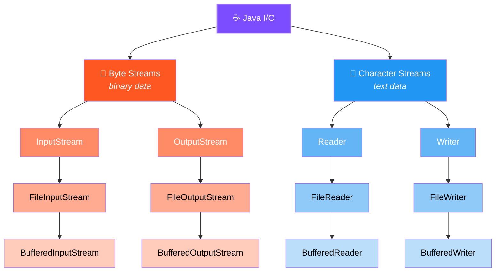
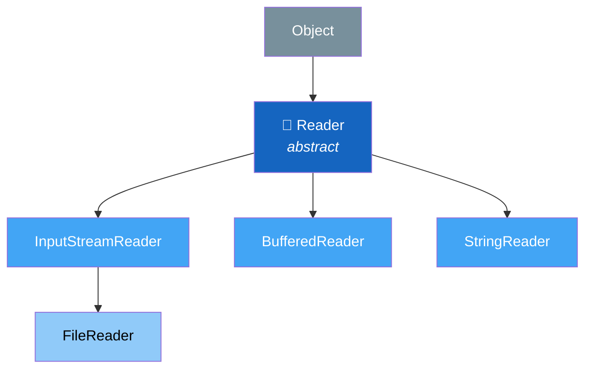
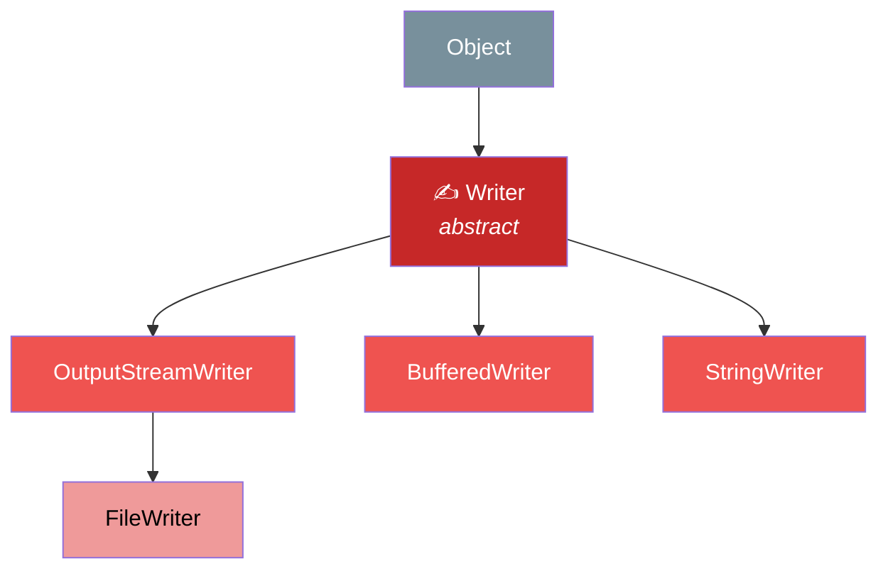
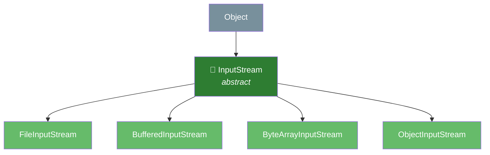
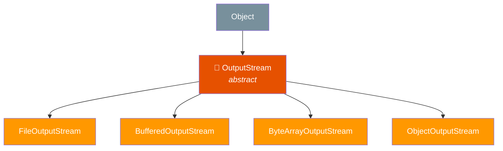

# File Handling in Java

## What is File Handling?

File handling means **reading from** and **writing to** files on your computer using Java. This is how programs save data permanently — even after the program closes.

**Real-world analogy**: Think of a file like a **notebook**. You can open it, write something, read what's written, and close it. Java gives you tools (classes) to do exactly this with files on disk.

---

## The Big Picture



### When to use which?

| Stream Type | Use For | Examples |
|---|---|---|
| **Byte streams** | Images, PDFs, videos, any binary file | `FileInputStream`, `FileOutputStream` |
| **Character streams** | Text files, CSVs, logs, config files | `FileReader`, `FileWriter` |
| **Buffered streams** | Better performance (reads/writes in chunks) | `BufferedReader`, `BufferedWriter` |

!!! tip "Rule of thumb"
    Working with **text**? Use character streams (`Reader`/`Writer`).
    Working with **anything else**? Use byte streams (`InputStream`/`OutputStream`).
    **Always** wrap in a buffered stream for performance.

---

## 1. The `File` Class

The `File` class represents a **file or directory path**. It doesn't read or write content — it just gives you info about the file.

```java
import java.io.File;

File file = new File("notes.txt");

System.out.println("Exists: " + file.exists());
System.out.println("Name: " + file.getName());
System.out.println("Path: " + file.getAbsolutePath());
System.out.println("Is File: " + file.isFile());
System.out.println("Is Directory: " + file.isDirectory());
System.out.println("Size: " + file.length() + " bytes");
```

### Creating files and directories

```java
File file = new File("myfile.txt");
if (file.createNewFile()) {
    System.out.println("File created!");
} else {
    System.out.println("File already exists.");
}

File dir = new File("myFolder");
dir.mkdir();   // creates one directory

File nested = new File("a/b/c");
nested.mkdirs();  // creates all parent directories too
```

### Listing files in a directory

```java
File folder = new File("/Users/vamsi/projects");
String[] files = folder.list();

for (String name : files) {
    System.out.println(name);
}
```

### Cross-platform paths

```java
// BAD — Windows-only
File f1 = new File("C:\\Users\\docs\\file.txt");

// GOOD — works everywhere
File f2 = new File("Users" + File.separator + "docs" + File.separator + "file.txt");

// ALSO GOOD — Java handles forward slashes on all platforms
File f3 = new File("Users/docs/file.txt");
```

---

## 2. Writing to Files

### Using `FileWriter` (simple text)

```java
import java.io.FileWriter;
import java.io.IOException;

try (FileWriter writer = new FileWriter("hello.txt")) {
    writer.write("Hello, World!\n");
    writer.write("This is line 2.\n");
}
// file is automatically closed thanks to try-with-resources
```

### Using `BufferedWriter` (better performance)

```java
import java.io.BufferedWriter;
import java.io.FileWriter;
import java.io.IOException;

try (BufferedWriter writer = new BufferedWriter(new FileWriter("notes.txt"))) {
    writer.write("First line");
    writer.newLine();  // platform-independent new line
    writer.write("Second line");
    writer.newLine();
    writer.write("Third line");
}
```

### Appending to a file (not overwriting)

```java
// The second argument 'true' means APPEND mode
try (FileWriter writer = new FileWriter("log.txt", true)) {
    writer.write("New log entry\n");
}
```

!!! warning "Without `true`, `FileWriter` overwrites the entire file!"

---

## 3. Reading from Files

### Using `FileReader` + `BufferedReader` (recommended)

```java
import java.io.BufferedReader;
import java.io.FileReader;
import java.io.IOException;

try (BufferedReader reader = new BufferedReader(new FileReader("notes.txt"))) {
    String line;
    while ((line = reader.readLine()) != null) {
        System.out.println(line);
    }
}
```

`readLine()` reads one full line at a time and returns `null` when the file ends.

### Reading character by character

```java
try (FileReader reader = new FileReader("notes.txt")) {
    int ch;
    while ((ch = reader.read()) != -1) {
        System.out.print((char) ch);
    }
}
```

`read()` returns an `int` (0-65535 for valid chars, `-1` for end of file).

---

## 4. Byte Streams (for binary files)

### Writing bytes

```java
import java.io.FileOutputStream;

try (FileOutputStream fos = new FileOutputStream("data.bin")) {
    byte[] data = {72, 101, 108, 108, 111};  // "Hello" in ASCII
    fos.write(data);
}
```

### Reading bytes

```java
import java.io.FileInputStream;

try (FileInputStream fis = new FileInputStream("data.bin")) {
    int b;
    while ((b = fis.read()) != -1) {
        System.out.print((char) b);
    }
}
```

### Copying a file (byte by byte with buffer)

```java
import java.io.*;

try (
    BufferedInputStream in = new BufferedInputStream(new FileInputStream("photo.jpg"));
    BufferedOutputStream out = new BufferedOutputStream(new FileOutputStream("photo_copy.jpg"))
) {
    byte[] buffer = new byte[4096];
    int bytesRead;
    while ((bytesRead = in.read(buffer)) != -1) {
        out.write(buffer, 0, bytesRead);
    }
}
```

---

## 5. Byte Streams vs Character Streams

| Feature | Byte Streams | Character Streams |
|---|---|---|
| Unit | 1 byte (8 bits) | 1 character (16 bits, Unicode) |
| Base classes | `InputStream` / `OutputStream` | `Reader` / `Writer` |
| File classes | `FileInputStream` / `FileOutputStream` | `FileReader` / `FileWriter` |
| Use for | Binary data (images, zip, pdf) | Text data (txt, csv, json) |
| Handles Unicode | No — may corrupt multi-byte chars | Yes — handles all Unicode |

**Example of the problem with byte streams and Unicode:**

```java
// The character 'ᛞ' is a multi-byte Unicode character
// Byte stream will corrupt it:
OutputStream os = new FileOutputStream("test.bin");
os.write('ᛞ');  // WRONG — only writes the lower 8 bits, data is lost

// Character stream handles it correctly:
Writer w = new FileWriter("test.txt");
w.write('ᛞ');   // CORRECT — writes full Unicode character
```

---

## 6. `try-with-resources`

Before Java 7, you had to manually close streams in a `finally` block. This was verbose and error-prone.

### Old way (Java 6 and earlier)

```java
BufferedReader reader = null;
try {
    reader = new BufferedReader(new FileReader("file.txt"));
    String line = reader.readLine();
} catch (IOException e) {
    e.printStackTrace();
} finally {
    if (reader != null) {
        try {
            reader.close();
        } catch (IOException e) {
            e.printStackTrace();
        }
    }
}
```

### New way (Java 7+)

```java
try (BufferedReader reader = new BufferedReader(new FileReader("file.txt"))) {
    String line = reader.readLine();
} catch (IOException e) {
    e.printStackTrace();
}
// reader is AUTOMATICALLY closed, even if an exception occurs
```

Any class that implements `AutoCloseable` (or `Closeable`) can be used in try-with-resources.

---

## 7. Modern File Handling with `java.nio` (Java 7+)

The `java.nio.file` package provides a simpler, more powerful API.

### Reading an entire file

```java
import java.nio.file.Files;
import java.nio.file.Path;

// Read all lines into a List
List<String> lines = Files.readAllLines(Path.of("notes.txt"));
lines.forEach(System.out::println);

// Read entire file as a single String (Java 11+)
String content = Files.readString(Path.of("notes.txt"));
System.out.println(content);
```

### Writing to a file

```java
import java.nio.file.Files;
import java.nio.file.Path;

// Write lines
List<String> lines = List.of("Line 1", "Line 2", "Line 3");
Files.write(Path.of("output.txt"), lines);

// Write a string (Java 11+)
Files.writeString(Path.of("output.txt"), "Hello, NIO!");

// Append
Files.writeString(Path.of("output.txt"), "\nAppended text",
    java.nio.file.StandardOpenOption.APPEND);
```

### File operations

```java
import java.nio.file.*;

Path source = Path.of("file.txt");
Path target = Path.of("backup/file.txt");

// Copy
Files.copy(source, target, StandardCopyOption.REPLACE_EXISTING);

// Move / rename
Files.move(source, Path.of("renamed.txt"));

// Delete
Files.deleteIfExists(Path.of("temp.txt"));

// Check existence
boolean exists = Files.exists(Path.of("notes.txt"));
```

### Walking a directory tree

```java
import java.nio.file.*;

// List all .java files recursively
Files.walk(Path.of("src"))
     .filter(p -> p.toString().endsWith(".java"))
     .forEach(System.out::println);
```

---

## 8. Class Hierarchy Summary

### Reader side (character input)



### Writer side (character output)



### InputStream side (byte input)



### OutputStream side (byte output)



---

## 9. Common Exceptions

| Exception | When it occurs |
|---|---|
| `FileNotFoundException` | File doesn't exist or can't be opened |
| `IOException` | General I/O failure (disk full, permission denied, etc.) |
| `SecurityException` | No permission to access the file |
| `NoSuchFileException` | NIO version of file not found |

---

## 10. Best Practices

- **Always close streams** — use try-with-resources
- **Use buffered streams** — `BufferedReader`/`BufferedWriter` instead of raw `FileReader`/`FileWriter`
- **Prefer `java.nio`** for new code — `Files.readString()`, `Files.write()` are simpler
- **Use `Path.of()`** instead of `new File()` for new code
- **Handle encoding explicitly** when it matters: `new InputStreamReader(fis, StandardCharsets.UTF_8)`
- **Don't read huge files entirely into memory** — use `BufferedReader.readLine()` or `Files.lines()` for streaming

---

## Interview Questions (Product Company Level)

### Output & Tricky Questions

**Q1: What does this print?**

```java
try (FileWriter fw = new FileWriter("test.txt")) {
    fw.write("Hello");
}

try (FileWriter fw = new FileWriter("test.txt")) {
    fw.write("World");
}

System.out.println(Files.readString(Path.of("test.txt")));
```

??? note "Answer"
    **Output**: `World`

    The second `FileWriter` opens in **overwrite mode** (default). It erases "Hello" and writes "World". To keep both, the second one should be `new FileWriter("test.txt", true)` for append mode.

---

**Q2: Is there a resource leak here?**

```java
BufferedReader br = new BufferedReader(new FileReader("data.txt"));
String line = br.readLine();
if (line.equals("STOP")) {
    return;
}
br.close();
```

??? note "Answer"
    Yes, **two bugs**:

    1. If `line` is `null` (empty file), `line.equals("STOP")` throws `NullPointerException` and `br` is never closed.
    2. If `line` equals "STOP", the method returns early and `br.close()` is skipped — resource leak.

    **Fix**: Use try-with-resources, and use `"STOP".equals(line)` to avoid NPE:

    ```java
    try (BufferedReader br = new BufferedReader(new FileReader("data.txt"))) {
        String line = br.readLine();
        if ("STOP".equals(line)) {
            return;  // br still gets closed automatically
        }
    }
    ```

---

**Q3: What happens if two threads write to the same file simultaneously using `FileWriter`?**

??? note "Answer"
    **Data corruption / interleaving**. `FileWriter` is not thread-safe. The writes from both threads will be mixed randomly. In production you must either:

    - Use `synchronized` blocks around file writes
    - Use `FileChannel` with file locks: `channel.lock()`
    - Use a `BlockingQueue` where one thread handles all writes
    - Use `Files.write()` with `StandardOpenOption.APPEND` (atomic on most OS for small writes)

---

**Q4: What is the output?**

```java
try (BufferedWriter bw = new BufferedWriter(new FileWriter("out.txt"))) {
    bw.write("Line 1");
    bw.newLine();
    bw.write("Line 2");
}

try (BufferedReader br = new BufferedReader(new FileReader("out.txt"))) {
    System.out.println(br.readLine());
    System.out.println(br.readLine());
    System.out.println(br.readLine());
}
```

??? note "Answer"
    ```
    Line 1
    Line 2
    null
    ```

    The file has two lines. The third `readLine()` returns `null` because end-of-file is reached. This is how you detect EOF — check for `null`.

---

### Scenario-Based Questions (Amazon, Google, Flipkart)

**Q5: You're building an order processing service at Amazon. Each order is a JSON line in a file. The file can be 50 GB. How do you process it?**

??? note "Answer"
    Never load the entire file. Stream it line-by-line:

    ```java
    try (Stream<String> lines = Files.lines(Path.of("orders.jsonl"))) {
        lines.parallel()
             .map(this::parseOrder)
             .filter(order -> order.getStatus() == Status.PENDING)
             .forEach(this::processOrder);
    }
    ```

    Key decisions:

    - `Files.lines()` returns a **lazy Stream** — only one line in memory at a time
    - `.parallel()` uses ForkJoinPool for throughput on multi-core machines
    - Try-with-resources ensures the file handle is released even on failure
    - For even larger scale, use `FileChannel` with `MappedByteBuffer` for memory-mapped I/O

---

**Q6: At Uber, you need to write a log aggregator that tails a growing log file in real-time (like `tail -f`). How?**

??? note "Answer"
    Two approaches:

    **Approach 1: Polling with `RandomAccessFile`**
    ```java
    RandomAccessFile raf = new RandomAccessFile("app.log", "r");
    long lastPosition = 0;

    while (true) {
        raf.seek(lastPosition);
        String line;
        while ((line = raf.readLine()) != null) {
            process(line);
        }
        lastPosition = raf.getFilePointer();
        Thread.sleep(500);
    }
    ```

    **Approach 2: `WatchService` for file change events**
    ```java
    WatchService watcher = FileSystems.getDefault().newWatchService();
    dir.register(watcher, StandardWatchEventKinds.ENTRY_MODIFY);
    // on each MODIFY event, read new bytes from last known position
    ```

    Approach 1 is simpler and more reliable. `WatchService` can miss events under high load on some OS.

---

**Q7: You need to copy a 5 GB video file. Compare `FileInputStream`/`FileOutputStream` vs `FileChannel.transferTo()`. Which is faster and why?**

??? note "Answer"
    `FileChannel.transferTo()` is **significantly faster**.

    ```java
    // Slow: user-space copy
    try (var in = new FileInputStream("video.mp4");
         var out = new FileOutputStream("copy.mp4")) {
        byte[] buf = new byte[8192];
        int n;
        while ((n = in.read(buf)) != -1) out.write(buf, 0, n);
    }

    // Fast: zero-copy via OS kernel
    try (var src = FileChannel.open(Path.of("video.mp4"));
         var dst = FileChannel.open(Path.of("copy.mp4"),
             StandardOpenOption.CREATE, StandardOpenOption.WRITE)) {
        src.transferTo(0, src.size(), dst);
    }
    ```

    `transferTo()` uses **zero-copy** — the OS moves data directly between file descriptors in kernel space without copying it into Java heap. For a 5 GB file, this means ~50% less CPU usage and much faster I/O.

---

**Q8: How would you design a CSV parser at Google Sheets that handles files with millions of rows, quoted fields, and multi-line values?**

??? note "Answer"
    Don't use `split(",")` — it breaks on quoted commas. Design:

    1. Use `BufferedReader` for streaming (not `readAllLines`)
    2. Implement a state machine: `NORMAL`, `IN_QUOTES`
    3. Handle edge cases: escaped quotes (`""`), newlines inside quotes, BOM markers

    ```java
    try (BufferedReader br = Files.newBufferedReader(path, StandardCharsets.UTF_8)) {
        CSVParser parser = new CSVParser(br);
        List<String> row;
        while ((row = parser.nextRow()) != null) {
            process(row);
        }
    }
    ```

    Or use a battle-tested library like **OpenCSV** or **Apache Commons CSV** in production. Writing your own is a great interview exercise but risky in production.

---

### Rapid-Fire

**Q9: `Scanner` vs `BufferedReader` — which is faster for reading a file?**

> `BufferedReader` is **much faster**. `Scanner` uses regex internally to parse tokens, which adds overhead. For large files, `BufferedReader` can be 5-10x faster.

**Q10: What is the default buffer size of `BufferedReader`?**

> **8192 characters** (8 KB). You can customize it: `new BufferedReader(reader, 65536)` for 64 KB.

**Q11: Can you read a file and write to the same file simultaneously?**

> Not safely with standard streams — you'll corrupt the file or get an exception. Use `RandomAccessFile` for in-place reads/writes, or read into memory, modify, then write back.

**Q12: What is the difference between `FileNotFoundException` and `NoSuchFileException`?**

> `FileNotFoundException` is from `java.io` (thrown by `FileInputStream`, `FileReader`). `NoSuchFileException` is from `java.nio.file` (thrown by `Files.newBufferedReader()`, `Files.readString()`). Same concept, different packages.

**Q13: How does `Files.readAllBytes()` differ from `Files.readString()`?**

> `readAllBytes()` returns `byte[]` (raw bytes, no encoding). `readString()` returns `String` (applies UTF-8 encoding by default). Use `readAllBytes()` for binary files, `readString()` for text.

**Q14: What happens if you forget to call `flush()` on a `BufferedWriter` and the program crashes?**

> Data still in the buffer is **lost** — it was never written to disk. `close()` calls `flush()` internally, but a crash skips both. For critical data (like financial transactions), call `flush()` after every write, or use `FileChannel.force(true)` to sync to disk.

**Q15: In a microservice, you need to write audit logs. File vs Database — which would you choose and why?**

> **File** for high-throughput, append-only audit logs (structured as JSON lines). Databases add latency per write and connection overhead. Write to a local file asynchronously, then ship to a centralized system (ELK, Splunk, CloudWatch) via a log shipper. For compliance queries later, ingest into a database/data lake in batch.
