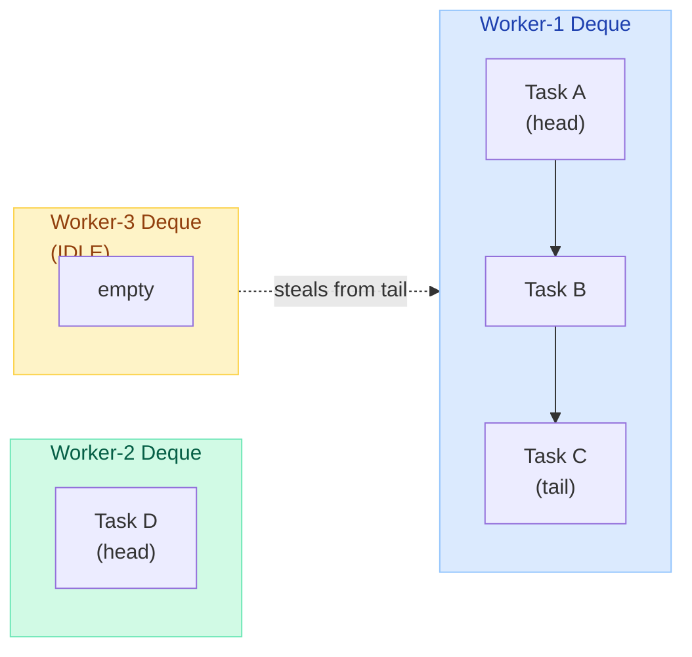
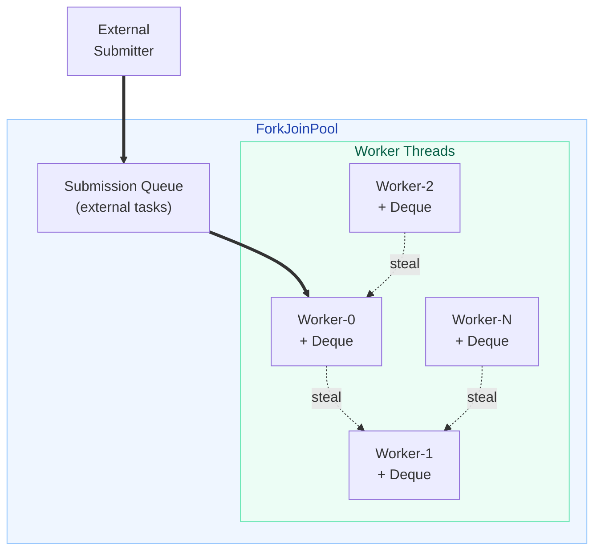
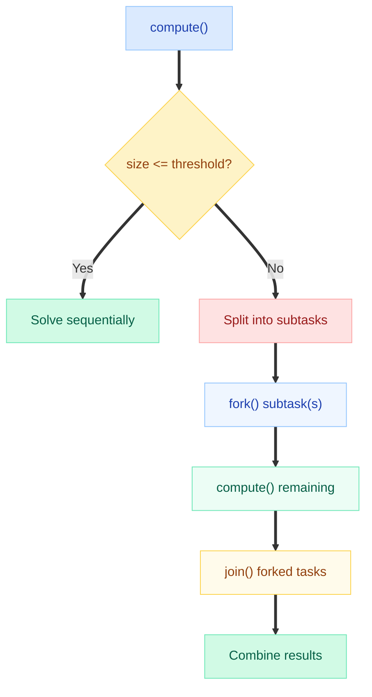
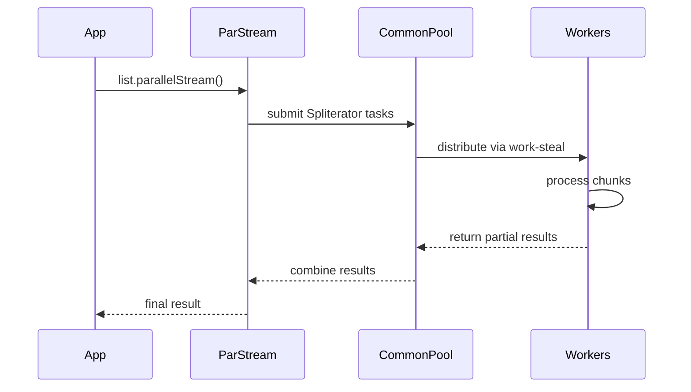
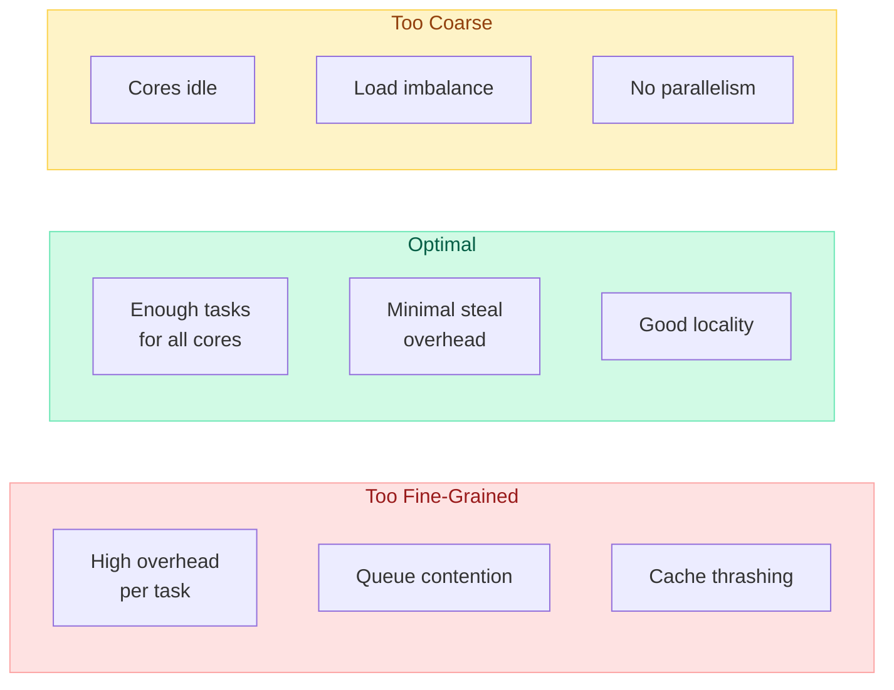
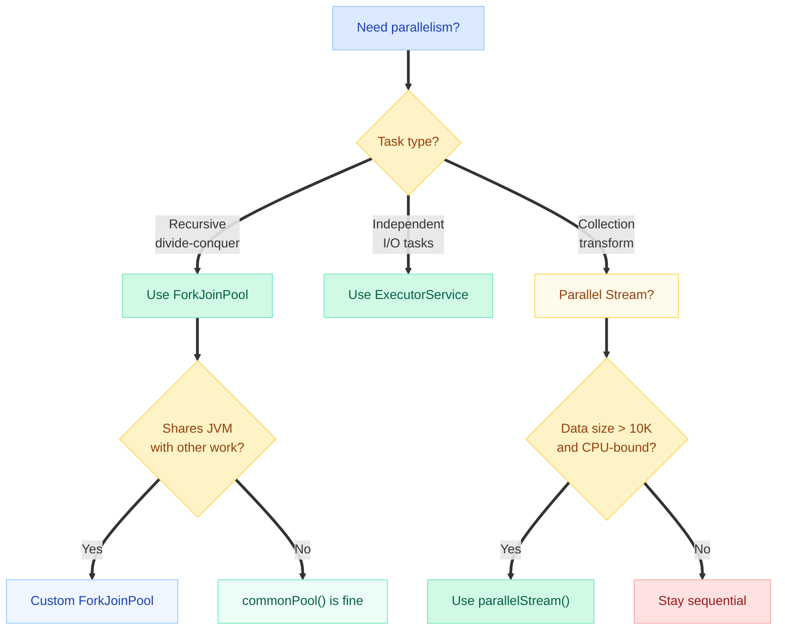

# Fork/Join Framework

!!! danger "Real-World Incident"
    A fintech company experienced **30-second API latencies** during peak load. Root cause: all parallel streams shared the `ForkJoinPool.commonPool()` (default parallelism = CPU cores - 1). A long-running data aggregation task saturated the common pool, starving HTTP request processing, health checks, and other parallel streams. The fix: isolate heavy workloads in a **custom ForkJoinPool** with bounded parallelism.

The Fork/Join Framework (introduced in Java 7, package `java.util.concurrent`) is designed for **divide-and-conquer parallelism** -- break a large task into smaller subtasks, solve them in parallel, and combine results. It powers `parallelStream()`, `Arrays.parallelSort()`, and `CompletableFuture` async operations.

---

## Work-Stealing Algorithm

The key innovation of Fork/Join is **work stealing**: idle threads don't sit idle -- they steal tasks from busy threads' queues.



**How it works:**

1. Each worker thread has a **double-ended queue (deque)** of tasks
2. A worker pushes/pops its own tasks from the **head** (LIFO -- better cache locality)
3. When a worker's deque is empty, it **steals** from the **tail** of another worker's deque (FIFO -- steals largest tasks)
4. Stealing from the tail minimizes contention with the owning thread

!!! tip "Why LIFO for own work, FIFO for stealing?"
    - **LIFO (own work)**: Recently forked subtasks are smaller and still in cache -- process them first
    - **FIFO (stealing)**: Older tasks at the tail are larger -- stealing them gives the thief more work to subdivide, reducing future steals

---

## ForkJoinPool Architecture



**Key architectural points:**

| Component | Description |
|---|---|
| **Worker threads** | Daemon threads, one per CPU core by default |
| **Per-worker deque** | Lock-free array-based deque for owned tasks |
| **Submission queue** | Holds externally submitted tasks (from non-worker threads) |
| **Work-stealing** | Idle workers randomly probe other workers' deques |
| **Compensation** | If a worker blocks on `join()`, pool may spawn a temporary compensating thread |

---

## RecursiveTask vs RecursiveAction

Both extend `ForkJoinTask<V>` and provide the `compute()` template.

| Feature | `RecursiveTask<V>` | `RecursiveAction` |
|---|---|---|
| Return value | Yes (type `V`) | No (`void`) |
| Use case | Sum, search, aggregation | Sort, apply transformation |
| Method | `compute()` returns `V` | `compute()` returns `void` |

### RecursiveTask Example: Parallel Sum

```java
import java.util.concurrent.*;

public class ParallelSum extends RecursiveTask<Long> {
    private static final int THRESHOLD = 10_000;
    private final long[] array;
    private final int start, end;

    public ParallelSum(long[] array, int start, int end) {
        this.array = array;
        this.start = start;
        this.end = end;
    }

    @Override
    protected Long compute() {
        int length = end - start;

        // Base case: small enough to compute directly
        if (length <= THRESHOLD) {
            long sum = 0;
            for (int i = start; i < end; i++) {
                sum += array[i];
            }
            return sum;
        }

        // Recursive case: split in half
        int mid = start + length / 2;
        ParallelSum leftTask = new ParallelSum(array, start, mid);
        ParallelSum rightTask = new ParallelSum(array, mid, end);

        leftTask.fork();           // submit left to pool asynchronously
        long rightResult = rightTask.compute(); // compute right in current thread
        long leftResult = leftTask.join();      // wait for left result

        return leftResult + rightResult;
    }

    public static void main(String[] args) {
        long[] data = new long[1_000_000];
        for (int i = 0; i < data.length; i++) data[i] = i + 1;

        ForkJoinPool pool = ForkJoinPool.commonPool();
        long result = pool.invoke(new ParallelSum(data, 0, data.length));
        System.out.println("Sum: " + result); // 500000500000
    }
}
```

### RecursiveAction Example: Parallel Sort

```java
import java.util.concurrent.*;
import java.util.Arrays;

public class ParallelMergeSort extends RecursiveAction {
    private static final int THRESHOLD = 4096;
    private final int[] array;
    private final int start, end;

    public ParallelMergeSort(int[] array, int start, int end) {
        this.array = array;
        this.start = start;
        this.end = end;
    }

    @Override
    protected void compute() {
        if (end - start <= THRESHOLD) {
            Arrays.sort(array, start, end); // sequential sort for small chunks
            return;
        }

        int mid = (start + end) / 2;
        ParallelMergeSort left = new ParallelMergeSort(array, start, mid);
        ParallelMergeSort right = new ParallelMergeSort(array, mid, end);

        invokeAll(left, right); // fork both, join both
        merge(array, start, mid, end);
    }

    private void merge(int[] arr, int start, int mid, int end) {
        int[] temp = Arrays.copyOfRange(arr, start, mid);
        int i = 0, j = mid, k = start;
        while (i < temp.length && j < end) {
            arr[k++] = (temp[i] <= arr[j]) ? temp[i++] : arr[j++];
        }
        while (i < temp.length) arr[k++] = temp[i++];
    }
}
```

---

## fork() / join() / invoke() / invokeAll()

| Method | Behavior | Returns |
|---|---|---|
| `fork()` | Submit task to pool asynchronously (non-blocking) | `ForkJoinTask<V>` (itself) |
| `join()` | Wait for task result (may work-steal while waiting) | `V` (result) |
| `invoke()` | Fork + join in one call (blocking) | `V` (result) |
| `invokeAll(t1, t2)` | Fork all tasks, join all (blocking) | `void` |
| `pool.invoke(task)` | Submit from external thread, block for result | `V` (result) |
| `pool.submit(task)` | Submit from external thread, non-blocking | `ForkJoinTask<V>` |

!!! warning "The fork-compute-join pattern"
    Always **fork one subtask** and **compute the other in the current thread**:
    ```java
    leftTask.fork();                    // async
    long right = rightTask.compute();   // use current thread
    long left = leftTask.join();        // wait for async result
    ```
    **Never** fork both and join both -- that wastes the current thread:
    ```java
    // BAD: current thread just waits!
    leftTask.fork();
    rightTask.fork();
    leftTask.join();   // current thread is idle
    rightTask.join();
    ```

---

## The compute() Pattern

Every Fork/Join task follows the same template:



**Choosing the threshold:**

- Too small: overhead of task creation/scheduling exceeds computation time
- Too large: insufficient parallelism, some cores idle
- Rule of thumb: aim for **100-10,000 elements** per leaf task (benchmark your workload)
- JDK sources use `(array.length / (parallelism * 4))` as a starting heuristic

---

## ForkJoinPool.commonPool()

Java 8 introduced a shared, JVM-wide pool:

```java
ForkJoinPool common = ForkJoinPool.commonPool();
System.out.println(common.getParallelism()); // Runtime.getRuntime().availableProcessors() - 1
```

| Property | Default Value |
|---|---|
| Parallelism | `availableProcessors() - 1` (leaves 1 core for caller) |
| Thread factory | Default daemon threads |
| Async mode | `false` (LIFO for tasks) |
| System property override | `-Djava.util.concurrent.ForkJoinPool.common.parallelism=N` |

!!! info "Who uses commonPool()?"
    - `Collection.parallelStream()`
    - `CompletableFuture.supplyAsync()` (when no executor specified)
    - `Arrays.parallelSort()`
    - `ConcurrentHashMap.reduceValues()` / `forEach()` / `search()` with parallel threshold

---

## Relationship to Parallel Streams



**Key insight**: `parallelStream()` decomposes work using `Spliterator` and submits tasks to `commonPool()`. This means:

1. All parallel streams in your JVM **compete for the same pool**
2. A slow stream operation blocks pool threads, affecting all other parallel streams
3. Blocking I/O inside `parallelStream()` is **catastrophic** -- it saturates the pool

```java
// DANGEROUS: blocking I/O in parallel stream
List<String> urls = getUrls();
urls.parallelStream()
    .map(url -> httpClient.get(url))  // blocks a commonPool thread!
    .collect(Collectors.toList());
```

---

## Custom ForkJoinPool for Isolation

To prevent commonPool saturation, run heavy or blocking tasks in a **dedicated pool**:

```java
// Create isolated pool with 8 threads
ForkJoinPool customPool = new ForkJoinPool(8);

try {
    List<String> results = customPool.submit(() ->
        urls.parallelStream()
            .map(url -> httpClient.get(url))
            .collect(Collectors.toList())
    ).get(); // .get() propagates exceptions
} finally {
    customPool.shutdown();
}
```

!!! warning "Gotcha: parallel stream inside custom pool"
    Submitting a parallel stream operation to a custom `ForkJoinPool` via `submit()` works because `ForkJoinTask.fork()` checks if the current thread is a `ForkJoinWorkerThread` and submits to **that thread's pool**. This is an implementation detail, not a documented guarantee (though it has been stable since Java 8).

**When to use a custom pool:**

- I/O-bound parallel operations (HTTP calls, DB queries)
- Long-running computations that would starve other consumers
- Tasks requiring different parallelism levels (e.g., 50 threads for I/O vs 4 for CPU)
- Multi-tenant systems where isolation is critical

---

## Performance Considerations

### Task Granularity



### Overhead Breakdown

| Source of Overhead | Cost |
|---|---|
| Task object creation | ~50-100ns per task |
| Deque push/pop | ~20-50ns (lock-free CAS) |
| Work-steal attempt | ~200-500ns (random probe + CAS) |
| Thread context switch | ~1-10us |
| **Minimum useful task** | **~1-10us of computation** |

### Rules of Thumb

1. **Threshold selection**: If leaf-task computation < 1us, you are over-splitting
2. **Task count**: Aim for `parallelism * 4` to `parallelism * 16` leaf tasks
3. **Avoid blocking**: Never block inside a ForkJoinTask (use `ManagedBlocker` if you must)
4. **Avoid shared mutable state**: Tasks should be independent -- no synchronized blocks
5. **Prefer even splits**: Uneven splits lead to one subtask taking much longer

---

## Comparison: ForkJoin vs ExecutorService vs Parallel Streams

| Feature | ForkJoinPool | ExecutorService | Parallel Streams |
|---|---|---|---|
| **Best for** | Recursive divide-and-conquer | Independent tasks, I/O | Collection processing |
| **Work-stealing** | Yes | No | Yes (uses ForkJoin) |
| **Task model** | `ForkJoinTask` (fork/join) | `Runnable`/`Callable` | Internal (Spliterator) |
| **Pool topology** | Per-worker deques | Single shared queue | commonPool (shared) |
| **Parallelism control** | Configurable | Fixed/cached | System property only |
| **Blocking tolerance** | Poor (compensates) | Good | Very poor |
| **Ease of use** | Low (manual split) | Medium | High (one-liner) |
| **Custom logic** | Full control | Full control | Limited to stream ops |
| **Overhead** | Low (lock-free) | Medium (locks) | Low (lock-free) |
| **Fault isolation** | Custom pool per workload | Pool per workload | Shares commonPool |

!!! tip "When to choose what"
    - **ForkJoinPool**: CPU-heavy recursive problems (sort, search, matrix math, tree traversal)
    - **ExecutorService**: I/O tasks, heterogeneous tasks, tasks needing timeouts/cancellation
    - **Parallel Streams**: Simple data-parallel collection operations with no side effects

---

## Common Pitfalls

| Pitfall | Problem | Solution |
|---|---|---|
| Blocking in commonPool | Starves all parallel streams | Use custom pool or `ManagedBlocker` |
| Over-splitting | Task overhead exceeds computation | Increase threshold |
| Forking both subtasks | Wastes current thread | Fork one, compute other |
| Shared mutable state | Race conditions, false sharing | Use thread-local or immutable data |
| Ignoring exceptions | `join()` wraps in `RuntimeException` | Check `isCompletedAbnormally()` |
| Wrong pool size for I/O | CPU-bound default too low | Use `new ForkJoinPool(50)` for I/O |
| Not shutting down custom pool | Thread leak | Use try-finally with `shutdown()` |
| `parallelStream()` on small data | Overhead > benefit | Only parallelize for N > 10,000 |

### ManagedBlocker for Unavoidable Blocking

```java
ForkJoinPool.managedBlock(new ForkJoinPool.ManagedBlocker() {
    private String result;
    private boolean done = false;

    @Override
    public boolean block() throws InterruptedException {
        result = blockingHttpCall(); // pool may create compensating thread
        done = true;
        return true;
    }

    @Override
    public boolean isReleasable() {
        return done;
    }
});
```

---

## Quick Recall Table

| Concept | One-Liner |
|---|---|
| Fork/Join purpose | Divide-and-conquer parallelism with work-stealing |
| Work-stealing | Idle threads steal tasks from busy threads' deque tails |
| RecursiveTask | Returns a result (like `Callable`) |
| RecursiveAction | No return value (like `Runnable`) |
| compute() pattern | Check threshold -> split -> fork one -> compute other -> join -> combine |
| commonPool | JVM-wide shared pool, parallelism = cores - 1 |
| Parallel streams | Use commonPool internally -- can starve each other |
| Custom pool isolation | `new ForkJoinPool(n)` + submit work to it |
| Threshold too low | Overhead dominates, slower than sequential |
| fork() then compute() | Always compute one branch in current thread |
| ManagedBlocker | Tells pool "I'm about to block, compensate" |

---

## Interview Answer Template

!!! example "Q: What is the Fork/Join Framework and when would you use it?"

    **Opening (What):**
    > "The Fork/Join Framework is Java's implementation of divide-and-conquer parallelism, built on work-stealing. It splits large tasks recursively until they're small enough to solve sequentially, then combines results."

    **Architecture (How):**
    > "It uses a ForkJoinPool where each worker thread has its own deque. Workers push/pop from the head (LIFO for locality), and idle workers steal from others' tails (FIFO for large tasks). This keeps all cores busy with minimal contention."

    **Key Patterns:**
    > "You extend RecursiveTask (with result) or RecursiveAction (void). In compute(), check if work is below threshold -- if yes, solve directly; if no, split, fork one half, compute the other in the current thread, then join."

    **Real-World Connection:**
    > "Parallel streams use the common ForkJoinPool internally. This is why blocking I/O in a parallel stream is dangerous -- it saturates the shared pool. For isolation, we submit to a custom ForkJoinPool."

    **When to use:**
    > "I'd use Fork/Join for CPU-bound recursive problems like parallel sort, tree aggregation, or image processing. For I/O-bound work, I'd prefer ExecutorService or virtual threads (Java 21+)."

---

## Summary: Decision Flowchart


