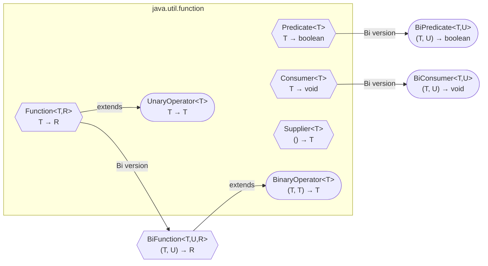
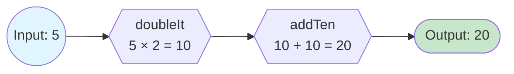
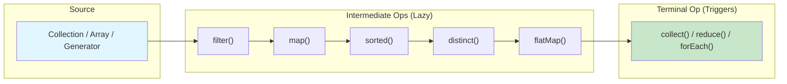
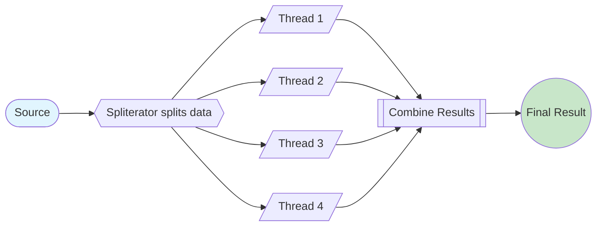

# Functional Programming in Java

!!! tip "Interview Relevance"
    Functional programming is tested in **every FAANG interview** that involves Java. You will be expected to fluently use lambdas, streams, and Optional in coding rounds. System design rounds may probe your understanding of immutability and pure functions for concurrent systems.

---

## Functional Interfaces

A **functional interface** has exactly **one abstract method** (SAM — Single Abstract Method). The `@FunctionalInterface` annotation is optional but recommended — it causes a compile error if the contract is violated.

```java
@FunctionalInterface
public interface Transformer<T> {
    T transform(T input);
    // Default and static methods are allowed
    default Transformer<T> andThen(Transformer<T> after) {
        return input -> after.transform(this.transform(input));
    }
}
```

**Key rules:** exactly one abstract method; can have `default`/`static` methods; methods inherited from `Object` do not count.

---

## Built-in Functional Interfaces



### Comparison Table

| Interface | Method | Input | Output | Use Case |
|---|---|---|---|---|
| `Function<T,R>` | `apply(T)` | T | R | Transform data |
| `BiFunction<T,U,R>` | `apply(T, U)` | T, U | R | Combine two inputs |
| `UnaryOperator<T>` | `apply(T)` | T | T | Same-type transformation |
| `BinaryOperator<T>` | `apply(T, T)` | T, T | T | Reduce two values to one |
| `Predicate<T>` | `test(T)` | T | boolean | Filter/validate |
| `BiPredicate<T,U>` | `test(T, U)` | T, U | boolean | Two-input condition |
| `Consumer<T>` | `accept(T)` | T | void | Side effects (logging, saving) |
| `BiConsumer<T,U>` | `accept(T, U)` | T, U | void | Side effects on two inputs |
| `Supplier<T>` | `get()` | none | T | Lazy creation / factory |

### Examples

```java
Function<String, Integer> strLength = String::length;
Predicate<Integer> isEven = n -> n % 2 == 0;
Consumer<String> printer = System.out::println;
Supplier<List<String>> listFactory = ArrayList::new;
UnaryOperator<String> toUpper = String::toUpperCase;
BinaryOperator<Integer> sum = Integer::sum;
```

---

## Lambda Expressions

Lambdas provide concise syntax for implementing functional interfaces.

### Syntax Variations

```java
// Full form
(int a, int b) -> { return a + b; }

// Type inference
(a, b) -> a + b

// Single parameter (no parentheses)
x -> x * 2

// No parameters
() -> System.out.println("Hello")

// Multi-line body
(a, b) -> {
    int result = a + b;
    log.info("Sum: {}", result);
    return result;
}
```

### Closures and Effectively Final

Lambdas capture variables from their enclosing scope, but those variables must be **effectively final** (assigned only once).

```java
String prefix = "Hello"; // effectively final
Function<String, String> greeter = name -> prefix + " " + name; // OK

String greeting = "Hi";
greeting = "Hello"; // re-assignment breaks effectively final
Consumer<String> broken = name -> System.out.println(greeting + name); // COMPILE ERROR
```

**Why?** Lambdas capture the *value*, not the variable. If the variable could change, the lambda would hold a stale snapshot. **Workaround:** use `AtomicReference` or single-element array.

---

## Method References

Method references are shorthand for lambdas that simply delegate to an existing method.

### Four Types

| Type | Syntax | Lambda Equivalent | Example |
|---|---|---|---|
| Static method | `ClassName::staticMethod` | `x -> Class.method(x)` | `Integer::parseInt` |
| Bound instance | `instance::method` | `x -> instance.method(x)` | `System.out::println` |
| Unbound instance | `ClassName::method` | `(obj, x) -> obj.method(x)` | `String::length` |
| Constructor | `ClassName::new` | `x -> new ClassName(x)` | `ArrayList::new` |

```java
Function<String, Integer> parse = Integer::parseInt;        // static
Supplier<String> upper = "hello"::toUpperCase;              // bound instance
Function<String, String> toUpper = String::toUpperCase;     // unbound instance
Supplier<List<String>> factory = ArrayList::new;            // constructor
```

---

## Composition

### Function Composition

```java
Function<Integer, Integer> doubleIt = x -> x * 2;
Function<Integer, Integer> addTen = x -> x + 10;

// andThen: apply first, then second → (5*2)+10 = 20
doubleIt.andThen(addTen).apply(5);

// compose: apply second first, then first → (5+10)*2 = 30
doubleIt.compose(addTen).apply(5);
```



### Predicate Chaining

```java
Predicate<Integer> isPositive = n -> n > 0;
Predicate<Integer> isEven = n -> n % 2 == 0;

Predicate<Integer> positiveAndEven = isPositive.and(isEven);   // AND
Predicate<Integer> positiveOrEven = isPositive.or(isEven);     // OR
Predicate<Integer> isOdd = isEven.negate();                    // NEGATE

// Complex chain
Predicate<Integer> complex = isPositive.and(isEven).and(n -> n < 100);
complex.test(42);  // true
complex.test(102); // false
```

### Consumer Chaining

```java
Consumer<String> log = s -> System.out.println("LOG: " + s);
Consumer<String> save = s -> database.save(s);
Consumer<String> logAndSave = log.andThen(save);
```

---

## Optional

`Optional<T>` is a container that may or may not hold a non-null value. It forces explicit handling of absence.

### Creation

```java
Optional<String> present = Optional.of("Hello");       // throws NPE if null
Optional<String> nullable = Optional.ofNullable(name); // safe for null
Optional<String> empty = Optional.empty();
```

### Transformations with map and flatMap

```java
Optional<String> name = Optional.of("john doe");

// map — transform if present
Optional<String> upper = name.map(String::toUpperCase); // Optional["JOHN DOE"]

// flatMap — avoids Optional<Optional<T>>
Optional<String> city = findUser(id)
    .flatMap(User::getAddress)
    .flatMap(Address::getCity);

// filter — keep only if predicate matches
Optional<String> longName = name.filter(n -> n.length() > 3);
```

### Retrieval Patterns

```java
optional.orElse("default");                               // always evaluated
optional.orElseGet(() -> computeExpensive());             // lazy — only if empty
optional.orElseThrow(() -> new NotFoundException());      // throw if empty
optional.ifPresent(val -> process(val));                  // action if present
optional.ifPresentOrElse(this::process, this::fallback); // Java 9+
```

### Anti-Patterns

```java
// BAD: Optional as method parameter or class field
public void process(Optional<String> name) { }  // Don't

// BAD: Calling get() without checking
optional.get(); // NoSuchElementException risk

// GOOD: Optional only as return type
public Optional<User> findUserById(Long id) { ... }
```

---

## Stream API Pipeline



**Key traits:** lazy evaluation, single-use, non-mutating, optionally parallel.

### Intermediate Operations (Return Stream)

```java
names.stream()
     .filter(n -> n.startsWith("A"))    // keep matching
     .map(String::toUpperCase)          // transform 1:1
     .flatMap(Collection::stream)       // flatten nested
     .sorted()                          // natural order
     .distinct()                        // remove duplicates
     .limit(10)                         // cap at N
     .skip(1)                           // skip first N
     .peek(System.out::println);        // debug only
```

### Terminal Operations (Produce Result)

```java
stream.collect(Collectors.toList());              // accumulate
stream.forEach(System.out::println);              // side effect
numbers.stream().reduce(0, Integer::sum);         // combine all
stream.count();                                   // count elements
stream.findFirst();                               // Optional<T>
stream.anyMatch(predicate);                       // boolean
stream.max(Comparator.naturalOrder());            // Optional<T>
```

### flatMap — Flattening Nested Structures

```java
List<List<String>> nested = List.of(List.of("a","b"), List.of("c","d"));
List<String> flat = nested.stream()
    .flatMap(Collection::stream)
    .collect(Collectors.toList()); // [a, b, c, d]
```

---

## Collectors

### Essential Collectors

```java
// toList / toSet / toMap
Map<Long, Employee> byId = employees.stream()
    .collect(Collectors.toMap(Employee::getId, Function.identity()));

// joining
String csv = names.stream().collect(Collectors.joining(", ")); // "Alice, Bob"

// groupingBy
Map<Department, List<Employee>> byDept = employees.stream()
    .collect(Collectors.groupingBy(Employee::getDepartment));

// groupingBy with downstream
Map<Department, Long> countByDept = employees.stream()
    .collect(Collectors.groupingBy(Employee::getDepartment, Collectors.counting()));

// partitioningBy — split into true/false
Map<Boolean, List<Employee>> split = employees.stream()
    .collect(Collectors.partitioningBy(e -> e.getSalary() > 100000));

// reducing
Optional<Employee> highest = employees.stream()
    .collect(Collectors.reducing(BinaryOperator.maxBy(
        Comparator.comparingDouble(Employee::getSalary))));

// summarizingDouble — stats in one pass
DoubleSummaryStatistics stats = employees.stream()
    .collect(Collectors.summarizingDouble(Employee::getSalary));
```

### Custom Collector

```java
Collector<String, StringJoiner, String> custom = Collector.of(
    () -> new StringJoiner(", ", "[", "]"),  // supplier
    StringJoiner::add,                        // accumulator
    StringJoiner::merge,                      // combiner (parallel)
    StringJoiner::toString                    // finisher
);
Stream.of("a", "b", "c").collect(custom); // "[a, b, c]"
```

---

## Parallel Streams

Parallel streams split work across multiple threads using the **ForkJoinPool**.



### When to Use vs Avoid

| Good Candidates | Bad Candidates |
|---|---|
| Large datasets (100K+ elements) | Small collections (< 10K) |
| CPU-intensive per-element work | I/O-bound operations |
| Stateless, associative operations | Shared mutable state |
| ArrayList / array sources | LinkedList / TreeSet (poor splitting) |

### ForkJoinPool Connection

```java
// Default: uses common ForkJoinPool (parallelism = availableProcessors - 1)
// Custom pool for isolation:
ForkJoinPool pool = new ForkJoinPool(8);
List<Result> results = pool.submit(() ->
    data.parallelStream()
        .map(this::process)
        .collect(Collectors.toList())
).get();
pool.shutdown();
```

### Pitfalls

```java
// BUG: Shared mutable state — race condition
List<Integer> results = new ArrayList<>();
numbers.parallelStream().map(n -> n * 2).forEach(results::add); // WRONG

// FIX: Use collect()
List<Integer> results = numbers.parallelStream()
    .map(n -> n * 2).collect(Collectors.toList()); // SAFE

// BUG: Non-associative operation
numbers.parallelStream().reduce(0, (a, b) -> a - b); // Wrong results!
```

---

## Immutability and Pure Functions

### Immutable Objects

```java
public final class Money {
    private final BigDecimal amount;
    private final Currency currency;

    public Money(BigDecimal amount, Currency currency) {
        this.amount = amount;
        this.currency = currency;
    }

    public Money add(Money other) {
        return new Money(this.amount.add(other.amount), this.currency); // new object
    }
}

// Java 16+ Records — immutable by default
public record Point(int x, int y) {
    public Point translate(int dx, int dy) { return new Point(x + dx, y + dy); }
}

// Unmodifiable collections (Java 9+)
List<String> list = List.of("a", "b", "c");
Map<String, Integer> map = Map.of("key", 1);
```

### Pure Functions

A **pure function** has no side effects and is deterministic (same input = same output).

```java
// PURE — safe for parallel streams, cacheable, easy to test
Function<Integer, Integer> square = x -> x * x;

// IMPURE — depends on external state
Function<Integer, Integer> addRandom = x -> x + new Random().nextInt();
```

**Benefits:** thread-safe without synchronization, easy to test, cacheable (memoization), safe for parallel operations.

---

## Interview Questions

??? question "What is the difference between map() and flatMap() in streams?"
    `map()` transforms each element 1-to-1. `flatMap()` transforms each element into a stream and flattens all results into one stream. Use `flatMap()` when each element maps to multiple values (e.g., `List<List<T>>` to `List<T>`).
    ```java
    // map: Stream<List<String>> — still nested
    // flatMap: Stream<String> — flattened
    listOfLists.stream().flatMap(Collection::stream).collect(Collectors.toList());
    ```

??? question "Why must variables captured by lambdas be effectively final?"
    Lambdas capture the **value** of local variables, not the variable itself. If the variable could be reassigned, the lambda would hold a stale copy. The JVM does not support mutable closures over stack-allocated locals. This ensures thread safety and predictable behavior.

??? question "Explain the difference between orElse() and orElseGet() in Optional."
    `orElse(value)` **always evaluates** the default, even when Optional is present. `orElseGet(supplier)` only invokes the supplier when empty. Use `orElseGet()` when the default is expensive to compute.
    ```java
    findUser(id).orElse(expensiveDefault());       // always calls expensiveDefault()
    findUser(id).orElseGet(() -> expensiveDefault()); // only calls if empty
    ```

??? question "How do you run a parallel stream on a custom ForkJoinPool?"
    Submit the stream operation as a task to a custom pool. The stream uses that pool's threads instead of the shared common pool (which could starve other tasks).
    ```java
    ForkJoinPool pool = new ForkJoinPool(8);
    List<Result> r = pool.submit(() ->
        data.parallelStream().map(this::process).collect(Collectors.toList())
    ).get();
    ```

??? question "What is the difference between reduce() and collect()?"
    `reduce()` is **immutable reduction** — combines elements by creating new values. `collect()` is **mutable reduction** — accumulates into a container (List, StringBuilder). Use `reduce()` for numerics; use `collect()` for building collections or strings.
    ```java
    strings.stream().reduce("", String::concat);    // new String each time (slow)
    strings.stream().collect(Collectors.joining()); // mutable StringBuilder (fast)
    ```

??? question "What are the risks of parallel streams with shared mutable state?"
    Parallel streams split data across threads. Writing to shared mutable state (e.g., `ArrayList`) causes race conditions — missing elements, duplicates, or exceptions. Fix: use `collect()` for thread-safe accumulation or ensure all operations are stateless.

??? question "Implement a custom Collector that builds a bracketed comma-separated string."
    ```java
    Collector<String, StringJoiner, String> c = Collector.of(
        () -> new StringJoiner(", ", "[", "]"),  // supplier
        StringJoiner::add,                        // accumulator
        StringJoiner::merge,                      // combiner (parallel)
        StringJoiner::toString                    // finisher
    );
    Stream.of("a","b","c").collect(c); // "[a, b, c]"
    ```
    Four components: Supplier (create container), Accumulator (add element), Combiner (merge for parallel), Finisher (final transform).

??? question "How does andThen() differ from compose() in Function?"
    Both chain functions but in opposite order: `f.andThen(g)` = g(f(x)); `f.compose(g)` = f(g(x)).
    ```java
    Function<Integer,Integer> dbl = x -> x * 2;
    Function<Integer,Integer> inc = x -> x + 1;
    dbl.andThen(inc).apply(3);  // (3*2)+1 = 7
    dbl.compose(inc).apply(3);  // (3+1)*2 = 8
    ```

---

!!! success "Key Takeaways"
    - Master the Big Four: `Function`, `Predicate`, `Consumer`, `Supplier`
    - Streams are lazy pipelines — intermediate ops build it, terminal ops execute it
    - Prefer `collect()` over manual accumulation into mutable state
    - Parallel streams are not free — measure first, ensure stateless operations
    - Optional is a return type signal, not a general-purpose null wrapper
    - Immutability + pure functions = thread safety without locks
