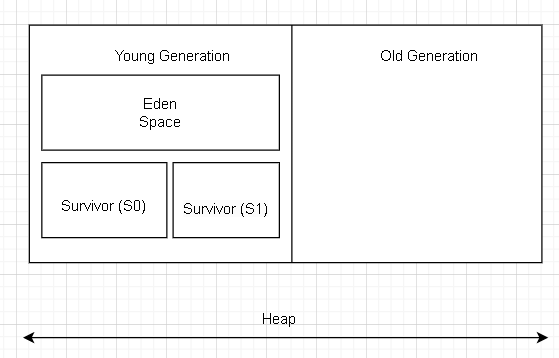
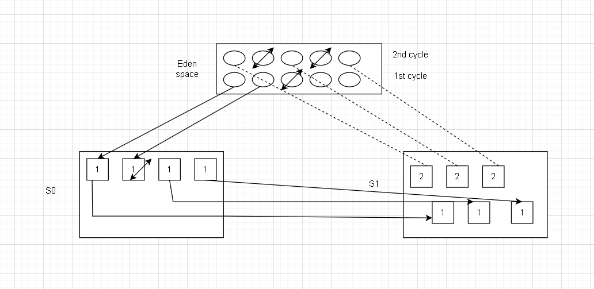
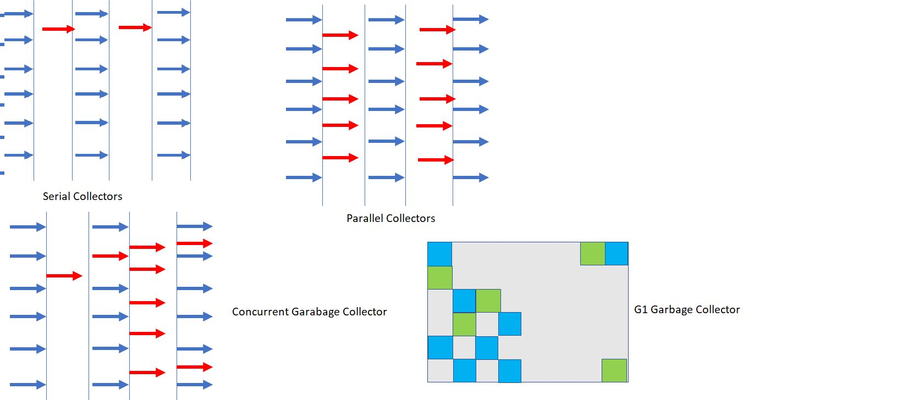

* Before Java, Memory Management must be done by the java programmer.
* But in java, it is the responsibility og Garbage Collectoe.
* Garbage Collection means remove objects that are not used any more.
           live object = reachable (referenced by some other)
           dead object = unreachable
* Most objects soon become un reachable.
* References from old objects to young objects only exists in small number.

**Basics:**

* Objects are allocated (ex: using new kwyword) in the heap of java memory.

* Static members, class definitions (metadata) are stored in permGen/Metaspace.

* Garbage collection(GC) is carried out by a daemon thread called **Garbage Collector**

* We cannot force garbage collection to happen .

* When new allocations cannot happen due to full heap you end up with **java.lang.OutOfMemoryError**. heap spaceand a lot of headaches.

**Involves:**

Mark:starts from root node ,walks the object graph and marks reachable as live.

Delete: delete unreachable objects.

Compacting: compact the memory by moving around the objects and making the allocation contiguous than fragmented.

**Generational Collectors:**

**Types of GC::**

