# Garbage Collection in Java

Garbage Collection (GC) is one of the most critical topics for FAANG interviews. It separates engineers who can merely write Java from those who can diagnose production outages, tune JVM performance, and make informed decisions about memory-intensive systems. Understanding GC internals is essential for system design discussions involving latency SLAs, throughput requirements, and capacity planning.

---

## Why Garbage Collection? The Case Against Manual Memory Management

In C/C++, developers must explicitly allocate and free memory (`malloc`/`free`, `new`/`delete`). This leads to:

- **Memory leaks** — forgetting to free memory
- **Dangling pointers** — using memory after it's freed
- **Double-free bugs** — freeing memory twice (crashes, security vulnerabilities)

Java's GC eliminates these classes of bugs entirely by **automatically reclaiming memory** that is no longer reachable from the application's root references (stack variables, static fields, JNI references).

```java
public void processOrder(Order order) {
    // temp object created on the heap
    OrderValidator validator = new OrderValidator(order);
    validator.validate();
    // After this method returns, 'validator' has no references
    // GC will reclaim it — no manual free() needed
}
```

**Key principles:**

- **Live object** = reachable from a GC root (referenced directly or transitively)
- **Dead object** = unreachable from any GC root
- GC runs on a daemon thread — you **cannot force** it (`System.gc()` is only a hint)
- When the heap is full and GC cannot reclaim enough space: `java.lang.OutOfMemoryError: Java heap space`

---

## JVM Heap Structure

The JVM divides the heap into generations based on object age. This design exploits the **Generational Hypothesis**: most objects die young.

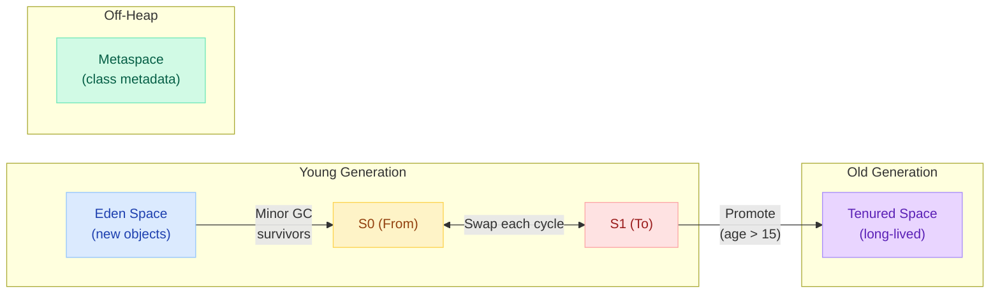
```mermaid
flowchart LR
    subgraph Young["Young Generation"]
        direction LR
        Eden["Eden Space<br/>(new objects)"]
        S0["S0 (From)"]
        S1["S1 (To)"]
    end
    subgraph Old["Old Generation"]
        Tenured["Tenured Space<br/>(long-lived)"]
    end
    subgraph OffHeap["Off-Heap"]
        Meta["Metaspace<br/>(class metadata)"]
    end

    Eden -->|"Minor GC<br/>survivors"| S0
    S0 <-->|"Swap each cycle"| S1
    S1 -->|"Promote<br/>(age > 15)"| Tenured

    style Eden fill:#DBEAFE,stroke:#93C5FD,color:#1E40AF
    style S0 fill:#FEF3C7,stroke:#FCD34D,color:#92400E
    style S1 fill:#FEE2E2,stroke:#FCA5A5,color:#991B1B
    style Tenured fill:#E9D5FF,stroke:#A78BFA,color:#5B21B6
    style Meta fill:#D1FAE5,stroke:#6EE7B7,color:#065F46
```

| Region | Purpose | Default Size |
|---|---|---|
| **Eden** | Where all new objects are born | ~76% of Young Gen |
| **Survivor S0/S1** | Hold objects that survived at least one GC | ~12% each of Young Gen |
| **Old Gen (Tenured)** | Objects that survived many GC cycles | ~2/3 of total heap |
| **Metaspace** | Class definitions, method metadata | Unbounded (off-heap, native memory) |

---

## The Generational Hypothesis

The entire design of generational GC rests on two empirical observations:

1. **Most objects die young** — temporary variables, iterators, intermediate results, request-scoped objects
2. **References from old objects to young objects are rare** — tracked via a "card table" or "remembered set"

This means focusing GC effort on the Young Generation (where most garbage is) gives the best return on investment. Collecting the entire heap every time would be extremely expensive.

```
Object Survival Rate
│
│  ████
│  ████
│  ████
│  ████░░
│  ████░░░░
│  ████░░░░░░░░░░░░░░░░░░░░░░░░░░░░░░
│  ████░░░░░░░░░░░░░░░░░░░░░░░░░░░░░░░░░░░░░░
└──────────────────────────────────────────────────── Object Age
   young                                        old

   ████ = objects that die (majority — collected cheaply)
   ░░░░ = objects that survive (minority — promoted)
```

---

## GC Process: Mark, Sweep, Compact

All GC algorithms share a fundamental three-phase approach:

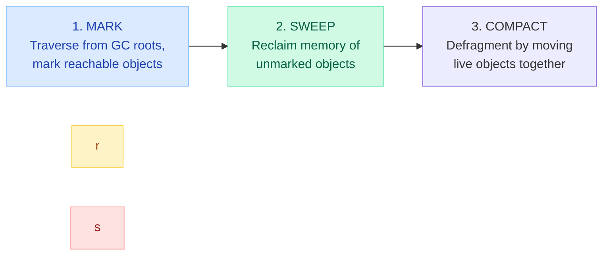
```mermaid
flowchart LR
    A["1. MARK<br/>Traverse from GC roots,<br/>mark reachable objects"] --> B["2. SWEEP<br/>Reclaim memory of<br/>unmarked objects"]
    B --> C["3. COMPACT<br/>Defragment by moving<br/>live objects together"]

    style A fill:#DBEAFE,stroke:#93C5FD,color:#1E40AF
    style B fill:#D1FAE5,stroke:#6EE7B7,color:#065F46
    style r fill:#FEF3C7,stroke:#FCD34D,color:#92400E
    style s fill:#FEE2E2,stroke:#FCA5A5,color:#991B1B
```

**BEFORE GC** — A,C,E are live; B,D,F are garbage:

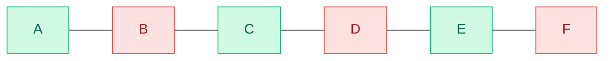
```mermaid
flowchart LR
    B1A["A"]:::live --- B1B["B"]:::dead --- B1C["C"]:::live --- B1D["D"]:::dead --- B1E["E"]:::live --- B1F["F"]:::dead
    classDef live fill:#D1FAE5,stroke:#10B981,color:#065F46
    classDef dead fill:#FEE2E2,stroke:#EF4444,color:#991B1B
```

**AFTER MARK** — reachable objects marked:

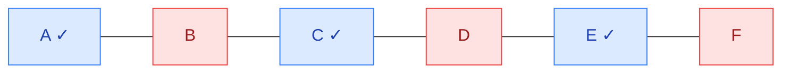
```mermaid
flowchart LR
    M2A["A ✓"]:::marked --- M2B["B"]:::dead --- M2C["C ✓"]:::marked --- M2D["D"]:::dead --- M2E["E ✓"]:::marked --- M2F["F"]:::dead
    classDef marked fill:#DBEAFE,stroke:#3B82F6,color:#1E40AF
    classDef dead fill:#FEE2E2,stroke:#EF4444,color:#991B1B
```

**AFTER SWEEP** — garbage reclaimed, memory fragmented:

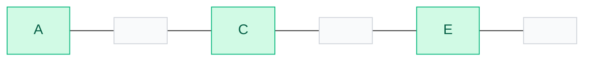
```mermaid
flowchart LR
    S3A["A"]:::live --- S3x1[" "]:::free --- S3C["C"]:::live --- S3x2[" "]:::free --- S3E["E"]:::live --- S3x3[" "]:::free
    classDef live fill:#D1FAE5,stroke:#10B981,color:#065F46
    classDef free fill:#F9FAFB,stroke:#D1D5DB,color:#D1D5DB
```

**AFTER COMPACT** — live objects moved together, contiguous free space:

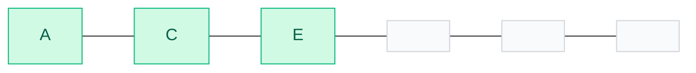
```mermaid
flowchart LR
    C4A["A"]:::live --- C4C["C"]:::live --- C4E["E"]:::live --- C4x1[" "]:::free --- C4x2[" "]:::free --- C4x3[" "]:::free
    classDef live fill:#D1FAE5,stroke:#10B981,color:#065F46
    classDef free fill:#F9FAFB,stroke:#D1D5DB,color:#D1D5DB
```

**GC Roots** (starting points for the mark phase):

- Local variables on thread stacks
- Active threads themselves
- Static fields of loaded classes
- JNI references

---

## Minor GC vs Major GC vs Full GC

| Type | Scope | Trigger | Pause |
|---|---|---|---|
| **Minor GC** | Young Generation only | Eden is full | Short (milliseconds) |
| **Major GC** | Old Generation only | Old Gen is full or occupancy threshold reached | Longer (seconds possible) |
| **Full GC** | Entire heap + Metaspace | System.gc(), heap exhaustion, promotion failure | Longest (avoid in production) |

### Object Lifecycle Through GC

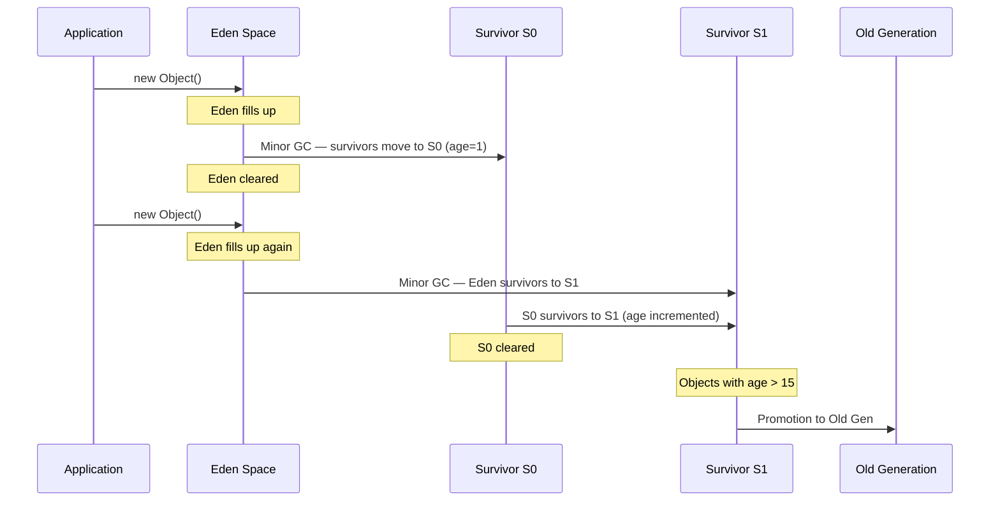
```mermaid
sequenceDiagram
    participant App as Application
    participant Eden as Eden Space
    participant S0 as Survivor S0
    participant S1 as Survivor S1
    participant Old as Old Generation

    App->>Eden: new Object()
    Note over Eden: Eden fills up
    Eden->>S0: Minor GC — survivors move to S0 (age=1)
    Note over Eden: Eden cleared
    App->>Eden: new Object()
    Note over Eden: Eden fills up again
    Eden->>S1: Minor GC — Eden survivors to S1
    S0->>S1: S0 survivors to S1 (age incremented)
    Note over S0: S0 cleared
    Note over S1: Objects with age > 15
    S1->>Old: Promotion to Old Gen
```

**Promotion threshold**: Objects that survive 15 Minor GC cycles (default, tunable with `-XX:MaxTenuringThreshold`) are promoted to Old Generation.

### Eden → S0 → S1 → Old Gen: Step-by-Step

#### Step 1: New objects allocated in Eden

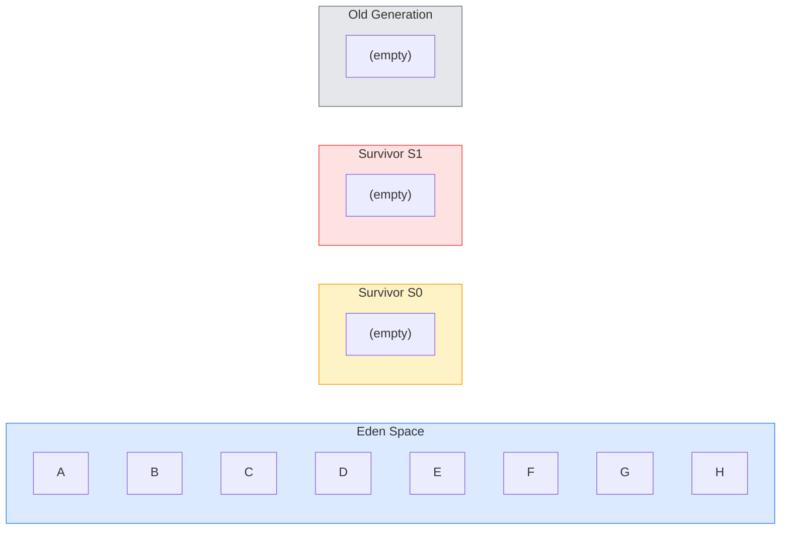
```mermaid
flowchart LR
    subgraph Eden["Eden Space"]
        A["A"] & B["B"] & C["C"] & D["D"] & E["E"] & F["F"] & G["G"] & H["H"]
    end
    subgraph S0["Survivor S0"]
        empty1["(empty)"]
    end
    subgraph S1["Survivor S1"]
        empty2["(empty)"]
    end
    subgraph Old["Old Generation"]
        empty3["(empty)"]
    end

    style Eden fill:#DBEAFE,stroke:#3B82F6
    style S0 fill:#FEF3C7,stroke:#F59E0B
    style S1 fill:#FEE2E2,stroke:#EF4444
    style Old fill:#E5E7EB,stroke:#6B7280
```

> All new objects are allocated in Eden. S0, S1, and Old Gen are empty.

#### Step 2: Eden fills up → Minor GC #1

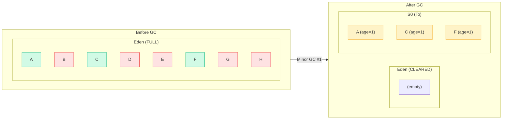
```mermaid
flowchart LR
    subgraph Before["Before GC"]
        direction LR
        subgraph Eden1["Eden (FULL)"]
            A1["A"]:::live
            B1["B"]:::dead
            C1["C"]:::live
            D1["D"]:::dead
            E1["E"]:::dead
            F1["F"]:::live
            G1["G"]:::dead
            H1["H"]:::dead
        end
    end

    Before -->|"Minor GC #1"| After

    subgraph After["After GC"]
        direction LR
        subgraph Eden2["Eden (CLEARED)"]
            x1["(empty)"]
        end
        subgraph S0a["S0 (To)"]
            A2["A (age=1)"]:::promoted
            C2["C (age=1)"]:::promoted
            F2["F (age=1)"]:::promoted
        end
    end

    classDef live fill:#D1FAE5,stroke:#10B981
    classDef dead fill:#FEE2E2,stroke:#EF4444
    classDef promoted fill:#FEF3C7,stroke:#F59E0B
```

> Dead objects (B,D,E,G,H) are swept. Survivors copied to S0 with age=1.

#### Step 3: New objects fill Eden → Minor GC #2

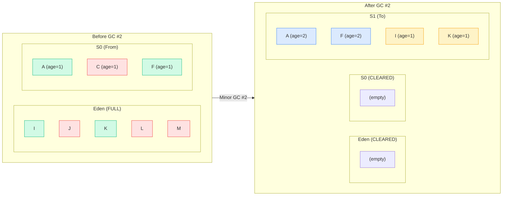
```mermaid
flowchart LR
    subgraph Before2["Before GC #2"]
        direction LR
        subgraph Eden3["Eden (FULL)"]
            I1["I"]:::live
            J1["J"]:::dead
            K1["K"]:::live
            L1["L"]:::dead
            M1["M"]:::dead
        end
        subgraph S0b["S0 (From)"]
            A3["A (age=1)"]:::live
            C3["C (age=1)"]:::dead
            F3["F (age=1)"]:::live
        end
    end

    Before2 -->|"Minor GC #2"| After2

    subgraph After2["After GC #2"]
        direction LR
        subgraph Eden4["Eden (CLEARED)"]
            x2["(empty)"]
        end
        subgraph S0c["S0 (CLEARED)"]
            x3["(empty)"]
        end
        subgraph S1a["S1 (To)"]
            A4["A (age=2)"]:::old
            F4["F (age=2)"]:::old
            I2["I (age=1)"]:::promoted
            K2["K (age=1)"]:::promoted
        end
    end

    classDef live fill:#D1FAE5,stroke:#10B981
    classDef dead fill:#FEE2E2,stroke:#EF4444
    classDef promoted fill:#FEF3C7,stroke:#F59E0B
    classDef old fill:#DBEAFE,stroke:#3B82F6
```

> S0 and S1 **swap roles** every cycle. ALL survivors move to the "To" space.

#### Step 4: After many cycles → Promotion to Old Gen

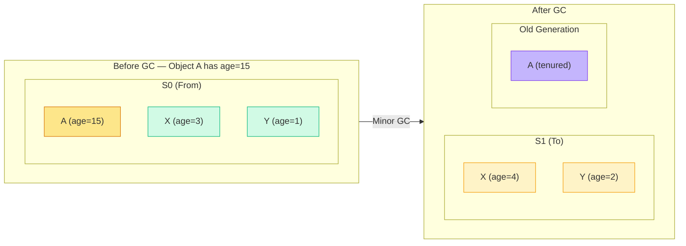
```mermaid
flowchart LR
    subgraph Before3["Before GC — Object A has age=15"]
        direction LR
        subgraph S0d["S0 (From)"]
            A5["A (age=15)"]:::promote
            X1["X (age=3)"]:::live
            Y1["Y (age=1)"]:::live
        end
    end

    Before3 -->|"Minor GC"| After3

    subgraph After3["After GC"]
        direction LR
        subgraph S1b["S1 (To)"]
            X2a["X (age=4)"]:::promoted
            Y2a["Y (age=2)"]:::promoted
        end
        subgraph OldGen["Old Generation"]
            A6["A (tenured)"]:::tenured
        end
    end

    classDef promote fill:#FDE68A,stroke:#D97706
    classDef live fill:#D1FAE5,stroke:#10B981
    classDef promoted fill:#FEF3C7,stroke:#F59E0B
    classDef tenured fill:#C4B5FD,stroke:#7C3AED
```

> Object A survived 15 GC cycles (MaxTenuringThreshold) → **promoted to Old Generation** permanently.

**Key rules of Survivor spaces:**

- One Survivor space is **always empty** (the "To" space)
- Survivors are copied between S0 and S1 every Minor GC (copying collector)
- The empty space becomes "To", the occupied space becomes "From"
- Objects too large for Survivor go directly to Old Gen ("premature promotion")

### How Minor GC Works — Internal Mechanics

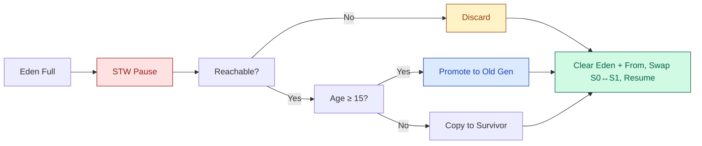
```mermaid
flowchart LR
    A["Eden Full"] --> B["STW Pause"]
    B --> C["Reachable?"]
    C -->|No| D["Discard"]
    C -->|Yes| E["Age ≥ 15?"]
    E -->|Yes| F["Promote to Old Gen"]
    E -->|No| G["Copy to Survivor"]
    D & F & G --> H["Clear Eden + From, Swap S0↔S1, Resume"]

    style B fill:#FEE2E2,stroke:#991B1B,color:#991B1B
    style D fill:#FEF3C7,stroke:#92400E,color:#92400E
    style F fill:#DBEAFE,stroke:#1E40AF,color:#1E40AF
    style H fill:#D1FAE5,stroke:#065F46,color:#065F46
```

### GC Types — Visual Comparison

| Collector | Threads | Pause Type | Heap Size | Best For | JVM Flag | Default In |
|-----------|---------|-----------|-----------|----------|----------|-----------|
| **Serial GC** | Single | Full STW | < 100MB | Client apps, single-core | `-XX:+UseSerialGC` | — |
| **Parallel GC** | Multiple | Full STW (shorter) | 100MB–8GB | Batch jobs, max throughput | `-XX:+UseParallelGC` | Java 8 |
| **G1 GC** | Multiple | Short, predictable | 4GB–64GB | Microservices, web apps | `-XX:+UseG1GC` | Java 9+ |
| **ZGC** | Concurrent | < 1ms (any heap) | 8MB–16TB | Trading, real-time systems | `-XX:+UseZGC` | — (Java 15+) |
| **Shenandoah** | Concurrent | < 10ms | Large | Low-latency, Red Hat | `-XX:+UseShenandoahGC` | — (Java 12+) |


```mermaid
%%{init: {'theme': 'base', 'themeVariables': {'fontSize': '14px'}}}%%
gantt
    title GC Pause Behavior — Timeline Comparison
    dateFormat X
    axisFormat %s

    section Serial GC
    App Running           :done, 0, 3
    STW (1 thread)        :crit, 3, 8
    App Running           :done, 8, 12

    section Parallel GC
    App Running           :done, 0, 3
    STW (N threads)       :crit, 3, 6
    App Running           :done, 6, 12

    section G1 GC
    App Running           :done, 0, 2
    Init Mark (STW)       :crit, 2, 3
    Concurrent Mark       :active, 3, 8
    Remark (STW)          :crit, 8, 9
    App Running           :done, 9, 12

    section ZGC
    App Running           :done, 0, 1
    Pause (<1ms)          :crit, 1, 1
    Concurrent (all work) :active, 1, 11
    Pause (<1ms)          :crit, 11, 11
    App Running           :done, 11, 12
```

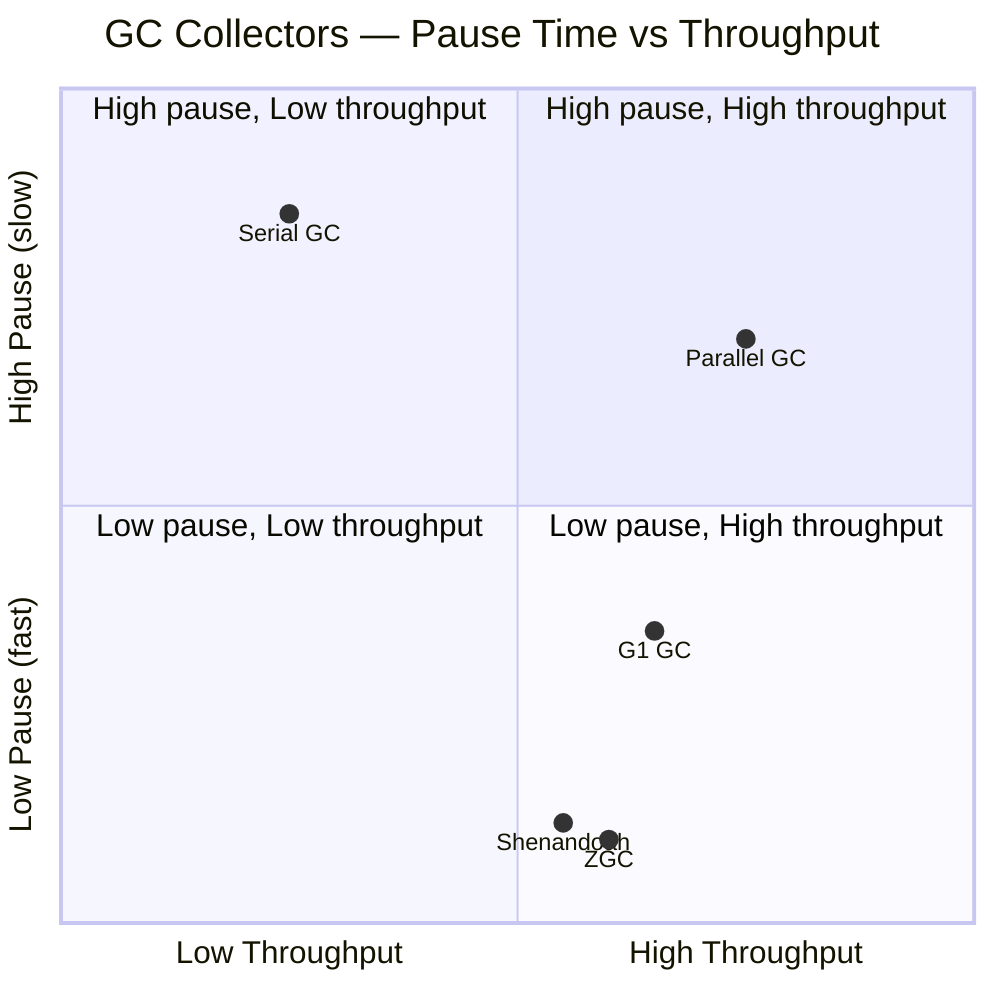
```mermaid
quadrantChart
    title GC Collectors — Pause Time vs Throughput
    x-axis "Low Throughput" --> "High Throughput"
    y-axis "Low Pause (fast)" --> "High Pause (slow)"
    quadrant-1 "High pause, High throughput"
    quadrant-2 "High pause, Low throughput"
    quadrant-3 "Low pause, Low throughput"
    quadrant-4 "Low pause, High throughput"
    Serial GC: [0.25, 0.85]
    Parallel GC: [0.75, 0.70]
    G1 GC: [0.65, 0.35]
    ZGC: [0.60, 0.10]
    Shenandoah: [0.55, 0.12]
```

> **Evolution**: Serial → Parallel → G1 → ZGC/Shenandoah = progressively lower pauses. Trade-off: lower pauses require more CPU for concurrent GC bookkeeping.

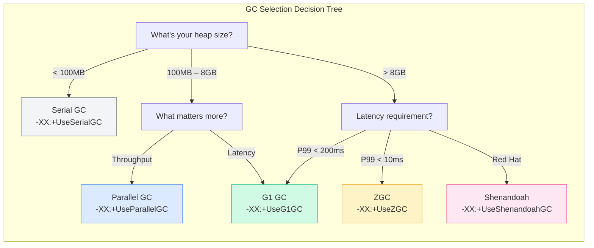
```mermaid
flowchart TD
    subgraph "GC Selection Decision Tree"
        direction TB
        Q1["What's your heap size?"]
        Q1 -->|"< 100MB"| Serial["Serial GC<br/>-XX:+UseSerialGC"]
        Q1 -->|"100MB – 8GB"| Q2["What matters more?"]
        Q1 -->|"> 8GB"| Q3["Latency requirement?"]
        Q2 -->|"Throughput"| Parallel["Parallel GC<br/>-XX:+UseParallelGC"]
        Q2 -->|"Latency"| G1["G1 GC<br/>-XX:+UseG1GC"]
        Q3 -->|"P99 < 10ms"| ZGC["ZGC<br/>-XX:+UseZGC"]
        Q3 -->|"P99 < 200ms"| G1
        Q3 -->|"Red Hat"| Shen["Shenandoah<br/>-XX:+UseShenandoahGC"]
    end

    style Serial fill:#F3F4F6,stroke:#6B7280
    style Parallel fill:#DBEAFE,stroke:#3B82F6
    style G1 fill:#D1FAE5,stroke:#10B981
    style ZGC fill:#FEF3C7,stroke:#F59E0B
    style Shen fill:#FCE7F3,stroke:#EC4899
```

### G1 GC Region Layout


```mermaid
flowchart LR
    E1["E"]:::eden --- E2["E"]:::eden --- S1["S"]:::surv --- O1["O"]:::old --- O2["O"]:::old --- H1["H"]:::humon --- H2["H"]:::humon --- O3["O"]:::old --- F1["-"]:::free --- E3["E"]:::eden

    classDef eden fill:#DBEAFE,stroke:#3B82F6,color:#1E40AF
    classDef surv fill:#FEF3C7,stroke:#F59E0B,color:#92400E
    classDef old fill:#E5E7EB,stroke:#6B7280,color:#374151
    classDef humon fill:#FCE7F3,stroke:#EC4899,color:#9D174D
    classDef free fill:#FFFFFF,stroke:#D1D5DB,color:#9CA3AF
```

**E** = Eden | **S** = Survivor | **O** = Old | **H** = Humongous (>50% region) | **-** = Free

> Regions are NOT contiguous by type. G1 picks regions with the MOST garbage to collect first — maximizes reclaimed space per pause.

### ZGC — Colored Pointers

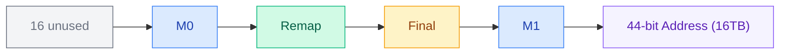
```mermaid
flowchart LR
    U["16 unused"]:::unused --> M0["M0"]:::mark --> R["Remap"]:::remap --> FN["Final"]:::final --> M1["M1"]:::mark --> ADDR["44-bit Address (16TB)"]:::addr

    classDef unused fill:#F3F4F6,stroke:#6B7280,color:#6B7280
    classDef mark fill:#DBEAFE,stroke:#3B82F6,color:#1E40AF
    classDef remap fill:#D1FAE5,stroke:#10B981,color:#065F46
    classDef final fill:#FEF3C7,stroke:#F59E0B,color:#92400E
    classDef addr fill:#F5F3FF,stroke:#8B5CF6,color:#5B21B6
```

| Bit | Purpose |
|-----|---------|
| **M0/M1** | Marked — alternates between GC cycles |
| **Remap** | Object relocated — reference needs update |
| **Final** | Needs finalization before reclaim |

**Load barrier**: on every object reference load, checks color bits. If stale → self-heals the reference. No STW needed.

---

## GC Algorithms

### 1. Serial GC

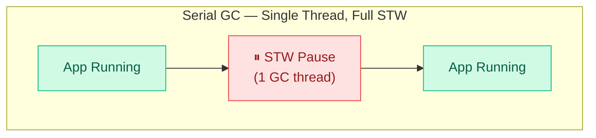
```mermaid
flowchart LR
    subgraph Serial["Serial GC — Single Thread, Full STW"]
        direction LR
        A1["App Running"]:::app --> P1["⏸ STW Pause<br/>(1 GC thread)"]:::stw --> A2["App Running"]:::app
    end
    classDef app fill:#D1FAE5,stroke:#10B981,color:#065F46
    classDef stw fill:#FEE2E2,stroke:#EF4444,color:#991B1B
```

- **Flag**: `-XX:+UseSerialGC`
- **Best for**: Single-CPU, small heaps (<100MB), client apps
- **Algorithm**: Mark-Copy (Young) + Mark-Sweep-Compact (Old)

### 2. Parallel GC (Throughput Collector)

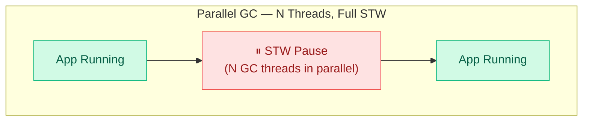
```mermaid
flowchart LR
    subgraph Parallel["Parallel GC — N Threads, Full STW"]
        direction LR
        A1["App Running"]:::app --> P1["⏸ STW Pause<br/>(N GC threads in parallel)"]:::stw --> A2["App Running"]:::app
    end
    classDef app fill:#D1FAE5,stroke:#10B981,color:#065F46
    classDef stw fill:#FEE2E2,stroke:#EF4444,color:#991B1B
```

- **Flag**: `-XX:+UseParallelGC` (default Java 8)
- **Best for**: Batch processing, data pipelines, throughput > latency
- **Tuning**: `-XX:ParallelGCThreads=N`, `-XX:GCTimeRatio=99`

### 3. CMS (Concurrent Mark-Sweep) — Deprecated

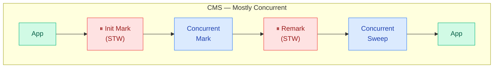
```mermaid
flowchart LR
    subgraph CMS["CMS — Mostly Concurrent"]
        direction LR
        A1["App"]:::app --> IM["⏸ Init Mark<br/>(STW)"]:::stw --> CM["Concurrent<br/>Mark"]:::conc --> RM["⏸ Remark<br/>(STW)"]:::stw --> CS["Concurrent<br/>Sweep"]:::conc --> A2["App"]:::app
    end
    classDef app fill:#D1FAE5,stroke:#10B981,color:#065F46
    classDef stw fill:#FEE2E2,stroke:#EF4444,color:#991B1B
    classDef conc fill:#DBEAFE,stroke:#3B82F6,color:#1E40AF
```

- **Flag**: `-XX:+UseConcMarkSweepGC` (removed Java 14)
- **Problems**: No compaction → fragmentation, concurrent mode failure

### 4. G1 GC (Garbage-First) — Default Since Java 9

```mermaid
flowchart LR
    subgraph G1["G1 — Region-based, Predictable Pauses"]
        direction LR
        A1["App"]:::app --> YGC["⏸ Young GC<br/>(evacuate regions)"]:::stw --> A2["App"]:::app --> MIX["⏸ Mixed GC<br/>(Young + Old regions)"]:::stw --> A3["App"]:::app
    end
    classDef app fill:#D1FAE5,stroke:#10B981,color:#065F46
    classDef stw fill:#FEF3C7,stroke:#F59E0B,color:#92400E
```

- **Flag**: `-XX:+UseG1GC` (default Java 9+), `-XX:MaxGCPauseMillis=200`
- **Key**: Heap split into equal regions (E/S/O/H), collects regions with most garbage first
- **Phases**: Young-only → Space reclamation (mixed) → Full GC (rare fallback)

### 5. ZGC (Z Garbage Collector) — Ultra-Low Latency

```mermaid
flowchart LR
    subgraph ZGC["ZGC — Fully Concurrent, < 1ms Pauses"]
        direction LR
        A1["App"]:::app --> P1["⏸<br/>< 1ms"]:::stw --> CW["Concurrent relocation<br/>+ remapping"]:::conc --> P2["⏸<br/>< 1ms"]:::stw --> A2["App"]:::app
    end
    classDef app fill:#D1FAE5,stroke:#10B981,color:#065F46
    classDef stw fill:#FEE2E2,stroke:#EF4444,color:#991B1B
    classDef conc fill:#DBEAFE,stroke:#3B82F6,color:#1E40AF
```

- **Flag**: `-XX:+UseZGC` (production Java 15+, heaps 8MB–16TB)
- **Key**: Colored pointers, load barriers, concurrent compaction
- **Best for**: Trading systems, real-time services, large in-memory caches

### 6. Shenandoah GC

- **Flag**: `-XX:+UseShenandoahGC` (Java 12+, backported to 8/11)
- **Key difference from ZGC**: Brooks forwarding pointers (extra word per object). Works on 32-bit JVMs.
- **Similar goals**: Low pause, concurrent compaction. Developed by Red Hat.

---

## GC Algorithm Comparison

| Algorithm | Pause Time | Throughput | Heap Size | Use Case | Java Version |
|---|---|---|---|---|---|
| **Serial** | High (full STW) | Low | Small (<100MB) | Client apps, single-core | All |
| **Parallel** | Medium (STW, multi-threaded) | **Highest** | Medium-Large | Batch jobs, data processing | Default in Java 8 |
| **CMS** | Low (mostly concurrent) | Medium | Medium-Large | Web apps (deprecated) | Removed in Java 14 |
| **G1** | **Predictable** (target-based) | High | Large (4GB-64GB) | General purpose, microservices | Default since Java 9 |
| **ZGC** | **Ultra-low** (<1ms) | High | Very Large (up to 16TB) | Latency-critical systems | Production since Java 15 |
| **Shenandoah** | **Ultra-low** (<10ms) | High | Large | Low-latency, Red Hat ecosystem | Java 12+ (backported) |

---

## GC Tuning: Key JVM Flags

### Essential Flags

```bash
# Heap sizing
-Xms4g                         # Initial heap size (set equal to -Xmx to avoid resizing)
-Xmx4g                         # Maximum heap size

# GC algorithm selection
-XX:+UseG1GC                   # Use G1 (default in Java 9+)
-XX:+UseZGC                    # Use ZGC (Java 15+)
-XX:+UseParallelGC             # Use Parallel GC

# G1 tuning
-XX:MaxGCPauseMillis=200       # Target max pause (G1 will try to meet this)
-XX:G1HeapRegionSize=16m       # Region size (1MB-32MB, power of 2)
-XX:InitiatingHeapOccupancyPercent=45  # Start mixed GC when Old Gen is 45% full

# Generational tuning
-XX:NewRatio=2                 # Old:Young = 2:1 (Old Gen is 2/3 of heap)
-XX:SurvivorRatio=8            # Eden:Survivor = 8:1:1
-XX:MaxTenuringThreshold=15    # Promote to Old Gen after 15 cycles

# Metaspace
-XX:MetaspaceSize=256m         # Initial metaspace size
-XX:MaxMetaspaceSize=512m      # Cap metaspace growth
```

### GC Logging (Java 9+ Unified Logging)

```bash
# Enable GC logging
-Xlog:gc*:file=gc.log:time,uptime,level,tags:filecount=5,filesize=10m

# Detailed GC logging for analysis
-Xlog:gc+heap=debug:file=gc-detail.log

# Legacy (Java 8)
-XX:+PrintGCDetails -XX:+PrintGCDateStamps -Xloggc:gc.log
```

### Production Recommendations

```bash
# Microservice (low-latency, 4GB heap)
java -Xms4g -Xmx4g -XX:+UseG1GC -XX:MaxGCPauseMillis=100 \
     -Xlog:gc*:file=gc.log:time:filecount=5,filesize=10m \
     -jar service.jar

# High-throughput batch job (16GB heap)
java -Xms16g -Xmx16g -XX:+UseParallelGC -XX:ParallelGCThreads=8 \
     -jar batch-job.jar

# Ultra-low-latency trading system (32GB heap)
java -Xms32g -Xmx32g -XX:+UseZGC \
     -Xlog:gc*:file=gc.log:time:filecount=5,filesize=10m \
     -jar trading-engine.jar
```

---

## Reading GC Logs

### Sample G1 GC Log Entry

```
[2024-01-15T10:30:45.123+0000][info][gc] GC(42) Pause Young (Normal)
    (G1 Evacuation Pause) 1024M->256M(4096M) 12.345ms
```

**Breakdown:**

| Field | Meaning |
|---|---|
| `GC(42)` | 42nd GC event since JVM start |
| `Pause Young (Normal)` | Minor GC triggered normally (Eden full) |
| `1024M->256M` | Heap usage: before -> after |
| `(4096M)` | Total heap capacity |
| `12.345ms` | Pause duration |

### Warning Signs in GC Logs

| Pattern | Problem | Action |
|---|---|---|
| Frequent Full GC | Heap too small or memory leak | Increase heap or investigate leak |
| `to-space exhausted` | Survivor space overflow | Increase survivor ratio or heap |
| Increasing Old Gen after Full GC | Memory leak | Heap dump analysis |
| Long pause times (>500ms) | GC tuning needed | Switch to G1/ZGC, tune pause target |
| `Concurrent mode failure` (CMS) | Old Gen fills during concurrent phase | Increase heap, lower IHOP threshold |

### Analysis Tools

- **GCViewer** — open-source desktop tool for visualizing GC logs
- **GCEasy** (gceasy.io) — web-based GC log analyzer with recommendations
- **JVisualVM** — real-time monitoring with GC plugin
- **Eclipse MAT** — memory analyzer for heap dumps
- **jstat** — command-line GC statistics: `jstat -gcutil <pid> 1000`

---

## Common Memory Issues and Troubleshooting

### 1. Memory Leaks

Objects that are still referenced but never used again — GC cannot collect them.

```java
// Classic leak: static collection that grows forever
public class LeakyCache {
    private static final Map<String, Object> cache = new HashMap<>();

    public void addToCache(String key, Object value) {
        cache.put(key, value);  // Never removed — grows until OOM
    }
}

// Fix: Use WeakHashMap, bounded cache, or explicit eviction
private static final Map<String, Object> cache =
    Collections.synchronizedMap(new LinkedHashMap<>(1000, 0.75f, true) {
        protected boolean removeEldestEntry(Map.Entry eldest) {
            return size() > 1000;
        }
    });
```

**Common leak sources:**

- Unclosed resources (connections, streams, cursors)
- Static collections without eviction
- Listeners/callbacks never deregistered
- ThreadLocal variables not removed
- ClassLoader leaks (common in app servers)

### 2. OutOfMemoryError Variants

| Error | Cause | Fix |
|---|---|---|
| `Java heap space` | Heap is full, GC cannot reclaim enough | Increase `-Xmx`, fix leak, reduce object creation |
| `GC overhead limit exceeded` | >98% time spent in GC, <2% heap recovered | Same as above — GC is thrashing |
| `Metaspace` | Too many classes loaded (dynamic proxies, reflection) | Increase `-XX:MaxMetaspaceSize`, check classloader leaks |
| `Unable to create native thread` | OS thread limit reached | Reduce thread count, increase `ulimit -u` |
| `Direct buffer memory` | NIO direct buffers exhausted | Increase `-XX:MaxDirectMemorySize` |

### 3. Long GC Pauses — Production Troubleshooting

**Scenario**: "Your service's P99 latency spikes to 5 seconds every few minutes. What do you do?"

**Step-by-step approach:**

1. **Confirm it's GC**: Check GC logs for pauses correlating with latency spikes
2. **Identify GC type**: Minor GC pauses (usually OK) vs Full GC (problematic)
3. **Check heap usage pattern**: `jstat -gcutil <pid> 1000`
4. **Analyze**: Feed logs into GCEasy or GCViewer
5. **Common fixes**:
    - If Full GC is frequent: likely memory leak or undersized heap
    - If Minor GC is long: too much surviving data, increase Young Gen
    - If promotion failure: Old Gen cannot accommodate promoted objects
    - Switch to G1 with pause time target, or ZGC for sub-ms pauses

```bash
# Quick diagnosis commands
jstat -gcutil <pid> 1000      # GC stats every second
jmap -histo:live <pid>         # Object histogram (triggers Full GC!)
jmap -dump:live,format=b,file=heap.hprof <pid>  # Heap dump for analysis
jcmd <pid> GC.heap_info       # Heap region info (no GC triggered)
```

---

## Interview Questions

??? question "1. Explain the Generational Hypothesis. Why does Java divide the heap into generations?"
    The Generational Hypothesis states that (1) most objects die young and (2) old-to-young references are rare. Java exploits this by concentrating GC effort on the Young Generation where most garbage exists. This means Minor GCs (which only scan Young Gen) are fast and frequent, while expensive Full GCs (entire heap) are rare. Without generations, every GC would scan the entire heap — unacceptable for large applications.

??? question "2. What is the difference between Minor GC, Major GC, and Full GC? When does each occur?"
    **Minor GC** collects only the Young Generation (triggered when Eden is full) — fast, millisecond pauses. **Major GC** collects the Old Generation (triggered when Old Gen reaches occupancy threshold) — can be concurrent (G1, CMS) or STW. **Full GC** collects the entire heap plus Metaspace — the most expensive, triggered by `System.gc()`, promotion failure, or when concurrent collection cannot keep up. In production, Full GC should be rare; frequent Full GCs indicate a memory leak or undersized heap.

??? question "3. How does G1 GC achieve predictable pause times?"
    G1 divides the heap into equal-sized regions (1-32MB). Instead of collecting the entire Old Generation, it tracks the **liveness ratio** of each region and collects the regions with the most garbage first (hence "Garbage-First"). It maintains a **pause time target** (`MaxGCPauseMillis`) and selects only enough regions to fit within that budget. It uses **concurrent marking** to identify garbage without stopping the app, then evacuates (copies) live objects from selected regions during a controlled STW pause.

??? question "4. Your production service has P99 latency spikes of 3-5 seconds every 2 minutes. How do you diagnose and fix this?"
    First, enable GC logging (`-Xlog:gc*`) and correlate pause events with latency spikes. If Full GCs are occurring, check for memory leaks (heap dump with `jmap`, analyze with Eclipse MAT). If the heap is simply too small, increase `-Xmx`. If using Parallel GC, switch to G1 with `-XX:MaxGCPauseMillis=100`. If Old Gen is growing steadily, look for a leak — objects staying in memory longer than expected (static maps, unclosed resources, listener leaks). For truly latency-critical services, consider ZGC which guarantees sub-millisecond pauses regardless of heap size.

??? question "5. When would you choose ZGC over G1? What are the trade-offs?"
    Choose ZGC when: (1) you have strict latency requirements (P99 < 10ms), (2) large heaps (tens of GB), (3) you cannot tolerate any GC pauses >1ms. Trade-offs: ZGC uses more CPU for its concurrent work (load barriers on every reference load), slightly higher memory overhead (colored pointers, multi-mapping), and was single-generation until Java 21 (Generational ZGC). G1 is better for general-purpose workloads where 50-200ms pauses are acceptable and maximum throughput is more important.

??? question "6. Explain the Mark-Sweep-Compact process. Why is compaction necessary?"
    **Mark**: Starting from GC roots (stack variables, static fields), traverse the object graph and mark all reachable objects as live. **Sweep**: Reclaim memory occupied by unmarked (dead) objects. **Compact**: Move surviving objects together to eliminate fragmentation. Without compaction, the heap becomes fragmented — you might have enough total free space for a large allocation but no single contiguous block big enough. Fragmentation forces premature Full GCs and degrades allocation performance. Compaction is expensive (requires updating all references) but essential for long-running applications.

??? question "7. What JVM flags would you set for a microservice handling 10K requests/second with a 100ms P99 latency SLA?"
    `-Xms4g -Xmx4g` (set equal to avoid resize pauses), `-XX:+UseG1GC` (predictable pauses), `-XX:MaxGCPauseMillis=50` (leave margin below 100ms SLA), `-XX:+AlwaysPreTouch` (commit memory pages at startup), `-Xlog:gc*:file=gc.log:time:filecount=5,filesize=10m` (for diagnostics). If 50ms is still too high, consider ZGC. Always set `-Xms` equal to `-Xmx` to prevent heap resizing under load. Monitor with `jstat` and analyze logs with GCEasy to validate tuning.

??? question "8. How can you identify a memory leak in a Java application? Walk through your approach."
    (1) **Symptom**: Old Gen usage grows over time, Full GCs become more frequent, eventually OOM. (2) **Confirm**: Monitor with `jstat -gcutil` — if Old Gen usage after Full GC keeps increasing, it's a leak. (3) **Capture**: Take heap dumps at intervals: `jmap -dump:live,format=b,file=heap1.hprof <pid>`, wait, take another. (4) **Analyze**: Open in Eclipse MAT, use "Leak Suspects" report. Look at dominator tree and histogram diff between dumps. (5) **Common culprits**: Static maps/caches without eviction, unclosed database connections, event listeners never deregistered, ThreadLocal not cleaned up, class loader leaks in web containers.
