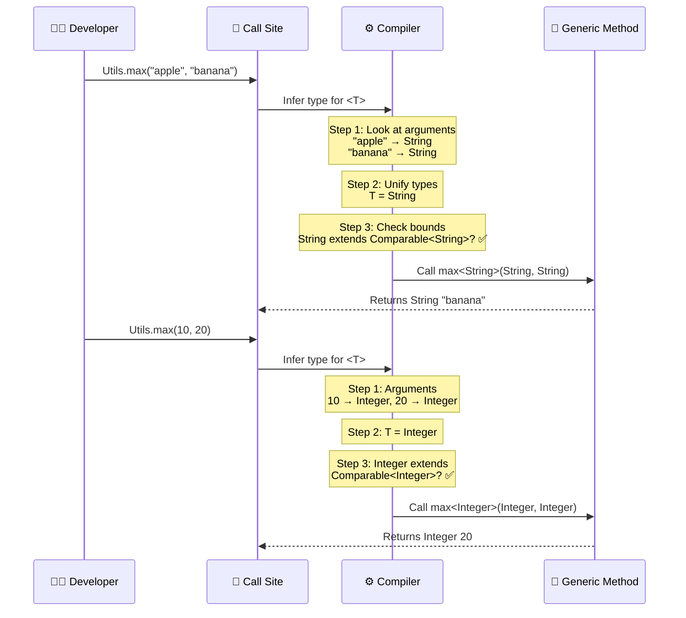
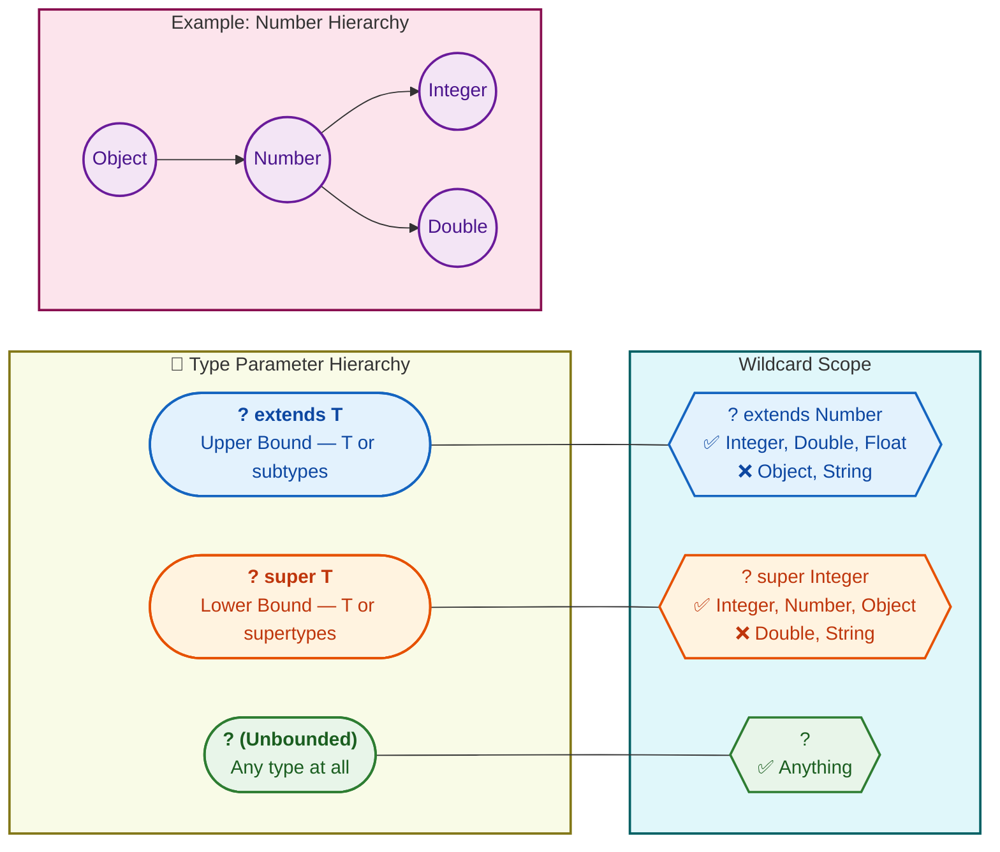
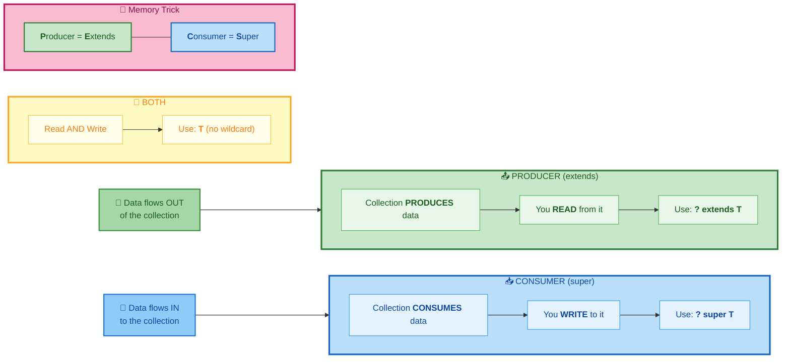
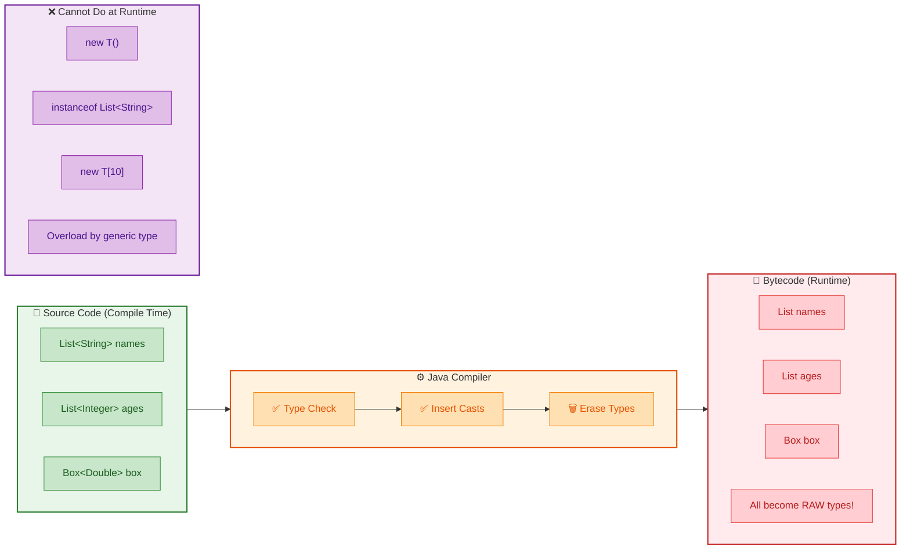
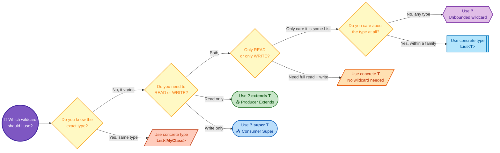

# Generics in Java

Generics allow you to write **type-safe, reusable code** that works with any object type. Without generics, you'd cast everything from `Object` and pray for no `ClassCastException` at runtime.

---

## Why Generics Exist

```java
// BEFORE generics (Java 1.4) — no type safety
List list = new ArrayList();
list.add("Hello");
list.add(42);  // no compile error — anything goes
String s = (String) list.get(1);  // ClassCastException at RUNTIME!

// WITH generics (Java 5+) — compile-time safety
List<String> list = new ArrayList<>();
list.add("Hello");
list.add(42);  // COMPILE ERROR — caught early
String s = list.get(0);  // no cast needed
```

---

## Generic Classes

```java
public class Box<T> {
    private T value;

    public Box(T value) { this.value = value; }
    public T getValue() { return value; }
    public void setValue(T value) { this.value = value; }
}

Box<String> stringBox = new Box<>("Hello");
Box<Integer> intBox = new Box<>(42);

String s = stringBox.getValue();  // no cast — compiler knows it's String
```

### Multiple Type Parameters

```java
public class Pair<K, V> {
    private K key;
    private V value;

    public Pair(K key, V value) {
        this.key = key;
        this.value = value;
    }

    public K getKey() { return key; }
    public V getValue() { return value; }
}

Pair<String, Integer> entry = new Pair<>("age", 27);
```

---

## Generic Methods

A method can have its own type parameters, independent of the class.



```java
public class Utils {
    public static <T> List<T> listOf(T... elements) {
        return Arrays.asList(elements);
    }

    public static <T extends Comparable<T>> T max(T a, T b) {
        return a.compareTo(b) >= 0 ? a : b;
    }
}

List<String> names = Utils.listOf("Java", "Go", "Rust");
String bigger = Utils.max("apple", "banana");  // "banana"
int larger = Utils.max(10, 20);                 // 20
```

---

## Bounded Type Parameters

Restrict what types can be used with generics.



### Upper bound (`extends`) — "T must be a subtype of X"

```java
// T must implement Comparable
public static <T extends Comparable<T>> void sort(List<T> list) {
    Collections.sort(list);
}

// T must extend Number
public static <T extends Number> double sum(List<T> list) {
    return list.stream().mapToDouble(Number::doubleValue).sum();
}

sum(List.of(1, 2, 3));       // works — Integer extends Number
sum(List.of(1.5, 2.5));      // works — Double extends Number
sum(List.of("a", "b"));      // COMPILE ERROR — String doesn't extend Number
```

### Multiple bounds

```java
// T must extend Number AND implement Comparable
public static <T extends Number & Comparable<T>> T max(T a, T b) {
    return a.compareTo(b) >= 0 ? a : b;
}
```

---

## Wildcards (`?`)

Wildcards are used when you **don't know or don't care** about the specific type.

### `?` — Unbounded wildcard

```java
public static void printAll(List<?> list) {
    for (Object item : list) {
        System.out.println(item);
    }
}

printAll(List.of("A", "B"));  // works
printAll(List.of(1, 2, 3));   // works
```

### `? extends T` — Upper bounded (read-only / producer)

"I accept any list of T **or its subtypes**."

```java
public static double sum(List<? extends Number> list) {
    double total = 0;
    for (Number n : list) {
        total += n.doubleValue();
    }
    return total;
}

sum(List.of(1, 2, 3));           // List<Integer> — works
sum(List.of(1.5, 2.5));          // List<Double> — works
```

You can **read** from it (as Number), but you **cannot add** to it (compiler doesn't know the exact subtype).

### `? super T` — Lower bounded (write-only / consumer)

"I accept any list of T **or its supertypes**."

```java
public static void addNumbers(List<? super Integer> list) {
    list.add(1);
    list.add(2);
    list.add(3);
}

addNumbers(new ArrayList<Integer>());  // works
addNumbers(new ArrayList<Number>());   // works
addNumbers(new ArrayList<Object>());   // works
```

You can **write** T to it, but when **reading** you only get `Object`.

### PECS — Producer Extends, Consumer Super



| Direction | Use | Example |
|---|---|---|
| **Read** from the collection | `? extends T` | `List<? extends Number>` — read as Number |
| **Write** to the collection | `? super T` | `List<? super Integer>` — write Integer |
| **Both read and write** | `T` (no wildcard) | `List<T>` |

```java
// Real-world: Collections.copy() uses PECS
public static <T> void copy(List<? super T> dest, List<? extends T> src) {
    for (T item : src) {   // read from src (extends = producer)
        dest.add(item);     // write to dest (super = consumer)
    }
}
```

---

## Type Erasure

Java generics are a **compile-time feature**. At runtime, all generic type information is **erased**.



```java
// What you write:
List<String> list = new ArrayList<>();

// What the JVM sees at runtime:
List list = new ArrayList();  // just raw List
```

### Consequences of Type Erasure

| What you can't do | Why |
|---|---|
| `new T()` | JVM doesn't know what T is at runtime |
| `T[] array = new T[10]` | Can't create generic arrays |
| `instanceof List<String>` | Type info erased — only `instanceof List` works |
| Overload methods by generic type | `void process(List<String>)` and `void process(List<Integer>)` have the same erasure |

```java
// This WON'T compile — both methods have the same erasure
void process(List<String> list) {}
void process(List<Integer> list) {}  // COMPILE ERROR — same erasure: process(List)
```

---

## Common Generic Naming Conventions

| Letter | Meaning | Example |
|---|---|---|
| `T` | Type | `Box<T>` |
| `E` | Element | `List<E>` |
| `K` | Key | `Map<K, V>` |
| `V` | Value | `Map<K, V>` |
| `N` | Number | `Calculator<N extends Number>` |
| `R` | Return type | `Function<T, R>` |

---

## Wildcard Decision Tree

Use this flowchart in interviews to quickly decide which wildcard to use:



---

## Interview Questions

??? question "1. What is type erasure and why does it matter?"
    At compile time, Java checks generic types for safety. At runtime, all generic type info is **removed** (replaced with `Object` or the bound). This means you can't do `new T()`, `instanceof List<String>`, or create generic arrays. It matters because it limits what you can do with generics at runtime and is why you sometimes see `Class<T>` passed as a parameter for reflective operations.

??? question "2. What is the difference between `List<Object>` and `List<?>`?"
    `List<Object>` — you can add any object, but `List<String>` is NOT assignable to it (generics are invariant). `List<?>` — you can assign any `List<X>` to it, but you can only **read** as `Object` and **cannot add** anything (except null). Use `List<?>` when you only need to read.

??? question "3. Why can't you create an array of a generic type like `new T[10]`?"
    Because of type erasure. Arrays are **reified** (they know their type at runtime and enforce it), but generics are **erased**. If `new T[10]` were allowed and T were erased to Object, the array wouldn't enforce the correct type at runtime, breaking type safety. Use `List<T>` instead of `T[]`.

??? question "4. Explain PECS with a real example."
    **Producer Extends**: `Collections.max(Collection<? extends T>)` — the collection **produces** elements for comparison, so use `extends`. **Consumer Super**: `Collections.addAll(Collection<? super T>, T...)` — the collection **consumes** elements being added, so use `super`. If you need both read and write, use the concrete type `T`.

??? question "5. What is the difference between `<T extends Comparable<T>>` and `<T extends Comparable<? super T>>`?"
    The second is more flexible. `<T extends Comparable<T>>` means T compares to itself. `<T extends Comparable<? super T>>` means T compares to itself **or any of its supertypes**. Example: `ScheduledFuture` extends `Delayed` which implements `Comparable<Delayed>`. With the first bound, `ScheduledFuture` wouldn't work because it's `Comparable<Delayed>`, not `Comparable<ScheduledFuture>`.
