# HashMap Internals

> **"If you can't explain how HashMap works internally, you haven't really learned Java." — Every FAANG interviewer, ever.**

---

!!! danger "Real Incident: HashDoS Attack (2011)"
    Attackers crafted HTTP POST parameters with colliding hash codes, forcing all entries into a **single bucket** — turning O(1) lookups into O(n). A single request with 2MB of crafted keys could peg a CPU at 100% for **minutes**. Affected Tomcat, Jetty, PHP, Ruby, Python. Java 8's treeification was partly a response to this class of attack.

---

## Visual Overview — HashMap Structure

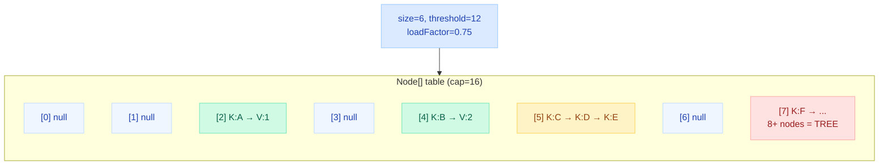

**Key fields in `java.util.HashMap`:**

- **`Node<K,V>[] table`** — the bucket array (always power of 2)
- **`int size`** — number of key-value pairs
- **`int threshold`** — capacity x loadFactor (resize trigger)
- **`float loadFactor`** — default 0.75 (sweet spot between time and space)

---

## Internal Structure — Node & TreeNode

```mermaid
flowchart LR
    subgraph NODE["Node (linked list)"]
        direction TB
        N1["int hash"]
        N2["K key"]
        N3["V value"]
        N4["Node next"]
    end

    subgraph TREE["TreeNode (RB tree)"]
        direction TB
        T1["extends Node"]
        T2["TreeNode parent"]
        T3["TreeNode left"]
        T4["TreeNode right"]
        T5["boolean red"]
    end

    NODE ==>|"8+ collisions"| TREE
    TREE -.->|"6 or fewer"| NODE

    style N1 fill:#DBEAFE,stroke:#93C5FD,color:#1E40AF
    style N2 fill:#DBEAFE,stroke:#93C5FD,color:#1E40AF
    style N3 fill:#DBEAFE,stroke:#93C5FD,color:#1E40AF
    style N4 fill:#DBEAFE,stroke:#93C5FD,color:#1E40AF
    style T1 fill:#D1FAE5,stroke:#6EE7B7,color:#065F46
    style T2 fill:#D1FAE5,stroke:#6EE7B7,color:#065F46
    style T3 fill:#D1FAE5,stroke:#6EE7B7,color:#065F46
    style T4 fill:#D1FAE5,stroke:#6EE7B7,color:#065F46
    style T5 fill:#D1FAE5,stroke:#6EE7B7,color:#065F46
```

---

## Hashing Mechanism — From Key to Bucket Index

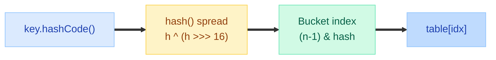

**Why `h ^ (h >>> 16)`?** Small tables (capacity 16) only use the **lower 4 bits** of the hash. XOR-ing the upper 16 bits into the lower 16 spreads the influence of high bits into the bucket selection. Without this, keys whose hashCodes differ only in high bits would **all collide**.

```java
static final int hash(Object key) {
    int h;
    return (key == null) ? 0 : (h = key.hashCode()) ^ (h >>> 16);
}
```

**Why `(n-1) & hash` instead of `hash % n`?** Because `n` is always a power of 2, bitwise AND is equivalent to modulo but **much faster** — no division instruction needed.

---

## put() Operation — Step by Step

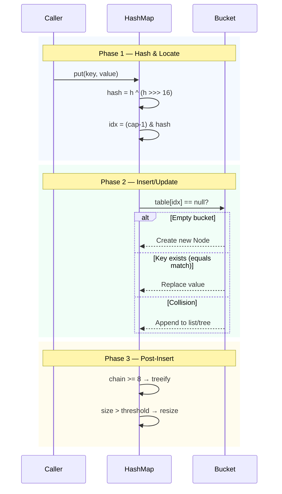

**Critical detail:** `equals()` is checked **only if `hash` matches first**. Hash comparison is the fast-path filter.

```java
// Simplified put logic
if (p.hash == hash && (p.key == key || key.equals(p.key))) {
    // Key found — update value
} else {
    // Traverse chain or tree
}
```

---

## get() Operation — Step by Step

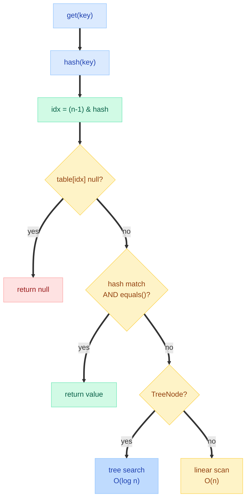

---

## Collision Handling — Linked List to Red-Black Tree

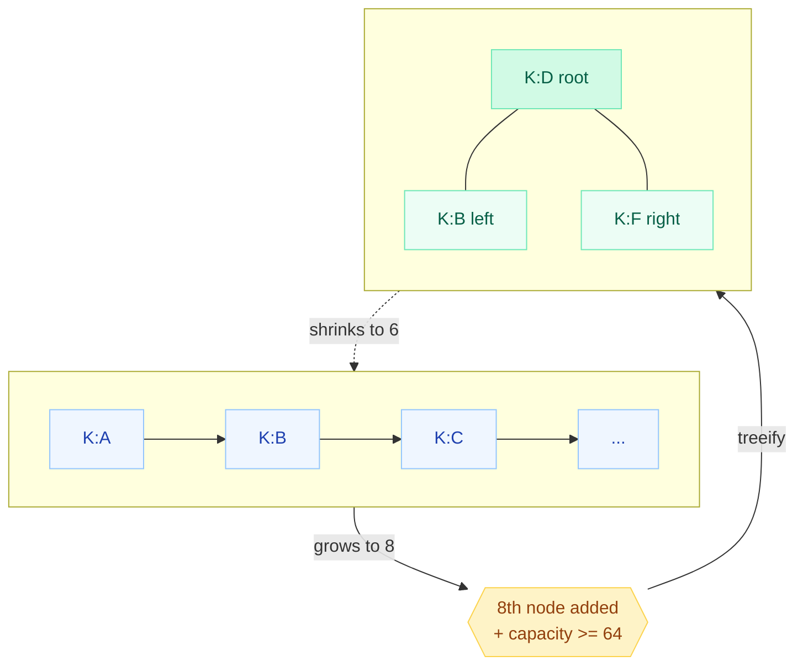

**Why threshold 8?** Under random hashing, the probability of 8+ entries in one bucket follows a **Poisson distribution** with expected value 0.5. P(8) = 0.00000006. It virtually never happens unless hashCode is broken or an attacker is crafting inputs.

**Why untreeify at 6 (not 8)?** Hysteresis gap prevents pathological flip-flopping between list and tree at the boundary.

!!! tip "Interview Gold"
    If capacity < 64 and chain length hits 8, HashMap **resizes instead of treeifying**. Treeification only kicks in when the table is large enough that resizing alone won't solve the collision problem.

---

## Resizing & Rehashing

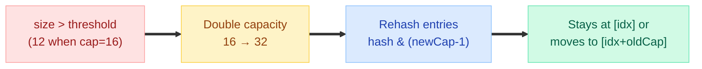

**Java 8 optimization:** During resize, each node's new position is determined by **one extra bit** of the hash. If that bit is 0, node stays. If 1, node moves to `oldIndex + oldCapacity`. No need to recompute hash.

```java
// Example: oldCap = 16 (10000), newCap = 32 (100000)
// hash & oldCap tells you if the extra bit is set
if ((hash & oldCap) == 0)
    // stays at index
else
    // moves to index + oldCap
```

**Resize cost:**

| Entries | Operations to Rehash | Amortized per put() |
|---|---|---|
| 12 → 32 | 12 rehashes | O(1) amortized |
| 1M entries | 1M rehashes | Still O(1) amortized |

!!! warning "Performance Trap"
    If you know the final size, **set initial capacity** = `expectedSize / 0.75 + 1`. Avoids all intermediate resizes. `new HashMap<>(1024)` for 750 entries.

---

## Java 8 Improvements

```mermaid
flowchart LR
    subgraph JAVA7["Java 7"]
        direction TB
        J7A["Linked list only"]
        J7B["Head insertion<br/>(causes loops)"]
        J7C["Basic hash spread"]
        J7D["Transfer on resize"]
    end

    subgraph JAVA8["Java 8+"]
        direction TB
        J8A["List → Tree at 8"]
        J8B["Tail insertion<br/>(safe)"]
        J8C["XOR upper/lower<br/>16 bits"]
        J8D["Split-in-place<br/>resize"]
    end

    JAVA7 ==> JAVA8

    style J7A fill:#FEE2E2,stroke:#FCA5A5,color:#991B1B
    style J7B fill:#FEE2E2,stroke:#FCA5A5,color:#991B1B
    style J7C fill:#FEE2E2,stroke:#FCA5A5,color:#991B1B
    style J7D fill:#FEE2E2,stroke:#FCA5A5,color:#991B1B
    style J8A fill:#D1FAE5,stroke:#6EE7B7,color:#065F46
    style J8B fill:#D1FAE5,stroke:#6EE7B7,color:#065F46
    style J8C fill:#D1FAE5,stroke:#6EE7B7,color:#065F46
    style J8D fill:#D1FAE5,stroke:#6EE7B7,color:#065F46
```

| Aspect | Java 7 | Java 8+ |
|---|---|---|
| Collision worst case | O(n) | **O(log n)** via tree |
| Insertion order | Head (reverses) | **Tail (preserves)** |
| Resize thread bug | Infinite loop | Fixed (no reversal) |
| Hash spreading | 4 XOR + 5 shifts | **1 XOR + 1 shift** |

---

## Null Key Handling

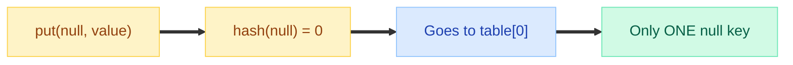

- **null key** → hash = 0 → bucket 0. One null key, multiple null values allowed.
- **Hashtable/ConcurrentHashMap** → null keys/values **throw NullPointerException**.

---

## Thread-Safety Issues

### The Infinite Loop (Java 7)

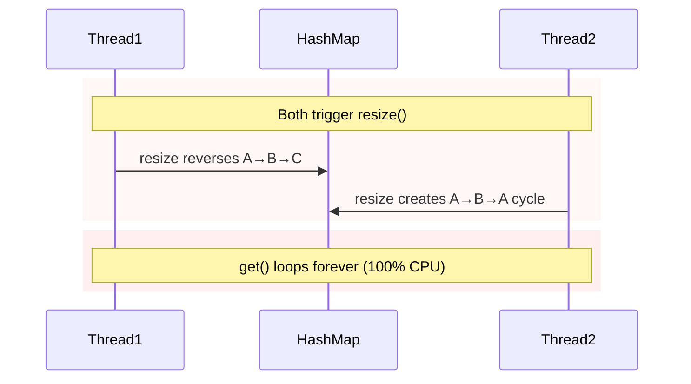

**Root cause:** Java 7 used **head insertion** during transfer. Two threads reversing the same chain creates a circular reference. `get()` follows `.next` forever.

### Data Corruption (Java 8+)

Java 8 fixed the infinite loop (tail insertion), but **concurrent modification still corrupts data:**

- Lost updates (both threads write same bucket, one overwrites the other)
- Incorrect size (non-atomic `++size`)
- Partially constructed tree nodes visible to other threads

!!! danger "Never Share HashMap Across Threads"
    Use **ConcurrentHashMap** for concurrent access. Period. No `Collections.synchronizedMap()` in production — it's a global lock with zero concurrency.

---

## equals/hashCode Contract Violations

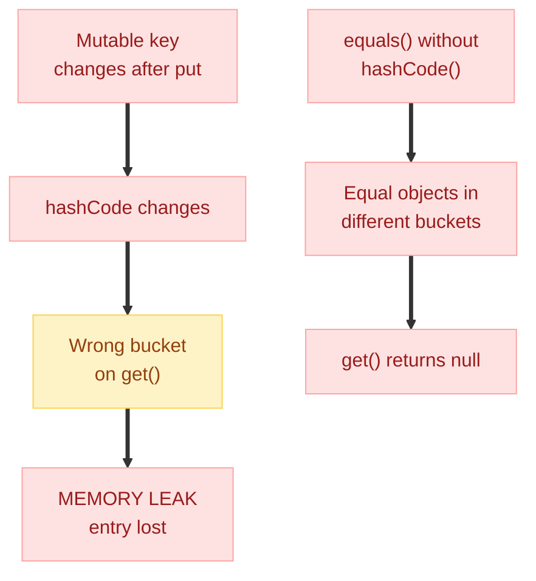

**The contract:**

1. If `a.equals(b)` → `a.hashCode() == b.hashCode()` (MUST)
2. If `a.hashCode() != b.hashCode()` → `!a.equals(b)` (contrapositive)
3. Same hashCode does NOT mean equals (collisions are legal)

---

## Map Implementations Compared

| Feature | HashMap | Hashtable | ConcurrentHashMap | LinkedHashMap | TreeMap |
|---|---|---|---|---|---|
| **Thread-safe** | No | Yes (global lock) | Yes (segment/stripe locks) | No | No |
| **Null key** | 1 allowed | No | No | 1 allowed | No (if Comparable) |
| **Null value** | Yes | No | No | Yes | Yes |
| **Ordering** | None | None | None | **Insertion order** | **Sorted (natural/Comparator)** |
| **Iteration** | O(capacity + size) | O(capacity + size) | Weakly consistent | O(size) only | O(size) |
| **get/put** | O(1) | O(1) | O(1) | O(1) | O(log n) |
| **Underlying** | Array + List/Tree | Array + List | Array + List/Tree + CAS | HashMap + doubly-linked list | Red-Black Tree |
| **Since** | 1.2 | 1.0 | 1.5 | 1.4 | 1.2 |

---

## Time Complexity

| Operation | Average | Worst (all collide, Java 7) | Worst (all collide, Java 8+) |
|---|---|---|---|
| **put()** | O(1) | O(n) | O(log n) |
| **get()** | O(1) | O(n) | O(log n) |
| **remove()** | O(1) | O(n) | O(log n) |
| **containsKey()** | O(1) | O(n) | O(log n) |
| **containsValue()** | O(n) | O(n) | O(n) |
| **resize()** | O(n) | O(n) | O(n) |
| **iteration** | O(capacity + n) | O(capacity + n) | O(capacity + n) |

!!! abstract "Why O(capacity + n) for iteration?"
    HashMap iterates over the entire `table[]` array (including empty buckets), not just the entries. A HashMap with capacity 10,000 but only 5 entries still scans all 10,000 slots. Use **LinkedHashMap** if you iterate frequently with sparse data.

---

## Common Pitfalls

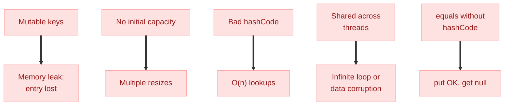

---

## ConcurrentHashMap — How It Differs

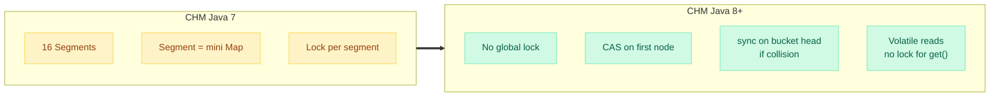

| Aspect | HashMap | ConcurrentHashMap |
|---|---|---|
| **get() locking** | None (not thread-safe) | **None** (volatile read) |
| **put() locking** | None (not thread-safe) | CAS + synchronized (per-bucket) |
| **Null keys/values** | Allowed | **Not allowed** (ambiguity with concurrent reads) |
| **size()** | Exact | **Approximate** (best-effort) |
| **Iterators** | Fail-fast (ConcurrentModificationException) | **Weakly consistent** (no exception) |

---

## Interview Tips

!!! tip "The 5 Things They Always Ask"
    1. **"How does HashMap work internally?"** — Array of buckets. Hash → spread → index. Collision → linked list → tree at 8.
    2. **"What happens on collision?"** — Chain as linked list. At 8 nodes (and capacity >= 64), convert to red-black tree.
    3. **"What if two keys have same hashCode?"** — Same bucket, different nodes. Distinguished by `equals()`.
    4. **"Why is capacity always power of 2?"** — `(n-1) & hash` works as fast modulo only for powers of 2.
    5. **"What happens during resize?"** — Double capacity. Each entry re-indexed. Node goes to `[old]` or `[old + oldCap]` based on one bit.

!!! abstract "The Killer Follow-Up Answers"
    - **"Why not always use TreeMap?"** — O(log n) guaranteed vs O(1) average. HashMap is faster for 99.9% of use cases.
    - **"Why 0.75 load factor?"** — Statistical sweet spot. Lower = more space wasted. Higher = more collisions. 0.75 gives ~30% empty buckets under random hashing.
    - **"How does Java 8 prevent the infinite loop?"** — Tail insertion preserves order during resize. No chain reversal = no cycle.
    - **"Why does ConcurrentHashMap ban null?"** — `get(key)` returning null is ambiguous: key absent OR value is null? Can't use `containsKey()` safely in concurrent context.

---

## Quick Recall

| Question | Answer |
|---|---|
| Default capacity? | **16** (must be power of 2) |
| Default load factor? | **0.75** |
| When does resize happen? | When `size > capacity * loadFactor` (threshold) |
| Resize multiplier? | **2x** (always doubles) |
| Treeify threshold? | **8** nodes in a bucket (AND capacity >= 64) |
| Untreeify threshold? | **6** (hysteresis gap prevents flip-flopping) |
| Hash spreading formula? | `h ^ (h >>> 16)` |
| Bucket index formula? | `(n - 1) & hash` |
| Null key bucket? | Always **bucket 0** (hash = 0) |
| Java 7 thread bug? | Infinite loop from head-insertion reversal during resize |
| Java 8 fix? | Tail insertion — no reversal, no cycle |
| Why power-of-2 capacity? | Enables bitwise AND as fast modulo |
| equals/hashCode violation? | put succeeds, get returns null (different bucket) |
| Best initial capacity? | `expectedSize / 0.75 + 1` to avoid resizes |
| ConcurrentHashMap get() locking? | **None** — uses volatile reads |
| Iterator behavior on modification? | HashMap: fail-fast. CHM: weakly consistent. |

---

## Interview Answer Template

!!! abstract "How to answer 'Explain HashMap internals'"

    **Step 1 — Structure:** "HashMap is an array of Node buckets, always power-of-2 size. Each Node holds hash, key, value, and next pointer."

    **Step 2 — Hashing:** "Key's hashCode is spread via `h ^ (h >>> 16)` to mix upper bits down. Bucket index is `(capacity-1) & hash` — bitwise AND as fast modulo."

    **Step 3 — Collision:** "Collisions form a linked list. At 8+ nodes (with capacity >= 64), the list converts to a red-black tree — worst case drops from O(n) to O(log n)."

    **Step 4 — Resize:** "When size exceeds `capacity * 0.75`, capacity doubles. Each node moves to `[idx]` or `[idx + oldCap]` based on one hash bit. O(n) cost, amortized O(1) per put."

    **Step 5 — Thread safety:** "HashMap is NOT thread-safe. Java 7 had infinite loops on concurrent resize. Java 8 fixed that but still has race conditions. Use ConcurrentHashMap — lock-free reads via volatile, per-bucket locking for writes."

    **Step 6 — Contract:** "equals/hashCode contract is critical. If you override equals, you MUST override hashCode. Mutable keys are memory leaks."
