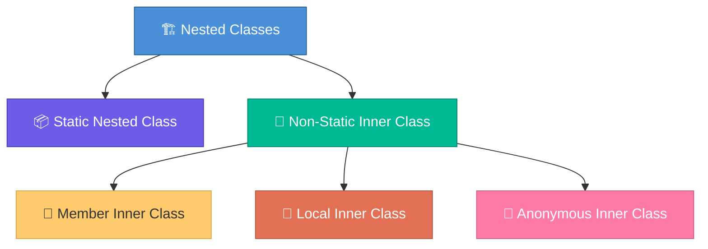

# Inner Classes in Java

Inner classes are classes defined **inside another class**. They're used for encapsulation, logical grouping, and implementing callbacks/listeners.

---

## Four Types of Inner Classes



---

## 1. Member Inner Class

Defined inside a class but **outside any method**. Has access to all outer class members, including `private`.

```java
public class University {
    private String name = "IIT";

    public class Department {
        public void display() {
            System.out.println("Dept in " + name);  // accesses outer's private field
        }
    }
}

// Creating instance — needs an outer class instance
University uni = new University();
University.Department dept = uni.new Department();
dept.display();  // "Dept in IIT"
```

**Use case**: When the inner class logically belongs to the outer class and needs access to its state. Example: `HashMap.Node` (each Node belongs to the HashMap).

---

## 2. Static Nested Class

Declared with `static`. Does NOT have access to outer class **instance** members. It's essentially a top-level class scoped inside another.

```java
public class Order {
    private String orderId;

    public static class Builder {
        private String orderId;
        private String item;

        public Builder orderId(String id) { this.orderId = id; return this; }
        public Builder item(String item) { this.item = item; return this; }
        public Order build() {
            Order order = new Order();
            order.orderId = this.orderId;
            return order;
        }
    }
}

// No outer instance needed
Order order = new Order.Builder()
    .orderId("ORD-123")
    .item("Laptop")
    .build();
```

**Use case**: Builder pattern, helper classes that don't need outer instance. Example: `Map.Entry<K,V>` is logically tied to Map but doesn't need a Map instance.

---

## 3. Local Inner Class

Defined **inside a method**. Only accessible within that method.

```java
public class Calculator {
    public void calculate() {
        final int factor = 10;

        class Multiplier {
            int multiply(int x) {
                return x * factor;  // can access effectively final local vars
            }
        }

        Multiplier m = new Multiplier();
        System.out.println(m.multiply(5));  // 50
    }
}
```

**Use case**: Rare in modern Java. Lambdas replaced most use cases.

---

## 4. Anonymous Inner Class

A class with **no name**, defined and instantiated at the same time. Used for one-off implementations.

```java
// Before Java 8 — anonymous class for interface implementation
Runnable task = new Runnable() {
    @Override
    public void run() {
        System.out.println("Running");
    }
};

// After Java 8 — lambda replaces this
Runnable task = () -> System.out.println("Running");
```

### When you still need anonymous classes (can't use lambdas)

```java
// When you need to override multiple methods or extend a class
JButton button = new JButton("Click");
button.addMouseListener(new MouseAdapter() {
    @Override
    public void mouseClicked(MouseEvent e) { /* handle click */ }

    @Override
    public void mouseEntered(MouseEvent e) { /* handle hover */ }
});
```

Lambdas only work for **functional interfaces** (single abstract method). If you need multiple methods, use anonymous classes.

---

## Comparison Table

| Feature | Member Inner | Static Nested | Local Inner | Anonymous |
|---|---|---|---|---|
| Defined in | Class body | Class body | Method | Expression |
| `static` | No | Yes | No | No |
| Access outer instance | Yes | No | Yes (effectively final) | Yes |
| Access outer private | Yes | Only static | Yes | Yes |
| Has a name | Yes | Yes | Yes | No |
| Can have `static` members | No | Yes | No | No |
| Need outer instance to create | Yes | No | N/A | Depends |

---

## Real-World Usage in Java SDK

| Inner class | Type | Purpose |
|---|---|---|
| `HashMap.Node<K,V>` | Static nested | Internal data structure for HashMap buckets |
| `Map.Entry<K,V>` | Interface (nested) | Represents a key-value pair |
| `ArrayList.Itr` | Member inner | Iterator that accesses ArrayList internals |
| `AbstractList.ListItr` | Member inner | ListIterator with access to parent list |
| Event listeners (Swing) | Anonymous | One-off callback implementations |

---

## Interview Questions

??? question "1. What is the difference between a static nested class and an inner class?"
    A **static nested class** doesn't need an instance of the outer class and can't access its instance members. An **inner (member) class** needs an outer instance and can access all its members including private. Use static nested when the inner class doesn't need outer state (like Builder pattern).

??? question "2. Can an inner class access private members of the outer class?"
    **Yes.** Both member inner classes and anonymous inner classes can access all private fields and methods of the outer class. This is one of their main purposes — tightly coupled helper classes that need full access.

??? question "3. Why must local variables accessed by a local/anonymous inner class be effectively final?"
    Because inner classes may outlive the method (e.g., stored in a field or passed to another thread). The local variable lives on the **stack** and dies when the method returns, but the inner class may still reference it. Java copies the variable's value into the inner class, so it must not change (effectively final) to avoid inconsistency.

??? question "4. When would you use a static nested class vs a separate top-level class?"
    Use static nested when the class is **logically tied** to the outer class and only used in that context (Builder, Entry, Node). Use a top-level class when it's reusable across multiple contexts. Static nested classes improve encapsulation and readability by keeping related code together.
