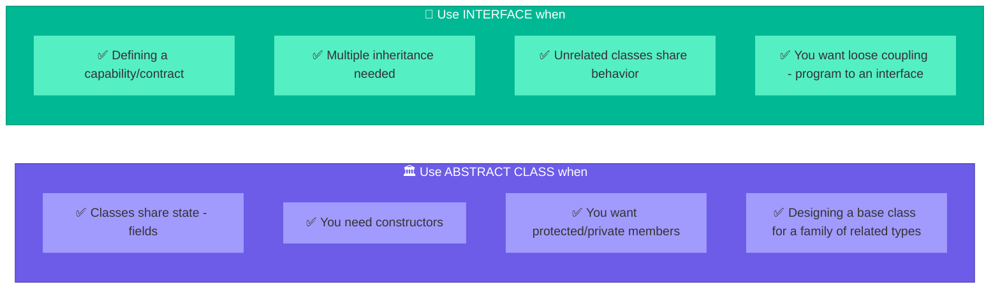

# Interfaces & Abstract Classes in Java

Knowing **when to use which** is one of the most common interview questions. Both define contracts, but they serve different purposes.

---

## Abstract Class

A class that **cannot be instantiated** and may contain both abstract (unimplemented) and concrete (implemented) methods.

```java
public abstract class Animal {
    protected String name;

    public Animal(String name) {
        this.name = name;  // constructors allowed
    }

    public abstract void makeSound();  // must be implemented by subclass

    public void sleep() {  // concrete method — shared behavior
        System.out.println(name + " is sleeping");
    }
}

public class Dog extends Animal {
    public Dog(String name) { super(name); }

    @Override
    public void makeSound() {
        System.out.println(name + " barks!");
    }
}
```

---

## Interface

A **contract** that defines what a class must do, without specifying how. Since Java 8, interfaces can also have `default` and `static` methods.

```java
public interface Flyable {
    void fly();  // implicitly public abstract

    default void land() {  // default method (Java 8+)
        System.out.println("Landing...");
    }

    static boolean canFly(Object obj) {  // static method (Java 8+)
        return obj instanceof Flyable;
    }
}

public interface Swimmable {
    void swim();
}

public class Duck implements Flyable, Swimmable {
    @Override
    public void fly() { System.out.println("Duck flying"); }

    @Override
    public void swim() { System.out.println("Duck swimming"); }
}
```

---

## Abstract Class vs Interface — Complete Comparison

| Feature | Abstract Class | Interface |
|---|---|---|
| **Instantiation** | Cannot instantiate | Cannot instantiate |
| **Methods** | Abstract + concrete | Abstract + default + static + private (Java 9+) |
| **Fields** | Any (private, protected, public) | Only `public static final` (constants) |
| **Constructors** | Yes | No |
| **Inheritance** | Single (extends one class) | Multiple (implements many interfaces) |
| **Access modifiers** | Any | Methods are `public` by default |
| **State** | Can hold instance state | Cannot (no instance fields) |
| **When to use** | IS-A relationship with shared state | CAN-DO capability / contract |

---

## When to Use Which



### Real-world examples

| Design decision | Choice | Why |
|---|---|---|
| `HttpServlet` | Abstract class | Shared state (request/response), template method pattern |
| `List`, `Map`, `Set` | Interface | Multiple implementations (ArrayList, LinkedList), loose coupling |
| `AbstractList` | Abstract class | Shared implementation for List methods (extends this to build custom lists) |
| `Comparable`, `Serializable` | Interface | Capability — any class can be comparable or serializable |
| `InputStream` | Abstract class | Shared state and partial implementation for all input streams |
| `Runnable`, `Callable` | Interface | Capability — any class can be runnable |

---

## Java 8+ Interface Evolution


### Why default methods were added

Before Java 8, adding a method to `Collection` interface would break **every** class implementing it. Default methods allow interface evolution without breaking existing code.

```java
// Java 8 added stream() to Collection — as a default method
public interface Collection<E> {
    default Stream<E> stream() {
        return StreamSupport.stream(spliterator(), false);
    }
}
// All existing implementations (ArrayList, HashSet, etc.) got stream() for free
```

### Private methods in interfaces (Java 9)

```java
public interface Logger {
    default void logInfo(String msg) {
        log("INFO", msg);
    }

    default void logError(String msg) {
        log("ERROR", msg);
    }

    private void log(String level, String msg) {  // shared helper — not exposed
        System.out.println("[" + level + "] " + msg);
    }
}
```

---

## The Diamond Problem

What happens when a class implements two interfaces with the same default method?

```java
public interface A {
    default void greet() { System.out.println("Hello from A"); }
}

public interface B {
    default void greet() { System.out.println("Hello from B"); }
}

public class C implements A, B {
    @Override
    public void greet() {
        A.super.greet();  // explicitly choose which one
    }
}
```

If you don't override, the compiler gives an error — you **must** resolve the ambiguity.

---

## Marker Interfaces

Interfaces with **no methods** — they just "mark" a class as having a certain capability.

| Marker Interface | Purpose |
|---|---|
| `Serializable` | Object can be serialized |
| `Cloneable` | Object can be cloned |
| `Remote` | Object can be accessed remotely (RMI) |

Since Java 5+, **annotations** (`@Entity`, `@Service`) mostly replaced marker interfaces because annotations can carry metadata.

---

## Interview Questions

??? question "1. Can an abstract class have no abstract methods?"
    **Yes.** It's valid. This is used when you want to prevent direct instantiation of a class but provide complete implementations. Example: `AbstractList` in Java Collections has many concrete methods but is abstract to force you to extend it.

??? question "2. Can an interface have a constructor?"
    **No.** Interfaces cannot have constructors because they cannot hold instance state. If you need initialization logic, use a factory method (`static` method in the interface) or an abstract class.

??? question "3. What happens if a class extends an abstract class and implements an interface, and both have a method with the same signature?"
    The **class method wins** (if defined in the class). If only the abstract class and interface provide implementations, the **abstract class wins** over the interface's default method. This is the "class wins" rule.

??? question "4. Why does Java allow multiple interface inheritance but not multiple class inheritance?"
    Multiple class inheritance creates the **diamond problem** — ambiguity about which parent's state and method to use. Interfaces only define behavior contracts (no state until Java 8 defaults), so there's no ambiguity about state. Java 8 default methods introduced a limited diamond problem, which is resolved by requiring explicit override.

??? question "5. Should you prefer composition over inheritance? When?"
    **Yes, in most cases.** Inheritance creates tight coupling — changes to the parent break the child. Composition is more flexible: you can swap behaviors at runtime. Use inheritance for genuine IS-A relationships (`Dog IS-A Animal`). Use composition/interfaces for HAS-A or CAN-DO relationships (`Car HAS-A Engine`, `Duck CAN Fly`). Effective Java Item 18: "Favor composition over inheritance."
