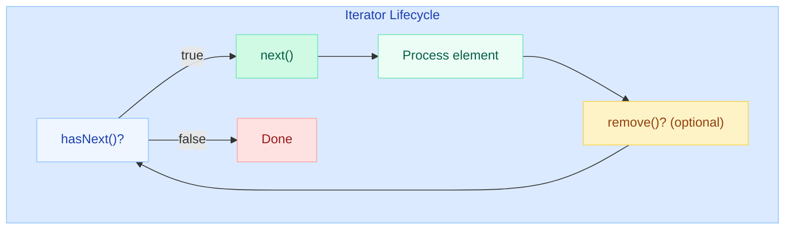
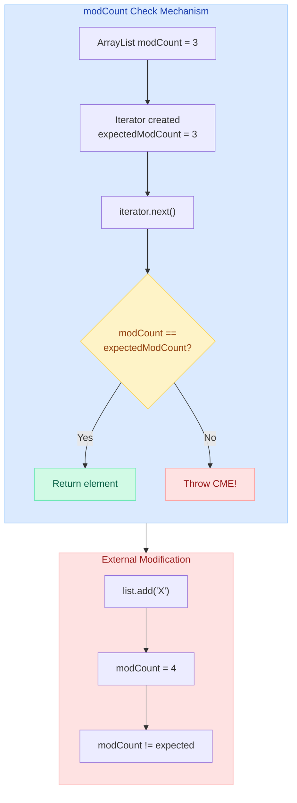
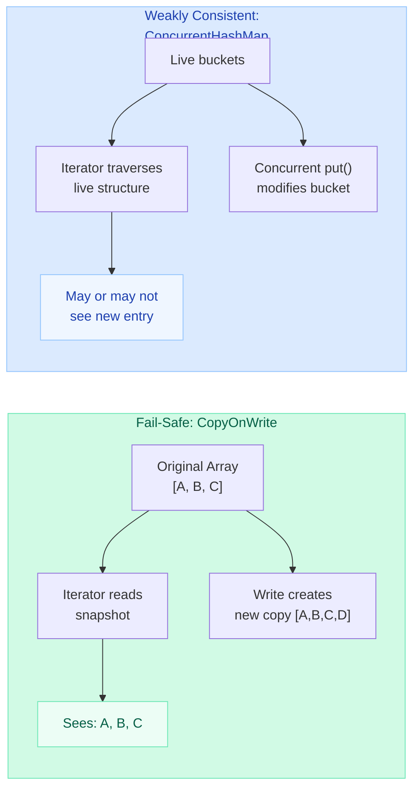
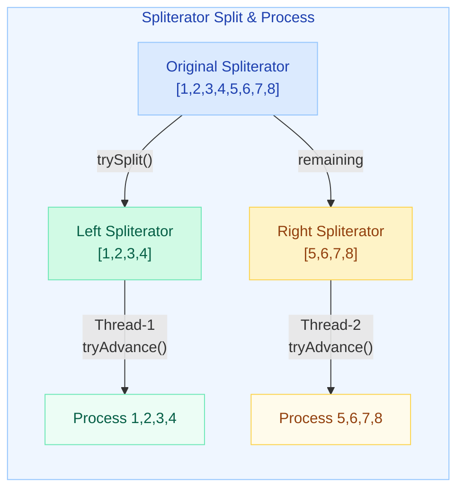

# Iterator & Iterable — Fail-Fast vs Fail-Safe

!!! danger "Production War Story"
    A seemingly simple `for` loop crashes your service at 2 AM with `ConcurrentModificationException`. The root cause? Someone added a `.remove()` call inside an enhanced for-loop over an `ArrayList` while another thread was modifying it. Understanding **Iterator internals** prevents this entire class of bugs.

---

## Iterable Interface — What Powers the Enhanced For-Loop

Any class implementing `Iterable<T>` can be used with the enhanced for-loop (`for-each`).

```java
public interface Iterable<T> {
    Iterator<T> iterator();

    // Default methods (Java 8+)
    default void forEach(Consumer<? super T> action) { ... }
    default Spliterator<T> spliterator() { ... }
}
```

**The compiler transforms:**

```java
// What you write:
for (String item : collection) {
    System.out.println(item);
}

// What the compiler generates:
Iterator<String> it = collection.iterator();
while (it.hasNext()) {
    String item = it.next();
    System.out.println(item);
}
```

All `Collection` types (`List`, `Set`, `Queue`) extend `Iterable`. Arrays do **not** implement `Iterable` but the compiler handles them separately with index-based loops.

---

## Iterator Interface — hasNext(), next(), remove()

```java
public interface Iterator<E> {
    boolean hasNext();   // Are there more elements?
    E next();           // Return current element, advance cursor
    
    default void remove() {  // Remove last element returned by next()
        throw new UnsupportedOperationException("remove");
    }

    default void forEachRemaining(Consumer<? super E> action) { ... }
}
```



### Safe Removal Pattern

```java
List<String> names = new ArrayList<>(List.of("Alice", "Bob", "Charlie"));

Iterator<String> it = names.iterator();
while (it.hasNext()) {
    String name = it.next();
    if (name.startsWith("B")) {
        it.remove();  // SAFE — uses iterator's remove
    }
}
// names = [Alice, Charlie]
```

---

## Internal modCount Mechanism

Every modification-aware collection maintains an internal `modCount` field. The iterator captures this value at creation time and checks it on every `next()` call.



**Source code insight (ArrayList.java):**

```java
// Inside ArrayList
protected transient int modCount = 0;  // incremented on add/remove/clear

// Inside ArrayList$Itr (the iterator)
int expectedModCount = modCount;

public E next() {
    checkForComodification();  // <-- the guard
    // ... return element
}

final void checkForComodification() {
    if (modCount != expectedModCount)
        throw new ConcurrentModificationException();
}
```

---

## Fail-Fast Iterators

**Collections:** `ArrayList`, `LinkedList`, `HashMap`, `HashSet`, `TreeMap`, `TreeSet`

Fail-fast iterators throw `ConcurrentModificationException` immediately when they detect structural modification (add/remove) by anything other than the iterator itself.

```java
// FAILS — modifying list during iteration
List<Integer> nums = new ArrayList<>(List.of(1, 2, 3, 4, 5));
for (Integer n : nums) {
    if (n == 3) {
        nums.remove(n);  // ConcurrentModificationException!
    }
}
```

```java
// FAILS — HashMap during iteration
Map<String, Integer> map = new HashMap<>(Map.of("a", 1, "b", 2));
for (Map.Entry<String, Integer> e : map.entrySet()) {
    if (e.getValue() == 1) {
        map.remove(e.getKey());  // ConcurrentModificationException!
    }
}
```

!!! warning "Single-Threaded CME"
    You do NOT need multiple threads to get `ConcurrentModificationException`. The name is misleading — it simply means the collection was structurally modified during iteration, even in a single thread.

---

## Fail-Safe Iterators (Snapshot / Weakly Consistent)

**Collections:** `CopyOnWriteArrayList`, `CopyOnWriteArraySet`, `ConcurrentHashMap`, `ConcurrentSkipListMap`

These iterators never throw `ConcurrentModificationException`. They work on either a **snapshot** (copy) or with **weak consistency** (see what's available without guaranteeing the latest state).

### CopyOnWriteArrayList — Snapshot-Based

```java
CopyOnWriteArrayList<String> list = new CopyOnWriteArrayList<>(List.of("A", "B", "C"));

// Iterator works on a SNAPSHOT of the array at creation time
Iterator<String> it = list.iterator();

list.add("D");  // Creates a new internal array copy

while (it.hasNext()) {
    System.out.println(it.next());  // Prints A, B, C (NOT D)
}
// No ConcurrentModificationException!
```

### ConcurrentHashMap — Weakly Consistent

```java
ConcurrentHashMap<String, Integer> map = new ConcurrentHashMap<>();
map.put("a", 1);
map.put("b", 2);
map.put("c", 3);

// Iterator MAY or MAY NOT see concurrent modifications
for (Map.Entry<String, Integer> e : map.entrySet()) {
    map.put("d", 4);  // No exception, iterator may or may not see "d"
    System.out.println(e);
}
```



---

## ListIterator — Bidirectional Traversal

`ListIterator<E>` extends `Iterator<E>` and is available only for `List` implementations. It allows traversal in both directions and modification during iteration.

```java
public interface ListIterator<E> extends Iterator<E> {
    boolean hasNext();
    E next();
    boolean hasPrevious();
    E previous();
    int nextIndex();
    int previousIndex();
    void remove();     // Remove last returned element
    void set(E e);     // Replace last returned element
    void add(E e);     // Insert before next element
}
```

```java
List<String> list = new ArrayList<>(List.of("A", "B", "C", "D"));

ListIterator<String> lit = list.listIterator(2);  // Start at index 2

// Traverse backward
while (lit.hasPrevious()) {
    String prev = lit.previous();
    if (prev.equals("B")) {
        lit.set("B_MODIFIED");  // Replace B in-place
    }
}

// Traverse forward and add
lit = list.listIterator();
while (lit.hasNext()) {
    String val = lit.next();
    if (val.equals("C")) {
        lit.add("C2");  // Insert C2 after C
    }
}
// Result: [A, B_MODIFIED, C, C2, D]
```

---

## Spliterator Basics (Java 8+)

`Spliterator` (Splittable Iterator) is designed for **parallel processing** in Streams. It can partition data for multi-threaded traversal.

```java
public interface Spliterator<T> {
    boolean tryAdvance(Consumer<? super T> action);  // Process one element
    Spliterator<T> trySplit();                       // Split into two halves
    long estimateSize();                             // Remaining elements estimate
    int characteristics();                           // ORDERED, DISTINCT, SORTED, etc.
}
```



### Key Characteristics

| Characteristic | Meaning |
|---|---|
| `ORDERED` | Elements have a defined encounter order |
| `DISTINCT` | No duplicates (e.g., `HashSet`) |
| `SORTED` | Elements are sorted (e.g., `TreeSet`) |
| `SIZED` | `estimateSize()` returns exact count |
| `NONNULL` | Source guarantees no null elements |
| `IMMUTABLE` | Source cannot be structurally modified |
| `CONCURRENT` | Source can be safely modified concurrently |
| `SUBSIZED` | Splits produce sized spliterators |

```java
List<Integer> numbers = List.of(1, 2, 3, 4, 5, 6, 7, 8);
Spliterator<Integer> sp1 = numbers.spliterator();
Spliterator<Integer> sp2 = sp1.trySplit();  // sp2 gets first half

// sp2: [1, 2, 3, 4]
sp2.forEachRemaining(System.out::println);

// sp1: [5, 6, 7, 8] (remaining)
sp1.forEachRemaining(System.out::println);
```

---

## Custom Iterable Implementation

```java
public class NumberRange implements Iterable<Integer> {
    private final int start;
    private final int end;

    public NumberRange(int start, int end) {
        this.start = start;
        this.end = end;
    }

    @Override
    public Iterator<Integer> iterator() {
        return new Iterator<Integer>() {
            private int current = start;

            @Override
            public boolean hasNext() {
                return current <= end;
            }

            @Override
            public Integer next() {
                if (!hasNext()) {
                    throw new NoSuchElementException();
                }
                return current++;
            }
        };
    }

    // Usage:
    public static void main(String[] args) {
        NumberRange range = new NumberRange(1, 5);

        // Works with enhanced for-loop!
        for (int n : range) {
            System.out.println(n);  // 1, 2, 3, 4, 5
        }

        // Works with streams!
        range.forEach(System.out::println);

        // Works with Stream API via spliterator
        StreamSupport.stream(range.spliterator(), false)
                     .filter(n -> n % 2 == 0)
                     .forEach(System.out::println);  // 2, 4
    }
}
```

---

## Comparison Table: Fail-Fast vs Fail-Safe

| Aspect | Fail-Fast | Fail-Safe |
|---|---|---|
| **Collections** | `ArrayList`, `LinkedList`, `HashMap`, `HashSet`, `TreeMap` | `CopyOnWriteArrayList`, `CopyOnWriteArraySet`, `ConcurrentHashMap` |
| **Mechanism** | `modCount` check on every `next()` | Snapshot copy or weakly consistent traversal |
| **On modification** | Throws `ConcurrentModificationException` | Silently continues (no exception) |
| **Data freshness** | Always sees latest state (until CME) | May miss concurrent updates |
| **Memory overhead** | None (operates on original) | Extra (snapshot copy in COW) |
| **Performance** | Fast (no copying) | COW: expensive writes, CHM: segment locks |
| **Use case** | Single-threaded, detect bugs early | Multi-threaded environments |
| **remove() via iterator** | Supported (safe single-thread removal) | `UnsupportedOperationException` on COW iterators |
| **Null handling** | Allows nulls (HashMap allows null key) | `ConcurrentHashMap` disallows null key/value |

---

## Common Pitfalls

### Pitfall 1: Removing During Enhanced For-Loop

```java
// WRONG — throws ConcurrentModificationException
List<String> items = new ArrayList<>(List.of("a", "b", "c"));
for (String item : items) {
    if (item.equals("b")) {
        items.remove(item);  // Structural modification!
    }
}

// CORRECT — use Iterator.remove()
Iterator<String> it = items.iterator();
while (it.hasNext()) {
    if (it.next().equals("b")) {
        it.remove();  // Safe!
    }
}

// CORRECT — use removeIf() (Java 8+)
items.removeIf(item -> item.equals("b"));
```

### Pitfall 2: Modifying During Stream Operations

```java
// WRONG — streams rely on fail-fast iterators internally
List<String> list = new ArrayList<>(List.of("a", "b", "c"));
list.stream()
    .filter(s -> s.equals("a"))
    .forEach(s -> list.remove(s));  // ConcurrentModificationException!

// CORRECT — collect then remove
List<String> toRemove = list.stream()
    .filter(s -> s.equals("a"))
    .collect(Collectors.toList());
list.removeAll(toRemove);
```

### Pitfall 3: Multiple Iterators on Same Collection

```java
// WRONG — one iterator modifies, other breaks
List<String> list = new ArrayList<>(List.of("x", "y", "z"));
Iterator<String> it1 = list.iterator();
Iterator<String> it2 = list.iterator();

it1.next();
it1.remove();  // Modifies list

it2.next();  // ConcurrentModificationException! (it2's expectedModCount is stale)
```

### Pitfall 4: CopyOnWriteArrayList Iterator Cannot Remove

```java
CopyOnWriteArrayList<String> cowList = new CopyOnWriteArrayList<>(List.of("a", "b", "c"));
Iterator<String> it = cowList.iterator();
it.next();
it.remove();  // UnsupportedOperationException!

// CORRECT — use the list's methods directly (thread-safe)
cowList.remove("b");
```

---

## Quick Recall

| Question | Answer |
|---|---|
| What interface enables for-each? | `Iterable<T>` (provides `iterator()`) |
| What does `modCount` track? | Structural modifications (add/remove/clear) |
| When is CME thrown? | When `modCount != expectedModCount` during `next()` |
| Is CME only multi-threaded? | No — single-threaded modification during iteration triggers it |
| `CopyOnWriteArrayList` iterator behavior? | Reads snapshot, cannot `remove()` |
| `ConcurrentHashMap` iterator behavior? | Weakly consistent, may see some concurrent updates |
| `ListIterator` extra features? | Bidirectional, `add()`, `set()`, `previousIndex()` |
| `Spliterator` purpose? | Parallel-friendly splitting for Stream API |
| Safe removal in single thread? | `Iterator.remove()` or `Collection.removeIf()` |
| Safe removal in multi-thread? | Use concurrent collections, avoid synchronized wrappers |

---

## Interview Template

???+ example "Iterator & Iterable — Interview Answer Framework"

    **Q: What is the difference between Iterator and Iterable?**

    > `Iterable` is a contract — it says "I can produce an Iterator." Any class implementing `Iterable` can be used in a for-each loop. `Iterator` is the actual traversal mechanism with `hasNext()`, `next()`, and `remove()`.

    **Q: What causes ConcurrentModificationException?**

    > Every mutable collection maintains a `modCount` field. When an iterator is created, it saves `expectedModCount = modCount`. On every `next()`, it checks if these match. If something (another thread, or even the same thread via `list.remove()`) modifies the collection, `modCount` increments but `expectedModCount` stays the same, triggering CME.

    **Q: Fail-fast vs fail-safe — when do you use each?**

    > Fail-fast iterators (ArrayList, HashMap) detect bugs early in single-threaded code. Fail-safe iterators (CopyOnWriteArrayList, ConcurrentHashMap) are for concurrent environments — COW copies the array on write (good for read-heavy scenarios), while ConcurrentHashMap uses per-bucket locking for balanced read/write workloads.

    **Q: How would you safely remove elements during iteration?**

    > Three approaches: (1) `Iterator.remove()` for single-threaded code, (2) `Collection.removeIf(predicate)` for declarative single-threaded removal, (3) Use `ConcurrentHashMap` or `CopyOnWriteArrayList` if concurrent modification is expected.
