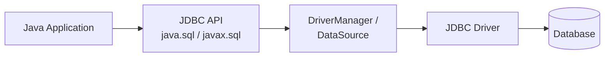
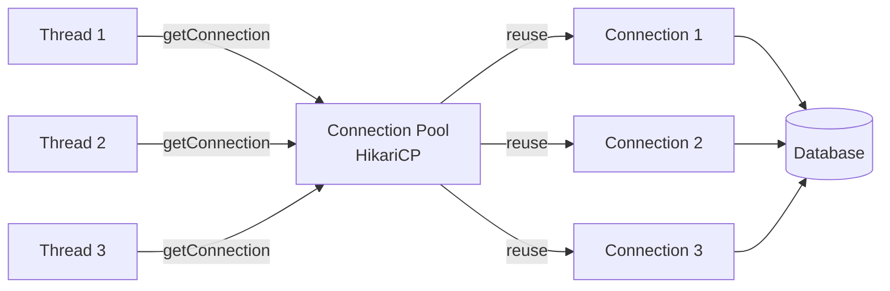

# Java Database Connectivity (JDBC)

JDBC is Java's standard API for connecting to relational databases. It provides a **vendor-neutral** interface for executing SQL, processing results, and managing transactions. Every enterprise Java application — from Spring Boot microservices to legacy monoliths — uses JDBC under the hood. Understanding JDBC internals is essential for interviews because it reveals how ORMs like Hibernate actually work, and why connection pooling, prepared statements, and transaction isolation matter at scale.

---

## JDBC Architecture

JDBC follows a **two-tier architecture**: the application talks to the JDBC API, which delegates to a database-specific driver.



### Key Interfaces (all in `java.sql`)

| Interface | Purpose |
|---|---|
| `Connection` | Represents a session with the database |
| `Statement` | Executes static SQL |
| `PreparedStatement` | Executes parameterized SQL (precompiled) |
| `CallableStatement` | Calls stored procedures |
| `ResultSet` | Holds query results (row iterator) |
| `DatabaseMetaData` | Information about the database |
| `ResultSetMetaData` | Information about columns in a ResultSet |

---

## JDBC Driver Types

| Type | Name | How It Works | Performance | Used Today? |
|---|---|---|---|---|
| **Type 1** | JDBC-ODBC Bridge | Translates JDBC calls to ODBC | Slowest | Removed in Java 8 |
| **Type 2** | Native-API | Uses database's native C/C++ libraries | Fast | Rarely |
| **Type 3** | Network Protocol | Middleware translates to DB protocol | Medium | Rarely |
| **Type 4** | Thin/Pure Java | Direct socket communication with DB | Fastest | **Always** |

!!! tip "Interview Tip"
    Type 4 drivers are the standard today. MySQL Connector/J, PostgreSQL JDBC, Oracle Thin — all are Type 4. They are pure Java, platform-independent, and require no native libraries.

---

## DriverManager vs DataSource

| Aspect | DriverManager | DataSource |
|---|---|---|
| Package | `java.sql` | `javax.sql` |
| Connection pooling | No | Yes (with pool implementation) |
| Distributed transactions | No | Yes (via `XADataSource`) |
| Configuration | Hardcoded URL in code | Externalized (JNDI, Spring config) |
| Usage | Demos, simple apps | **Production applications** |

```java
// DriverManager — simple but no pooling
Connection conn = DriverManager.getConnection(
    "jdbc:mysql://localhost:3306/mydb", "user", "pass");

// DataSource — production approach (e.g., HikariCP)
HikariConfig config = new HikariConfig();
config.setJdbcUrl("jdbc:mysql://localhost:3306/mydb");
config.setUsername("user");
config.setPassword("pass");
config.setMaximumPoolSize(10);

DataSource ds = new HikariDataSource(config);
Connection conn = ds.getConnection(); // borrows from pool
```

---

## Statement Types

### Statement — Static SQL

Use only for SQL with **no user input**. Vulnerable to SQL injection if misused.

```java
try (Statement stmt = conn.createStatement()) {
    ResultSet rs = stmt.executeQuery("SELECT id, name FROM employees");
    while (rs.next()) {
        int id = rs.getInt("id");
        String name = rs.getString("name");
    }
}
```

### PreparedStatement — Parameterized SQL

Precompiled, **reusable**, and **safe from SQL injection**. Always the default choice.

```java
String sql = "SELECT * FROM employees WHERE department = ? AND salary > ?";
try (PreparedStatement ps = conn.prepareStatement(sql)) {
    ps.setString(1, "Engineering");
    ps.setDouble(2, 80000.0);

    try (ResultSet rs = ps.executeQuery()) {
        while (rs.next()) {
            System.out.println(rs.getString("name"));
        }
    }
}
```

!!! info "Why PreparedStatement is Faster"
    The database parses and compiles the SQL once, then caches the execution plan. Subsequent calls with different parameters reuse the plan — avoiding repeated parsing. This matters significantly at high throughput.

### CallableStatement — Stored Procedures

```java
// Calling: CREATE PROCEDURE get_employee_count(IN dept VARCHAR(50), OUT cnt INT)
String sql = "{CALL get_employee_count(?, ?)}";
try (CallableStatement cs = conn.prepareCall(sql)) {
    cs.setString(1, "Engineering");
    cs.registerOutParameter(2, Types.INTEGER);
    cs.execute();

    int count = cs.getInt(2);
    System.out.println("Employee count: " + count);
}
```

---

## ResultSet Types and Concurrency

### Scrollability

| Type | Description |
|---|---|
| `TYPE_FORWARD_ONLY` | Default. Cursor moves forward only |
| `TYPE_SCROLL_INSENSITIVE` | Scroll in any direction; does not see DB changes |
| `TYPE_SCROLL_SENSITIVE` | Scroll in any direction; sees DB changes |

### Concurrency

| Mode | Description |
|---|---|
| `CONCUR_READ_ONLY` | Default. Read-only result set |
| `CONCUR_UPDATABLE` | Can update rows through the ResultSet |

```java
Statement stmt = conn.createStatement(
    ResultSet.TYPE_SCROLL_INSENSITIVE,
    ResultSet.CONCUR_UPDATABLE
);

ResultSet rs = stmt.executeQuery("SELECT id, name, salary FROM employees");

// Navigate freely
rs.absolute(5);         // jump to row 5
rs.relative(-2);        // move back 2 rows
rs.last();              // jump to last row
rs.beforeFirst();       // reset to before first row

// Update through ResultSet
rs.absolute(3);
rs.updateDouble("salary", 95000.0);
rs.updateRow();         // commits the change to the database
```

---

## Batch Processing

Batch processing groups multiple SQL statements into a single round-trip to the database, drastically reducing network overhead.

```java
String sql = "INSERT INTO employees (name, department, salary) VALUES (?, ?, ?)";
try (PreparedStatement ps = conn.prepareStatement(sql)) {
    conn.setAutoCommit(false);

    for (Employee emp : employees) {
        ps.setString(1, emp.getName());
        ps.setString(2, emp.getDepartment());
        ps.setDouble(3, emp.getSalary());
        ps.addBatch();
    }

    int[] results = ps.executeBatch();  // single round-trip
    conn.commit();
} catch (BatchUpdateException e) {
    conn.rollback();
    int[] updateCounts = e.getUpdateCounts(); // partial results
}
```

!!! warning "Batch Size Matters"
    Do not add millions of rows to a single batch — you will run out of memory. Flush every 500-1000 rows: call `executeBatch()` and then `clearBatch()` periodically.

---

## Transaction Management

By default, JDBC operates in **auto-commit mode** — every statement is its own transaction. For multi-statement atomicity, disable auto-commit.

```java
Connection conn = dataSource.getConnection();
try {
    conn.setAutoCommit(false);

    // Transfer $500 from account A to account B
    PreparedStatement debit = conn.prepareStatement(
        "UPDATE accounts SET balance = balance - ? WHERE id = ?");
    debit.setDouble(1, 500.0);
    debit.setInt(2, accountA);
    debit.executeUpdate();

    PreparedStatement credit = conn.prepareStatement(
        "UPDATE accounts SET balance = balance + ? WHERE id = ?");
    credit.setDouble(1, 500.0);
    credit.setInt(2, accountB);
    credit.executeUpdate();

    conn.commit();
} catch (SQLException e) {
    conn.rollback();
    throw e;
} finally {
    conn.setAutoCommit(true);
    conn.close();
}
```

### Savepoints

Savepoints allow **partial rollbacks** within a transaction.

```java
conn.setAutoCommit(false);
Savepoint sp = null;

try {
    // Step 1: always required
    stmt.executeUpdate("INSERT INTO orders (id, total) VALUES (1, 100)");

    sp = conn.setSavepoint("beforeItems");

    // Step 2: optional — may fail
    stmt.executeUpdate("INSERT INTO order_items (order_id, item) VALUES (1, 'Widget')");

} catch (SQLException e) {
    if (sp != null) {
        conn.rollback(sp);  // only undo step 2, keep step 1
    }
}
conn.commit();
```

### Transaction Isolation Levels

| Level | Dirty Read | Non-Repeatable Read | Phantom Read | Performance |
|---|---|---|---|---|
| `READ_UNCOMMITTED` | Yes | Yes | Yes | Fastest |
| `READ_COMMITTED` | No | Yes | Yes | Good |
| `REPEATABLE_READ` | No | No | Yes | Moderate |
| `SERIALIZABLE` | No | No | No | Slowest |

```java
conn.setTransactionIsolation(Connection.TRANSACTION_READ_COMMITTED);
```

!!! tip "Interview Tip"
    **READ_COMMITTED** is the default for PostgreSQL and Oracle. **REPEATABLE_READ** is the default for MySQL/InnoDB. Know the trade-offs: higher isolation = more locking = lower throughput.

---

## Connection Pooling

Creating a database connection involves TCP handshake, authentication, and memory allocation — **expensive operations** (typically 20-50ms). Connection pooling reuses existing connections.



### HikariCP — The Gold Standard

```java
HikariConfig config = new HikariConfig();
config.setJdbcUrl("jdbc:postgresql://localhost:5432/mydb");
config.setUsername("user");
config.setPassword("pass");

// Pool sizing
config.setMaximumPoolSize(10);       // max connections
config.setMinimumIdle(5);            // min idle connections
config.setIdleTimeout(300000);       // 5 min idle before eviction
config.setConnectionTimeout(30000);  // 30s wait for connection
config.setMaxLifetime(1800000);      // 30 min max connection age

// Performance tuning
config.addDataSourceProperty("cachePrepStmts", "true");
config.addDataSourceProperty("prepStmtCacheSize", "250");

DataSource ds = new HikariDataSource(config);
```

!!! info "Pool Sizing Formula"
    HikariCP recommends: `connections = (core_count * 2) + effective_spindle_count`. For an 8-core server with SSD, start with **10** connections. More connections does NOT mean better performance — excessive connections cause contention on the database side.

---

## BLOB and CLOB Handling

| Type | Java Type | Use Case |
|---|---|---|
| `BLOB` | `java.sql.Blob` / `byte[]` | Binary data (images, PDFs, files) |
| `CLOB` | `java.sql.Clob` / `String` | Large text (documents, XML, JSON) |

```java
// Writing a BLOB
String sql = "INSERT INTO documents (name, content) VALUES (?, ?)";
try (PreparedStatement ps = conn.prepareStatement(sql)) {
    ps.setString(1, "report.pdf");
    try (FileInputStream fis = new FileInputStream("/path/to/report.pdf")) {
        ps.setBinaryStream(2, fis);
    }
    ps.executeUpdate();
}

// Reading a BLOB
try (ResultSet rs = stmt.executeQuery("SELECT content FROM documents WHERE id = 1")) {
    if (rs.next()) {
        try (InputStream is = rs.getBinaryStream("content");
             FileOutputStream fos = new FileOutputStream("/output/report.pdf")) {
            is.transferTo(fos);
        }
    }
}
```

```java
// Writing a CLOB
ps.setClob(1, new StringReader(largeText));

// Reading a CLOB
Clob clob = rs.getClob("description");
String text = clob.getSubString(1, (int) clob.length());
clob.free(); // release resources
```

---

## RowSet Interface

`RowSet` extends `ResultSet` with JavaBeans support, scrollability, and a disconnected model.

| Type | Connected? | Use Case |
|---|---|---|
| `JdbcRowSet` | Yes | Simpler API over ResultSet, scrollable & updatable |
| `CachedRowSet` | **No** | Disconnected, serializable — ideal for transferring data |
| `WebRowSet` | No | XML serialization of row data |
| `FilteredRowSet` | No | In-memory filtering without SQL |
| `JoinRowSet` | No | In-memory JOIN of multiple RowSets |

```java
// CachedRowSet — disconnected operation
CachedRowSet crs = RowSetProvider.newFactory().createCachedRowSet();
crs.setUrl("jdbc:mysql://localhost:3306/mydb");
crs.setUsername("user");
crs.setPassword("pass");
crs.setCommand("SELECT * FROM employees WHERE dept = ?");
crs.setString(1, "Engineering");

crs.execute();  // connects, fetches data, disconnects

// Work offline
while (crs.next()) {
    System.out.println(crs.getString("name"));
}

// Reconnect and sync changes
crs.acceptChanges();
```

---

## SQL Injection Prevention

SQL injection is a **critical security vulnerability** where attacker-controlled input alters the SQL query structure.

```java
// VULNERABLE — never do this
String sql = "SELECT * FROM users WHERE name = '" + userInput + "'";
// If userInput = "'; DROP TABLE users; --" → disaster

// SAFE — always use PreparedStatement
String sql = "SELECT * FROM users WHERE name = ?";
PreparedStatement ps = conn.prepareStatement(sql);
ps.setString(1, userInput);  // input is escaped automatically
```

!!! danger "Why PreparedStatement Prevents Injection"
    PreparedStatement separates **SQL structure** from **data**. The database compiles the query first, then binds parameters as literal values — not as SQL code. Even if the input contains `'; DROP TABLE users; --`, it is treated as a plain string value, not executable SQL.

Additional defenses:

- **Validate and whitelist input** — reject unexpected characters
- **Use stored procedures** with parameterized calls
- **Principle of least privilege** — DB user should only have necessary permissions
- **Use an ORM** (Hibernate, JPA) — parameterization is built in

---

## Try-With-Resources for JDBC

JDBC resources (`Connection`, `Statement`, `ResultSet`) hold native handles and must be closed. Try-with-resources guarantees cleanup even when exceptions occur.

```java
// Modern, correct approach
public List<Employee> findByDepartment(DataSource ds, String dept) 
        throws SQLException {
    String sql = "SELECT id, name, salary FROM employees WHERE department = ?";
    List<Employee> result = new ArrayList<>();

    try (Connection conn = ds.getConnection();
         PreparedStatement ps = conn.prepareStatement(sql)) {

        ps.setString(1, dept);

        try (ResultSet rs = ps.executeQuery()) {
            while (rs.next()) {
                result.add(new Employee(
                    rs.getInt("id"),
                    rs.getString("name"),
                    rs.getDouble("salary")
                ));
            }
        }
    }
    // Connection, PreparedStatement, and ResultSet are all closed automatically
    return result;
}
```

!!! warning "Close Order Matters"
    Resources are closed in **reverse declaration order**. If you close a `Connection` before its `ResultSet`, some drivers throw exceptions. Try-with-resources handles this correctly by design.

---

## Best Practices and Common Pitfalls

### Best Practices

| Practice | Why |
|---|---|
| Always use `PreparedStatement` | Prevents SQL injection, enables plan caching |
| Always use try-with-resources | Prevents connection and resource leaks |
| Use connection pooling (HikariCP) | Eliminates connection creation overhead |
| Set statement timeouts | `ps.setQueryTimeout(30)` prevents runaway queries |
| Use batch operations for bulk inserts | Orders of magnitude faster than individual inserts |
| Fetch only needed columns | `SELECT *` wastes bandwidth and prevents covering indexes |
| Set appropriate fetch size | `rs.setFetchSize(100)` controls memory vs round-trips |
| Externalize SQL configuration | Avoid hardcoding URLs, credentials in source code |

### Common Pitfalls

| Pitfall | Impact |
|---|---|
| Not closing connections | Connection leak exhausts pool, app hangs |
| Using `Statement` with user input | SQL injection vulnerability |
| Not disabling auto-commit for transactions | Partial writes on failure, data inconsistency |
| Ignoring `SQLWarning` | Missing deprecation notices and data truncation |
| Not handling `BatchUpdateException` | Losing information about which statements failed |
| Over-sizing the connection pool | Database contention, worse performance |
| Catching `SQLException` and swallowing it | Silent failures, data corruption |
| Not setting query timeout | Single slow query blocks a connection indefinitely |

---

## Interview Questions

??? question "1. What are the four types of JDBC drivers? Which one should you use?"
    Type 1 (JDBC-ODBC Bridge) was removed in Java 8. Type 2 (Native-API) requires native libraries and is platform-dependent. Type 3 (Network Protocol) uses middleware. Type 4 (Thin/Pure Java) communicates directly with the database via sockets — it is the fastest, most portable, and the only type used in modern applications. All major database vendors (MySQL, PostgreSQL, Oracle) provide Type 4 drivers.

??? question "2. Why should you always prefer PreparedStatement over Statement?"
    Three reasons: (1) **Security** — it prevents SQL injection by separating SQL structure from data, so user input is never interpreted as SQL code. (2) **Performance** — the database precompiles the query and caches the execution plan, avoiding repeated parsing for the same query with different parameters. (3) **Readability** — parameterized queries are cleaner than string concatenation. The only valid use of `Statement` is for DDL or admin commands with no user input.

??? question "3. Explain transaction isolation levels. What anomalies does each prevent?"
    READ_UNCOMMITTED allows dirty reads (seeing uncommitted changes). READ_COMMITTED prevents dirty reads but allows non-repeatable reads (a row changes between two reads in the same transaction). REPEATABLE_READ prevents both but allows phantom reads (new rows appear in a range query). SERIALIZABLE prevents all anomalies by fully serializing transactions. Higher isolation means more locking and lower throughput. PostgreSQL and Oracle default to READ_COMMITTED; MySQL defaults to REPEATABLE_READ.

??? question "4. How does connection pooling work and why is it critical for performance?"
    A connection pool maintains a cache of pre-established database connections. When the application needs a connection, it borrows one from the pool instead of creating a new one. When done, it returns the connection to the pool (not actually closing it). This eliminates the 20-50ms overhead of TCP handshake and authentication per request. HikariCP is the industry standard pool. The optimal pool size is typically `(core_count * 2) + spindle_count` — more connections actually degrades performance due to context switching and database lock contention.

??? question "5. What is the difference between DriverManager and DataSource?"
    `DriverManager` is a basic facility for obtaining connections — you provide a URL, username, and password directly in code. It creates a new connection every time and has no pooling. `DataSource` is the modern, production-grade alternative: it supports connection pooling, distributed transactions (via `XADataSource`), configuration via JNDI or dependency injection, and decouples connection details from application code. In Spring Boot, you configure a `DataSource` bean and never touch `DriverManager`.

??? question "6. How do you handle BLOB and CLOB data in JDBC?"
    For BLOBs (binary data), use `PreparedStatement.setBinaryStream()` to write and `ResultSet.getBinaryStream()` to read — this streams data without loading everything into memory. For CLOBs (large text), use `setClob()` with a `Reader` and `getClob()` to read. Always call `Blob.free()` or `Clob.free()` after use to release database resources. For very large objects, streaming is essential to avoid `OutOfMemoryError`.

??? question "7. What happens if you don't close JDBC resources? How do you prevent it?"
    Unclosed `Connection` objects leak from the pool until it is exhausted — new requests block or fail. Unclosed `Statement` and `ResultSet` objects leak native database cursors, eventually hitting the `ORA-01000: maximum open cursors exceeded` error (Oracle) or similar limits. Prevention: always use try-with-resources. The connection pool also has leak detection — HikariCP logs warnings for connections held longer than `leakDetectionThreshold`. In legacy code, use `finally` blocks to close resources in reverse order.

??? question "8. Explain the difference between execute(), executeQuery(), and executeUpdate()."
    `executeQuery()` is for SELECT statements — returns a `ResultSet`. `executeUpdate()` is for INSERT, UPDATE, DELETE, and DDL — returns an `int` (affected row count). `execute()` is for any SQL — returns a `boolean` indicating whether the result is a `ResultSet` (`true`) or an update count (`false`). Use `execute()` when you don't know the SQL type at compile time, such as when running user-provided SQL in admin tools.

??? question "9. What is a CachedRowSet and when would you use it?"
    A `CachedRowSet` is a disconnected, serializable `RowSet` that fetches data from the database and then disconnects. You can iterate, modify, and even serialize it without holding a connection open. When you call `acceptChanges()`, it reconnects and syncs modifications back. Use cases: passing result data across tiers in a distributed application, working with data offline, or reducing connection hold time when processing takes a long time.

??? question "10. How do savepoints work and when are they useful?"
    A savepoint marks a point within a transaction that you can roll back to without aborting the entire transaction. Call `conn.setSavepoint("name")` to create one and `conn.rollback(savepoint)` to undo everything after that point while keeping earlier work intact. Use cases: multi-step workflows where some steps are optional (e.g., insert an order but the loyalty points update might fail), batch processing where you want to skip failed items without losing the whole batch, and implementing retry logic within a single transaction.

---

## Related Topics

- [Exception Handling](ExceptionHandling.md) — try-with-resources and checked exceptions
- [Java 8](Java8.md) — Streams and lambdas used with JDBC utilities
- [Multithreading](MultiThreading.md) — Connection pooling and concurrent DB access
