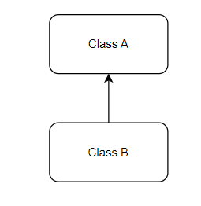
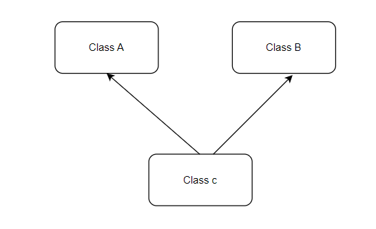
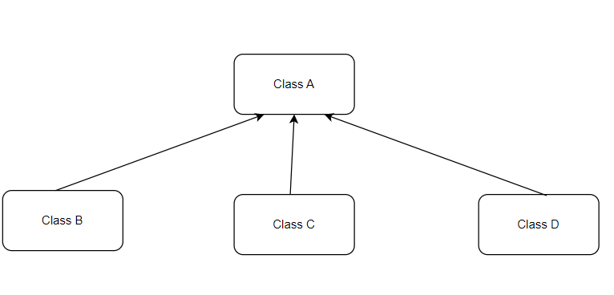

JAVA BASICS:

**High Level Language:** Man can understand these languages C++,Java

**Low Level Language:** Machine only can understand

1.Assembly level Language (Mnemonics)

2.Machine level Language(0’s and 1’s)

**‘**

Java is Platform Independent

JVM is Platform Dependent

JDK=JRE+DEV Tools

JRE=JVM+ Library classes

JIT

# Data Types

**OOPS**

Abstraction

Encapsulation

Inheritance

Polymorphism

Abstraction: The process of hiding unwanted data and showing only the required functionality is known as Abstraction.

Encapsulation: The process of wrapping of data into a single unit is known as Encapsulation.

Inheritance : Acquiring the properties of Parent class to Child class

Polymorphism: A method can exist in different format within the same class or Super and Sub Classes for doing same action in different ways or doing different action.

Inheritance:

There are 4 types of inheritance

1.Single Inheritance

2. Multiple Inheritance:

3. Multi Level

4.Hierarchial Inheritance:

5.Hybrid Inheritance:

**Association, Composition and Aggregation in Java:**

Association: The relationship between two or more classes. It tell about has-a relationship.

Composition: Strong relationship

Aggregation: Weak Relationship

**Object Class:**

There are 11 methods in object class.

1.public String toString();

2.public native int hashCode();

3.public boolean equals(Object o)

4.protected native Object clone() throws CloneNotSupportedException

5.protected void finalize() throws Throwable

6.public final class getClass()

7.public final void wait throws InterruptedException

8. public final void wait throws(long ms) InterruptedException

9. public final void wait throws(long ms, int ns) InterruptedException

10.public native final void notify()

11.public native final void notifyAll()

Strings:

String s1=”java”;

String s2=”java”;

s1 = “javascript”; a new object javascript will be created and now s1 will point to javascript.

Prove Strings are Immutable:

    String s1="vamsi";    
    System.out.println (s1.hashCode ());  
    s1= s1.concat ("krishna");   
    System.out.println (s1);  
    System.out.println (s1.hashCode ());

    String s1="Vamsi";     
    System.out.println(s1.equals("Vamsi"));   
    System.out.println(s1=="Vamsi");  
    Integer a=1;  
    Integer b=1;   
    System.out.println( a==b);  
    System.out.println(a.equals(b));  
    String s="vamsi";  
    String s2="vamsi";  
    System.out.println (s.equals (s2));     
    System.out.println (s==s2);    
    String s3=new String ("vamsi");   
    System.out.println (s.equals (s3));   
    System.out.println (s==s3);

**Why String is Immutable:**

1.Saving Heap Space

2.Good for HashMap Key

3.password and user name

4.good for multiple thread operation , Thread safe.

Even if some thread modifies the value, an entirely new String is created without affecting the original one.

**Rules For Creating Immutable Class:**

1.Make the class as final.

2.make the variables as private and final

3.create a constructor

4.only getters no setters

import java.util.ArrayList;
import java.util.List;

public final class Immutable {
private int id;
private String name;
private List<String hobbies;

    public int getId() {
        return id;
    }

    public String getName() {
        return name;
    }
    
    public List<String getHobbies() {
       List<String objects = new ArrayList< ();
        for(String hobby:hobbies){
            objects.add(hobby);
        }
        return objects;
    }

    @Override
    public String toString() {
        return "Immutable{" +
                "id=" + id +
                ", name='" + name + '\'' +
                ", hobbies=" + hobbies +
                '}';
    }

    public Immutable(int id, String name, List<String hobbyList) {
        this.id = id;
        this.name = name;
        this.hobbies = new ArrayList< ();
        for(String hobby: hobbyList){
            hobbies.add(hobby);
        }

    }

    public static void main(String[] args) {
        List<Stringh=new ArrayList< ();
        h.add("cycling");
        h.add("music");
        Immutable immutable=new Immutable (1,"Sai",h);
        h.add ("test");
        System.out.println (immutable);

    }
}

Upcasting means conversion from child to parent

Parent p=(Parent) new Child;

Downcasting means conversion from parent to child.

ParenT p = new Child();

Child c = (Child)p;

Wrapper Classes:

AutoBoxing and Auto UnBoxing:

    int autoBoxing=123;

    System.out.println(Integer.valueOf(autoBoxing));
    
    Integer autoUnBoxing = new Integer (23);
    
    System.out.println(autoUnBoxing.intValue ());
    
    String num = "123";
    
    int i = Integer.parseInt(num);

    System.out.println(i);

    Integer num1=123;

    String s1 = num1.toString ();
    
    System.out.println (s1);

# Marker Interface in Java

# What is marker interface?

An interface that does not contain methods, fields, and constants is known as marker interface. In other words, an empty interface is known as marker interface or tag interface. It delivers the run-time type information about an object. It is the reason that the JVM and compiler have additional information about an object. The Serializable and Cloneable interfaces are the example of marker interface. 
In short, it indicates a signal or command to the JVM.
The declaration of marker interface is the same as interface in Java but the interface must be empty. For example:

1. **public** **interface** Serializable
2. {
3.
4. }

## Uses of Marker Interface

Marker interface is used as a tag that inform the Java compiler by a message so that it can add some special behavior to the class implementing it. Java marker interface are useful if we have information about the class and that information never changes, in such cases, we use marker interface represent to represent the same. Implementing an empty interface tells the compiler to do some operations.

It is used to logically divide the code and a good way to categorize code. It is more useful for developing API and in frameworks like Spring.

## Built-in Marker Interface

In Java, built-in marker interfaces are the interfaces that are already present in the JDK and ready to use. There are many built-in marker interfaces some of them are:
o	Cloneable Interface
o	Serializable Interface
o	Remote Interface

How @Request Mapping works?

@RequestMapping(value =””)

@PutMapping

@DeleteMapping

@GetMapping

@PostMapping

When the application starts those end points get registered with the dispatcher servelet . When the request comes from the client to the dispatcher servelet, it redirects to the end point.

                                                                                           | Hashtable inherits Dictionary class.                                              |

| String | String Buffer | String Builder |
| --- | --- | --- |
| Immutable | Mutable | Mutable |
| Intialization is mandatory | Not mandatory | Not mandatory |
| Synchronized | Synchronized | Not Synchronized |
| Thread safe | Thread safe | Not Thread safe |
| Less performance | Less performance | Best Performance. Recommended while using Multi Threading |

| Comparable | Comparator |
| --- | --- |
| Natural Sorting Order | Customized Sorting |
| Java.lang | Java.util |
| compareTo() | Compare and equals() |
| Homogenous objects | Both Homogenous and Heterogenous Objects |

void removeDuplicates(List<String list) {

Set = new HashSet();

Iterator<String iterator = list.iterator();

while (iterator.hasNext()) {

Object element = iterator.next();

if (!set.add(element)){

iterator.remove();

}

}

}

Spring:

- It is a java EE framework for building applications.
- Simplify development that makes developers more productive.
- Dependency Injection.
- Loose coupling

  Spring Boot:

- It is designed upon Spring framework
- Mainly used for Rest Apis development.
- Primary feature of spring boot is Auto Configuration. It automatically configures the classes based on Requirement.
- Inbuild servers like tomcat and Jetty etc

Differences b/w Spring and Spring Boot

- Starter POMs ---- maven configuration will be simplified like spring boot starter web
- Version Management --- for each dependency version is important ,but in boot it is not required
- Auto Configuration (web.xml in spring , but not required in spring boot)
- Component Scanning
- Embedded Server
- In Memory DB
- Actuators

**SELECT** Salary **FROM**

(**SELECT** Salary **FROM** Employee **ORDER BY** salary **DESC** **LIMIT** 2) **AS** Emp

**ORDER BY** salary **LIMIT** 1;

 import java.util.*;

 public class MyClass {

 public static void main(String args[]) {

 String s="john doe";

 char[] ch = s.toCharArray();

 Map<Character,Integer map=new HashMap();

 for(Character c:ch){

 if(map.get(c)==null){

 map.put(c,1);

 }

 else{

 map.put(c,map.get(c)+1);

 }

 }

 map.entrySet().stream().filter(e-e.getValue()1).limit(1).map(e-e.getKey()).forEach(System.out::println);

 }

 }

**Why we should override hash code and equals method??**

hashcode -based on memory address

equals—based on references

contract b/w hash code and equals: if the hashcodes are same , then only equals method will be called.

1.if we don’t override hashcode

-  it generates the hashcode based on the memory address and as we using new keyword , the address will be different and the hashcodes are different . so equals method won’t be called and the same objects will be inserted which results in duplicates.

2. if we don’t override equals

-  if the hashcodes are same then equals method will be called , as we have not overridden equals method. Object class equal method compares the references and the references will be different , so it returns false , which results duplicates.

## SERIALIZATION and DESERIALIZATION , EXTERNALIZATION

 *  Serialization is the conversion of a Java Object into a static stream(sequence) of bytes, which we can then save to a 
    database or transfer over a network.

 *  Serialization can be achieved by implementing a markable interface named Serializable.

 *  Byte stream is platform-independent. This means that once you have a stream of bytes you can convert it into an
    object and run it on any kind of environment.

 *  A class is serialized successfully by 
    a) by implementing Serializable interface.
    b) All the fields must be serializable. If a field is not serializable, it must be marked transient.
    c) static fields of a class cannot be serialized.

  * Deserialization is the conversion of a static stream(sequence) of bytes from a network or database into java object.

 Serial Version UID:
  * private static final log serialVersionUID = 1L;
  
  * The JVM associates a version number with each serializable class. We use the serialVersionUID attribute to member version of a Serializable class to verify that a loaded class
    and the serializable object are compatible.

  * If the UID is not declared then the jvm will generate one automatically at run time. However, it's highly recommended that each class declares its serial UID , as the generated one is
    compiler dependent and thus may result in unexpected InvalidClassExceptions.

  
Externalization:

  * Externalization in java is used whenever you need to customize the serialization mechanism.

  * If there are many parameters you dont want to serialize then we cannot make them transient.

  * Based on our requirements we can serialize either the whole data field or a piece of the data fiels using the externalizable interface which can
    improve the performance of the application.

  * There are 2 methods readExternal(ObjectInput oi) ,writeExternal(ObjectOutput os) , using these methods we can pass the parameters which we want to serialize and deserialize.
 
