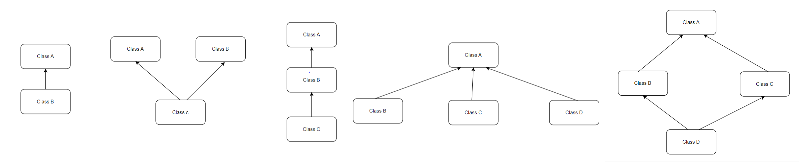

JAVA BASICS:

**High Level Language:** Man can understand these languages C++,Java

**Low Level Language:** Machine only can understand

1.Assembly level Language (Mnemonics)

2.Machine level Language(0’s and 1’s)

Java is Platform Independent

JVM is Platform Dependent

JDK=JRE+DEV Tools

JRE=JVM+ Library classes

JIT

# Data Types

**Why Pointers are not used in Java?**

1. Security : pointers allows user to access memory locations , which may lead hackers to access any file in your application.
2. Simplicity: The pointers are complex, so in order to make java simple , pointers are not used in java.

## OOPS

Abstraction

Encapsulation

Inheritance

Polymorphism

Abstraction: The process of hiding unwanted data and showing only the required functionality is known as Abstraction.

Encapsulation: The process of wrapping of data into a single unit is known as Encapsulation.

Inheritance : Acquiring the properties of Parent class to Child class

Polymorphism: A method can exist in different format within the same class or Super and Sub Classes for doing same action in different ways or doing different action.

Inheritance:

There are 4 types of inheritance

1.Single Inheritance 2. Multiple Inheritance 3. Multi Level 4.Hierarchial Inheritance 5.Hybrid Inheritance

## Association, Composition and Aggregation 

Association: The relationship between two or more classes. It tell about has-a relationship.

Composition: Strong relationship

Aggregation: Weak Relationship

## Object Class

There are 11 methods in object class.

1.public String toString();

2.public native int hashCode();

3.public boolean equals(Object o)

4.protected native Object clone() throws CloneNotSupportedException

5.protected void finalize() throws Throwable

6.public final class getClass()

7.public final void wait throws InterruptedException

8. public final void wait throws(long ms) InterruptedException

9. public final void wait throws(long ms, int ns) InterruptedException

10.public native final void notify()

11.public native final void notifyAll()

| Interface                                                                                                                             | Abstract Class                                                                                                                                                                                                                                                           |
|---------------------------------------------------------------------------------------------------------------------------------------|--------------------------------------------------------------------------------------------------------------------------------------------------------------------------------------------------------------------------------------------------------------------------|
| If we don’t know anything about implementation just we know requirement (100% abstract class)                                         | If we know partial implementation                                                                                                                                                                                                                                        |
| Every method in interface is public abstract                                                                                          | Abstract and concrete methods                                                                                                                                                                                                                                            |
| we cannot declare interface with following modifiers.  protected ,private , static, final, synchronized, native and strictfp.         | There are no restrictions in modifiers.                                                                                                                                                                                                                                  |
| Every variable present inside interface is always public static final whether we declare it or not                                    | The variables present inside abstarct class need not be public static and final.                                                                                                                                                                                         |
| For interface variables compulsory we should perform initialization at the time of declaration otherwise will get Compile time error. | abstract classes in Java can have instance variables without initialization. Abstract classes are meant to be extended by other classes, and the responsibility of initializing the instance variables lies with the concrete subclasses that extend the abstract class. |
| Cannot take constructor                                                                                                               | Can take constructor                                                                                                                                                                                                                                                     |

Upcasting means conversion from child to parent

Parent p=(Parent) new Child;

Downcasting means conversion from parent to child.

ParenT p = new Child();

Child c = (Child)p;

## Wrapper Classes

**AutoBoxing and Auto UnBoxing:**

    int autoBoxing=123;

    System.out.println(Integer.valueOf(autoBoxing));
    
    Integer autoUnBoxing = new Integer (23);
    
    System.out.println(autoUnBoxing.intValue ());
    
    String num = "123";
    
    int i = Integer.parseInt(num);

    System.out.println(i);

    Integer num1=123;

    String s1 = num1.toString ();
    
    System.out.println (s1);

# Marker Interface in Java

**What is marker interface?**

An interface that does not contain methods, fields, and constants is known as marker interface. In other words, an empty interface is known as marker interface or tag interface. It delivers the run-time type information about an object. It is the reason that the JVM and compiler have additional information about an object. The Serializable and Cloneable interfaces are the example of marker interface. 
In short, it indicates a signal or command to the JVM.
The declaration of marker interface is the same as interface in Java but the interface must be empty. For example:

     public interface Serializable
    {
    }

**Uses of Marker Interface**

Marker interface is used as a tag that inform the Java compiler by a message so that it can add some special behavior to the class implementing it. Java marker interface are useful if we have information about the class and that information never changes, in such cases, we use marker interface represent to represent the same. Implementing an empty interface tells the compiler to do some operations.

It is used to logically divide the code and a good way to categorize code. It is more useful for developing API and in frameworks like Spring.

**Built-in Marker Interface**

In Java, built-in marker interfaces are the interfaces that are already present in the JDK and ready to use. There are many built-in marker interfaces some of them are:
o	Cloneable Interface
o	Serializable Interface
o	Remote Interface

| String | String Buffer | String Builder |
| --- | --- | --- |
| Immutable | Mutable | Mutable |
| Intialization is mandatory | Not mandatory | Not mandatory |
| Synchronized | Synchronized | Not Synchronized |
| Thread safe | Thread safe | Not Thread safe |
| Less performance | Less performance | Best Performance. Recommended while using Multi Threading |

| Comparable | Comparator |
| --- | --- |
| Natural Sorting Order | Customized Sorting |
| Java.lang | Java.util |
| compareTo() | Compare and equals() |
| Homogenous objects | Both Homogenous and Heterogenous Objects |

## SERIALIZATION and DESERIALIZATION , EXTERNALIZATION

 *  Serialization is the conversion of a Java Object into a static stream(sequence) of bytes, which we can then save to a 
    database or transfer over a network.

 *  Serialization can be achieved by implementing a markable interface named Serializable.

 *  Byte stream is platform-independent. This means that once you have a stream of bytes you can convert it into an
    object and run it on any kind of environment.

 *  A class is serialized successfully by 
    a) by implementing Serializable interface.
    b) All the fields must be serializable. If a field is not serializable, it must be marked transient.
    c) static fields of a class cannot be serialized.

  * Deserialization is the conversion of a static stream(sequence) of bytes from a network or database into java object.

 Serial Version UID:
  * private static final log serialVersionUID = 1L;
  
  * The JVM associates a version number with each serializable class. We use the serialVersionUID attribute to member version of a Serializable class to verify that a loaded class
    and the serializable object are compatible.

  * If the UID is not declared then the jvm will generate one automatically at run time. However, it's highly recommended that each class declares its serial UID , as the generated one is
    compiler dependent and thus may result in unexpected InvalidClassExceptions.

  
Externalization:

  * Externalization in java is used whenever you need to customize the serialization mechanism.

  * If there are many parameters you dont want to serialize then we cannot make them transient.

  * Based on our requirements we can serialize either the whole data field or a piece of the data fiels using the externalizable interface which can
    improve the performance of the application.

  * There are 2 methods readExternal(ObjectInput oi) ,writeExternal(ObjectOutput os) , using these methods we can pass the parameters which we want to serialize and deserialize.
 
