JAVA BASICS:

**High Level Language:** Man can understand these languages C++,Java

**Low Level Language:** Machine only can understand

1.Assembly level Language (Mnemonics)

2.Machine level Language(0’s and 1’s)

**‘**

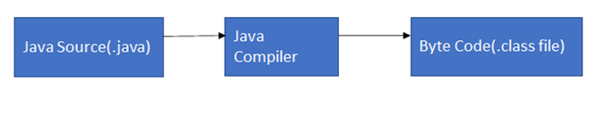
Java is Platform Independent

JVM is Platform Dependent

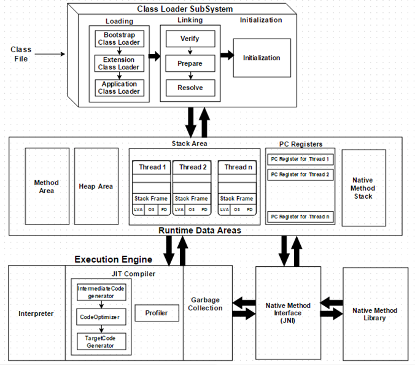
JDK=JRE+DEV Tools

JRE=JVM+ Library classes

JIT

**Object Class:**

There are 11 methods in object class.

1.public String toString();

2.public native int hashCode();

3.public boolean equals(Object o)

4.protected native Object clone() throws CloneNotSupportedException

5.protected void finalize() throws Throwable

6.public final class getClass()

7.public final void wait throws InterruptedException

8. public final void wait throws(long ms) InterruptedException

9. public final void wait throws(long ms, int ns) InterruptedException

10.public native final void notify()

11.public native final void notifyAll()

Strings:

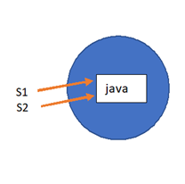
String s1=”java”;

String s2=”java”;

s1 = “javascript”; a new object javascript will be created and now s1 will point to javascript.

Prove Strings are Immutable:

String s1="vamsi";    
System.out.println (s1.hashCode ());  
s1= s1.concat ("krishna");   
System.out.println (s1);  
System.out.println (s1.hashCode ());

String s1="Vamsi";     
System.out.println(s1.equals("Vamsi"));   
System.out.println(s1=="Vamsi");  
Integer a=1;  
Integer b=1;   
System.out.println( a==b);  
System.out.println(a.equals(b));  
String s="vamsi";  
String s2="vamsi";  
System.out.println (s.equals (s2));     
System.out.println (s==s2);    
String s3=new String ("vamsi");   
System.out.println (s.equals (s3));   
System.out.println (s==s3);

**Why String is Immutable:**

1.Saving Heap Space

2.Good for HashMap Key

3.password and user name

4.good for multiple thread operation , Thread safe.

Even if some thread modifies the value, an entirely new String is created without affecting the original one.

**Rules For Creating Immutable Class:**

1.Make the class as final.

2.make the variables as private and final

3.create a constructor

4.only getters no setters

import java.util.ArrayList;
import java.util.List;

public final class Immutable {
private int id;
private String name;
private List<String hobbies;

    public int getId() {
        return id;
    }

    public String getName() {
        return name;
    }
    
    public List<String getHobbies() {
       List<String objects = new ArrayList< ();
        for(String hobby:hobbies){
            objects.add(hobby);
        }
        return objects;
    }

    @Override
    public String toString() {
        return "Immutable{" +
                "id=" + id +
                ", name='" + name + '\'' +
                ", hobbies=" + hobbies +
                '}';
    }

    public Immutable(int id, String name, List<String hobbyList) {
        this.id = id;
        this.name = name;
        this.hobbies = new ArrayList< ();
        for(String hobby: hobbyList){
            hobbies.add(hobby);
        }

    }

    public static void main(String[] args) {
        List<Stringh=new ArrayList< ();
        h.add("cycling");
        h.add("music");
        Immutable immutable=new Immutable (1,"Sai",h);
        h.add ("test");
        System.out.println (immutable);

    }

}

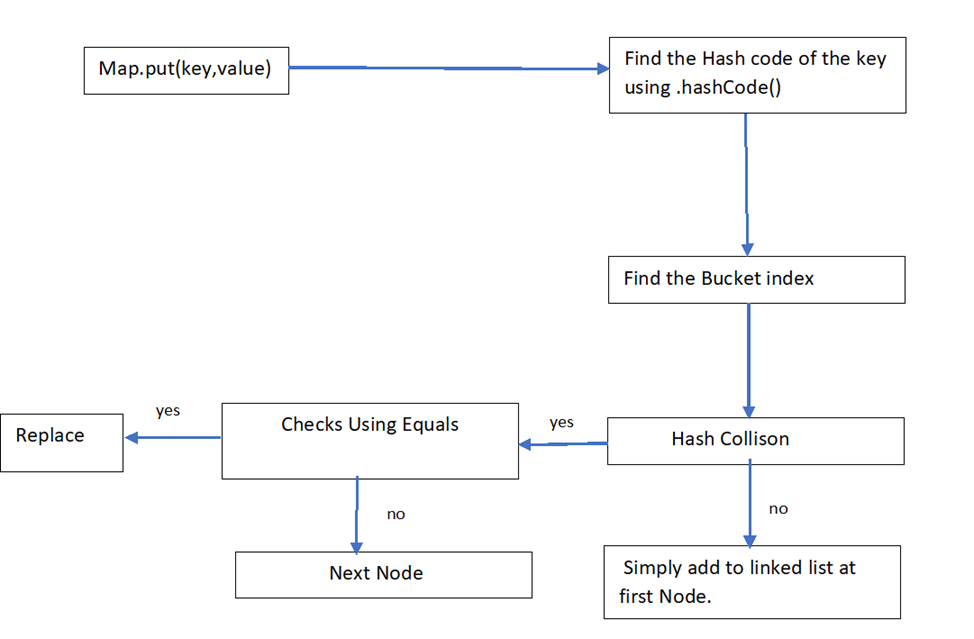
           
                    Internal Working of Hash Map

Hash set underlying data structure is Hash table . Hash set works on principle of Hashing.

1.when we are added the values into Hash map we should add both key and value.

2. .hashCode() method calculates the hash code of the key

3. Using the Hash code , bucket index will be calculated

4. If there is no Hash Collison then it adds the key value pair into the first node of the bucket.

5. If there is hash collision , then it compare the content of value using Equals method

6.If both the values are not same ,then it adds in the next node.

7.If the values are same then it adds to the linked list by replacing the existing equal node.

**HashCode:**

Providing Memory Identification Number which is given by JVM without checking content

**Equals Method:**

Compares the content or value comparison.

Hash Collision:

Hash collision means getting the same bucket number.

**Java 8 Enhancement to HashMap:**

map.get(“EA”);

Step 1: calculates hash code

Step 2: gets the bucket index

Step 3: traverses through the nodes in the bucket

So it takes time to traverse through all the nodes. Performance Degradation

-  In java 8 , after reaching some threshold of nodes , linked list is converted to tree . the threshold is called Treefy thresholding

Uses Compare to for find the order.

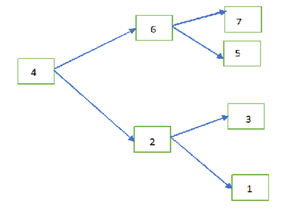
**Linked Hash Set:**

- Child class of Hash Set
- It is used when duplicates are not allowed and insertion order should be preserved.
- Underlying data structure is Hash table and linked list.
- For Cache based applications

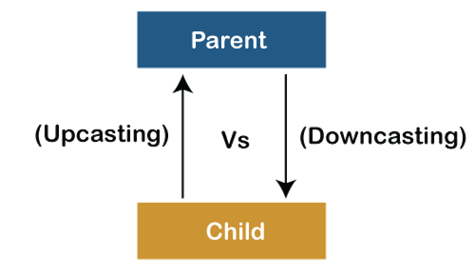
Upcasting means conversion from child to parent

Parent p=(Parent) new Child;

Downcasting means conversion from parent to child.

Parent p = **new** Child();

Child c = (Child)p;

Wrapper Classes:

AutoBoxing and Auto UnBoxing:

**int** autoBoxing=123;
System.***out***.println(Integer.*valueOf* (autoBoxing));
Integer autoUnBoxing=**new** Integer (23);
System.***out***.println(autoUnBoxing.intValue ());
String num=**"123"**;**int** i = Integer.*parseInt* (num);
System.***out***.println (i);
Integer num1=123;
String s1 = num1.toString ();
System.***out***.println (s1);

**OOPS**

Abstraction

Encapsulation

Inheritance

Polymorphism

Abstraction: The process of hiding unwanted data and showing only the required functionality is known as Abstraction.

Encapsulation: The process of wrapping of data into a single unit is known as Encapsulation.

Inheritance : Acquiring the properties of Parent class to Child class

Polymorphism: A method can exist in different format within the same class or Super and Sub Classes for doing same action in different ways or doing different action.

Inheritance:

There are 4 types of inheritance

1.Single Inheritance

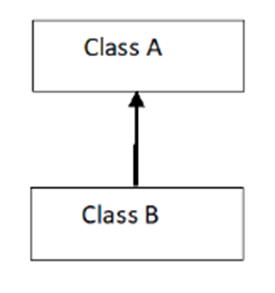
2. Multiple Inheritance:

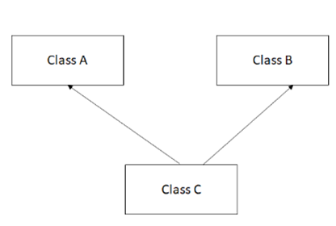
3. Multi Level

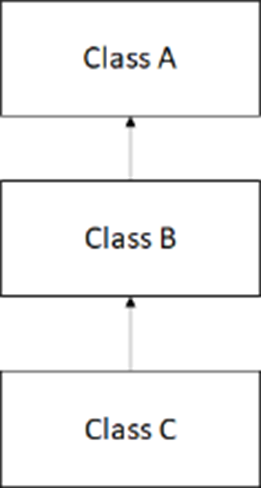
4.Hierarchial Inheritance:

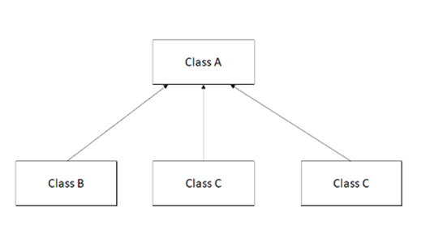
5.Hybrid Inheritance:

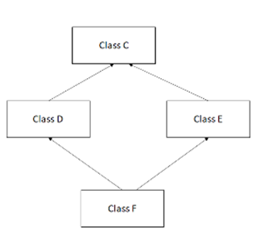
**Association, Composition and Aggregation in Java:**

Association: The relationship between two or more classes. It tell about has-a relationship.

Composition: Strong relationship

Aggregation: Weak Relationship

# Marker Interface in Java

# What is marker interface?

An interface that does not contain methods, fields, and constants is known as marker interface. In other words, an empty interface is known as marker interface or tag interface. It delivers the run-time type information about an object. It is the reason that the JVM and compiler have additional information about an object. The Serializable and Cloneable interfaces are the example of marker interface. 
In short, it indicates a signal or command to the JVM.
The declaration of marker interface is the same as interface in Java but the interface must be empty. For example:

1. **public** **interface** Serializable
2. {
3.
4. }

## Uses of Marker Interface

Marker interface is used as a tag that inform the Java compiler by a message so that it can add some special behavior to the class implementing it. Java marker interface are useful if we have information about the class and that information never changes, in such cases, we use marker interface represent to represent the same. Implementing an empty interface tells the compiler to do some operations.

It is used to logically divide the code and a good way to categorize code. It is more useful for developing API and in frameworks like Spring.

## Built-in Marker Interface

In Java, built-in marker interfaces are the interfaces that are already present in the JDK and ready to use. There are many built-in marker interfaces some of them are:
o	Cloneable Interface
o	Serializable Interface
o	Remote Interface

**COLLECTIONS**

**Difference between Collection and Collections:**

- Collection is an interface whereas collections is an utility class
- If you want to represent a group of individual object as a single entity then use collection
- Collections class has methods that can be performed on the collection like collections.sort(), min(), max (), reverseOrder(), emptylist(), addAll().

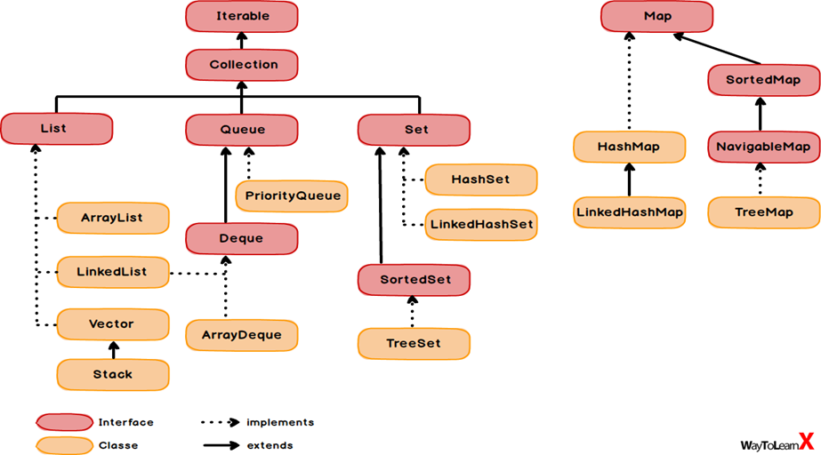
**What is the contract between hashCode() and equals() method**

- Whenever it is invoked on the same object more than once during execution of Java application the hashCode method must consistently return the same hashCode value
- if 2 objects are equal according to equals method then hashCode method return the same hash code for the 2 objects
- if the hash code value is same for both the object that doesn't mean that both objects are equal.

Why we should override and equals method?

Student s1=new Student(“Sai”,1);

Student s2=new Student(“Sai”,2);

Set<Studentset=new HashSet<();

set.add(s1);

set.add(s2);

- The hash code will be different
- The size of the set will be 2. Because we didn’t override equals and hash code in Student class and it will invoke objects class equals and that will consider these as distinct objects .
- Because the references are different and points to 2 separate objects in heap memory .This is a bad behaviour in an application and which is cause for few side effects like memory data redundancy etc.
- You overcome this issue it's always best practice to override equals and hashCode in custom classes.

Cursors in Java:

To retrieve elements one by one from collection.

There are 3 coursers in java

1.Enumeration

2.Iterator

3.List Iterator

Enumeration :

- It is used to get Objects one by one from the old Collection Objects like vector and it is introduced in 1.0 v.
- Enumeration e =v.elements();
- It defines the following two methods.
- public boolean hasMoreElements();
- public Objects nextElements();

Iterator:

1.We can apply Iterator concept for any Collection Object .Hence it is universal Cursor.

2. By Using Iterator we can both perform read and remove operations.

3.We can create iterator object by using iterator() method of Collection interface.

Iterator itr =C.iterator(); C is any collection object.

Methods:

1. public boolean hasNext();
2. public Object next();
3. public void remove();

Limitations of Iterator:

1.We can move only towards forward direction and cannot move to the backward direction. Hence these are single direction cursors.

2. By using iterator we can perform only read and remove operations and we can’t perform replacement of new Objects.

List Iterator:

1.By using List Iterator we can move either to the forward direction or the backward direction . Hence these are called as Bidirection cursor.

2.By using List Iterator we can perform replacement and addition of new Objects in addition read and remove operations.

Methods:

1.public boolean hasNext();

2. public Object next();

3. public

int nextIndex();

4. public boolean hasPrevious();

5.public Object previous();

6.public int previousIndex();

7.public void remove();

8. public void set(Object new);

9.public void add(Object new);

**Concurrent Collections:**

**Need of Concurrent Collections:**

1. Multiple threads can operate simultaneously , there may be data inconsistency
2. Performance is not up to the mark.
3. While one thread is iterating a collection object , by mistake if other thread trying to modify the collection immediately iterator fails by raising Concurrent Modification Exception.

ArrayList<Stringal=new ArrayList< ();

al.add("CTS");

al.add("TCS");

al.add("CAPGEMINI");

al.add("Infosys");

for(String hs:al){

if(hs.equals ("Infosys")){

al.remove (hs);

}

}
Exception in thread "main" java.util.ConcurrentModificationException

Map<String, Long phoneBook = **new** HashMap<String, Long();
phoneBook.put(**"Vikram"**,8149101254L);
phoneBook.put(**"Mike"**,9020341211L);
phoneBook.put(**"Jim"**,7788111284L);
Iterator<String keyIterator1 = phoneBook.keySet().iterator();**while** (keyIterator1.hasNext()){
String key = keyIterator1.next();**if** (**"Vikram"**.equals(key)){
phoneBook.put(**"John"**,9220341211L);
}
}

1. Concurrent Hash Map
2. CopyOnWriteArrayList
3. CopyOnWrite HashSet

**Concurrent HashMap:**

- Underlying Data Structure is Hash table
- Concurrent HashMap allows concurrent Read and Thread Safe Update Operation
- To Perform Read Operation Thread won’t require any Lock. But to Perform Update Operation Thread requires Lock .But it is the lock of only a particular part of Map (Bucket Level Lock).
- Instead of Whole Map Concurrent Update achieved by Internally dividing Map into Similar Portion which is defined by Concurrency Level.
- The Default Concurrency Level is 16.
- So Concurrent Hash Map allows Simultaneous Read operations and 16 write/update operations.
- It never throws Concurrent Modified Exception.

   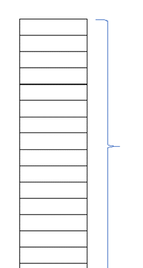
   16-- concurrency level.

Difference Between Concurrent Hash Map and Concurrent HashMap

| HashMap | Concurrent Hash Map |
| --- | --- |
| It is not Thread Safe | It is Thread Safe |
| Relatively Performance is High because Threads are not required to wait to Operate on Hash Map. | Relatively Performance is Low because Some Times Threads are required to wait to Operate on Concurrent Hash Map |
| While One Thread iterating Hash Map the other threads are not allowed to modify map objects otherwise we will get CME. | While One Thread iterating Hash Map the other threads are not allowed to modify map objects otherwise we won’t get CME. |
| Iterator of Hash map is fail fast | Iterator of `Concurrent Hash map is fail safe. |
| Null values are allowed | Null values |

**CopyOnWriteArrayList:**

Collection(I)

List(I)

CopyOnWriteArrayList (C)

It is a thread safe version of ArrayList , As the name indicates CopyOnWriteArrayList creates a cloned copy of underlying ArrayList for Every Update Operation. At Certain Point Both will Synchronized Automatically Which is taken care by JVM internally.

- As Update operation will be performed on cloned copy there is no effect for the threads which performs Read Operation
- It is costly to use because for every update Operation a cloned copy will be created. Hence it is the best option if several Read operations and less Write operations. Because if more Write operations are there then more cloned copies are created. Then performance will be degraded.
- Insertion Order is Preserved
- Duplicates are Allowed.
- 
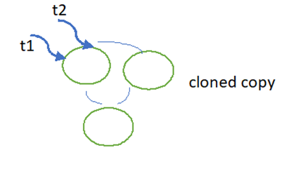

CopyOnWriteArrayList<String al=**new** CopyOnWriteArrayList< ();
al.add(**"CTS"**);
al.add(**"TCS"**);
al.add(**"CAPGEMINI"**);
al.add(**"Infosys"**);**for**(String hs:al){**if**(hs.equals (**"Infosys"**)){
al.remove (hs);
}
}
System.***out***.println (al);
}

 CopyOnWriteArraySet:

Collection(I)

Set(I)

CopyOnWriteArraySet (C)

It is a thread safe version of Set , As the name indicates CopyOnWriteArrayList creates a cloned copy of underlying ArrayList for Every Update Operation. At Certain Point Both will Synchronized Automatically Which is taken care by JVM internally.

- As Update operation will be performed on cloned copy there is no effect for the threads which performs Read Operation
- It is costly to use because for every update Operation a cloned copy will be created. Hence it is the best option if several Read operations and less Write operations. Because if more Write operations are there then more cloned copies are created. Then performance will be degraded.
- Insertion Order is Preserved
- Duplicates are Not Allowed.

How @Request Mapping works?

@RequestMapping(value =””)

@PutMapping

@DeleteMapping

@GetMapping

@PostMapping

When the application starts those end points get registered with the dispatcher servelet . When the request comes from the client to the dispatcher servelet, it redirects to the end point.

| ArrayList | LinkedList |
| --- | --- |
| 1) ArrayList internally uses a dynamic array to store the elements. | LinkedList internally uses a doubly linked list to store the elements. |
| 2) Manipulation with ArrayList is slow because it internally uses an array. If any element is removed from the array, all the bits are shifted in memory. | Manipulation with LinkedList is faster than ArrayList because it uses a doubly linked list, so no bit shifting is required in memory. |
| 3) An ArrayList class can act as a list only because it implements List only. | LinkedList class can act as a list and queue both because it implements List and Deque interfaces. |
| 4) ArrayList is better for storing and accessing data. | LinkedList is better for manipulating data. |
|  |  |

| HashMap                                                                                                                             | Hashtable                                                                         |
|-------------------------------------------------------------------------------------------------------------------------------------|-----------------------------------------------------------------------------------|
| 1) HashMap is non synchronized. It is not-thread safe and can't be shared between many threads without proper synchronization code. | Hashtable is synchronized. It is thread-safe and can be shared with many threads. |
| 2) HashMap allows one null key and multiple null values.                                                                            | Hashtable doesn't allow any null key or value.                                    |
| 3) HashMap is a new class introduced in JDK 1.2.                                                                                    | Hashtable is a legacy class.                                                      |
| 4) HashMap is fast.                                                                                                                 | Hashtable is slow.                                                                |
| 5) We can make the HashMap as synchronized by calling this code                                                                     |                                                                                   |
| Map m = Collections.synchronizedMap(hashMap);                                                                                       | Hashtable is internally synchronized and can't be unsynchronized.                 |
| 6) HashMap is traversed by Iterator.                                                                                                | Hashtable is traversed by Enumerator and Iterator.                                |
| 7) Iterator in HashMap is fail-fast.                                                                                                | Enumerator in Hashtable is not fail-fast.                                         |
| 8) HashMap inherits AbstractMap class.                                                                                              | Hashtable inherits Dictionary class.                                              |

| String | String Buffer | String Builder |
| --- | --- | --- |
| Immutable | Mutable | Mutable |
| Intialization is mandatory | Not mandatory | Not mandatory |
| Synchronized | Synchronized | Not Synchronized |
| Thread safe | Thread safe | Not Thread safe |
| Less performance | Less performance | Best Performance. Recommended while using Multi Threading |

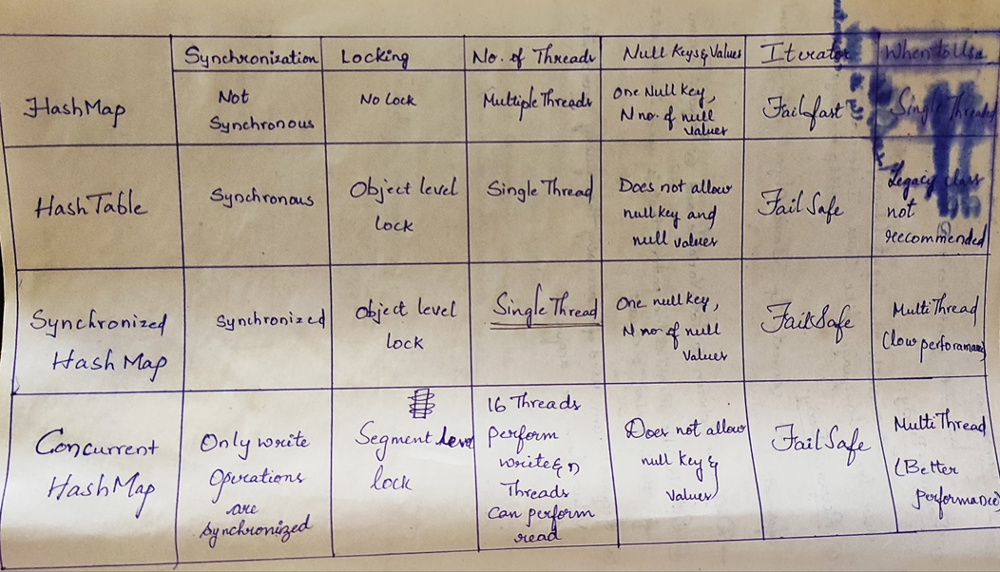

| Comparable | Comparator |
| --- | --- |
| Natural Sorting Order | Customized Sorting |
| Java.lang | Java.util |
| compareTo() | Compare and equals() |
| Homogenous objects | Both Homogenous and Heterogenous Objects |

void removeDuplicates(List<String list) {

Set = new HashSet();

Iterator<String iterator = list.iterator();

while (iterator.hasNext()) {

Object element = iterator.next();

if (!set.add(element)){

iterator.remove();

}

}

}

Spring:

- It is a java EE framework for building applications.
- Simplify development that makes developers more productive.
- Dependency Injection.
- Loose coupling

  Spring Boot:

- It is designed upon Spring framework
- Mainly used for Rest Apis development.
- Primary feature of spring boot is Auto Configuration. It automatically configures the classes based on Requirement.
- Inbuild servers like tomcat and Jetty etc

Differences b/w Spring and Spring Boot

- Starter POMs ---- maven configuration will be simplified like spring boot starter web
- Version Management --- for each dependency version is important ,but in boot it is not required
- Auto Configuration (web.xml in spring , but not required in spring boot)
- Component Scanning
- Embedded Server
- In Memory DB
- Actuators

**SELECT** Salary **FROM**

(**SELECT** Salary **FROM** Employee **ORDER BY** salary **DESC** **LIMIT** 2) **AS** Emp

**ORDER BY** salary **LIMIT** 1;

 import java.util.*;

 public class MyClass {

 public static void main(String args[]) {

 String s="john doe";

 char[] ch = s.toCharArray();

 Map<Character,Integer map=new HashMap();

 for(Character c:ch){

 if(map.get(c)==null){

 map.put(c,1);

 }

 else{

 map.put(c,map.get(c)+1);

 }

 }

 map.entrySet().stream().filter(e-e.getValue()1).limit(1).map(e-e.getKey()).forEach(System.out::println);

 }

 }

**Why we should override hash code and equals method??**

hashcode -based on memory address

equals—based on references

contract b/w hash code and equals: if the hashcodes are same , then only equals method will be called.

1.if we don’t override hashcode

-  it generates the hashcode based on the memory address and as we using new keyword , the address will be different and the hashcodes are different . so equals method won’t be called and the same objects will be inserted which results in duplicates.

2. if we don’t override equals

-  if the hashcodes are same then equals method will be called , as we have not overridden equals method. Object class equal method compares the references and the references will be different , so it returns false , which results duplicates.