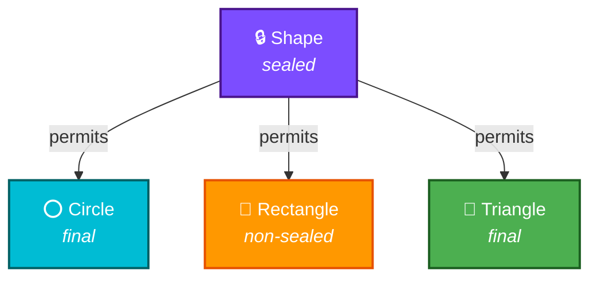

# Java 17 — LTS Features That Changed the Game

Java 17 is the **current Long-Term Support** release and the minimum version for Spring Boot 3.x and Spring Framework 6.x. Every FAANG interview in 2024+ expects you to know these features.

---

## Quick Reference

| Feature | What it does | Interview importance |
|---|---|---|
| **Sealed Classes** | Restricts which classes can extend a class | High — design pattern questions |
| **Records** | Immutable data carriers with auto-generated methods | High — DTO / value object questions |
| **Pattern Matching for instanceof** | Eliminates casting boilerplate | Medium — clean code discussions |
| **Text Blocks** | Multi-line string literals | Medium — readability questions |
| **Switch Expressions** | Switch returns values, arrow syntax | Medium — modern Java style |
| **Helpful NullPointerExceptions** | Detailed NPE messages | Low — debugging discussions |

---

## Sealed Classes

Sealed classes let you **control exactly which classes can extend** your class. This is huge for domain modelling.



```java
public sealed class Shape permits Circle, Rectangle, Triangle {
    public abstract double area();
}

public final class Circle extends Shape {
    private final double radius;
    public Circle(double radius) { this.radius = radius; }
    public double area() { return Math.PI * radius * radius; }
}

public non-sealed class Rectangle extends Shape {
    private final double width, height;
    public Rectangle(double w, double h) { this.width = w; this.height = h; }
    public double area() { return width * height; }
}

public final class Triangle extends Shape {
    private final double base, height;
    public Triangle(double b, double h) { this.base = b; this.height = h; }
    public double area() { return 0.5 * base * height; }
}
```

**Three modifier options for subclasses:**

| Modifier | Meaning |
|---|---|
| `final` | Cannot be extended further |
| `sealed` | Must declare its own `permits` list |
| `non-sealed` | Open for extension by anyone |

### When to use sealed classes

- **Payment types**: `sealed class Payment permits CreditCard, UPI, BankTransfer` — you know all payment types at compile time
- **State machines**: `sealed class OrderState permits Pending, Shipped, Delivered, Cancelled`
- **AST nodes** in compilers/interpreters

### Interview question

??? question "Why use sealed classes instead of an enum?"
    Enums are constants — they can't hold different fields per variant. Sealed classes let each subclass have **its own fields and behavior** while still restricting the hierarchy. A `Circle` has `radius`, a `Rectangle` has `width` and `height` — an enum can't model that.

---

## Records

Records are **immutable data carriers** that auto-generate `constructor`, `getters`, `equals()`, `hashCode()`, and `toString()`.

### Before Records (Java 8 style)

```java
public class Employee {
    private final String name;
    private final int age;
    private final String department;

    public Employee(String name, int age, String department) {
        this.name = name;
        this.age = age;
        this.department = department;
    }

    public String getName() { return name; }
    public int getAge() { return age; }
    public String getDepartment() { return department; }

    @Override public boolean equals(Object o) { /* 10 lines */ }
    @Override public int hashCode() { return Objects.hash(name, age, department); }
    @Override public String toString() { return "Employee{...}"; }
}
```

**~40 lines** of boilerplate for a simple data class.

### With Records (Java 17)

```java
public record Employee(String name, int age, String department) {}
```

**1 line.** You get everything for free. Access fields via `employee.name()` (not `getName()`).

### Custom validation in records

```java
public record Employee(String name, int age, String department) {
    public Employee {
        if (age < 0) throw new IllegalArgumentException("Age cannot be negative");
        if (name == null || name.isBlank()) throw new IllegalArgumentException("Name required");
    }
}
```

### What records CANNOT do

| Can | Cannot |
|---|---|
| Implement interfaces | Extend other classes |
| Have static fields/methods | Have mutable instance fields |
| Have custom methods | Be abstract |
| Override auto-generated methods | Declare additional instance fields |

### Real-world usage

- **DTOs** in REST APIs: `record CreateUserRequest(String email, String name) {}`
- **Kafka messages**: `record OrderEvent(String orderId, OrderStatus status, Instant timestamp) {}`
- **Map keys**: Records have proper `equals`/`hashCode` by default

### Interview question

??? question "Can a record implement an interface? Give a real example."
    Yes. `record Circle(double radius) implements Shape { public double area() { return Math.PI * radius * radius; } }`. This is commonly used to combine sealed interfaces with records for algebraic data types.

---

## Pattern Matching for instanceof

### Before (Java 8)

```java
if (obj instanceof String) {
    String s = (String) obj;  // explicit cast
    System.out.println(s.length());
}
```

### After (Java 17)

```java
if (obj instanceof String s) {
    System.out.println(s.length());  // s is already cast
}

// Also works with negation
if (!(obj instanceof String s)) {
    return;
}
// s is in scope here because we returned if it's NOT a String
System.out.println(s.toUpperCase());
```

### Combining with sealed classes

```java
public static double calculateArea(Shape shape) {
    if (shape instanceof Circle c) return Math.PI * c.radius() * c.radius();
    if (shape instanceof Rectangle r) return r.width() * r.height();
    if (shape instanceof Triangle t) return 0.5 * t.base() * t.height();
    throw new IllegalArgumentException("Unknown shape");
}
```

---

## Text Blocks

Multi-line strings without escape character hell.

### Before

```java
String json = "{\n" +
    "  \"name\": \"Vamsi\",\n" +
    "  \"role\": \"Engineer\",\n" +
    "  \"company\": \"Salesforce\"\n" +
    "}";
```

### After

```java
String json = """
        {
          "name": "Vamsi",
          "role": "Engineer",
          "company": "Salesforce"
        }
        """;
```

### SQL queries become readable

```java
String query = """
        SELECT e.name, d.department_name
        FROM employees e
        JOIN departments d ON e.dept_id = d.id
        WHERE e.salary > ?
        ORDER BY e.name
        """;
```

---

## Switch Expressions

Switch now **returns values** and uses **arrow syntax** — no more fall-through bugs.

### Before

```java
String result;
switch (day) {
    case MONDAY:
    case TUESDAY:
        result = "Weekday";
        break;  // forget this and you have a bug
    case SATURDAY:
    case SUNDAY:
        result = "Weekend";
        break;
    default:
        result = "Midweek";
}
```

### After

```java
String result = switch (day) {
    case MONDAY, TUESDAY -> "Weekday";
    case SATURDAY, SUNDAY -> "Weekend";
    default -> "Midweek";
};
```

### With blocks

```java
int numLetters = switch (day) {
    case MONDAY, FRIDAY, SUNDAY -> 6;
    case TUESDAY -> 7;
    default -> {
        String s = day.toString();
        yield s.length();  // 'yield' returns value from a block
    }
};
```

---

## Helpful NullPointerExceptions

### Before (Java 8)

```
Exception in thread "main" java.lang.NullPointerException
```

Which reference was null? No idea.

### After (Java 17)

```
Exception in thread "main" java.lang.NullPointerException:
  Cannot invoke "String.toLowerCase()" because the return value of
  "User.getName()" is null
```

Tells you exactly **which method returned null** and **which invocation failed**.

---

## Other Notable Features

| Feature | Description |
|---|---|
| **Stream.toList()** | `stream.toList()` — returns unmodifiable list, replaces `collect(Collectors.toList())` |
| **NullPointerException detail** | Enhanced messages pinpointing the null reference |
| **Compact Number Formatting** | `NumberFormat.getCompactNumberInstance()` — "1.2M" instead of "1,200,000" |
| **Foreign Function & Memory API** (Incubator) | Interact with native code without JNI |
| **Deprecation of Security Manager** | Marked for removal — don't use in new code |

---

## Interview Questions

??? question "1. What is the difference between a record and a Lombok @Value class?"
    Both create immutable data classes, but records are a **language feature** (no dependency needed), while Lombok is a compile-time annotation processor. Records cannot extend classes, Lombok's `@Value` can. Records generate `componentName()` accessors, Lombok generates `getComponentName()`. For new projects on Java 17+, prefer records.

??? question "2. Can you use sealed classes with interfaces?"
    Yes. `sealed interface Shape permits Circle, Rectangle {}`. This is actually the more common usage because it allows records as permitted subtypes: `record Circle(double radius) implements Shape {}`.

??? question "3. Your service has a switch over payment types. The PM adds a new type but no one updates the switch. How do sealed classes help?"
    With sealed classes + pattern matching (Java 21 preview), the compiler can **warn about missing cases** because it knows all permitted subtypes. This is called **exhaustiveness checking**. Without sealed classes, missing a case is a runtime bug.

??? question "4. Why did Java add records when Lombok already existed?"
    Lombok is a third-party hack using annotation processing. It can break across Java versions, doesn't work well with all IDEs, and adds a build dependency. Records are a first-class language feature — they work everywhere, have guaranteed semantics, and integrate with pattern matching and sealed classes.
