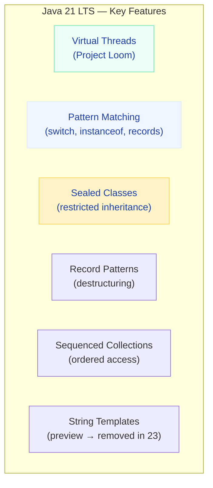
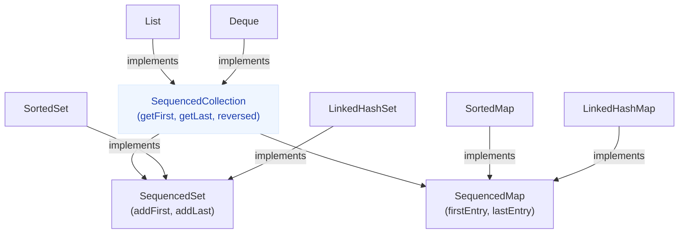

# Java 21+ Features (LTS)

> **The most significant Java release in a decade — virtual threads, pattern matching, records maturity, sealed types, and sequenced collections.**

---

!!! abstract "Why Java 21 Matters"
    Java 21 is an **LTS (Long-Term Support)** release. It's the version enterprises are migrating to from Java 11/17. It finalizes features that were in preview for years: virtual threads, pattern matching, record patterns, and sealed classes. If you're interviewing in 2024-2025, you MUST know these.

---

## Feature Overview



---

## Records (Finalized Java 16, Matured in 21)

Immutable data carriers — replace 90% of POJO boilerplate.

```java
// ❌ Old: 50+ lines of boilerplate
public class Point {
    private final int x;
    private final int y;
    public Point(int x, int y) { this.x = x; this.y = y; }
    public int x() { return x; }
    public int y() { return y; }
    @Override public boolean equals(Object o) { ... }
    @Override public int hashCode() { ... }
    @Override public String toString() { ... }
}

// ✅ New: ONE line — gets constructor, accessors, equals, hashCode, toString
public record Point(int x, int y) {}
```

### Records with Validation

```java
public record Email(String value) {
    // Compact constructor — validates before assignment
    public Email {
        if (value == null || !value.contains("@")) {
            throw new IllegalArgumentException("Invalid email: " + value);
        }
        value = value.toLowerCase().trim();  // can transform
    }
}

// Usage
Email email = new Email("User@Example.COM");
System.out.println(email.value());  // "user@example.com"
```

### Records as DTOs in Spring

```java
// Perfect for request/response DTOs
public record CreateOrderRequest(
    @NotBlank String customerId,
    @NotEmpty List<@Valid OrderItem> items,
    @NotNull Address shippingAddress
) {}

public record OrderItem(
    @NotBlank String sku,
    @Positive int quantity,
    @PositiveOrZero BigDecimal unitPrice
) {}

// Spring auto-deserializes JSON to records!
@PostMapping("/orders")
public OrderResponse createOrder(@Valid @RequestBody CreateOrderRequest request) {
    // request.customerId(), request.items() — accessor methods, no getters
}
```

---

## Sealed Classes (Finalized Java 17)

Restrict which classes can extend/implement a type — algebraic data types for Java.

```java
// Only these three classes can implement Shape
public sealed interface Shape permits Circle, Rectangle, Triangle {}

public record Circle(double radius) implements Shape {}
public record Rectangle(double width, double height) implements Shape {}
public record Triangle(double base, double height) implements Shape {}

// Compiler KNOWS all possible subtypes → exhaustive switch!
public double area(Shape shape) {
    return switch (shape) {
        case Circle c -> Math.PI * c.radius() * c.radius();
        case Rectangle r -> r.width() * r.height();
        case Triangle t -> 0.5 * t.base() * t.height();
        // No default needed — compiler verifies all cases covered!
    };
}
```

### Real-World: Domain Events

```java
public sealed interface OrderEvent permits
    OrderPlaced, OrderConfirmed, OrderShipped, OrderCancelled {}

public record OrderPlaced(String orderId, Instant placedAt, Money total) implements OrderEvent {}
public record OrderConfirmed(String orderId, Instant confirmedAt) implements OrderEvent {}
public record OrderShipped(String orderId, String trackingNumber) implements OrderEvent {}
public record OrderCancelled(String orderId, String reason) implements OrderEvent {}

// Event handler — compile-time guarantee you handle ALL events
public void handle(OrderEvent event) {
    switch (event) {
        case OrderPlaced e -> notifyWarehouse(e);
        case OrderConfirmed e -> chargePayment(e);
        case OrderShipped e -> notifyCustomer(e);
        case OrderCancelled e -> processRefund(e);
    }
}
```

---

## Pattern Matching (Evolved Through Java 14-21)

### instanceof with Pattern Variables

```java
// ❌ Old: cast after instanceof
if (obj instanceof String) {
    String s = (String) obj;
    System.out.println(s.length());
}

// ✅ New: binding variable in the check
if (obj instanceof String s) {
    System.out.println(s.length());  // s is already cast and scoped
}

// Guards with &&
if (obj instanceof String s && s.length() > 5) {
    System.out.println("Long string: " + s);
}
```

### Switch Pattern Matching (Java 21 — Finalized)

```java
// Pattern matching + guards in switch
public String describe(Object obj) {
    return switch (obj) {
        case Integer i when i > 0 -> "Positive integer: " + i;
        case Integer i when i < 0 -> "Negative integer: " + i;
        case Integer i -> "Zero";
        case String s when s.isBlank() -> "Empty string";
        case String s -> "String of length " + s.length();
        case List<?> list when list.isEmpty() -> "Empty list";
        case List<?> list -> "List with " + list.size() + " elements";
        case null -> "null value";
        default -> "Unknown: " + obj.getClass().getSimpleName();
    };
}
```

### Record Patterns (Destructuring)

```java
// Destructure records directly in patterns
public record Address(String city, String country) {}
public record Customer(String name, Address address) {}

public String greet(Object obj) {
    return switch (obj) {
        // Nested destructuring!
        case Customer(String name, Address(String city, String country))
            when country.equals("US") -> "Hey " + name + " from " + city + "!";
        case Customer(String name, _) -> "Hello " + name + "!";
        default -> "Hi there!";
    };
}
```

---

## Sequenced Collections (Java 21)

Finally — a unified way to access first/last elements across all ordered collections.

```java
// ❌ Before: inconsistent APIs
List<String> list = List.of("a", "b", "c");
list.get(0);                    // first
list.get(list.size() - 1);     // last (ugly!)

Deque<String> deque = new ArrayDeque<>(list);
deque.getFirst();               // first
deque.getLast();                 // last (different API!)

SortedSet<String> sorted = new TreeSet<>(list);
sorted.first();                 // first (yet another API!)
sorted.last();                  // last

// ✅ After: unified SequencedCollection interface
SequencedCollection<String> seq = list;
seq.getFirst();     // "a"
seq.getLast();      // "c"
seq.reversed();     // reversed view: ["c", "b", "a"]
```



---

## Other Notable Features

### Unnamed Variables (Java 22+, Preview in 21)

```java
// When you don't need the variable
try {
    parseJson(input);
} catch (JsonException _) {  // don't need the exception
    return defaultValue;
}

list.stream()
    .map(_ -> generateId())  // don't need the element
    .toList();

// In enhanced for
for (var _ : collection) {
    count++;  // just counting, don't need elements
}
```

### Unnamed Classes & Instance Main (Java 21 Preview)

```java
// Before: HelloWorld.java needs a class wrapper
public class HelloWorld {
    public static void main(String[] args) {
        System.out.println("Hello!");
    }
}

// After: just write code (great for learning/scripting)
void main() {
    System.out.println("Hello!");
}
```

---

## Migration Guide: Java 17 → Java 21

| Step | Action | Risk |
|------|--------|------|
| 1 | Update `pom.xml` / `build.gradle` to Java 21 | Low |
| 2 | Update Spring Boot to 3.2+ (supports VTs) | Medium (javax → jakarta) |
| 3 | Replace `synchronized` with `ReentrantLock` where VTs used | Low |
| 4 | Convert POJOs to Records where immutable | Low |
| 5 | Adopt switch pattern matching (replaces if-else chains) | Low |
| 6 | Enable virtual threads in Spring Boot | Low |
| 7 | Replace `ThreadLocal` with `ScopedValue` (if using VTs) | Medium |

---

## Interview Questions

??? question "What are the key features of Java 21 for backend developers?"

    **Answer:** The four most impactful:
    
    1. **Virtual Threads** — Write simple blocking code that scales to millions of concurrent requests. No reactive complexity needed.
    2. **Pattern Matching for switch** — Exhaustive type checking, guards, and record destructuring. Eliminates instanceof cascades.
    3. **Sealed Classes** — Algebraic data types. Combined with records and pattern matching, you get compile-time safety for domain modeling.
    4. **Sequenced Collections** — Finally, `getFirst()` and `getLast()` work consistently across List, Deque, SortedSet.

??? question "Records vs Lombok @Data — why prefer records?"

    **Answer:**
    
    - **Records** are a language feature — no compile-time annotation processing, no library dependency, guaranteed behavior across all Java tooling
    - **Immutable by design** — fields are final, no setters. Lombok @Data generates setters by default
    - **Pattern matching compatible** — records work with switch pattern destructuring; Lombok classes don't
    - **IDE support is perfect** — no Lombok plugin needed
    
    When to still use Lombok: mutable entities (JPA @Entity can't use records), builders for complex construction, when you need @With for copy-on-write.

??? question "Can you use records as JPA entities?"

    **Answer:** No. JPA entities require: a no-arg constructor (records don't have one), mutable fields (records are immutable), and proxy support (Hibernate creates subclasses). Use records for DTOs, value objects, and event payloads — not entities. The pattern is:
    
    ```java
    @Entity class OrderEntity { ... }  // JPA entity (mutable)
    record OrderResponse(...) {}       // DTO (immutable, returned to client)
    ```
