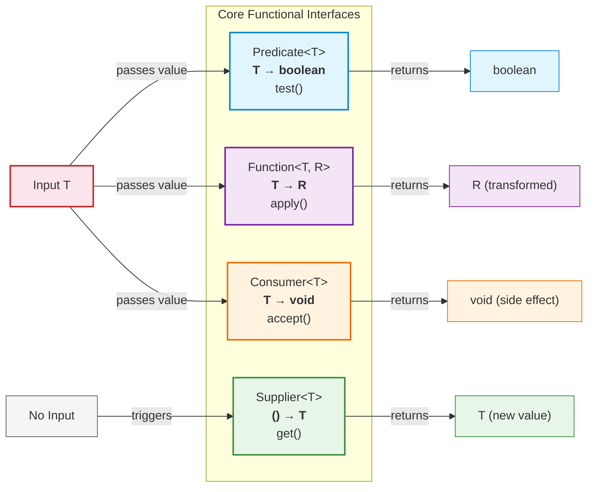
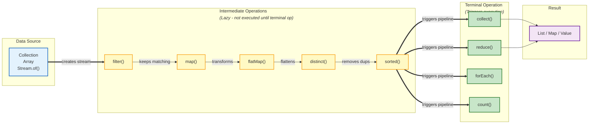
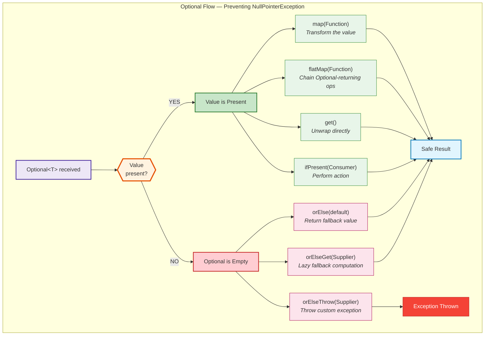

# Java 8 — The Most Important Java Release

Java 8 introduced **functional programming** to Java. Lambdas, Streams, and Optional are used in every modern Java codebase. This is the version most interview questions target.

---

## Features at a Glance

| Feature | What changed |
|---|---|
| **Lambda Expressions** | Pass behavior as arguments |
| **Functional Interfaces** | Interfaces with exactly one abstract method |
| **Stream API** | Declarative data processing pipelines |
| **Optional** | Eliminate null checks, model absence |
| **Default Methods** | Add methods to interfaces without breaking implementations |
| **Method References** | Shorthand for lambdas |
| **Date/Time API** | Immutable, thread-safe replacements for `Date`/`Calendar` |

---

## Functional Interfaces

An interface with **exactly one abstract method**. Annotated with `@FunctionalInterface`.

```java
@FunctionalInterface
public interface Calculator {
    int compute(int a, int b);
}

// Use with lambda
Calculator add = (a, b) -> a + b;
Calculator multiply = (a, b) -> a * b;

add.compute(10, 20);      // 30
multiply.compute(10, 20);  // 200
```

### Functional Interfaces at a Glance



### Built-in Functional Interfaces

| Interface | Method | Input → Output | Example |
|---|---|---|---|
| `Predicate<T>` | `test(T)` | `T → boolean` | Filtering |
| `Function<T, R>` | `apply(T)` | `T → R` | Transformation |
| `Consumer<T>` | `accept(T)` | `T → void` | Side effects (printing, logging) |
| `Supplier<T>` | `get()` | `() → T` | Lazy creation |
| `BiFunction<T, U, R>` | `apply(T, U)` | `(T, U) → R` | Two-arg transformation |
| `UnaryOperator<T>` | `apply(T)` | `T → T` | Same-type transformation |
| `BinaryOperator<T>` | `apply(T, T)` | `(T, T) → T` | Reducing two values |

```java
Predicate<String> isLong = s -> s.length() > 10;
Function<String, Integer> toLength = String::length;
Consumer<String> printer = System.out::println;
Supplier<LocalDate> today = LocalDate::now;

isLong.test("Hello");           // false
toLength.apply("Hello");        // 5
printer.accept("Hello");        // prints "Hello"
today.get();                    // 2024-01-15
```

---

## Lambda Expressions

Lambdas are anonymous functions. They implement the single abstract method of a functional interface.

```java
// Anonymous inner class (before Java 8)
Comparator<String> comp = new Comparator<String>() {
    @Override
    public int compare(String a, String b) {
        return a.length() - b.length();
    }
};

// Lambda (Java 8)
Comparator<String> comp = (a, b) -> a.length() - b.length();
```

### Lambda Syntax

```java
// No parameters
Runnable r = () -> System.out.println("Running");

// One parameter (parentheses optional)
Consumer<String> c = s -> System.out.println(s);

// Multiple parameters
BiFunction<Integer, Integer, Integer> add = (a, b) -> a + b;

// Multi-line body (needs braces and return)
Function<String, String> process = s -> {
    String trimmed = s.trim();
    return trimmed.toUpperCase();
};
```

---

## Method References

Shorthand for lambdas that just call an existing method.

| Type | Syntax | Lambda equivalent |
|---|---|---|
| Static method | `ClassName::method` | `x -> ClassName.method(x)` |
| Instance method (of object) | `object::method` | `x -> object.method(x)` |
| Instance method (of parameter) | `ClassName::method` | `(x) -> x.method()` |
| Constructor | `ClassName::new` | `x -> new ClassName(x)` |

```java
// Static method reference
Function<String, Integer> parse = Integer::parseInt;

// Instance method of parameter
Function<String, String> upper = String::toUpperCase;

// Constructor reference
Supplier<ArrayList<String>> newList = ArrayList::new;

// Usage
List<String> names = Arrays.asList("alice", "bob", "charlie");
names.stream().map(String::toUpperCase).forEach(System.out::println);
```

---

## Default & Static Methods in Interfaces

### Default methods — add behavior to interfaces without breaking existing code

```java
public interface Sortable {
    void sort();

    default void sortAndPrint() {
        sort();
        System.out.println("Sorted!");
    }
}
```

**Why it was added**: To allow adding methods to interfaces like `Collection` (e.g., `stream()`, `forEach()`) without breaking millions of existing implementations.

### Static methods in interfaces

```java
public interface Validator {
    boolean validate(String input);

    static Validator emailValidator() {
        return input -> input.contains("@");
    }
}

Validator v = Validator.emailValidator();
v.validate("test@email.com");  // true
```

---

## Stream API

Streams provide a **declarative way to process collections** — filter, transform, aggregate — without manual loops.



```
    Source ──► Filter ──► Map ──► Reduce ──► Result
    (List)    (keep some) (transform) (combine)
```

### Creating Streams

```java
List<String> list = List.of("Java", "Python", "Go");
list.stream();                    // from collection
Stream.of("A", "B", "C");        // from values
Arrays.stream(new int[]{1, 2});   // from array
IntStream.range(1, 10);           // from range
```

### Intermediate Operations (lazy — don't execute until terminal op)

| Operation | What it does |
|---|---|
| `filter(Predicate)` | Keep elements matching condition |
| `map(Function)` | Transform each element |
| `flatMap(Function)` | Flatten nested streams |
| `distinct()` | Remove duplicates |
| `sorted()` | Sort elements |
| `peek(Consumer)` | Debug — view elements without modifying |
| `limit(n)` | Take first N elements |
| `skip(n)` | Skip first N elements |

### Terminal Operations (trigger execution)

| Operation | What it does |
|---|---|
| `collect(Collector)` | Collect into a collection |
| `forEach(Consumer)` | Perform action on each element |
| `count()` | Count elements |
| `reduce(BinaryOperator)` | Combine all elements into one |
| `findFirst()` | Get first element (Optional) |
| `anyMatch(Predicate)` | Check if any element matches |
| `allMatch(Predicate)` | Check if all elements match |
| `toArray()` | Convert to array |

### Common Patterns

```java
List<Employee> employees = getEmployees();

// Filter + Collect
List<Employee> engineers = employees.stream()
    .filter(e -> e.getDepartment().equals("Engineering"))
    .collect(Collectors.toList());

// Map + Collect
List<String> names = employees.stream()
    .map(Employee::getName)
    .collect(Collectors.toList());

// Group by department
Map<String, List<Employee>> byDept = employees.stream()
    .collect(Collectors.groupingBy(Employee::getDepartment));

// Sum salaries
double totalSalary = employees.stream()
    .mapToDouble(Employee::getSalary)
    .sum();

// Find highest salary
Optional<Employee> topEarner = employees.stream()
    .max(Comparator.comparing(Employee::getSalary));

// Comma-separated names
String nameList = employees.stream()
    .map(Employee::getName)
    .collect(Collectors.joining(", "));
```

For the complete Stream API deep-dive, see the dedicated [Stream API](../stream-api/streamapi.md) page.

---

## Optional — Kill the NullPointerException

`Optional<T>` is a container that may or may not hold a value. It forces you to handle absence explicitly.



### Creating Optional

```java
Optional<String> present = Optional.of("Hello");        // must be non-null
Optional<String> nullable = Optional.ofNullable(null);   // allows null
Optional<String> empty = Optional.empty();               // explicitly empty
```

### Using Optional (the right way)

```java
// BAD — defeats the purpose
if (optional.isPresent()) {
    return optional.get();
}

// GOOD — functional style
optional.ifPresent(value -> System.out.println(value));

String result = optional.orElse("default");

String result = optional.orElseGet(() -> computeExpensiveDefault());

String result = optional.orElseThrow(
    () -> new NotFoundException("Not found"));

// Transform
Optional<Integer> length = optional.map(String::length);

// Chain
String city = getUser()
    .flatMap(User::getAddress)
    .flatMap(Address::getCity)
    .orElse("Unknown");
```

### `orElse` vs `orElseGet`

```java
// orElse — ALWAYS evaluates the fallback (even if value is present)
optional.orElse(expensiveCall());  // expensiveCall() runs regardless

// orElseGet — ONLY evaluates fallback if value is absent (lazy)
optional.orElseGet(() -> expensiveCall());  // runs only if empty
```

---

## Date and Time API (`java.time`)

The old `Date` and `Calendar` classes were mutable, not thread-safe, and poorly designed. Java 8 replaced them with an immutable, thread-safe API.

| Class | What it represents | Example |
|---|---|---|
| `LocalDate` | Date without time | `2024-01-15` |
| `LocalTime` | Time without date | `14:30:45` |
| `LocalDateTime` | Date + time | `2024-01-15T14:30:45` |
| `ZonedDateTime` | Date + time + timezone | `2024-01-15T14:30:45+05:30[Asia/Kolkata]` |
| `Instant` | Timestamp (epoch seconds) | `2024-01-15T09:00:45Z` |
| `Duration` | Time-based amount | `PT2H30M` (2 hours 30 min) |
| `Period` | Date-based amount | `P1Y2M3D` (1 year 2 months 3 days) |

```java
// Creating
LocalDate today = LocalDate.now();
LocalDate birthday = LocalDate.of(1998, 3, 15);
LocalDate parsed = LocalDate.parse("2024-01-15");

// Manipulation (returns new object — immutable!)
LocalDate tomorrow = today.plusDays(1);
LocalDate lastMonth = today.minusMonths(1);

// Comparison
today.isBefore(tomorrow);  // true
today.isAfter(birthday);   // true

// Formatting
String formatted = today.format(DateTimeFormatter.ofPattern("dd/MM/yyyy"));

// Duration between
long days = ChronoUnit.DAYS.between(birthday, today);

// Timezone conversion
ZonedDateTime ist = ZonedDateTime.now(ZoneId.of("Asia/Kolkata"));
ZonedDateTime pst = ist.withZoneSameInstant(ZoneId.of("America/Los_Angeles"));
```

---

## Interview Questions

??? question "1. What is the difference between `map()` and `flatMap()` in Streams?"
    `map()` transforms each element 1-to-1: `Stream<T> → Stream<R>`. `flatMap()` transforms each element to a stream and flattens all streams into one: `Stream<T> → Stream<R>` where each T produces multiple R's. Example: `list.stream().flatMap(s -> Arrays.stream(s.split(" ")))` splits sentences into words.

??? question "2. Can a functional interface have multiple methods?"
    Yes — it can have multiple **default** methods and **static** methods. It must have **exactly one abstract method**. It also inherits `equals()`, `hashCode()`, and `toString()` from `Object`, which don't count.

??? question "3. What is the difference between `Stream.of()` and `Arrays.stream()`?"
    `Stream.of(array)` treats the entire array as a single element (gives `Stream<int[]>`). `Arrays.stream(array)` gives `IntStream` for int arrays. For object arrays, both work the same. Always use `Arrays.stream()` for primitive arrays.

??? question "4. Why is `Optional.get()` considered bad practice?"
    `get()` throws `NoSuchElementException` if empty — no better than a NullPointerException. Use `orElse()`, `orElseGet()`, `orElseThrow()`, or `ifPresent()` instead. They force you to handle the empty case explicitly.

??? question "5. Your Stream pipeline processes 10 million records. How do you optimize it?"
    Use `parallelStream()` for CPU-bound operations on large datasets. Avoid parallel streams for I/O-bound tasks or small datasets (thread overhead > benefit). Use `collect(Collectors.toUnmodifiableList())` instead of `collect(Collectors.toList())` for immutability. Use primitive streams (`mapToInt`, `mapToDouble`) to avoid autoboxing. Consider short-circuiting operations (`findFirst`, `anyMatch`) when you don't need all results.
