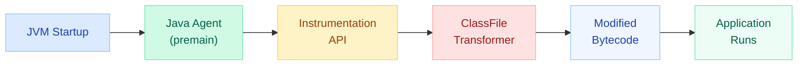
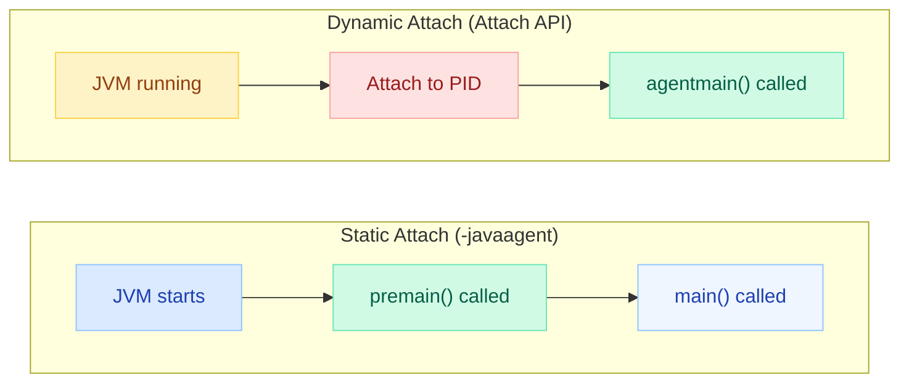
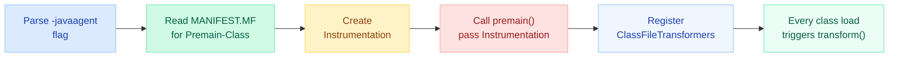
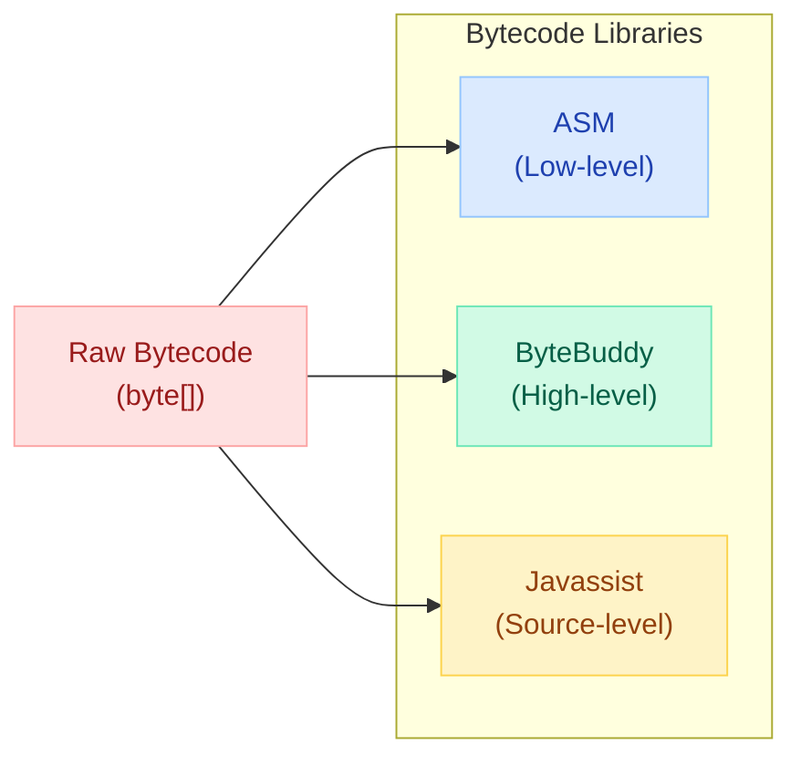
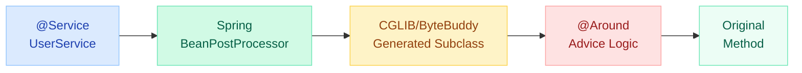
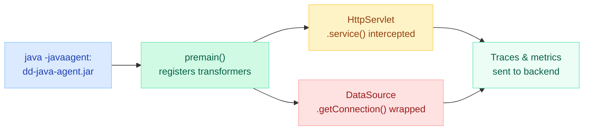
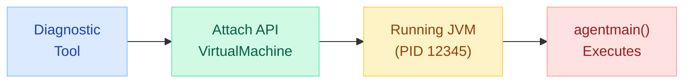
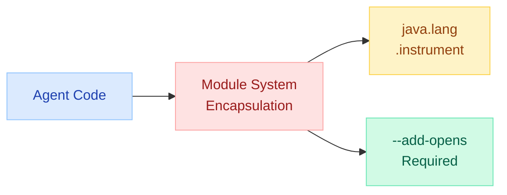

# Java Agents & Instrumentation

Ever wonder how Spring "magically" creates proxies, Hibernate lazy-loads entities without you writing proxy code, Mockito generates mocks at runtime, or APM tools like Datadog instrument your application without a single code change? The answer is **Java Agents and bytecode manipulation**. Understanding this mechanism demystifies the "magic" behind virtually every serious Java framework.

---

## What is a Java Agent?

A Java Agent is a special JAR that **hooks into the JVM's class-loading process** to transform bytecode before (or after) classes are loaded. Agents use the `java.lang.instrument` package to intercept and modify class definitions.



There are **two entry points** for agents:

| Entry Point | When It Runs | Use Case |
|---|---|---|
| `premain` | **Before** `main()` executes (static attach) | APM tools, profilers, coverage tools |
| `agentmain` | **After** JVM is already running (dynamic attach) | Hot-patching, debugging live systems |

---

## premain vs agentmain



### premain — Static Agent

```java
public class MyAgent {
    // Called BEFORE main() when using -javaagent flag
    public static void premain(String agentArgs, Instrumentation inst) {
        System.out.println("Agent loaded with args: " + agentArgs);
        inst.addTransformer(new MyTransformer());
    }
}
```

### agentmain — Dynamic Agent

```java
public class MyAgent {
    // Called when dynamically attached to a running JVM
    public static void agentmain(String agentArgs, Instrumentation inst) {
        System.out.println("Dynamic agent attached!");
        inst.addTransformer(new MyTransformer(), true); // canRetransform=true
        // Retransform already-loaded classes
        inst.retransformClasses(TargetClass.class);
    }
}
```

!!! info "Both can coexist"
    A single agent JAR can define both `premain` and `agentmain`. The JVM calls the appropriate one based on how the agent is loaded.

---

## How -javaagent Works

When you launch your application with:

```bash
java -javaagent:/path/to/agent.jar=options -jar app.jar
```

The JVM performs these steps:



### The Instrumentation API

The `java.lang.instrument.Instrumentation` interface is the core API:

```java
public interface Instrumentation {
    // Register a transformer to modify classes as they load
    void addTransformer(ClassFileTransformer transformer, boolean canRetransform);
    
    // Re-trigger transformation for already-loaded classes
    void retransformClasses(Class<?>... classes) throws UnmodifiableClassException;
    
    // Completely replace a class definition
    void redefineClasses(ClassDefinition... definitions) throws Exception;
    
    // Query loaded classes
    Class[] getAllLoadedClasses();
    Class[] getInitiatedClasses(ClassLoader loader);
    
    // Get object size in bytes
    long getObjectSize(Object objectToSize);
    
    // Check capabilities
    boolean isRetransformClassesSupported();
    boolean isRedefineClassesSupported();
}
```

### ClassFileTransformer

This is where the actual bytecode modification happens:

```java
public interface ClassFileTransformer {
    byte[] transform(
        ClassLoader         loader,
        String              className,      // e.g., "com/myapp/UserService"
        Class<?>            classBeingRedefined,
        ProtectionDomain    protectionDomain,
        byte[]              classfileBuffer  // raw bytecode
    ) throws IllegalClassFormatException;
}
```

!!! warning "Return null to skip"
    Return `null` from `transform()` to leave the class unchanged. Returning the modified `byte[]` replaces the class definition.

---

## MANIFEST.MF Entries

The agent JAR must include specific manifest attributes:

```properties
Manifest-Version: 1.0
Premain-Class: com.example.agent.MyAgent
Agent-Class: com.example.agent.MyAgent
Can-Retransform-Classes: true
Can-Redefine-Classes: true
Boot-Class-Path: byte-buddy-1.14.jar
```

| Attribute | Required For | Description |
|---|---|---|
| `Premain-Class` | Static attach (`-javaagent`) | Class with `premain()` method |
| `Agent-Class` | Dynamic attach (Attach API) | Class with `agentmain()` method |
| `Can-Retransform-Classes` | Retransformation | Set `true` to re-transform loaded classes |
| `Can-Redefine-Classes` | Redefinition | Set `true` to replace class definitions |
| `Boot-Class-Path` | Agent dependencies | Additional JARs for the bootstrap classloader |

### Maven Plugin Configuration

```xml
<plugin>
    <groupId>org.apache.maven.plugins</groupId>
    <artifactId>maven-jar-plugin</artifactId>
    <configuration>
        <archive>
            <manifestEntries>
                <Premain-Class>com.example.agent.TimingAgent</Premain-Class>
                <Agent-Class>com.example.agent.TimingAgent</Agent-Class>
                <Can-Retransform-Classes>true</Can-Retransform-Classes>
                <Can-Redefine-Classes>true</Can-Redefine-Classes>
            </manifestEntries>
        </archive>
    </configuration>
</plugin>
```

---

## Bytecode Libraries Comparison

Directly manipulating bytecode (raw bytes) is error-prone. These libraries provide higher-level abstractions:



| Feature | ASM | ByteBuddy | Javassist |
|---|---|---|---|
| **Abstraction Level** | Low (visitor pattern over opcodes) | High (fluent Java API) | Medium (source-like strings) |
| **Performance** | Fastest (no reflection) | Very fast (uses ASM internally) | Slower (compiles strings) |
| **Learning Curve** | Steep (must know JVM bytecode) | Gentle (reads like Java) | Moderate (string-based API) |
| **Type Safety** | Minimal | Full compile-time checks | None (strings) |
| **Used By** | Spring (internal), Groovy, Kotlin compiler | Mockito, Hibernate 6+, Jackson | Hibernate (legacy), JBoss |
| **Agent Support** | Manual | Built-in `AgentBuilder` | Manual |
| **Java 21+ Support** | Excellent | Excellent | Lagging |

### Quick Comparison: Adding Logging to a Method

=== "ByteBuddy"

    ```java
    new AgentBuilder.Default()
        .type(nameStartsWith("com.myapp"))
        .transform((builder, type, classLoader, module, domain) ->
            builder.method(any())
                   .intercept(MethodDelegation.to(LoggingInterceptor.class))
        ).installOn(instrumentation);
    ```

=== "Javassist"

    ```java
    CtClass cc = ClassPool.getDefault().get("com.myapp.UserService");
    CtMethod method = cc.getDeclaredMethod("findUser");
    method.insertBefore("System.out.println(\"Entering findUser\");");
    method.insertAfter("System.out.println(\"Exiting findUser\");");
    cc.toBytecode(); // returns modified byte[]
    ```

=== "ASM"

    ```java
    ClassReader cr = new ClassReader(classfileBuffer);
    ClassWriter cw = new ClassWriter(cr, ClassWriter.COMPUTE_FRAMES);
    ClassVisitor cv = new ClassVisitor(ASM9, cw) {
        @Override
        public MethodVisitor visitMethod(int access, String name, 
                String desc, String sig, String[] exceptions) {
            MethodVisitor mv = super.visitMethod(access, name, desc, sig, exceptions);
            return new MethodVisitor(ASM9, mv) {
                @Override
                public void visitCode() {
                    mv.visitFieldInsn(GETSTATIC, "java/lang/System", "out", 
                        "Ljava/io/PrintStream;");
                    mv.visitLdcInsn("Entering " + name);
                    mv.visitMethodInsn(INVOKEVIRTUAL, "java/io/PrintStream", 
                        "println", "(Ljava/lang/String;)V", false);
                    super.visitCode();
                }
            };
        }
    };
    cr.accept(cv, 0);
    return cw.toByteArray();
    ```

---

## How Frameworks Use Agents

### Spring AOP: CGLIB/ByteBuddy Proxies

Spring creates subclass-based proxies using CGLIB (backed by ASM) or ByteBuddy (Spring 6+) to implement AOP advice:



```java
// What Spring generates (conceptually):
public class UserService$$SpringCGLIB$$0 extends UserService {
    private MethodInterceptor interceptor;
    
    @Override
    public User findById(long id) {
        // Invoke advice chain, then delegate to super
        return (User) interceptor.intercept(this, findByIdMethod, 
            new Object[]{id}, methodProxy);
    }
}
```

!!! note "Why final methods can't be proxied"
    CGLIB creates a **subclass** of your bean. Final methods cannot be overridden, so AOP advice won't apply to them.

### Hibernate: Lazy Loading Proxies

Hibernate generates proxy subclasses for entities to implement lazy loading:

```java
// When you call entityManager.getReference(User.class, 1L):
// Hibernate returns a ByteBuddy-generated proxy:
public class User$HibernateProxy$abc123 extends User {
    private boolean initialized = false;
    
    @Override
    public String getName() {
        if (!initialized) {
            // Fire SQL query NOW (lazy load)
            initialize();
        }
        return super.getName();
    }
}
```

### Mockito: ByteBuddy for Mock Generation

Mockito uses ByteBuddy to create mock implementations at runtime:

```java
// When you write: UserService mock = Mockito.mock(UserService.class);
// ByteBuddy generates:
public class UserService$MockitoMock$xyz extends UserService {
    private InvocationHandler handler;
    
    @Override
    public User findById(long id) {
        // Record invocation, return stubbed value
        return handler.handle(new Invocation(this, "findById", id));
    }
}
```

### APM Tools: Instrumentation Agents

Tools like New Relic, Datadog, and Elastic APM use `-javaagent` to instrument your code without any changes:



What APM agents typically instrument:

- **HTTP servlets/controllers** -- track request duration, status codes
- **JDBC calls** -- capture SQL, execution time, connection pool usage
- **HTTP clients** -- trace outbound requests, propagate trace headers
- **Thread pools** -- monitor queue depth, rejection counts
- **Custom annotations** -- `@Trace` for application-specific spans

---

## Building a Simple Timing Agent (Complete Example)

Let's build an agent that measures method execution time for all classes in a specific package.

### Step 1 — The Agent Class

```java
package com.example.agent;

import java.lang.instrument.Instrumentation;

public class TimingAgent {

    public static void premain(String agentArgs, Instrumentation inst) {
        String targetPackage = (agentArgs != null) ? agentArgs : "com/example/app";
        System.out.println("[TimingAgent] Instrumenting package: " + targetPackage);
        inst.addTransformer(new TimingTransformer(targetPackage));
    }

    public static void agentmain(String agentArgs, Instrumentation inst) {
        premain(agentArgs, inst); // reuse same logic
    }
}
```

### Step 2 — The Transformer (using Javassist)

```java
package com.example.agent;

import javassist.*;
import java.lang.instrument.ClassFileTransformer;
import java.security.ProtectionDomain;

public class TimingTransformer implements ClassFileTransformer {
    private final String targetPackage;

    public TimingTransformer(String targetPackage) {
        this.targetPackage = targetPackage;
    }

    @Override
    public byte[] transform(ClassLoader loader, String className,
            Class<?> classBeingRedefined, ProtectionDomain protectionDomain,
            byte[] classfileBuffer) {

        // Only transform classes in our target package
        if (className == null || !className.startsWith(targetPackage)) {
            return null; // return null = no modification
        }

        try {
            ClassPool pool = ClassPool.getDefault();
            CtClass cc = pool.get(className.replace('/', '.'));

            for (CtMethod method : cc.getDeclaredMethods()) {
                if (method.isEmpty()) continue;

                // Add timing around every method
                method.addLocalVariable("__startTime", CtClass.longType);
                method.insertBefore("__startTime = System.nanoTime();");
                method.insertAfter(
                    "long __elapsed = System.nanoTime() - __startTime;" +
                    "System.out.println(\"[TIMING] \" + \"" + 
                    className.replace('/', '.') + "." + method.getName() + 
                    "\" + \" took \" + (__elapsed / 1_000_000.0) + \" ms\");"
                );
            }

            byte[] bytecode = cc.toBytecode();
            cc.detach(); // release from pool
            return bytecode;
        } catch (Exception e) {
            System.err.println("[TimingAgent] Failed to transform: " + className);
            e.printStackTrace();
            return null; // fallback to original bytecode
        }
    }
}
```

### Step 3 — The ByteBuddy Alternative (Recommended)

```java
package com.example.agent;

import net.bytebuddy.agent.builder.AgentBuilder;
import net.bytebuddy.asm.Advice;
import net.bytebuddy.matcher.ElementMatchers;
import java.lang.instrument.Instrumentation;

public class TimingAgentByteBuddy {

    public static void premain(String agentArgs, Instrumentation inst) {
        new AgentBuilder.Default()
            .type(ElementMatchers.nameStartsWith("com.example.app"))
            .transform((builder, type, classLoader, module, domain) ->
                builder.visit(Advice.to(TimingAdvice.class)
                       .on(ElementMatchers.any()))
            )
            .installOn(inst);
    }
}

// Advice class -- methods are inlined into target bytecode
class TimingAdvice {
    @Advice.OnMethodEnter
    static long enter() {
        return System.nanoTime();
    }

    @Advice.OnMethodExit
    static void exit(@Advice.Enter long startTime,
                     @Advice.Origin String method) {
        long elapsed = System.nanoTime() - startTime;
        System.out.println("[TIMING] " + method + " took " + 
            (elapsed / 1_000_000.0) + " ms");
    }
}
```

### Step 4 — Build and Run

```bash
# Build the agent JAR (Maven already configured with manifest entries)
mvn clean package

# Run your application with the agent
java -javaagent:target/timing-agent-1.0.jar=com/example/app \
     -jar target/my-application.jar
```

**Output:**
```
[TimingAgent] Instrumenting package: com/example/app
[TIMING] com.example.app.UserService.findById took 12.34 ms
[TIMING] com.example.app.OrderService.placeOrder took 45.67 ms
```

---

## Attach API (Dynamic Attach to Running JVM)

The Attach API (`com.sun.tools.attach`) lets you load agents into an already-running JVM -- perfect for production debugging without restarts.



```java
import com.sun.tools.attach.VirtualMachine;

public class AttachToRunningJvm {
    public static void main(String[] args) throws Exception {
        // Get PID of target JVM (e.g., from jps command)
        String pid = "12345";
        
        // Attach to the running JVM
        VirtualMachine vm = VirtualMachine.attach(pid);
        
        try {
            // Load the agent dynamically -- triggers agentmain()
            vm.loadAgent("/path/to/timing-agent.jar", "com/example/app");
            System.out.println("Agent loaded successfully!");
        } finally {
            vm.detach();
        }
    }
}
```

### Listing Available JVMs

```java
import com.sun.tools.attach.VirtualMachineDescriptor;
import com.sun.tools.attach.VirtualMachine;

// List all running JVMs (like jps)
for (VirtualMachineDescriptor vmd : VirtualMachine.list()) {
    System.out.println(vmd.id() + " : " + vmd.displayName());
}
```

!!! warning "Module system restriction (Java 9+)"
    The Attach API is in the `jdk.attach` module. You may need to add `--add-modules jdk.attach` or include the module dependency.

---

## Limitations and Restrictions

### Module System Restrictions (Java 9+)



| Restriction | Impact | Workaround |
|---|---|---|
| **Strong encapsulation** | Can't access internal JDK classes | `--add-opens java.base/java.lang=ALL-UNNAMED` |
| **Module boundaries** | Agent may not see application modules | Ensure agent is on classpath or has proper `requires` |
| **Illegal access warnings** | Reflective access generates warnings in Java 9-15 | Denied by default in Java 16+ |

### Native Image Limitations (GraalVM)

| Issue | Reason |
|---|---|
| **No runtime bytecode generation** | Native images compile all code AOT |
| **No dynamic class loading** | ClassLoaders are not available at runtime |
| **No Instrumentation API** | JVM-specific mechanism doesn't exist in native |
| **CGLIB/ByteBuddy proxies fail** | Must use build-time proxy generation instead |

!!! tip "Spring Native workaround"
    Spring AOT (Ahead-of-Time) processing generates proxies at build time instead of runtime, making them compatible with GraalVM native images.

### General Limitations

- **Cannot add/remove fields or methods** -- retransformation can only change method bodies
- **Cannot change class hierarchy** -- can't add interfaces or change superclass
- **Performance overhead** -- every class load passes through all registered transformers
- **Debugging difficulty** -- transformed bytecode differs from source code
- **Class verification** -- invalid bytecode causes `VerifyError` at class load time

---

## Quick Recall

| Concept | Key Point |
|---|---|
| `premain` | Runs before `main()`, requires `-javaagent` flag |
| `agentmain` | Runs on dynamic attach to running JVM |
| `ClassFileTransformer` | Interface where bytecode modification happens |
| `Instrumentation` | JVM-provided API to register transformers |
| Return `null` from `transform()` | Means "don't modify this class" |
| ByteBuddy `AgentBuilder` | Highest-level, safest way to build agents |
| ASM | Fastest, lowest-level, used internally by others |
| Javassist | Source-string-based, easiest for simple cases |
| MANIFEST.MF | Must declare `Premain-Class` / `Agent-Class` |
| `Can-Retransform-Classes` | Required to re-transform already-loaded classes |
| Native images | Agents don't work -- use build-time AOT instead |
| Spring AOP | Uses CGLIB/ByteBuddy subclass proxies |
| Mockito | Uses ByteBuddy to generate mock subclasses |
| Hibernate | Uses ByteBuddy proxies for lazy loading |

---

## Interview Template

???+ example "Tell me about Java Agents and how frameworks use them"

    **Opening (30s):**
    "A Java Agent is a JAR that hooks into the JVM's class-loading mechanism via the `java.lang.instrument` API. It can intercept and modify bytecode before or after classes are loaded. This is the mechanism behind Spring AOP proxies, Hibernate lazy loading, Mockito mocks, and APM tools like Datadog."

    **Core Concepts (1-2 min):**
    
    - **premain** runs before `main()` via `-javaagent` flag -- used by APM tools
    - **agentmain** attaches dynamically to running JVMs via the Attach API
    - `ClassFileTransformer.transform()` receives raw bytecode and returns modified bytecode
    - Libraries like ByteBuddy, ASM, and Javassist simplify bytecode manipulation
    - MANIFEST.MF must declare `Premain-Class` and/or `Agent-Class`

    **Framework Examples (1 min):**
    
    - **Spring AOP**: CGLIB/ByteBuddy generates subclass proxies at runtime for `@Transactional`, `@Cacheable`
    - **Hibernate**: ByteBuddy proxies intercept getter calls to trigger lazy SQL loading
    - **Mockito**: ByteBuddy generates mock subclasses that record invocations
    - **Datadog/New Relic**: `-javaagent` instruments servlets, JDBC, HTTP clients without code changes

    **Limitations (30s):**
    
    - Cannot add/remove fields or change class hierarchy via retransformation
    - Module system (Java 9+) restricts reflective access -- needs `--add-opens`
    - GraalVM native images don't support agents -- must use AOT proxy generation
    - Performance overhead: every class passes through registered transformers

    **Production Insight:**
    "In production, we use the Datadog agent for distributed tracing. It instruments `HttpServlet.service()`, JDBC drivers, and HTTP clients to create trace spans automatically. For custom instrumentation, we add `@Trace` annotations that the agent recognizes via its transformer pipeline."

---

???+ tip "Common Interview Questions"

    1. **What's the difference between premain and agentmain?**
       premain runs at JVM startup (before main), agentmain attaches dynamically to a running JVM.

    2. **Why can't Spring AOP advise final methods?**
       Spring uses subclass-based proxies (CGLIB/ByteBuddy). Final methods can't be overridden in a subclass.

    3. **How does Mockito create mocks without requiring interfaces?**
       ByteBuddy generates a subclass at runtime that overrides all non-final methods to record invocations.

    4. **Why don't Java Agents work with GraalVM native images?**
       Native images compile everything AOT -- there's no JVM, no class loading, no Instrumentation API at runtime.

    5. **What happens if your transformer returns invalid bytecode?**
       The JVM throws a `VerifyError` when the class is loaded, preventing it from being used.

    6. **Can you retransform classes that are already loaded?**
       Yes, if `Can-Retransform-Classes: true` is in the manifest. Call `inst.retransformClasses(...)` to trigger re-transformation.
