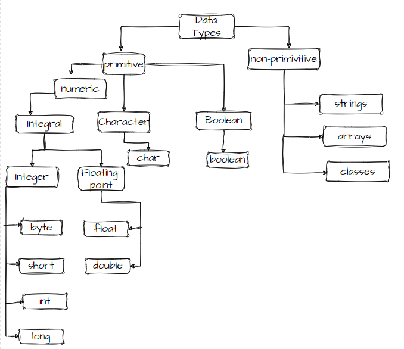

## Java Basics

**High Level Language:** Man can understand these languages C++,Java

**Low Level Language:** Machine only can understand

1.Assembly level Language (Mnemonics)

2.Machine level Language(0’s and 1’s)

Java is Platform Independent

JVM is Platform Dependent

JDK=JRE+DEV Tools

JRE=JVM+ Library classes

JIT

## What is class?
* It's a blueprint or a template for creating objects, which are instances of the class.

## Data Types

## Variables

 * A variable is a container which holds the value of a property.

 **Types of Variables**

a) Local Variables: within a method. Direct access.

b) Instance Variables: declared inside the class. Accessing is done through object.

c) Static Variables: Memory alloted only once . Declared using static keyword. Directly access. 

## Ways Of Creating an Object in Java:

1. New keyword.
2. New Instance method of a class
3. New Instance method of constructor.
4. clone method
5. object deserialization
6. java Reflection

**Why Pointers are not used in Java?**
1. Security : pointers allows user to access memory locations , which may lead hackers to access any file in your application.
2. Simplicity: The pointers are complex, so in order to make java simple , pointers are not used in java.

## Object Class

There are 11 methods in object class.

1.public String toString();

2.public native int hashCode();

3.public boolean equals(Object o)

4.protected native Object clone() throws CloneNotSupportedException

5.protected void finalize() throws Throwable

6.public final class getClass()

7.public final void wait throws InterruptedException

8. public final void wait throws(long ms) InterruptedException

9. public final void wait throws(long ms, int ns) InterruptedException

10.public native final void notify()

11.public native final void notifyAll()

## Difference between Abstract Class and Interface

| Interface                                                                                                                             | Abstract Class                                                                                                                                                                                                                                                           |
|---------------------------------------------------------------------------------------------------------------------------------------|--------------------------------------------------------------------------------------------------------------------------------------------------------------------------------------------------------------------------------------------------------------------------|
| If we don’t know anything about implementation just we know requirement (100% abstract class)                                         | If we know partial implementation                                                                                                                                                                                                                                        |
| Every method in interface is public abstract                                                                                          | Abstract and concrete methods                                                                                                                                                                                                                                            |
| we cannot declare interface with following modifiers.  protected ,private , static, final, synchronized, native and strictfp.         | There are no restrictions in modifiers.                                                                                                                                                                                                                                  |
| Every variable present inside interface is always public static final whether we declare it or not                                    | The variables present inside abstarct class need not be public static and final.                                                                                                                                                                                         |
| For interface variables compulsory we should perform initialization at the time of declaration otherwise will get Compile time error. | abstract classes in Java can have instance variables without initialization. Abstract classes are meant to be extended by other classes, and the responsibility of initializing the instance variables lies with the concrete subclasses that extend the abstract class. |
| Cannot take constructor                                                                                                               | Can take constructor                                                                                                                                                                                                                                                     |

* When to use Interface and when Abstract class in real applications?

* An interface is a good choice when you know a method has to be there, but it can be implemented differently by independent derived classes.
      public class FixedBilling
      {
       
       }
      
       public class VariableBilling
       {
       
       }

* Abstract class is a good choice when you are sure some methods are concrete/defined and must be implemented in the same way in all derived classes.
* 

## Upcasting and Downcasting

Upcasting means conversion from child to parent

Parent p=(Parent) new Child;

Downcasting means conversion from parent to child.

ParenT p = new Child();

Child c = (Child)p;

## Marker Interface in Java

**What is marker interface?**

An interface that does not contain methods, fields, and constants is known as marker interface. In other words, an empty interface is known as marker interface or tag interface. It delivers the run-time type information about an object. It is the reason that the JVM and compiler have additional information about an object. The Serializable and Cloneable interfaces are the example of marker interface.
In short, it indicates a signal or command to the JVM.
The declaration of marker interface is the same as interface in Java but the interface must be empty. For example:

     public interface Serializable
    {
    }

**Uses of Marker Interface**

Marker interface is used as a tag that inform the Java compiler by a message so that it can add some special behavior to the class implementing it. Java marker interface are useful if we have information about the class and that information never changes, in such cases, we use marker interface represent to represent the same. Implementing an empty interface tells the compiler to do some operations.

It is used to logically divide the code and a good way to categorize code. It is more useful for developing API and in frameworks like Spring.

**Built-in Marker Interface**

In Java, built-in marker interfaces are the interfaces that are already present in the JDK and ready to use. There are many built-in marker interfaces some of them are:
o	Cloneable Interface
o	Serializable Interface
o	Remote Interface

