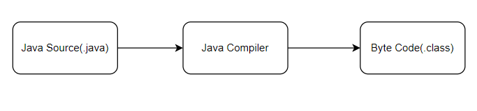

## Java Basics

**High Level Language:** Man can understand these languages C++,Java

**Low Level Language:** Machine only can understand

1.Assembly level Language (Mnemonics)

2.Machine level Language(0’s and 1’s)

Java is Platform Independent

JVM is Platform Dependent

JDK=JRE+DEV Tools

JRE=JVM+ Library classes

JIT

## What Is the JVM?

A Virtual Machine is a software implementation of a physical machine.
Java was developed with the concept of WORA (Write Once Run Anywhere), which runs on a VM.
The compiler compiles the Java file into a Java .class file, then that .class file is input into the JVM, which loads and executes the class file.
Below is a diagram of the Architecture of the JVM.

How Does the JVM Work?
As shown in the above architecture diagram, the JVM is divided into three main subsystems:

ClassLoader Subsystem
Runtime Data Area
Execution Engine
1. ClassLoader Subsystem
   Java's dynamic class loading functionality is handled by the ClassLoader subsystem. It loads, links. and initializes the class file when it refers to a class for the first time at runtime, not compile time.

1.1 Loading
Classes will be loaded by this component. BootStrap ClassLoader, Extension ClassLoader, and Application ClassLoader are the three ClassLoaders that will help in achieving it.

BootStrap ClassLoader – Responsible for loading classes from the bootstrap classpath, nothing but rt.jar. Highest priority will be given to this loader.
Extension ClassLoader – Responsible for loading classes which are inside the ext folder (jre\lib).
Application ClassLoader –Responsible for loading Application Level Classpath, path mentioned Environment Variable, etc.
The above ClassLoaders will follow Delegation Hierarchy Algorithm while loading the class files.

1.2 Linking
Verify – Bytecode verifier will verify whether the generated bytecode is proper or not if verification fails we will get the verification error.
Prepare – For all static variables memory will be allocated and assigned with default values.
Resolve – All symbolic memory references are replaced with the original references from Method Area.
1.3 Initialization
This is the final phase of ClassLoading; here, all static variables will be assigned with the original values, and the static block will be executed.

2. Runtime Data Area
   The Runtime Data Area is divided into five major components:

Method Area – All the class-level data will be stored here, including static variables. There is only one method area per JVM, and it is a shared resource.
Heap Area – All the Objects and their corresponding instance variables and arrays will be stored here. There is also one Heap Area per JVM. Since the Method and Heap areas share memory for multiple threads, the data stored is not thread-safe.
Stack Area – For every thread, a separate runtime stack will be created. For every method call, one entry will be made in the stack memory which is called Stack Frame. All local variables will be created in the stack memory. The stack area is thread-safe since it is not a shared resource. The Stack Frame is divided into three subentities:
Local Variable Array – Related to the method how many local variables are involved and the corresponding values will be stored here.
Operand stack – If any intermediate operation is required to perform, operand stack acts as runtime workspace to perform the operation.
Frame data – All symbols corresponding to the method is stored here. In the case of any exception, the catch block information will be maintained in the frame data.
PC Registers – Each thread will have separate PC Registers, to hold the address of current executing instruction once the instruction is executed the PC register will be updated with the next instruction.
Native Method stacks – Native Method Stack holds native method information. For every thread, a separate native method stack will be created.
3. Execution Engine
   The bytecode, which is assigned to the Runtime Data Area, will be executed by the Execution Engine. The Execution Engine reads the bytecode and executes it piece by piece.

Interpreter – The interpreter interprets the bytecode faster but executes slowly. The disadvantage of the interpreter is that when one method is called multiple times, every time a new interpretation is required.
JIT Compiler – The JIT Compiler neutralizes the disadvantage of the interpreter. The Execution Engine will be using the help of the interpreter in converting byte code, but when it finds repeated code it uses the JIT compiler, which compiles the entire bytecode and changes it to native code. This native code will be used directly for repeated method calls, which improve the performance of the system.
Intermediate Code Generator – Produces intermediate code
Code Optimizer – Responsible for optimizing the intermediate code generated above
Target Code Generator – Responsible for Generating Machine Code or Native Code
Profiler – A special component, responsible for finding hotspots, i.e. whether the method is called multiple times or not.
Garbage Collector: Collects and removes unreferenced objects. Garbage Collection can be triggered by calling System.gc(), but the execution is not guaranteed. Garbage collection of the JVM collects the objects that are created.
Java Native Interface (JNI): JNI will be interacting with the Native Method Libraries and provides the Native Libraries required for the Execution Engine.

Native Method Libraries: This is a collection of the Native Libraries, which is required for the Execution Engine.

## What is class?
* It's a blueprint or a template for creating objects, which are instances of the class.