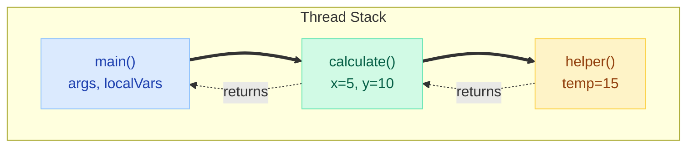
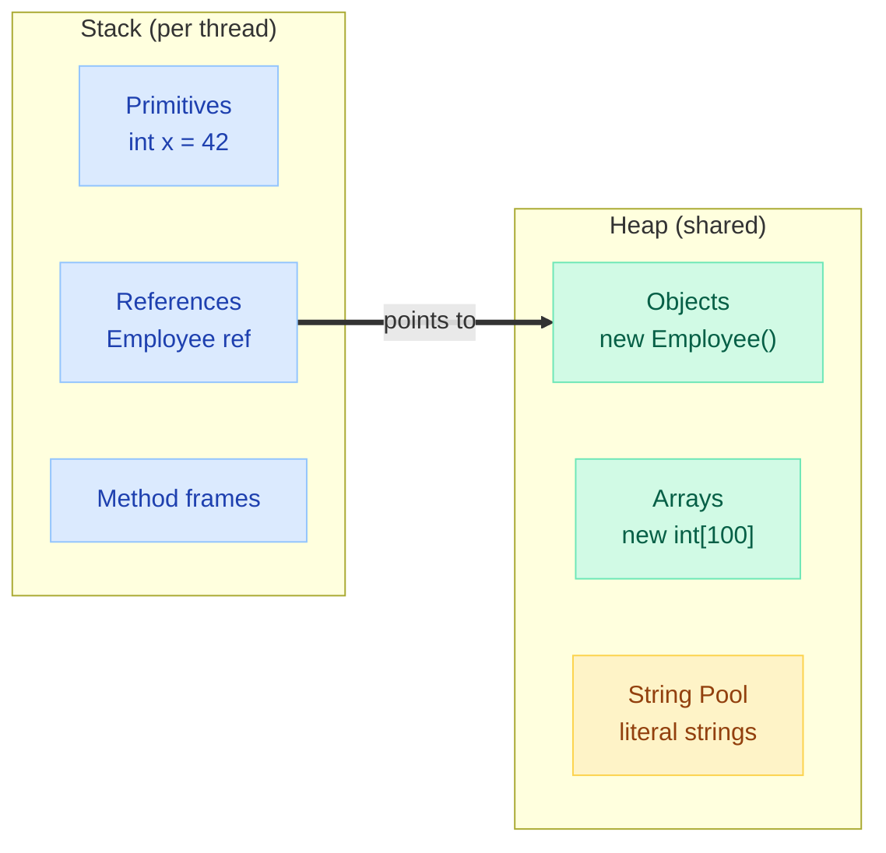
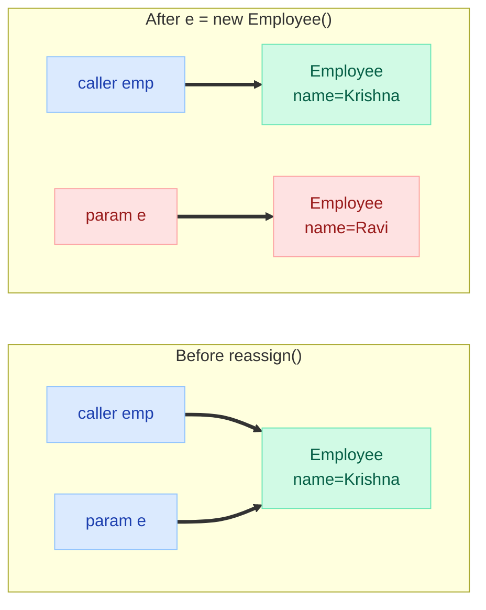
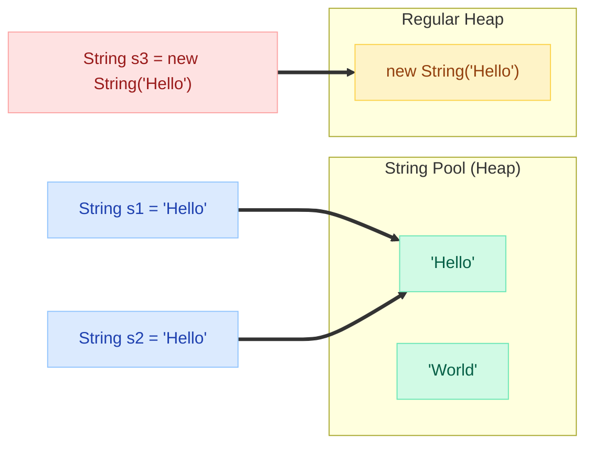

# Java Basics — Part 2: Methods, Memory & Strings

> **Continuation from [Part 1: Language Fundamentals](JavaBasics.md) — Platform, Types, Variables, Operators, Control Flow, Arrays.**

---

## 7. Methods

### Method Signature and Overloading

```java
public class MethodDemo {
    // Method signature = name + parameter types (NOT return type)

    // Overloading: same name, different parameters
    public int add(int a, int b) { return a + b; }
    public double add(double a, double b) { return a + b; }
    public int add(int a, int b, int c) { return a + b + c; }

    // THIS IS NOT OVERLOADING (compile error):
    // public long add(int a, int b) { return a + b; } // same params, different return

    // Varargs (must be last parameter, treated as array)
    public int sum(int... numbers) {
        int total = 0;
        for (int n : numbers) total += n;
        return total;
    }
    // sum(), sum(1), sum(1,2,3) — all valid
}
```

### Overloading Resolution Rules

```java
public void test(int x) { }       // (1)
public void test(long x) { }      // (2)
public void test(Integer x) { }   // (3)
public void test(int... x) { }    // (4)

test(5);  // Calls (1) — exact match
// Resolution priority: exact match → widening → boxing → varargs
// If (1) removed: calls (2) — widening int→long
// If (1)&(2) removed: calls (3) — autoboxing int→Integer
// If (1)&(2)&(3) removed: calls (4) — varargs (last resort)
```

### Method Call Stack



Each method call creates a **stack frame** containing: local variables, parameters, return address, and operand stack. Frames are pushed on call and popped on return. **StackOverflowError** = too many frames (infinite recursion).

---

## 8. Memory Basics — Stack vs Heap



| Feature | Stack | Heap |
|---|---|---|
| **Stores** | Primitives, references, method frames | Objects, arrays |
| **Scope** | Thread-private | Shared across threads |
| **Size** | Small (~512KB-1MB default) | Large (configurable, GBs) |
| **Speed** | Very fast (LIFO pointer move) | Slower (GC overhead) |
| **Allocation** | Automatic on method call | `new` keyword |
| **Deallocation** | Automatic on method return | Garbage Collector |
| **Error** | StackOverflowError | OutOfMemoryError |
| **Thread-safe** | Yes (private to thread) | No (shared, needs sync) |

### Pass-by-Value (Java is ALWAYS pass-by-value)

Java does **not** have pass-by-reference. It passes the **value of the reference** (for objects) or the **value itself** (for primitives).

**Primitives — value is copied:**

```java
public class PassByValueDemo {

    static void change(int x) {
        x = 100;  // modifies local copy only
    }

    public static void main(String[] args) {
        int num = 42;
        change(num);
        System.out.println(num);  // 42 (unchanged)
    }
}
```

**Objects — reference value is copied (not the object):**

```java
public class ReferenceDemo {

    static void changeName(Employee e) {
        e.setName("Krishna");  // modifies SAME object via shared reference
    }

    static void reassign(Employee e) {
        e = new Employee("Ravi");  // new LOCAL reference — caller unaffected
    }

    public static void main(String[] args) {
        Employee emp = new Employee("Vamsi");

        changeName(emp);
        System.out.println(emp.getName());  // "Krishna" — object was modified

        reassign(emp);
        System.out.println(emp.getName());  // "Krishna" — reassign had no effect
    }
}
```



---

## 9. String Basics

### Immutability and the String Pool



```java
String s1 = "Hello";              // from pool
String s2 = "Hello";              // same pool reference
String s3 = new String("Hello");  // new object on heap (bypasses pool)

s1 == s2;          // true (same pool reference)
s1 == s3;          // FALSE (different objects)
s1.equals(s3);     // true (same content)
s3.intern() == s1; // true (intern() returns pool reference)
```

### Why Strings Are Immutable

1. **String Pool works** — if Strings were mutable, changing one would corrupt all references
2. **Thread-safe** — no synchronization needed for shared Strings
3. **Security** — class names, URLs, passwords can't be modified after creation
4. **hashCode caching** — computed once, used forever (crucial for HashMap keys)

### Concatenation Performance

```java
// BAD: O(n^2) — creates new String each iteration
String result = "";
for (int i = 0; i < 10000; i++) {
    result += i;  // new StringBuilder + toString() each time
}

// GOOD: O(n) — single StringBuilder
StringBuilder sb = new StringBuilder();
for (int i = 0; i < 10000; i++) {
    sb.append(i);
}
String result = sb.toString();
```

| Class | Mutable? | Thread-Safe? | Performance |
|---|---|---|---|
| `String` | No | Yes (immutable) | Slow for repeated concat |
| `StringBuilder` | Yes | No | Fast (single-threaded) |
| `StringBuffer` | Yes | Yes (synchronized) | Slower than StringBuilder |

---

## 10. Common Pitfalls — Production Bugs

### Integer Overflow (Silent Killer)

```java
int a = Integer.MAX_VALUE;  // 2,147,483,647
int b = a + 1;              // -2,147,483,648 (wraps around silently!)

// Production bug: array size calculation
int size = numRows * numCols;  // can overflow for large matrices!
// Fix: use Math.multiplyExact() (throws ArithmeticException on overflow)
int size = Math.multiplyExact(numRows, numCols);
```

### Floating Point Comparison

```java
double result = 0.1 + 0.2;
System.out.println(result == 0.3);  // FALSE! result = 0.30000000000000004

// Fix: use threshold comparison or BigDecimal
System.out.println(Math.abs(result - 0.3) < 1e-9);  // true

// For financial calculations: ALWAYS use BigDecimal
BigDecimal price = new BigDecimal("0.1");
BigDecimal tax = new BigDecimal("0.2");
BigDecimal total = price.add(tax);  // exactly 0.3
```

### Autoboxing/Unboxing Traps

```java
// Integer cache: -128 to 127 are cached
Integer a = 127;
Integer b = 127;
System.out.println(a == b);  // TRUE (same cached object)

Integer c = 128;
Integer d = 128;
System.out.println(c == d);  // FALSE (different objects!)
System.out.println(c.equals(d));  // true

// NullPointerException from unboxing
Integer x = null;
int y = x;  // NPE! unboxing null throws NullPointerException

// Performance trap: unintentional boxing in loops
Long sum = 0L;  // Long (wrapper) not long (primitive)
for (long i = 0; i < 1_000_000; i++) {
    sum += i;  // creates a new Long object every iteration!
}
```

### == vs equals() on Strings

```java
String s1 = "hello";
String s2 = "hello";
String s3 = new String("hello");
String s4 = "hel" + "lo";          // compile-time constant → pool
String prefix = "hel";
String s5 = prefix + "lo";         // runtime concatenation → new object

s1 == s2;   // true  (pool)
s1 == s3;   // false (new object)
s1 == s4;   // true  (compile-time constant folding)
s1 == s5;   // FALSE (runtime concat, new object!)
```

### Null Handling

```java
// NullPointerException is Java's #1 runtime exception
String name = null;
name.length();  // NPE

// Safe patterns:
// 1. Null check
if (name != null && name.length() > 0) { }

// 2. Objects.requireNonNull (fail-fast in constructor/method entry)
public void setName(String name) {
    this.name = Objects.requireNonNull(name, "name cannot be null");
}

// 3. Optional (Java 8+)
Optional<String> opt = Optional.ofNullable(name);
opt.ifPresent(n -> System.out.println(n.length()));
String result = opt.orElse("default");
```

---

## 11. Interview Questions — FAANG Level

??? question "1. What does this print? (Integer Cache)"
    ```java
    Integer a = 100, b = 100;
    Integer c = 200, d = 200;
    System.out.println(a == b);
    System.out.println(c == d);
    ```
    **Answer:** `true` then `false`. Java caches Integer objects for values -128 to 127. `a` and `b` point to the same cached object. `c` and `d` are beyond the cache range, so they are different objects. Always use `.equals()` for wrapper comparison.

??? question "2. What does this print? (String Pool + Concat)"
    ```java
    String s1 = "Hello";
    String s2 = "Hel" + "lo";
    String s3 = "Hel";
    String s4 = s3 + "lo";
    System.out.println(s1 == s2);
    System.out.println(s1 == s4);
    ```
    **Answer:** `true` then `false`. `s2` is a compile-time constant (both parts are literals), so it resolves to the pool. `s4` involves a variable (`s3`), so concatenation happens at runtime via StringBuilder, creating a new object.

??? question "3. Is Java pass-by-value or pass-by-reference?"
    **Always pass-by-value.** For primitives, the actual value is copied. For objects, the **reference value** (memory address) is copied — not the object itself. You can modify the object's state through the copied reference, but you cannot make the caller's variable point to a different object.

??? question "4. What does this print? (Post-increment)"
    ```java
    int x = 5;
    int y = x++ + ++x;
    System.out.println("x=" + x + " y=" + y);
    ```
    **Answer:** `x=7 y=12`. Step by step: `x++` evaluates to 5 (then x becomes 6). `++x` increments x to 7, evaluates to 7. So `y = 5 + 7 = 12`.

??? question "5. What happens when you override equals() but not hashCode()?"
    Objects that are `.equals()` may end up in **different HashMap buckets** because their hashCodes differ. `put()` works fine, but `get()` with an equal key checks a different bucket and returns `null`. The contract states: if `a.equals(b)` then `a.hashCode() == b.hashCode()`.

??? question "6. What does this print? (Array pass-by-value)"
    ```java
    int[] arr = {1, 2, 3};
    modify(arr);
    System.out.println(Arrays.toString(arr));

    void modify(int[] a) {
        a[0] = 99;
        a = new int[]{4, 5, 6};
    }
    ```
    **Answer:** `[99, 2, 3]`. The reference to the array is copied. `a[0] = 99` modifies the original array. `a = new int[]{4,5,6}` only changes the local reference — the caller's reference still points to the original array (now modified at index 0).

??? question "7. Why is String immutable in Java?"
    Four reasons: (1) **String Pool** — sharing requires immutability. (2) **Thread safety** — no sync needed. (3) **Security** — class names, DB connections, URLs can't be tampered after creation. (4) **hashCode caching** — computed once, crucial for HashMap performance.

??? question "8. What does this print? (Autoboxing + ternary)"
    ```java
    Object obj = true ? new Integer(1) : new Double(2.0);
    System.out.println(obj);
    ```
    **Answer:** `1.0` (not `1`!). The ternary operator promotes both operands to a common type. `Integer` and `Double` are promoted to `double`, so the result is `1.0` boxed as `Double`.

??? question "9. What does this print? (finally + return)"
    ```java
    public static int getValue() {
        try { return 1; }
        finally { return 2; }
    }
    System.out.println(getValue());
    ```
    **Answer:** `2`. The `finally` block always executes, and its `return` overrides the `try` block's return. This is a code smell — never return from finally.

??? question "10. How many String objects are created?"
    ```java
    String s = new String("Hello");
    ```
    **Answer:** Up to **2 objects**. One in the String Pool (the literal `"Hello"`, if not already there) and one on the heap (from `new String()`). If `"Hello"` was already in the pool from a previous statement, only 1 new object is created.

??? question "11. What does this print? (Short-circuit)"
    ```java
    int x = 0;
    boolean result = (x != 0) && (10 / x > 1);
    System.out.println(result);
    ```
    **Answer:** `false` (no exception). Short-circuit `&&` evaluates left side first. Since `x != 0` is false, the right side `10 / x` is **never evaluated**, avoiding ArithmeticException.

??? question "12. What does this print? (Switch fall-through)"
    ```java
    int x = 1;
    switch(x) {
        case 1: System.out.print("A");
        case 2: System.out.print("B");
        case 3: System.out.print("C");
        default: System.out.print("D");
    }
    ```
    **Answer:** `ABCD`. Without `break`, execution falls through ALL subsequent cases. This is the #1 switch bug in production code and why Java 14 switch expressions use `->` (no fall-through).

---

## 12. Quick Recall

| Question | Answer |
|---|---|
| How many primitives? | **8**: byte, short, int, long, float, double, char, boolean |
| Default int value (instance field)? | **0** |
| Default reference value? | **null** |
| Must local variables be initialized? | **Yes** (compile error otherwise) |
| `byte + byte` result type? | **int** (type promotion for arithmetic) |
| `+=` vs `= x + y` for byte? | `+=` includes implicit cast; `=` does not |
| Java pass-by-value or reference? | **Always pass-by-value** (copies reference for objects) |
| `==` on objects? | Compares **references** (memory addresses) |
| Integer cache range? | **-128 to 127** |
| String pool location? | **Heap** (moved from PermGen in Java 7) |
| `"abc" == "abc"`? | **true** (same pool reference) |
| `new String("abc") == "abc"`? | **false** (different objects) |
| Why String is immutable? | Pool, thread-safety, security, hashCode caching |
| Stack stores what? | Primitives, references, method frames |
| Heap stores what? | Objects, arrays, String pool |
| StackOverflowError cause? | Deep/infinite recursion (too many frames) |
| OutOfMemoryError cause? | Too many objects on heap, GC can't free enough |
| `0.1 + 0.2 == 0.3`? | **false** (floating point imprecision) |
| Widening: long to float? | Legal but **loses precision** |
| Array default values? | 0 (int), 0.0 (double), false (boolean), null (refs) |
| `final` reference means? | Can't reassign reference; object **can** still be mutated |
| Varargs position? | Must be **last** parameter |
| Switch fall-through fix? | Use `break` or Java 14+ arrow syntax `->` |
| `finally` always executes? | Yes, even after return (except `System.exit()`) |

---

## Interview Answer Template

!!! abstract "How to answer 'Explain Java memory model basics'"

    **Step 1 — Separation:** "Java divides memory into Stack and Heap. Each thread has its own stack for local variables, method frames, and primitives. The heap is shared across all threads for objects."

    **Step 2 — Primitives vs References:** "Primitives hold values directly on the stack. Reference variables hold memory addresses pointing to objects on the heap. This is why Java is pass-by-value — you copy the value (or the address), never the object itself."

    **Step 3 — Type System:** "Java has 8 primitives (byte, short, int, long, float, double, char, boolean) with strict sizing. Arithmetic promotes to at least int. Narrowing requires explicit cast. Wrapper classes enable autoboxing but introduce == traps."

    **Step 4 — Strings:** "Strings are immutable objects. Literals go to the String Pool for reuse. `==` compares references, `.equals()` compares content. Use StringBuilder for concatenation in loops."

    **Step 5 — Common Traps:** "Integer cache (-128 to 127) makes `==` work for small values but fail for larger ones. Floating point can't represent 0.1 exactly. Autoboxing null throws NPE. Type promotion in ternary operators causes unexpected widening."
