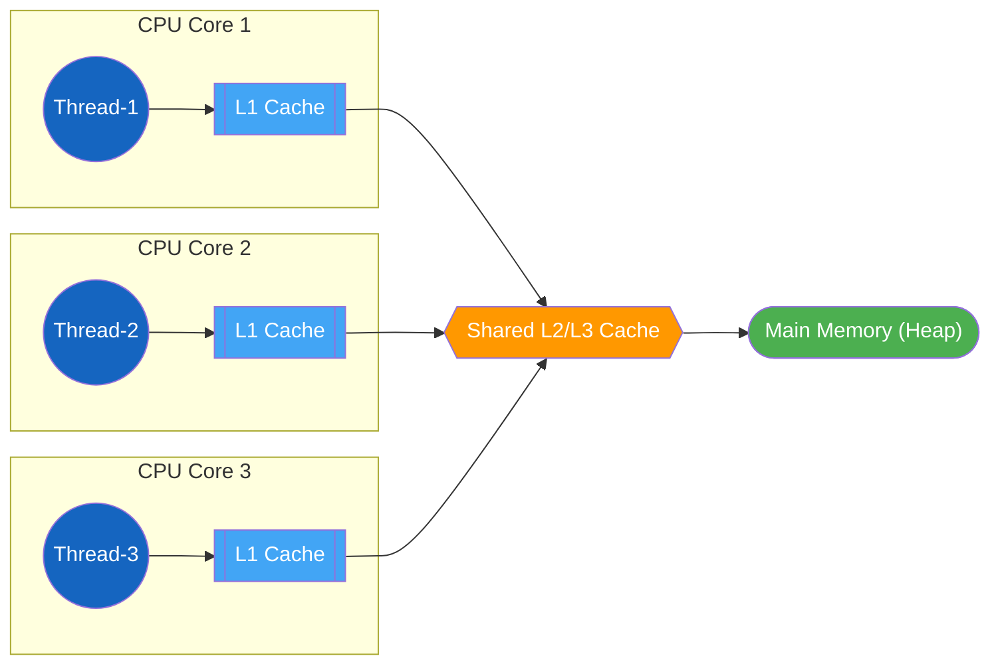
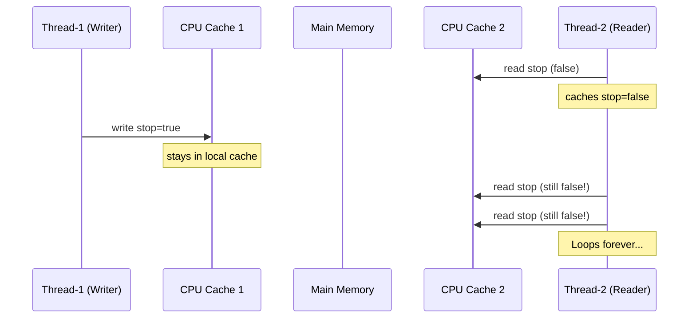
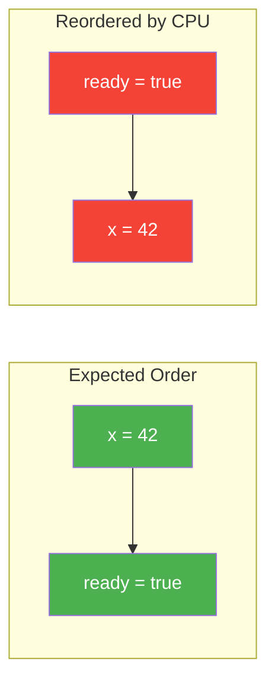
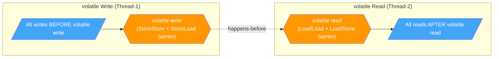
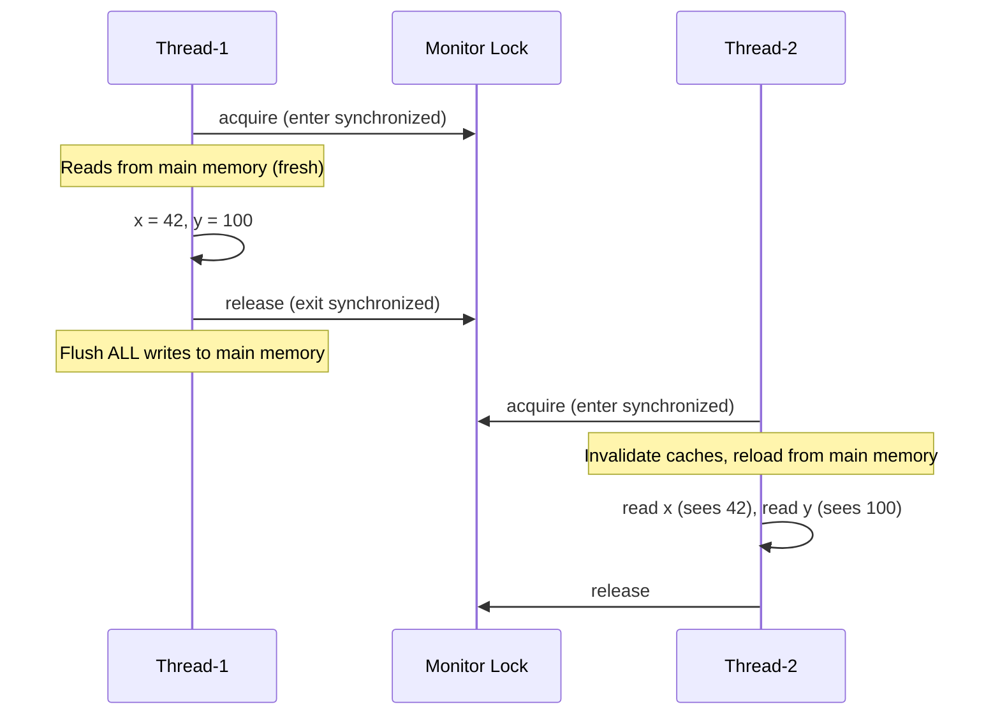
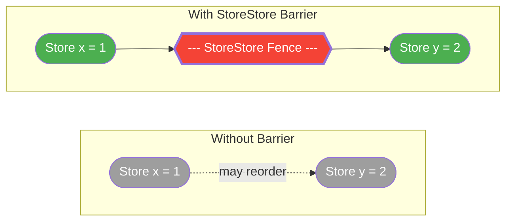
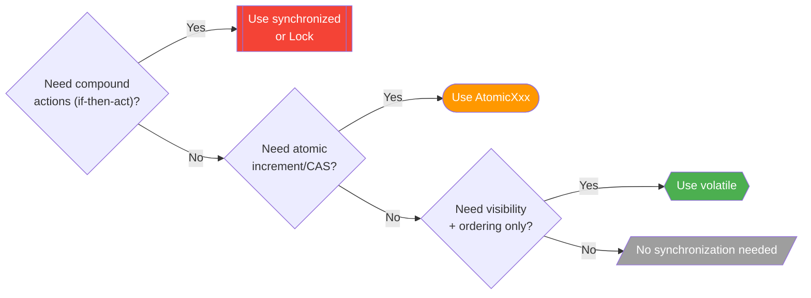

# Java Memory Model (JMM)

!!! tip "Why JMM is a FAANG Interview Favorite"
    The Java Memory Model defines **how threads interact through memory** and what behaviors are allowed in concurrent programs. Interviewers use JMM questions to test whether you truly understand concurrency or just memorize `synchronized`. If you cannot explain happens-before, visibility, and reordering — you will struggle with any senior-level concurrency question.

---

## What is the Java Memory Model?

The JMM (defined in JSR-133, Java 5+) is a **contract** between the programmer, the JVM, and the hardware. It specifies:

- When a write by one thread is **guaranteed to be visible** to a read by another thread
- What **reorderings** are legal by the compiler, JIT, and CPU
- What constitutes a **data race** and when code is correctly synchronized



Each thread may hold **local copies** of variables in CPU caches or registers. Without explicit synchronization, there is **no guarantee** that changes made by one thread will ever become visible to another.

---

## Happens-Before Relationships

The **happens-before** (HB) relation is the core of the JMM. If action A happens-before action B, then A's effects are **guaranteed visible** to B.

### All 8 Happens-Before Rules

| # | Rule | Meaning |
|---|------|---------|
| 1 | **Program Order** | Within a single thread, each statement happens-before the next (in program order) |
| 2 | **Monitor Lock** | An `unlock` on a monitor happens-before every subsequent `lock` on that same monitor |
| 3 | **Volatile Variable** | A write to a `volatile` field happens-before every subsequent read of that field |
| 4 | **Thread Start** | A call to `thread.start()` happens-before any action in the started thread |
| 5 | **Thread Join** | All actions in a thread happen-before another thread returns from `join()` on that thread |
| 6 | **Thread Interruption** | A call to `thread.interrupt()` happens-before the interrupted thread detects the interruption |
| 7 | **Finalizer** | The end of a constructor happens-before the start of `finalize()` for that object |
| 8 | **Transitivity** | If A happens-before B, and B happens-before C, then A happens-before C |

### Examples

```java
// Rule 2: Monitor Lock
synchronized (lock) {
    x = 42;              // Write inside critical section
}                        // unlock happens-before...
// ...another thread:
synchronized (lock) {    // ...this lock
    System.out.println(x); // Guaranteed to see 42
}

// Rule 4 & 5: Thread Start and Join
thread.start();          // Everything before start() is visible to the new thread
thread.join();           // Everything the thread did is now visible to the joining thread
```

---

## Visibility Problems Without Synchronization

Without a happens-before relationship, one thread's writes **may never** be observed by another thread.

```java
// BROKEN CODE -- Thread may loop forever!
public class VisibilityBug {
    private boolean stop = false;  // not volatile

    public void writerThread() {
        stop = true;  // Written to CPU cache -- may never reach main memory
    }

    public void readerThread() {
        while (!stop) {
            // May NEVER terminate -- JIT can hoist the read out of the loop
            // Equivalent to: if (!stop) while(true) {}
        }
    }
}
```



---

## Reordering

Compilers, JIT, and CPUs **reorder** instructions for performance. This is safe in single-threaded code but **deadly** in multithreaded code.

### Types of Reordering

| Level | Who Does It | Example |
|-------|-------------|---------|
| Compiler | javac / JIT | Reorder independent statements |
| Processor | CPU out-of-order execution | Execute loads before prior stores |
| Memory System | Store buffers & cache coherence | Writes become visible in different order |

### How Reordering Breaks Code

```java
// Thread-1
x = 42;        // (1)
ready = true;  // (2)

// Thread-2
if (ready) {           // (3)
    assert x == 42;    // (4) -- CAN FAIL!
}
```

Without synchronization, the CPU/compiler may reorder (1) and (2). Thread-2 could see `ready == true` but `x == 0`.



---

## volatile Keyword Deep Dive

### What volatile Guarantees

| Guarantee | Description |
|-----------|-------------|
| **Visibility** | A write to a volatile variable is immediately flushed to main memory; a read always fetches from main memory |
| **Ordering** | No reordering of volatile reads/writes with respect to surrounding code (acts as a memory fence) |
| **NOT Atomicity** | `volatile long count; count++` is NOT atomic (read-modify-write is 3 operations) |

### volatile Memory Semantics



### When volatile is Enough

```java
// CORRECT: single writer, multiple readers, simple flag
private volatile boolean shutdown = false;

// CORRECT: publishing an immutable object
private volatile Config config;

// BROKEN: volatile does NOT make this atomic
private volatile int counter = 0;
counter++;  // read → increment → write (3 steps, race condition!)
```

---

## synchronized — Memory Semantics

`synchronized` provides **mutual exclusion** + **memory visibility**. Its memory semantics go beyond just locking.

### Acquire and Release Semantics

| Operation | Memory Effect |
|-----------|--------------|
| **Lock acquire** (entering `synchronized`) | Invalidate local cache — force reload from main memory |
| **Lock release** (exiting `synchronized`) | Flush all writes to main memory before releasing |



**Key insight:** Synchronized flushes **all** writes, not just the variable being locked on. This is why locking on one monitor can make unrelated variables visible.

---

## final Fields — Safe Publication Guarantee

The JMM guarantees that if an object is **properly constructed** (no `this` escaping the constructor), then all `final` fields are visible to any thread that obtains a reference to the object — **without additional synchronization**.

```java
public class ImmutableConfig {
    private final Map<String, String> settings;

    public ImmutableConfig(Map<String, String> input) {
        this.settings = Collections.unmodifiableMap(new HashMap<>(input));
        // After constructor completes, any thread seeing a reference to this object
        // is GUARANTEED to see the fully initialized 'settings' map
    }

    public String get(String key) {
        return settings.get(key);  // Safe without synchronization
    }
}
```

!!! warning "The `this` Escape Problem"
    If you leak `this` during construction (e.g., registering a listener), another thread may see partially constructed final fields.

---

## Double-Checked Locking

### The Broken Pattern (Pre-Java 5)

```java
// BROKEN -- DO NOT USE
public class BrokenSingleton {
    private static BrokenSingleton instance;

    public static BrokenSingleton getInstance() {
        if (instance == null) {           // (1) First check (no lock)
            synchronized (BrokenSingleton.class) {
                if (instance == null) {   // (2) Second check (with lock)
                    instance = new BrokenSingleton(); // (3) PROBLEM!
                }
            }
        }
        return instance;
    }
}
```

**Why it breaks:** Step (3) involves: allocate memory, invoke constructor, assign reference. The JVM can reorder so the reference is assigned **before** the constructor completes. Another thread at (1) sees a non-null but **partially constructed** object.

### The Fix: volatile

```java
// CORRECT -- with volatile
public class Singleton {
    private static volatile Singleton instance;  // volatile prevents reordering

    public static Singleton getInstance() {
        if (instance == null) {
            synchronized (Singleton.class) {
                if (instance == null) {
                    instance = new Singleton();
                    // volatile write ensures the object is fully constructed
                    // before the reference becomes visible to other threads
                }
            }
        }
        return instance;
    }
}
```

---

## Memory Barriers / Fences

A **memory barrier** (or fence) is a CPU instruction that enforces ordering constraints on memory operations.

| Barrier Type | Effect |
|--------------|--------|
| **LoadLoad** | All loads before the barrier complete before loads after it |
| **StoreStore** | All stores before the barrier are flushed before stores after it |
| **LoadStore** | All loads before the barrier complete before stores after it |
| **StoreLoad** | All stores before the barrier are flushed before loads after it (most expensive) |



**In Java, you never insert barriers directly.** They are emitted by the JVM when you use:

- `volatile` reads/writes
- `synchronized` enter/exit
- `java.util.concurrent.locks`
- `VarHandle` acquire/release fences (Java 9+)

---

## Comparison: volatile vs synchronized vs Atomic

| Feature | `volatile` | `synchronized` | `AtomicInteger` / Atomics |
|---------|-----------|----------------|---------------------------|
| **Visibility** | Yes | Yes | Yes |
| **Ordering (prevents reorder)** | Yes | Yes | Yes |
| **Atomicity** | No (only single read/write) | Yes (entire block) | Yes (single operation: CAS) |
| **Mutual exclusion** | No | Yes | No |
| **Blocking** | No | Yes (threads wait) | No (lock-free, spins) |
| **Performance** | Fastest | Slowest (context switches) | Middle (CAS loop) |
| **Use case** | Flags, safe publication | Critical sections, compound actions | Counters, accumulators |

### Decision Flowchart



---

## Interview Questions

??? question "What is the happens-before relationship? Why does it matter?"
    The happens-before relationship is the JMM's guarantee that if action A happens-before action B, all memory effects of A are visible to B. Without it, threads have no guarantees about seeing each other's writes. It matters because it is the **only** way to reason about visibility in Java — if there is no happens-before between a write and a read, the read can return any value (stale, default, or current).

??? question "Can volatile replace synchronized? When is volatile insufficient?"
    No. `volatile` guarantees **visibility** and **ordering** but NOT **atomicity**. If you need compound actions (check-then-act, read-modify-write like `count++`), volatile is insufficient — you need `synchronized`, `Lock`, or `AtomicXxx`. Volatile is enough only when: (1) writes do not depend on the current value, or (2) only one thread ever writes.

??? question "Explain why double-checked locking is broken without volatile."
    Object creation involves 3 steps: allocate memory, run constructor, assign reference. Without volatile, the JVM may reorder so the reference is assigned before the constructor finishes. Another thread sees a non-null reference and uses a **partially constructed** object. The volatile keyword prevents this reordering by inserting a StoreStore barrier before the reference assignment becomes visible.

??? question "What is the difference between visibility and atomicity?"
    **Visibility** means one thread's write is seen by another thread. **Atomicity** means an operation completes in one indivisible step. `volatile` gives visibility but not atomicity — `volatile int x; x++` is still a race (read, increment, write are 3 separate steps). `synchronized` gives both. `AtomicInteger.incrementAndGet()` gives both through CAS.

??? question "If I write to a non-volatile variable inside a synchronized block, is it visible to other threads?"
    Yes — **if and only if** the reading thread also synchronizes on the **same** monitor. The lock release flushes all writes (not just the lock variable) to main memory, and the lock acquire invalidates the reader's cache. If the reader does not synchronize, there is no happens-before edge, and visibility is not guaranteed.

??? question "What are memory barriers and how does Java use them?"
    Memory barriers (fences) are CPU instructions that prevent reordering of loads and stores across the barrier. Java does not expose barriers directly to programmers. Instead, the JVM inserts them automatically when you use `volatile`, `synchronized`, or `j.u.c` constructs. For example, a volatile write inserts StoreStore + StoreLoad barriers, ensuring all prior writes are visible before the volatile write and that the volatile write is visible before any subsequent read.

??? question "Explain the publication problem with final fields and how the JMM solves it."
    Without the final field guarantee, a thread could see a reference to a newly created object but see default values (0, null) in its fields — because the constructor writes might not yet be visible. The JMM solves this: for `final` fields, the end of the constructor happens-before any read of the final field via the object reference. This means if you get a reference to a properly constructed object, you are guaranteed to see the correct final field values — no synchronization needed.

??? question "Thread A writes x=1 then y=2. Thread B reads y==2 then reads x. Can Thread B see x==0?"
    **Yes.** Without synchronization, there is no happens-before relationship between Thread A's writes and Thread B's reads. The CPU/compiler may reorder A's writes (y=2 before x=1), or B's reads may see stale cached values. To guarantee B sees x==1 when it observes y==2, you must establish a happens-before edge — make `y` volatile, or protect both with the same lock.
