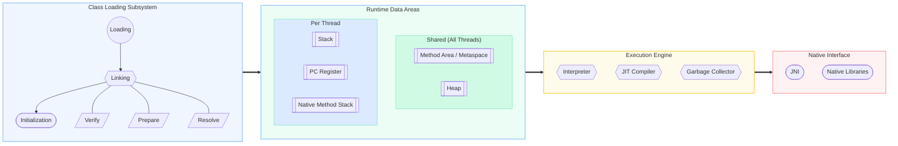
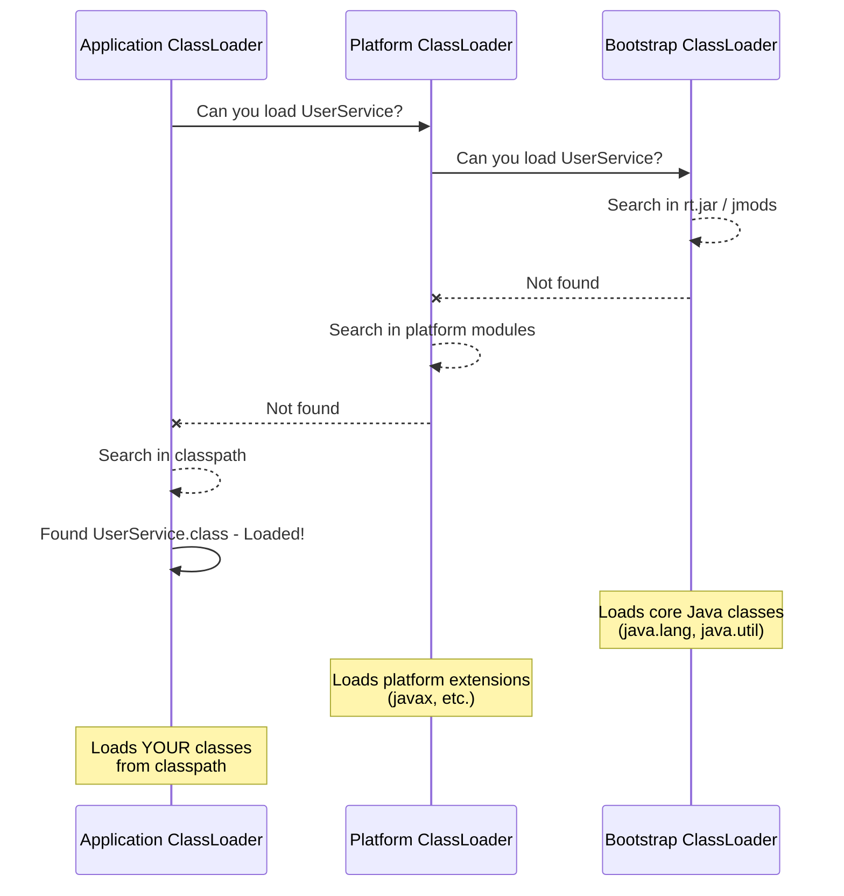

# JVM Internals — How Java Really Works

The Java Virtual Machine (JVM) is what makes Java **platform-independent**. Your `.java` file compiles to `.class` bytecode, and the JVM executes it on any OS. Understanding JVM internals is essential for debugging performance issues, memory leaks, and class loading problems.

---

## JVM Architecture Diagram



## Class Loading Delegation Model



---

## The Big Picture

```
    Source Code          Compile           Execute
    ───────────          ───────           ───────
    Hello.java  ──javac──►  Hello.class  ──JVM──►  Output
                            (bytecode)
```

```
    ┌─────────────────────────────────────────────────────────┐
    │                        JVM                               │
    │                                                          │
    │  ┌──────────────┐  ┌──────────────┐  ┌───────────────┐ │
    │  │  ClassLoader  │  │ Runtime Data │  │  Execution    │ │
    │  │  Subsystem    │──►│   Areas      │──►│  Engine       │ │
    │  └──────────────┘  └──────────────┘  └───────────────┘ │
    │                                              │           │
    │                                       ┌──────▼────────┐ │
    │                                       │  JNI + Native │ │
    │                                       │  Libraries    │ │
    │                                       └───────────────┘ │
    └─────────────────────────────────────────────────────────┘
```

---

## 1. ClassLoader Subsystem

ClassLoaders load `.class` files into memory. Java uses **lazy loading** — classes are loaded only when first referenced at runtime, not at startup.

### Three Built-in ClassLoaders

```
    ┌─────────────────────────┐
    │   Bootstrap ClassLoader  │  ◄── Loads core Java (java.lang, java.util)
    │   (rt.jar, jmods)       │      Written in C/C++, not a Java class
    └────────────┬────────────┘
                 │ delegates to
    ┌────────────▼────────────┐
    │  Platform ClassLoader    │  ◄── Loads platform extensions (javax, etc.)
    │  (formerly Extension)    │      Previously loaded from jre/lib/ext
    └────────────┬────────────┘
                 │ delegates to
    ┌────────────▼────────────┐
    │  Application ClassLoader │  ◄── Loads YOUR classes from classpath
    │  (System ClassLoader)    │      -cp / -classpath / CLASSPATH
    └──────────────────────────┘
```

### Delegation Model

When a class needs to be loaded, the classloader **asks its parent first** before trying itself:

```
    App ClassLoader ──► "Can you load UserService?"
         │
         ▼
    Platform ClassLoader ──► "Can you load UserService?"
         │
         ▼
    Bootstrap ClassLoader ──► "Can you load UserService?" ──► No
         │
         ▼ (back to Platform)
    Platform ClassLoader ──► No
         │
         ▼ (back to App)
    App ClassLoader ──► Finds UserService.class on classpath ──► Loaded!
```

This prevents you from accidentally overriding core classes like `java.lang.String`.

### Loading → Linking → Initialization

| Phase | What happens |
|---|---|
| **Loading** | Reads `.class` file, creates `Class` object in memory |
| **Linking: Verify** | Bytecode verifier checks if `.class` file is valid |
| **Linking: Prepare** | Allocates memory for `static` variables, assigns default values |
| **Linking: Resolve** | Symbolic references replaced with actual memory addresses |
| **Initialization** | `static` variables get their assigned values, `static {}` blocks execute |

---

## 2. Runtime Data Areas

These are the memory regions the JVM uses during execution.

```
    ┌─────────────────────────────────────────────────┐
    │            SHARED (all threads)                   │
    │                                                   │
    │  ┌─────────────┐    ┌──────────────────────────┐ │
    │  │ Method Area  │    │          Heap             │ │
    │  │ (Metaspace)  │    │  (Objects, arrays, etc.) │ │
    │  └─────────────┘    └──────────────────────────┘ │
    │                                                   │
    ├───────────────────────────────────────────────────┤
    │            PER THREAD                             │
    │                                                   │
    │  ┌──────────┐  ┌────────────┐  ┌──────────────┐ │
    │  │  Stack    │  │ PC Register│  │Native Method │ │
    │  │          │  │            │  │   Stack      │ │
    │  └──────────┘  └────────────┘  └──────────────┘ │
    └─────────────────────────────────────────────────┘
```

### Method Area (Metaspace since Java 8)

- Stores **class metadata**: class name, superclass, methods, fields, annotations
- Stores **static variables** and **constant pool**
- **Shared** across all threads
- Uses **native memory** (not heap) since Java 8

### Heap

- Stores all **objects** and **arrays**
- **Shared** across all threads (hence needs synchronization)
- Divided into Young Generation and Old Generation for GC
- Configured with `-Xms` (initial) and `-Xmx` (max)

### Stack (per thread)

- Each thread gets its own stack
- Each method call creates a **Stack Frame** containing:
    - **Local Variable Array** — method parameters and local variables
    - **Operand Stack** — temporary workspace for operations
    - **Frame Data** — references to constant pool, exception handlers
- **Thread-safe** by nature (not shared)
- `StackOverflowError` when stack is full (usually deep recursion)

### PC Register (per thread)

- Holds the address of the **currently executing instruction**
- Updated after each instruction executes

### Native Method Stack (per thread)

- For methods written in C/C++ (called via JNI)

---

## 3. Execution Engine

The execution engine runs the bytecode loaded into memory.

### Interpreter

Reads and executes bytecode **one instruction at a time**. Fast to start, but slow for repeated code.

### JIT Compiler (Just-In-Time)

When the JVM detects **hot code** (methods called frequently), the JIT compiler compiles that bytecode to **native machine code** for direct CPU execution.

```
    First call:   Bytecode ──Interpreter──► Slow execution
    After N calls: Bytecode ──JIT──► Native Code ──CPU──► Fast execution
```

### JIT Optimizations

| Optimization | What it does |
|---|---|
| **Method inlining** | Replaces method call with the method body (avoids call overhead) |
| **Loop unrolling** | Expands short loops to reduce branch overhead |
| **Dead code elimination** | Removes code that never executes |
| **Escape analysis** | If an object doesn't escape a method, allocates it on the stack instead of heap |

### Garbage Collector

Part of the execution engine. See the dedicated [Garbage Collection](GarbageCollection.md) page.

---

## JVM vs JRE vs JDK

```
    ┌────────────────────────────────────────────┐
    │                    JDK                      │
    │  (Java Development Kit)                     │
    │  javac, jdb, javadoc, jlink, etc.          │
    │                                             │
    │  ┌────────────────────────────────────────┐ │
    │  │                JRE                      │ │
    │  │  (Java Runtime Environment)             │ │
    │  │  Core libraries (java.lang, java.util)  │ │
    │  │                                         │ │
    │  │  ┌──────────────────────────────────┐  │ │
    │  │  │              JVM                  │  │ │
    │  │  │  ClassLoader + Memory + Engine    │  │ │
    │  │  └──────────────────────────────────┘  │ │
    │  └────────────────────────────────────────┘ │
    └────────────────────────────────────────────┘
```

| Component | Contains | Used by |
|---|---|---|
| **JVM** | ClassLoader, memory management, execution engine | Runs bytecode |
| **JRE** | JVM + core libraries | End users running Java apps |
| **JDK** | JRE + dev tools (javac, jdb, javadoc) | Developers building Java apps |

---

## Interview Questions

??? question "1. What is the difference between Stack and Heap memory?"
    **Stack**: per-thread, stores method frames (local variables, method calls), LIFO, thread-safe, fast, fixed size (`-Xss`). **Heap**: shared across threads, stores objects and arrays, managed by GC, slower, dynamic size (`-Xmx`). Primitive local variables live on the stack; objects always live on the heap (the reference lives on the stack).

??? question "2. What is the parent delegation model? Why does it matter?"
    When a classloader needs to load a class, it asks its parent first. The parent asks its parent, up to Bootstrap. Only if no parent can load it does the original classloader try. This prevents user code from replacing core Java classes (e.g., you can't create a malicious `java.lang.String`).

??? question "3. What causes StackOverflowError?"
    Infinite or excessively deep recursion. Each method call adds a stack frame. When the stack is full, JVM throws `StackOverflowError`. Fix: convert recursion to iteration, or increase stack size with `-Xss` (e.g., `-Xss2m`). Default is usually 512KB–1MB.

??? question "4. What is the JIT compiler and why is it important?"
    The JIT compiler converts frequently executed ("hot") bytecode into native machine code at runtime. This gives Java near-C performance for hot paths while keeping the flexibility of bytecode for cold paths. Without JIT, Java would be purely interpreted and 10-50x slower.

??? question "5. Where are static variables stored in the JVM?"
    In the **Method Area** (Metaspace since Java 8). Static variables belong to the class, not to any instance, so they're stored in the shared class metadata area. They're initialized during the classloading **initialization** phase.

---

## See Also

- [Garbage Collection](GarbageCollection.md) — GC algorithms and tuning strategies
- [JVM Tuning](JVMTuning.md) — Flags, heap sizing, and performance optimization
- [Memory Leaks](MemoryLeaks.md) — Detection, causes, and prevention
- [Class Loaders](ClassLoaders.md) — Parent delegation and custom loading
- [Java Memory Model](JavaMemoryModel.md) — Visibility, ordering, and happens-before
- [Profiling Tools](ProfilingTools.md) — JFR, JMC, async-profiler, and VisualVM
