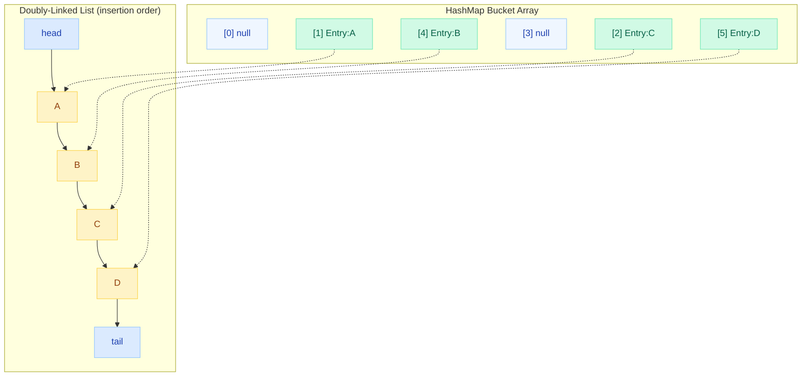
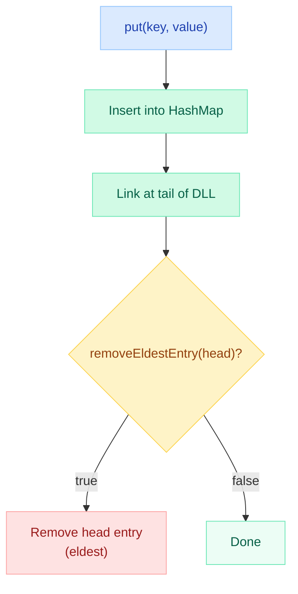
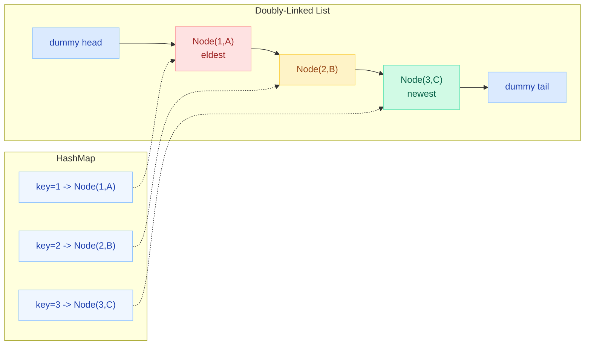

# LinkedHashMap Internals & LRU Cache

> **LeetCode #146 — LRU Cache is the single most asked LinkedList/HashMap question at FAANG companies.** Google, Meta, Amazon, and Microsoft have all asked it in phone screens and on-sites. Mastering this one problem demonstrates HashMap internals, doubly-linked list manipulation, and O(1) design thinking.

---

!!! tip "Why This Matters"
    LinkedHashMap is Java's built-in answer to ordered maps. Understanding its internals gives you:
    
    - A ready-made LRU Cache in production code (no libraries needed)
    - The exact data structure asked in LeetCode #146
    - Deep insight into HashMap extension points
    - Knowledge of how frameworks like Spring and Hibernate maintain insertion-order caches

---

## LinkedHashMap Internals

### What Is LinkedHashMap?

`LinkedHashMap<K,V>` **extends HashMap** and adds a **doubly-linked list** that threads through all entries. This overlay preserves either **insertion order** (default) or **access order** (LRU mode).

```java
public class LinkedHashMap<K,V> extends HashMap<K,V> implements Map<K,V> {
    
    // Each entry extends HashMap.Node and adds before/after pointers
    static class Entry<K,V> extends HashMap.Node<K,V> {
        Entry<K,V> before, after;  // doubly-linked list pointers
    }
    
    transient LinkedHashMap.Entry<K,V> head; // eldest (first inserted)
    transient LinkedHashMap.Entry<K,V> tail; // newest (last inserted/accessed)
    
    final boolean accessOrder; // false = insertion order, true = access order
}
```

### HashMap Buckets + Linked List Threading

The key insight: entries live in **two structures simultaneously** — the HashMap bucket array for O(1) lookup, and a doubly-linked list for ordering.



**Each Entry object has:**

- `hash`, `key`, `value`, `next` — from HashMap.Node (bucket chain)
- `before`, `after` — doubly-linked list pointers (ordering chain)

---

## Insertion-Order vs Access-Order

### Insertion Order (Default)

```java
Map<String, Integer> map = new LinkedHashMap<>();
map.put("C", 3);
map.put("A", 1);
map.put("B", 2);

map.keySet(); // [C, A, B] — preserves insertion order

map.get("C"); // does NOT change order
map.keySet(); // [C, A, B] — still the same
```

### Access Order (LRU Mode)

```java
// Third constructor parameter: accessOrder = true
Map<String, Integer> map = new LinkedHashMap<>(16, 0.75f, true);
map.put("C", 3);
map.put("A", 1);
map.put("B", 2);

map.keySet(); // [C, A, B]

map.get("C"); // moves C to tail (most recently used)
map.keySet(); // [A, B, C] — C moved to end!

map.get("A"); // moves A to tail
map.keySet(); // [B, C, A]
```

!!! warning "ConcurrentModificationException"
    Iterating over an access-order LinkedHashMap while calling `get()` throws `ConcurrentModificationException` because `get()` is a **structural modification** in access-order mode. This surprises many developers.

---

## Access-Order Behavior Diagram

When `get("B")` is called in access-order mode, entry B is unlinked from its current position and moved to the tail:

```mermaid
flowchart LR
    subgraph BEFORE["Before get(B)"]
        direction LR
        H1["head"] --> A1["A"]
        A1 --> B1["B"]
        B1 --> C1["C"]
        C1 --> D1["D"]
        D1 --> T1["tail"]
    end

    subgraph AFTER["After get(B)"]
        direction LR
        H2["head"] --> A2["A"]
        A2 --> C2["C"]
        C2 --> D2["D"]
        D2 --> B2["B"]
        B2 --> T2["tail"]
    end

    BEFORE --> AFTER

    style H1 fill:#DBEAFE,stroke:#93C5FD,color:#1E40AF
    style T1 fill:#DBEAFE,stroke:#93C5FD,color:#1E40AF
    style A1 fill:#D1FAE5,stroke:#6EE7B7,color:#065F46
    style B1 fill:#FEE2E2,stroke:#FCA5A5,color:#991B1B
    style C1 fill:#D1FAE5,stroke:#6EE7B7,color:#065F46
    style D1 fill:#D1FAE5,stroke:#6EE7B7,color:#065F46
    style H2 fill:#DBEAFE,stroke:#93C5FD,color:#1E40AF
    style T2 fill:#DBEAFE,stroke:#93C5FD,color:#1E40AF
    style A2 fill:#D1FAE5,stroke:#6EE7B7,color:#065F46
    style C2 fill:#D1FAE5,stroke:#6EE7B7,color:#065F46
    style D2 fill:#D1FAE5,stroke:#6EE7B7,color:#065F46
    style B2 fill:#FEF3C7,stroke:#FCD34D,color:#92400E
```



**Internal method `afterNodeAccess(Node e)`:**

1. Unlink `e` from its current position (`e.before.after = e.after`)
2. Link `e` after current tail
3. Set `tail = e`

---

## removeEldestEntry() — The LRU Hook

`LinkedHashMap` calls `removeEldestEntry()` after every `put()`/`putAll()`. By default it returns `false`. Override it to auto-evict:

```java
@Override
protected boolean removeEldestEntry(Map.Entry<K, V> eldest) {
    return size() > maxCapacity;  // evict when over capacity
}
```

**How it works internally:**



---

## LRU Cache with LinkedHashMap (Production Approach)

### Basic LRU Cache

```java
import java.util.LinkedHashMap;
import java.util.Map;

public class LRUCache<K, V> extends LinkedHashMap<K, V> {
    private final int capacity;

    public LRUCache(int capacity) {
        // initialCapacity, loadFactor, accessOrder=true
        super(capacity, 0.75f, true);
        this.capacity = capacity;
    }

    @Override
    protected boolean removeEldestEntry(Map.Entry<K, V> eldest) {
        return size() > capacity;
    }
}
```

**Usage:**

```java
LRUCache<Integer, String> cache = new LRUCache<>(3);
cache.put(1, "A");
cache.put(2, "B");
cache.put(3, "C");
// Cache: {1=A, 2=B, 3=C}

cache.get(1);       // Access "A" — moves to tail
// Cache: {2=B, 3=C, 1=A}

cache.put(4, "D");  // Evicts eldest (key=2)
// Cache: {3=C, 1=A, 4=D}
```

### Thread-Safe LRU Cache

```java
import java.util.Collections;
import java.util.LinkedHashMap;
import java.util.Map;

public class ConcurrentLRUCache<K, V> {
    private final Map<K, V> cache;

    public ConcurrentLRUCache(int capacity) {
        this.cache = Collections.synchronizedMap(
            new LinkedHashMap<K, V>(capacity, 0.75f, true) {
                @Override
                protected boolean removeEldestEntry(Map.Entry<K, V> eldest) {
                    return size() > capacity;
                }
            }
        );
    }

    public V get(K key) {
        return cache.get(key);
    }

    public void put(K key, V value) {
        cache.put(key, value);
    }

    public void remove(K key) {
        cache.remove(key);
    }

    public int size() {
        return cache.size();
    }
}
```

!!! note "Synchronized vs Concurrent"
    `Collections.synchronizedMap` wraps every method in a `synchronized` block — safe but coarse-grained. For high-concurrency production systems, prefer **Caffeine** or a segmented approach. The synchronized wrapper is fine for moderate contention (Spring session caches, connection pools).

---

## LRU Cache from Scratch (Interview Approach)

This is what interviewers expect you to code in 20-25 minutes for LeetCode #146:

```java
import java.util.HashMap;
import java.util.Map;

class LRUCache {
    
    // Doubly-linked list node
    private static class Node {
        int key, value;
        Node prev, next;
        
        Node(int key, int value) {
            this.key = key;
            this.value = value;
        }
    }

    private final int capacity;
    private final Map<Integer, Node> map;
    private final Node head; // dummy head — eldest side
    private final Node tail; // dummy tail — newest side

    public LRUCache(int capacity) {
        this.capacity = capacity;
        this.map = new HashMap<>();
        
        // Sentinel nodes to avoid null checks
        head = new Node(0, 0);
        tail = new Node(0, 0);
        head.next = tail;
        tail.prev = head;
    }

    public int get(int key) {
        Node node = map.get(key);
        if (node == null) return -1;
        
        // Move to most-recently-used position (before tail)
        moveToTail(node);
        return node.value;
    }

    public void put(int key, int value) {
        Node node = map.get(key);
        
        if (node != null) {
            // Update existing
            node.value = value;
            moveToTail(node);
        } else {
            // Insert new
            Node newNode = new Node(key, value);
            map.put(key, newNode);
            addBeforeTail(newNode);
            
            // Evict if over capacity
            if (map.size() > capacity) {
                Node eldest = head.next;
                removeNode(eldest);
                map.remove(eldest.key);
            }
        }
    }

    private void moveToTail(Node node) {
        removeNode(node);
        addBeforeTail(node);
    }

    private void removeNode(Node node) {
        node.prev.next = node.next;
        node.next.prev = node.prev;
    }

    private void addBeforeTail(Node node) {
        node.prev = tail.prev;
        node.next = tail;
        tail.prev.next = node;
        tail.prev = node;
    }
}
```

**Why sentinel (dummy) nodes?**

Without them, you need null-checks everywhere when removing the first or last real node. Sentinels eliminate edge cases — `head.next` is always the eldest real entry, `tail.prev` is always the newest.

---

## Data Structure Diagram (Interview Version)



**Eviction:** Remove `head.next` (eldest) from both the linked list and the HashMap.  
**Access:** Unlink node, re-link before `tail` (most recently used).

---

## Comparison: LinkedHashMap vs Guava Cache vs Caffeine

| Feature | LinkedHashMap LRU | Guava Cache | Caffeine |
|---------|:-:|:-:|:-:|
| **Built-in JDK** | Yes | No (Guava dep) | No (caffeine dep) |
| **Thread-safe** | No (wrap with sync) | Yes | Yes |
| **Eviction policy** | LRU only | LRU, size, time | LRU, LFU (TinyLFU), size, time |
| **TTL / expiry** | Manual | Yes (expireAfterWrite/Access) | Yes (expireAfterWrite/Access) |
| **Async refresh** | No | Yes (refreshAfterWrite) | Yes |
| **Statistics** | No | Yes (hitRate, etc.) | Yes |
| **Performance** | Good (single-thread) | Good | Best (near-optimal hit rate) |
| **Max size enforcement** | Exact | Approximate | Approximate |
| **Use case** | Simple caches, interviews | Production (legacy) | Production (modern) |

!!! info "When to Use What"
    - **Interview / coding challenge**: Always use the from-scratch approach (HashMap + DLL)
    - **Simple app / small cache**: `LinkedHashMap` with `removeEldestEntry`
    - **Production microservice**: **Caffeine** (Spring Boot's default cache provider since Boot 2.x)
    - **Legacy codebase already on Guava**: Guava Cache (but consider migrating to Caffeine)

---

## Time & Space Complexity

| Operation | LinkedHashMap LRU | From-Scratch LRU | Notes |
|-----------|:-:|:-:|-------|
| `get(key)` | O(1) | O(1) | HashMap lookup + DLL move |
| `put(key, value)` | O(1) amortized | O(1) | HashMap insert + DLL append |
| `remove(key)` | O(1) | O(1) | HashMap remove + DLL unlink |
| Eviction | O(1) | O(1) | Remove head of DLL |
| Iteration | O(n) | O(n) | Follows DLL order |
| **Space** | O(n) | O(n) | n entries, each with 2 extra pointers |

!!! note "Why O(1) for Everything?"
    The HashMap gives O(1) lookup by key. The doubly-linked list gives O(1) removal (since we have a direct pointer to the node) and O(1) insertion at head/tail. This is why the combination of these two data structures is so elegant.

---

## Common Pitfalls

| Pitfall | Description | Fix |
|---------|-------------|-----|
| Forgetting `accessOrder=true` | Without it, `get()` does not reorder — you get insertion-order, not LRU | Always pass `true` as third constructor arg |
| Not overriding `removeEldestEntry` | LinkedHashMap never evicts by default | Override to return `size() > capacity` |
| `ConcurrentModificationException` | Calling `get()` during iteration in access-order mode | Use `Collections.synchronizedMap` or avoid `get()` during iteration |
| Thread-safety assumptions | `LinkedHashMap` is NOT thread-safe | Wrap or use Caffeine for concurrent access |
| Capacity vs initial capacity confusion | `new LinkedHashMap<>(capacity)` sets **initial bucket count**, not max entries | `removeEldestEntry` controls max entries |
| Interview: forgetting to remove from HashMap | Evicting from DLL without removing the HashMap entry leaks memory | Always `map.remove(eldest.key)` after unlinking |
| Interview: not storing key in Node | You need the key to remove from HashMap during eviction | Node must hold both key and value |

---

## Quick Recall

!!! success "5-Second Summary"
    **LinkedHashMap** = HashMap + Doubly-Linked List overlay.  
    **Access-order mode** (`accessOrder=true`) + **`removeEldestEntry()`** = instant LRU Cache.  
    **Interview version** = HashMap<Key, Node> + Doubly-Linked List with dummy head/tail.  
    **All operations O(1)** — that's the entire point.

---

## Interview Answer Template

!!! example "When asked: 'Design an LRU Cache'"

    **1. Clarify:**
    
    - Fixed capacity? Yes.
    - `get(key)` and `put(key, value)` both in O(1)? Yes.
    - What happens on capacity overflow? Evict least recently used.
    
    **2. High-level approach:**
    
    "I'll use a HashMap for O(1) key lookup combined with a doubly-linked list to track recency order. The most recently used item goes to the tail, the least recently used stays at the head. On eviction, I remove the head."
    
    **3. Key design decisions:**
    
    - Dummy head and tail nodes eliminate edge cases
    - Node stores both key and value (need key for HashMap removal during eviction)
    - `get()` moves the accessed node to tail
    - `put()` either updates existing (move to tail) or inserts new (add at tail, evict head if full)
    
    **4. Code:** Write the from-scratch version above.
    
    **5. Follow-ups to expect:**
    
    - "Make it thread-safe" → `ReentrantReadWriteLock` or `ConcurrentHashMap` + striping
    - "What about TTL?" → Add `expiryTime` field to Node, lazy eviction on access
    - "How does Java's LinkedHashMap do it?" → Explain `accessOrder` + `removeEldestEntry()`
    - "LFU instead of LRU?" → Need frequency count + min-frequency tracking (LeetCode #460)

---

## Bonus: LRU with ReentrantReadWriteLock (High-Concurrency)

```java
import java.util.*;
import java.util.concurrent.locks.*;

public class ConcurrentLRU<K, V> {
    private final int capacity;
    private final Map<K, V> cache;
    private final ReadWriteLock lock = new ReentrantReadWriteLock();
    private final Lock readLock = lock.readLock();
    private final Lock writeLock = lock.writeLock();

    public ConcurrentLRU(int capacity) {
        this.capacity = capacity;
        this.cache = new LinkedHashMap<K, V>(capacity, 0.75f, true) {
            @Override
            protected boolean removeEldestEntry(Map.Entry<K, V> eldest) {
                return size() > capacity;
            }
        };
    }

    public V get(K key) {
        writeLock.lock();  // write lock because access-order modifies structure
        try {
            return cache.get(key);
        } finally {
            writeLock.unlock();
        }
    }

    public void put(K key, V value) {
        writeLock.lock();
        try {
            cache.put(key, value);
        } finally {
            writeLock.unlock();
        }
    }
}
```

!!! warning "Read Lock Trap"
    In access-order mode, even `get()` is a structural modification (moves node to tail). You **cannot** use a read lock for `get()` — it must be a write lock. This is a common interview follow-up trick question.
