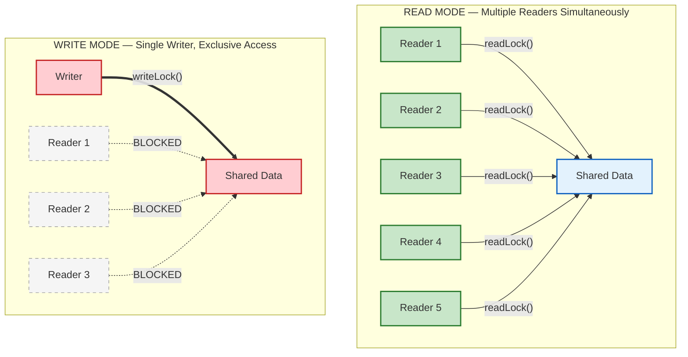
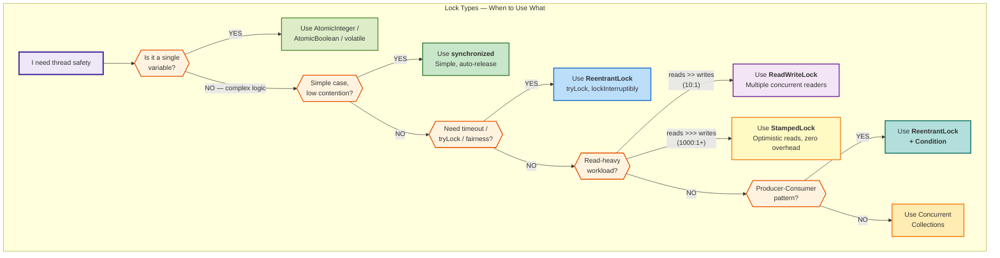

# Locks in Java — The Complete Story

*Follow Priya, a backend engineer at BookMyShow, as she discovers every locking mechanism in Java while building a ticket booking system that handles millions of concurrent users.*

---

## Chapter 1: The Day BookMyShow Sold 300 Tickets for 200 Seats

It's Friday. Thalapathy Vijay's new movie drops tomorrow. BookMyShow opens bookings at 10 AM. 50,000 users hit "Book Now" at the exact same second.

Priya wrote the booking service last week:

```java
public class BookingService {
    private int availableSeats = 200;

    public String bookTicket(String userId) {
        if (availableSeats > 0) {
            availableSeats--;
            return "Booking confirmed for " + userId;
        }
        return "Housefull! No seats available";
    }
}
```

Looks perfect. Code review passed. Unit tests passed. **Production crashed.**

By 10:02 AM, 300 tickets were sold for a 200-seat theater. 100 angry customers showed up with valid tickets and no seats. BookMyShow refunded ₹50,000 and trended on Twitter for all the wrong reasons.

**What happened?**

```
    10:00:00.000 AM — 3 threads hit bookTicket() simultaneously

    Thread-1 (Rahul)             Thread-2 (Sneha)             Thread-3 (Arjun)
    ────────────────             ────────────────             ────────────────
    reads: availableSeats = 1    reads: availableSeats = 1    reads: availableSeats = 1
    1 > 0 → true ✓              1 > 0 → true ✓              1 > 0 → true ✓
    availableSeats-- → 0         availableSeats-- → -1        availableSeats-- → -2
    "Booking confirmed" ✓        "Booking confirmed" ✗        "Booking confirmed" ✗

    ❌ Only 1 seat was left, but 3 people got bookings
    ❌ availableSeats is now -2
```

This is a **race condition**. The `if (check)` and `action` are two separate steps. Between them, another thread sneaks in and reads the same stale value.

**This isn't a made-up scenario.** Real companies have suffered from this exact bug:

| Company | Incident | Impact |
|---|---|---|
| **Flipkart** | Big Billion Days overselling | Cancelled 10,000+ orders, ₹crores in refunds |
| **British Airways** | Double-charged passengers | Duplicate seat assignments on flights |
| **Robinhood** | Stock trading race condition | Users bought stocks with $0 balance |
| **Therac-25** | Medical device race condition | 3 patients received lethal radiation doses |

Priya's manager calls: *"Fix this. Now."*

---

## Chapter 2: synchronized — Priya's First Fix

Priya learns that Java has a built-in lock on **every single object** called an *intrinsic lock* (or *monitor*). The `synchronized` keyword acquires it.

Think of it like a **single-person bathroom**:

```
    Without synchronized:             With synchronized:
    ─────────────────────             ─────────────────
    🚪 Bathroom door: OPEN            🚪 Bathroom door: LOCKED
    
    Rahul walks in                    Rahul walks in, locks door 🔒
    Sneha walks in too!               Sneha arrives → door locked → WAITS
    Arjun walks in too!               Arjun arrives → door locked → WAITS
    Chaos inside 💥                   Rahul finishes, unlocks door 🔓
                                      Sneha enters, locks door 🔒
                                      (one at a time, orderly)
```

```java
public class BookingService {
    private int availableSeats = 200;

    public synchronized String bookTicket(String userId) {
        if (availableSeats > 0) {
            availableSeats--;
            return "Booking confirmed for " + userId + " | Seats left: " + availableSeats;
        }
        return "Housefull!";
    }
}
```

Now Thread-2 **must wait** until Thread-1 completes the entire method. No more overselling.

### Three flavors of synchronized

```java
// 1. Synchronized method — the lock is 'this' object
public synchronized void bookTicket() {
    // only one thread per BookingService instance
}

// 2. Synchronized block — you pick the lock object (more precise)
public void bookTicket() {
    synchronized (this) {
        // same as above, but you can lock just the critical part
    }
}

// 3. Static synchronized — the lock is the Class object itself
public static synchronized void loadShowTimings() {
    // only one thread across ALL instances of BookingService
}
```

### The Performance Problem — Don't Lock the Entire Kitchen

Priya's colleague reviews the code and spots an issue:

```java
public class BookingService {

    // BAD — Priya's first attempt: entire method locked
    public synchronized String processBooking(BookingRequest request) {
        User user = validateUser(request.getUserId());    // 50ms — calls auth service
        Show show = fetchShowDetails(request.getShowId()); // 100ms — calls movie DB
        Seat seat = selectBestSeat(show);                  // 5ms — CPU work
        confirmBooking(user, seat);                        // 2ms — THE ONLY PART THAT NEEDS A LOCK
        sendConfirmationEmail(user);                       // 200ms — calls email service
        return "Booked!";
    }
    // Total: 357ms locked. Next user waits 357ms even though only 2ms needs protection!
}
```

50,000 users × 357ms wait = users see a spinning loader for **minutes**. The app crashes under load.

```java
public class BookingService {

    // GOOD — only lock the 2ms critical section
    public String processBooking(BookingRequest request) {
        User user = validateUser(request.getUserId());      // no lock needed
        Show show = fetchShowDetails(request.getShowId());   // no lock needed
        Seat seat;
        synchronized (this) {
            seat = selectBestSeat(show);                     // lock for 7ms total
            confirmBooking(user, seat);
        }
        sendConfirmationEmail(user);                         // no lock needed
        return "Booked!";
    }
    // 50,000 users now only wait for the 7ms critical section, not 357ms
}
```

!!! tip "Golden Rule"
    Lock scope should be as **small** as possible and as **large** as necessary. Lock only the shared mutable state, nothing else.

---

## Chapter 3: ReentrantLock — When synchronized Isn't Enough

A week later. The movie launch goes smoothly — no overselling. But the **Diwali sale** brings a new problem.

BookMyShow launches a "First 50 Bookings Get Free Popcorn" flash deal. 10,000 users click at exactly 8 PM. With `synchronized`:

```
    User hits "Book Now"
    → Thread enters synchronized block
    → Takes 200ms (payment processing)
    → Thread exits

    Meanwhile: 9,999 other threads are BLOCKED. No timeout. No way out.
    Users see infinite spinner. Many close the app. Revenue lost.
```

Priya's manager asks: *"Can we show 'Try again later' instead of making users wait forever?"*

With `synchronized`: **Impossible.** A thread either gets the lock or waits forever. No timeout, no "try and give up."

Enter `ReentrantLock`.

### The Flash Deal — tryLock with Timeout

```java
public class FlashDealService {
    private int freePopcornLeft = 50;
    private final ReentrantLock lock = new ReentrantLock();

    public String claimDeal(String userId) {
        try {
            // Try for 2 seconds. If too many people ahead, give up gracefully.
            if (lock.tryLock(2, TimeUnit.SECONDS)) {
                try {
                    if (freePopcornLeft > 0) {
                        freePopcornLeft--;
                        return "🍿 Free popcorn claimed, " + userId + "! " + freePopcornLeft + " left";
                    }
                    return "Deal over! All popcorns claimed.";
                } finally {
                    lock.unlock();
                }
            } else {
                return "Too many people! Please try again in a moment.";
            }
        } catch (InterruptedException e) {
            Thread.currentThread().interrupt();
            return "Request cancelled.";
        }
    }
}
```

Now instead of 9,999 threads frozen in limbo, users get instant feedback.

### What makes ReentrantLock different from synchronized?

| Situation | `synchronized` | `ReentrantLock` |
|---|---|---|
| User wants to cancel while waiting | Impossible — thread is stuck | `lockInterruptibly()` — thread can be interrupted |
| Server overloaded, show "try later" | Impossible — blocks forever | `tryLock()` — returns `false` immediately |
| Limit wait to 2 seconds | Impossible | `tryLock(2, TimeUnit.SECONDS)` |
| Ensure fairness (FIFO) | No guarantee — OS decides | `new ReentrantLock(true)` — longest waiter goes first |
| Wake up specific group of threads | `notify()` wakes a random thread | Multiple `Condition` objects — wake exact group |
| Release lock on exception | Auto — JVM handles it | **Manual** — must call `unlock()` in `finally` |

### The Basic Pattern — Never Forget `finally`

```java
ReentrantLock lock = new ReentrantLock();

lock.lock();
try {
    // critical section — do the important stuff
} finally {
    lock.unlock();  // if you forget this, the lock is held FOREVER
}
```

!!! danger "The #1 Production Bug with ReentrantLock"
    If you forget `unlock()` in `finally` and an exception is thrown, the lock is **never released**. Every thread in your entire application that needs this lock will freeze. Forever. Your service goes down. At 3 AM. On a Saturday.

    `synchronized` never has this problem — the JVM releases it automatically.

### Why "Reentrant"? — The Bathroom Analogy Continues

Imagine you're in the bathroom (holding the lock). You realize you need to wash your hands in the same bathroom (call another synchronized method). Should you have to step outside, re-enter the queue, and wait?

**No.** You're already inside. That's reentrancy.

```java
public class BookingService {
    private final ReentrantLock lock = new ReentrantLock();

    public void bookSeat(String userId) {
        lock.lock();  // lock count = 1
        try {
            validateAndReserve(userId);
        } finally {
            lock.unlock();  // count = 0, lock released
        }
    }

    private void validateAndReserve(String userId) {
        lock.lock();  // SAME thread — count goes to 2, NO deadlock
        try {
            // validate user, reserve seat
        } finally {
            lock.unlock();  // count back to 1
        }
    }
}
```

Without reentrancy, `bookSeat()` would call `validateAndReserve()` which tries to acquire the same lock → deadlock with itself. Both `synchronized` and `ReentrantLock` are reentrant. `StampedLock` is **not**.

### Fair Lock — The Indian Railway Ticket Counter

Ever been at a railway counter where someone keeps cutting the queue? That's an **unfair lock** — a new thread can "steal" the lock from waiting threads.

```java
// UNFAIR (default) — faster, but some threads may starve
ReentrantLock unfairLock = new ReentrantLock();

// FAIR — strictly FIFO, longest-waiting thread goes first
ReentrantLock fairLock = new ReentrantLock(true);
```

| | Unfair (default) | Fair |
|---|---|---|
| Throughput | Higher | Lower (~2x slower) |
| Starvation | Possible — a thread may wait forever | Impossible — FIFO guaranteed |
| Use when | Performance matters, starvation unlikely | Fairness critical (ticket booking, job queues) |

### Condition — The Restaurant Waiter Problem

Priya's next challenge: Build a **food order queue** for a cloud kitchen. Chefs wait when there are no orders. Customers wait when all chefs are busy.

With `synchronized` + `wait()`/`notify()`, you can only wake **one random waiting thread**. You might wake another customer when a chef should have been woken.

With `Condition` objects, you wake **exactly the right group**:

```java
public class CloudKitchenQueue {
    private final Queue<FoodOrder> orders = new LinkedList<>();
    private final int maxOrders = 50;
    private final ReentrantLock lock = new ReentrantLock();
    private final Condition chefsWaiting = lock.newCondition();     // chefs wait here
    private final Condition customersWaiting = lock.newCondition(); // customers wait here

    // Customer places an order
    public void placeOrder(FoodOrder order) throws InterruptedException {
        lock.lock();
        try {
            while (orders.size() == maxOrders) {
                customersWaiting.await();  // kitchen full — customer waits
            }
            orders.add(order);
            chefsWaiting.signal();         // "Hey chef, new order!"
        } finally {
            lock.unlock();
        }
    }

    // Chef picks up next order
    public FoodOrder pickNextOrder() throws InterruptedException {
        lock.lock();
        try {
            while (orders.isEmpty()) {
                chefsWaiting.await();      // no orders — chef waits
            }
            FoodOrder order = orders.poll();
            customersWaiting.signal();     // "Hey customer, space freed up!"
            return order;
        } finally {
            lock.unlock();
        }
    }
}
```

Two separate waiting rooms:

```
    ┌─────────────────────────┐    ┌─────────────────────────┐
    │   chefsWaiting          │    │   customersWaiting      │
    │   🧑‍🍳 Chef-1 (sleeping)  │    │   🧑 Customer-7 (waiting)│
    │   🧑‍🍳 Chef-3 (sleeping)  │    │   🧑 Customer-12 (waiting)│
    └─────────────────────────┘    └─────────────────────────┘
    
    New order arrives → chefsWaiting.signal() → wakes Chef-1
    Chef finishes → customersWaiting.signal() → wakes Customer-7
```

With `synchronized`, calling `notify()` would wake a random thread from a **single** wait pool — it might wake Customer-7 when Chef-1 should have been woken.

---

## Chapter 4: ReadWriteLock — The Wikipedia Problem

Priya gets promoted and joins the **Platform Team**. Her first task: build a **feature flag service** used by every microservice at BookMyShow.

- **200 microservices** read feature flags on every API request = **500,000 reads/sec**
- A product manager **updates a flag maybe 5 times per day**

Her first implementation uses `synchronized`:

```
    Microservice-1 (read "dark_mode_enabled")    → gets lock → reads → releases (1ms)
    Microservice-2 (read "dark_mode_enabled")    → BLOCKED waiting for Microservice-1 ← WHY?!
    Microservice-3 (read "promo_banner_enabled") → BLOCKED waiting for Microservice-2 ← WHY?!
    ...
    Microservice-200                             → BLOCKED ← all waiting in line
    
    // Reads DON'T modify anything. Why are they blocking each other?
    // It's like making everyone in a library queue up to read the SAME book.
    // You can have 100 people reading the same book simultaneously!
```

The solution: **ReadWriteLock** — a lock with two modes.

```
    ┌───────────────────────────────────────────────────┐
    │                  ReadWriteLock                     │
    │                                                   │
    │   📖 READ LOCK                 ✏️ WRITE LOCK       │
    │   ───────────                 ────────────        │
    │   Multiple readers at once    Only ONE writer     │
    │   Blocks only if writer       Blocks ALL readers  │
    │     is active                  AND other writers   │
    │                                                   │
    │   Library: 100 people         Library: 1 person   │
    │   reading same book           updating the book   │
    │   at the same time            (everyone else out) │
    └───────────────────────────────────────────────────┘
```

```java
public class FeatureFlagService {
    private final Map<String, Boolean> flags = new HashMap<>();
    private final ReadWriteLock rwLock = new ReentrantReadWriteLock();

    // Called 500,000 times/sec — all readers run SIMULTANEOUSLY
    public boolean isEnabled(String flagName) {
        rwLock.readLock().lock();
        try {
            return flags.getOrDefault(flagName, false);
        } finally {
            rwLock.readLock().unlock();
        }
    }

    // Called 5 times/day by product manager — gets exclusive access
    public void updateFlag(String flagName, boolean enabled) {
        rwLock.writeLock().lock();
        try {
            flags.put(flagName, enabled);
        } finally {
            rwLock.writeLock().unlock();
        }
    }

    // Also a read — runs concurrently with other reads
    public Map<String, Boolean> getAllFlags() {
        rwLock.readLock().lock();
        try {
            return new HashMap<>(flags);
        } finally {
            rwLock.readLock().unlock();
        }
    }
}
```

### ReadWriteLock — Readers vs Writer Access



### The Performance Difference is Massive

| Scenario: 500 concurrent reads | `synchronized` | `ReadWriteLock` |
|---|---|---|
| Threads running at once | **1** | **500** |
| Time for all 500 reads (1ms each) | ~500ms | ~1ms |
| Throughput | 1,000 reads/sec | 500,000 reads/sec |

That's a **500x improvement** for read-heavy workloads.

### When a Writer Shows Up

```
    Time 0ms:   Reader-1, Reader-2, Reader-3 all holding read locks ✓
    Time 1ms:   Writer arrives → can't get write lock → WAITS
    Time 2ms:   Reader-4 arrives → can it get read lock?
                (depends on implementation — fair lock blocks it, unfair may allow it)
    Time 5ms:   Reader-1, Reader-2, Reader-3 all finish
    Time 6ms:   Writer gets exclusive access → updates data
    Time 7ms:   Writer releases → Reader-4 and all waiting readers proceed
```

---

## Chapter 5: StampedLock — The Live Cricket Score Problem

Priya's next project: **Live match dashboard** for IPL. Think Cricbuzz.

- **2 million users** refresh the score page every second = reads
- The **score updates** only when a ball is bowled = ~40 times in 20 minutes

Even `ReadWriteLock` has overhead — every reader acquires a lock, which involves an atomic CAS operation. With 2 million reads/sec, that's 2 million atomic operations.

*"What if readers didn't need to acquire ANY lock?"*

That's the idea behind **StampedLock's optimistic read** — you read without locking, then check afterward if a write happened. If no write happened (99.99% of the time), you're done with **zero overhead**.

```
    Think of it like a restaurant blackboard showing today's specials:

    Optimistic read:
    1. Walk past the blackboard 📋 (glance at it — no stopping)
    2. Read: "Today's special: Biryani"
    3. Check: Did the chef change the board while I was reading?
    4. NO  (99.99%) → Great, it's Biryani. Zero delay. ✓
    5. YES (0.01%)  → Stop, look at board carefully (acquire real lock)
```

```java
public class LiveScoreBoard {
    private int runs, wickets, overs;
    private String lastEvent;
    private final StampedLock lock = new StampedLock();

    // Called when a ball is bowled (~40 times in 20 min)
    public void updateScore(int newRuns, int newWickets, int newOvers, String event) {
        long stamp = lock.writeLock();
        try {
            this.runs = newRuns;
            this.wickets = newWickets;
            this.overs = newOvers;
            this.lastEvent = event;
        } finally {
            lock.unlockWrite(stamp);
        }
    }

    // Called 2 MILLION times/sec — almost zero overhead
    public String getScore() {
        long stamp = lock.tryOptimisticRead();  // NO lock acquired! Just a stamp number.
        int r = runs;
        int w = wickets;
        int o = overs;
        String e = lastEvent;

        if (!lock.validate(stamp)) {
            // A ball was bowled while we were reading — extremely rare
            stamp = lock.readLock();
            try {
                r = runs;
                w = wickets;
                o = overs;
                e = lastEvent;
            } finally {
                lock.unlockRead(stamp);
            }
        }
        return r + "/" + w + " (" + o + " ov) — " + e;
    }
}
```

### How the Optimistic Read Works Step-by-Step

```
    ┌──────────────────────────────────────────────────────────┐
    │ Step 1: tryOptimisticRead()                              │
    │         → Returns stamp = 256 (just a version number)    │
    │         → NO lock acquired. NO blocking. Instant.        │
    │                                                          │
    │ Step 2: Read all fields into local variables             │
    │         → runs=156, wickets=3, overs=14                  │
    │                                                          │
    │ Step 3: validate(stamp=256)                              │
    │         → Has any writer called writeLock() since 256?   │
    │                                                          │
    │         If NO  → stamp still valid → use the data ✅     │
    │                  (this is the fast path — 99.99%)        │
    │                                                          │
    │         If YES → stamp invalidated → acquire readLock()  │
    │                  → re-read all fields → unlock ↩️         │
    │                  (this is the slow path — 0.01%)         │
    └──────────────────────────────────────────────────────────┘
```

### Performance: The Numbers

| Lock type | 2M reads/sec + 40 writes/20min | Overhead per read |
|---|---|---|
| `synchronized` | 1 reader at a time → **useless** | Full lock acquire/release |
| `ReadWriteLock` | All readers concurrent, but each acquires lock | Atomic CAS (~20ns) |
| `StampedLock` (optimistic) | No lock at all for readers | Simple variable read (~2ns) |

### The Catches — StampedLock is Not a Silver Bullet

| Feature | ReadWriteLock | StampedLock |
|---|---|---|
| Optimistic reads | No | Yes |
| **Reentrant** | **Yes** | **NO — same thread acquiring twice = deadlock** |
| **Condition support** | **Yes** | **No — can't do producer-consumer** |
| Complexity | Moderate | High (must handle validation fallback) |

---

## Chapter 6: The Bank Transfer Deadlock — A Horror Story

Priya's friend Karan works at a bank. One night, the bank's transfer system **freezes completely**. No transactions go through. ATMs stop working. 50 lakh customers can't access their money.

The bug:

```java
// Thread-1: Priya transfers ₹5000 from Account-A → Account-B
// Thread-2: Karan transfers ₹3000 from Account-B → Account-A
// (both happen at the exact same millisecond)

public void transfer(Account from, Account to, double amount) {
    synchronized (from) {
        Thread.sleep(1);  // simulate some processing
        synchronized (to) {
            from.debit(amount);
            to.credit(amount);
        }
    }
}
```

```
    Thread-1 (Priya: A→B)              Thread-2 (Karan: B→A)
    ──────────────────────              ──────────────────────
    locks Account-A ✓                  locks Account-B ✓
    tries to lock Account-B...          tries to lock Account-A...
    but Thread-2 holds B! ⏳            but Thread-1 holds A! ⏳
    waiting...                          waiting...
    waiting...                          waiting...
    ♾️ FOREVER                          ♾️ FOREVER

    Both threads are waiting for each other.
    Neither can proceed.
    The system is DEAD. 💀
```

This is a **deadlock** — a circular dependency where each thread holds what the other needs.

### The Fix — Always Lock in the Same Order

If both threads always lock the **lower-ID account first**, there's no circular wait:

```java
public void transfer(Account from, Account to, double amount) {
    // Always lock lower-ID first, regardless of transfer direction
    Account first  = from.getId() < to.getId() ? from : to;
    Account second = from.getId() < to.getId() ? to : from;

    synchronized (first) {
        synchronized (second) {
            from.debit(amount);
            to.credit(amount);
        }
    }
}
```

```
    Thread-1 (Priya: A→B, A.id=1, B.id=2)     Thread-2 (Karan: B→A, B.id=2, A.id=1)
    ────────────────────────────────────         ────────────────────────────────────
    first = A (lower id=1)                      first = A (lower id=1)
    locks Account-A ✓                           tries to lock Account-A...
    locks Account-B ✓                           WAITS (not deadlock — Thread-1 will finish)
    transfers, unlocks both                     gets Account-A, then Account-B → transfers ✓
```

No circular wait. No deadlock. Both threads lock `A` before `B`.

---

## Chapter 7: Common Mistakes That Took Down Production

Priya has been fixing concurrency bugs for 2 years now. Here are the worst she's seen:

### Mistake 1: The Phantom Lock

A junior developer's code looked thread-safe but wasn't:

```java
// BUG — each call creates a NEW lock object!
public void processPayment(Payment p) {
    Object lock = new Object();       // local variable — each thread gets its own
    synchronized (lock) {
        deductBalance(p.getAmount()); // NOT actually protected
    }
}
// It's like each person bringing their own bathroom door. Everyone walks in simultaneously.

// FIX — lock must be SHARED across threads
private final Object lock = new Object();  // instance field — all threads share this

public void processPayment(Payment p) {
    synchronized (lock) {
        deductBalance(p.getAmount()); // NOW protected
    }
}
```

### Mistake 2: The Shape-Shifting Lock

```java
// BUG — lock reference changes!
private String currentPromo = "DIWALI50";

public void updatePromo(String newPromo) {
    synchronized (currentPromo) {         // Thread-1 locks the String "DIWALI50"
        currentPromo = newPromo;          // now currentPromo points to "NEWYEAR25"
    }                                     // Thread-2 locks "NEWYEAR25" — DIFFERENT object!
}
// Two threads locking on different objects = no protection at all

// FIX — lock on a dedicated final object that never changes
private final Object promoLock = new Object();
private String currentPromo = "DIWALI50";

public void updatePromo(String newPromo) {
    synchronized (promoLock) {            // always the same object
        currentPromo = newPromo;
    }
}
```

### Mistake 3: The Forgotten Finally

A 3 AM production outage traced to one missing word:

```java
// BUG — if processOrder() throws an exception, lock is held FOREVER
lock.lock();
Order order = processOrder();  // throws NullPointerException!
lock.unlock();                 // NEVER REACHED
// Every other thread: blocked. Forever. Entire service is dead.

// FIX — always use try-finally
lock.lock();
try {
    Order order = processOrder();  // even if this throws...
} finally {
    lock.unlock();                 // ...this ALWAYS runs
}
```

### Mistake 4: The Double-Checked Locking Trap

The famous broken Singleton pattern that seemed clever:

```java
// BROKEN — without volatile, Thread-2 may see partially constructed object
public class ConfigManager {
    private static ConfigManager instance;

    public static ConfigManager getInstance() {
        if (instance == null) {                    // Check 1 (no lock)
            synchronized (ConfigManager.class) {
                if (instance == null) {             // Check 2 (with lock)
                    instance = new ConfigManager(); // NOT atomic! Can be reordered.
                }
            }
        }
        return instance;  // Thread-2 may get a half-initialized object
    }
}

// FIX — add volatile
private static volatile ConfigManager instance;
// volatile prevents instruction reordering, ensuring the object is fully
// constructed before the reference is published to other threads
```

---

## The Complete Picture — Choosing the Right Lock



```
    "I need thread safety"
    │
    ├── Is it a single variable?
    │   ├── Counter → AtomicInteger / AtomicLong
    │   ├── Boolean flag → AtomicBoolean or volatile
    │   ├── Object reference → AtomicReference
    │   └── High-contention counter → LongAdder
    │
    └── Multiple variables / complex logic?
        │
        ├── Simple case, low contention?
        │   └── synchronized ← start here
        │
        ├── Need timeout / tryLock / fairness?
        │   └── ReentrantLock
        │
        ├── Need producer-consumer coordination?
        │   └── ReentrantLock + Condition
        │
        ├── Read-heavy workload? (read:write > 10:1)
        │   ├── Reads >> writes → ReadWriteLock
        │   └── Reads >>> writes (1000:1+) → StampedLock (optimistic)
        │
        └── Already exists for your use case?
            ├── Thread-safe map → ConcurrentHashMap
            ├── Blocking queue → LinkedBlockingQueue
            └── Thread-safe list → CopyOnWriteArrayList
```

### Quick Reference Table

| Real-world scenario | Best lock | Why |
|---|---|---|
| BookMyShow seat booking | `synchronized` | Simple, auto-release |
| Flash sale with "try again" | `ReentrantLock` + `tryLock` | Timeout support |
| Uber rider-driver matching | `ReentrantLock` + `Condition` | Separate wait queues |
| Netflix feature flag service | `ReadWriteLock` | 500K reads, 5 writes/day |
| Cricbuzz live score | `StampedLock` | 2M reads, 40 writes/match |
| Page view counter | `LongAdder` | No lock needed, max throughput |
| Singleton instance | `volatile` + double-check | One-time initialization |

---

## Interview Questions

??? question "1. You're building BookMyShow. During Avengers: Endgame launch, 50K users book simultaneously. 220 tickets sold for 200 seats. How do you fix this?"
    The check-then-act (`if seats > 0 then seats--`) is not atomic. Fix at application level: wrap in `synchronized` or `ReentrantLock`. Fix at database level: `UPDATE seats SET count = count - 1 WHERE show_id = ? AND count > 0` — the WHERE clause makes it atomic at the row level. For distributed systems: use Redis `DECR` with Lua script, or distributed locks (Redisson). Key insight: the **check and the action must be one indivisible operation**.

??? question "2. Your API serves 100K reads/sec and 3 writes/day. It uses synchronized and P99 latency is 800ms. How do you optimize?"
    `synchronized` serializes ALL access — even reads that don't conflict. Switch to `ReadWriteLock`: all 100K reads run **concurrently**, only the 3 writes/day get exclusive access. For even better: `StampedLock` with optimistic reads — readers don't acquire any lock (just validate a stamp). Expected: P99 drops from 800ms to ~5ms. That's a **160x improvement** without changing business logic.

??? question "3. Two threads transfer money: Thread-1 (A→B), Thread-2 (B→A). The system freezes. Explain what happened and how to fix it."
    Deadlock from inconsistent lock ordering. Thread-1 locks A, tries to lock B. Thread-2 locks B, tries to lock A. Circular wait → both frozen forever. Fix: always acquire locks in the **same global order** — sort by account ID. Lower-ID first, then higher-ID. This breaks the circular dependency. Alternative: use `tryLock` with timeout — if you can't get both locks in 5 seconds, release and retry.

??? question "4. A senior engineer argues: 'Just use synchronized everywhere, it's simpler.' When would you push back?"
    Push back when: (1) **Read-heavy workloads** — `synchronized` serializes reads unnecessarily; ReadWriteLock gives 100-500x throughput. (2) **Flash sales / timeouts needed** — `synchronized` blocks forever; `tryLock` gives graceful degradation. (3) **Complex coordination** — `synchronized` has one wait-set; Conditions let you wake specific groups. (4) **Fairness required** — `synchronized` offers no FIFO guarantee; `ReentrantLock(true)` does. But for simple, low-contention cases: `synchronized` IS the right choice (less boilerplate, auto-release, no `finally` risk).

??? question "5. What's the most dangerous mistake with ReentrantLock that doesn't exist with synchronized?"
    Forgetting `unlock()` in a `finally` block. If an exception occurs between `lock()` and `unlock()`, the lock is held **forever**. Every thread in the JVM waiting for that lock freezes. The entire service goes down. `synchronized` never has this problem — the JVM auto-releases the monitor on block exit. This is why many teams prefer `synchronized` unless they specifically need ReentrantLock features.

??? question "6. Explain StampedLock's optimistic read to a junior developer."
    Think of a restaurant specials board. With ReadWriteLock: you stop, pull out your phone, take a photo (acquire lock), read, put phone away (release). With StampedLock optimistic: you glance at the board while walking past (no stopping = no lock). Then you check: "did the chef change it while I was reading?" Almost always NO → you're done instantly. Rarely YES → you stop and read properly. The trick: 99.99% of the time, no write happened, so you paid zero cost. The catch: StampedLock is not reentrant (same thread locking twice = deadlock) and has no Condition support.

??? question "7. Design a thread-safe LRU cache for a high-traffic API (100K requests/sec, 95% reads)."
    Use `LinkedHashMap` + `ReadWriteLock`. The `readLock` protects `get()` — all 95K reads/sec run concurrently. The `writeLock` protects `put()` and eviction — exclusive access for the 5K writes/sec. For even higher performance: segment the cache (like `ConcurrentHashMap` uses lock striping) — split into 16 segments, each with its own ReadWriteLock. Contention drops 16x. Alternative: use a battle-tested library like Caffeine which uses lock-free algorithms internally.
