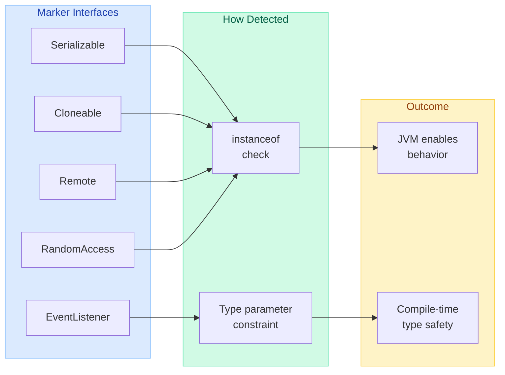
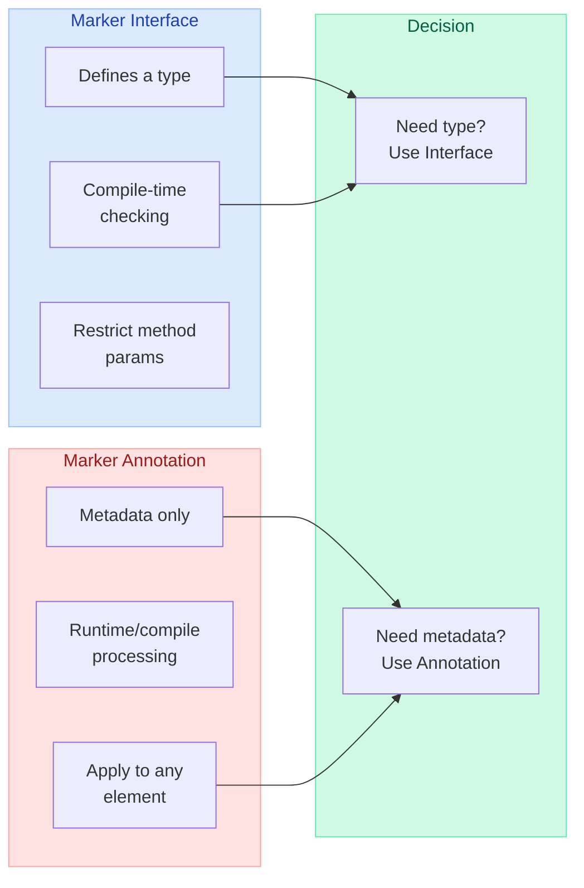
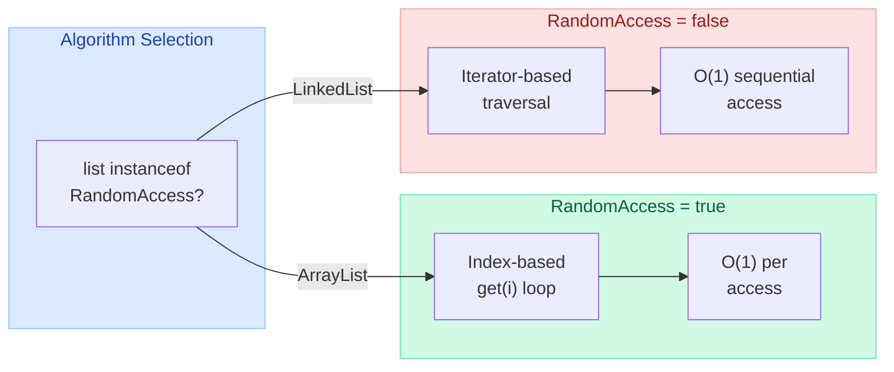
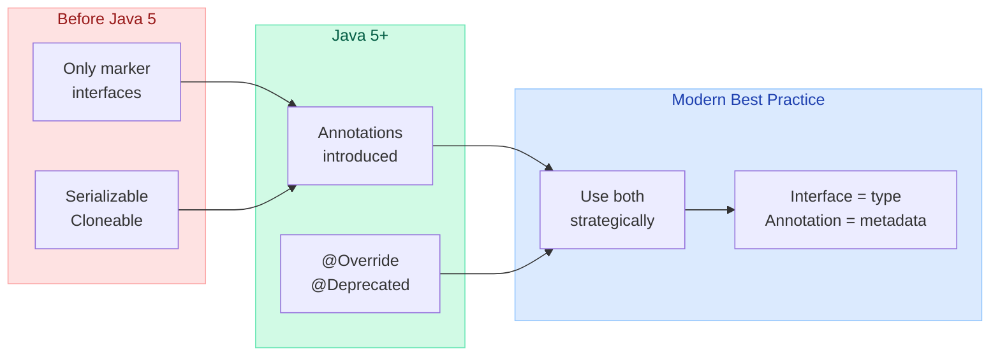

# Marker Interfaces vs Annotations

> **"A marker interface defines a type that is implemented by instances of the marked class; marker annotations do not." — Joshua Bloch, Effective Java Item 41**

---

!!! danger "Real Incident: Silent Serialization Failure in Production"
    A microservices team added a new `OrderEvent` class to a Kafka-based event pipeline but forgot to implement `Serializable`. The `ObjectOutputStream.writeObject()` call threw `NotSerializableException` — but only in the async event publisher, where exceptions were swallowed by a generic catch block. For **3 days**, order events silently vanished. The fix was one line: `implements Serializable`. A marker interface would have caught this at compile time if the publisher method signature required `Serializable` as a parameter type.

---

## What Is a Marker Interface?

A marker interface is an **empty interface** (no methods, no fields) that signals a capability or contract to the JVM, compiler, or framework. Classes that implement it are "tagged" with that capability.

```java
// The Serializable marker interface — literally empty
public interface Serializable {
    // no methods — just a tag
}
```

The key insight: implementing a marker interface **defines a type**. You can use it in method signatures, generics, and `instanceof` checks.

---

## Architecture Overview



---

## Built-in Marker Interfaces

| Interface | Package | Purpose | Checked By |
|---|---|---|---|
| `Serializable` | `java.io` | Object can be serialized to byte stream | `ObjectOutputStream` |
| `Cloneable` | `java.lang` | Object supports `clone()` | `Object.clone()` |
| `Remote` | `java.rmi` | Object can be invoked remotely via RMI | RMI runtime |
| `RandomAccess` | `java.util` | List supports fast random access (O(1) `get`) | `Collections` algorithms |
| `EventListener` | `java.util` | Tagging interface for event listener types | AWT/Swing event system |

---

## How JVM/Frameworks Check Marker Interfaces

The runtime uses `instanceof` to decide behavior:

```java
// Inside ObjectOutputStream.writeObject()
if (!(obj instanceof Serializable)) {
    throw new NotSerializableException(obj.getClass().getName());
}

// Inside Object.clone()
if (!(this instanceof Cloneable)) {
    throw new CloneNotSupportedException();
}

// Inside Collections.sort() / binarySearch()
if (list instanceof RandomAccess || list.size() < BINARYSEARCH_THRESHOLD) {
    // use index-based iteration
} else {
    // use iterator-based iteration
}
```

---

## Marker Interfaces vs Marker Annotations



### Comparison Table

| Criterion | Marker Interface | Marker Annotation |
|---|---|---|
| **Defines a type** | Yes — usable in generics, params | No |
| **Compile-time checking** | Yes — compiler catches misuse | Limited (only with annotation processor) |
| **Target scope** | Classes/interfaces only | Classes, methods, fields, params, packages |
| **Multiple markers** | Multiple interfaces allowed | Multiple annotations allowed |
| **Inheritance** | Subtypes automatically marked | Not inherited (unless `@Inherited`) |
| **Runtime detection** | `instanceof` (fast) | Reflection `isAnnotationPresent()` (slower) |
| **Affects existing class hierarchy** | May break if poorly designed | No — purely additive |
| **Framework tooling** | Less tooling support | Rich tooling (APT, IDE inspections) |
| **Example** | `Serializable`, `Cloneable` | `@Entity`, `@Deprecated` |

---

## When to Use Marker Interfaces

!!! tip "Effective Java Item 41: Use marker interfaces to define types"

Use a marker interface when:

1. **You want compile-time type checking** — Method signatures can require the marker type
2. **The marker applies only to classes** — Not methods or fields
3. **You want to restrict parameter types** — Only marked classes can be passed
4. **You might add methods later** — Interface can evolve with default methods

```java
// Compile-time safety: only Serializable objects can be cached
public class DistributedCache {
    public void put(String key, Serializable value) {
        // guaranteed serializable at compile time
        byte[] bytes = serialize(value);
        sendToCluster(key, bytes);
    }
}

// This won't compile — String[] implements Serializable, but a raw Socket doesn't
cache.put("session", new Socket()); // COMPILE ERROR
```

---

## When to Use Marker Annotations

Use a marker annotation when:

1. **The marker targets methods, fields, or parameters** — Not just classes
2. **You don't need type restriction** — Just metadata for processing
3. **You're in a framework that uses annotation scanning** — Spring, JPA, etc.
4. **You need to apply it without modifying class hierarchy**

```java
// Annotation approach — applies to methods, not just classes
@Retention(RetentionPolicy.RUNTIME)
@Target({ElementType.TYPE, ElementType.METHOD})
public @interface Auditable {}

@Auditable  // on class
public class PaymentService {

    @Auditable  // on method — can't do this with interfaces!
    public void processPayment(Order order) { ... }
}
```

---

## Custom Marker Interface Examples

### Auditable — Compile-Time Enforcement

```java
// Marker interface
public interface Auditable {
    // empty — marks classes that need audit logging
}

// Service that enforces the contract at compile time
public class AuditService {
    public <T extends Auditable> void track(T entity, String action) {
        AuditLog log = new AuditLog();
        log.setEntityClass(entity.getClass().getSimpleName());
        log.setAction(action);
        log.setTimestamp(Instant.now());
        auditRepository.save(log);
    }
}

// Usage — compile-time safety
public class Order implements Auditable {
    private String orderId;
    private BigDecimal amount;
}

auditService.track(new Order(), "CREATED");      // compiles
auditService.track(new TempData(), "CREATED");   // COMPILE ERROR — TempData not Auditable
```

### Cacheable — Framework Integration

```java
// Marker interface for cache-eligible entities
public interface Cacheable {
    // entities implementing this can be cached
}

// Generic cache that only accepts Cacheable types
public class EntityCache<T extends Cacheable> {
    private final Map<String, T> store = new ConcurrentHashMap<>();

    public void put(String key, T entity) {
        store.put(key, entity);
    }

    public Optional<T> get(String key) {
        return Optional.ofNullable(store.get(key));
    }
}

// Only Cacheable entities can be stored
public class Product implements Cacheable {
    private String sku;
    private String name;
}

EntityCache<Product> cache = new EntityCache<>();  // works
EntityCache<Socket> bad = new EntityCache<>();     // COMPILE ERROR
```

---

## RandomAccess — How Collections.sort Uses It

`RandomAccess` is the textbook example of a marker interface influencing algorithm selection:

```java
// From java.util.Collections source
public static <T> void sort(List<T> list, Comparator<? super T> c) {
    if (list instanceof RandomAccess || list.size() < INSERTIONSORT_THRESHOLD) {
        // Use index-based sort — fast for ArrayList
        for (int i = 0; i < list.size(); i++) {
            // direct get(i) access
        }
    } else {
        // Use iterator-based sort — efficient for LinkedList
        Object[] arr = list.toArray();
        Arrays.sort(arr, (Comparator) c);
        ListIterator<T> it = list.listIterator();
        for (Object e : arr) {
            it.next();
            it.set((T) e);
        }
    }
}
```



| List Implementation | RandomAccess? | `get(i)` Cost | Strategy Used |
|---|---|---|---|
| `ArrayList` | Yes | O(1) | Index-based loop |
| `Vector` | Yes | O(1) | Index-based loop |
| `CopyOnWriteArrayList` | Yes | O(1) | Index-based loop |
| `LinkedList` | No | O(n) | Iterator-based |

---

## EventListener as a Marker Interface

`java.util.EventListener` is a marker interface used by the Java event model to tag all listener interfaces:

```java
// The marker
public interface EventListener {
    // empty
}

// All specific listeners extend it
public interface ActionListener extends EventListener {
    void actionPerformed(ActionEvent e);
}

public interface MouseListener extends EventListener {
    void mouseClicked(MouseEvent e);
    void mousePressed(MouseEvent e);
    // ...
}
```

**Why it exists:** Frameworks can discover all event listeners on a bean using `instanceof EventListener`, enabling generic event-wiring, serialization of listener lists, and IDE tooling.

---

## Real-World Framework Examples

### Spring Framework

```java
// Spring's Aware interfaces are marker-like (with one method)
// But Spring also uses pure markers:

// BeanFactoryAware — Spring injects the BeanFactory
public interface BeanFactoryAware extends Aware {
    void setBeanFactory(BeanFactory beanFactory);
}

// The Aware interface itself is a marker!
public interface Aware {
    // empty — signals that the bean wants framework callbacks
}

// Spring checks:
if (bean instanceof Aware) {
    if (bean instanceof BeanNameAware) {
        ((BeanNameAware) bean).setBeanName(beanName);
    }
    if (bean instanceof BeanFactoryAware) {
        ((BeanFactoryAware) bean).setBeanFactory(this);
    }
}
```

### Hibernate / JPA

```java
// Hibernate uses Serializable as a marker for entity IDs
@Entity
public class User {
    @Id
    private Long id;  // Long implements Serializable
}

// Custom marker for soft-deletable entities
public interface SoftDeletable {
    // marker — Hibernate event listener checks instanceof
}

@Entity
public class Customer implements SoftDeletable {
    private boolean deleted;
}

// Hibernate PreDeleteEventListener
public class SoftDeleteListener implements PreDeleteEventListener {
    @Override
    public boolean onPreDelete(PreDeleteEvent event) {
        if (event.getEntity() instanceof SoftDeletable) {
            // set deleted=true instead of actual DELETE
            return true; // veto the hard delete
        }
        return false;
    }
}
```

### Custom Framework Pattern — Permission System

```java
// Marker interfaces for role-based access
public interface AdminAccess {}
public interface UserAccess {}
public interface PublicAccess {}

// Controller base enforces at compile time
public abstract class AdminController<T extends AdminAccess> {
    // only AdminAccess services can be injected
    protected final T service;

    protected AdminController(T service) {
        this.service = service;
    }
}

public class UserManagementService implements AdminAccess {
    public void deleteUser(long id) { ... }
}

// Compiles — UserManagementService is AdminAccess
public class AdminUserController extends AdminController<UserManagementService> { }

// Won't compile — PublicSearchService is not AdminAccess
public class BadController extends AdminController<PublicSearchService> { }  // ERROR
```

---

## The Evolution: Java 5+ Changed the Landscape



---

## Interview Questions

!!! abstract "Q1: What is a marker interface? Give examples."
    A marker interface is an empty interface with no methods that tags implementing classes with a capability. The JVM or framework checks `instanceof` at runtime to enable behavior. Examples: `Serializable`, `Cloneable`, `Remote`, `RandomAccess`, `EventListener`.

!!! abstract "Q2: Why not just use an annotation instead of Serializable?"
    Because `Serializable` defines a **type**. You can write `void save(Serializable obj)` — the compiler rejects non-serializable arguments. An annotation like `@Serializable` would only be detectable at runtime via reflection, offering no compile-time guarantee.

!!! abstract "Q3: What does Effective Java say about marker interfaces vs annotations?"
    Item 41: "Use marker interfaces to define types." If the marker applies only to classes and you ever want to write methods that accept only marked types, use an interface. If the marker applies to any program element (methods, fields, packages) or you're in an annotation-heavy framework, use an annotation.

!!! abstract "Q4: Can a marker interface have methods added later?"
    Yes — with Java 8+ default methods, you can add behavior without breaking existing implementations. This is impossible with annotations. Example: `Serializable` could theoretically add a `default byte[] toBytes()` method.

!!! abstract "Q5: How does RandomAccess improve performance?"
    `Collections` algorithms check `list instanceof RandomAccess`. If true, they use index-based iteration (`get(i)`) which is O(1) for `ArrayList`. If false, they use iterators which are O(1) per step for `LinkedList`. Without this marker, algorithms would either always use iterators (slow for ArrayList) or always use indexes (slow for LinkedList).

!!! abstract "Q6: What is wrong with the Cloneable interface design?"
    `Cloneable` is considered a **broken** marker interface (Effective Java Item 13). It changes the behavior of `Object.clone()` but doesn't declare the `clone()` method itself. The contract is that implementing `Cloneable` changes a protected method's behavior in a superclass — a highly atypical use that violates the principle of least surprise.

!!! abstract "Q7: Can you have a marker annotation that defines a type?"
    No. Annotations are metadata — they cannot be used as types in method signatures, generics, or variable declarations. This is the fundamental difference. You cannot write `void process(@MarkerAnnotation Object obj)` with the same compile-time safety as `void process(MarkerInterface obj)`.

---

## Quick Recall

| Question | Answer |
|---|---|
| What is a marker interface? | **Empty interface** that tags a class with a capability |
| Does it define a type? | **Yes** — usable in generics, method params, instanceof |
| Built-in examples? | `Serializable`, `Cloneable`, `Remote`, `RandomAccess`, `EventListener` |
| How is it detected? | **`instanceof` check** at runtime |
| Marker annotation defines type? | **No** — metadata only, not a type |
| When use interface over annotation? | Need **compile-time type checking** or method param restriction |
| When use annotation over interface? | Targeting **methods/fields** or in annotation-heavy frameworks |
| Effective Java Item 41? | "Use marker interfaces to **define types**" |
| RandomAccess purpose? | Signals O(1) `get(i)` — algorithms pick index-based strategy |
| Cloneable flaw? | Changes `Object.clone()` behavior without declaring `clone()` method |
| Can marker interface gain methods? | **Yes** — Java 8+ default methods allow non-breaking evolution |
| instanceof vs isAnnotationPresent? | instanceof is **faster** (no reflection overhead) |
| Spring's Aware? | Marker interface — beans implementing it get framework callbacks |
| EventListener purpose? | Tags all listener interfaces for generic event wiring |
| Compile-time safety example? | `void save(Serializable obj)` rejects non-serializable at compile time |
