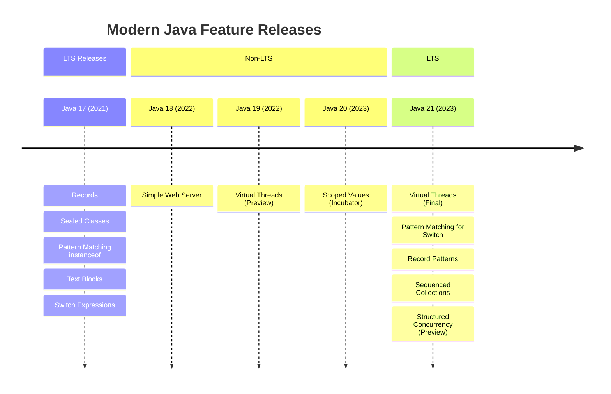
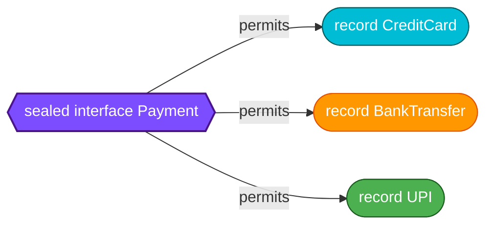
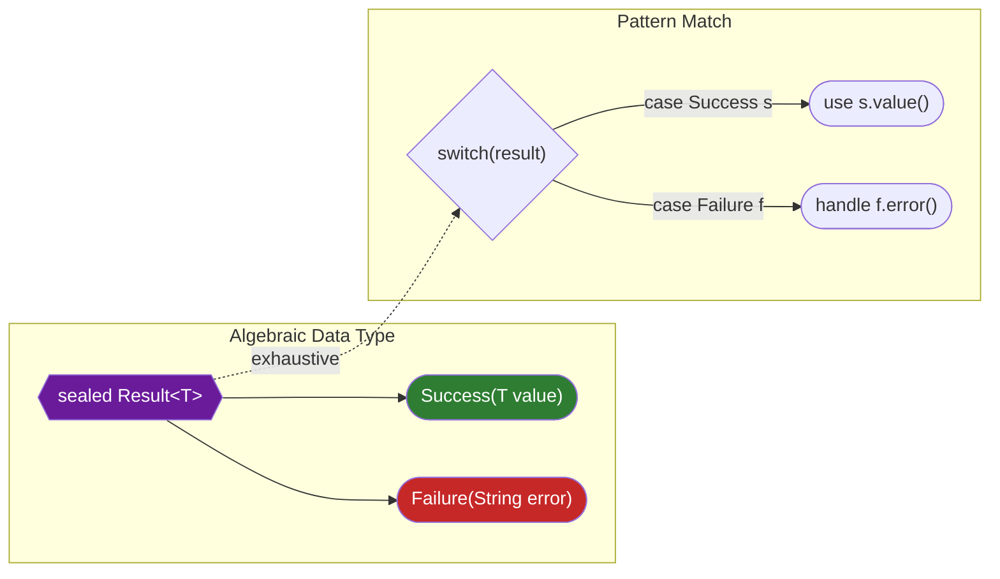
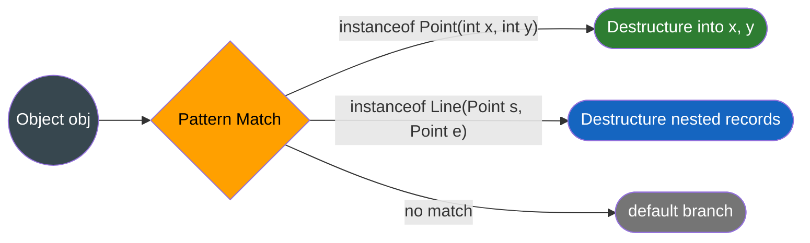
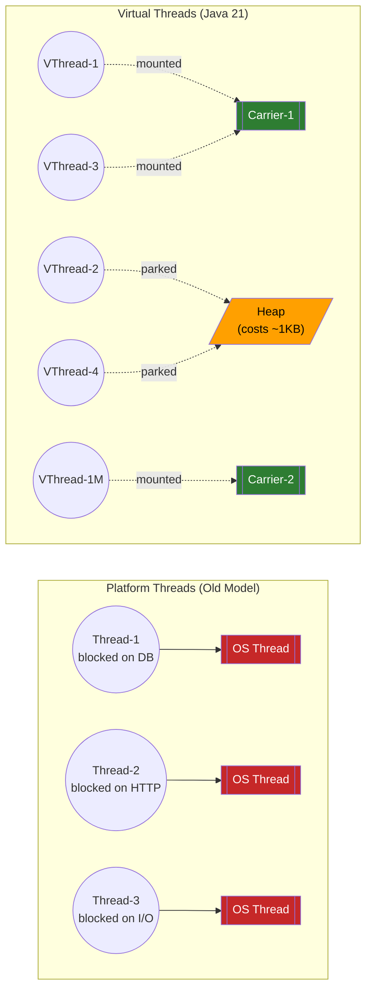
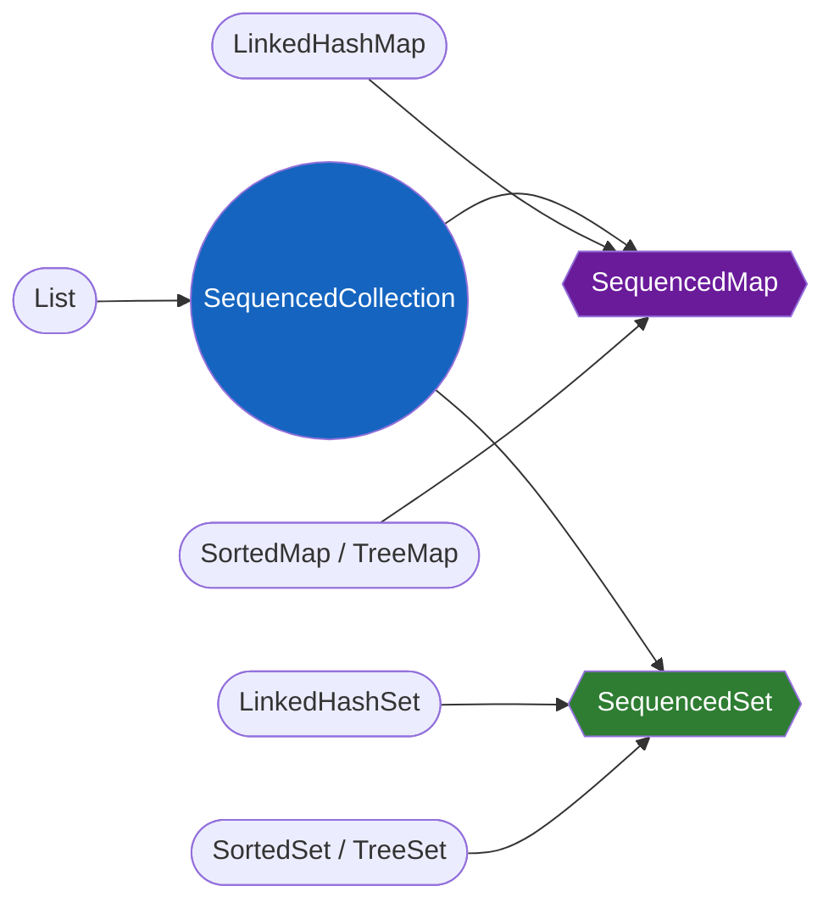

# Modern Java (17-21) Features

!!! tip "Why This Matters for Interviews"
    FAANG companies now run Java 17+ in production (Netflix, Amazon, Google all mandate it). Interviewers expect you to write **idiomatic modern Java** — using records instead of POJOs, pattern matching instead of instanceof chains, and virtual threads instead of thread pools. This page covers features from Java 14 through 21 that are **finalized and production-ready**.

---

## Feature Timeline



---

## Records (Java 16 — Final)

Records are **transparent carriers for immutable data**. The compiler generates the canonical constructor, accessor methods, `equals()`, `hashCode()`, and `toString()`.

### Syntax & Generated Methods

```java
public record Point(int x, int y) {}
```

This single line generates:

| Generated Member | Equivalent Code |
|---|---|
| Canonical constructor | `Point(int x, int y)` |
| Accessor `x()` | `public int x() { return this.x; }` |
| Accessor `y()` | `public int y() { return this.y; }` |
| `equals()` | Component-wise equality |
| `hashCode()` | Based on all components |
| `toString()` | `Point[x=1, y=2]` |

### Compact Constructors (Validation)

A compact constructor **omits the parameter list** — parameters are implicitly in scope. Assignment to fields happens automatically at the end.

```java
public record Employee(String name, int age, String department) {
    // Compact constructor — no parameter list, no explicit assignment
    public Employee {
        Objects.requireNonNull(name, "name must not be null");
        if (age < 0 || age > 150) throw new IllegalArgumentException("Invalid age: " + age);
        name = name.strip();  // normalize before implicit assignment
    }
}
```

### Custom Constructors

You can add non-canonical constructors, but they **must delegate to the canonical constructor**:

```java
public record Range(int low, int high) {
    public Range {
        if (low > high) throw new IllegalArgumentException("low > high");
    }

    // Custom constructor delegates to canonical
    public Range(int single) {
        this(single, single);
    }
}
```

### Records Implementing Interfaces

```java
public sealed interface Shape permits Circle, Rectangle {}

public record Circle(double radius) implements Shape {
    public double area() { return Math.PI * radius * radius; }
}

public record Rectangle(double width, double height) implements Shape {
    public double area() { return width * height; }
}
```

### When to Use vs When NOT to Use

| Use Records For | Do NOT Use Records For |
|---|---|
| DTOs / API request-response objects | Entities with mutable state (JPA entities) |
| Value objects (Money, Coordinate) | Classes that need inheritance |
| Event payloads (Kafka, domain events) | Objects requiring private fields with getters only |
| Map keys (auto equals/hashCode) | Builders with many optional fields |
| Tuple-like groupings | Classes needing lazy initialization |

!!! warning "Records & JPA"
    Records **cannot** be JPA entities because JPA requires a no-arg constructor, mutable fields, and proxying via inheritance. Use records for projections/DTOs, not for `@Entity` classes.

---

## Sealed Classes & Interfaces (Java 17 — Final)

Sealed types restrict **which classes or interfaces can extend or implement them**. This gives you closed type hierarchies with compiler-enforced exhaustiveness.

### permits Clause

```java
public sealed interface Payment permits CreditCard, BankTransfer, UPI {
    BigDecimal amount();
}

public record CreditCard(String number, BigDecimal amount) implements Payment {}
public record BankTransfer(String iban, BigDecimal amount) implements Payment {}
public record UPI(String vpa, BigDecimal amount) implements Payment {}
```



**Subclass modifiers:**

| Modifier | Effect |
|---|---|
| `final` | No further extension |
| `sealed` | Must declare its own `permits` |
| `non-sealed` | Open for extension by anyone |
| `record` | Implicitly `final` |

### Exhaustive Pattern Matching

When you switch over a sealed type, the compiler **knows all possible subtypes** — no `default` branch needed:

```java
public static String describe(Payment payment) {
    return switch (payment) {
        case CreditCard cc  -> "Card ending " + cc.number().substring(12);
        case BankTransfer bt -> "Transfer to " + bt.iban();
        case UPI upi        -> "UPI to " + upi.vpa();
        // No default needed — compiler knows this is exhaustive
    };
}
```

### Algebraic Data Types (ADTs) with Sealed + Records

This is the **killer combination** for domain modelling — equivalent to Scala/Kotlin sealed traits:

```java
public sealed interface Result<T> {
    record Success<T>(T value) implements Result<T> {}
    record Failure<T>(String error, Exception cause) implements Result<T> {}
}

// Usage
Result<User> result = fetchUser(id);
switch (result) {
    case Result.Success<User> s -> renderUser(s.value());
    case Result.Failure<User> f -> showError(f.error());
}
```



---

## Pattern Matching

### instanceof Pattern Matching (Java 16)

Eliminates the cast-after-check boilerplate:

```java
// Before
if (obj instanceof String) {
    String s = (String) obj;
    System.out.println(s.length());
}

// After — binding variable 's' is in scope when the pattern matches
if (obj instanceof String s && s.length() > 5) {
    System.out.println(s.toUpperCase());
}
```

The binding variable respects **flow scoping** — it is in scope wherever the compiler can prove the pattern matched:

```java
if (!(obj instanceof String s)) {
    return;  // early exit
}
// s is in scope here — compiler knows obj IS a String
System.out.println(s.strip());
```

### Switch Expressions (Java 14)

Switch becomes an **expression** that returns a value, uses arrow syntax, and eliminates fall-through:

```java
int numLetters = switch (day) {
    case MONDAY, FRIDAY, SUNDAY -> 6;
    case TUESDAY                -> 7;
    case THURSDAY, SATURDAY     -> 8;
    case WEDNESDAY              -> 9;
};
```

Use `yield` for multi-statement branches:

```java
String description = switch (statusCode) {
    case 200 -> "OK";
    case 404 -> "Not Found";
    default -> {
        log.warn("Unexpected status: {}", statusCode);
        yield "Unknown (" + statusCode + ")";
    }
};
```

### Pattern Matching for Switch (Java 21 — Final)

Combines type patterns, guarded patterns, and null handling in a single switch:

```java
public String format(Object obj) {
    return switch (obj) {
        case null            -> "null";
        case Integer i       -> "int: " + i;
        case Long l          -> "long: " + l;
        case String s
            when s.isBlank() -> "blank string";
        case String s        -> "string: \"" + s + "\"";
        case int[] arr       -> "array of length " + arr.length;
        default              -> "other: " + obj.getClass().getSimpleName();
    };
}
```

**Key features:**

| Feature | Syntax | Purpose |
|---|---|---|
| Type patterns | `case String s` | Match + bind |
| Guarded patterns | `case String s when s.length() > 5` | Additional condition |
| Null handling | `case null` | No more NPE on switch |
| Dominance order | Specific before general | Compiler enforces ordering |

!!! warning "Dominance Ordering"
    The compiler rejects switches where a general pattern appears before a more specific one. `case Object o` must come after `case String s`, otherwise the `String` case is unreachable.

### Record Patterns — Destructuring (Java 21)

Deconstruct records directly in patterns, even nested ones:

```java
record Point(int x, int y) {}
record Line(Point start, Point end) {}

// Destructure a record
if (obj instanceof Point(int x, int y)) {
    System.out.println("Point at (" + x + ", " + y + ")");
}

// Nested destructuring in switch
static String describeShape(Object shape) {
    return switch (shape) {
        case Line(Point(var x1, var y1), Point(var x2, var y2))
            -> "Line from (%d,%d) to (%d,%d)".formatted(x1, y1, x2, y2);
        case Point(var x, var y)
            -> "Point at (%d,%d)".formatted(x, y);
        default -> "Unknown shape";
    };
}
```



---

## Text Blocks (Java 15 — Final)

Multi-line string literals enclosed in `"""`. The compiler strips common leading whitespace (incidental indentation).

### Syntax & Formatting

```java
String json = """
        {
            "name": "Vamsi",
            "role": "SDE",
            "level": 5
        }
        """;
// Indentation relative to the closing """ determines stripped whitespace
```

### Escape Sequences

| Escape | Purpose |
|---|---|
| `\s` | Preserve trailing space (normally stripped) |
| `\` at end of line | Suppress newline (line continuation) |
| `\"\"\"` | Include triple quotes inside text block |

```java
String html = """
        <html>
            <body>
                <p>Hello, %s</p>\s\
            </body>
        </html>
        """.formatted(userName);
```

### Useful Methods

```java
// formatted() — like String.format but called on the text block
String sql = """
        SELECT * FROM users
        WHERE age > %d
        AND city = '%s'
        """.formatted(18, "Bangalore");

// stripIndent() — programmatically remove incidental whitespace
// translateEscapes() — process escape sequences in a literal string
String raw = "Hello\\nWorld";
String processed = raw.translateEscapes();  // "Hello\nWorld"
```

---

## Virtual Threads (Java 21 — Final)

### The Blocking Problem



**Platform threads** are mapped 1:1 to OS threads. A server with 200 threads hitting a 50ms database call can only handle ~4000 req/s. Virtual threads **unmount from the carrier thread when blocked**, allowing millions of concurrent tasks on a handful of OS threads.

### How to Use

```java
// Option 1: Create a single virtual thread
Thread.ofVirtual().name("worker").start(() -> {
    var data = blockingHttpCall();  // thread is unmounted while blocked
    process(data);
});

// Option 2: Virtual thread executor (most common in servers)
try (var executor = Executors.newVirtualThreadPerTaskExecutor()) {
    List<Future<String>> futures = urls.stream()
        .map(url -> executor.submit(() -> fetch(url)))
        .toList();

    for (var future : futures) {
        System.out.println(future.get());
    }
}

// Option 3: Direct factory
Thread vt = Thread.ofVirtual()
    .name("processor-", 0)  // names: processor-0, processor-1, ...
    .factory()
    .newThread(() -> doWork());
```

### Structured Concurrency (Preview in Java 21)

Structured concurrency ensures child tasks are **bounded by the parent scope** — no leaked threads:

```java
try (var scope = new StructuredTaskScope.ShutdownOnFailure()) {
    Subtask<User> userTask   = scope.fork(() -> findUser(userId));
    Subtask<Order> orderTask = scope.fork(() -> fetchOrder(orderId));

    scope.join();            // wait for both
    scope.throwIfFailed();   // propagate any exception

    // Both completed successfully
    return new UserOrder(userTask.get(), orderTask.get());
}
// If one fails, the other is cancelled automatically
```

| Strategy | Behavior |
|---|---|
| `ShutdownOnFailure` | Cancel all if any subtask fails |
| `ShutdownOnSuccess` | Cancel remaining once first succeeds (racing) |

### When NOT to Use Virtual Threads

| Scenario | Why Not |
|---|---|
| CPU-bound work (math, encryption) | Virtual threads optimize for blocking I/O, not CPU — use platform thread pools |
| `synchronized` blocks with I/O inside | Pins the carrier thread (use `ReentrantLock` instead) |
| Thread-local heavy code | Virtual threads are cheap; millions of ThreadLocals waste memory |
| Already using reactive (WebFlux) | Reactive already avoids blocking — mixing adds complexity |

!!! info "Pinning"
    When a virtual thread executes inside a `synchronized` block or calls a native method, it **pins** to its carrier thread, negating the benefit. Replace `synchronized` with `ReentrantLock` in I/O-heavy code to avoid this.

---

## Sequenced Collections (Java 21)

Java finally has interfaces that **guarantee encounter order** with first/last access:



### Key Methods

```java
SequencedCollection<String> names = new LinkedHashSet<>(List.of("A", "B", "C"));

names.getFirst();      // "A"
names.getLast();       // "C"
names.addFirst("Z");   // [Z, A, B, C]
names.addLast("D");    // [Z, A, B, C, D]
names.removeFirst();   // removes "Z"
names.reversed();      // reversed view: [D, C, B, A]
```

### Before vs After

```java
// Before Java 21 — getting the last element of a List
var last = list.get(list.size() - 1);

// Java 21
var last = list.getLast();

// Before — getting first key of a LinkedHashMap
var firstKey = map.entrySet().iterator().next().getKey();

// Java 21
var firstKey = map.firstEntry().getKey();
```

---

## String Enhancements

### `String.formatted()` (Java 15)

Instance method replacement for `String.format()`:

```java
// Before
String msg = String.format("Hello %s, you have %d items", name, count);

// After — reads more fluently
String msg = "Hello %s, you have %d items".formatted(name, count);
```

### `stripIndent()` (Java 15)

Removes incidental whitespace (same algorithm as text blocks):

```java
String code = "    public void hello() {\n        System.out.println(\"hi\");\n    }";
String stripped = code.stripIndent();
// "public void hello() {\n    System.out.println(\"hi\");\n}"
```

### `translateEscapes()` (Java 15)

Interprets escape sequences in strings read from external sources:

```java
String fromFile = "Hello\\tWorld\\n";        // literal backslash-t, backslash-n
String processed = fromFile.translateEscapes(); // "Hello\tWorld\n" (actual tab and newline)
```

### Other Additions

| Method | Version | Purpose |
|---|---|---|
| `repeat(int)` | Java 11 | `"ha".repeat(3)` -> `"hahaha"` |
| `isBlank()` | Java 11 | True for whitespace-only strings |
| `indent(int)` | Java 12 | Adjusts indentation of each line |
| `transform(Function)` | Java 12 | Apply a function: `str.transform(String::toUpperCase)` |

---

## Putting It All Together — Real-World Example

A complete domain model using sealed interfaces, records, and pattern matching:

```java
// Domain model
public sealed interface HttpResponse permits Success, ClientError, ServerError {
    int statusCode();
}

public record Success(int statusCode, String body) implements HttpResponse {}
public record ClientError(int statusCode, String message) implements HttpResponse {}
public record ServerError(int statusCode, Exception cause) implements HttpResponse {}

// Handler using pattern matching for switch + record patterns
public String handleResponse(HttpResponse response) {
    return switch (response) {
        case Success(var code, var body)
            when body.isBlank()           -> "Empty response (%d)".formatted(code);
        case Success(var code, var body)   -> "OK: " + body;
        case ClientError(var code, var msg)
            when code == 404              -> "Not found: " + msg;
        case ClientError(var code, var msg) -> "Client error %d: %s".formatted(code, msg);
        case ServerError(_, var cause)     -> "Server error: " + cause.getMessage();
    };
}
```

---

## Interview Questions

??? question "1. Why are records not suitable for JPA entities?"
    JPA requires: (a) a no-arg constructor, (b) mutable fields for lazy loading and dirty checking, (c) ability to proxy via inheritance. Records are `final`, have no no-arg constructor, and all fields are `final`. Use records as DTOs or projections, not entities.

??? question "2. How does exhaustive pattern matching with sealed classes prevent bugs?"
    When you switch over a sealed type, the compiler knows all permitted subtypes. If a developer adds a new subtype to the `permits` clause, every switch expression that doesn't handle it **fails to compile**. This catches bugs at compile time instead of runtime. Without sealed classes, you rely on a `default` branch that silently swallows unknown types.

??? question "3. Explain the difference between guarded patterns and nested if-else inside a case block."
    `case String s when s.length() > 5` is a guarded pattern — the `when` clause is part of the pattern. If the guard fails, the switch tries the **next case**. In contrast, an if-else inside a case block means the case already matched — the switch won't try other cases. Guarded patterns enable fallthrough-style logic without actual fallthrough.

??? question "4. A microservice handles 10K concurrent requests, each making a 200ms DB call. Explain why virtual threads help and what the thread count looks like vs platform threads."
    With platform threads (200-thread pool): throughput = 200 / 0.2s = 1000 req/s. To handle 10K concurrent, you need 10K platform threads (each using ~1MB stack = 10GB RAM). With virtual threads: you create 10K virtual threads (each ~1KB on heap = 10MB total). They share a small carrier pool (typically CPU-count threads). When blocked on DB I/O, the virtual thread unmounts, freeing the carrier for others. Result: 10K concurrency with minimal memory.

??? question "5. What is carrier thread pinning and how do you avoid it?"
    Pinning occurs when a virtual thread executes inside a `synchronized` block or a native method — it cannot unmount from its carrier thread, blocking that carrier. Fix: replace `synchronized` with `ReentrantLock`. Detect pinning by running with `-Djdk.tracePinnedThreads=short`. Never hold a monitor while performing blocking I/O.

??? question "6. How do record patterns enable nested destructuring? Give an example with 2 levels."
    Record patterns deconstruct a record's components inline. For nested records like `record Line(Point start, Point end)` and `record Point(int x, int y)`, you can write: `case Line(Point(var x1, var y1), Point(var x2, var y2))` — this extracts all four coordinates in one pattern. The compiler calls the record's accessor methods and recursively matches inner patterns.

??? question "7. What is Structured Concurrency and how does it prevent thread leaks?"
    Structured concurrency (StructuredTaskScope) ties the lifetime of child tasks to the parent scope. When the scope closes, all forked tasks are guaranteed to be complete or cancelled. This prevents the common bug where a spawned thread outlives the request. `ShutdownOnFailure` cancels siblings if one fails; `ShutdownOnSuccess` cancels remaining once one succeeds (useful for racing).

??? question "8. Compare SequencedCollection.reversed() with Collections.reverse(). Which is destructive?"
    `Collections.reverse(list)` **mutates** the original list in place. `sequencedCollection.reversed()` returns a **reversed view** — the original collection is unchanged, and the view is backed by the original. Modifications through the view reflect in the original in reverse order. This is non-destructive and consistent with the existing `Collections.unmodifiableList()` view pattern.
