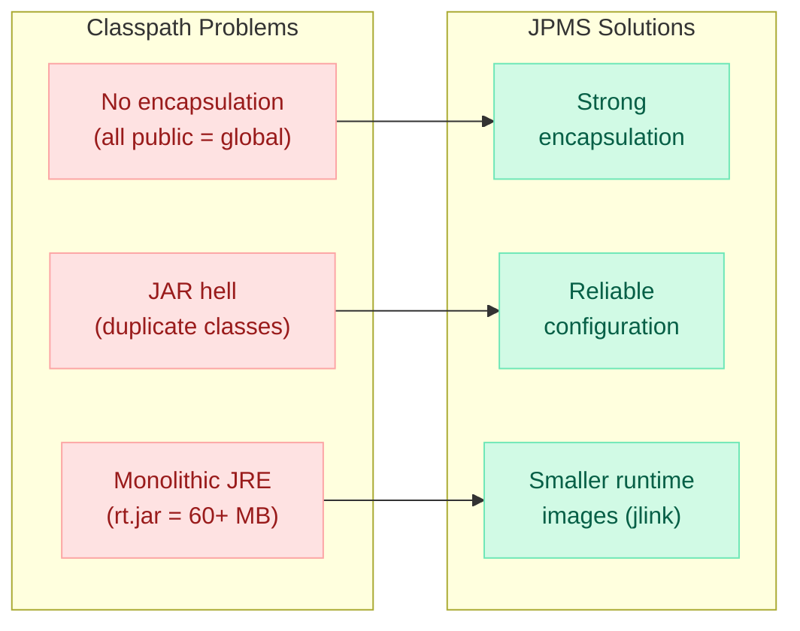
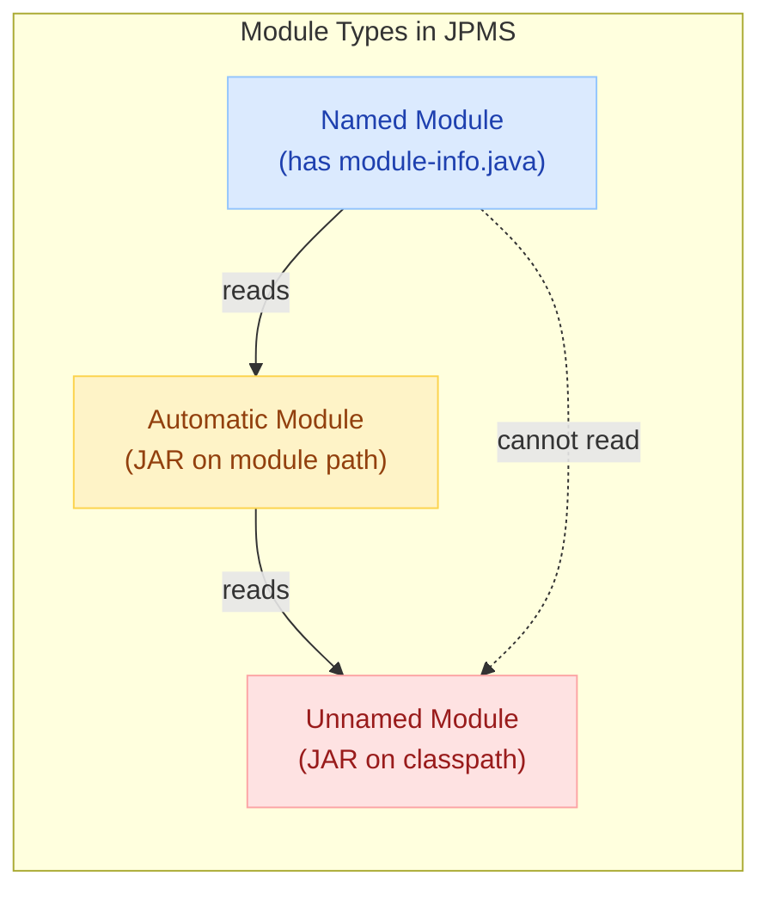
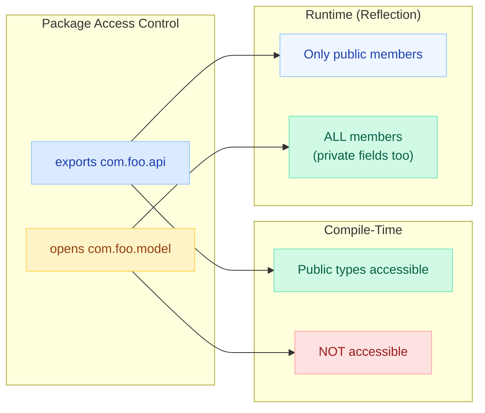
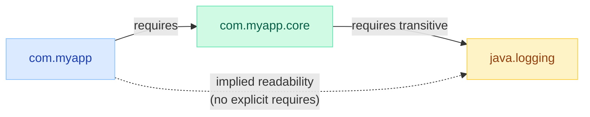
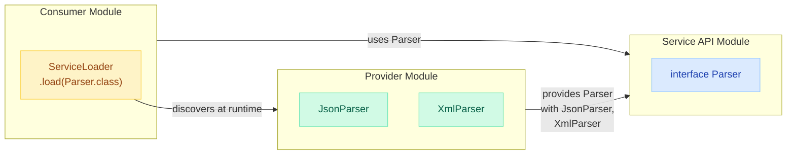
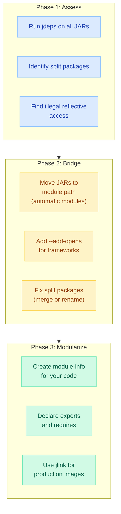
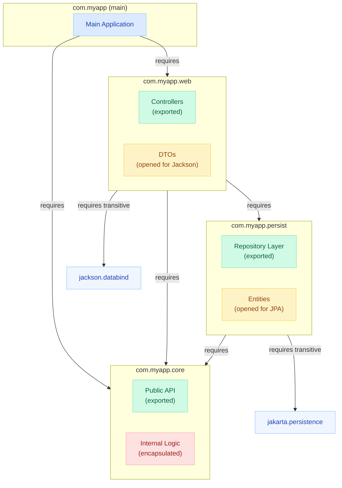

# Java Platform Module System (JPMS)

> **Classpath hell: two JARs ship `com.utils.Config` — the classloader picks one arbitrarily, and your app explodes at runtime with `NoClassDefFoundError` or silent wrong behavior.**

---

!!! danger "The Classpath Problem"
    Before modules, Java had **no way to enforce boundaries between JARs**. Any public class was accessible to every other JAR. Duplicate packages, split packages, and transitive dependency conflicts all manifested as **runtime errors** — invisible at compile time.

---

## Why Modules?



| Benefit | Description |
|---------|-------------|
| **Strong encapsulation** | Only explicitly exported packages are accessible to other modules |
| **Reliable configuration** | Missing dependencies detected at **compile time and startup**, not runtime |
| **Smaller runtime images** | `jlink` creates custom JREs with only the modules your app needs |
| **Improved security** | Internal APIs (like `sun.misc.Unsafe`) are no longer accessible by default |
| **Better performance** | JVM can optimize when it knows the full module graph at startup |

---

## module-info.java Anatomy

The module descriptor lives at the **root of the source tree** (e.g., `src/com.myapp.core/module-info.java`).

```java
module com.myapp.core {

    // --- Dependencies ---
    requires java.sql;                    // compile + runtime dependency
    requires transitive java.logging;     // implied readability (consumers get it too)
    requires static java.compiler;        // compile-time only (optional at runtime)

    // --- Exports (compile-time + runtime access) ---
    exports com.myapp.core.api;                          // to everyone
    exports com.myapp.core.spi to com.myapp.plugin;     // qualified export

    // --- Opens (reflection access) ---
    opens com.myapp.core.model;                          // to everyone for reflection
    opens com.myapp.core.internal to spring.core;        // qualified open

    // --- Services ---
    provides com.myapp.core.spi.Parser
        with com.myapp.core.internal.JsonParser,
             com.myapp.core.internal.XmlParser;

    uses com.myapp.core.spi.Validator;    // this module consumes Validator impls
}
```

### Directive Summary

| Directive | Purpose | Access Level |
|-----------|---------|--------------|
| `requires` | Declare dependency on another module | Read access to its exports |
| `requires transitive` | Dependency + pass it to your consumers | Implied readability |
| `requires static` | Compile-time only dependency | Optional at runtime |
| `exports` | Make package available at compile + runtime | Public types visible |
| `exports ... to` | Qualified export to specific modules | Restricted visibility |
| `opens` | Allow deep reflection into package | Runtime reflection access |
| `opens ... to` | Qualified reflection access | Restricted reflection |
| `provides ... with` | Register service implementation(s) | ServiceLoader discovery |
| `uses` | Declare consumption of a service type | ServiceLoader lookup |

---

## Module Types



| Module Type | How Created | Exports | Can Read |
|-------------|-------------|---------|----------|
| **Named** | Has `module-info.java` | Only declared exports | Other named + automatic modules |
| **Automatic** | JAR placed on **module path** (no module-info) | Exports everything | All modules including unnamed |
| **Unnamed** | JAR placed on **classpath** | Exports everything | All modules |

!!! warning "Key Rule"
    Named modules **cannot** read the unnamed module. This forces proper modularization — you cannot depend on classpath JARs from a named module (use automatic modules as a bridge).

---

## exports vs opens



| | `exports` | `opens` |
|---|-----------|---------|
| **Compile-time access** | Public types visible to dependents | NOT visible (cannot import) |
| **Runtime reflection** | Only public members | ALL members (including private) |
| **Use case** | Public API surface | Frameworks (Spring, Hibernate, Jackson) |
| **Can combine?** | Yes: `exports` + `opens` same package for both | N/A |

```java
// Spring/Hibernate need deep reflection on entity classes
module com.myapp.persistence {
    requires spring.context;
    requires jakarta.persistence;

    exports com.myapp.persistence.repository;  // public API
    opens com.myapp.persistence.entity to       // reflection for frameworks
        spring.core, hibernate.core;
}
```

---

## requires transitive (Implied Readability)

When module A declares `requires transitive B`, any module that reads A **automatically reads B** without declaring it.



```java
// com.myapp.core/module-info.java
module com.myapp.core {
    requires transitive java.logging;  // any consumer of core gets logging for free
    exports com.myapp.core.api;
}

// com.myapp/module-info.java
module com.myapp {
    requires com.myapp.core;
    // java.logging is implicitly readable — no requires needed!
}
```

!!! tip "When to Use `requires transitive`"
    Use it when your **public API** exposes types from another module. If your exported method returns a `java.sql.Connection`, you should `requires transitive java.sql` so consumers don't get compile errors.

---

## Services: provides...with and uses

The **ServiceLoader** pattern enables loose coupling between modules — consumers don't know implementations at compile time.



### Service API Module

```java
// com.myapp.spi/module-info.java
module com.myapp.spi {
    exports com.myapp.spi;  // contains Parser interface
}

// Parser.java
package com.myapp.spi;
public interface Parser {
    Document parse(String input);
}
```

### Provider Module

```java
// com.myapp.json/module-info.java
module com.myapp.json {
    requires com.myapp.spi;
    provides com.myapp.spi.Parser
        with com.myapp.json.internal.JsonParser;
}
```

### Consumer Module

```java
// com.myapp.app/module-info.java
module com.myapp.app {
    requires com.myapp.spi;
    uses com.myapp.spi.Parser;  // declares intent to load implementations
}

// Usage
ServiceLoader<Parser> parsers = ServiceLoader.load(Parser.class);
for (Parser p : parsers) {
    // discovers JsonParser, XmlParser, etc. at runtime
}
```

---

## jlink — Custom Runtime Images

`jlink` creates a **minimal JRE** containing only the modules your application needs.

```bash
# 1. Compile with modules
javac -d out --module-source-path src $(find src -name "*.java")

# 2. Package as modular JAR
jar --create --file mods/com.myapp.jar \
    --main-class com.myapp.Main \
    -C out/com.myapp .

# 3. Create custom runtime image
jlink \
    --module-path mods:$JAVA_HOME/jmods \
    --add-modules com.myapp \
    --output myapp-runtime \
    --launcher myapp=com.myapp/com.myapp.Main \
    --compress zip-6 \
    --no-header-files \
    --no-man-pages

# 4. Run with custom runtime (no JRE installation needed!)
./myapp-runtime/bin/myapp
```

### Size Comparison

| Runtime | Typical Size |
|---------|-------------|
| Full JDK 21 | ~300 MB |
| Full JRE (deprecated) | ~200 MB |
| jlink (web service) | ~40-60 MB |
| jlink (CLI tool) | ~25-35 MB |
| jlink + `--compress zip-9` | ~20-30 MB |

!!! success "Docker Benefit"
    A jlink image + Alpine = Docker container under **50 MB** vs 200+ MB with a full JDK base image.

---

## Migration Strategy: Classpath to Module Path



### Step-by-Step

```bash
# Step 1: Analyze dependencies
jdeps --jdk-internals -R --class-path 'libs/*' myapp.jar

# Step 2: Generate module-info.java automatically
jdeps --generate-module-info out libs/some-library.jar

# Step 3: Check for split packages
jdeps --check libs/*

# Step 4: Run with warnings to find issues
java --illegal-access=warn -cp libs/* com.myapp.Main
```

### Common Migration Issues

| Issue | Symptom | Fix |
|-------|---------|-----|
| Split package | `Package X exists in modules A and B` | Merge JARs or rename packages |
| Illegal reflective access | `WARNING: An illegal reflective access` | `--add-opens module/pkg=target` |
| Missing module | `module not found: X` | Add to `--add-modules` or module-info |
| Automatic module naming | `Invalid module name: 'my-lib-1.0'` | Add `Automatic-Module-Name` to MANIFEST.MF |

---

## Impact on Reflection

JPMS **strongly encapsulates** non-exported packages. Frameworks that rely on reflection (Spring, Hibernate, Jackson) need explicit access.

### The Problem

```java
// This worked pre-Java 9 — now throws InaccessibleObjectException
Field field = SomeClass.class.getDeclaredField("privateField");
field.setAccessible(true);  // BOOM!
```

### Solutions

=== "module-info.java (Preferred)"

    ```java
    module com.myapp {
        opens com.myapp.entity to spring.core, hibernate.core;
        opens com.myapp.dto to com.fasterxml.jackson.databind;
    }
    ```

=== "Command-line flags"

    ```bash
    java --add-opens java.base/java.lang=ALL-UNNAMED \
         --add-opens java.base/java.lang.reflect=ALL-UNNAMED \
         --add-exports java.base/sun.nio.ch=ALL-UNNAMED \
         -jar myapp.jar
    ```

=== "Open entire module"

    ```java
    // Nuclear option — opens everything to everyone
    open module com.myapp {
        requires spring.context;
        exports com.myapp.api;
        // all packages implicitly opened for reflection
    }
    ```

### --add-opens vs --add-exports

| Flag | Purpose | Access Granted |
|------|---------|----------------|
| `--add-exports module/pkg=target` | Compile-time + runtime access to public types | Same as `exports` directive |
| `--add-opens module/pkg=target` | Deep reflection access (private fields/methods) | Same as `opens` directive |

!!! warning "ALL-UNNAMED"
    Using `ALL-UNNAMED` as the target grants access to everything on the classpath. It's a migration crutch — replace with specific module names in production.

---

## Module Dependency Diagram Example

A real-world modular application structure:



```java
// com.myapp/module-info.java
module com.myapp {
    requires com.myapp.core;
    requires com.myapp.web;
}

// com.myapp.core/module-info.java
module com.myapp.core {
    exports com.myapp.core.api;
    exports com.myapp.core.model;
    // com.myapp.core.internal is NOT exported — truly encapsulated
}

// com.myapp.persist/module-info.java
module com.myapp.persist {
    requires com.myapp.core;
    requires transitive jakarta.persistence;
    exports com.myapp.persist.repository;
    opens com.myapp.persist.entity to hibernate.core;
}

// com.myapp.web/module-info.java
module com.myapp.web {
    requires com.myapp.core;
    requires com.myapp.persist;
    requires transitive com.fasterxml.jackson.databind;
    exports com.myapp.web.controller;
    opens com.myapp.web.dto to com.fasterxml.jackson.databind;
}
```

---

## Quick Recall

| Concept | One-Liner |
|---------|-----------|
| **module-info.java** | Module descriptor at source root — declares requires, exports, opens, provides, uses |
| **exports** | Makes package available at compile-time + runtime (public types only) |
| **opens** | Allows deep reflection (private fields) — needed by Spring/Hibernate/Jackson |
| **requires transitive** | "My consumers also need this dependency" — implied readability |
| **provides...with** | Register ServiceLoader implementation(s) |
| **uses** | Declare that this module loads service implementations |
| **Named module** | Has module-info.java — strong encapsulation |
| **Automatic module** | JAR on module path without module-info — exports everything |
| **Unnamed module** | JAR on classpath — the legacy escape hatch |
| **jlink** | Create minimal custom JRE with only needed modules |
| **--add-opens** | Runtime flag to grant reflection access (migration tool) |
| **--add-exports** | Runtime flag to grant compile-time access to a package |
| **Split package** | Same package in two modules — JPMS forbids this |

---

## Interview Template

!!! quote "Tell me about Java's Module System"
    "JPMS, introduced in Java 9, solves **classpath hell** by adding **strong encapsulation** and **reliable configuration**. A module declares its dependencies with `requires` and its public API with `exports`. Non-exported packages are truly inaccessible — even via reflection unless you use `opens`. This gives three wins: compile-time dependency validation (no more missing-class surprises at runtime), a smaller attack surface (internal APIs hidden), and `jlink` for **custom minimal JREs** — critical for containers. The migration path uses **automatic modules** as a bridge: existing JARs on the module path get a synthetic module name and export everything, letting you modularize incrementally."

!!! quote "How does JPMS affect Spring Boot applications?"
    "Spring relies heavily on reflection for DI, AOP proxies, and entity mapping. In a modular Spring app, you `opens` your entity/config packages to `spring.core` so it can reflectively instantiate beans. In practice, most Spring Boot apps still run on the classpath (unnamed module) with `--add-opens` flags for JDK internals. Full modularization is done for libraries and platform-level code, not typical microservices — but understanding it shows you know the JVM's security and encapsulation model deeply."

!!! quote "What is jlink and when would you use it?"
    "jlink creates a custom Java runtime containing only the modules your application depends on. A typical web service needs only ~40 MB instead of 300 MB for the full JDK. This is huge for Docker: smaller images, faster pulls, reduced attack surface. You combine jlink with `--compress` and multi-stage Docker builds to get container images under 50 MB."
