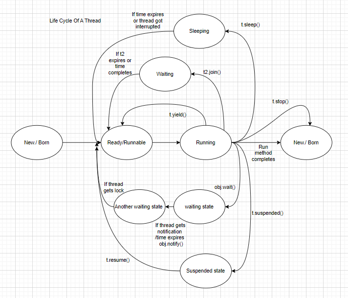

## Multitasking

1. Process Based Multitasking : Exceuting more than one task at a time where each independent of other.

2. Thread Based Multitasking

* Executing the several tasks where each task is part of the same program.

**What is Thread?**

* Thread is a light-weight process. A separate flow of exceution. or Smallest unit of CPU execution.

* Thread is light-weight because thread shared the same memory address space, and It takes less memory and less time to execute the program.

**What is Daemon Thread?**

* The thread which is executing in the background is called Daemon Thread.

* Ex: Garbage Collector , Attach Listener.

Use of Daemon Thread:

## Thread Creation

- We can create Threads in 3 ways

 **1. By extending Thread Class**

        public class MyThread extends Thread{
 
        public void run(){

        for(int i=0;i<10;i++){

        System.out.println ("hello");

        }

        }

        }

        public class Demo {

        public static void main(String[] args) {

         MyThread thread=new MyThread ();

         thread.start ();

         for(int i=0;i<10;i++)
 
         {

         System.out.println ("hi");
         }
         }
         }

**2. By using Runnable interface**

        class MyRunnable implements Runnable{

        @Override
        public void run() {

        for (int i = 0; i < 10; i++) {

        System.out.println ("child Thread");

         }

         }

         }

         public class ThreadDemo {

         public static void main(String[] args) {

         MyRunnable runnable=new MyRunnable ();

         Thread thread=new Thread (runnable);

         thread.start ();

         for(int i=0;i<10;i++){

         System.out.println ("parent thread");

         }

         }

         }

## Working of Thread Pool or Executor Framework

* Creation of a thread is an expensive operation. You want a fixed number of threads say 10 threads , you want to create them upfront let's call it a pool , a pool of threads that's why the name **Thread pool** and let's submit 1000 tasks to them.
* What is the ideal pool size?
* It depends on the type of tasks you want to execute , so let's say you have CPU intensive operations so within the run method you have 
  a particular snippet of code which takes a lot of CPU.
* In Java one thread is equal to one OS thread. So , if you have a CPU with four cores ar a time , you can have only 4 treads running. so that means no matter 
  how many threads you have here  you can have 1000 threads but the idea scenario is to have same no.of threads as your core size of CPU.
* If your task is IO intensive , you can have higher pool size which will depend on the rate of the task submissions that is how fast you want to submit the new task and the average wait time for each task.

         public class ExecutorServices {
         public static void main(String[] args) {
         ExecutorService executorService = Executors.newFixedThreadPool(cores);
         for(int i =0;i<=1000;i++) {
            executorService.execute(new Print1000Numbers());
         }

         executorService.shutdown();
         System.out.println(Duration.between(Instant.now(),now));
         }
         }

         public class Print1000Numbers implements Runnable{
         @Override
         public void run() {
           System.out.println("print");

        }
        }

**3. Executor Framework** 

## Types of Thread Pools
1. FixedThreadPool
2. CachedThreadPool
3. ScheduledThreadPool
4. SingleThreadedExecutor

**FixedThreadPool**

* Suppose there are 100 tasks, and you have created a thread pool with 10 threads , The threads picks the tasks from the blocking queue and the remaining tasks will be in the waiting state in the queue , the threads picks the waiting tasks from the queue once it completes the task.

**CachedThreadPool**

* Here, there is no fixed no.of threads and also queue to hold the tasks instead it is replaced by synchronous queue 
  which only space for a single item.
* It will hold the task in the sync queue , if any thread is free , it will assign the task to the thread, else it will create a new Thread and assigns the task to it.
* If thread is idle for 60 seconds, then it will kill the thread.

**ScheduledThreadPool**

* scheduledExecutorService.scheduleWithFixedDelay(new Print1000Numbers(),10,100, TimeUnit.MILLISECONDS);
* scheduledExecutorService.scheduleAtFixedRate();
* scheduledExecutorService.schedule();

**SingleThreadedExecutor**

* Here the size of the thread pool is only one which fetches all the tasks from the blocking queue and running it. For example if the tasks throws an exception
  and the thread is killed like any other thread pool executor, it will recreate a new thread.
* This type of thread pool is used when you want to ensure that task1 is always run before task2.

## Volatile Keyword
  
    volatile int a = 10;

    t1 t2 t3 
  
    10 40 40
 
    20 50 
 
    30 60
  
    40
* Using volatile force a thread to read and write variables directly from RAM.
* When many threads are using the same volatile variable all of them see the last version that is present in RAM and not a possible old copy in cache.

## Thread Scheduler

1.It is a part of JVM

2.It is responsible to schedule threads. i.e if multiple threads are waiting to get chance of execution ,then in which order threads are ececuted will be decided by Thread Scheduler.

3.We cannot expect the algorithm followed by Thread Scheduler , it is varied from jvm to jvm. Hence we cann ot expect thread exceution order and output.

Difference Between t.run() ,t.start()

In case of t.start() a new thread will be created which is responsible for exceution of run() method

But In case of t.run() a new thread wont be created and run() method will be executed as a normal method.

- -- After starting a thread if we are trying to restart the same thread then we will get run time exception , illegal thread state exception.

**Thread Priorities:**

Every thread in java has some priority. It may be default priority generated by JVM or customized priority given by programmer.

1 is Minimum Priority(Thread.MIN_PRIORITY) , 10 is Maximum Priority(Thread.MAX_PRIORITY) and Normal Priority is 5 (Thread.NORM_PRIORITY)

- - Thread Scheduler will use priorities while allocating processor. The thread which is having highest priority will get chance first.
- -- If two threads having same priority then we cannot expect exact execution order. It depends on thread scheduler.
- -- Thread class defines the following methods to get and set the thread priorities.

      public final int getPriority();

      public final void setPriority(int p) -- allowed values 1 to 10 , otherwise Illegal Argument Exception.

- -- The default priority only for main thread is 5. But for all remaining threads default priority will be inherited from parent to child.
- - We can prevent a thread exceution by using the following methods.

**yield()**

**join()**

**sleep()**

**yield()**

It causes to pause current exceuting thread to give the chance for waiting threads of same priority.

If there is no waiting thread or all waiting threads have low priority then same thread can continue its exceution.

If multiple threads are waiting with same priority then which waiting thread will get the chance we cannot expect.It depends on thread Scheduler.

    public staic native void yield();

join()

If a thread wants to wait until completing some other thread then we should go for join() method.

Foe ex: If a thread t1 wants to wait until completing t2, then t1 has to call t2.join() , if t1 executes t2.join() then immediately t1 will be entered into waiting stating until t2 completes.

public final void join() throws InterruptedException

## Life Cycle Of a Thread

## Synchronization

Synchronized is the modifier applicable only for methods and blocks but not for classes and variables.

If multiple threads are trying to operate simulatenously on the same java object then there may be a chance of data inconsistency problem.

To overcome this problem we shoud use synchronized keyword

If a method is declared is synchronized then at a time only one thread is allowed to execute a method on an object.

Advantage is :we can resolve data inconsistency .

Disadvantage: it increases wait and time of threads. if there is no specific requirement .Then it is not recommended to use synchronized keyword.

- -Internally Synchronization is implemented by using lock.Every object in java has a unique lock.
- - Whenever we are using synchronized keyword lock concept will come into picture.
- - If a thread wants to execute synchronized method on the given object, first it has to get lock of the object, once thread get lock, then it is allowed to

execute any synchronized method on that object.Once method exception completes automatically thread releases lock. Acquiring and releasing lock internally take cares by JVM ,programmer not responsible.

- - While a thread is exceuting on a given object the remaining threads are not allowed to execute any synchronized method simulatenously on the same object but remaining threads are allowed to execute non synchronized methods simulatenously.

        class ReservationSystem{

        checkAvailability(){

        }

        synchronized bookTicket(){ --- because this method is updating the tickets

        }

        }

## Inter Thread Communication:

Two Threads can communicate with each other by using wait(), notify() and notifyAll() methods.

- - The thread which is expecting updation is responsible to call wait() method then immediately the thread will enter into waiting state.
- - The thread which is responsible for updation will call notify() method then waiting thread will get notification and continue its exceution with those updated items.
- - wait(),notify() and notifyAll() are present in Object class but not in Thread class. because thread can call on any java object.

**Difference Between Wait and Sleep method:**

1.wait() is called on an Object while sleep() is called on a Thread

2.wait() method releases the lock when the thread is waiting till some other thread calls notify() method, while sleep() method keeps the lock even if the thread is waiting.

3.wait() can only be called from synchronized block/method otherwise it will throw IllegalMonitorStateException. sleep() can called from any block of code.

4.waiting thread can be awakened by using notify() and notifyAll() methods while sleeping thread cant be awaken.

5.sleep method immediately goes to runnable state after waking up while in case of wait() , waiting thread first fights back for the lock and then goes to Runnable state.

## Future

    Future<Integer> submit1 = executorService.submit(randomNumberGenerator);
    Integer integer1 = submit1.get();

    public class RandomNumberGenerator implements Callable {
    @Override
    public Integer call() throws Exception {
        Thread.sleep(3000);
        Random random = new Random();
        return random.nextInt();
    }
}

## What is CompletableFuture?

* A Completable Future is used for asynchronous programming. Asynchronous programming means writing non-blocking code. It runs a task on a separate thread than the main application thread and notifies the main thread about its progress, completion or failure.

* In this way, the main thread does not block or wait for the completion of the task. Other tasks execute in parallel. Parallelism improves the performance of the program.

* A CompletableFuture is a class in Java. It belongs to java.util.cocurrent package. It implements CompletionStage and Future interface.

* It cannot be manually completed
* Multiple Futures cannot be chained together
* We cannit combine multiple Futures together
* No Proper Exception Handling mechanism.

## runAsync() vs supplyAsync()

* If we want to run some background task asynchronously and **do not want to return anything** from that task, then use CompletableFuture.runAsync() method.It takes Runnable object and returns CompletableFuture<Void>.

* CompletableFuture.runAsync(Runnable)
* CompletableFuture.runAsync(Runnable,Executor)
              
         void runAsyncDemo(){
       
         ExecutorService executorService = Executors.newFixedThreadPool(10);
     
         CompletableFuture.runAsync(new Runnable() {
     
         @Override
         public void run() {
         for(int i=0;i<=100;i++){
         System.out.println(i);
         }
         }
         },executorService);
         }

* If we want to run some background task asynchronously and **want to return anything** from that task, then use CompletableFuture.supplyAsync() method.It takes Supplier<T> object and returns CompletableFuture<T>.

* CompletableFuture.supplyAsync(Supplier<T>)
* CompletableFuture.supplyAsync(Supplier<T>,Executor)

             ExecutorService executorService = Executors.newFixedThreadPool(10);

            CompletableFuture<List<Employee>> listCompletableFuture = 
            CompletableFuture.supplyAsync(() -> {

            List<Employee> all = employeeRepository.findAll();

            return DepartmentRepository.getDetails(all.get(0).getEmpId(), all.get(0).getName());

           ,executorService});
        
           try {
            listCompletableFuture.get();
          } 
          catch (InterruptedException e) {
            throw new RuntimeException(e);
         } 

**thenApply(), thenAccept, thenRun()**

**thenAccept():**

* This method takes a Consumer functional interface as an argument and specifies an action to be performed with the result of the CompletableFuture when it completes. It returns a new CompletableFuture that completes when the action is finished. The Consumer accepts the result of the CompletableFuture but doesn't produce any output.

         public class EmployeeRemainderService {
         public CompletableFuture<Void> sendRemainder(){

         CompletableFuture<Void> voidCompletableFuture = 
                 
        CompletableFuture.supplyAsync(() -> {
        System.out.println("fetch data" + Thread.currentThread().getName());
        return EmployeeRep.fetchEmployees();
        }).thenApply((employees) -> {
        System.out.println("filtering data" + Thread.currentThread().getName());
        return employees.stream().filter(employee -> "TRUE".equals(employee.getNewJoiner()))
       .collect(Collectors.toList());
        }).thenApply((newjoiners) -> {
        System.out.println("filtering learning pending data" + Thread.currentThread().getName());
        return newjoiners.stream().filter(newemp -> newemp.getLearningPending().equals("TRUE"))
        .collect(Collectors.toList());
        }).thenApply((emp) -> {
        System.out.println("get email ids " + Thread.currentThread().getName());
        return emp.stream().map(Employee::getEmail).collect(Collectors.toList());
        })
       .thenAccept((emails) -> {
       System.out.println("get email " + Thread.currentThread().getName());
       emails.forEach(EmployeeRemainderService::sendEmail);
        });
        return voidCompletableFuture;
        }

       public static  void sendEmail(String email){
        System.out.println("sending training remainder to :"+email);
       }

       public static void main(String[] args) throws ExecutionException, InterruptedException {
       EmployeeRemainderService employeeRemainderService = new EmployeeRemainderService();
       employeeRemainderService.sendRemainder().get();
       }
       }

**thenRun():**

* This method takes a Runnable functional interface as an argument and specifies an action to be performed after the completion of the CompletableFuture, regardless of its result. It returns a new CompletableFuture that completes when the action is finished.

     
         ExecutorService service = Executors.newFixedThreadPool(10);   
         CompletableFuture<Void> voidCompletableFuture1 =
      
         CompletableFuture.supplyAsync(() -> {
         System.out.println("fetch data" + Thread.currentThread().getName());
         return EmployeeRep.fetchEmployees();
         },service).thenApplyAsync((employees) -> {
         System.out.println("filtering data" + Thread.currentThread().getName());
         return employees.stream().filter(employee -> "TRUE".equals(employee.getNewJoiner()))
         .collect(Collectors.toList());
         },service).thenApplyAsync((newjoiners) -> {
         System.out.println("filtering learning pending data" + Thread.currentThread().getName());
         return newjoiners.stream().filter(newemp -> newemp.getLearningPending().equals("TRUE"))
         .collect(Collectors.toList());
         },service).thenApplyAsync((emp) -> {
         System.out.println("get email ids " + Thread.currentThread().getName());
         return emp.stream().map(Employee::getEmail).collect(Collectors.toList());
         },service)
         .thenRunAsync(() -> {
         System.out.println("got all new joiner emails");
         },service);           

## Seamphore

* It is a class in java.util.concurrent package.
* Semaphores are generally used to restrict the  number of threads to access resources.
* Semaphore basically maintains a set of permits through the use of counter.
* To access the resource, a thread must be granted a permit from the semaphore.
* If the counter is greater than zero, then access is allowed. If it zero, access is denied.
* If the semaphore count is greater than zero, then the thread acquires a permit to access a resource which decreases the counter value.
* otherwise the thread is blocked until the permit is granted.
* A thread releases the permit when the thread no longer requires the access to the resource and there by increasing the counter.
* If a thread is waiting for the permit it will acquire the permit and continue its execution.

**Examples of Semaphore**
1.Restricting no.of connections to db.
2.Bounding a collection.

