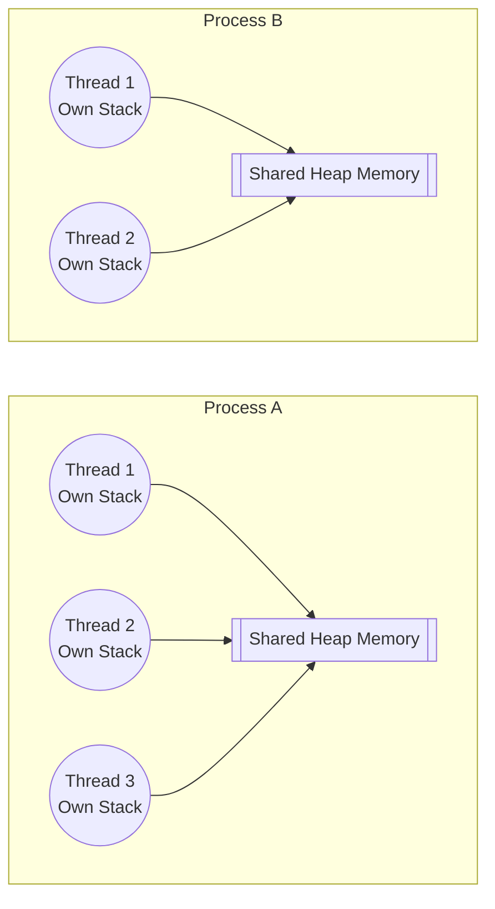
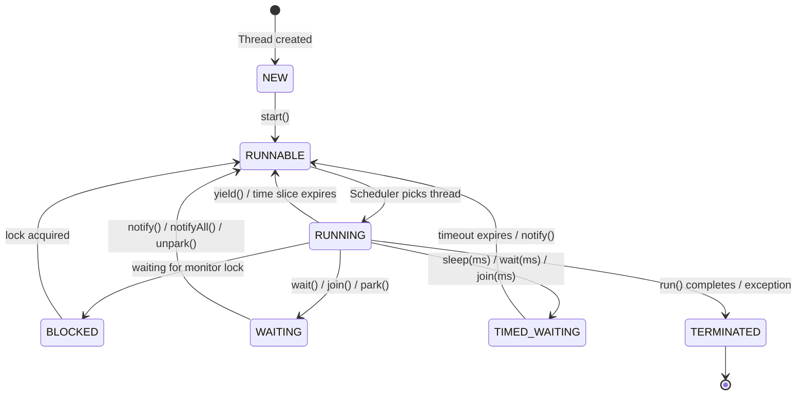
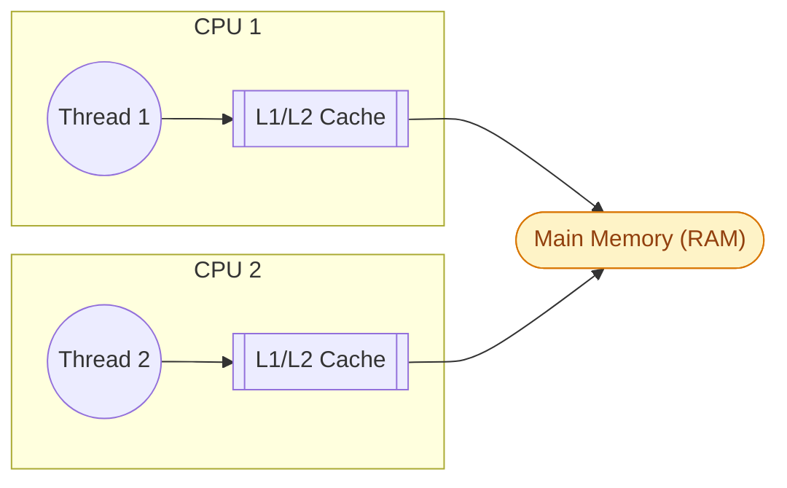
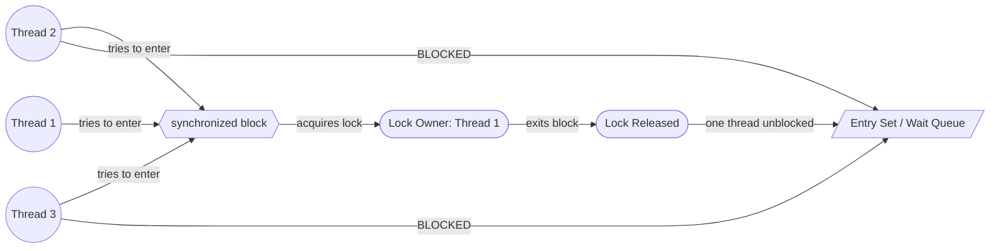
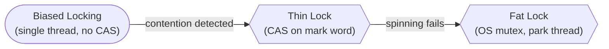
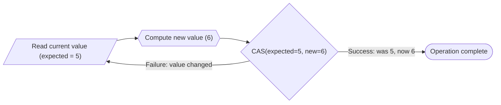
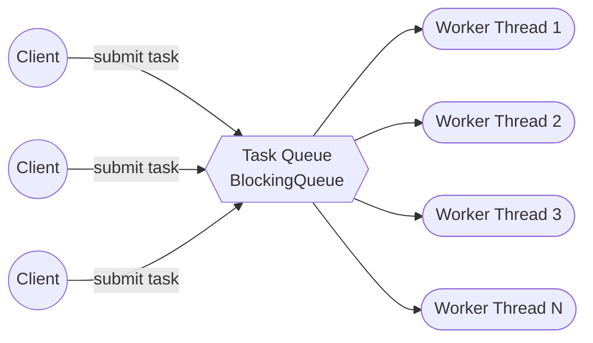
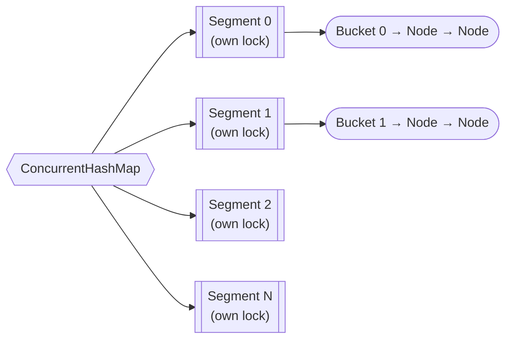
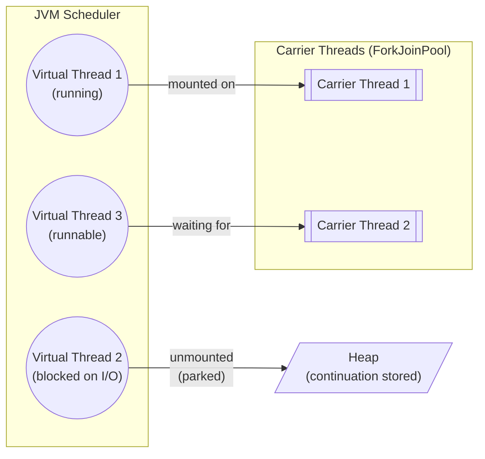

# Multithreading in Java

Multithreading is the foundation of concurrent programming in Java. It allows multiple tasks to execute simultaneously within a single process, enabling efficient CPU utilization, responsive applications, and high-throughput systems.

---

## Process vs Thread

A **process** is an independent program with its own memory space. A **thread** is the smallest unit of CPU execution that runs within a process and shares its memory.


```mermaid
flowchart LR
    subgraph Process A
        direction LR
        A_HEAP[["Shared Heap Memory"]]
        A_T1(("Thread 1<br/>Own Stack"))
        A_T2(("Thread 2<br/>Own Stack"))
        A_T3(("Thread 3<br/>Own Stack"))
        A_T1 --> A_HEAP
        A_T2 --> A_HEAP
        A_T3 --> A_HEAP
    end
    subgraph Process B
        direction LR
        B_HEAP[["Shared Heap Memory"]]
        B_T1(("Thread 1<br/>Own Stack"))
        B_T2(("Thread 2<br/>Own Stack"))
        B_T1 --> B_HEAP
        B_T2 --> B_HEAP
    end
```

| Aspect | Process | Thread |
|---|---|---|
| Memory | Separate address space | Shares heap, has own stack |
| Creation cost | Expensive (OS-level) | Lightweight (within JVM) |
| Communication | IPC (pipes, sockets) | Direct shared memory access |
| Isolation | Crash doesn't affect others | Crash can bring down the process |
| Context switch | Slow (full memory swap) | Fast (only stack + registers) |

---

## Thread Creation

### 1. Extending Thread Class

```java
public class DownloadThread extends Thread {
    private final String url;

    public DownloadThread(String url) {
        this.url = url;
    }

    @Override
    public void run() {
        System.out.println(Thread.currentThread().getName() + " downloading: " + url);
    }
}

DownloadThread thread = new DownloadThread("https://example.com/file.zip");
thread.start();
```

### 2. Implementing Runnable (Preferred)

```java
public class DownloadTask implements Runnable {
    private final String url;

    public DownloadTask(String url) {
        this.url = url;
    }

    @Override
    public void run() {
        System.out.println(Thread.currentThread().getName() + " downloading: " + url);
    }
}

Thread thread = new Thread(new DownloadTask("https://example.com/file.zip"));
thread.start();

// Lambda style (Java 8+)
Thread thread = new Thread(() -> System.out.println("Running in: " + Thread.currentThread().getName()));
thread.start();
```

### 3. Callable + Future (Returns a Result)

```java
public class PriceCalculator implements Callable<Double> {
    private final String ticker;

    public PriceCalculator(String ticker) {
        this.ticker = ticker;
    }

    @Override
    public Double call() throws Exception {
        Thread.sleep(1000);
        return Math.random() * 1000;
    }
}

ExecutorService executor = Executors.newFixedThreadPool(4);
Future<Double> future = executor.submit(new PriceCalculator("GOOG"));
Double price = future.get();  // blocks until result is available
executor.shutdown();
```

### Thread vs Runnable vs Callable

| Feature | Thread | Runnable | Callable |
|---|---|---|---|
| Return value | No | No | Yes (`Future<T>`) |
| Checked exceptions | No | No | Yes |
| Inheritance | Extends Thread (uses up single inheritance) | Implements interface | Implements interface |
| Reusability | Low | High | High |
| Use with thread pools | No | Yes | Yes |

---

## Thread Lifecycle


```mermaid
stateDiagram-v2
    [*] --> NEW : Thread created
    NEW --> RUNNABLE : start()
    RUNNABLE --> RUNNING : Scheduler picks thread
    RUNNING --> RUNNABLE : yield() / time slice expires
    RUNNING --> BLOCKED : waiting for monitor lock
    RUNNING --> WAITING : wait() / join() / park()
    RUNNING --> TIMED_WAITING : sleep(ms) / wait(ms) / join(ms)
    BLOCKED --> RUNNABLE : lock acquired
    WAITING --> RUNNABLE : notify() / notifyAll() / unpark()
    TIMED_WAITING --> RUNNABLE : timeout expires / notify()
    RUNNING --> TERMINATED : run() completes / exception
    TERMINATED --> [*]
```

| State | Description | How to enter |
|---|---|---|
| `NEW` | Thread object created, not yet started | `new Thread(runnable)` |
| `RUNNABLE` | Ready to run, waiting for CPU time | `start()`, or lock acquired |
| `RUNNING` | Currently executing on CPU | Scheduler assigns CPU |
| `BLOCKED` | Waiting to acquire a monitor lock | Entering `synchronized` block |
| `WAITING` | Waiting indefinitely for another thread | `wait()`, `join()`, `LockSupport.park()` |
| `TIMED_WAITING` | Waiting with a timeout | `sleep(ms)`, `wait(ms)`, `join(ms)` |
| `TERMINATED` | Execution complete | `run()` returns or throws exception |

---

## Essential Thread Methods

### start() vs run()

```java
Thread t = new Thread(() -> System.out.println("Running in: " + Thread.currentThread().getName()));

t.start();  // Creates a NEW thread, executes run() in that thread
t.run();    // Does NOT create a new thread — runs in caller's thread
```

Calling `start()` twice on the same thread throws `IllegalThreadStateException`.

### sleep() — Pause Execution

```java
try {
    Thread.sleep(2000);
} catch (InterruptedException e) {
    Thread.currentThread().interrupt();  // Restore interrupt flag
}
```

- Does NOT release any locks held by the thread
- Throws `InterruptedException` if another thread interrupts it

### join() — Wait for Another Thread

```java
Thread worker = new Thread(() -> computeResult());
worker.start();
worker.join();  // Current thread waits until worker finishes
```

### interrupt() — Cooperative Cancellation

```java
Thread worker = new Thread(() -> {
    while (!Thread.currentThread().isInterrupted()) {
        try {
            Thread.sleep(100);
        } catch (InterruptedException e) {
            Thread.currentThread().interrupt();
            break;
        }
    }
});
worker.start();
worker.interrupt();  // Request cancellation — sets flag
```

- Does NOT forcefully stop a thread — it sets a flag
- Blocking methods (`sleep`, `wait`, `join`) throw `InterruptedException` when interrupted

### Daemon Threads

```java
Thread daemon = new Thread(() -> {
    while (true) {
        cleanupExpiredSessions();
        Thread.sleep(60_000);
    }
});
daemon.setDaemon(true);  // Must be set BEFORE start()
daemon.start();
```

- Daemon threads do NOT prevent JVM shutdown
- When all non-daemon threads finish, JVM exits (killing daemons abruptly)
- Examples: GC, signal handlers, monitoring threads

---

## Java Memory Model (JMM)

The JMM defines how threads interact through memory and what guarantees the JVM provides about visibility and ordering of operations.

### The Problem: Why We Need a Memory Model


```mermaid
flowchart LR
    subgraph "CPU 1"
        direction LR
        T1(("Thread 1"))
        C1[["L1/L2 Cache"]]
        T1 --> C1
    end
    subgraph "CPU 2"
        direction LR
        T2(("Thread 2"))
        C2[["L1/L2 Cache"]]
        T2 --> C2
    end
    C1 --> RAM(["Main Memory (RAM)"])
    C2 --> RAM

    style RAM fill:#FEF3C7,stroke:#D97706,color:#92400E
```

Each CPU core has its own cache. Without explicit synchronization, Thread 1's writes may never be visible to Thread 2 — they stay in CPU 1's cache. The JMM specifies **happens-before** rules that guarantee visibility.

### Happens-Before Relationships

If action A **happens-before** action B, then A's effects are guaranteed visible to B. Key rules:

| Rule | Guarantees |
|---|---|
| **Program Order** | Each action in a thread happens-before every subsequent action in that thread |
| **Monitor Lock** | An unlock on a monitor happens-before every subsequent lock on that monitor |
| **Volatile Variable** | A write to volatile happens-before every subsequent read of that volatile |
| **Thread Start** | `thread.start()` happens-before any action in the started thread |
| **Thread Join** | All actions in a thread happen-before `join()` returns |
| **Transitivity** | If A happens-before B, and B happens-before C, then A happens-before C |

### Visibility Without Happens-Before

```java
// Thread 1                       // Thread 2
flag = true;                      while (!flag) { }  // May loop forever!
data = 42;                        print(data);       // May print 0!
```

Without `volatile` or synchronization, Thread 2 might never see `flag = true` (stale cache) and even if it does, `data` might still be 0 (reordering).

### Instruction Reordering

The JVM and CPU reorder instructions for performance. The JMM permits reordering as long as **single-threaded semantics** are preserved — but this breaks multi-threaded expectations:

```java
// Source code             // After reordering (legal for single thread)
x = 1;                    y = 2;  // moved up!
y = 2;                    x = 1;
```

Memory barriers (fences) prevent reordering across them. `synchronized`, `volatile`, and `java.util.concurrent` classes insert appropriate barriers.

### Memory Barrier Types

| Barrier | Prevents |
|---|---|
| **LoadLoad** | Reordering of two reads |
| **StoreStore** | Reordering of two writes |
| **LoadStore** | A read being reordered after a write |
| **StoreLoad** | A write being reordered after a read (most expensive — full fence) |

A `volatile` write inserts StoreStore + StoreLoad barriers. A `volatile` read inserts LoadLoad + LoadStore barriers.

---

## volatile Keyword — Deep Dive

`volatile` provides visibility and ordering guarantees but NOT atomicity.

### What volatile Guarantees

```java
private volatile boolean shutdownRequested = false;

// Thread 1 (writer)
shutdownRequested = true;  // StoreStore + StoreLoad barrier after write

// Thread 2 (reader)
while (!shutdownRequested) {  // LoadLoad + LoadStore barrier before read
    doWork();
}
// Guaranteed to see the write from Thread 1
```

### What volatile Does NOT Guarantee

```java
private volatile int counter = 0;

// Thread 1                    // Thread 2
counter++;                     counter++;

// counter++ is: read → increment → write (3 operations)
// volatile makes each individual read/write visible, but the compound
// operation is NOT atomic. Final counter could be 1, not 2.
```

### When to Use volatile

| Use Case | volatile Works? |
|---|---|
| Simple boolean flag (one writer, many readers) | Yes |
| Status/state field read by multiple threads | Yes |
| Counter incremented by multiple threads | No — use `AtomicInteger` |
| Double-checked locking singleton | Yes (on the instance field) |
| Publishing an immutable object | Yes |

### Double-Checked Locking (Correct Version)

```java
public class Singleton {
    private static volatile Singleton instance;  // volatile is critical here

    public static Singleton getInstance() {
        if (instance == null) {                   // first check (no lock)
            synchronized (Singleton.class) {
                if (instance == null) {           // second check (with lock)
                    instance = new Singleton();   // without volatile, partially
                }                                 // constructed object may be visible
            }
        }
        return instance;
    }
}
```

Without `volatile`, the write to `instance` can be reordered before the constructor completes — other threads see a non-null but partially constructed object.

---

## Synchronization Internals

### How Intrinsic Locks (Monitors) Work


```mermaid
flowchart LR
    T1(("Thread 1")) -->|tries to enter| SYNC{{"synchronized block"}}
    T2(("Thread 2")) -->|tries to enter| SYNC
    T3(("Thread 3")) -->|tries to enter| SYNC
    SYNC -->|acquires lock| OWNER(["Lock Owner: Thread 1"])
    T2 -->|BLOCKED| QUEUE[/"Entry Set / Wait Queue"/]
    T3 -->|BLOCKED| QUEUE
    OWNER -->|exits block| RELEASE(["Lock Released"])
    RELEASE -->|one thread unblocked| QUEUE
```

- Every Java object has an **intrinsic lock** (monitor)
- `synchronized` acquires the lock on entry, releases on exit (even if exception thrown)
- Static synchronized methods lock on the **Class object** (`ClassName.class`)
- Intrinsic locks are **reentrant** — a thread can re-acquire a lock it already holds

### Lock Optimization in the JVM (HotSpot)

The JVM applies progressive lock optimization:


```mermaid
flowchart LR
    B(["Biased Locking<br/>(single thread, no CAS)"]) -->|contention detected| T{{"Thin Lock<br/>(CAS on mark word)"}}
    T -->|spinning fails| F{{"Fat Lock<br/>(OS mutex, park thread)"}}
```

| Level | Mechanism | When | Cost |
|---|---|---|---|
| **Biased Lock** | Mark word stores owner thread ID. No atomic ops on reentry. | Single thread accesses repeatedly | Near zero |
| **Thin Lock** (lightweight) | CAS on object's mark word | Low contention, short critical sections | CAS per lock/unlock |
| **Fat Lock** (heavyweight) | OS-level mutex (`pthread_mutex`) + thread parking | High contention, long critical sections | Context switch |
| **Lock Coarsening** | JVM merges adjacent synchronized blocks on same lock | Detected pattern | Reduces lock/unlock overhead |
| **Lock Elision** | JVM removes lock entirely via escape analysis | Object doesn't escape thread | Zero |

### Block-Level Synchronization

```java
public class BankAccount {
    private double balance;
    private final Object lock = new Object();

    public void deposit(double amount) {
        synchronized (lock) {
            balance += amount;
        }
        notifyObservers();  // outside lock — better throughput
    }
}
```

---

## wait(), notify(), notifyAll()

### Rules

- Must be called from within a `synchronized` block (thread must hold the monitor)
- `wait()` releases the lock and enters WAITING state
- `notify()` wakes one waiting thread; `notifyAll()` wakes all
- Waiting thread must re-acquire the lock before resuming

### Producer-Consumer Pattern

```java
public class BoundedBuffer<T> {
    private final Queue<T> queue = new LinkedList<>();
    private final int capacity;

    public BoundedBuffer(int capacity) {
        this.capacity = capacity;
    }

    public synchronized void produce(T item) throws InterruptedException {
        while (queue.size() == capacity) {
            wait();  // Buffer full — release lock and wait
        }
        queue.add(item);
        notifyAll();  // Wake up consumers
    }

    public synchronized T consume() throws InterruptedException {
        while (queue.isEmpty()) {
            wait();  // Buffer empty — release lock and wait
        }
        T item = queue.poll();
        notifyAll();  // Wake up producers
        return item;
    }
}
```

**Why `while` and not `if`?** Spurious wakeups can occur — the JVM spec permits a thread to wake from `wait()` without being notified. Always re-check the condition.

### wait() vs sleep()

| Aspect | `wait()` | `sleep()` |
|---|---|---|
| Called on | Object (monitor) | Thread (static method) |
| Releases lock | Yes | No |
| Wakeup | `notify()` / `notifyAll()` | Timeout expires |
| Must be in synchronized | Yes | No |
| Purpose | Inter-thread communication | Pause execution |

---

## ReentrantLock — Beyond synchronized

`ReentrantLock` provides the same mutual exclusion as `synchronized` but with additional capabilities.

### Key Advantages Over synchronized

| Feature | synchronized | ReentrantLock |
|---|---|---|
| Try without blocking | No | `tryLock()` |
| Timeout on lock attempt | No | `tryLock(timeout, unit)` |
| Interruptible waiting | No | `lockInterruptibly()` |
| Fairness policy | No (always unfair) | `new ReentrantLock(true)` |
| Multiple conditions | One wait set per monitor | Multiple `Condition` objects |
| Non-block-structured | No | Yes (lock/unlock in different methods) |

### Usage Pattern

```java
private final ReentrantLock lock = new ReentrantLock();

public void transfer(Account from, Account to, double amount) {
    lock.lock();
    try {
        from.debit(amount);
        to.credit(amount);
    } finally {
        lock.unlock();  // ALWAYS in finally — prevents lock leak on exception
    }
}
```

### tryLock — Deadlock Avoidance

```java
public boolean transferWithTimeout(Account from, Account to, double amount) 
        throws InterruptedException {
    if (from.lock.tryLock(1, TimeUnit.SECONDS)) {
        try {
            if (to.lock.tryLock(1, TimeUnit.SECONDS)) {
                try {
                    from.debit(amount);
                    to.credit(amount);
                    return true;
                } finally {
                    to.lock.unlock();
                }
            }
        } finally {
            from.lock.unlock();
        }
    }
    return false;  // Could not acquire both locks — caller retries
}
```

### Condition Variables — Multiple Wait Sets

```java
private final ReentrantLock lock = new ReentrantLock();
private final Condition notFull = lock.newCondition();
private final Condition notEmpty = lock.newCondition();

public void produce(T item) throws InterruptedException {
    lock.lock();
    try {
        while (count == capacity) notFull.await();
        enqueue(item);
        notEmpty.signal();  // Only wake consumers, not other producers
    } finally {
        lock.unlock();
    }
}

public T consume() throws InterruptedException {
    lock.lock();
    try {
        while (count == 0) notEmpty.await();
        T item = dequeue();
        notFull.signal();  // Only wake producers
        return item;
    } finally {
        lock.unlock();
    }
}
```

### ReadWriteLock — Reader/Writer Optimization

```java
private final ReadWriteLock rwLock = new ReentrantReadWriteLock();
private final Map<String, Object> cache = new HashMap<>();

public Object get(String key) {
    rwLock.readLock().lock();  // Multiple readers can hold simultaneously
    try {
        return cache.get(key);
    } finally {
        rwLock.readLock().unlock();
    }
}

public void put(String key, Object value) {
    rwLock.writeLock().lock();  // Exclusive — blocks all readers and writers
    try {
        cache.put(key, value);
    } finally {
        rwLock.writeLock().unlock();
    }
}
```

### StampedLock (Java 8) — Optimistic Reads

```java
private final StampedLock sl = new StampedLock();
private double x, y;

public double distanceFromOrigin() {
    long stamp = sl.tryOptimisticRead();  // No lock acquired — just a stamp
    double currentX = x, currentY = y;
    if (!sl.validate(stamp)) {  // Check if a write occurred meanwhile
        stamp = sl.readLock();  // Fall back to pessimistic read
        try {
            currentX = x;
            currentY = y;
        } finally {
            sl.unlockRead(stamp);
        }
    }
    return Math.sqrt(currentX * currentX + currentY * currentY);
}
```

StampedLock is NOT reentrant — do not use in recursive code.

---

## Atomic Variables & CAS

### Compare-And-Swap (CAS) — The Foundation

CAS is a CPU-level atomic instruction: "If the value at address X is currently V, set it to N. Return whether it succeeded."


```mermaid
flowchart LR
    READ[/"Read current value (expected = 5)"/] --> COMPUTE{{"Compute new value (6)"}}
    COMPUTE --> CAS{"CAS(expected=5, new=6)"}
    CAS -->|Success: was 5, now 6| DONE(["Operation complete"])
    CAS -->|Failure: value changed| READ
```

### AtomicInteger Internals

```java
// What AtomicInteger.incrementAndGet() does internally:
public final int incrementAndGet() {
    int prev, next;
    do {
        prev = get();              // volatile read
        next = prev + 1;
    } while (!compareAndSet(prev, next));  // CAS retry loop
    return next;
}
```

### Atomic Classes

| Class | Use Case |
|---|---|
| `AtomicInteger` / `AtomicLong` | Lock-free counters |
| `AtomicBoolean` | Lock-free flags |
| `AtomicReference<V>` | Lock-free object reference updates |
| `AtomicStampedReference<V>` | Solves ABA problem (tracks version stamp) |
| `AtomicIntegerArray` | Lock-free array element updates |
| `LongAdder` (Java 8) | High-contention counters (striped cells) |
| `LongAccumulator` | Custom accumulation function |

### LongAdder vs AtomicLong — High Contention

```java
// AtomicLong: all threads CAS on single variable — high contention, many retries
private final AtomicLong counter = new AtomicLong();

// LongAdder: internally striped across cells — threads update different cells
// sum() aggregates all cells (slightly higher read cost, much lower write contention)
private final LongAdder counter = new LongAdder();
counter.increment();      // write — distributed across cells
counter.sum();            // read — aggregates (eventual consistency for reads)
```

Use `LongAdder` when updates are far more frequent than reads (metrics, counters). Use `AtomicLong` when you need precise real-time reads.

### The ABA Problem

```
Thread 1: reads value A
Thread 2: changes A → B → A
Thread 1: CAS succeeds (value is still A) — but state has changed!
```

Solution: `AtomicStampedReference` pairs value with a version stamp — CAS checks both.

```java
AtomicStampedReference<Node> head = new AtomicStampedReference<>(node, 0);

int[] stampHolder = new int[1];
Node current = head.get(stampHolder);
int stamp = stampHolder[0];

head.compareAndSet(current, newNode, stamp, stamp + 1);
```

---

## Thread Pools and ExecutorService

### Thread Pool Architecture


```mermaid
flowchart LR
    TASKS{{"Task Queue<br/>BlockingQueue"}} --> T1(["Worker Thread 1"])
    TASKS --> T2(["Worker Thread 2"])
    TASKS --> T3(["Worker Thread 3"])
    TASKS --> TN(["Worker Thread N"])
    CLIENT1(("Client")) -->|submit task| TASKS
    CLIENT2(("Client")) -->|submit task| TASKS
    CLIENT3(("Client")) -->|submit task| TASKS
```

### Types of Thread Pools

| Thread Pool | Core | Max | Queue | Best For |
|---|---|---|---|---|
| `FixedThreadPool` | N | N | Unbounded `LinkedBlockingQueue` | CPU-bound with known load |
| `CachedThreadPool` | 0 | Integer.MAX_VALUE | `SynchronousQueue` | Many short-lived I/O tasks |
| `ScheduledThreadPool` | N | Integer.MAX_VALUE | `DelayedWorkQueue` | Periodic/delayed tasks |
| `SingleThreadExecutor` | 1 | 1 | Unbounded `LinkedBlockingQueue` | Sequential ordering |
| `ForkJoinPool` | N (processors) | N | Per-thread work queues | Recursive divide-and-conquer |

### ThreadPoolExecutor — Full Control

```java
ThreadPoolExecutor executor = new ThreadPoolExecutor(
    4,                              // corePoolSize
    16,                             // maximumPoolSize
    60L, TimeUnit.SECONDS,          // keepAliveTime for idle threads > core
    new ArrayBlockingQueue<>(1000), // bounded queue — backpressure!
    new ThreadFactory() {           // custom thread naming
        private final AtomicInteger count = new AtomicInteger();
        public Thread newThread(Runnable r) {
            Thread t = new Thread(r, "order-processor-" + count.incrementAndGet());
            t.setDaemon(false);
            return t;
        }
    },
    new ThreadPoolExecutor.CallerRunsPolicy()  // rejection policy
);
```

### Rejection Policies (When Queue is Full)

| Policy | Behavior | Use Case |
|---|---|---|
| `AbortPolicy` (default) | Throws `RejectedExecutionException` | Fail-fast systems |
| `CallerRunsPolicy` | Caller thread executes the task | Backpressure (slows producer) |
| `DiscardPolicy` | Silently drops task | Fire-and-forget metrics |
| `DiscardOldestPolicy` | Drops oldest queued task, retries | Latest-value-wins scenarios |

### Ideal Pool Size

- **CPU-bound**: `threads = CPU cores` (more = context-switching waste)
- **I/O-bound**: `threads = cores × (1 + waitTime / computeTime)` — typically 2x-10x cores
- **Mixed**: Separate pools for CPU-bound and I/O-bound work

### ForkJoinPool — Work-Stealing

```java
public class MergeSortTask extends RecursiveAction {
    private final int[] array;
    private final int left, right;
    private static final int THRESHOLD = 1024;

    @Override
    protected void compute() {
        if (right - left < THRESHOLD) {
            Arrays.sort(array, left, right);
            return;
        }
        int mid = (left + right) / 2;
        invokeAll(
            new MergeSortTask(array, left, mid),
            new MergeSortTask(array, mid, right)
        );
        merge(array, left, mid, right);
    }
}

ForkJoinPool pool = new ForkJoinPool();
pool.invoke(new MergeSortTask(array, 0, array.length));
```

Work-stealing: idle threads steal tasks from busy threads' queues — improves utilization for unbalanced workloads.

---

## java.util.concurrent Synchronizers

### CountDownLatch — Wait for N Events

```java
int serviceCount = 5;
CountDownLatch latch = new CountDownLatch(serviceCount);

for (int i = 0; i < serviceCount; i++) {
    executor.submit(() -> {
        try {
            initializeService();
        } finally {
            latch.countDown();  // Decrement count
        }
    });
}

latch.await(30, TimeUnit.SECONDS);  // Block until count reaches 0
// All services initialized — start accepting requests
```

One-shot only — cannot be reset.

### CyclicBarrier — Reusable Rendezvous Point

```java
int threadCount = 4;
CyclicBarrier barrier = new CyclicBarrier(threadCount, () -> {
    mergePartialResults();  // Runs when all threads arrive
});

for (int i = 0; i < threadCount; i++) {
    final int partition = i;
    executor.submit(() -> {
        while (hasMoreData()) {
            processPartition(partition);
            barrier.await();  // Wait for all threads to finish this phase
            // barrier resets — ready for next phase
        }
    });
}
```

| Aspect | CountDownLatch | CyclicBarrier |
|---|---|---|
| Reusable | No (one-shot) | Yes (resets after each trip) |
| Wait condition | Count reaches 0 | All parties arrive |
| Threads that wait | Any thread calls `await()` | Participating threads only |
| Use case | Wait for external events | Multi-phase parallel computation |

### Semaphore — Resource Limiting

```java
// Connection pool with max 10 concurrent connections
Semaphore semaphore = new Semaphore(10, true);  // fair = true

public Connection getConnection() throws InterruptedException {
    semaphore.acquire();  // blocks if 10 connections already in use
    try {
        return pool.borrowConnection();
    } catch (Exception e) {
        semaphore.release();
        throw e;
    }
}

public void releaseConnection(Connection conn) {
    pool.returnConnection(conn);
    semaphore.release();  // permit becomes available
}
```

### Phaser — Flexible Multi-Phase Synchronization

```java
Phaser phaser = new Phaser(1);  // register self

for (int i = 0; i < workerCount; i++) {
    phaser.register();  // dynamic registration
    executor.submit(() -> {
        // Phase 0: load data
        loadData();
        phaser.arriveAndAwaitAdvance();

        // Phase 1: process
        process();
        phaser.arriveAndAwaitAdvance();

        // Phase 2: write results
        writeResults();
        phaser.arriveAndDeregister();  // done — leave the phaser
    });
}

phaser.arriveAndDeregister();  // deregister self
```

Phaser supports dynamic party count (register/deregister at any time) — CountDownLatch and CyclicBarrier do not.

### Exchanger — Two-Thread Rendezvous

```java
Exchanger<List<Order>> exchanger = new Exchanger<>();

// Producer thread
List<Order> buffer = new ArrayList<>();
while (running) {
    buffer.add(fetchOrder());
    if (buffer.size() >= BATCH_SIZE) {
        buffer = exchanger.exchange(buffer);  // swap full buffer for empty one
        buffer.clear();
    }
}

// Consumer thread
List<Order> buffer = new ArrayList<>();
while (running) {
    buffer = exchanger.exchange(buffer);  // swap empty buffer for full one
    processBatch(buffer);
}
```

---

## Concurrent Collections

### ConcurrentHashMap Internals


```mermaid
flowchart LR
    CHM{{"ConcurrentHashMap"}}
    CHM --> S0[["Segment 0<br/>(own lock)"]]
    CHM --> S1[["Segment 1<br/>(own lock)"]]
    CHM --> S2[["Segment 2<br/>(own lock)"]]
    CHM --> SN[["Segment N<br/>(own lock)"]]
    S0 --> B0(["Bucket 0 → Node → Node"])
    S1 --> B1(["Bucket 1 → Node → Node"])
```

**Java 8+**: No longer uses segments. Uses per-bucket CAS + `synchronized` on the head node of each bucket. Reads are lock-free (volatile reads of nodes).

| Collection | Thread Safety | Performance Profile |
|---|---|---|
| `ConcurrentHashMap` | Lock striping (per-bucket) | High concurrent throughput for reads + writes |
| `CopyOnWriteArrayList` | Copy entire array on write | Excellent reads, expensive writes |
| `ConcurrentLinkedQueue` | Lock-free (CAS) | Non-blocking FIFO |
| `BlockingQueue` (various) | Lock-based | Producer-consumer with backpressure |
| `ConcurrentSkipListMap` | Lock-free | Sorted concurrent map (O(log n)) |

### BlockingQueue Implementations

| Implementation | Bound | Ordering | Use Case |
|---|---|---|---|
| `ArrayBlockingQueue` | Bounded | FIFO | Fixed-size producer-consumer |
| `LinkedBlockingQueue` | Optional bound | FIFO | General purpose (unbounded by default) |
| `PriorityBlockingQueue` | Unbounded | Priority | Task scheduling by priority |
| `SynchronousQueue` | Zero capacity | Direct handoff | Thread-to-thread handoff (CachedThreadPool) |
| `DelayQueue` | Unbounded | By delay expiry | Scheduled tasks, TTL-based expiry |
| `LinkedTransferQueue` | Unbounded | FIFO | High-performance async messaging |

### CopyOnWriteArrayList — When to Use

```java
// Excellent for: listeners, event handlers, configuration (read >> write)
private final CopyOnWriteArrayList<EventListener> listeners = new CopyOnWriteArrayList<>();

public void addListener(EventListener l) { listeners.add(l); }  // copies entire array

public void fireEvent(Event e) {
    for (EventListener l : listeners) {  // no lock needed — iterates snapshot
        l.onEvent(e);
    }
}
```

Trade-off: O(n) writes (copy array), O(1) lock-free reads. Use only when reads vastly outnumber writes.

---

## CompletableFuture — Async Composition

### Creation Patterns

```java
// Run async, no return value
CompletableFuture<Void> cf = CompletableFuture.runAsync(() -> sendEmail());

// Run async, return value
CompletableFuture<User> cf = CompletableFuture.supplyAsync(() -> fetchUser(id));

// With custom executor
CompletableFuture<User> cf = CompletableFuture.supplyAsync(
    () -> fetchUser(id), ioExecutor
);
```

### Chaining and Composition

```java
CompletableFuture<OrderConfirmation> pipeline = 
    CompletableFuture.supplyAsync(() -> validateOrder(order))
        .thenApply(valid -> enrichOrder(valid))          // sync transform
        .thenCompose(enriched -> chargePayment(enriched)) // async flatMap
        .thenApply(charged -> createConfirmation(charged))
        .exceptionally(ex -> handleFailure(ex));
```

| Method | Input | Output | Async? |
|---|---|---|---|
| `thenApply(fn)` | T → U | `CF<U>` | No |
| `thenCompose(fn)` | T → `CF<U>` | `CF<U>` | Yes (flatMap) |
| `thenCombine(other, fn)` | (T, U) → V | `CF<V>` | Combine two futures |
| `thenAccept(consumer)` | T → void | `CF<Void>` | No |
| `thenRun(runnable)` | — | `CF<Void>` | No |
| `exceptionally(fn)` | Throwable → T | `CF<T>` | Recovery |
| `handle(fn)` | (T, Throwable) → U | `CF<U>` | Both success/failure |

### Combining Multiple Futures

```java
// Wait for ALL to complete
CompletableFuture<Void> allOf = CompletableFuture.allOf(
    fetchUser(id),
    fetchOrders(id),
    fetchRecommendations(id)
);

// Wait for FIRST to complete (racing)
CompletableFuture<Object> anyOf = CompletableFuture.anyOf(
    callServiceA(),
    callServiceB()  // hedged request
);
```

### Production Pattern: Timeout + Fallback

```java
CompletableFuture<Price> price = CompletableFuture
    .supplyAsync(() -> callPricingService(item))
    .orTimeout(2, TimeUnit.SECONDS)                     // Java 9
    .exceptionally(ex -> getCachedPrice(item));          // fallback
```

### Production Pattern: Parallel Fan-Out

```java
public UserProfile buildProfile(String userId) {
    var userFuture = CompletableFuture.supplyAsync(() -> fetchUser(userId), ioPool);
    var ordersFuture = CompletableFuture.supplyAsync(() -> fetchOrders(userId), ioPool);
    var prefsFuture = CompletableFuture.supplyAsync(() -> fetchPrefs(userId), ioPool);

    return userFuture.thenCombine(ordersFuture, (user, orders) -> 
        new PartialProfile(user, orders)
    ).thenCombine(prefsFuture, (partial, prefs) -> 
        new UserProfile(partial, prefs)
    ).join();  // block for final result
}
```

---

## Virtual Threads (Java 21 — Project Loom)

Virtual threads are lightweight threads managed by the JVM, not the OS. They enable writing blocking code that scales like async code.

### Platform Threads vs Virtual Threads

| Aspect | Platform Thread | Virtual Thread |
|---|---|---|
| Managed by | OS kernel | JVM scheduler |
| Memory | ~1 MB stack (fixed) | ~few KB (grows dynamically) |
| Creation cost | Expensive (~1ms) | Cheap (~1μs, millions possible) |
| Blocking behavior | Blocks OS thread | Unmounts from carrier, frees OS thread |
| Best for | CPU-bound work | I/O-bound work |
| Pool needed? | Yes — limit thread count | No — create per task |

### How Virtual Threads Work Internally


```mermaid
flowchart LR
    subgraph "JVM Scheduler"
        direction LR
        VT1(("Virtual Thread 1<br/>(running)"))
        VT2(("Virtual Thread 2<br/>(blocked on I/O)"))
        VT3(("Virtual Thread 3<br/>(runnable)"))
    end
    
    subgraph "Carrier Threads (ForkJoinPool)"
        direction LR
        CT1[["Carrier Thread 1"]]
        CT2[["Carrier Thread 2"]]
    end

    VT1 -->|"mounted on"| CT1
    VT3 -->|"waiting for"| CT2
    VT2 -->|"unmounted<br/>(parked)"| HEAP[/"Heap<br/>(continuation stored)"/]
```

When a virtual thread blocks on I/O:

1. JVM saves its stack (continuation) to heap
2. Carrier thread is released to run other virtual threads
3. When I/O completes, virtual thread is rescheduled on any available carrier

### Creating Virtual Threads

```java
// Single virtual thread
Thread.ofVirtual().name("worker-1").start(() -> {
    String result = blockingHttpCall();  // OK to block!
    processResult(result);
});

// Virtual thread per task executor (replaces CachedThreadPool)
try (var executor = Executors.newVirtualThreadPerTaskExecutor()) {
    List<Future<String>> futures = IntStream.range(0, 100_000)
        .mapToObj(i -> executor.submit(() -> fetchData(i)))
        .toList();
    for (Future<String> f : futures) {
        process(f.get());
    }
}
```

### Pinning — When Virtual Threads Don't Scale

A virtual thread is **pinned** to its carrier when it blocks inside:

- `synchronized` block/method (holds monitor lock)
- Native method / JNI call

Pinning defeats the purpose — the carrier thread is blocked.

```java
// BAD: synchronized pins the virtual thread to the carrier
synchronized (lock) {
    connection.query(sql);  // blocks while pinned — wastes carrier
}

// GOOD: ReentrantLock does NOT pin
private final ReentrantLock lock = new ReentrantLock();
lock.lock();
try {
    connection.query(sql);  // virtual thread unmounts while waiting for I/O
} finally {
    lock.unlock();
}
```

Detect pinning with: `-Djdk.tracePinnedThreads=full`

### Structured Concurrency (Preview — Java 21+)

```java
try (var scope = new StructuredTaskScope.ShutdownOnFailure()) {
    Subtask<User> userTask = scope.fork(() -> fetchUser(userId));
    Subtask<List<Order>> ordersTask = scope.fork(() -> fetchOrders(userId));

    scope.join();           // Wait for all
    scope.throwIfFailed();  // Propagate exceptions

    return new UserProfile(userTask.get(), ordersTask.get());
}
// If any subtask fails, all others are cancelled automatically
```

### Scoped Values (Preview — Java 21+)

Thread-safe alternative to `ThreadLocal` for virtual threads:

```java
private static final ScopedValue<RequestContext> CONTEXT = ScopedValue.newInstance();

ScopedValue.where(CONTEXT, new RequestContext(requestId))
    .run(() -> {
        handleRequest();  // CONTEXT.get() available in this scope and child tasks
    });
```

`ThreadLocal` with virtual threads is problematic — millions of threads × per-thread storage = massive memory waste. `ScopedValue` is immutable, inheritable, and GC-friendly.

---

## ThreadLocal — Per-Thread State

### How It Works

```java
private static final ThreadLocal<SimpleDateFormat> dateFormat = 
    ThreadLocal.withInitial(() -> new SimpleDateFormat("yyyy-MM-dd"));

public String formatDate(Date date) {
    return dateFormat.get().format(date);  // each thread gets its own instance
}
```

### ThreadLocal Internals

Each `Thread` object has a `ThreadLocalMap` (open-addressing hash table). `ThreadLocal.get()` looks up the value in the current thread's map using the `ThreadLocal` instance as key.

### Memory Leak Pattern

```java
// LEAK: ThreadLocal not removed in thread pool
executorService.submit(() -> {
    CONTEXT.set(expensiveObject);  // stored in worker thread's map
    doWork();
    // Missing CONTEXT.remove() — object lives until thread dies
    // In a thread pool, thread never dies → permanent leak!
});

// FIX: always remove in finally
executorService.submit(() -> {
    CONTEXT.set(expensiveObject);
    try {
        doWork();
    } finally {
        CONTEXT.remove();  // critical in thread pools
    }
});
```

### InheritableThreadLocal

```java
// Child threads inherit parent's ThreadLocal value (copy at creation time)
private static final InheritableThreadLocal<String> traceId = 
    new InheritableThreadLocal<>();

traceId.set("trace-12345");
new Thread(() -> {
    System.out.println(traceId.get());  // "trace-12345" — inherited
}).start();
```

Does NOT work with thread pools (threads are reused, not created fresh).

---

## Common Concurrency Problems

### Race Condition

```java
// BUG: counter++ is NOT atomic (read → increment → write)
private int counter = 0;
public void increment() { counter++; }

// FIX 1: synchronized
public synchronized void increment() { counter++; }

// FIX 2: AtomicInteger (better performance)
private final AtomicInteger counter = new AtomicInteger();
public void increment() { counter.incrementAndGet(); }
```

### Deadlock

```java
// Thread 1: lock A → tries lock B
// Thread 2: lock B → tries lock A
// DEADLOCK!

// Prevention: always acquire locks in consistent global order
```

### Deadlock Detection — Thread Dump Analysis

```
"Thread-1":
  waiting to lock <0x00000007d6a48e68> (a Object) — held by "Thread-2"
  locked <0x00000007d6a48e58> (a Object)

"Thread-2":
  waiting to lock <0x00000007d6a48e58> (a Object) — held by "Thread-1"
  locked <0x00000007d6a48e68> (a Object)
```

Get thread dumps: `jstack <pid>`, `jcmd <pid> Thread.print`, or `kill -3 <pid>` (Unix).

### Livelock

Threads keep responding to each other but make no progress — like two people in a hallway stepping aside in the same direction. Fix: add randomized backoff.

### Thread Starvation

Low-priority threads never get CPU time. Fix: fair locks (`new ReentrantLock(true)`), avoid priority abuse.

### False Sharing — Cache Line Contention

```java
// BAD: counters[0] and counters[1] on same cache line (64 bytes)
// Writing to counters[0] invalidates counters[1] in other CPU's cache
private long[] counters = new long[NUM_THREADS];

// Thread i increments counters[i] — but all threads slow each other down
// due to cache line bouncing between CPUs

// FIX: pad to separate cache lines (@Contended in JMH)
@jdk.internal.vm.annotation.Contended
private volatile long counter;  // padded to own cache line
```

False sharing causes dramatic performance degradation in tight loops. Use `@Contended` or manual padding (array with 8-long stride).

---

## Production Patterns

### Rate Limiter (Token Bucket)

```java
public class TokenBucketRateLimiter {
    private final int maxTokens;
    private final int refillRate;  // tokens per second
    private double availableTokens;
    private long lastRefillTime;
    private final ReentrantLock lock = new ReentrantLock();

    public boolean tryAcquire() {
        lock.lock();
        try {
            refill();
            if (availableTokens >= 1) {
                availableTokens--;
                return true;
            }
            return false;
        } finally {
            lock.unlock();
        }
    }

    private void refill() {
        long now = System.nanoTime();
        double elapsed = (now - lastRefillTime) / 1_000_000_000.0;
        availableTokens = Math.min(maxTokens, availableTokens + elapsed * refillRate);
        lastRefillTime = now;
    }
}
```

### Read-Through Cache with Stampede Protection

```java
public class StampedeProtectedCache<K, V> {
    private final ConcurrentHashMap<K, V> cache = new ConcurrentHashMap<>();
    private final ConcurrentHashMap<K, CompletableFuture<V>> inflight = new ConcurrentHashMap<>();
    private final Function<K, V> loader;

    public V get(K key) {
        V cached = cache.get(key);
        if (cached != null) return cached;

        // Only ONE thread loads; others wait on the same future
        CompletableFuture<V> future = inflight.computeIfAbsent(key, k ->
            CompletableFuture.supplyAsync(() -> {
                V value = loader.apply(k);
                cache.put(k, value);
                inflight.remove(k);
                return value;
            })
        );
        return future.join();
    }
}
```

### Periodic Task with Graceful Shutdown

```java
ScheduledExecutorService scheduler = Executors.newScheduledThreadPool(1, r -> {
    Thread t = new Thread(r, "health-check");
    t.setDaemon(true);
    return t;
});

ScheduledFuture<?> task = scheduler.scheduleAtFixedRate(
    () -> {
        try { checkHealth(); }
        catch (Exception e) { log.warn("Health check failed", e); }
    },
    0, 30, TimeUnit.SECONDS  // initial delay, period
);

// Graceful shutdown
Runtime.getRuntime().addShutdownHook(new Thread(() -> {
    task.cancel(false);
    scheduler.shutdown();
    try { scheduler.awaitTermination(5, TimeUnit.SECONDS); }
    catch (InterruptedException e) { scheduler.shutdownNow(); }
}));
```

### Thread-Safe Lazy Initialization (Holder Pattern)

```java
// No synchronized, no volatile, no double-checked locking
// JVM guarantees class initialization is thread-safe
public class ExpensiveService {
    private static class Holder {
        static final ExpensiveService INSTANCE = new ExpensiveService();
    }

    public static ExpensiveService getInstance() {
        return Holder.INSTANCE;  // class loaded on first access
    }
}
```

---

## Debugging and Profiling Concurrent Code

### Thread Dump Analysis

```bash
# Generate thread dump
jcmd <pid> Thread.print
jstack <pid>

# Detect deadlocks
jcmd <pid> Thread.print | grep -A5 "deadlock"
```

### Key Signals in Thread Dumps

| Pattern | Indicates |
|---|---|
| Many threads `BLOCKED` on same lock | Lock contention bottleneck |
| Circular "waiting to lock" chains | Deadlock |
| Many threads in `WAITING` at `BlockingQueue.take()` | Underutilized pool (too many threads) |
| Many tasks queued, few running | Pool too small for workload |
| `RUNNABLE` threads consuming CPU | CPU-bound bottleneck or spin-wait |

### JVM Flags for Concurrency Debugging

| Flag | Purpose |
|---|---|
| `-Djdk.tracePinnedThreads=full` | Detect virtual thread pinning |
| `-XX:+PrintGCDetails` | GC pauses that stop all threads |
| `-XX:-UseBiasedLocking` | Disable biased locking (sometimes helps) |
| `-XX:+UseG1GC` | G1 GC (shorter pause times) |
| `-XX:+UseZGC` | ZGC (sub-ms pauses, good for latency-sensitive concurrent apps) |

### Java Flight Recorder (JFR)

```bash
# Start recording
jcmd <pid> JFR.start duration=60s filename=recording.jfr

# Analyze with JDK Mission Control or programmatically
```

JFR captures: lock contention events, thread state transitions, blocking times, CPU usage per thread — all with minimal overhead (~1-2%).

---

## Interview Questions

??? question "1. Explain the Java Memory Model. What is happens-before?"
    The JMM defines how threads interact through memory. Without synchronization, writes by one thread may never be visible to another (due to CPU caches and instruction reordering). The **happens-before** relationship guarantees visibility: if A happens-before B, then A's effects are visible to B. Key rules: (1) unlock happens-before subsequent lock on same monitor, (2) volatile write happens-before subsequent read, (3) thread start happens-before first action in started thread, (4) all actions in thread happen-before join() returns. Transitivity chains these together.

??? question "2. What is false sharing and how do you fix it?"
    False sharing occurs when threads on different CPUs write to different variables that reside on the same cache line (64 bytes). Writing one variable invalidates the entire cache line on other CPUs, causing expensive cache-coherence traffic even though threads aren't logically sharing data. Fix: pad variables to separate cache lines using `@Contended` annotation or manual padding (e.g., 7 unused longs between hot fields). `LongAdder` avoids this internally by striping counters across cells on different cache lines.

??? question "3. When would you use StampedLock over ReadWriteLock?"
    `StampedLock` adds an **optimistic read** mode: read without acquiring a lock, then validate that no write occurred. If validation fails, fall back to a pessimistic read lock. This eliminates reader-writer starvation and CAS overhead for read-heavy workloads with occasional writes. Trade-offs: StampedLock is NOT reentrant (deadlock if you recurse), doesn't support Conditions, and requires careful coding (validate pattern). Use `ReadWriteLock` for simpler cases or when reentrancy is needed; `StampedLock` for hot paths where read performance is critical.

??? question "4. How do virtual threads handle blocking I/O internally?"
    When a virtual thread hits a blocking operation (socket read, `Thread.sleep`, `Lock.lock`), the JVM: (1) saves the virtual thread's stack as a **continuation** on the heap, (2) unmounts it from the carrier thread (platform thread from the ForkJoinPool), (3) schedules another virtual thread on that carrier. When I/O completes (via non-blocking I/O under the hood), the continuation is resumed on any available carrier. Exception: `synchronized` blocks **pin** the virtual thread to the carrier (monitor can't be saved/restored), so use `ReentrantLock` instead.

??? question "5. Design a thread-safe bounded cache with expiry."
    Use `ConcurrentHashMap` + `ScheduledExecutorService`: entries stored with timestamps, scheduled task evicts expired entries. For bounded size, use `LinkedHashMap` with access-order under a `ReadWriteLock`, or `Caffeine` library (production choice). Key considerations: (1) read performance (avoid locks on reads — `ConcurrentHashMap` or `StampedLock`), (2) stampede protection (only one thread loads a missing key — use `computeIfAbsent` or `CompletableFuture` in an inflight map), (3) eviction policy (LRU, TTL, or size-based), (4) memory overhead (weak references for large values).

??? question "6. Explain CAS. What is the ABA problem and how do you solve it?"
    CAS (Compare-And-Swap) is a CPU instruction: atomically write a new value only if the current value matches expected. Lock-free algorithms use CAS retry loops instead of locks. **ABA problem**: Thread 1 reads value A, gets preempted. Thread 2 changes A→B→A. Thread 1's CAS succeeds (sees A) but state has semantically changed — dangerous in linked structures (node recycling). Solutions: (1) `AtomicStampedReference` — pairs value with a monotonic stamp; CAS checks both. (2) `AtomicMarkableReference` — boolean flag + value. (3) Epoch-based reclamation (for lock-free data structures).

??? question "7. A service handles 100k concurrent requests. Compare thread-per-request (virtual threads) vs reactive (WebFlux)."
    **Virtual threads**: Write blocking code (`jdbc.query()`, `http.get()`) — JVM handles multiplexing. Pros: simple mental model, existing libraries work, easy debugging (readable stack traces), familiar exception handling. Cons: pinning with `synchronized`, ThreadLocal misuse, doesn't help CPU-bound work. **Reactive (WebFlux)**: Explicit async pipeline (`Mono`/`Flux`). Pros: explicit backpressure, fine-grained control, works before Java 21. Cons: complex debugging (no stack traces), callback hell, all libraries must be reactive, steep learning curve. **Recommendation**: Virtual threads for most new Java 21+ services — simpler code with equivalent throughput. Reactive only for extreme cases needing backpressure signaling or pre-Java 21.

??? question "8. How would you detect and resolve a deadlock in production?"
    **Detection**: (1) Take thread dump (`jcmd <pid> Thread.print`) — JVM automatically reports detected deadlocks at the bottom. (2) Programmatic: `ThreadMXBean.findDeadlockedThreads()` in a monitoring thread. (3) Symptoms: request latency spikes, thread pool exhaustion, specific operations never complete. **Resolution**: (1) Identify the lock cycle from the thread dump. (2) Impose a **global lock ordering** — always acquire locks in the same order (e.g., by account ID for bank transfers). (3) Replace `synchronized` with `tryLock(timeout)` — thread backs off instead of waiting forever. (4) Reduce lock scope. (5) Use lock-free structures where possible. **Prevention**: code review for nested locks, integration tests with concurrency stress, `-XX:+DeadlockDetection` alerts.

??? question "9. Explain the difference between LongAdder and AtomicLong. When would you choose each?"
    `AtomicLong`: single `volatile long` + CAS. Every thread CAS-retries on the same variable — under high contention, most attempts fail and retry, causing a CAS storm. `LongAdder`: internally maintains a **base** + array of **cells**. Threads update different cells (striped by thread hash), reducing contention. `sum()` aggregates all cells. Trade-offs: LongAdder has higher memory overhead and `sum()` is not atomic (may miss concurrent updates). **Choose `AtomicLong`** when: precise real-time reads needed, low contention, or using `compareAndSet`. **Choose `LongAdder`** when: write-heavy (metrics counters, statistics) and reads are infrequent or approximate is acceptable.

??? question "10. How do you size a thread pool for a microservice that makes database calls (avg 50ms) and serves 5000 req/s with 8 CPU cores?"
    **Calculation**: Each request blocks ~50ms on DB. At 5000 req/s, we need 5000 × 0.05 = **250 concurrent threads** just to sustain throughput (Little's Law: L = λ × W). With 8 cores and I/O ratio of ~50ms wait / ~2ms compute: `threads = 8 × (1 + 50/2) = 208`. Rounding up: **~250 threads** for the I/O pool. But with virtual threads (Java 21): just use `newVirtualThreadPerTaskExecutor()` — no sizing needed, each request gets a virtual thread that unmounts during the 50ms DB wait. **Key pitfalls**: unbounded pools (OOM under spike), too-small pools (request queuing → latency), shared pool for CPU + I/O work (mutual interference). Use separate pools: small fixed pool for CPU work, larger pool (or virtual threads) for I/O.

---

## Related Topics

- [Locks](Locks.md) — ReentrantLock, ReadWriteLock, StampedLock
- [volatile & Atomics](VolatileAtomics.md) — Thread-safe variables without locks
- [CompletableFuture](CompletableFuture.md) — Async programming in Java
- [Concurrent Collections](ConcurrentCollections.md) — Thread-safe data structures
- [Deadlocks](deadlocks.md) — Detection and prevention
