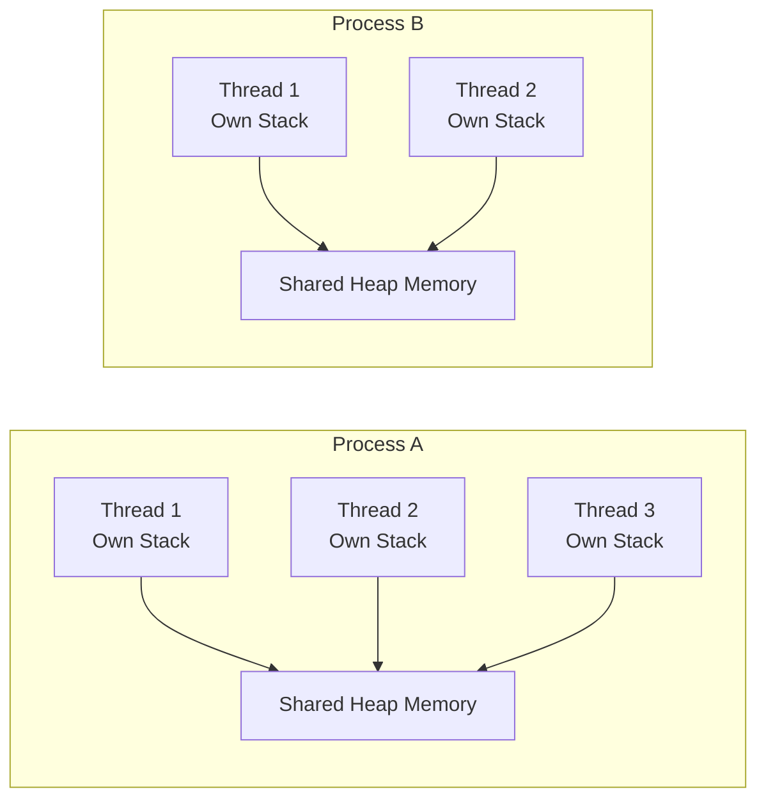
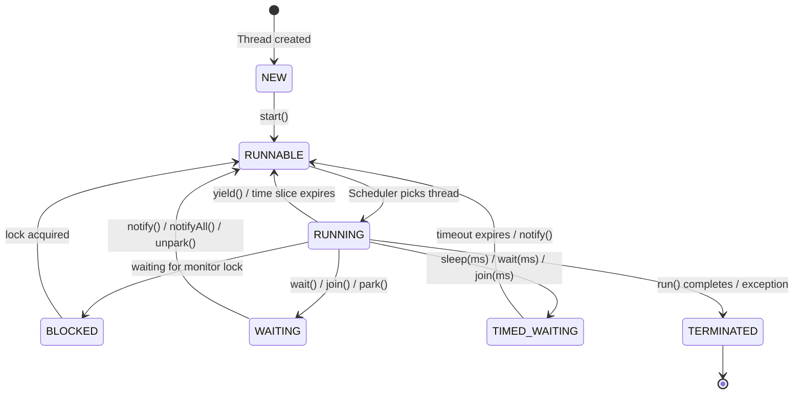
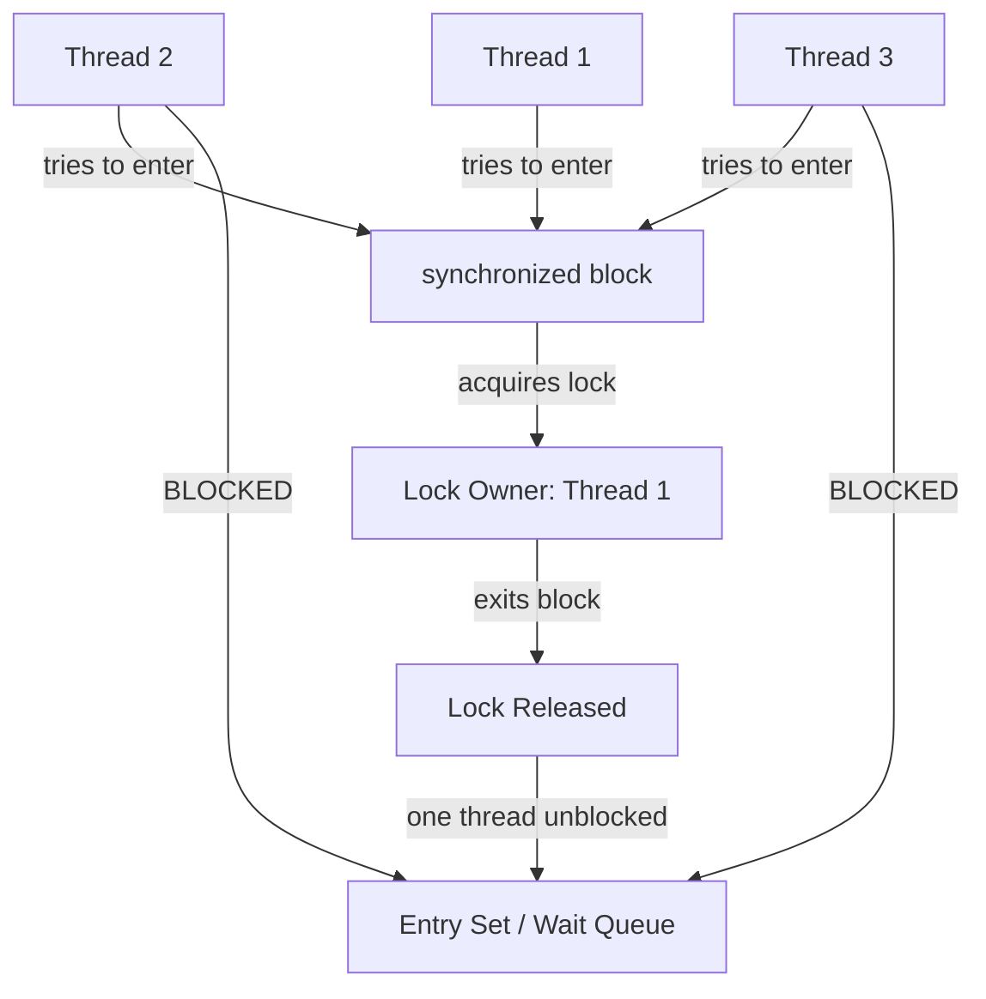
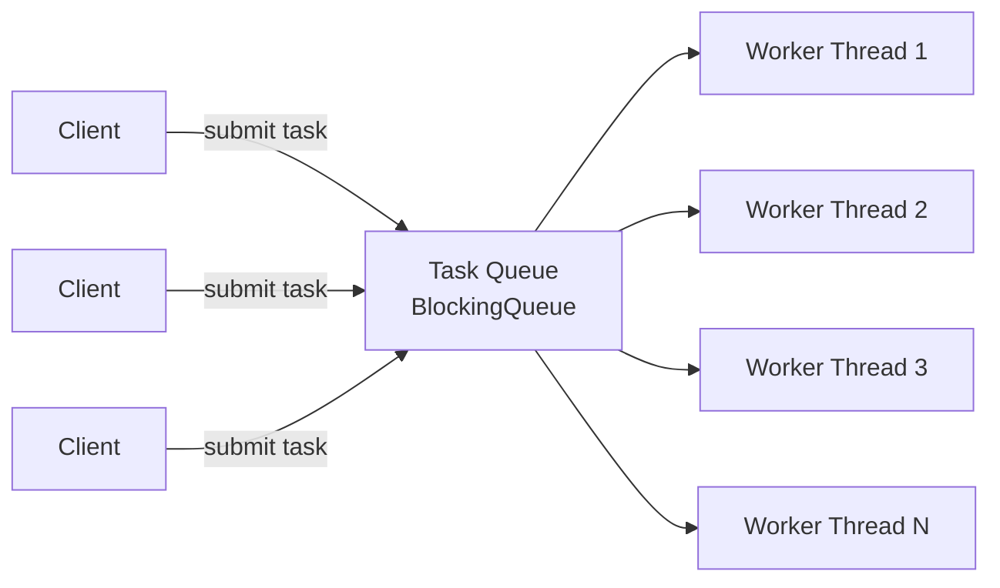

# Multithreading in Java

Multithreading is the foundation of concurrent programming in Java. It allows multiple tasks to execute simultaneously within a single process, enabling efficient CPU utilization, responsive applications, and high-throughput systems. This is one of the most critical topics in FAANG interviews — understanding threads, synchronization, and concurrency primitives separates senior engineers from the rest.

---

## Process vs Thread

A **process** is an independent program with its own memory space. A **thread** is the smallest unit of CPU execution that runs within a process and shares its memory.


```mermaid
graph LR
    subgraph Process A
        direction TB
        A_HEAP[Shared Heap Memory]
        A_T1[Thread 1<br/>Own Stack]
        A_T2[Thread 2<br/>Own Stack]
        A_T3[Thread 3<br/>Own Stack]
        A_T1 --> A_HEAP
        A_T2 --> A_HEAP
        A_T3 --> A_HEAP
    end
    subgraph Process B
        direction TB
        B_HEAP[Shared Heap Memory]
        B_T1[Thread 1<br/>Own Stack]
        B_T2[Thread 2<br/>Own Stack]
        B_T1 --> B_HEAP
        B_T2 --> B_HEAP
    end
```

| Aspect | Process | Thread |
|---|---|---|
| Memory | Separate address space | Shares heap, has own stack |
| Creation cost | Expensive (OS-level) | Lightweight (within JVM) |
| Communication | IPC (pipes, sockets) | Direct shared memory access |
| Isolation | Crash doesn't affect others | Crash can bring down the process |
| Context switch | Slow (full memory swap) | Fast (only stack + registers) |

---

## Thread Creation

### 1. Extending Thread Class

```java
public class DownloadThread extends Thread {
    private final String url;

    public DownloadThread(String url) {
        this.url = url;
    }

    @Override
    public void run() {
        System.out.println(Thread.currentThread().getName() + " downloading: " + url);
    }
}

// Usage
DownloadThread thread = new DownloadThread("https://example.com/file.zip");
thread.start();  // creates new thread and invokes run()
```

### 2. Implementing Runnable (Preferred)

```java
public class DownloadTask implements Runnable {
    private final String url;

    public DownloadTask(String url) {
        this.url = url;
    }

    @Override
    public void run() {
        System.out.println(Thread.currentThread().getName() + " downloading: " + url);
    }
}

// Usage — separates task from thread management
Thread thread = new Thread(new DownloadTask("https://example.com/file.zip"));
thread.start();

// Lambda style (Java 8+)
Thread thread = new Thread(() -> System.out.println("Running in: " + Thread.currentThread().getName()));
thread.start();
```

### 3. Callable + Future (Returns a Result)

```java
public class PriceCalculator implements Callable<Double> {
    private final String ticker;

    public PriceCalculator(String ticker) {
        this.ticker = ticker;
    }

    @Override
    public Double call() throws Exception {
        // Simulate API call
        Thread.sleep(1000);
        return Math.random() * 1000;
    }
}

// Usage with ExecutorService
ExecutorService executor = Executors.newFixedThreadPool(4);
Future<Double> future = executor.submit(new PriceCalculator("GOOG"));

// Do other work...
Double price = future.get();  // blocks until result is available
executor.shutdown();
```

### Thread vs Runnable vs Callable

| Feature | Thread | Runnable | Callable |
|---|---|---|---|
| Return value | No | No | Yes (`Future<T>`) |
| Checked exceptions | No | No | Yes |
| Inheritance | Extends Thread (uses up single inheritance) | Implements interface | Implements interface |
| Reusability | Low — tied to Thread class | High — decouples task from thread | High |
| Use with thread pools | No | Yes | Yes |

**Best practice**: Always prefer `Runnable` or `Callable` over extending `Thread` — they support composition, thread pools, and separation of concerns.

---

## Thread Lifecycle


```mermaid
stateDiagram-v2
    [*] --> NEW : Thread created
    NEW --> RUNNABLE : start()
    RUNNABLE --> RUNNING : Scheduler picks thread
    RUNNING --> RUNNABLE : yield() / time slice expires
    RUNNING --> BLOCKED : waiting for monitor lock
    RUNNING --> WAITING : wait() / join() / park()
    RUNNING --> TIMED_WAITING : sleep(ms) / wait(ms) / join(ms)
    BLOCKED --> RUNNABLE : lock acquired
    WAITING --> RUNNABLE : notify() / notifyAll() / unpark()
    TIMED_WAITING --> RUNNABLE : timeout expires / notify()
    RUNNING --> TERMINATED : run() completes / exception
    TERMINATED --> [*]
```

| State | Description | How to enter |
|---|---|---|
| `NEW` | Thread object created, not yet started | `new Thread(runnable)` |
| `RUNNABLE` | Ready to run, waiting for CPU time | `start()`, or lock acquired |
| `RUNNING` | Currently executing on CPU | Scheduler assigns CPU |
| `BLOCKED` | Waiting to acquire a monitor lock | Entering `synchronized` block |
| `WAITING` | Waiting indefinitely for another thread | `wait()`, `join()`, `LockSupport.park()` |
| `TIMED_WAITING` | Waiting with a timeout | `sleep(ms)`, `wait(ms)`, `join(ms)` |
| `TERMINATED` | Execution complete | `run()` returns or throws exception |

---

## Essential Thread Methods

### start() vs run()

```java
Thread t = new Thread(() -> System.out.println("Running in: " + Thread.currentThread().getName()));

t.start();  // Creates a NEW thread, executes run() in that thread
t.run();    // Does NOT create a new thread — runs in caller's thread (like a regular method call)
```

**Critical**: Calling `start()` twice on the same thread throws `IllegalThreadStateException`.

### sleep() — Pause Execution

```java
try {
    Thread.sleep(2000);  // Current thread sleeps for 2 seconds
} catch (InterruptedException e) {
    Thread.currentThread().interrupt();  // Restore interrupt flag
}
```

- Does NOT release any locks held by the thread
- Throws `InterruptedException` if another thread interrupts it

### join() — Wait for Another Thread

```java
Thread worker = new Thread(() -> {
    // Long computation
    computeResult();
});
worker.start();
worker.join();  // Current thread waits until worker finishes
// Now safe to use worker's result
```

- `join(long millis)` — wait with timeout
- If main thread calls `worker.join()`, main enters WAITING state until worker terminates

### yield() — Hint to Scheduler

```java
Thread.yield();  // Suggests the scheduler give other threads a chance
```

- Just a hint — scheduler may ignore it
- Rarely used in production code

### interrupt() — Cooperative Cancellation

```java
Thread worker = new Thread(() -> {
    while (!Thread.currentThread().isInterrupted()) {
        // Do work
        try {
            Thread.sleep(100);
        } catch (InterruptedException e) {
            Thread.currentThread().interrupt();  // Re-set flag
            break;  // Exit gracefully
        }
    }
});
worker.start();

// Later — request cancellation
worker.interrupt();
```

- Does NOT forcefully stop a thread — it sets a flag
- Thread must check `isInterrupted()` or handle `InterruptedException`
- Blocking methods (`sleep`, `wait`, `join`) throw `InterruptedException` when interrupted

---

## Thread Priority and Daemon Threads

### Thread Priority

```java
Thread t = new Thread(task);
t.setPriority(Thread.MAX_PRIORITY);  // 10
t.setPriority(Thread.MIN_PRIORITY);  // 1
t.setPriority(Thread.NORM_PRIORITY); // 5 (default)
```

- Priorities are **hints** to the thread scheduler — no guarantees
- Child threads inherit priority from parent
- Different OS schedulers handle priorities differently — do NOT rely on them for correctness

### Daemon Threads

```java
Thread daemon = new Thread(() -> {
    while (true) {
        cleanupExpiredSessions();
        Thread.sleep(60_000);
    }
});
daemon.setDaemon(true);  // Must be set BEFORE start()
daemon.start();
```

- **Daemon threads** run in the background and do NOT prevent JVM shutdown
- When all non-daemon threads finish, JVM exits (killing daemon threads abruptly)
- Examples: Garbage Collector, signal handlers, monitoring threads
- **User (non-daemon) threads** keep the JVM alive until they complete

---

## Synchronization

When multiple threads access shared mutable state, you get **race conditions**. Synchronization ensures only one thread accesses a critical section at a time.

### Method-Level Synchronization

```java
public class BankAccount {
    private double balance;

    // Only one thread can execute this method per object instance
    public synchronized void deposit(double amount) {
        balance += amount;
    }

    public synchronized void withdraw(double amount) {
        if (balance >= amount) {
            balance -= amount;
        }
    }

    public synchronized double getBalance() {
        return balance;
    }
}
```

### Block-Level Synchronization (Preferred)

```java
public class BankAccount {
    private double balance;
    private final Object lock = new Object();  // Dedicated lock object

    public void deposit(double amount) {
        synchronized (lock) {  // Only lock critical section
            balance += amount;
        }
        // Non-critical code runs without lock — better throughput
        notifyObservers();
    }

    public void transfer(BankAccount target, double amount) {
        synchronized (this.lock) {
            synchronized (target.lock) {  // Beware: deadlock potential!
                this.balance -= amount;
                target.balance += amount;
            }
        }
    }
}
```

### How Intrinsic Locks (Monitors) Work


```mermaid
graph TD
    T1[Thread 1] -->|tries to enter| SYNC[synchronized block]
    T2[Thread 2] -->|tries to enter| SYNC
    T3[Thread 3] -->|tries to enter| SYNC
    SYNC -->|acquires lock| OWNER[Lock Owner: Thread 1]
    T2 -->|BLOCKED| QUEUE[Entry Set / Wait Queue]
    T3 -->|BLOCKED| QUEUE
    OWNER -->|exits block| RELEASE[Lock Released]
    RELEASE -->|one thread unblocked| QUEUE
```

- Every Java object has an **intrinsic lock** (monitor)
- `synchronized` acquires the lock on entry, releases on exit (even if exception thrown)
- Static synchronized methods lock on the **Class object** (`ClassName.class`)
- Intrinsic locks are **reentrant** — a thread can re-acquire a lock it already holds

---

## wait(), notify(), notifyAll()

These methods enable **inter-thread communication** — one thread waits for a condition, another signals when the condition is met.

### Rules

- Must be called from within a `synchronized` block (thread must hold the monitor)
- `wait()` releases the lock and enters WAITING state
- `notify()` wakes one waiting thread; `notifyAll()` wakes all
- Waiting thread must re-acquire the lock before resuming

### Producer-Consumer Pattern

```java
public class BoundedBuffer<T> {
    private final Queue<T> queue = new LinkedList<>();
    private final int capacity;

    public BoundedBuffer(int capacity) {
        this.capacity = capacity;
    }

    public synchronized void produce(T item) throws InterruptedException {
        while (queue.size() == capacity) {  // Always use while, not if!
            wait();  // Buffer full — wait for consumer
        }
        queue.add(item);
        notifyAll();  // Wake up consumers
    }

    public synchronized T consume() throws InterruptedException {
        while (queue.isEmpty()) {  // Always use while, not if!
            wait();  // Buffer empty — wait for producer
        }
        T item = queue.poll();
        notifyAll();  // Wake up producers
        return item;
    }
}
```

**Why `while` and not `if`?** Spurious wakeups can occur — the thread may wake up without being notified. Always re-check the condition.

### wait() vs sleep()

| Aspect | `wait()` | `sleep()` |
|---|---|---|
| Called on | Object (monitor) | Thread (static method) |
| Releases lock | Yes | No |
| Wakeup | `notify()` / `notifyAll()` | Timeout expires |
| Must be in synchronized | Yes (throws `IllegalMonitorStateException` otherwise) | No |
| Purpose | Inter-thread communication | Pause execution |

---

## Thread Pools and ExecutorService

Creating threads manually is expensive and unmanageable. Thread pools reuse a fixed set of threads to execute many tasks.

### Thread Pool Architecture


```mermaid
graph LR
    TASKS[Task Queue<br/>BlockingQueue] --> T1[Worker Thread 1]
    TASKS --> T2[Worker Thread 2]
    TASKS --> T3[Worker Thread 3]
    TASKS --> TN[Worker Thread N]
    CLIENT1[Client] -->|submit task| TASKS
    CLIENT2[Client] -->|submit task| TASKS
    CLIENT3[Client] -->|submit task| TASKS
```

### Types of Thread Pools

```java
// Fixed Thread Pool — best for known workloads
ExecutorService fixed = Executors.newFixedThreadPool(
    Runtime.getRuntime().availableProcessors()
);

// Cached Thread Pool — for short-lived async tasks
ExecutorService cached = Executors.newCachedThreadPool();

// Scheduled Thread Pool — for periodic/delayed tasks
ScheduledExecutorService scheduled = Executors.newScheduledThreadPool(4);

// Single Thread Executor — guarantees sequential execution
ExecutorService single = Executors.newSingleThreadExecutor();

// Work-Stealing Pool (Java 8+) — for parallel divide-and-conquer
ExecutorService forkJoin = Executors.newWorkStealingPool();
```

| Thread Pool | Core Threads | Max Threads | Queue | Best For |
|---|---|---|---|---|
| `FixedThreadPool` | N | N | Unbounded `LinkedBlockingQueue` | CPU-bound tasks with known load |
| `CachedThreadPool` | 0 | Integer.MAX_VALUE | `SynchronousQueue` | Many short-lived I/O tasks |
| `ScheduledThreadPool` | N | Integer.MAX_VALUE | `DelayedWorkQueue` | Periodic/delayed tasks |
| `SingleThreadExecutor` | 1 | 1 | Unbounded `LinkedBlockingQueue` | Sequential task ordering |
| `ForkJoinPool` | N (processors) | N | Per-thread work queues | Recursive divide-and-conquer |

### Ideal Pool Size

- **CPU-bound tasks**: `threads = number of CPU cores` (more threads cause context-switching overhead)
- **I/O-bound tasks**: `threads = cores * (1 + wait_time / compute_time)` — typically 2x to 10x cores
- **Mixed**: Use separate pools for CPU-bound and I/O-bound work

### ExecutorService Usage

```java
ExecutorService executor = Executors.newFixedThreadPool(8);

// Submit tasks
Future<String> future = executor.submit(() -> fetchFromApi());
executor.execute(() -> fireAndForgetTask());  // no result needed

// Batch execution
List<Callable<String>> tasks = List.of(
    () -> callService("A"),
    () -> callService("B"),
    () -> callService("C")
);
List<Future<String>> results = executor.invokeAll(tasks);  // waits for all

// Graceful shutdown
executor.shutdown();  // no new tasks, finish existing
if (!executor.awaitTermination(30, TimeUnit.SECONDS)) {
    executor.shutdownNow();  // interrupt running tasks
}
```

### ForkJoinPool — Divide and Conquer

```java
public class MergeSortTask extends RecursiveAction {
    private final int[] array;
    private final int left, right;

    @Override
    protected void compute() {
        if (right - left < THRESHOLD) {
            Arrays.sort(array, left, right);  // base case
            return;
        }
        int mid = (left + right) / 2;
        MergeSortTask leftTask = new MergeSortTask(array, left, mid);
        MergeSortTask rightTask = new MergeSortTask(array, mid, right);
        invokeAll(leftTask, rightTask);  // fork both, join both
        merge(array, left, mid, right);
    }
}

ForkJoinPool pool = new ForkJoinPool();
pool.invoke(new MergeSortTask(array, 0, array.length));
```

---

## Virtual Threads (Java 21 — Project Loom)

Virtual threads are lightweight threads managed by the JVM (not OS). They enable writing blocking code that scales like async code.

### Platform Threads vs Virtual Threads

| Aspect | Platform Thread | Virtual Thread |
|---|---|---|
| Managed by | OS kernel | JVM scheduler |
| Memory | ~1 MB stack | ~few KB (grows as needed) |
| Creation cost | Expensive | Cheap (millions possible) |
| Blocking behavior | Blocks OS thread | Unmounts from carrier, frees OS thread |
| Best for | CPU-bound work | I/O-bound work |

### Creating Virtual Threads

```java
// Single virtual thread
Thread vThread = Thread.ofVirtual().name("worker-1").start(() -> {
    String result = blockingHttpCall();  // OK to block — cheap!
    processResult(result);
});

// Virtual thread per task executor (replaces CachedThreadPool for I/O)
try (var executor = Executors.newVirtualThreadPerTaskExecutor()) {
    List<Future<String>> futures = IntStream.range(0, 10_000)
        .mapToObj(i -> executor.submit(() -> fetchData(i)))
        .toList();

    for (Future<String> future : futures) {
        System.out.println(future.get());
    }
}  // auto-shutdown
```

### Structured Concurrency (Preview — Java 21+)

```java
try (var scope = new StructuredTaskScope.ShutdownOnFailure()) {
    Subtask<User> userTask = scope.fork(() -> fetchUser(userId));
    Subtask<List<Order>> ordersTask = scope.fork(() -> fetchOrders(userId));

    scope.join();           // Wait for all
    scope.throwIfFailed();  // Propagate exceptions

    return new UserProfile(userTask.get(), ordersTask.get());
}
// If any subtask fails, all others are cancelled automatically
```

### When to Use Virtual Threads

- **Use**: High-concurrency I/O-bound workloads (HTTP servers, database calls, microservices)
- **Avoid**: CPU-intensive computations (virtual threads don't add parallelism)
- **Avoid**: Tasks holding native resources or using `synchronized` with blocking (use `ReentrantLock` instead)

---

## Common Concurrency Problems

### Race Condition

Two threads read-modify-write shared state without synchronization.

```java
// BUG: race condition — counter++ is NOT atomic
private int counter = 0;

public void increment() {
    counter++;  // read → increment → write (3 steps, not atomic)
}

// FIX: use synchronization or AtomicInteger
private final AtomicInteger counter = new AtomicInteger(0);

public void increment() {
    counter.incrementAndGet();  // atomic compare-and-swap
}
```

### Deadlock

Two threads each hold a lock and wait for the other's lock — neither can proceed.

```java
// Thread 1: lock A → tries lock B
// Thread 2: lock B → tries lock A
// DEADLOCK!

// Prevention: always acquire locks in consistent global order
synchronized (lockA) {      // Both threads acquire A first
    synchronized (lockB) {  // Then B
        // safe
    }
}
```

### Livelock

Threads keep responding to each other but make no progress — like two people in a hallway who keep stepping aside in the same direction.

### Thread Starvation

Low-priority threads never get CPU time because high-priority threads dominate the scheduler. Also occurs with unfair locks.

### Prevention Strategies

| Problem | Prevention |
|---|---|
| Race condition | Synchronization, atomic variables, immutable objects |
| Deadlock | Consistent lock ordering, timeout-based locks, lock-free algorithms |
| Livelock | Add randomization to retry logic |
| Starvation | Fair locks (`new ReentrantLock(true)`), avoid priority abuse |

---

## Best Practices

1. **Prefer `ExecutorService` over raw threads** — manual thread management is error-prone
2. **Favor immutability** — immutable objects are inherently thread-safe (no synchronization needed)
3. **Use thread-safe collections** — `ConcurrentHashMap`, `CopyOnWriteArrayList`, `BlockingQueue`
4. **Minimize lock scope** — hold locks for the shortest time possible
5. **Prefer `ReentrantLock` over `synchronized`** for complex scenarios (timeout, tryLock, fairness)
6. **Use `volatile` for visibility** — when only one thread writes and others read a flag
7. **Never swallow `InterruptedException`** — always restore the interrupt flag
8. **Use virtual threads for I/O-bound work** (Java 21+) — write simple blocking code that scales
9. **Name your threads** — critical for debugging (`Thread.ofPlatform().name("order-processor-%d")`)
10. **Always shut down executors** — use try-with-resources (Java 19+) or `shutdown()` in a finally block

---

## Interview Questions

??? question "1. What is the difference between start() and run()?"
    `start()` creates a new OS-level thread and invokes `run()` in that new thread — this is proper multithreading. Calling `run()` directly does NOT create a new thread; it executes as a normal method call in the current thread. Additionally, calling `start()` twice on the same thread throws `IllegalThreadStateException`.

??? question "2. Explain the difference between wait() and sleep(). When would you use each?"
    `sleep()` pauses the current thread for a specified time without releasing any locks — used for simple delays or rate limiting. `wait()` releases the intrinsic lock and puts the thread into WAITING state until another thread calls `notify()`/`notifyAll()` — used for inter-thread communication (e.g., producer-consumer). `wait()` must be called inside a `synchronized` block; `sleep()` can be called anywhere.

??? question "3. How do you prevent deadlocks in a system?"
    Four conditions must hold simultaneously for deadlock: mutual exclusion, hold-and-wait, no preemption, and circular wait. Break any one to prevent deadlock. Practical strategies: (1) acquire locks in a consistent global order, (2) use `tryLock()` with timeout instead of indefinite blocking, (3) use lock-free data structures (`AtomicReference`, `ConcurrentHashMap`), (4) minimize the number of locks held simultaneously.

??? question "4. What is the ideal thread pool size and why?"
    For CPU-bound tasks: `pool size = number of CPU cores` — more threads just add context-switching overhead. For I/O-bound tasks: `pool size = cores * (1 + wait_time / compute_time)` — threads spend most time waiting, so you need more to keep CPUs busy. The worst practice is using `CachedThreadPool` for unbounded workloads — it can create thousands of threads and crash the system.

??? question "5. What are virtual threads and how do they differ from platform threads?"
    Virtual threads (Java 21, Project Loom) are JVM-managed lightweight threads. Unlike platform threads (one-to-one mapping with OS threads, ~1MB stack), virtual threads use only a few KB and can number in the millions. When a virtual thread blocks on I/O, the JVM unmounts it from the carrier thread, freeing the OS thread for other work. This allows writing simple blocking code that scales like reactive/async code — without callback complexity.

??? question "6. Why should you always use `while` instead of `if` when checking conditions with wait()?"
    Spurious wakeups can occur — the JVM spec permits a thread to wake from `wait()` without being notified. Also, with `notifyAll()`, multiple waiting threads wake up but only one can proceed. Using `while` ensures the condition is re-verified after every wakeup. Using `if` can lead to threads proceeding when the condition is no longer true, causing bugs that are extremely hard to reproduce.

??? question "7. Explain the difference between synchronized, volatile, and AtomicInteger."
    `synchronized` provides mutual exclusion (only one thread in a critical section) and memory visibility — but has overhead from lock acquisition. `volatile` guarantees memory visibility (all threads see the latest value) but does NOT provide atomicity — `volatile int x; x++` is still a race condition. `AtomicInteger` provides both visibility and atomicity via lock-free CAS (compare-and-swap) operations — best for simple counters without needing broader critical sections.

??? question "8. A service handles 10,000 concurrent HTTP requests. How do you design the threading?"
    Use virtual threads (Java 21) with `Executors.newVirtualThreadPerTaskExecutor()` — each request gets its own virtual thread that can block on I/O without wasting OS threads. Pre-Java 21: use a bounded `FixedThreadPool` for CPU work and a larger pool for I/O, with a `BlockingQueue` to buffer requests. Add timeouts, circuit breakers, and backpressure. Never use `CachedThreadPool` — unbounded thread creation will crash under load.

---

## Related Topics

- [Locks](Locks.md) — ReentrantLock, ReadWriteLock, StampedLock
- [volatile & Atomics](VolatileAtomics.md) — Thread-safe variables without locks
- [CompletableFuture](CompletableFuture.md) — Async programming in Java
- [Concurrent Collections](ConcurrentCollections.md) — Thread-safe data structures
- [Deadlocks](deadlocks.md) — Detection and prevention
